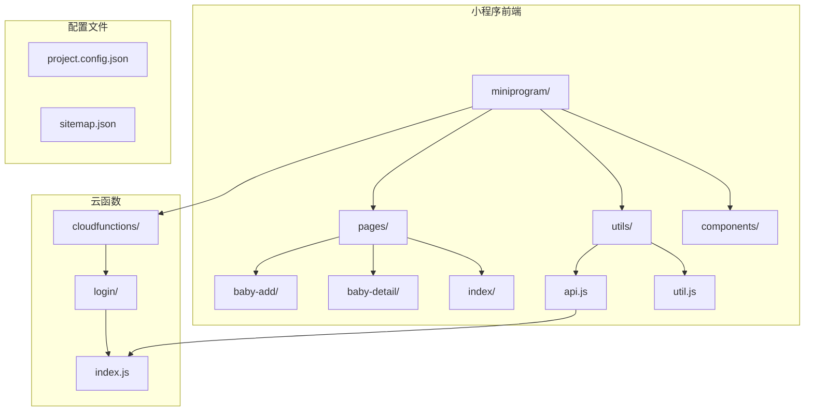
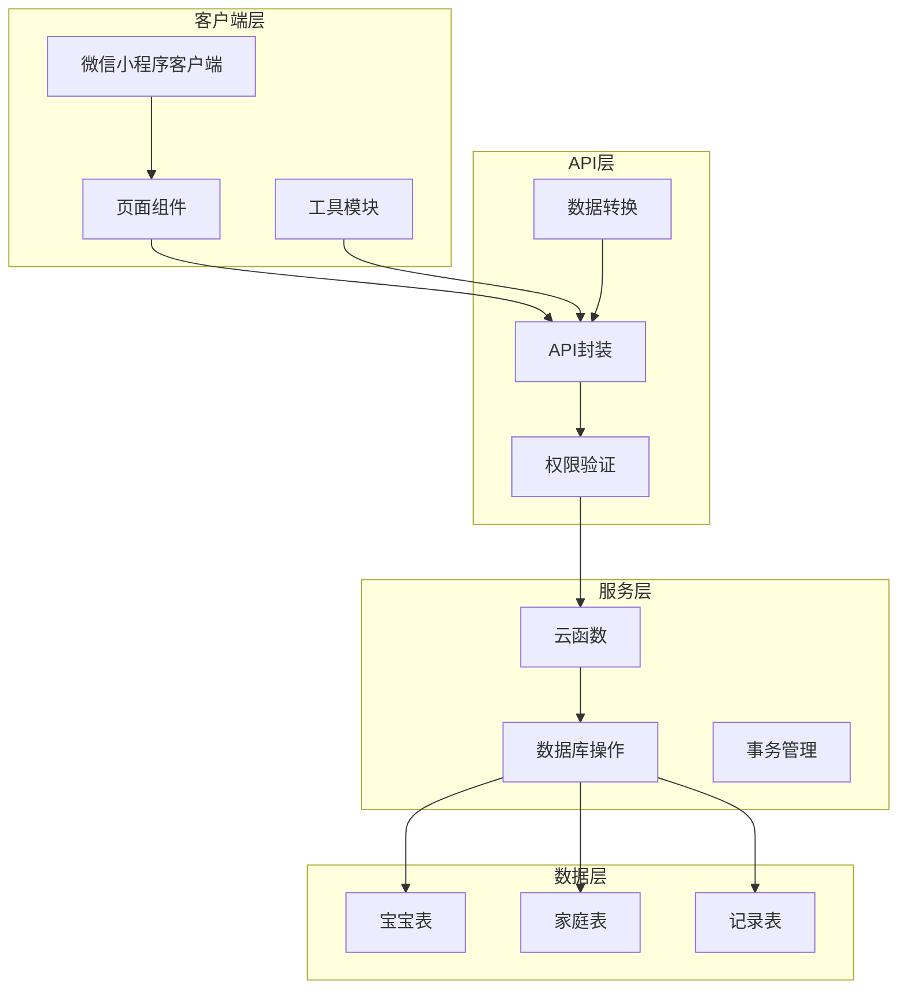
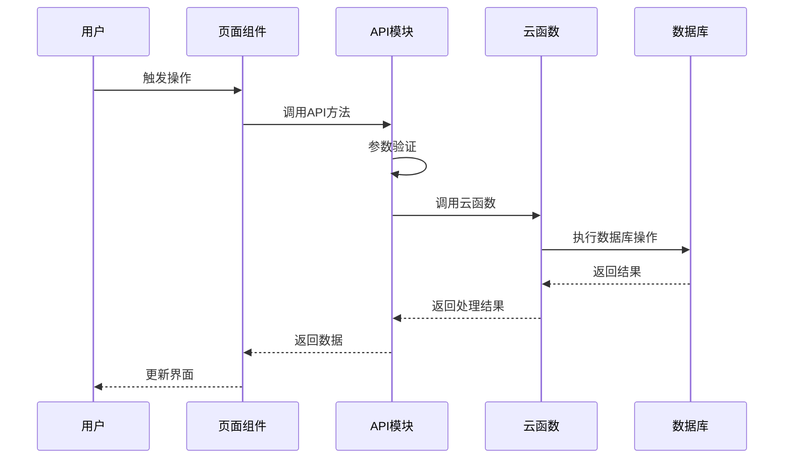
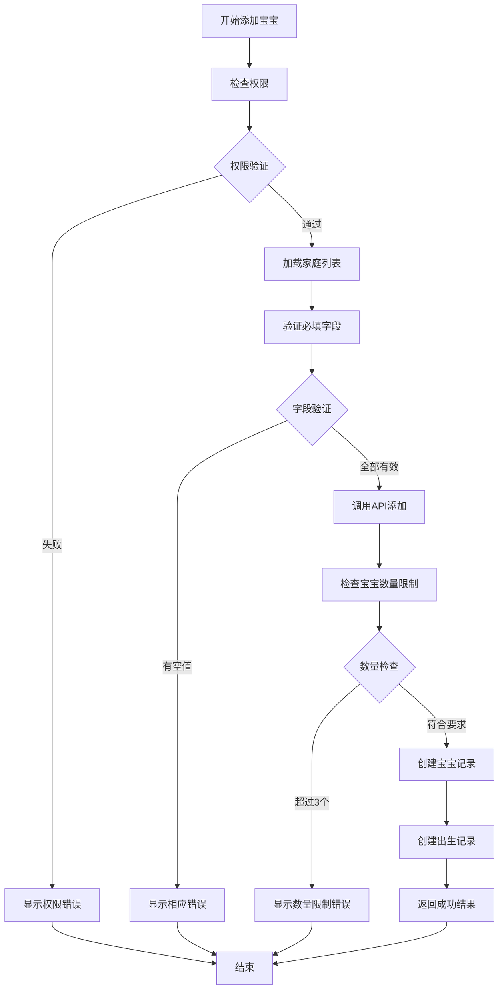
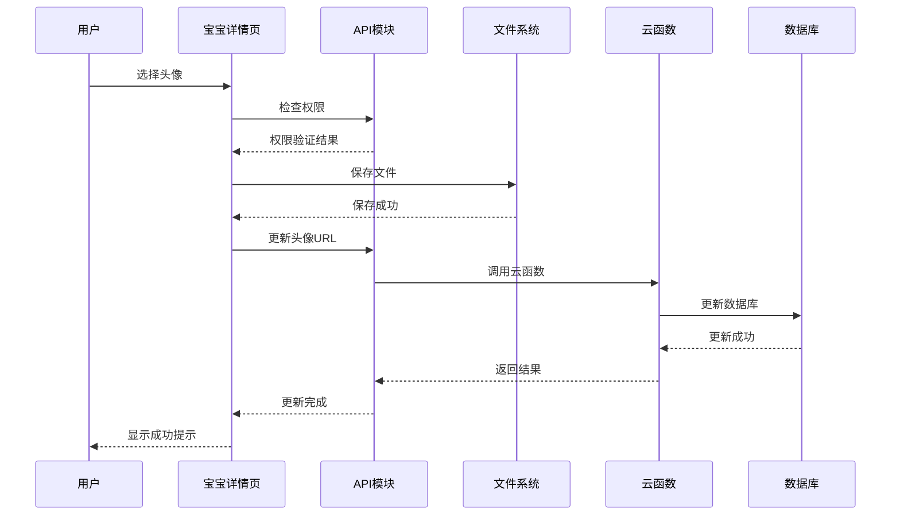
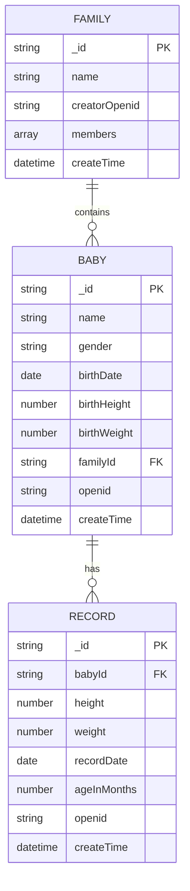
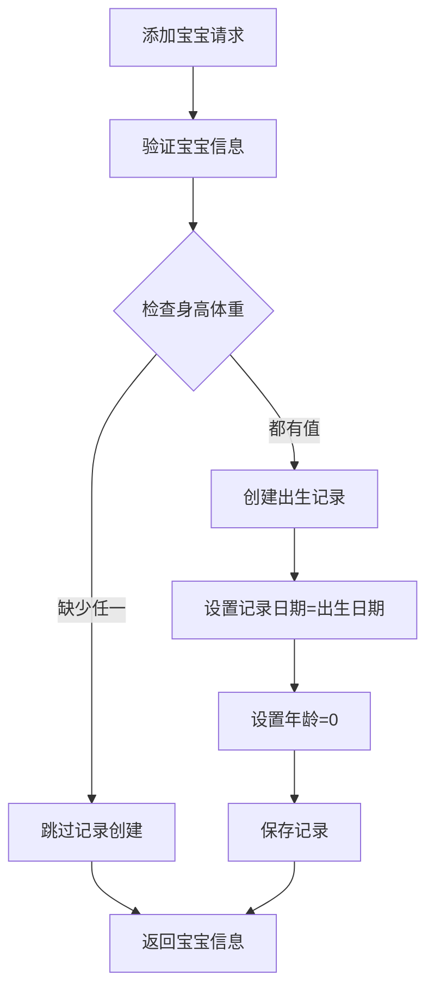
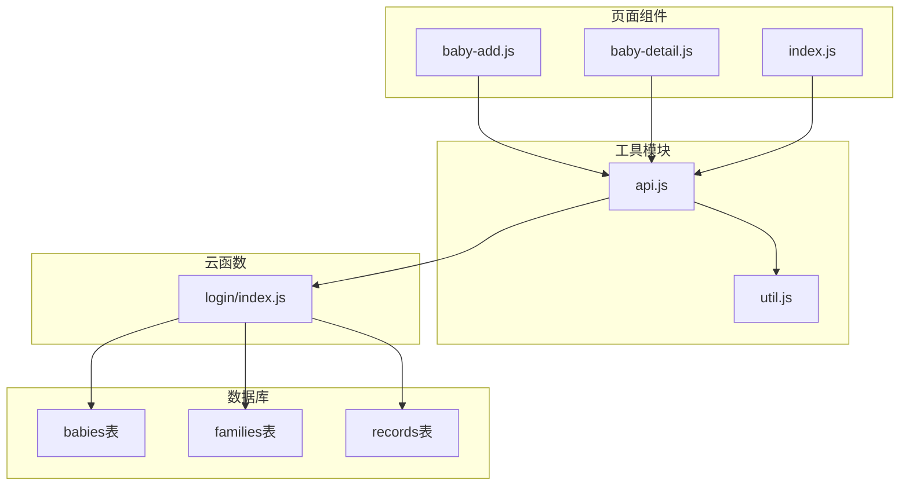

# 宝宝信息管理

<cite>
**本文档引用的文件**
- [miniprogram/pages/baby-add/baby-add.js](file://miniprogram/pages/baby-add/baby-add.js)
- [miniprogram/pages/baby-detail/baby-detail.js](file://miniprogram/pages/baby-detail/baby-detail.js)
- [miniprogram/utils/api.js](file://miniprogram/utils/api.js)
- [miniprogram/utils/util.js](file://miniprogram/utils/util.js)
- [cloudfunctions/login/index.js](file://cloudfunctions/login/index.js)
- [miniprogram/pages/baby-add/baby-add.json](file://miniprogram/pages/baby-add/baby-add.json)
- [miniprogram/pages/baby-detail/baby-detail.json](file://miniprogram/pages/baby-detail/baby-detail.json)
</cite>

## 目录
1. [简介](#简介)
2. [项目结构](#项目结构)
3. [核心组件](#核心组件)
4. [架构概览](#架构概览)
5. [详细组件分析](#详细组件分析)
6. [依赖关系分析](#依赖关系分析)
7. [性能考虑](#性能考虑)
8. [故障排除指南](#故障排除指南)
9. [结论](#结论)

## 简介

宝宝信息管理模块是BabyAssistant微信小程序的核心功能之一，负责管理家庭中宝宝的基本信息、成长记录和相关操作。该模块实现了完整的CRUD操作，包括宝宝信息的创建、读取、更新和删除，同时集成了家庭关系绑定、权限控制、数据验证和头像上传等功能。

系统采用前后端分离架构，前端使用微信小程序框架，后端通过云函数提供API服务，确保数据安全和权限控制。模块支持最多3个宝宝的家庭限制，提供直观的用户界面和完善的错误处理机制。

## 项目结构

项目采用按功能模块组织的结构，主要包含以下目录：

**图表来源**
- [miniprogram/pages/baby-add/baby-add.js:1-120](file://miniprogram/pages/baby-add/baby-add.js#L1-L120)
- [miniprogram/pages/baby-detail/baby-detail.js:1-691](file://miniprogram/pages/baby-detail/baby-detail.js#L1-L691)
- [miniprogram/utils/api.js:1-879](file://miniprogram/utils/api.js#L1-L879)
- [cloudfunctions/login/index.js:1-814](file://cloudfunctions/login/index.js#L1-L814)

**章节来源**
- [miniprogram/pages/baby-add/baby-add.json:1-5](file://miniprogram/pages/baby-add/baby-add.json#L1-L5)
- [miniprogram/pages/baby-detail/baby-detail.json:1-8](file://miniprogram/pages/baby-detail/baby-detail.json#L1-L8)

## 核心组件

### 页面组件

系统包含三个核心页面组件：

1. **宝宝添加页面** (`baby-add`)
   - 负责宝宝基本信息录入
   - 家庭选择和权限验证
   - 表单验证和提交处理

2. **宝宝详情页面** (`baby-detail`)
   - 展示宝宝完整信息
   - 成长记录图表展示
   - 头像上传和姓名修改
   - 记录管理和删除

3. **工具类组件**
   - API封装模块
   - 工具函数模块
   - 图表组件

### 云函数服务

云函数提供安全的数据访问和业务逻辑处理：

- 宝宝信息管理
- 家庭关系查询
- 权限验证和控制
- 事务性操作保证

**章节来源**
- [miniprogram/pages/baby-add/baby-add.js:1-120](file://miniprogram/pages/baby-add/baby-add.js#L1-L120)
- [miniprogram/pages/baby-detail/baby-detail.js:1-691](file://miniprogram/pages/baby-detail/baby-detail.js#L1-L691)
- [miniprogram/utils/api.js:1-879](file://miniprogram/utils/api.js#L1-L879)

## 架构概览

系统采用三层架构设计，确保数据安全和业务逻辑清晰分离：

**图表来源**
- [miniprogram/utils/api.js:1-879](file://miniprogram/utils/api.js#L1-L879)
- [cloudfunctions/login/index.js:1-814](file://cloudfunctions/login/index.js#L1-L814)

### 数据流图

**图表来源**
- [miniprogram/utils/api.js:149-210](file://miniprogram/utils/api.js#L149-L210)
- [cloudfunctions/login/index.js:482-510](file://cloudfunctions/login/index.js#L482-L510)

## 详细组件分析

### 宝宝添加功能

#### 表单验证逻辑

**图表来源**
- [miniprogram/pages/baby-add/baby-add.js:74-118](file://miniprogram/pages/baby-add/baby-add.js#L74-L118)
- [miniprogram/utils/api.js:150-210](file://miniprogram/utils/api.js#L150-L210)

#### 宝宝数量限制机制

系统实施了严格的宝宝数量限制机制：

1. **家庭维度限制**：每个家庭最多只能有3个宝宝
2. **实时检查**：添加前实时查询当前家庭的宝宝数量
3. **防并发冲突**：通过云函数事务确保数据一致性

**章节来源**
- [miniprogram/utils/api.js:176-181](file://miniprogram/utils/api.js#L176-L181)
- [cloudfunctions/login/index.js:482-510](file://cloudfunctions/login/index.js#L482-L510)

### 头像上传和更新功能

#### 头像处理流程

**图表来源**
- [miniprogram/pages/baby-detail/baby-detail.js:538-590](file://miniprogram/pages/baby-detail/baby-detail.js#L538-L590)
- [miniprogram/utils/api.js:376-401](file://miniprogram/utils/api.js#L376-L401)

#### 权限控制机制

头像更新功能严格遵循权限控制：

- **一级助教权限**：拥有所有宝宝的头像更新权限
- **权限验证**：每次操作前检查用户权限
- **安全保护**：防止越权访问和恶意操作

**章节来源**
- [miniprogram/pages/baby-detail/baby-detail.js:538-590](file://miniprogram/pages/baby-detail/baby-detail.js#L538-L590)
- [miniprogram/utils/api.js:376-401](file://miniprogram/utils/api.js#L376-L401)

### 姓名验证规则

#### 验证逻辑

系统实施了严格的姓名验证规则：

1. **长度限制**：姓名长度必须在1-7个字符之间
2. **空值检查**：姓名不能为空
3. **实时验证**：前端和后端双重验证
4. **权限控制**：仅限一级助教修改姓名

**章节来源**
- [miniprogram/pages/baby-detail/baby-detail.js:487-536](file://miniprogram/pages/baby-detail/baby-detail.js#L487-L536)
- [miniprogram/utils/api.js:403-433](file://miniprogram/utils/api.js#L403-L433)

### 家庭关系绑定

#### 关系映射

**图表来源**
- [cloudfunctions/login/index.js:556-577](file://cloudfunctions/login/index.js#L556-L577)
- [cloudfunctions/login/index.js:579-605](file://cloudfunctions/login/index.js#L579-L605)

#### 家庭权限体系

系统建立了完整的家庭权限管理体系：

- **查看者**：只能查看家庭信息
- **二级助教**：可添加和查看记录
- **一级助教**：拥有最高权限，可管理所有内容

**章节来源**
- [miniprogram/utils/api.js:782-852](file://miniprogram/utils/api.js#L782-L852)
- [cloudfunctions/login/index.js:482-510](file://cloudfunctions/login/index.js#L482-L510)

### API接口文档

#### addBaby() 方法

**功能**：添加新宝宝信息

**参数**：
- `familyId` (string): 家庭ID
- `name` (string): 宝宝姓名（1-7字符）
- `gender` (string): 性别（male/female）
- `birthDate` (date): 出生日期
- `birthHeight` (number): 出生身高
- `birthWeight` (number): 出生体重

**返回值**：
- `object`: 新创建的宝宝对象

**错误处理**：
- 家庭ID缺失
- 宝宝数量超过限制
- 数据验证失败

**章节来源**
- [miniprogram/utils/api.js:149-210](file://miniprogram/utils/api.js#L149-L210)

#### updateBabyAvatar() 方法

**功能**：更新宝宝头像

**参数**：
- `id` (string): 宝宝ID
- `avatarUrl` (string): 头像文件路径

**返回值**：
- `object`: 操作结果

**错误处理**：
- 权限不足
- 文件保存失败
- 数据库更新失败

**章节来源**
- [miniprogram/utils/api.js:376-401](file://miniprogram/utils/api.js#L376-L401)

#### updateBabyName() 方法

**功能**：更新宝宝姓名

**参数**：
- `id` (string): 宝宝ID
- `name` (string): 新姓名（1-7字符）

**返回值**：
- `object`: 操作结果

**错误处理**：
- 姓名长度无效
- 权限不足
- 数据库更新失败

**章节来源**
- [miniprogram/utils/api.js:403-433](file://miniprogram/utils/api.js#L403-L433)

### 数据验证逻辑

#### 前端验证

前端实现了多层次的数据验证：

1. **必填字段验证**：确保关键信息完整
2. **格式验证**：检查数据格式正确性
3. **范围验证**：验证数值范围合理性
4. **实时反馈**：即时显示验证结果

#### 后端验证

后端提供了更严格的安全验证：

1. **权限验证**：确保操作者有足够权限
2. **业务规则验证**：检查业务逻辑正确性
3. **数据完整性验证**：确保数据一致性
4. **事务性保证**：保证操作的原子性

**章节来源**
- [miniprogram/pages/baby-add/baby-add.js:74-118](file://miniprogram/pages/baby-add/baby-add.js#L74-L118)
- [miniprogram/utils/api.js:150-210](file://miniprogram/utils/api.js#L150-L210)

### 错误处理机制

#### 统一错误处理

系统建立了统一的错误处理机制：

1. **错误分类**：区分业务错误和系统错误
2. **错误传播**：确保错误信息准确传递
3. **用户友好提示**：提供清晰的错误说明
4. **日志记录**：记录详细的错误信息用于调试

#### 用户体验优化

为了提升用户体验，系统实现了多项优化策略：

1. **加载状态**：长时间操作显示加载指示器
2. **操作反馈**：及时显示操作结果
3. **撤销机制**：提供必要的撤销功能
4. **容错设计**：优雅处理各种异常情况

**章节来源**
- [miniprogram/pages/baby-add/baby-add.js:112-118](file://miniprogram/pages/baby-add/baby-add.js#L112-L118)
- [miniprogram/pages/baby-detail/baby-detail.js:510-536](file://miniprogram/pages/baby-detail/baby-detail.js#L510-L536)

### 出生记录自动创建逻辑

#### 自动创建机制

当添加宝宝时，系统会自动创建出生记录：

**图表来源**
- [miniprogram/utils/api.js:195-203](file://miniprogram/utils/api.js#L195-L203)

#### 数据一致性保证

系统通过以下措施保证数据一致性：

1. **事务性操作**：使用云函数事务确保原子性
2. **回滚机制**：操作失败时自动回滚
3. **状态同步**：确保各组件状态一致
4. **数据校验**：多重校验防止数据污染

**章节来源**
- [cloudfunctions/login/index.js:482-510](file://cloudfunctions/login/index.js#L482-L510)

## 依赖关系分析

### 组件依赖图

**图表来源**
- [miniprogram/pages/baby-add/baby-add.js:1-5](file://miniprogram/pages/baby-add/baby-add.js#L1-L5)
- [miniprogram/pages/baby-detail/baby-detail.js:1-5](file://miniprogram/pages/baby-detail/baby-detail.js#L1-L5)
- [miniprogram/utils/api.js:1-5](file://miniprogram/utils/api.js#L1-L5)

### 数据流依赖

系统中的数据流向体现了清晰的依赖关系：

1. **页面组件**依赖**API模块**进行数据操作
2. **API模块**依赖**云函数**进行业务处理
3. **云函数**依赖**数据库**进行数据持久化
4. **工具模块**被所有组件共享使用

**章节来源**
- [miniprogram/utils/api.js:1-879](file://miniprogram/utils/api.js#L1-L879)
- [cloudfunctions/login/index.js:1-814](file://cloudfunctions/login/index.js#L1-L814)

## 性能考虑

### 前端性能优化

1. **懒加载**：图表组件采用懒加载减少初始加载时间
2. **缓存策略**：合理使用缓存减少重复请求
3. **渲染优化**：避免不必要的页面重渲染
4. **内存管理**：及时释放不需要的对象引用

### 后端性能优化

1. **批量查询**：使用IN查询减少数据库访问次数
2. **索引优化**：为常用查询字段建立索引
3. **事务优化**：最小化事务执行时间
4. **连接池**：合理管理数据库连接

### 数据库优化

1. **查询优化**：使用合适的查询条件和排序
2. **分页处理**：大量数据时使用分页机制
3. **数据压缩**：对大字段进行适当压缩
4. **定期维护**：执行数据库维护任务

## 故障排除指南

### 常见问题及解决方案

#### 权限相关问题

**问题**：用户无法添加宝宝
**原因**：用户权限不足或家庭数量已达上限
**解决**：检查用户在家庭中的权限级别，确认家庭宝宝数量

#### 数据验证错误

**问题**：表单提交失败
**原因**：输入数据不符合验证规则
**解决**：检查输入格式，确保数据在允许范围内

#### 网络连接问题

**问题**：API调用超时
**原因**：网络不稳定或服务器响应慢
**解决**：检查网络连接，增加重试机制

#### 文件上传问题

**问题**：头像上传失败
**原因**：文件格式不支持或大小超出限制
**解决**：检查文件格式和大小，确保符合要求

**章节来源**
- [miniprogram/pages/baby-add/baby-add.js:74-118](file://miniprogram/pages/baby-add/baby-add.js#L74-L118)
- [miniprogram/pages/baby-detail/baby-detail.js:538-590](file://miniprogram/pages/baby-detail/baby-detail.js#L538-L590)

### 调试技巧

1. **日志记录**：在关键位置添加详细的日志信息
2. **错误监控**：建立完善的错误监控机制
3. **性能分析**：定期分析系统性能瓶颈
4. **用户反馈**：收集用户反馈改进系统

## 结论

宝宝信息管理模块通过精心设计的架构和完善的实现，为用户提供了一个功能完整、安全可靠的宝宝信息管理解决方案。系统的主要特点包括：

1. **安全性**：通过权限控制和数据验证确保系统安全
2. **完整性**：提供完整的CRUD操作和数据一致性保证
3. **易用性**：简洁直观的用户界面和良好的用户体验
4. **扩展性**：模块化的架构设计便于功能扩展和维护

该模块不仅满足了当前的功能需求，还为未来的功能扩展奠定了坚实的基础。通过合理的架构设计和严格的实现规范，确保了系统的稳定性和可靠性。