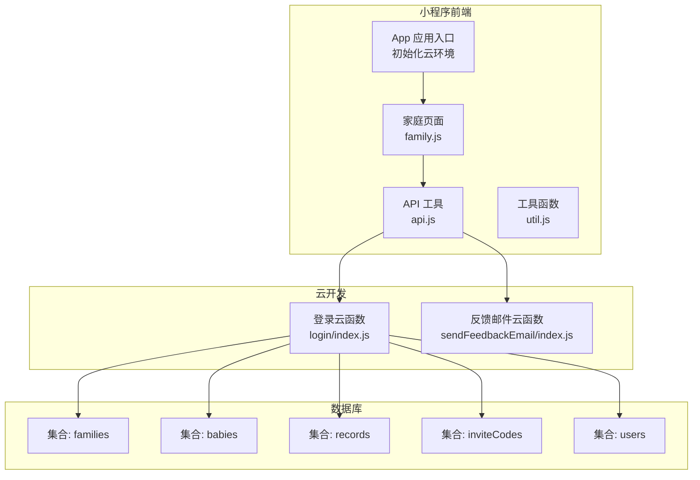
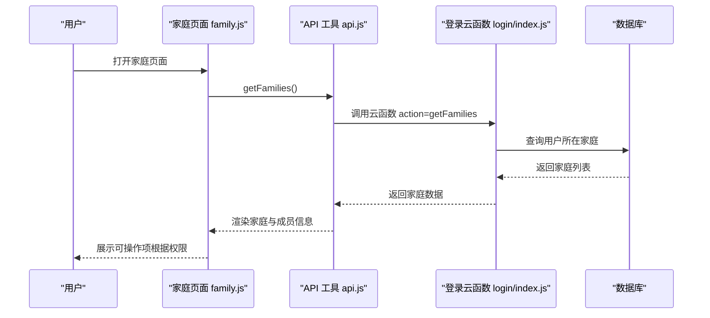
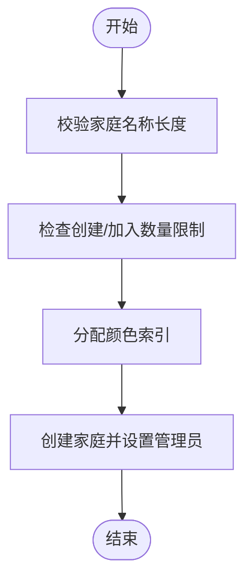
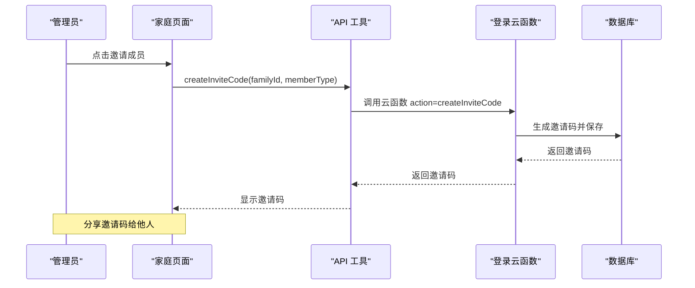
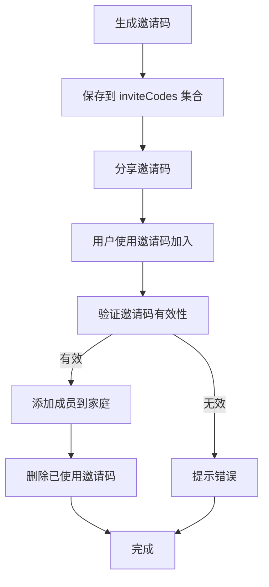
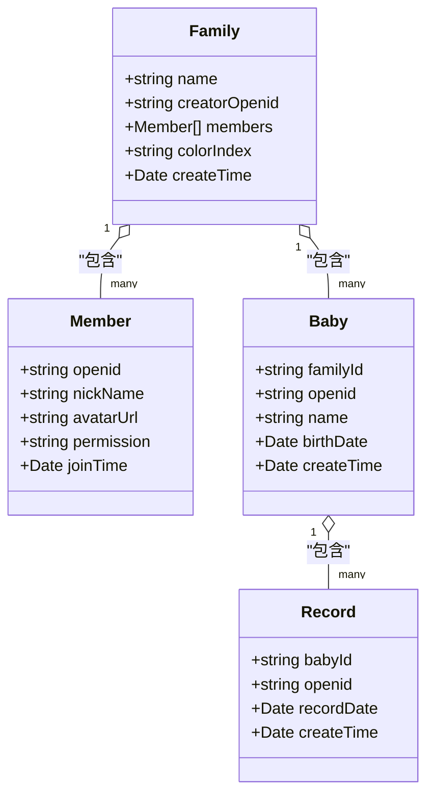
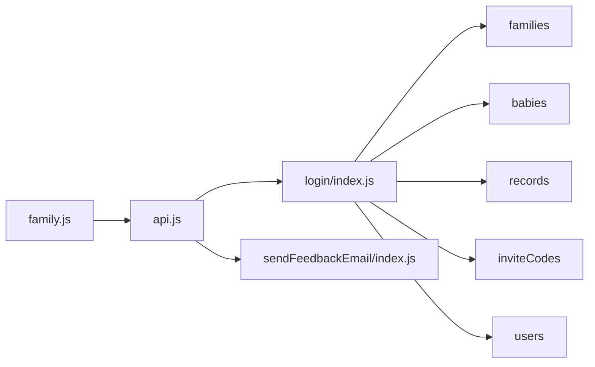

# 家庭协作系统

<cite>
**本文档引用的文件**
- [app.js](file://miniprogram/app.js)
- [app.json](file://miniprogram/app.json)
- [family.js](file://miniprogram/pages/family/family.js)
- [api.js](file://miniprogram/utils/api.js)
- [util.js](file://miniprogram/utils/util.js)
- [login/index.js](file://cloudfunctions/login/index.js)
- [sendFeedbackEmail/index.js](file://cloudfunctions/sendFeedbackEmail/index.js)
- [baby-add.js](file://miniprogram/pages/baby-add/baby-add.js)
- [record-add.js](file://miniprogram/pages/record-add/record-add.js)
</cite>

## 目录
1. [简介](#简介)
2. [项目结构](#项目结构)
3. [核心组件](#核心组件)
4. [架构总览](#架构总览)
5. [详细组件分析](#详细组件分析)
6. [依赖关系分析](#依赖关系分析)
7. [性能考量](#性能考量)
8. [故障排查指南](#故障排查指南)
9. [结论](#结论)
10. [附录](#附录)

## 简介
本系统是一个基于微信小程序的婴儿成长记录协作平台，围绕“家庭”这一核心组织单元，提供家庭创建、成员管理、权限控制、邀请码邀请、数据隔离与访问控制等功能。系统通过云函数实现数据库操作与权限校验，确保数据安全与一致性；前端页面提供直观的协作界面，支持多家庭管理、成员权限分级、实时成员信息更新等。

## 项目结构
项目采用小程序+云开发的前后端分离架构：
- 前端（miniprogram）：页面、工具函数、应用入口
- 云函数（cloudfunctions）：登录与业务逻辑处理
- 数据库：families（家庭）、babies（宝宝）、records（记录）、inviteCodes（邀请码）、users（用户）

**图表来源**
- [app.js:1-56](file://miniprogram/app.js#L1-L56)
- [family.js:1-757](file://miniprogram/pages/family/family.js#L1-L757)
- [api.js:1-879](file://miniprogram/utils/api.js#L1-L879)
- [login/index.js:1-814](file://cloudfunctions/login/index.js#L1-L814)

**章节来源**
- [app.js:1-56](file://miniprogram/app.js#L1-L56)
- [app.json:1-39](file://miniprogram/app.json#L1-L39)

## 核心组件
- 家庭管理：创建家庭、修改家庭名称、退出家庭、删除家庭（创建者）
- 成员管理：邀请成员、加入家庭、移除成员、更新成员信息（头像/昵称）
- 权限控制：viewer（只读）、caretaker（编辑）、guardian（管理员）
- 邀请码系统：生成、验证、使用、过期清理
- 数据隔离：按家庭维度隔离宝宝与记录，权限校验贯穿所有操作
- 协作界面：家庭页、宝宝页、记录页的权限适配与交互

**章节来源**
- [family.js:33-80](file://miniprogram/pages/family/family.js#L33-L80)
- [api.js:497-780](file://miniprogram/utils/api.js#L497-L780)
- [login/index.js:94-151](file://cloudfunctions/login/index.js#L94-L151)

## 架构总览
系统通过前端调用云函数实现数据库操作，云函数负责权限校验、业务规则与数据一致性。前端页面根据用户在各家庭中的权限动态渲染功能与可见性。

**图表来源**
- [family.js:33-80](file://miniprogram/pages/family/family.js#L33-L80)
- [api.js:435-461](file://miniprogram/utils/api.js#L435-L461)
- [login/index.js:27-48](file://cloudfunctions/login/index.js#L27-L48)

## 详细组件分析

### 家庭创建与管理
- 创建家庭：校验名称长度、用户创建数量限制、加入数量限制、分配颜色索引，创建后自动成为管理员
- 修改家庭名称：仅管理员可操作
- 退出家庭：非创建者仅移除成员；创建者则删除整个家庭及关联宝宝与记录
- 家庭排序：用户创建的家庭优先显示，随后按创建时间倒序

**图表来源**
- [login/index.js:94-151](file://cloudfunctions/login/index.js#L94-L151)

**章节来源**
- [login/index.js:94-151](file://cloudfunctions/login/index.js#L94-L151)
- [api.js:497-529](file://miniprogram/utils/api.js#L497-L529)

### 成员管理与权限控制
- 邀请成员：管理员/编辑可生成邀请码，支持viewer/caretaker两种类型
- 加入家庭：通过有效且未过期的邀请码加入，自动分配权限
- 移除成员：管理员可移除非创建者成员
- 更新成员信息：仅允许更新自己的头像/昵称，跨家庭同步
- 权限分级：
  - viewer：只读
  - caretaker：编辑（添加记录）
  - guardian：管理员（管理家庭、修改名称、调整权限、移除成员）

**图表来源**
- [family.js:237-257](file://miniprogram/pages/family/family.js#L237-L257)
- [api.js:531-563](file://miniprogram/utils/api.js#L531-L563)
- [login/index.js:658-699](file://cloudfunctions/login/index.js#L658-L699)

**章节来源**
- [family.js:511-578](file://miniprogram/pages/family/family.js#L511-L578)
- [api.js:655-780](file://miniprogram/utils/api.js#L655-L780)
- [login/index.js:186-266](file://cloudfunctions/login/index.js#L186-L266)

### 邀请码系统设计
- 生成：管理员/编辑生成随机6位大写字母数字组合，12小时有效期
- 验证：查询未使用且未过期的邀请码，匹配家庭与成员类型
- 使用：加入后立即删除邀请码，防止重复使用
- 过期清理：异步清理过期邀请码

**图表来源**
- [login/index.js:658-699](file://cloudfunctions/login/index.js#L658-L699)
- [api.js:565-624](file://miniprogram/utils/api.js#L565-L624)

**章节来源**
- [login/index.js:268-371](file://cloudfunctions/login/index.js#L268-L371)
- [api.js:531-624](file://miniprogram/utils/api.js#L531-L624)

### 数据隔离与访问控制
- 家庭维度隔离：所有数据（宝宝、记录）均绑定家庭ID
- 权限校验：
  - 查看：必须为家庭成员
  - 编辑：二级助教及以上
  - 管理：一级助教及以上
  - 删除：创建者或特定条件（如记录录入者）
- 事务保证：删除宝宝时，同时删除其记录，保证一致性

**图表来源**
- [login/index.js:54-92](file://cloudfunctions/login/index.js#L54-L92)
- [api.js:782-852](file://miniprogram/utils/api.js#L782-L852)

**章节来源**
- [login/index.js:512-554](file://cloudfunctions/login/index.js#L512-L554)
- [api.js:299-374](file://miniprogram/utils/api.js#L299-L374)

### 家庭数量限制与用户体验
- 限制规则：每个用户最多创建1个家庭，最多加入3个家庭
- 用户体验：创建前检查限制，加入时提示最大数量，避免无效操作

**章节来源**
- [login/index.js:104-120](file://cloudfunctions/login/index.js#L104-L120)
- [api.js:574-581](file://miniprogram/utils/api.js#L574-L581)

### 家庭协作界面设计
- 家庭页：展示用户在各家庭的身份与权限，提供创建、加入、退出、编辑、邀请等入口
- 成员信息：支持头像与昵称的批量更新（遍历所有家庭同步）
- 权限适配：根据当前用户在家庭中的权限动态显示功能按钮
- 分享邀请码：支持复制与分享，提升协作效率

**章节来源**
- [family.js:33-80](file://miniprogram/pages/family/family.js#L33-L80)
- [family.js:301-354](file://miniprogram/pages/family/family.js#L301-L354)
- [family.js:428-509](file://miniprogram/pages/family/family.js#L428-L509)

## 依赖关系分析
- 前端依赖：api.js封装所有云函数调用，family.js作为UI控制器，util.js提供通用工具
- 云函数依赖：login/index.js集中处理业务逻辑与权限校验，sendFeedbackEmail/index.js处理反馈邮件（当前为空实现）
- 数据库依赖：families/babies/records/inviteCodes/users集合相互关联，通过外键（familyId/openid）建立关系

**图表来源**
- [family.js:1-3](file://miniprogram/pages/family/family.js#L1-L3)
- [api.js:1-11](file://miniprogram/utils/api.js#L1-L11)
- [login/index.js:1-10](file://cloudfunctions/login/index.js#L1-L10)

**章节来源**
- [api.js:854-878](file://miniprogram/utils/api.js#L854-L878)
- [login/index.js:1-10](file://cloudfunctions/login/index.js#L1-L10)

## 性能考量
- 云函数调用：前端通过云函数绕过数据库权限限制，减少前端复杂逻辑
- 数据查询：按家庭ID批量查询，减少跨家庭扫描
- 事务处理：删除宝宝时使用事务，确保数据一致性
- 异步清理：邀请码过期清理异步执行，不影响主流程响应

[本节为通用指导，无需具体文件分析]

## 故障排查指南
- 登录问题：检查云环境初始化与登录流程，确认云函数返回的用户信息
- 权限不足：确认用户在目标家庭中的权限等级，检查云函数权限校验逻辑
- 邀请码无效：检查邀请码是否过期、是否已被使用、是否对应正确家庭
- 数据不一致：关注事务删除流程，确保删除顺序正确

**章节来源**
- [app.js:28-54](file://miniprogram/app.js#L28-L54)
- [login/index.js:268-371](file://cloudfunctions/login/index.js#L268-L371)
- [api.js:565-624](file://miniprogram/utils/api.js#L565-L624)

## 结论
本系统通过清晰的权限分级与严格的访问控制，实现了家庭维度的数据隔离与协作。邀请码机制简化了成员邀请流程，配合云函数的统一权限校验，确保了数据安全与一致性。前端界面根据权限动态适配，提升了用户体验。建议后续优化包括邀请码过期清理的健壮性、权限校验的细粒度控制以及更丰富的协作交互。

[本节为总结，无需具体文件分析]

## 附录

### 家庭管理API文档
- createFamily(familyName): 创建家庭，返回家庭信息
- createInviteCode(familyId, memberType): 生成邀请码
- joinFamily(inviteCode): 使用邀请码加入家庭
- leaveFamily(familyId): 退出家庭（创建者删除家庭）
- updateMemberInfo(familyId, nickName, avatarUrl): 更新成员信息（头像/昵称）
- updateFamilyName(familyId, newName): 更新家庭名称（管理员）
- updateMemberPermission(familyId, memberOpenid, permission): 调整成员权限（管理员）
- removeFamilyMember(familyId, memberOpenid): 移除成员（管理员）

**章节来源**
- [api.js:497-780](file://miniprogram/utils/api.js#L497-L780)
- [login/index.js:94-151](file://cloudfunctions/login/index.js#L94-L151)

### 权限分级说明
- viewer：只读，无法添加/编辑记录
- caretaker：编辑，可添加记录
- guardian：管理员，可管理家庭、调整权限、移除成员

**章节来源**
- [family.js:54-61](file://miniprogram/pages/family/family.js#L54-L61)
- [api.js:782-852](file://miniprogram/utils/api.js#L782-L852)