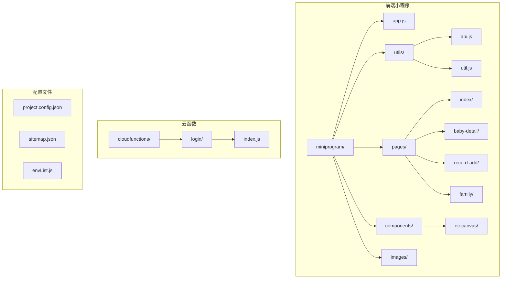
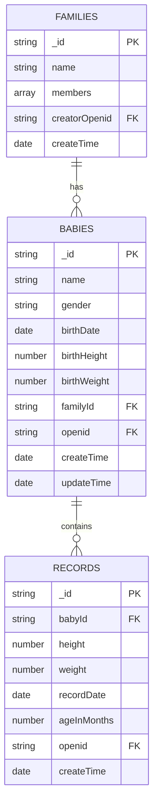
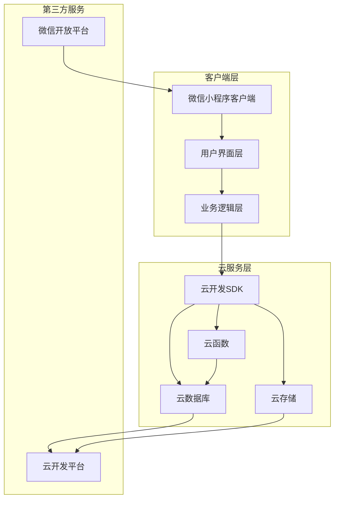
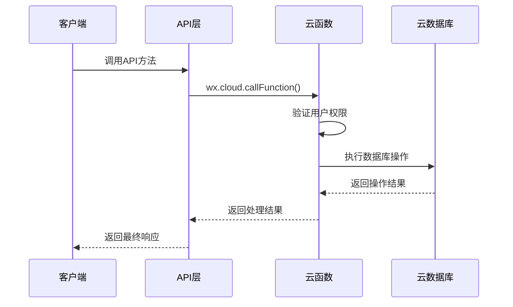
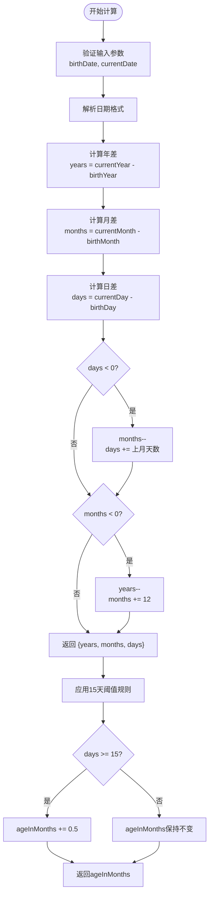
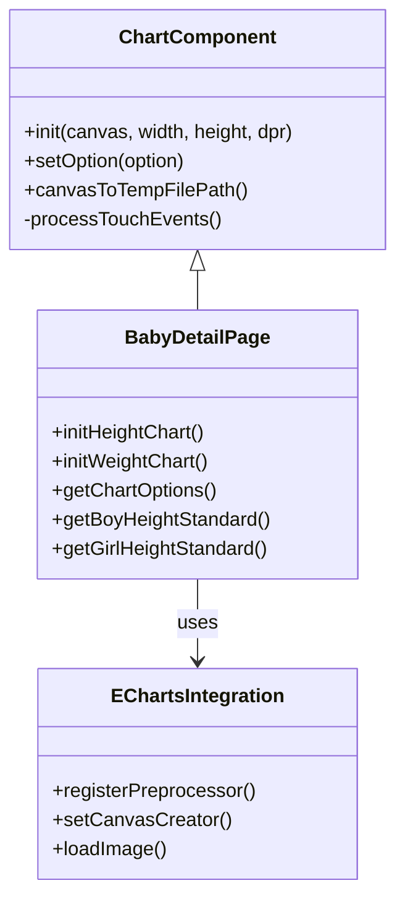
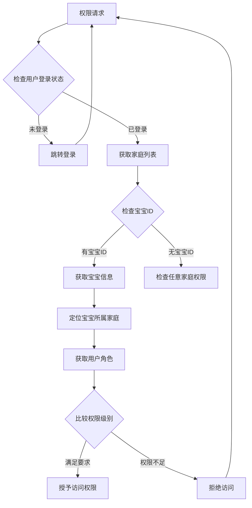
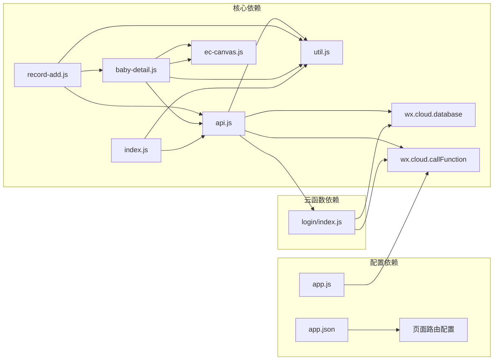
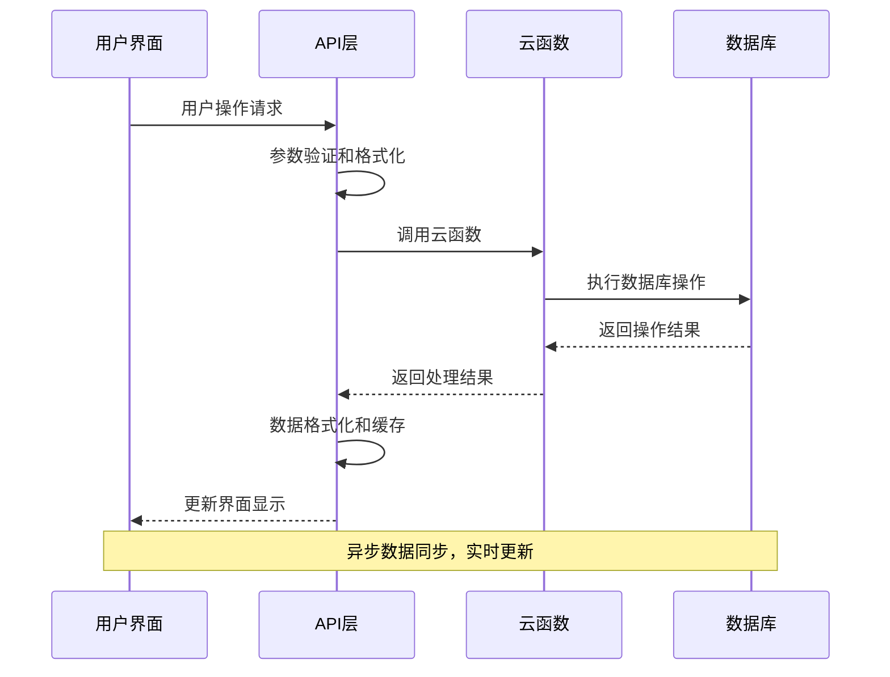

# 成长记录系统

<cite>
**本文档引用的文件**
- [app.js](file://miniprogram/app.js)
- [app.json](file://miniprogram/app.json)
- [api.js](file://miniprogram/utils/api.js)
- [util.js](file://miniprogram/utils/util.js)
- [record-add.js](file://miniprogram/pages/record-add/record-add.js)
- [record-add.wxml](file://miniprogram/pages/record-add/record-add.wxml)
- [baby-detail.js](file://miniprogram/pages/baby-detail/baby-detail.js)
- [baby-detail.wxml](file://miniprogram/pages/baby-detail/baby-detail.wxml)
- [ec-canvas.js](file://miniprogram/components/ec-canvas/ec-canvas.js)
- [login/index.js](file://cloudfunctions/login/index.js)
- [index.js](file://miniprogram/pages/index/index.js)
</cite>

## 目录
1. [简介](#简介)
2. [项目结构](#项目结构)
3. [核心组件](#核心组件)
4. [架构概览](#架构概览)
5. [详细组件分析](#详细组件分析)
6. [依赖关系分析](#依赖关系分析)
7. [性能考虑](#性能考虑)
8. [故障排除指南](#故障排除指南)
9. [结论](#结论)

## 简介

成长记录系统是一个基于微信小程序平台的宝宝成长追踪应用，专注于记录和可视化宝宝的身高、体重等关键发育指标。该系统采用前后端分离架构，前端使用微信小程序原生框架，后端基于微信云开发（CloudBase）提供数据库、存储和云函数服务。

系统的核心功能包括：
- 成长记录的创建、查询、更新和删除
- 基于标准曲线的生长发育评估
- 多层级权限管理系统（一级助教、二级助教、围观者）
- 数据可视化展示
- 实时年龄计算和记录管理

## 项目结构

该项目采用模块化组织方式，主要分为以下几个核心部分：

**图表来源**
- [app.js:1-56](file://miniprogram/app.js#L1-L56)
- [app.json:1-39](file://miniprogram/app.json#L1-L39)

**章节来源**
- [app.js:1-56](file://miniprogram/app.js#L1-L56)
- [app.json:1-39](file://miniprogram/app.json#L1-L39)

## 核心组件

### 数据模型设计

系统采用简洁而高效的数据模型设计，主要包含三个核心集合：

**图表来源**
- [api.js:149-210](file://miniprogram/utils/api.js#L149-L210)
- [api.js:299-346](file://miniprogram/utils/api.js#L299-L346)

### 权限层级系统

系统实现了三级权限管理体系，确保数据安全和操作控制：

| 权限级别 | 角色名称 | 权限描述 | 操作范围 |
|---------|----------|----------|----------|
| 1 | 围观者(Viewer) | 只能查看宝宝数据 | 读取权限 |
| 2 | 二级助教(Caretaker) | 可添加成长记录 | 添加记录 |
| 3 | 一级助教(Guardian) | 最高权限 | 管理宝宝、成员、记录 |

**章节来源**
- [api.js:782-825](file://miniprogram/utils/api.js#L782-L825)
- [login/index.js:512-554](file://cloudfunctions/login/index.js#L512-L554)

## 架构概览

系统采用前后端分离的微服务架构，通过微信云开发实现无缝集成：

**图表来源**
- [app.js:8-20](file://miniprogram/app.js#L8-L20)
- [login/index.js:22-25](file://cloudfunctions/login/index.js#L22-L25)

### API接口设计

系统提供统一的API接口规范，所有数据操作都通过云函数进行：

**图表来源**
- [api.js:265-286](file://miniprogram/utils/api.js#L265-L286)
- [login/index.js:580-605](file://cloudfunctions/login/index.js#L580-L605)

## 详细组件分析

### 年龄计算算法

系统实现了精确的年龄计算算法，采用按月计算并包含15天阈值规则：

**图表来源**
- [util.js:8-28](file://miniprogram/utils/util.js#L8-L28)
- [util.js:30-38](file://miniprogram/utils/util.js#L30-L38)
- [api.js:324-328](file://miniprogram/utils/api.js#L324-L328)

### 记录管理API

系统提供了完整的记录管理API，支持CRUD操作：

#### addRecord() 方法

添加成长记录的核心方法，包含完整的权限验证和数据验证：

**方法签名**: `addRecord(recordInfo, isBirth=false)`

**参数说明**:
- `recordInfo`: 记录信息对象
  - `babyId`: 宝宝ID（必填）
  - `height`: 身高数值（必填，正数）
  - `weight`: 体重数值（必填，正数）
  - `recordDate`: 记录日期（必填）
- `isBirth`: 是否为出生记录（可选，默认false）

**权限验证流程**:
1. 获取用户信息和家庭信息
2. 验证用户对宝宝的访问权限
3. 检查用户权限级别（必须为二级助教或一级助教）
4. 计算年龄（应用15天阈值规则）

**数据验证规则**:
- 身高和体重必须为正数
- 记录日期不能早于出生日期
- 用户必须是家庭成员

**章节来源**
- [api.js:299-346](file://miniprogram/utils/api.js#L299-L346)
- [login/index.js:512-554](file://cloudfunctions/login/index.js#L512-L554)

#### getRecordsByBabyId() 方法

获取指定宝宝的所有成长记录：

**方法签名**: `getRecordsByBabyId(babyId)`

**功能特性**:
- 通过云函数绕过数据库权限限制
- 自动排序（按记录日期降序）
- 返回完整的记录列表

**章节来源**
- [api.js:265-286](file://miniprogram/utils/api.js#L265-L286)
- [login/index.js:580-605](file://cloudfunctions/login/index.js#L580-L605)

#### deleteRecord() 方法

删除指定的成长记录：

**方法签名**: `deleteRecord(id)`

**权限控制**:
- 一级助教：可删除任何记录
- 二级助教：只能删除自己录入的记录
- 围观者：无删除权限

**章节来源**
- [api.js:348-374](file://miniprogram/utils/api.js#L348-L374)
- [login/index.js:512-554](file://cloudfunctions/login/index.js#L512-L554)

### 数据可视化组件

系统集成了ECharts图表库，提供直观的生长曲线可视化：

#### 图表组件架构

**图表来源**
- [ec-canvas.js:31-275](file://miniprogram/components/ec-canvas/ec-canvas.js#L31-L275)
- [baby-detail.js:323-397](file://miniprogram/pages/baby-detail/baby-detail.js#L323-L397)

#### 标准曲线数据

系统内置了国家卫健委发布的标准曲线数据，覆盖0-84个月的男孩和女孩：

**身高标准曲线**:
- P3: 第3百分位标准
- P50: 第50百分位标准（中位数）
- P97: 第97百分位标准

**体重标准曲线**:
- P3: 第3百分位标准
- P50: 第50百分位标准（中位数）
- P97: 第97百分位标准

**章节来源**
- [baby-detail.js:263-321](file://miniprogram/pages/baby-detail/baby-detail.js#L263-L321)

### 权限控制系统

系统实现了严格的权限控制机制，确保数据安全和操作合规：

**图表来源**
- [api.js:782-825](file://miniprogram/utils/api.js#L782-L825)
- [login/index.js:556-577](file://cloudfunctions/login/index.js#L556-L577)

**章节来源**
- [api.js:782-825](file://miniprogram/utils/api.js#L782-L825)
- [login/index.js:512-554](file://cloudfunctions/login/index.js#L512-L554)

## 依赖关系分析

系统各组件之间的依赖关系清晰明确，遵循单一职责原则：

**图表来源**
- [api.js:1-11](file://miniprogram/utils/api.js#L1-L11)
- [record-add.js:2-3](file://miniprogram/pages/record-add/record-add.js#L2-L3)
- [baby-detail.js:4](file://miniprogram/pages/baby-detail/baby-detail.js#L4)

### 数据流分析

系统采用异步数据流模式，确保用户体验的流畅性：

**图表来源**
- [api.js:265-286](file://miniprogram/utils/api.js#L265-L286)
- [login/index.js:580-605](file://cloudfunctions/login/index.js#L580-L605)

**章节来源**
- [api.js:149-210](file://miniprogram/utils/api.js#L149-L210)
- [login/index.js:512-554](file://cloudfunctions/login/index.js#L512-L554)

## 性能考虑

### 缓存策略

系统实现了多层次的缓存机制：

1. **本地缓存**: 用户信息和权限状态
2. **云函数缓存**: 频繁访问的数据
3. **数据库索引**: 关键查询字段建立索引

### 异步处理

- 所有网络请求采用异步处理
- 图表渲染使用懒加载机制
- 大数据量时采用分页加载

### 优化建议

1. **批量操作**: 支持批量获取记录
2. **增量更新**: 实现数据增量同步
3. **预加载**: 提前加载可能需要的数据

## 故障排除指南

### 常见问题及解决方案

**登录问题**:
- 检查微信登录状态
- 验证云函数调用权限
- 确认用户OpenID获取成功

**权限问题**:
- 验证用户是否为家庭成员
- 检查用户角色权限
- 确认操作目标的访问权限

**数据验证错误**:
- 检查输入数据格式
- 验证数值范围
- 确认日期逻辑正确性

**图表显示异常**:
- 检查ECharts初始化
- 验证数据格式正确性
- 确认容器尺寸设置

**章节来源**
- [app.js:28-54](file://miniprogram/app.js#L28-L54)
- [api.js:14-41](file://miniprogram/utils/api.js#L14-L41)

## 结论

成长记录系统通过精心设计的数据模型、完善的权限控制和直观的可视化展示，为用户提供了一个全面的宝宝成长追踪解决方案。系统采用现代化的技术架构，具备良好的扩展性和维护性。

### 系统优势

1. **数据准确性**: 基于权威标准曲线的生长评估
2. **权限安全**: 三级权限体系确保数据安全
3. **用户体验**: 直观的界面设计和流畅的操作体验
4. **技术先进**: 采用微信云开发的现代化架构
5. **可扩展性**: 模块化设计便于功能扩展

### 发展方向

1. **AI辅助分析**: 集成机器学习算法进行个性化分析
2. **多平台支持**: 扩展到其他移动平台
3. **智能提醒**: 基于记录数据的健康提醒功能
4. **数据导出**: 支持记录数据的导出和分享

该系统为家长和医护人员提供了一个可靠的宝宝成长管理工具，有助于及时发现和关注宝宝的发育状况。