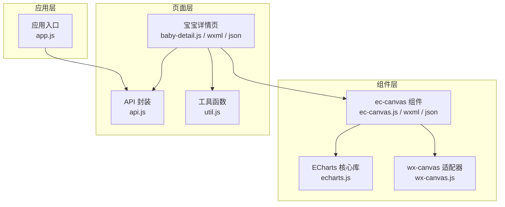
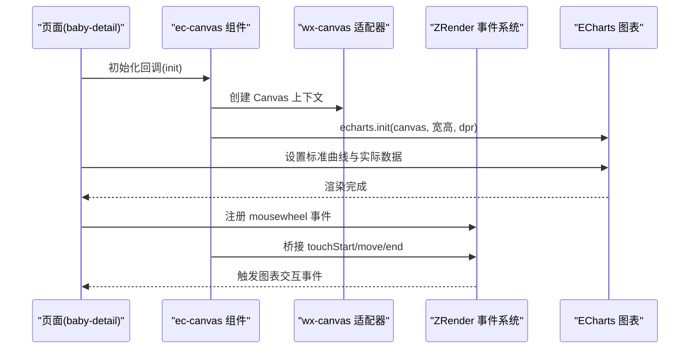
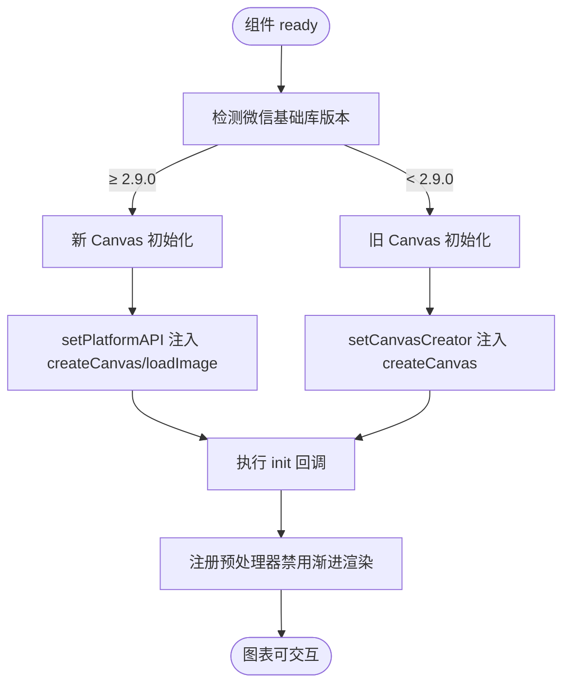
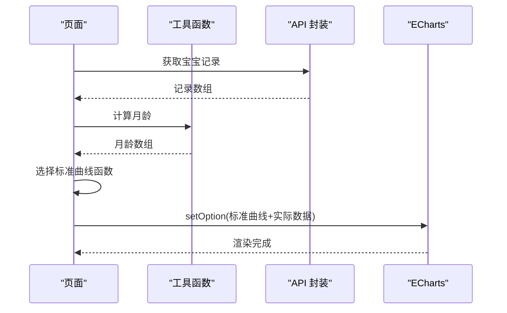
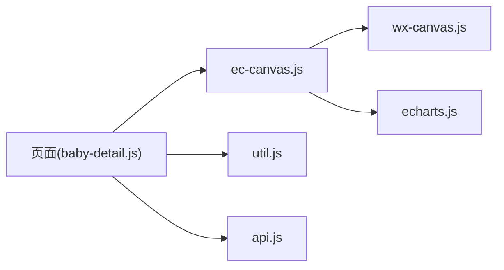

# 数据可视化模块

<cite>
**本文档引用的文件**
- [ec-canvas.js](file://miniprogram/components/ec-canvas/ec-canvas.js)
- [ec-canvas.json](file://miniprogram/components/ec-canvas/ec-canvas.json)
- [ec-canvas.wxml](file://miniprogram/components/ec-canvas/ec-canvas.wxml)
- [echarts.js](file://miniprogram/components/ec-canvas/echarts.js)
- [wx-canvas.js](file://miniprogram/components/ec-canvas/wx-canvas.js)
- [baby-detail.js](file://miniprogram/pages/baby-detail/baby-detail.js)
- [baby-detail.json](file://miniprogram/pages/baby-detail/baby-detail.json)
- [baby-detail.wxml](file://miniprogram/pages/baby-detail/baby-detail.wxml)
- [util.js](file://miniprogram/utils/util.js)
- [api.js](file://miniprogram/utils/api.js)
- [app.js](file://miniprogram/app.js)
</cite>

## 目录
1. [简介](#简介)
2. [项目结构](#项目结构)
3. [核心组件](#核心组件)
4. [架构总览](#架构总览)
5. [详细组件分析](#详细组件分析)
6. [依赖关系分析](#依赖关系分析)
7. [性能考虑](#性能考虑)
8. [故障排除指南](#故障排除指南)
9. [结论](#结论)

## 简介
本技术文档聚焦于数据可视化模块在小程序中的实现，重点覆盖以下方面：
- ECharts 在小程序中的集成与使用
- ec-canvas 组件的实现原理与配置选项
- 标准曲线（身高/体重）的计算逻辑与数据准备
- 图表配置（坐标轴、颜色、交互、响应式布局）
- 性能优化策略（大数据量、内存管理、渲染效率）
- 交互功能（缩放、拖拽、点击）
- 主题定制、国际化与无障碍支持
- 故障排除指南

## 项目结构
数据可视化模块主要由三部分组成：
- ec-canvas 组件：封装 Canvas 初始化、事件桥接、触摸手势与平台适配
- 页面业务逻辑：在页面中通过 ec-canvas 渲染图表，并准备标准曲线与实际数据
- 工具与 API：提供年龄计算、数据获取与权限控制

**图表来源**
- [ec-canvas.js:1-285](file://miniprogram/components/ec-canvas/ec-canvas.js#L1-L285)
- [ec-canvas.wxml:1-5](file://miniprogram/components/ec-canvas/ec-canvas.wxml#L1-L5)
- [wx-canvas.js:1-112](file://miniprogram/components/ec-canvas/wx-canvas.js#L1-L112)
- [echarts.js:1-46](file://miniprogram/components/ec-canvas/echarts.js#L1-L46)
- [baby-detail.js:1-691](file://miniprogram/pages/baby-detail/baby-detail.js#L1-L691)
- [util.js:1-55](file://miniprogram/utils/util.js#L1-L55)
- [api.js:1-879](file://miniprogram/utils/api.js#L1-L879)
- [app.js:1-56](file://miniprogram/app.js#L1-L56)

**章节来源**
- [ec-canvas.js:1-285](file://miniprogram/components/ec-canvas/ec-canvas.js#L1-L285)
- [ec-canvas.wxml:1-5](file://miniprogram/components/ec-canvas/ec-canvas.wxml#L1-L5)
- [wx-canvas.js:1-112](file://miniprogram/components/ec-canvas/wx-canvas.js#L1-L112)
- [echarts.js:1-46](file://miniprogram/components/ec-canvas/echarts.js#L1-L46)
- [baby-detail.js:1-691](file://miniprogram/pages/baby-detail/baby-detail.js#L1-L691)
- [util.js:1-55](file://miniprogram/utils/util.js#L1-L55)
- [api.js:1-879](file://miniprogram/utils/api.js#L1-L879)
- [app.js:1-56](file://miniprogram/app.js#L1-L56)

## 核心组件
- ec-canvas 组件：负责根据微信基础库版本选择新旧 Canvas 初始化路径，注册预处理器禁用渐进渲染，桥接触摸事件到 ECharts 的 ZRender 事件系统，并提供截图导出能力
- wx-canvas 适配器：提供 Canvas 上下文、尺寸、事件桥接与触摸手势映射
- ECharts 核心库：内置在组件内，提供图表渲染与交互能力
- 页面业务：在页面中通过 ec-canvas 渲染图表，准备标准曲线与实际数据，配置图表选项与交互行为

**章节来源**
- [ec-canvas.js:31-275](file://miniprogram/components/ec-canvas/ec-canvas.js#L31-L275)
- [wx-canvas.js:1-112](file://miniprogram/components/ec-canvas/wx-canvas.js#L1-L112)
- [echarts.js:1-46](file://miniprogram/components/ec-canvas/echarts.js#L1-L46)

## 架构总览
下图展示了从页面到组件再到 ECharts 的调用链路与数据流：

**图表来源**
- [baby-detail.js:323-473](file://miniprogram/pages/baby-detail/baby-detail.js#L323-L473)
- [ec-canvas.js:80-192](file://miniprogram/components/ec-canvas/ec-canvas.js#L80-L192)
- [wx-canvas.js:65-92](file://miniprogram/components/ec-canvas/wx-canvas.js#L65-L92)

## 详细组件分析

### ec-canvas 组件实现原理
- 版本检测与初始化策略
  - 通过比较微信基础库版本决定使用新 Canvas（type="2d"）还是旧 Canvas
  - 新 Canvas 使用节点 getContext('2d') 并通过 setPlatformAPI 注入 createCanvas/loadImage
  - 旧 Canvas 使用 wx.createCanvasContext 并注入 setCanvasCreator
- 预处理器与渲染优化
  - 注册 preprocessor 将 series.progressive 设为 0，避免 drawImage 不支持 DOM 参数导致的问题
- 事件桥接
  - 将微信触摸事件映射到 ZRender 事件（mousedown/mousemove/mouseup/click）
  - 支持手势识别（pinch 缩放等）
- 截图导出
  - 提供 canvasToTempFilePath 接口，兼容新旧 Canvas

**图表来源**
- [ec-canvas.js:52-192](file://miniprogram/components/ec-canvas/ec-canvas.js#L52-L192)

**章节来源**
- [ec-canvas.js:31-275](file://miniprogram/components/ec-canvas/ec-canvas.js#L31-L275)

### wx-canvas 适配器
- 提供 getContext('2d') 返回原生上下文
- 为 radial gradient 提供别名映射
- 事件桥接：将微信触摸事件转换为 ZRender 事件参数
- 尺寸读写：通过 canvasNode.width/height 访问节点尺寸

**章节来源**
- [wx-canvas.js:1-112](file://miniprogram/components/ec-canvas/wx-canvas.js#L1-L112)

### ECharts 核心库
- 内置在组件中，提供图表渲染、动画、事件系统与主题能力
- 通过 setPlatformAPI/setCanvasCreator 注入平台适配

**章节来源**
- [echarts.js:1-46](file://miniprogram/components/ec-canvas/echarts.js#L1-L46)

### 页面图表初始化与数据准备
- 页面在 onReady 中根据当前标签懒加载图表
- 数据准备流程
  - 从 API 获取宝宝记录，按时间排序
  - 计算每个记录对应的月龄（年×12+月+日阈值）
  - 根据宝宝性别选择相应标准曲线（P3/P50/P97）
  - 构建标准曲线完整时间轴（0-最大月龄），并生成实际数据点（整月取值）
- 图表配置
  - Tooltip、Legend、Grid、DataZoom（内部滑块+滑轨）、坐标轴（数值型）、系列（四条曲线）

**图表来源**
- [baby-detail.js:323-473](file://miniprogram/pages/baby-detail/baby-detail.js#L323-L473)
- [util.js:8-38](file://miniprogram/utils/util.js#L8-L38)

**章节来源**
- [baby-detail.js:156-473](file://miniprogram/pages/baby-detail/baby-detail.js#L156-L473)
- [util.js:1-55](file://miniprogram/utils/util.js#L1-L55)

### 标准曲线计算逻辑
- 数据来源：国家卫健委 WS/T 423-2022 标准（0-84 月）
- 实现要点
  - 男孩/女孩分别维护 P3/P50/P97 曲线数据
  - 通过闭包返回函数，接收月龄与百分位，返回对应数值
  - 对超出范围的月龄进行边界处理
- 数据格式
  - 数组索引即为月龄，值为对应百分位身高/体重
  - 用于构建标准曲线的二维数组：[[月龄, 数值], ...]

**章节来源**
- [baby-detail.js:263-321](file://miniprogram/pages/baby-detail/baby-detail.js#L263-L321)

### 图表配置详解
- 基础配置
  - Tooltip：触发方式为坐标轴，自定义格式化函数
  - Legend：底部居中显示四条曲线
  - Grid：合理留白，包含标签
- DataZoom
  - 内置滑块与滑轨，支持 X/Y 轴缩放与平移
  - 默认显示最近 3 个数据点窗口，若不足则固定 6 个月窗口
- 坐标轴
  - X 轴：数值型，月龄；自动调整刻度与分割线间隔
  - Y 轴：数值型，按区间对齐最小/最大值
- 系列
  - 标准曲线（P3/P50/P97）：平滑线，虚线/实线区分
  - 实际数据：平滑线，圆点标记，宽度适中

**章节来源**
- [baby-detail.js:6-154](file://miniprogram/pages/baby-detail/baby-detail.js#L6-L154)

### 交互功能实现
- 缩放与拖拽
  - 通过 DataZoom 内置控件实现 X/Y 轴缩放与平移
  - ZRender 事件系统支持鼠标滚轮缩放与触摸手势
- 点击与悬停
  - 通过事件桥接将微信触摸事件映射到 ZRender
  - 支持 click/mousedown/mousemove/mouseup 等事件

**章节来源**
- [ec-canvas.js:216-273](file://miniprogram/components/ec-canvas/ec-canvas.js#L216-L273)
- [wx-canvas.js:65-92](file://miniprogram/components/ec-canvas/wx-canvas.js#L65-L92)
- [baby-detail.js:392-470](file://miniprogram/pages/baby-detail/baby-detail.js#L392-L470)

### 主题定制、国际化与无障碍
- 主题定制
  - 通过 series.itemStyle/lineStyle 自定义颜色与线宽
  - 通过 grid、xAxis/yAxis、splitLine 等样式微调
- 国际化
  - 当前项目未显式处理多语言；如需国际化可在 tooltip.legend.textStyle 等处扩展
- 无障碍
  - 当前未实现无障碍属性；建议为图表容器添加 role="region" 与 aria-label 描述

**章节来源**
- [baby-detail.js:22-154](file://miniprogram/pages/baby-detail/baby-detail.js#L22-L154)

## 依赖关系分析
- 页面依赖
  - 页面依赖 ec-canvas 组件进行渲染
  - 依赖 util.js 进行年龄与月龄计算
  - 依赖 api.js 进行数据获取与权限校验
- 组件依赖
  - ec-canvas 依赖 wx-canvas 适配器与 ECharts 核心库
  - 事件桥接依赖 ZRender 事件系统

**图表来源**
- [baby-detail.js:1-691](file://miniprogram/pages/baby-detail/baby-detail.js#L1-L691)
- [ec-canvas.js:1-285](file://miniprogram/components/ec-canvas/ec-canvas.js#L1-L285)
- [wx-canvas.js:1-112](file://miniprogram/components/ec-canvas/wx-canvas.js#L1-L112)
- [echarts.js:1-46](file://miniprogram/components/ec-canvas/echarts.js#L1-L46)
- [util.js:1-55](file://miniprogram/utils/util.js#L1-L55)
- [api.js:1-879](file://miniprogram/utils/api.js#L1-L879)

**章节来源**
- [baby-detail.js:1-691](file://miniprogram/pages/baby-detail/baby-detail.js#L1-L691)
- [ec-canvas.js:1-285](file://miniprogram/components/ec-canvas/ec-canvas.js#L1-L285)
- [wx-canvas.js:1-112](file://miniprogram/components/ec-canvas/wx-canvas.js#L1-L112)
- [echarts.js:1-46](file://miniprogram/components/ec-canvas/echarts.js#L1-L46)
- [util.js:1-55](file://miniprogram/utils/util.js#L1-L55)
- [api.js:1-879](file://miniprogram/utils/api.js#L1-L879)

## 性能考虑
- 渐进渲染禁用
  - 预处理器将 series.progressive 设为 0，避免 drawImage 不支持 DOM 导致的渲染问题
- 大数据量处理
  - 使用 DataZoom 控制可视区域，减少一次性渲染点数
  - 平滑曲线在移动端可能带来额外开销，可根据需要调整
- 内存管理
  - 合理销毁图表实例与事件监听，避免内存泄漏
- 渲染效率
  - 使用 devicePixelRatio 适配高清屏，避免过度放大导致的性能损耗
  - 避免频繁 setOption，尽量合并更新

**章节来源**
- [ec-canvas.js:52-66](file://miniprogram/components/ec-canvas/ec-canvas.js#L52-L66)
- [baby-detail.js:370-470](file://miniprogram/pages/baby-detail/baby-detail.js#L370-L470)

## 故障排除指南
- 图表不显示
  - 检查 ec-canvas 组件是否正确引入与绑定 ec 变量
  - 确认页面 onReady 中已调用初始化方法
  - 查看控制台是否有版本过低提示
- 数据异常
  - 确认记录按时间排序后再计算月龄
  - 检查性别选择是否正确，避免标准曲线错配
- 交互无效
  - 确认未禁用触摸事件（ec.disableTouch）
  - 检查 ZRender 事件是否被阻止冒泡
- 缩放/拖拽异常
  - 确认 DataZoom 配置正确，startValue/endValue 合理
  - 避免同时设置 filterMode 与缩放冲突的属性

**章节来源**
- [ec-canvas.wxml:1-5](file://miniprogram/components/ec-canvas/ec-canvas.wxml#L1-L5)
- [ec-canvas.js:216-273](file://miniprogram/components/ec-canvas/ec-canvas.js#L216-L273)
- [baby-detail.js:323-473](file://miniprogram/pages/baby-detail/baby-detail.js#L323-L473)

## 结论
本模块通过 ec-canvas 组件实现了 ECharts 在小程序中的稳定集成，结合页面业务逻辑完成了标准曲线与实际数据的可视化呈现。通过合理的配置与交互设计，满足了身高/体重曲线的展示需求。后续可在国际化、无障碍与大数据场景下进一步优化。