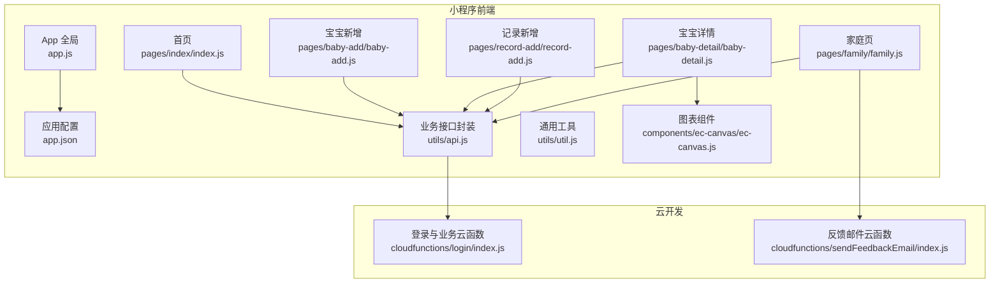
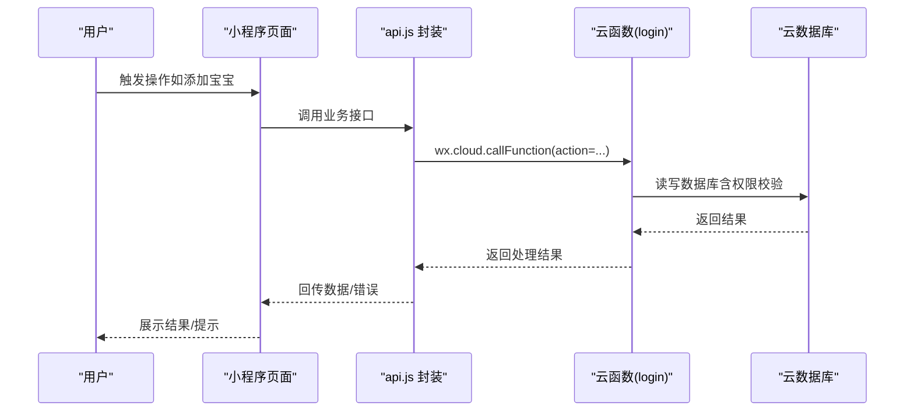
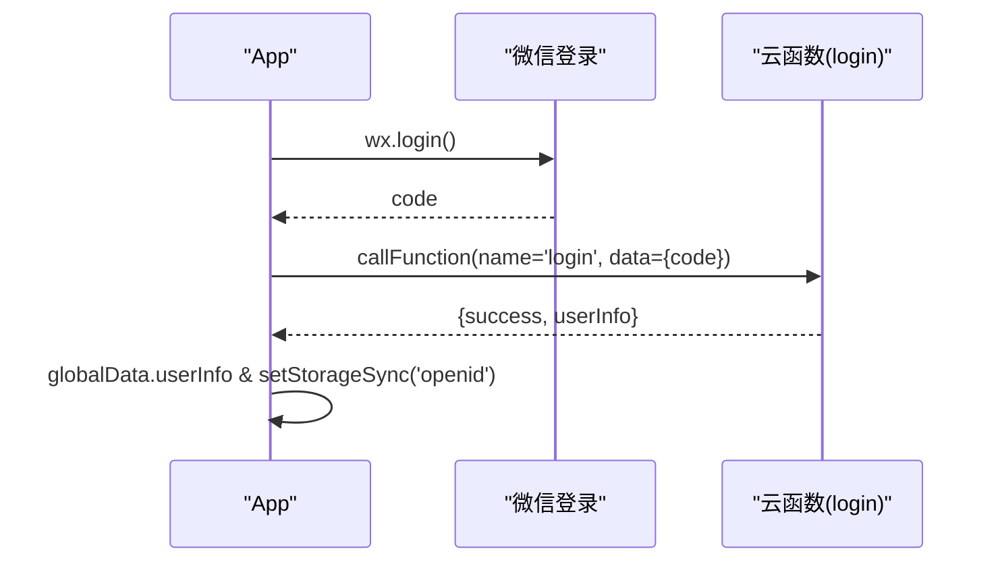
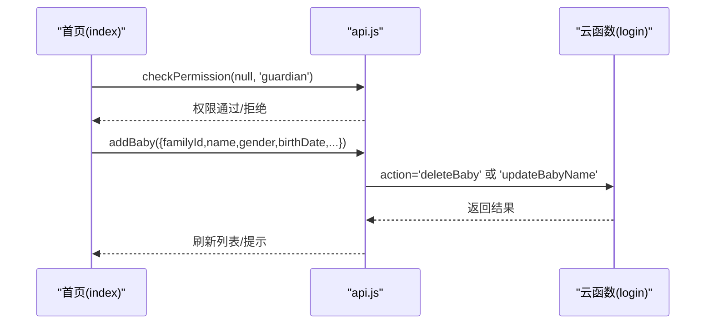
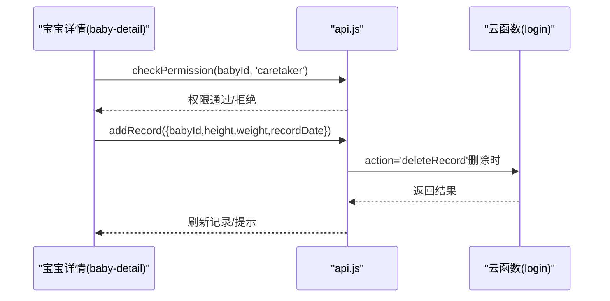
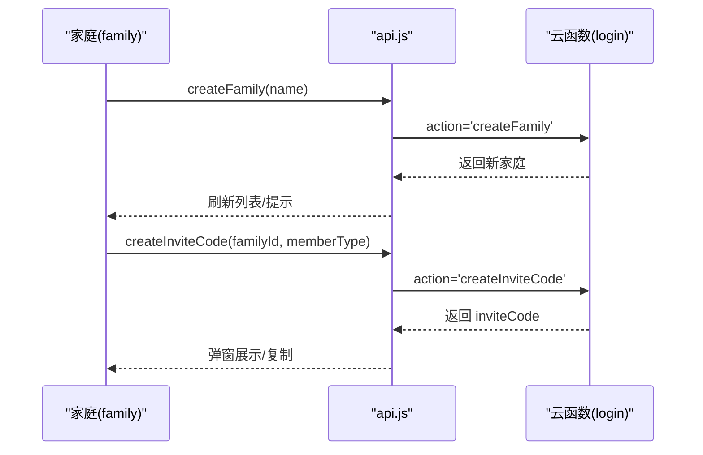
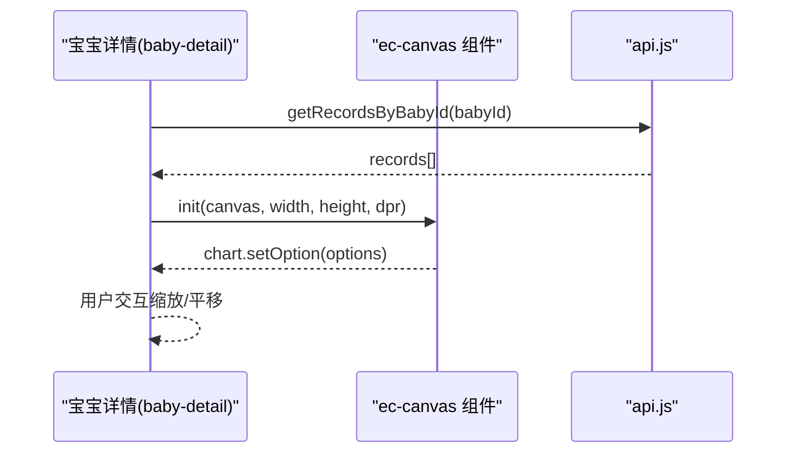
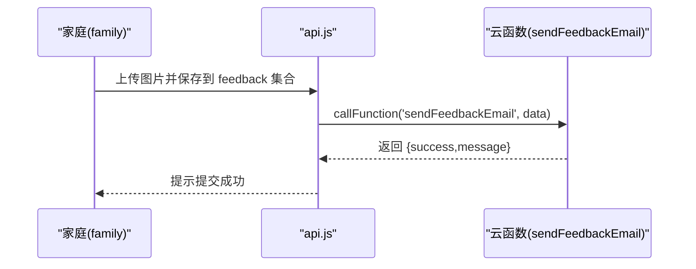
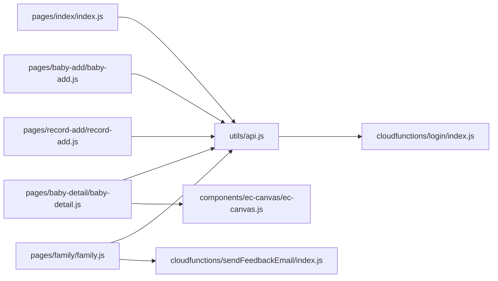

# 核心功能模块

<cite>
**本文档引用的文件**
- [app.js](file://miniprogram/app.js)
- [app.json](file://miniprogram/app.json)
- [api.js](file://miniprogram/utils/api.js)
- [util.js](file://miniprogram/utils/util.js)
- [index.js](file://miniprogram/pages/index/index.js)
- [baby-add.js](file://miniprogram/pages/baby-add/baby-add.js)
- [baby-detail.js](file://miniprogram/pages/baby-detail/baby-detail.js)
- [record-add.js](file://miniprogram/pages/record-add/record-add.js)
- [family.js](file://miniprogram/pages/family/family.js)
- [ec-canvas.js](file://miniprogram/components/ec-canvas/ec-canvas.js)
- [login/index.js](file://cloudfunctions/login/index.js)
- [sendFeedbackEmail/index.js](file://cloudfunctions/sendFeedbackEmail/index.js)
- [index.json](file://miniprogram/pages/index/index.json)
- [baby-add.json](file://miniprogram/pages/baby-add/baby-add.json)
- [baby-detail.json](file://miniprogram/pages/baby-detail/baby-detail.json)
- [record-add.json](file://miniprogram/pages/record-add/record-add.json)
- [family.json](file://miniprogram/pages/family/family.json)
</cite>

## 目录
1. [简介](#简介)
2. [项目结构](#项目结构)
3. [核心组件](#核心组件)
4. [架构总览](#架构总览)
5. [详细组件分析](#详细组件分析)
6. [依赖关系分析](#依赖关系分析)
7. [性能考虑](#性能考虑)
8. [故障排除指南](#故障排除指南)
9. [结论](#结论)

## 简介
本项目是一个基于微信小程序平台的“宝宝助手”应用，围绕家庭育儿场景构建，提供六大核心功能模块：用户认证系统、宝宝信息管理、成长记录系统、家庭协作系统、数据可视化模块、反馈系统。系统采用前端页面与云开发结合的架构，通过云函数统一处理业务逻辑与数据权限控制，确保数据安全与一致性。

## 项目结构
项目采用典型的微信小程序目录结构，主要分为以下几类：
- 应用入口与全局配置：app.js、app.json
- 工具模块：utils/api.js（业务接口封装）、utils/util.js（通用工具）
- 页面模块：pages 下的各功能页面（首页、宝宝新增、宝宝详情、记录新增、家庭页）
- 组件模块：components 下的图表组件 ec-canvas
- 云函数：cloudfunctions 下的登录与反馈邮件处理函数

**图表来源**
- [app.js:1-56](file://miniprogram/app.js#L1-L56)
- [app.json:1-39](file://miniprogram/app.json#L1-L39)
- [api.js:1-873](file://miniprogram/utils/api.js#L1-L873)
- [util.js:1-55](file://miniprogram/utils/util.js#L1-L55)
- [index.js:1-144](file://miniprogram/pages/index/index.js#L1-L144)
- [baby-add.js:1-113](file://miniprogram/pages/baby-add/baby-add.js#L1-L113)
- [baby-detail.js:1-691](file://miniprogram/pages/baby-detail/baby-detail.js#L1-L691)
- [record-add.js:1-118](file://miniprogram/pages/record-add/record-add.js#L1-L118)
- [family.js:1-747](file://miniprogram/pages/family/family.js#L1-L747)
- [ec-canvas.js:1-285](file://miniprogram/components/ec-canvas/ec-canvas.js#L1-L285)
- [login/index.js:1-786](file://cloudfunctions/login/index.js#L1-L786)
- [sendFeedbackEmail/index.js:1-21](file://cloudfunctions/sendFeedbackEmail/index.js#L1-L21)

**章节来源**
- [app.js:1-56](file://miniprogram/app.js#L1-L56)
- [app.json:1-39](file://miniprogram/app.json#L1-L39)

## 核心组件
本节概述六大核心功能模块的职责与边界：
- 用户认证系统：负责用户登录态维护、用户信息获取与持久化，确保后续业务调用具备合法身份。
- 宝宝信息管理：提供宝宝增删改查、家庭归属、权限校验等能力，支持出生信息的初始录入。
- 成长记录系统：支持身高体重记录的录入、查询、删除与权限控制，提供年龄计算与时间轴展示。
- 家庭协作系统：提供家庭创建、邀请码生成与加入、成员权限管理、头像与昵称同步等协作能力。
- 数据可视化模块：基于 ECharts 小程序适配组件，绘制身高/体重标准曲线与实际数据对比图。
- 反馈系统：收集用户反馈内容与图片，上传至云存储并异步通知邮件云函数。

**章节来源**
- [api.js:1-873](file://miniprogram/utils/api.js#L1-L873)
- [login/index.js:1-786](file://cloudfunctions/login/index.js#L1-L786)

## 架构总览
系统采用“前端页面 + 云函数 + 云数据库/云存储”的三层架构：
- 前端层：页面与组件负责用户交互与数据展示。
- 业务层：云函数集中处理复杂业务逻辑与权限校验，避免直接暴露数据库。
- 数据层：云数据库存储用户、家庭、宝宝、记录、反馈等数据；云存储用于头像与反馈图片。

**图表来源**
- [api.js:149-204](file://miniprogram/utils/api.js#L149-L204)
- [login/index.js:735-786](file://cloudfunctions/login/index.js#L735-L786)

## 详细组件分析

### 用户认证系统
- 业务价值：统一用户登录态，保证后续所有业务调用具备合法身份标识。
- 核心功能特性：
  - 自动登录：启动时调用微信登录并调用云函数换取用户信息。
  - 登录态持久化：将 openid 写入本地缓存，供后续接口复用。
  - 超时与重试：提供等待登录完成的 Promise 封装，避免并发访问导致的空值。
- 用户交互流程：应用启动 → 调用微信登录 → 调用云函数登录 → 写入全局与本地存储 → 页面初始化。

**图表来源**
- [app.js:28-54](file://miniprogram/app.js#L28-L54)
- [login/index.js:735-786](file://cloudfunctions/login/index.js#L735-L786)

**章节来源**
- [app.js:1-56](file://miniprogram/app.js#L1-L56)
- [api.js:13-41](file://miniprogram/utils/api.js#L13-L41)

### 宝宝信息管理
- 业务价值：为家庭提供宝宝信息的集中管理，支持多宝宝与跨家庭数据隔离。
- 核心功能特性：
  - 宝宝增删改查：新增时校验家庭与数量限制；删除通过云函数事务保证一致性。
  - 家庭归属：根据用户所在家庭列表排序展示，支持按创建者优先显示。
  - 权限校验：仅一级助教可修改姓名/头像/删除宝宝。
- 用户交互流程：首页点击“添加宝宝” → 校验权限与家庭数量 → 表单校验 → 调用 addBaby → 成功后刷新列表。

**图表来源**
- [index.js:54-92](file://miniprogram/pages/index/index.js#L54-L92)
- [api.js:149-204](file://miniprogram/utils/api.js#L149-L204)
- [login/index.js:462-490](file://cloudfunctions/login/index.js#L462-L490)

**章节来源**
- [index.js:1-144](file://miniprogram/pages/index/index.js#L1-L144)
- [baby-add.js:1-113](file://miniprogram/pages/baby-add/baby-add.js#L1-L113)
- [api.js:149-234](file://miniprogram/utils/api.js#L149-L234)

### 成长记录系统
- 业务价值：记录宝宝身高体重变化，形成成长轨迹，辅助家长观察发育趋势。
- 核心功能特性：
  - 录入与校验：校验身高体重数值与日期合法性，计算月龄。
  - 查询与排序：按记录日期倒序展示，支持获取最新记录。
  - 权限控制：仅一级/二级助教可添加；一级助教可删除任意记录，二级助教仅可删除本人录入。
- 用户交互流程：宝宝详情页点击“添加记录” → 表单校验 → 调用 addRecord → 成功后刷新记录列表。

**图表来源**
- [record-add.js:71-116](file://miniprogram/pages/record-add/record-add.js#L71-L116)
- [api.js:294-368](file://miniprogram/utils/api.js#L294-L368)
- [login/index.js:492-534](file://cloudfunctions/login/index.js#L492-L534)

**章节来源**
- [record-add.js:1-118](file://miniprogram/pages/record-add/record-add.js#L1-L118)
- [api.js:236-291](file://miniprogram/utils/api.js#L236-L291)

### 家庭协作系统
- 业务价值：支持多用户协作育儿，提供家庭创建、邀请、权限管理与成员信息同步。
- 核心功能特性：
  - 家庭创建：限制每个用户仅能创建一个家庭，自动分配颜色索引。
  - 邀请码：生成带过期时间的邀请码，支持二级助教及以上邀请。
  - 权限管理：一级助教可修改家庭名、成员权限、移除成员；禁止修改/移除创建者。
  - 头像与昵称同步：更新任一家庭中的头像/昵称会同步到其他家庭。
- 用户交互流程：家庭页点击“创建家庭” → 输入名称 → 调用 createFamily → 成功后刷新列表。

**图表来源**
- [family.js:100-124](file://miniprogram/pages/family/family.js#L100-L124)
- [api.js:491-557](file://miniprogram/utils/api.js#L491-L557)
- [login/index.js:638-672](file://cloudfunctions/login/index.js#L638-L672)

**章节来源**
- [family.js:1-747](file://miniprogram/pages/family/family.js#L1-L747)
- [api.js:429-478](file://miniprogram/utils/api.js#L429-L478)

### 数据可视化模块
- 业务价值：直观展示宝宝身高/体重与国家标准曲线对比，辅助家长判断发育水平。
- 核心功能特性：
  - 标准曲线：内置男/女身高/体重 P3/P50/P97 标准数据，支持外推。
  - 图表交互：支持缩放、平移、滑块选择、鼠标滚轮缩放。
  - 动态渲染：按宝宝性别选择对应标准曲线，最近3次数据高亮显示。
- 用户交互流程：宝宝详情页切换到“身高/体重”标签 → 初始化图表组件 → 渲染标准曲线与实际数据。

**图表来源**
- [baby-detail.js:323-397](file://miniprogram/pages/baby-detail/baby-detail.js#L323-L397)
- [ec-canvas.js:79-192](file://miniprogram/components/ec-canvas/ec-canvas.js#L79-L192)

**章节来源**
- [baby-detail.js:1-691](file://miniprogram/pages/baby-detail/baby-detail.js#L1-L691)
- [ec-canvas.js:1-285](file://miniprogram/components/ec-canvas/ec-canvas.js#L1-L285)

### 反馈系统
- 业务价值：收集用户对应用的反馈与截图，便于产品迭代优化。
- 核心功能特性：
  - 图片上传：支持最多3张图片，上传至云存储并返回 fileID。
  - 数据落库：将反馈内容与图片 fileID 写入 feedback 集合。
  - 邮件通知：异步调用云函数发送邮件（当前为占位实现，仅记录日志）。
- 用户交互流程：家庭页打开反馈弹窗 → 输入内容/选择图片 → 提交 → 成功提示。

**图表来源**
- [family.js:676-745](file://miniprogram/pages/family/family.js#L676-L745)
- [sendFeedbackEmail/index.js:6-20](file://cloudfunctions/sendFeedbackEmail/index.js#L6-L20)

**章节来源**
- [family.js:616-747](file://miniprogram/pages/family/family.js#L616-L747)
- [sendFeedbackEmail/index.js:1-21](file://cloudfunctions/sendFeedbackEmail/index.js#L1-L21)

## 依赖关系分析
- 模块耦合：
  - 页面依赖 api.js 进行业务调用，api.js 再依赖云函数实现具体逻辑。
  - 宝宝详情页依赖 ec-canvas 组件进行图表渲染。
  - 家庭页同时依赖云函数与云存储，承担较多业务协调职责。
- 外部依赖：
  - 微信基础库版本要求：组件初始化对基础库版本有最低要求。
  - 云数据库命令：使用聚合命令进行批量查询与排序。
- 潜在风险：
  - 页面间权限校验重复：可在 api.js 中抽象统一的权限检查工具。
  - 图表初始化时机：需确保数据加载完成后再初始化，避免空数据渲染。

**图表来源**
- [index.js:1-144](file://miniprogram/pages/index/index.js#L1-L144)
- [baby-add.js:1-113](file://miniprogram/pages/baby-add/baby-add.js#L1-L113)
- [baby-detail.js:1-691](file://miniprogram/pages/baby-detail/baby-detail.js#L1-L691)
- [record-add.js:1-118](file://miniprogram/pages/record-add/record-add.js#L1-L118)
- [family.js:1-747](file://miniprogram/pages/family/family.js#L1-L747)
- [api.js:1-873](file://miniprogram/utils/api.js#L1-L873)
- [ec-canvas.js:1-285](file://miniprogram/components/ec-canvas/ec-canvas.js#L1-L285)
- [login/index.js:1-786](file://cloudfunctions/login/index.js#L1-L786)
- [sendFeedbackEmail/index.js:1-21](file://cloudfunctions/sendFeedbackEmail/index.js#L1-L21)

**章节来源**
- [api.js:848-873](file://miniprogram/utils/api.js#L848-L873)
- [ec-canvas.js:80-192](file://miniprogram/components/ec-canvas/ec-canvas.js#L80-L192)

## 性能考虑
- 登录态延迟：通过等待登录完成的 Promise 避免并发访问导致的空值，但应设置最大等待时间防止阻塞。
- 数据查询优化：批量查询时使用聚合命令与排序，减少前端二次处理。
- 图表渲染：启用懒加载与按需初始化，避免不必要的渲染开销。
- 云函数事务：删除宝宝时使用事务保证一致性，但需注意事务超时与失败重试策略。
- 图片上传：限制最大上传数量与尺寸，上传后及时释放内存。

[本节为通用指导，无需列出具体文件来源]

## 故障排除指南
- 登录失败：
  - 检查微信登录返回 code 是否为空。
  - 确认云函数 login 是否正确处理异常并返回错误信息。
- 权限不足：
  - 在调用前统一通过 api.js 的 checkPermission 进行权限校验。
  - 确保用户已在目标家庭中且权限级别满足要求。
- 图表不显示：
  - 确认 ec-canvas 组件初始化回调已正确执行。
  - 检查数据是否按时间升序排列，避免坐标轴异常。
- 云函数报错：
  - 查看云函数日志，定位具体错误原因（如参数缺失、权限不足、事务冲突）。
  - 对关键操作增加重试与降级策略。

**章节来源**
- [app.js:45-51](file://miniprogram/app.js#L45-L51)
- [api.js:777-846](file://miniprogram/utils/api.js#L777-L846)
- [ec-canvas.js:143-192](file://miniprogram/components/ec-canvas/ec-canvas.js#L143-L192)
- [login/index.js:778-784](file://cloudfunctions/login/index.js#L778-L784)

## 结论
本项目通过清晰的模块划分与严格的权限控制，实现了从用户认证到家庭协作再到数据可视化的完整闭环。云函数作为业务中枢，有效隔离了前端与数据库的直接耦合，提升了系统的安全性与可维护性。建议后续在权限校验、错误处理与性能优化方面持续改进，进一步提升用户体验与系统稳定性。