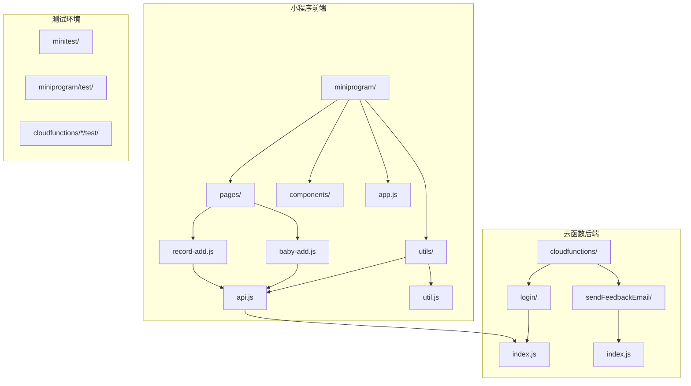
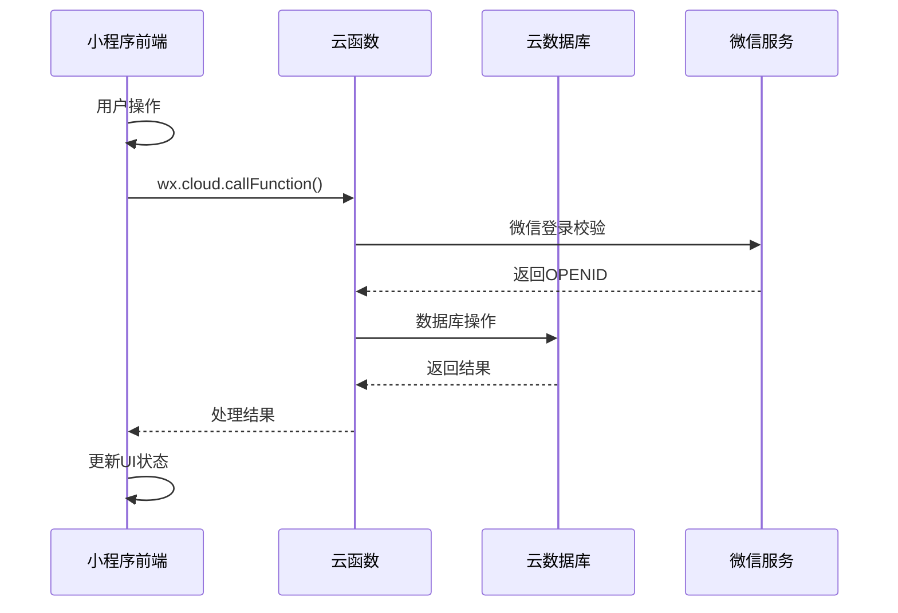
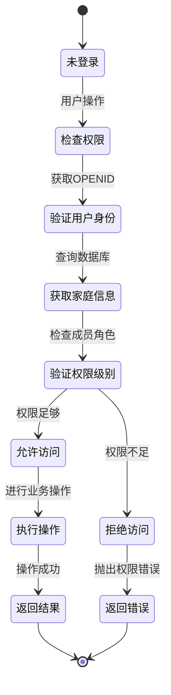
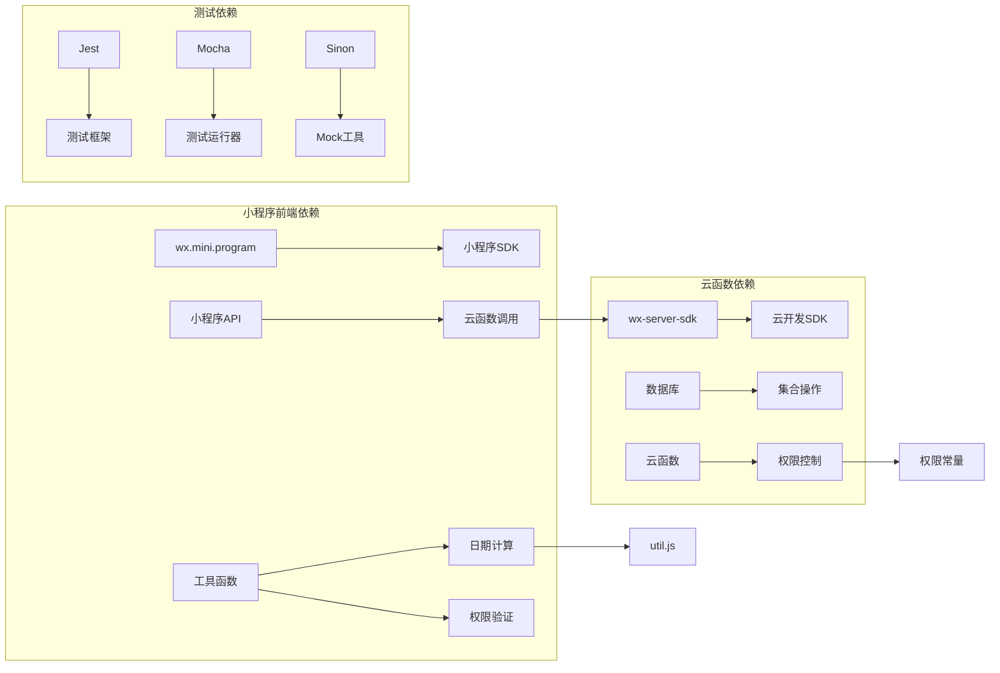

# 单元测试实施指南

<cite>
**本文档引用的文件**
- [api.js](file://miniprogram/utils/api.js)
- [util.js](file://miniprogram/utils/util.js)
- [index.js](file://cloudfunctions/login/index.js)
- [index.js](file://cloudfunctions/sendFeedbackEmail/index.js)
- [app.js](file://miniprogram/app.js)
- [baby-add.js](file://miniprogram/pages/baby-add/baby-add.js)
- [record-add.js](file://miniprogram/pages/record-add/record-add.js)
- [package.json](file://package.json)
- [package.json](file://cloudfunctions/login/package.json)
- [package.json](file://cloudfunctions/sendFeedbackEmail/package.json)
- [test.config.json](file://minitest/test.config.json)
- [envList.js](file://miniprogram/envList.js)
</cite>

## 目录
1. [简介](#简介)
2. [项目结构](#项目结构)
3. [核心组件](#核心组件)
4. [架构概览](#架构概览)
5. [详细组件分析](#详细组件分析)
6. [依赖关系分析](#依赖关系分析)
7. [性能考虑](#性能考虑)
8. [故障排除指南](#故障排除指南)
9. [结论](#结论)
10. [附录](#附录)

## 简介

本指南旨在为微信小程序 BabyAssistant 项目提供完整的单元测试实施方案。该项目是一个专为父母设计的宝宝成长记录工具，包含小程序前端和云函数后端两部分。本指南将详细说明如何为小程序API函数、工具函数以及云函数逻辑编写单元测试，包括测试框架选择、配置方法、Mock数据准备、异步函数测试策略等。

## 项目结构

项目采用典型的微信小程序架构，主要分为以下几个部分：



**图表来源**
- [api.js:1-879](file://miniprogram/utils/api.js#L1-L879)
- [index.js:1-814](file://cloudfunctions/login/index.js#L1-L814)

**章节来源**
- [api.js:1-879](file://miniprogram/utils/api.js#L1-L879)
- [util.js:1-55](file://miniprogram/utils/util.js#L1-L55)
- [index.js:1-814](file://cloudfunctions/login/index.js#L1-L814)

## 核心组件

### 小程序API层组件

小程序的API层主要负责与云函数交互和数据库操作，包含以下核心功能模块：

1. **用户认证管理** - 处理用户登录状态检查和用户信息获取
2. **家庭管理** - 家庭创建、加入、退出、成员管理等功能
3. **宝宝管理** - 宝宝信息增删改查、权限控制
4. **记录管理** - 生长发育记录的添加、查询、删除
5. **权限控制** - 基于角色的访问控制机制

### 云函数组件

云函数提供服务器端逻辑处理，包括：
1. **用户认证** - 微信登录凭证校验、用户信息管理
2. **数据操作** - 数据库事务处理、复杂查询
3. **权限验证** - 严格的权限控制和安全检查
4. **业务逻辑** - 核心业务规则的实现

**章节来源**
- [api.js:1-879](file://miniprogram/utils/api.js#L1-L879)
- [index.js:1-814](file://cloudfunctions/login/index.js#L1-L814)

## 架构概览

系统采用前后端分离架构，通过云函数作为中间层协调小程序前端和数据库：



**图表来源**
- [app.js:28-54](file://miniprogram/app.js#L28-L54)
- [index.js:22-800](file://cloudfunctions/login/index.js#L22-L800)

## 详细组件分析

### 工具函数测试

#### 日期计算函数测试

工具函数模块提供了核心的日期计算功能，需要重点测试以下函数：

```mermaid
flowchart TD
A[caculateAge] --> B[输入: 出生日期, 当前日期]
B --> C[计算年份差值]
C --> D[计算月份差值]
D --> E[计算天数差值]
E --> F[处理借位情况]
F --> G[返回 {years, months, days}]
H[caculateAgeInMonths] --> I[调用caculateAge]
I --> J[转换为月数]
J --> K[15天进位规则]
K --> L[返回总月数]
M[formatAgeString] --> N[格式化年龄字符串]
N --> O[处理0岁0月0天特殊情况]
O --> P[组合年月日描述]
P --> Q[返回格式化字符串]
```

**图表来源**
- [util.js:8-47](file://miniprogram/utils/util.js#L8-L47)

**章节来源**
- [util.js:1-55](file://miniprogram/utils/util.js#L1-L55)

### API函数测试

#### 登录状态管理测试

API函数模块负责管理用户登录状态和等待机制：

```mermaid
flowchart TD
A[waitForLogin] --> B[检查全局用户信息]
B --> C{用户信息存在?}
C --> |是| D[直接返回用户信息]
C --> |否| E[调用app.login()]
E --> F[设置定时器轮询]
F --> G[检查登录状态]
G --> H{登录完成?}
H --> |是| I[返回用户信息]
H --> |否| J{超时?}
J --> |否| K[继续轮询]
J --> |是| L[抛出登录超时错误]
M[getCurrentUser] --> N[获取全局用户信息]
N --> O{有用户信息?}
O --> |是| P[返回用户信息]
O --> |否| Q[从本地存储获取openid]
```

**图表来源**
- [api.js:6-41](file://miniprogram/utils/api.js#L6-L41)
- [app.js:28-54](file://miniprogram/app.js#L28-L54)

**章节来源**
- [api.js:1-800](file://miniprogram/utils/api.js#L1-L800)
- [app.js:1-56](file://miniprogram/app.js#L1-L56)

### 云函数逻辑测试

#### 权限控制系统测试

云函数实现了复杂的权限控制机制，需要测试各种权限场景：



**图表来源**
- [index.js:782-800](file://cloudfunctions/login/index.js#L782-L800)

**章节来源**
- [index.js:1-814](file://cloudfunctions/login/index.js#L1-L814)

## 依赖关系分析

项目的主要依赖关系如下：



**图表来源**
- [package.json:1-22](file://package.json#L1-L22)
- [package.json:1-16](file://cloudfunctions/login/package.json#L1-L16)

**章节来源**
- [package.json:1-22](file://package.json#L1-L22)
- [package.json:1-16](file://cloudfunctions/login/package.json#L1-L16)

## 性能考虑

### 测试性能优化

1. **异步测试优化**
   - 使用Promise和async/await减少测试时间
   - 合理设置超时时间，避免长时间等待
   - 并行执行独立的测试用例

2. **Mock策略优化**
   - 对外部依赖进行合理Mock
   - 缓存Mock数据，避免重复创建
   - 使用轻量级的Mock对象

3. **数据库测试优化**
   - 使用测试环境的数据库实例
   - 在测试结束后清理测试数据
   - 避免在测试中进行真实的网络请求

## 故障排除指南

### 常见测试问题及解决方案

#### 登录状态测试问题

**问题描述**: 测试中无法模拟用户登录状态

**解决方案**:
1. Mock全局App对象的login方法
2. 设置全局用户信息
3. 使用测试专用的环境变量

#### 云函数测试问题

**问题描述**: 无法在本地测试云函数逻辑

**解决方案**:
1. 使用云函数SDK的本地测试模式
2. Mock云函数的上下文对象
3. 使用测试数据库连接

#### 数据库权限测试问题

**问题描述**: 测试中遇到数据库权限错误

**解决方案**:
1. 在测试环境中禁用权限检查
2. 使用测试专用的数据库用户
3. 预先设置测试数据的权限

**章节来源**
- [api.js:14-41](file://miniprogram/utils/api.js#L14-L41)
- [index.js:22-26](file://cloudfunctions/login/index.js#L22-L26)

## 结论

本指南为BabyAssistant项目提供了完整的单元测试实施方案。通过合理的测试分层、Mock策略和测试用例设计，可以有效保证小程序和云函数的核心业务逻辑得到充分验证。建议在实际实施过程中：

1. 优先测试核心业务逻辑，特别是权限控制和数据操作
2. 建立完善的Mock数据体系
3. 制定统一的测试规范和代码风格
4. 持续监控测试覆盖率，确保关键代码得到测试

## 附录

### 测试用例编写模板

#### 工具函数测试模板

```javascript
describe('工具函数测试', () => {
  describe('calculateAge', () => {
    test('应该正确计算年龄', () => {
      // Arrange
      const birthDate = new Date('2020-01-01');
      const currentDate = new Date('2023-06-15');
      
      // Act
      const result = calculateAge(birthDate, currentDate);
      
      // Assert
      expect(result.years).toBe(3);
      expect(result.months).toBe(5);
      expect(result.days).toBe(14);
    });
  });
});
```

#### API函数测试模板

```javascript
describe('API函数测试', () => {
  beforeEach(() => {
    // Mock全局对象
    global.getApp = jest.fn(() => ({
      globalData: { userInfo: null },
      login: jest.fn()
    }));
  });
  
  test('应该正确处理用户登录', async () => {
    // Arrange
    const mockUserInfo = { openid: 'test_openid' };
    
    // Act
    const result = await waitForLogin();
    
    // Assert
    expect(result).toEqual(mockUserInfo);
  });
});
```

#### 云函数测试模板

```javascript
describe('云函数测试', () => {
  test('应该正确验证用户权限', async () => {
    // Arrange
    const mockEvent = {
      action: 'checkPermission',
      babyId: 'test_baby_id',
      requiredPermission: 'guardian'
    };
    
    const mockContext = {
      OPENID: 'test_user_openid'
    };
    
    // Act
    const result = await loginCloudFunction.main(mockEvent, mockContext);
    
    // Assert
    expect(result).toHaveProperty('success', true);
  });
});
```

### 测试覆盖率要求

建议的测试覆盖率目标：
- **工具函数**: 100%
- **API函数**: 90%
- **云函数**: 85%
- **页面逻辑**: 80%

### 测试环境配置

1. **测试框架**: Jest
2. **Mock工具**: Sinon
3. **覆盖率工具**: Istanbul
4. **测试运行器**: npm scripts