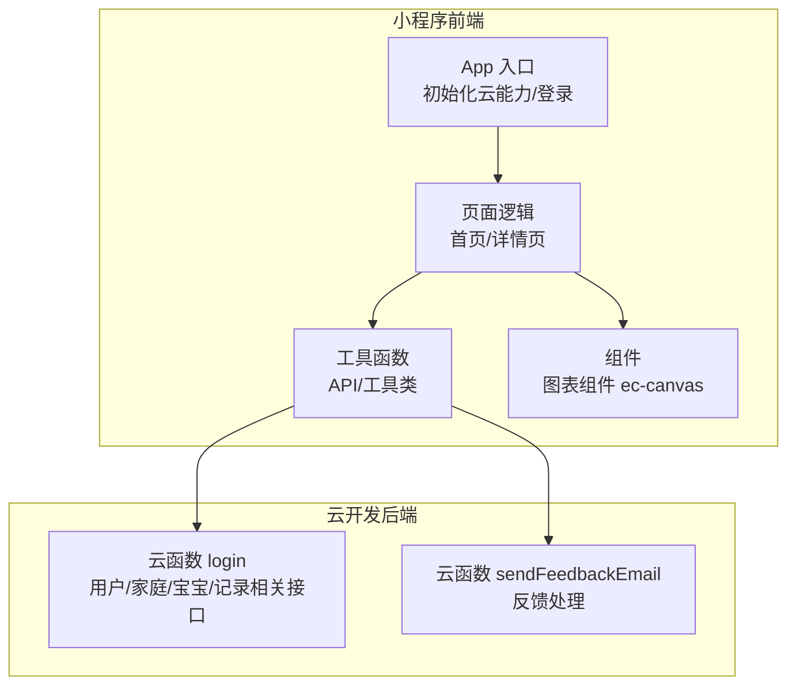
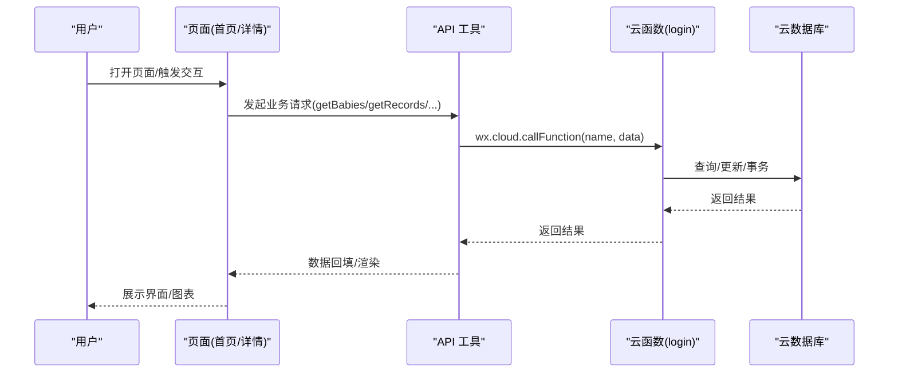
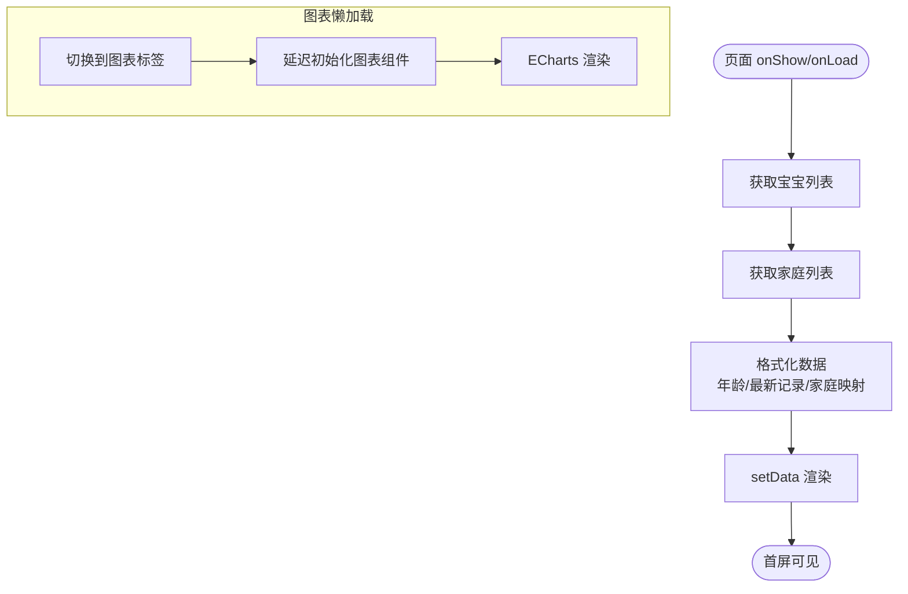
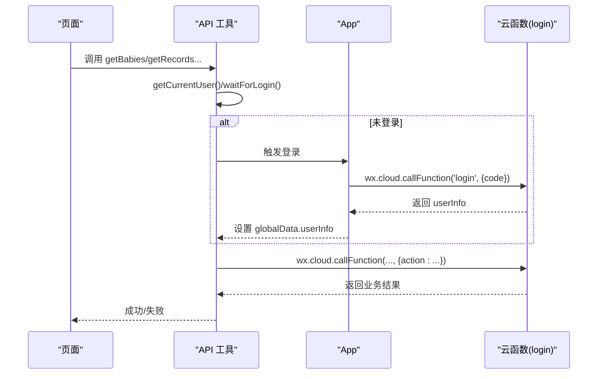
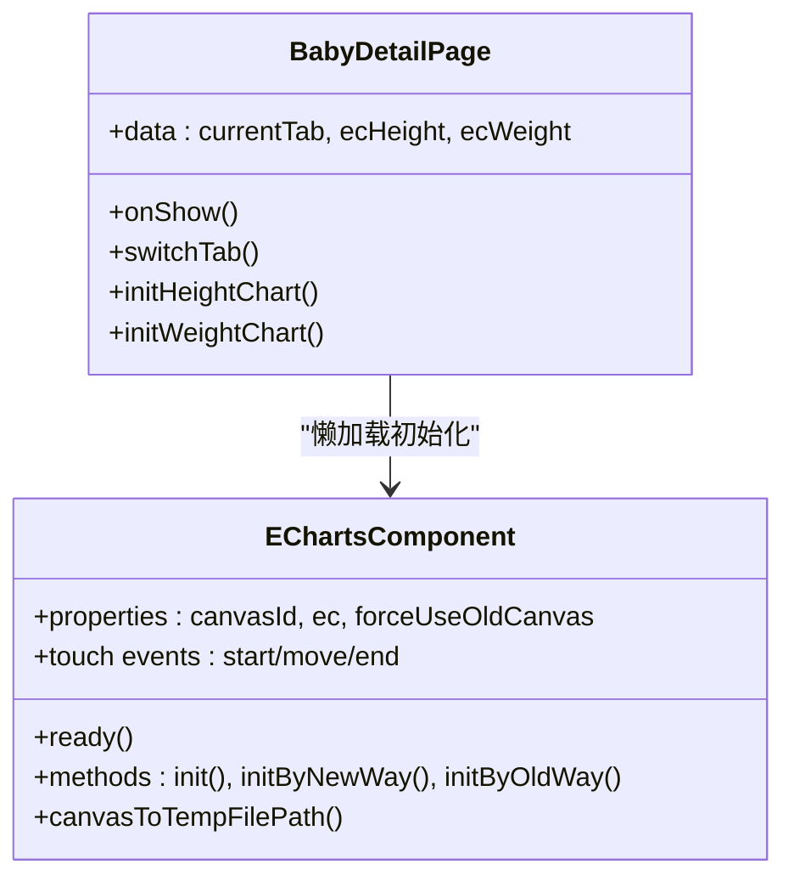
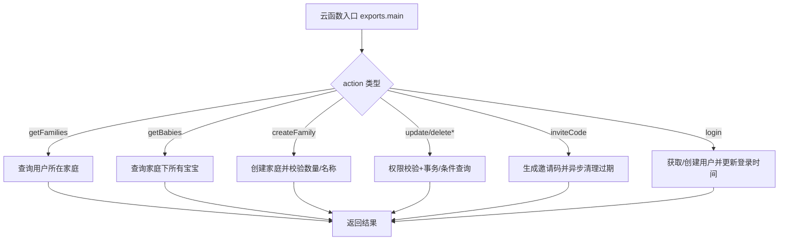
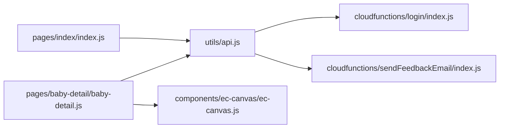

# 性能测试

<cite>
**本文引用的文件**
- [miniprogram/app.js](file://miniprogram/app.js)
- [miniprogram/utils/api.js](file://miniprogram/utils/api.js)
- [miniprogram/utils/util.js](file://miniprogram/utils/util.js)
- [miniprogram/pages/index/index.js](file://miniprogram/pages/index/index.js)
- [miniprogram/pages/baby-detail/baby-detail.js](file://miniprogram/pages/baby-detail/baby-detail.js)
- [miniprogram/components/ec-canvas/ec-canvas.js](file://miniprogram/components/ec-canvas/ec-canvas.js)
- [miniprogram/pages/baby-detail/baby-detail.json](file://miniprogram/pages/baby-detail/baby-detail.json)
- [miniprogram/pages/index/index.json](file://miniprogram/pages/index/index.json)
- [miniprogram/app.json](file://miniprogram/app.json)
- [cloudfunctions/login/index.js](file://cloudfunctions/login/index.js)
- [cloudfunctions/sendFeedbackEmail/index.js](file://cloudfunctions/sendFeedbackEmail/index.js)
- [cloudfunctions/login/package.json](file://cloudfunctions/login/package.json)
</cite>

## 目录
1. [简介](#简介)
2. [项目结构](#项目结构)
3. [核心组件](#核心组件)
4. [架构总览](#架构总览)
5. [详细组件分析](#详细组件分析)
6. [依赖关系分析](#依赖关系分析)
7. [性能考量与优化建议](#性能考量与优化建议)
8. [故障排查指南](#故障排查指南)
9. [结论](#结论)
10. [附录](#附录)

## 简介
本指南面向微信小程序“宝宝助手”的性能测试与优化，覆盖以下目标：
- 小程序端性能测试：页面加载时间、API 响应时间、图表渲染性能、内存使用监控
- 云函数性能测试：冷启动时间、并发处理能力、资源消耗监控
- 基准线建立与维护：正常场景、峰值场景、异常场景的测试标准
- 性能瓶颈识别与优化：代码优化、数据库查询优化、网络请求优化
- 用户体验相关指标：首屏渲染、交互响应、图表渲染性能

## 项目结构
项目采用典型的微信小程序分层结构：
- 小程序前端：页面、组件、工具函数、应用入口
- 云开发后端：云函数（登录、反馈邮件等）

**图表来源**
- [miniprogram/app.js:1-56](file://miniprogram/app.js#L1-L56)
- [miniprogram/utils/api.js:1-879](file://miniprogram/utils/api.js#L1-L879)
- [cloudfunctions/login/index.js:1-814](file://cloudfunctions/login/index.js#L1-L814)
- [cloudfunctions/sendFeedbackEmail/index.js:1-21](file://cloudfunctions/sendFeedbackEmail/index.js#L1-L21)

**章节来源**
- [miniprogram/app.js:1-56](file://miniprogram/app.js#L1-L56)
- [miniprogram/app.json:1-39](file://miniprogram/app.json#L1-L39)

## 核心组件
- 应用入口与初始化：负责云能力初始化、环境配置、登录流程
- API 层：封装数据库与云函数调用，统一等待登录、错误处理
- 页面层：首页列表页与详情页，承载数据展示与交互
- 图表组件：基于 ECharts 的跨基础库适配组件，支持懒加载与多画布模式
- 云函数：登录鉴权、家庭/宝宝/记录管理、邀请码等业务逻辑

**章节来源**
- [miniprogram/app.js:1-56](file://miniprogram/app.js#L1-L56)
- [miniprogram/utils/api.js:1-879](file://miniprogram/utils/api.js#L1-L879)
- [miniprogram/pages/index/index.js:1-144](file://miniprogram/pages/index/index.js#L1-L144)
- [miniprogram/pages/baby-detail/baby-detail.js:1-691](file://miniprogram/pages/baby-detail/baby-detail.js#L1-L691)
- [miniprogram/components/ec-canvas/ec-canvas.js:1-285](file://miniprogram/components/ec-canvas/ec-canvas.js#L1-L285)
- [cloudfunctions/login/index.js:1-814](file://cloudfunctions/login/index.js#L1-L814)

## 架构总览
小程序通过云函数访问云数据库，页面通过 API 工具发起请求，图表组件负责可视化渲染。

**图表来源**
- [miniprogram/utils/api.js:1-879](file://miniprogram/utils/api.js#L1-L879)
- [cloudfunctions/login/index.js:1-814](file://cloudfunctions/login/index.js#L1-L814)

## 详细组件分析

### 页面加载与交互响应测试
- 首页加载：进入页面时拉取宝宝列表与家庭列表，格式化年龄与最新记录，再 setData 渲染
- 详情页加载：根据 babyId 拉取宝宝信息、家庭信息、记录列表，按标签切换懒加载图表
- 交互响应：点击跳转、弹窗确认、权限校验、删除/新增等

**图表来源**
- [miniprogram/pages/index/index.js:10-52](file://miniprogram/pages/index/index.js#L10-L52)
- [miniprogram/pages/baby-detail/baby-detail.js:178-245](file://miniprogram/pages/baby-detail/baby-detail.js#L178-L245)

**章节来源**
- [miniprogram/pages/index/index.js:1-144](file://miniprogram/pages/index/index.js#L1-L144)
- [miniprogram/pages/baby-detail/baby-detail.js:1-691](file://miniprogram/pages/baby-detail/baby-detail.js#L1-L691)

### API 请求与权限控制测试
- 登录等待：waitForLogin 在 5 秒内轮询等待登录完成，避免未授权请求
- 权限校验：checkPermission 通过云函数校验用户在家庭内的权限级别
- 统一错误处理：API 工具对数据库/云函数调用进行 try/catch 并输出日志

**图表来源**
- [miniprogram/utils/api.js:14-41](file://miniprogram/utils/api.js#L14-L41)
- [miniprogram/app.js:23-54](file://miniprogram/app.js#L23-L54)
- [cloudfunctions/login/index.js:22-800](file://cloudfunctions/login/index.js#L22-L800)

**章节来源**
- [miniprogram/utils/api.js:1-879](file://miniprogram/utils/api.js#L1-L879)
- [miniprogram/app.js:1-56](file://miniprogram/app.js#L1-L56)
- [cloudfunctions/login/index.js:1-814](file://cloudfunctions/login/index.js#L1-L814)

### 图表渲染性能测试
- 组件特性：支持新旧 Canvas 切换、禁用渐进式绘制、懒加载初始化
- 详情页：身高/体重两条曲线，标准曲线与实测点叠加，支持缩放/平移
- 性能关注：大数据集时的渲染帧率、触摸交互流畅度、内存占用

**图表来源**
- [miniprogram/components/ec-canvas/ec-canvas.js:31-285](file://miniprogram/components/ec-canvas/ec-canvas.js#L31-L285)
- [miniprogram/pages/baby-detail/baby-detail.js:156-473](file://miniprogram/pages/baby-detail/baby-detail.js#L156-L473)

**章节来源**
- [miniprogram/components/ec-canvas/ec-canvas.js:1-285](file://miniprogram/components/ec-canvas/ec-canvas.js#L1-L285)
- [miniprogram/pages/baby-detail/baby-detail.js:1-691](file://miniprogram/pages/baby-detail/baby-detail.js#L1-L691)

### 云函数性能测试
- 登录与鉴权：换取用户信息、记录最后登录时间
- 家庭/宝宝/记录：查询、创建、更新、删除、事务、权限校验
- 邀请码：生成、过期清理、幂等处理
- 并发与冷启动：通过压测工具模拟高并发请求，观察首次调用耗时与平均耗时

**图表来源**
- [cloudfunctions/login/index.js:22-814](file://cloudfunctions/login/index.js#L22-L814)

**章节来源**
- [cloudfunctions/login/index.js:1-814](file://cloudfunctions/login/index.js#L1-L814)
- [cloudfunctions/sendFeedbackEmail/index.js:1-21](file://cloudfunctions/sendFeedbackEmail/index.js#L1-L21)

## 依赖关系分析
- 页面依赖 API 工具，API 工具依赖云函数与云数据库
- 图表组件独立于页面，通过懒加载注入 ECharts 实例
- 云函数依赖 wx-server-sdk 与云数据库命令

**图表来源**
- [miniprogram/pages/index/index.js:1-144](file://miniprogram/pages/index/index.js#L1-L144)
- [miniprogram/pages/baby-detail/baby-detail.js:1-691](file://miniprogram/pages/baby-detail/baby-detail.js#L1-L691)
- [miniprogram/utils/api.js:1-879](file://miniprogram/utils/api.js#L1-L879)
- [miniprogram/components/ec-canvas/ec-canvas.js:1-285](file://miniprogram/components/ec-canvas/ec-canvas.js#L1-L285)
- [cloudfunctions/login/index.js:1-814](file://cloudfunctions/login/index.js#L1-L814)
- [cloudfunctions/sendFeedbackEmail/index.js:1-21](file://cloudfunctions/sendFeedbackEmail/index.js#L1-L21)

**章节来源**
- [miniprogram/app.json:1-39](file://miniprogram/app.json#L1-L39)
- [cloudfunctions/login/package.json:1-16](file://cloudfunctions/login/package.json#L1-L16)

## 性能考量与优化建议

### 小程序端性能测试方法
- 页面加载时间
  - 指标：首屏可见时间、WXML 渲染完成时间、JS 执行时间
  - 方法：在页面生命周期 onReady/onShow 中打点，结合 WX DevTools Network/Performance 面板
  - 关注点：懒加载策略（详情页图表）、setData 数据量、组件初始化时机
- API 响应时间
  - 指标：云函数平均/95 分位/最大耗时，错误率
  - 方法：对关键接口（获取宝宝列表、记录列表）进行压力测试，统计 RT 分布
  - 关注点：登录等待超时、网络抖动、云函数并发
- 图表渲染性能
  - 指标：ECharts 初始化耗时、渲染帧率、触摸交互延迟
  - 方法：对比新旧 Canvas 模式，评估大数据点下的渲染表现
  - 关注点：禁用渐进式绘制、合理设置 dataZoom 起止值、减少不必要的重绘
- 内存使用监控
  - 方法：使用微信开发者工具 Memory 面板，关注页面栈深度、组件实例数量
  - 关注点：图表组件销毁、页面离开时释放定时器/监听器

### 云函数性能测试策略
- 冷启动时间
  - 方法：首次调用与重复调用 RT 对比，统计 P95/P99
  - 关注点：依赖包体积、初始化逻辑、数据库连接池
- 并发处理能力
  - 方法：并发 10/50/100 请求，观察平均 RT、错误率、超时率
  - 关注点：事务锁竞争、数据库查询索引、权限校验逻辑
- 资源消耗监控
  - 方法：云开发控制台查看 CPU/内存/流量指标
  - 关注点：批量写入、聚合查询、邀请码清理任务

### 性能基准线建立与维护
- 正常场景
  - 首屏时间：首页 < 2s；详情页图表懒加载后 < 3s
  - API RT：P95 < 1.5s；错误率 < 0.1%
- 峰值场景
  - 并发 100 请求，P95 RT < 3s；错误率 < 1%
- 异常场景
  - 登录等待超时（>5s）告警；数据库查询超时（>5s）告警；图表渲染卡顿检测

### 性能瓶颈识别与优化
- 代码优化
  - 避免在 setData 中传递超大对象；拆分渲染字段；减少不必要的页面更新
  - 图表初始化延迟到 onReady 或切换到标签页时
- 数据库查询优化
  - 为常用查询字段建立索引（如 families.members.openid、records.babyId）
  - 使用事务时尽量缩小作用域，避免长事务
- 网络请求优化
  - 合理使用云函数封装数据库权限，减少客户端直连
  - 对高频接口增加缓存策略（如家庭列表短期内缓存）

[本节为通用指导，无需具体文件分析]

## 故障排查指南
- 登录超时
  - 现象：waitForLogin 超过 5 秒报错
  - 排查：检查 App 登录流程、云函数 login 是否可用、网络状态
- 权限不足
  - 现象：提示“无权限”或“只有一级助教/二级助教”
  - 排查：确认用户在家庭中的成员信息与权限字段
- 图表初始化失败
  - 现象：找不到组件或初始化报错
  - 排查：确认 usingComponents 配置、组件版本、基础库版本要求
- 云函数错误
  - 现象：返回 success:false 或抛出异常
  - 排查：查看云函数日志、数据库权限、输入参数校验

**章节来源**
- [miniprogram/utils/api.js:14-41](file://miniprogram/utils/api.js#L14-L41)
- [miniprogram/pages/baby-detail/baby-detail.json:1-8](file://miniprogram/pages/baby-detail/baby-detail.json#L1-L8)
- [cloudfunctions/login/index.js:1-814](file://cloudfunctions/login/index.js#L1-L814)

## 结论
通过系统化的性能测试与优化，可在保证用户体验的前提下提升小程序与云函数的稳定性与吞吐能力。建议持续建立基准线并定期回归测试，配合监控告警机制，及时发现并解决性能问题。

[本节为总结，无需具体文件分析]

## 附录

### 测试清单（建议）
- 小程序端
  - 首屏渲染时间测试（首页/详情）
  - API 响应时间与错误率（关键接口）
  - 图表渲染帧率与交互延迟（大数据集）
  - 内存与页面栈监控
- 云函数端
  - 冷启动时间与并发 RT
  - 并发 100 请求的稳定性
  - 数据库慢查询与索引命中率

[本节为补充材料，无需具体文件分析]