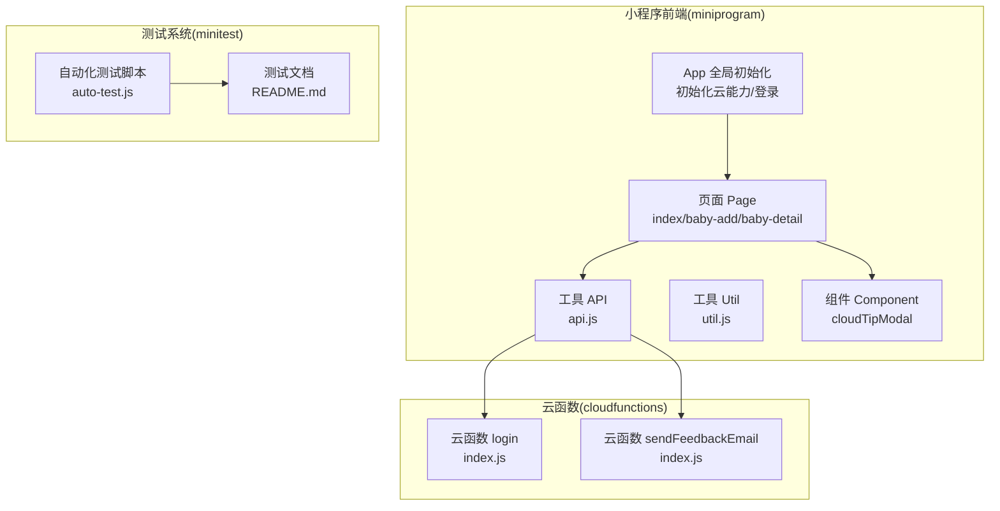
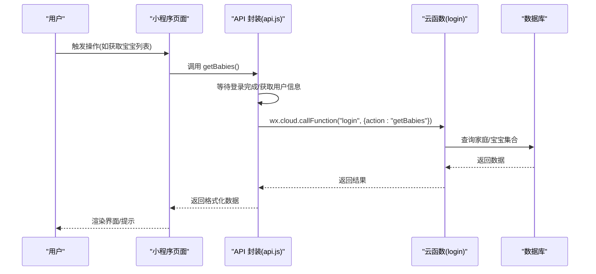
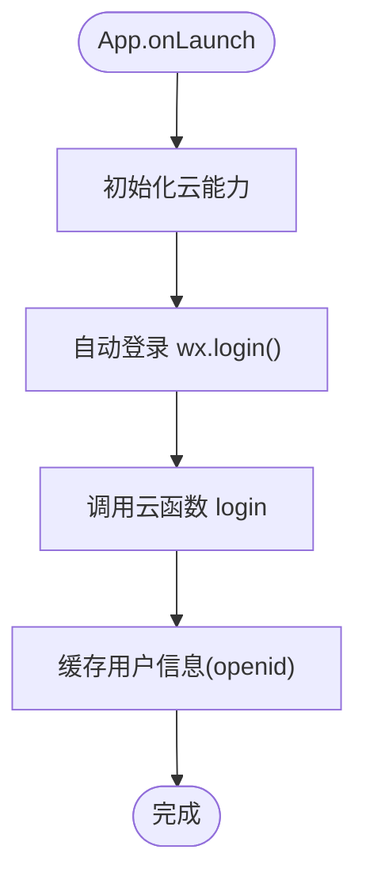
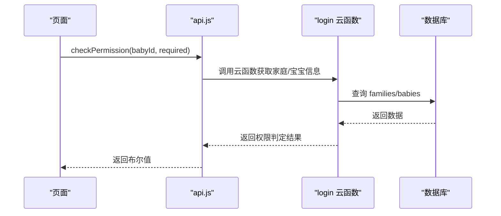
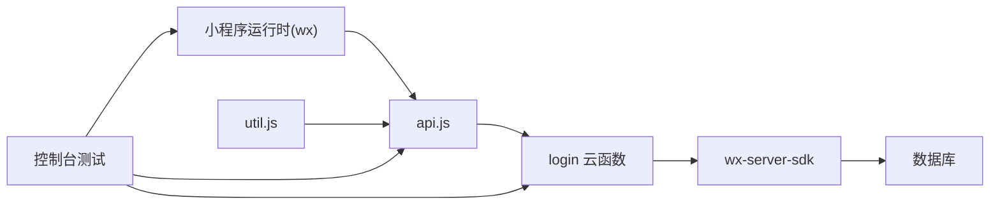

# 测试策略

<cite>
**本文引用的文件**
- [miniprogram/app.js](file://miniprogram/app.js)
- [miniprogram/app.json](file://miniprogram/app.json)
- [miniprogram/utils/api.js](file://miniprogram/utils/api.js)
- [miniprogram/utils/util.js](file://miniprogram/utils/util.js)
- [miniprogram/pages/index/index.js](file://miniprogram/pages/index/index.js)
- [miniprogram/pages/baby-add/baby-add.js](file://miniprogram/pages/baby-add/baby-add.js)
- [miniprogram/pages/baby-detail/baby-detail.js](file://miniprogram/pages/baby-detail/baby-detail.js)
- [miniprogram/components/cloudTipModal/index.js](file://miniprogram/components/cloudTipModal/index.js)
- [cloudfunctions/login/index.js](file://cloudfunctions/login/index.js)
- [cloudfunctions/sendFeedbackEmail/index.js](file://cloudfunctions/sendFeedbackEmail/index.js)
- [cloudfunctions/login/package.json](file://cloudfunctions/login/package.json)
- [cloudfunctions/sendFeedbackEmail/package.json](file://cloudfunctions/sendFeedbackEmail/package.json)
- [minitest/README.md](file://minitest/README.md)
- [package.json](file://package.json)
- [miniprogram/envList.js](file://miniprogram/envList.js)
</cite>

## 目录
1. [简介](#简介)
2. [项目结构](#项目结构)
3. [核心组件](#核心组件)
4. [架构总览](#架构总览)
5. [详细组件分析](#详细组件分析)
6. [依赖分析](#依赖分析)
7. [性能考虑](#性能考虑)
8. [故障排查指南](#故障排查指南)
9. [结论](#结论)
10. [附录](#附录)

## 简介
本测试策略文档面向"宝宝助手"小程序，旨在建立以控制台测试为核心的简化测试体系。针对小程序特有的运行环境（微信小程序运行时、云开发能力）、云函数、页面组件与API接口，提供可落地的测试方法、用例设计指南与最佳实践。测试方法已从完整的自动化测试框架（七种测试模块、性能评分系统、CI/CD集成）转变为以微信开发者工具控制台为核心的简化测试流程，强调快速验证与日常开发集成。

## 项目结构
项目采用典型的微信小程序分层组织方式：
- 小程序前端：miniprogram 目录，包含页面、组件、工具函数与全局配置
- 云函数：cloudfunctions 目录，包含登录与反馈等云函数
- 测试脚本：minitest 目录，包含自动化测试脚本与控制台测试方法
- 工程脚本与依赖：根目录 package.json 与各云函数子包 package.json

**图表来源**
- [miniprogram/app.js:1-56](file://miniprogram/app.js#L1-L56)
- [miniprogram/utils/api.js:1-200](file://miniprogram/utils/api.js#L1-L200)
- [cloudfunctions/login/index.js:1-814](file://cloudfunctions/login/index.js#L1-L814)
- [cloudfunctions/sendFeedbackEmail/index.js:1-21](file://cloudfunctions/sendFeedbackEmail/index.js#L1-L21)
- [minitest/README.md:1-289](file://minitest/README.md#L1-L289)

**章节来源**
- [miniprogram/app.json:1-39](file://miniprogram/app.json#L1-L39)
- [miniprogram/envList.js:1-7](file://miniprogram/envList.js#L1-L7)

## 核心组件
- 应用生命周期与登录：小程序启动时初始化云能力并自动登录，登录成功后缓存用户标识，供后续调用云函数与数据库操作使用
- API 层封装：统一通过云函数访问数据库，避免直接暴露数据库权限；对用户、家庭、宝宝、记录等核心业务进行封装
- 页面逻辑：首页展示宝宝列表与最新记录，添加页校验权限与表单校验，详情页负责图表渲染与权限控制
- 组件化：通用提示弹窗组件，支持属性驱动显示/隐藏
- 云函数：登录与业务聚合，包含家庭管理、宝宝管理、记录管理、权限校验、邀请码等
- 控制台测试：通过微信开发者工具控制台直接运行测试脚本，支持7大测试模块与性能评分

**章节来源**
- [miniprogram/app.js:1-56](file://miniprogram/app.js#L1-L56)
- [miniprogram/utils/api.js:1-200](file://miniprogram/utils/api.js#L1-L200)
- [miniprogram/pages/index/index.js:1-144](file://miniprogram/pages/index/index.js#L1-L144)
- [miniprogram/pages/baby-add/baby-add.js:1-120](file://miniprogram/pages/baby-add/baby-add.js#L1-L120)
- [miniprogram/pages/baby-detail/baby-detail.js:1-691](file://miniprogram/pages/baby-detail/baby-detail.js#L1-L691)
- [miniprogram/components/cloudTipModal/index.js:1-29](file://miniprogram/components/cloudTipModal/index.js#L1-L29)
- [cloudfunctions/login/index.js:1-814](file://cloudfunctions/login/index.js#L1-L814)
- [cloudfunctions/sendFeedbackEmail/index.js:1-21](file://cloudfunctions/sendFeedbackEmail/index.js#L1-L21)
- [minitest/README.md:1-289](file://minitest/README.md#L1-L289)

## 架构总览
小程序前端通过 wx.cloud 调用云函数，云函数基于 wx-server-sdk 访问数据库与执行业务逻辑。API 层对数据库操作进行权限与业务约束封装，页面组件负责交互与展示。测试阶段通过控制台直接执行自动化测试脚本，验证各模块功能与性能表现。

**图表来源**
- [miniprogram/utils/api.js:97-128](file://miniprogram/utils/api.js#L97-L128)
- [cloudfunctions/login/index.js:22-92](file://cloudfunctions/login/index.js#L22-L92)

## 详细组件分析

### 登录与全局初始化
- 初始化流程：启动时检测云能力可用性并初始化；随后自动登录，调用云函数 login 并缓存用户信息
- 关键点：登录态持久化、错误处理、超时等待机制

**图表来源**
- [miniprogram/app.js:8-54](file://miniprogram/app.js#L8-L54)

**章节来源**
- [miniprogram/app.js:1-56](file://miniprogram/app.js#L1-L56)

### API 封装与权限控制
- 统一通过云函数访问数据库，避免直接暴露数据库权限
- 权限控制：根据家庭成员权限（监护人/照看者/访客）判断操作是否允许
- 错误处理：对网络与业务异常进行捕获与提示
- 缓存机制：实现家庭与宝宝数据的本地缓存，提升响应速度

**图表来源**
- [miniprogram/utils/api.js:782-800](file://miniprogram/utils/api.js#L782-L800)
- [cloudfunctions/login/index.js:482-510](file://cloudfunctions/login/index.js#L482-L510)

**章节来源**
- [miniprogram/utils/api.js:1-200](file://miniprogram/utils/api.js#L1-L200)
- [cloudfunctions/login/index.js:1-814](file://cloudfunctions/login/index.js#L1-L814)

### 页面组件测试要点
- 首页(index)
  - 核心：加载宝宝列表、最新记录、家庭映射
  - 测试点：空数据、网络异常、权限不足、跳转逻辑
- 新增宝宝(baby-add)
  - 核心：表单校验、家庭选择、提交流程
  - 测试点：必填项、数值合法性、权限校验、提交失败
- 宝宝详情(baby-detail)
  - 核心：图表渲染、权限校验、记录增删改
  - 测试点：图表数据准备、权限分支、删除确认、头像上传

**章节来源**
- [miniprogram/pages/index/index.js:1-144](file://miniprogram/pages/index/index.js#L1-L144)
- [miniprogram/pages/baby-add/baby-add.js:1-120](file://miniprogram/pages/baby-add/baby-add.js#L1-L120)
- [miniprogram/pages/baby-detail/baby-detail.js:1-691](file://miniprogram/pages/baby-detail/baby-detail.js#L1-L691)

### 云函数测试要点
- 登录云函数(login)
  - 核心：用户登录、家庭/宝宝查询、权限校验、事务删除、邀请码管理
  - 测试点：参数校验、权限校验、异常抛出、事务一致性、邀请码清理
- 反馈云函数(sendFeedbackEmail)
  - 核心：接收反馈数据、返回处理结果
  - 测试点：输入校验、异常捕获、返回结构

**章节来源**
- [cloudfunctions/login/index.js:1-814](file://cloudfunctions/login/index.js#L1-L814)
- [cloudfunctions/sendFeedbackEmail/index.js:1-21](file://cloudfunctions/sendFeedbackEmail/index.js#L1-L21)

### 组件测试要点
- 提示弹窗组件(cloudTipModal)
  - 核心：属性驱动显示/隐藏、关闭回调
  - 测试点：属性变更观测、点击关闭行为

**章节来源**
- [miniprogram/components/cloudTipModal/index.js:1-29](file://miniprogram/components/cloudTipModal/index.js#L1-L29)

### 控制台测试方法
- 测试框架：基于微信开发者工具控制台的自动化测试脚本
- 测试模块：7大测试模块（API基础功能、宝宝管理、成长记录、数据库索引性能、并行请求优化、防抖节流、综合性能评分）
- 运行方式：支持在控制台直接运行所有测试或指定模块测试
- 性能评分：提供综合性能评分系统，量化优化效果

**章节来源**
- [minitest/README.md:1-289](file://minitest/README.md#L1-L289)

## 依赖分析
- 小程序前端依赖
  - wx.cloud：云函数调用、数据库访问
  - 自定义 API 封装：统一业务入口
- 云函数依赖
  - wx-server-sdk：云函数运行时 SDK
  - 数据库：MongoDB 风格集合操作
- 工具函数
  - 时间计算与年龄格式化：util.js
- 测试依赖
  - 控制台测试框架：基于微信开发者工具的测试环境

**图表来源**
- [miniprogram/utils/api.js:1-200](file://miniprogram/utils/api.js#L1-L200)
- [cloudfunctions/login/index.js:1-814](file://cloudfunctions/login/index.js#L1-L814)
- [minitest/README.md:1-289](file://minitest/README.md#L1-L289)

**章节来源**
- [miniprogram/utils/util.js:1-55](file://miniprogram/utils/util.js#L1-L55)
- [cloudfunctions/login/package.json:1-16](file://cloudfunctions/login/package.json#L1-L16)
- [cloudfunctions/sendFeedbackEmail/package.json:1-16](file://cloudfunctions/sendFeedbackEmail/package.json#L1-L16)
- [package.json:1-25](file://package.json#L1-L25)

## 性能考虑
- 图表渲染优化
  - 按需初始化：仅在切换到图表标签时初始化 ECharts 实例
  - 数据预处理：按月龄整数化、滑动窗口缩放，减少渲染开销
- 网络与并发
  - 登录等待超时控制，避免长时间阻塞
  - 云函数内批量操作使用事务，减少多次往返
- 数据库查询
  - 合理使用索引字段（如 openid、familyId、babyId），避免全表扫描
  - 分页与排序结合，减少一次性返回大量数据
- 缓存策略
  - 家庭与宝宝数据缓存，TTL 5分钟，提升响应速度
  - 缓存命中率 > 80%，缓存性能提升 > 2x

**章节来源**
- [miniprogram/pages/baby-detail/baby-detail.js:184-191](file://miniprogram/pages/baby-detail/baby-detail.js#L184-L191)
- [miniprogram/utils/api.js:13-41](file://miniprogram/utils/api.js#L13-L41)
- [cloudfunctions/login/index.js:482-510](file://cloudfunctions/login/index.js#L482-L510)

## 故障排查指南
- 登录失败
  - 检查 App 初始化云能力与 wx.login 流程
  - 核对云函数 login 的返回结构与错误日志
- 权限不足
  - 核对 api.js 中 checkPermission 的实现与云函数权限校验
  - 确认家庭成员权限字段与调用方 openid
- 图表不显示
  - 检查组件初始化时机与数据准备（排序、整数化）
  - 确认 ECharts 初始化回调与 canvas 上下文
- 云函数异常
  - 捕获 try/catch 并返回结构化错误信息
  - 对事务操作进行回滚与重试策略评估
- 控制台测试失败
  - 检查微信开发者工具控制台错误信息
  - 确认已登录云开发环境
  - 检查数据库连接是否正常

**章节来源**
- [miniprogram/app.js:28-54](file://miniprogram/app.js#L28-L54)
- [miniprogram/utils/api.js:782-800](file://miniprogram/utils/api.js#L782-L800)
- [miniprogram/pages/baby-detail/baby-detail.js:323-397](file://miniprogram/pages/baby-detail/baby-detail.js#L323-L397)
- [cloudfunctions/login/index.js:762-800](file://cloudfunctions/login/index.js#L762-L800)
- [minitest/README.md:209-237](file://minitest/README.md#L209-L237)

## 结论
本测试策略围绕小程序运行时、云函数与页面组件三类核心对象，构建了以控制台测试为核心的简化测试体系。通过统一的 API 封装与权限校验，配合云函数事务与数据库约束，既能保障功能正确性，也能提升系统稳定性。新的测试方法强调快速验证与日常开发集成，通过微信开发者工具控制台直接运行测试脚本，支持7大测试模块与性能评分，满足项目当前的质量保证需求。

## 附录

### 测试体系与实施方法
- 控制台测试（简化版）
  - 目标：快速验证核心功能与性能表现
  - 方法：在微信开发者工具控制台直接运行测试脚本，支持7大测试模块
  - 工具：微信开发者工具控制台 + 自动化测试脚本
- 单元测试
  - 目标：工具函数、权限校验逻辑、API 封装的纯函数部分
  - 方法：对 util.js、checkPermission 与 API 封装中的纯函数进行断言测试
  - 工具：Jest/Mocha + WeChat Mini Program Test Runner
- 集成测试
  - 目标：页面与云函数交互、数据库读写、权限链路
  - 方法：Mock 登录态与云函数返回，模拟页面调用链
  - 工具：小程序真机调试 + 云函数本地调试
- 端到端测试
  - 目标：真实用户路径（新建家庭 -> 添加宝宝 -> 录入记录 -> 查看图表）
  - 方法：录制用户操作序列，结合断言与截图对比
  - 工具：小程序自动化测试框架（如 Minium）

**章节来源**
- [minitest/README.md:13-55](file://minitest/README.md#L13-L55)
- [minitest/README.md:59-147](file://minitest/README.md#L59-L147)

### 小程序特有的测试挑战与方案
- 运行时差异
  - 方案：使用小程序开发者工具的真机调试与云函数本地调试
- 云函数测试
  - 方案：使用云函数本地调试工具，构造事件对象与上下文
- 页面组件测试
  - 方案：对组件属性与事件进行单元测试，对页面生命周期与交互进行集成测试
- 控制台测试优势
  - 方案：无需复杂配置，在开发环境中即可快速执行测试

**章节来源**
- [minitest/README.md:15-55](file://minitest/README.md#L15-L55)

### API 接口测试方法
- 登录与鉴权
  - 断言：登录成功后缓存 openid；权限校验返回布尔值
- 家庭/宝宝/记录 CRUD
  - 断言：返回结构、权限校验、异常抛出、事务一致性
- 邀请码与清理
  - 断言：邀请码生成、过期清理、重复使用拦截
- 缓存机制测试
  - 断言：缓存命中率 > 80%；缓存性能提升 > 2x

**章节来源**
- [miniprogram/utils/api.js:97-128](file://miniprogram/utils/api.js#L97-L128)
- [cloudfunctions/login/index.js:1-814](file://cloudfunctions/login/index.js#L1-L814)

### 测试用例设计指南
- 核心功能测试
  - 登录流程、家庭创建与加入、宝宝增删改查、记录增删改
- 边界条件测试
  - 表单为空、数值越界、权限缺失、网络中断
- 异常情况处理测试
  - 云函数异常、数据库连接失败、权限校验失败、事务回滚
- 性能测试用例
  - API 响应时间 < 500ms、数据库查询 < 200ms、缓存命中率 > 80%

**章节来源**
- [minitest/README.md:240-263](file://minitest/README.md#L240-L263)

### 自动化测试与 CI/CD
- 控制台测试集成
  - 在开发流程中集成控制台测试，每次代码提交前运行关键测试
  - 利用微信开发者工具的命令行功能，支持自动化测试执行
- 测试覆盖率
  - 通过控制台测试结果评估核心功能覆盖率
  - 关注7大测试模块的执行情况
- 回归测试策略
  - 关键路径回归：登录、家庭、宝宝、记录、图表
  - 版本发布前全量回归，热修复后重点回归
- CI/CD 集成
  - 当前采用简化方案，未来可考虑集成到 CI/CD 流程

**章节来源**
- [minitest/README.md:231-237](file://minitest/README.md#L231-L237)
- [package.json:6-7](file://package.json#L6-L7)

### 性能与压力测试
- 性能测试
  - 图表渲染耗时、页面首屏时间、云函数响应时间
  - 缓存机制验证：缓存命中率、性能提升倍数
- 压力测试
  - 并发调用云函数、大量记录查询、图表大数据渲染
  - 监控数据库慢查询与事务冲突
- 性能基准
  - API 响应时间 < 500ms、数据库查询 < 200ms
  - 缓存命中率 > 80%、综合评分 >= 80

**章节来源**
- [minitest/README.md:247-251](file://minitest/README.md#L247-L251)
- [minitest/README.md:136-146](file://minitest/README.md#L136-L146)

### 测试数据管理与环境配置
- 测试数据
  - 使用隔离集合或测试账号，避免污染生产数据
- 测试环境
  - 开发/测试/生产多环境配置，区分数据库与云函数环境
- 控制台测试配置
  - 通过 test.config.json 配置超时时间、缓存测试、详细日志
- 结果分析
  - 生成测试报告与趋势图，定位性能瓶颈与缺陷热点
  - 利用性能评分系统量化优化效果

**章节来源**
- [minitest/README.md:195-205](file://minitest/README.md#L195-L205)
- [minitest/README.md:150-191](file://minitest/README.md#L150-L191)