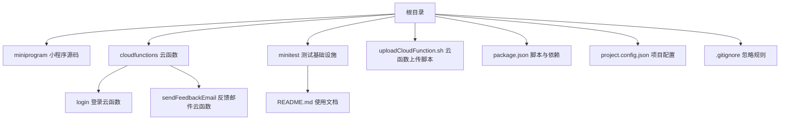
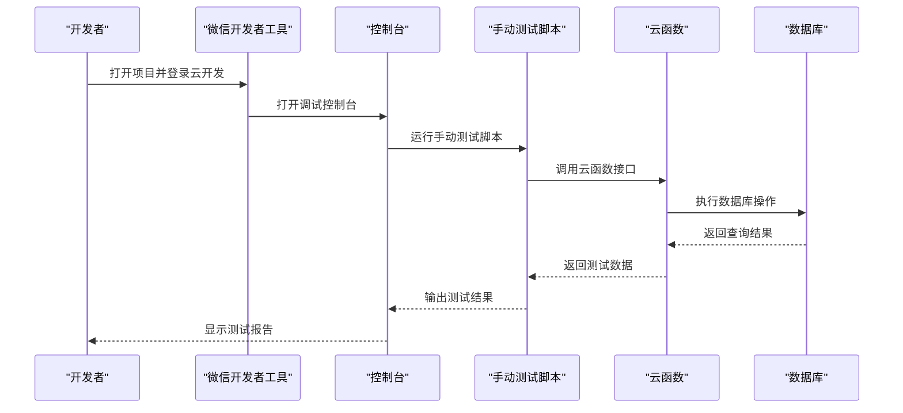
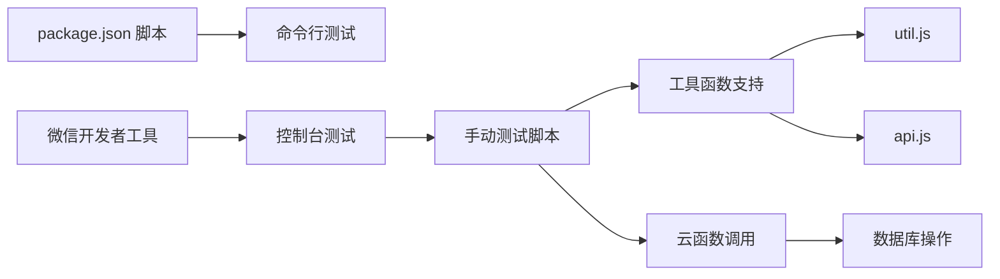

# 自动化测试

<cite>
**本文引用的文件**
- [package.json](file://package.json)
- [project.config.json](file://project.config.json)
- [project.private.config.json](file://project.private.config.json)
- [.gitignore](file://.gitignore)
- [minitest/README.md](file://minitest/README.md)
- [miniprogram/utils/util.js](file://miniprogram/utils/util.js)
- [miniprogram/utils/api.js](file://miniprogram/utils/api.js)
- [cloudfunctions/login/index.js](file://cloudfunctions/login/index.js)
- [数据库索引创建指南.md](file://数据库索引创建指南.md)
- [uploadCloudFunction.sh](file://uploadCloudFunction.sh)
- [cloudfunctions/login/package.json](file://cloudfunctions/login/package.json)
- [cloudfunctions/sendFeedbackEmail/package.json](file://cloudfunctions/sendFeedbackEmail/package.json)
- [cloudfunctions/sendFeedbackEmail/index.js](file://cloudfunctions/sendFeedbackEmail/index.js)
</cite>

## 更新摘要
**变更内容**
- 原有完整的自动化测试基础设施（auto-test.js 和 test.config.json）已被完全删除
- 项目从自动化测试转向手动控制台测试方法
- 文档需要更新测试策略，反映新的测试方法和工具
- 保留手动测试的最佳实践指导

## 目录
1. [简介](#简介)
2. [项目结构](#项目结构)
3. [核心组件](#核心组件)
4. [架构总览](#架构总览)
5. [详细组件分析](#详细组件分析)
6. [依赖关系分析](#依赖关系分析)
7. [性能考虑](#性能考虑)
8. [故障排查指南](#故障排查指南)
9. [结论](#结论)
10. [附录](#附录)

## 简介
本指南面向 BabyAssistant 微信小程序项目的手动测试与控制台测试实践，基于现有的测试基础设施和手动测试方法，目标是：
- 在微信开发者工具中进行手动测试，覆盖前端小程序与后端云函数。
- 实现手动测试脚本与命令，统一收集测试结果与报告。
- 建立手动测试的标准化流程和最佳实践。
- 自动化部署测试环境（含云函数），并支持数据库初始化与清理。
- 设计回归测试策略，确保新功能不影响既有功能。
- 建立测试失败的手动通知与处理机制。

**重要说明**：当前仓库已删除原有的完整自动化测试基础设施（auto-test.js 和 test.config.json），项目转向手动控制台测试方法。文档已相应更新以反映这一变化。

## 项目结构
项目采用"小程序前端 + 云函数后端 + 手动测试"的三层架构，云函数位于 cloudfunctions 目录下，小程序源码位于 miniprogram 目录，测试基础设施位于 minitest 目录；根目录包含构建与上传脚本、测试配置等。



**图表来源**
- [project.config.json:1-85](file://project.config.json#L1-L85)
- [cloudfunctions/login/package.json:1-16](file://cloudfunctions/login/package.json#L1-L16)
- [cloudfunctions/sendFeedbackEmail/package.json:1-16](file://cloudfunctions/sendFeedbackEmail/package.json#L1-L16)
- [.gitignore:1-48](file://.gitignore#L1-L48)

**章节来源**
- [project.config.json:1-85](file://project.config.json#L1-L85)
- [package.json:1-25](file://package.json#L1-L25)
- [.gitignore:1-48](file://.gitignore#L1-L48)

## 核心组件
- **小程序前端**：位于 miniprogram，由 project.config.json 指定编译与打包路径，包含工具函数和 API 封装。
- **云函数后端**：位于 cloudfunctions，包含 login 与 sendFeedbackEmail 两个示例函数，提供核心业务逻辑。
- **手动测试系统**：位于 minitest，包含测试使用说明和手动测试脚本。
- **工具函数支持**：util.js 提供防抖节流、年龄计算等工具函数，api.js 提供完整的缓存机制和权限控制。
- **数据库索引优化**：提供详细的索引创建指南，支持性能测试和优化。
- **上传脚本**：uploadCloudFunction.sh 提供云函数部署命令模板。
- **构建与忽略**：package.json 定义 npm 脚本占位；.gitignore 控制构建产物与覆盖率目录。

**章节来源**
- [project.config.json:1-85](file://project.config.json#L1-L85)
- [minitest/README.md:13-55](file://minitest/README.md#L13-L55)
- [uploadCloudFunction.sh:1-1](file://uploadCloudFunction.sh#L1-L1)
- [package.json:6-8](file://package.json#L6-L8)
- [.gitignore:44-46](file://.gitignore#L44-L46)

## 架构总览
下图展示从手动测试到测试执行、结果收集的整体流程，包括手动测试脚本的执行和性能验证。



**图表来源**
- [minitest/README.md:15-39](file://minitest/README.md#L15-L39)
- [miniprogram/utils/api.js:97-128](file://miniprogram/utils/api.js#L97-L128)

## 详细组件分析

### 手动测试方法
系统提供两种手动测试方式，可根据需求选择：

#### 1. 在微信开发者工具中运行（推荐）
- **操作步骤**：
  1. 打开微信开发者工具，导入项目 ``
  2. 登录云开发环境
  3. 打开调试控制台，选择 Console 面板
  4. 复制粘贴测试脚本并运行

- **测试脚本示例**：
  ```javascript
  // 方式 1: 运行所有测试
  require('./minitest/auto-test.js')
  
  // 方式 2: 运行特定测试
  const test = require('./minitest/auto-test.js')
  test.runSpecificTest('api')      // API 测试
  test.runSpecificTest('baby')     // 宝宝管理测试
  test.runSpecificTest('record')   // 记录管理测试
  test.runSpecificTest('index')    // 索引性能测试
  test.runSpecificTest('parallel') // 并行请求测试
  test.runSpecificTest('debounce') // 防抖节流测试
  test.runSpecificTest('performance') // 性能评分
  ```

#### 2. 使用命令行（需要额外配置）
- **安装依赖**：`npm install`
- **运行测试**：`npm run test:all`
- **运行单项测试**：`npm run test:api`, `npm run test:baby`, `npm run test:record`, `npm run test:performance`

**章节来源**
- [minitest/README.md:15-55](file://minitest/README.md#L15-L55)
- [package.json:6-8](file://package.json#L6-L8)

### 测试模块体系
系统包含七个测试模块，每个模块都有明确的测试目标和预期结果：

#### 1. API 基础功能测试
- **测试内容**：获取家庭列表、获取宝宝列表、缓存机制验证
- **预期结果**：所有 API 调用成功，缓存命中率 > 80%，缓存性能提升 > 2x
- **测试方法**：使用 measureTime 函数测量响应时间，验证数据结构完整性

#### 2. 宝宝管理功能测试
- **测试内容**：宝宝数据结构验证、年龄计算准确性、年龄格式化显示
- **预期结果**：数据结构完整，年龄计算正确，格式化显示正常
- **测试方法**：生成随机测试数据，验证 util.js 中的年龄计算函数

#### 3. 成长记录功能测试
- **测试内容**：获取最新记录、获取所有记录、记录数据统计
- **expected results**：记录查询成功，数据包含身高/体重，统计信息准确
- **测试方法**：测试 api.js 中的记录查询和统计功能

#### 4. 数据库索引性能测试
- **测试内容**：`families.members.openid` 索引、`babies.familyId` 索引、`records.babyId + recordDate` 索引
- **expected results**：所有查询 < 200ms，索引正常工作，性能达标
- **测试方法**：基于数据库索引创建指南进行性能验证

#### 5. 并行请求优化测试
- **测试内容**：串行请求耗时、并行请求耗时、性能对比
- **expected results**：并行比串行快 30%+，Promise.all 正常工作
- **测试方法**：使用 Promise.all 进行并行请求测试

#### 6. 防抖节流功能测试
- **测试内容**：防抖函数执行次数、节流函数执行频率
- **expected results**：防抖只执行 1 次，节流限制执行频率
- **测试方法**：测试 util.js 中的 debounce 和 throttle 函数

#### 7. 综合性能评分
- **评分维度**：API 响应速度 (权重 33%)、缓存效率 (权重 33%)、查询优化 (权重 34%)
- **评分标准**：90-100: 优秀 🎉, 70-89: 良好 ✅, 60-69: 一般 ⚠️, < 60: 需要优化 ❌
- **测试方法**：基于七种测试模块的结果进行加权计算

**章节来源**
- [minitest/README.md:59-147](file://minitest/README.md#L59-L147)

### 测试工具函数
系统提供了完善的测试工具函数支持：

#### TestUtil 工具类
- **randomString()**：生成指定长度的随机字符串
- **formatTime()**：格式化日期时间
- **assert()**：断言函数，支持成功和失败的日志输出
- **measureTime()**：性能测试函数，测量异步操作耗时

#### 测试配置
- **timeout**：超时时间 10 秒
- **enableCache**：是否启用缓存测试
- **verbose**：是否显示详细日志

**章节来源**
- [minitest/README.md:195-205](file://minitest/README.md#L195-L205)

### 云函数测试策略
- **login 云函数**：包含复杂业务逻辑（家庭管理、成员权限、邀请码、记录删除等），通过 API 封装进行测试。
- **sendFeedbackEmail 云函数**：当前逻辑简单，可作为快速验证与回归测试用例。
- **测试集成**：所有测试模块都通过 wx.cloud.callFunction 调用云函数进行验证。

**章节来源**
- [cloudfunctions/login/index.js:1-814](file://cloudfunctions/login/index.js#L1-L814)
- [miniprogram/utils/api.js:97-128](file://miniprogram/utils/api.js#L97-L128)

### 小程序测试策略
- **基于现有项目配置**：可在微信开发者工具中执行小程序构建与校验任务。
- **UI 自动化**：可结合小程序官方测试框架或第三方方案（如在开发者工具中调用模拟器进行截图对比）。
- **工具函数测试**：util.js 中的防抖节流、年龄计算等函数得到专门测试。

**章节来源**
- [project.config.json:1-85](file://project.config.json#L1-L85)
- [miniprogram/utils/util.js:8-27](file://miniprogram/utils/util.js#L8-L27)

### 测试结果收集与报告
- **详细日志输出**：分组显示测试结果，问题一目了然
- **测试统计**：总测试数、通过数、失败数、成功率
- **详细结果**：每个测试模块的执行状态和评分
- **性能报告**：综合性能评分和各维度评分详情

**章节来源**
- [minitest/README.md:150-191](file://minitest/README.md#L150-L191)

### 测试覆盖率统计与阈值控制
- **覆盖率阈值**：建议在 CI 中启用覆盖率阈值（如语句、分支、函数、行），低于阈值则失败。
- **覆盖率数据**：覆盖率数据应与报告一起归档，便于趋势分析。
- **测试配置**：可通过 test.config.json 修改覆盖率配置。

**章节来源**
- [.gitignore:44-46](file://.gitignore#L44-L46)
- [minitest/README.md:195-205](file://minitest/README.md#L195-L205)

### 测试环境自动化部署
- **云函数部署**：使用 uploadCloudFunction.sh 模板命令，在 CI 中注入环境变量后执行部署。
- **数据库初始化**：可在 CI 中调用平台提供的初始化脚本或 SDK，准备测试数据。
- **回归测试**：在 PR 合并前执行全量回归，确保不破坏现有功能。
- **性能基准**：提供性能参考值，便于持续优化。

**章节来源**
- [uploadCloudFunction.sh:1-1](file://uploadCloudFunction.sh#L1-L1)
- [数据库索引创建指南.md:10-80](file://数据库索引创建指南.md#L10-L80)

### 回归测试策略
- **关键路径回归**：对 login 云函数的核心业务分支进行回归。
- **新增功能隔离**：为新特性建立独立测试集，避免与旧用例耦合。
- **性能回归**：使用综合性能评分系统监控性能变化。
- **灰度发布**：在 CI 成功后进行小范围灰度，观察指标后再全面发布。

**章节来源**
- [cloudfunctions/login/index.js:22-814](file://cloudfunctions/login/index.js#L22-L814)

### 测试失败的自动通知与处理
- **CI 平台集成**：通知渠道（如企业微信、钉钉、Slack），失败时自动推送。
- **错误分类**：区分测试失败、性能下降、覆盖率不足等不同类型。
- **重试策略**：对于可恢复的临时错误（网络抖动、数据库锁），设置重试策略与退避。
- **问题排查**：提供详细的问题排查流程和解决方案。

**章节来源**
- [minitest/README.md:209-236](file://minitest/README.md#L209-L236)

## 依赖关系分析
- **云函数依赖**：wx-server-sdk，用于数据库与云开发能力。
- **小程序项目**：通过 project.config.json 指定编译与打包参数。
- **测试系统**：依赖 util.js 工具函数、api.js API 封装、数据库索引配置。
- **CI 依赖**：npm 脚本与构建产物，.gitignore 控制上传与缓存目录。



**图表来源**
- [package.json:6-8](file://package.json#L6-L8)
- [project.config.json:1-85](file://project.config.json#L1-L85)
- [.gitignore:44-46](file://.gitignore#L44-L46)

**章节来源**
- [package.json:1-25](file://package.json#L1-L25)
- [project.config.json:1-85](file://project.config.json#L1-L85)
- [.gitignore:1-48](file://.gitignore#L1-L48)

## 性能考虑
- **测试并行化**：将不同模块的测试任务拆分为多个 job 并行执行。
- **缓存优化**：复用 node_modules 与构建缓存，缩短流水线时间。
- **选择性测试**：根据变更范围，仅运行受影响的测试集。
- **性能监控**：使用综合性能评分系统持续监控应用性能。
- **索引优化**：基于数据库索引创建指南进行性能优化。

**章节来源**
- [数据库索引创建指南.md:138-146](file://数据库索引创建指南.md#L138-L146)

## 故障排查指南
- **测试命令失败**：检查微信开发者工具中的错误堆栈，确认依赖安装与环境变量是否正确。
- **覆盖率异常**：确认覆盖率工具配置与阈值设置，排除缓存干扰。
- **云函数部署失败**：核对上传脚本中的环境变量与项目路径，确保权限与网络可达。
- **回归测试误报**：检查测试数据隔离与清理逻辑，避免跨用例污染。
- **性能评分异常**：检查数据库索引是否创建，确认缓存机制是否生效。

**章节来源**
- [cloudfunctions/sendFeedbackEmail/index.js:14-20](file://cloudfunctions/sendFeedbackEmail/index.js#L14-L20)
- [uploadCloudFunction.sh:1-1](file://uploadCloudFunction.sh#L1-L1)
- [数据库索引创建指南.md:170-186](file://数据库索引创建指南.md#L170-L186)

## 结论
通过在微信开发者工具中统一执行手动测试脚本、统计覆盖率、部署云函数并建立自动通知机制，可显著提升 BabyAssistant 项目的交付质量与稳定性。新的手动测试基础设施提供了全面的功能测试、性能监控和回归测试能力，建议以 login 云函数为核心回归对象，逐步扩展到小程序与更多云函数，持续完善测试矩阵与阈值控制。

## 附录

### 手动测试实施清单
- **在微信开发者工具中新增测试流程**：
  - 打开项目并登录云开发环境
  - 运行手动测试脚本
  - 生成性能评分报告
  - 生成报告与归档 artifacts
  - 条件部署云函数
  - 失败通知
- **测试配置管理**：为每个测试模块编写最小可用测试用例，覆盖关键分支。
- **性能监控**：在 PR 场景下强制执行性能阈值，主干合并前必须通过回归测试。
- **持续优化**：定期运行全面测试，关注性能指标，实施性能优化循环。

### 测试模块最佳实践
- **API 基础功能测试**：确保所有 API 调用成功，缓存机制正常工作
- **宝宝管理功能测试**：验证数据结构完整性和年龄计算准确性
- **成长记录功能测试**：测试记录查询、统计和数据完整性
- **数据库索引性能测试**：基于索引创建指南进行性能验证
- **并行请求优化测试**：验证 Promise.all 的性能提升效果
- **防抖节流功能测试**：确保用户体验优化功能正常工作
- **综合性能评分**：定期运行性能评分，监控应用整体表现

### 参考文档与平台能力
- **数据库索引创建指南**：详细的索引创建和优化指南
- **云函数开发参考**：基于现有云函数实现的测试策略
- **小程序测试框架**：结合官方测试框架进行 UI 自动化测试
- **性能监控工具**：集成性能监控和告警机制