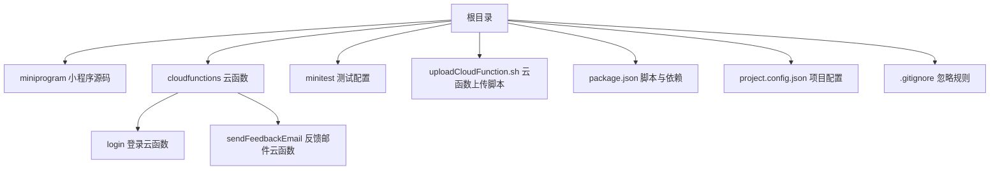
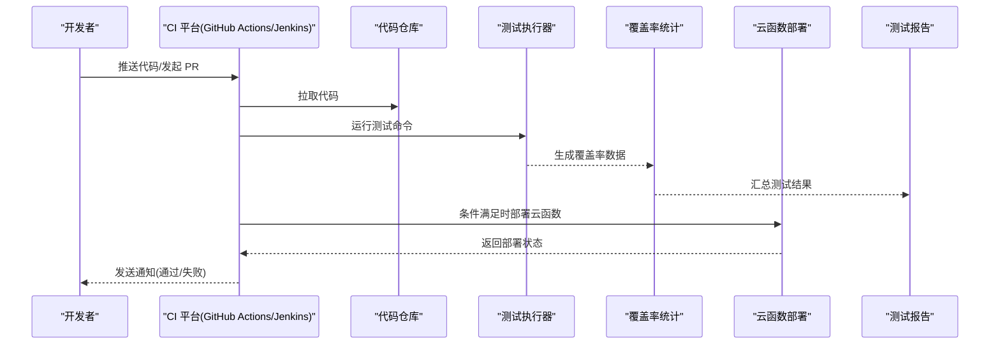
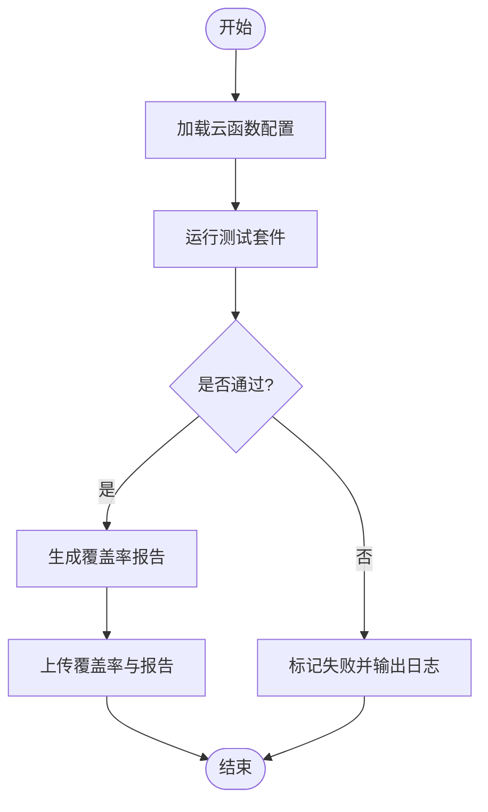
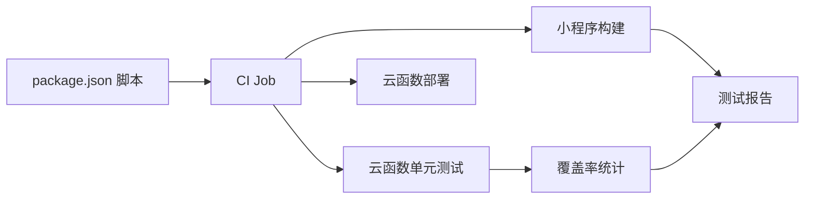

# 自动化测试

<cite>
**本文引用的文件**
- [package.json](file://package.json)
- [project.config.json](file://project.config.json)
- [project.private.config.json](file://project.private.config.json)
- [.gitignore](file://.gitignore)
- [minitest/test.config.json](file://minitest/test.config.json)
- [uploadCloudFunction.sh](file://uploadCloudFunction.sh)
- [cloudfunctions/login/package.json](file://cloudfunctions/login/package.json)
- [cloudfunctions/sendFeedbackEmail/package.json](file://cloudfunctions/sendFeedbackEmail/package.json)
- [cloudfunctions/login/index.js](file://cloudfunctions/login/index.js)
- [cloudfunctions/sendFeedbackEmail/index.js](file://cloudfunctions/sendFeedbackEmail/index.js)
- [.agents/skills/cloudbase/references/cloudrun-development/SKILL.md](file://.agents/skills/cloudbase/references/cloudrun-development/SKILL.md)
- [.agents/skills/cloudbase/references/cloudbase-agent/py/adapter-development.md](file://.agents/skills/cloudbase/references/cloudbase-agent/py/adapter-development.md)
- [.agents/skills/cloudbase/SCILL.md](file://.agents/skills/cloudbase/SCILL.md)
</cite>

## 目录
1. [简介](#简介)
2. [项目结构](#项目结构)
3. [核心组件](#核心组件)
4. [架构总览](#架构总览)
5. [详细组件分析](#详细组件分析)
6. [依赖关系分析](#依赖关系分析)
7. [性能考虑](#性能考虑)
8. [故障排查指南](#故障排查指南)
9. [结论](#结论)
10. [附录](#附录)

## 简介
本指南面向 BabyAssistant 微信小程序项目的自动化测试与 CI/CD 流水线落地实践，目标是：
- 在 GitHub Actions、Jenkins 等 CI 工具中配置测试任务，覆盖前端小程序与后端云函数。
- 编写可执行的测试脚本与命令，统一收集测试结果与报告。
- 实现测试覆盖率统计与阈值控制，保障质量门槛。
- 自动化部署测试环境（含云函数），并支持数据库初始化与清理。
- 设计回归测试策略，确保新功能不影响既有功能。
- 建立测试失败的自动通知与处理机制。

当前仓库中已具备云函数与小程序基础结构，但缺少明确的测试脚本与 CI 配置文件。本指南将基于现有文件与平台能力，给出可落地的实施步骤与最佳实践。

## 项目结构
项目采用“小程序前端 + 云函数后端”的分层组织方式，云函数位于 cloudfunctions 目录下，小程序源码位于 miniprogram 目录；根目录包含构建与上传脚本、测试配置等。

图表来源
- [project.config.json:1-85](file://project.config.json#L1-L85)
- [cloudfunctions/login/package.json:1-16](file://cloudfunctions/login/package.json#L1-L16)
- [cloudfunctions/sendFeedbackEmail/package.json:1-16](file://cloudfunctions/sendFeedbackEmail/package.json#L1-L16)
- [.gitignore:1-48](file://.gitignore#L1-L48)

章节来源
- [project.config.json:1-85](file://project.config.json#L1-L85)
- [package.json:1-22](file://package.json#L1-L22)
- [.gitignore:1-48](file://.gitignore#L1-L48)

## 核心组件
- 小程序前端：位于 miniprogram，由 project.config.json 指定编译与打包路径。
- 云函数后端：位于 cloudfunctions，包含 login 与 sendFeedbackEmail 两个示例函数。
- 测试配置：minitest/test.config.json 当前为空，可用于后续扩展。
- 上传脚本：uploadCloudFunction.sh 提供云函数部署命令模板。
- 构建与忽略：package.json 定义 npm 脚本占位；.gitignore 控制构建产物与覆盖率目录。

章节来源
- [project.config.json:1-85](file://project.config.json#L1-L85)
- [minitest/test.config.json:1-3](file://minitest/test.config.json#L1-L3)
- [uploadCloudFunction.sh:1-1](file://uploadCloudFunction.sh#L1-L1)
- [package.json:1-22](file://package.json#L1-L22)
- [.gitignore:44-46](file://.gitignore#L44-L46)

## 架构总览
下图展示从 CI 触发到测试执行、覆盖率统计、云函数部署的整体流程。

## 详细组件分析

### 云函数测试策略
- login 云函数：包含复杂业务逻辑（家庭管理、成员权限、邀请码、记录删除等），建议针对关键分支与边界条件编写单元测试与集成测试。
- sendFeedbackEmail 云函数：当前逻辑简单，可作为快速验证与回归测试用例。

章节来源
- [cloudfunctions/login/index.js:1-814](file://cloudfunctions/login/index.js#L1-L814)
- [cloudfunctions/sendFeedbackEmail/index.js:1-21](file://cloudfunctions/sendFeedbackEmail/index.js#L1-L21)

### 小程序测试策略
- 基于现有项目配置，可在 CI 中执行小程序构建与校验任务。
- 若需 UI 自动化，可结合小程序官方测试框架或第三方方案（如在 CI 中调用模拟器进行截图对比）。

章节来源
- [project.config.json:1-85](file://project.config.json#L1-L85)

### 测试脚本与命令
- 根据 package.json 的 scripts 占位，建议新增以下命令：
  - test: 运行测试套件（小程序与云函数）
  - test:ci: CI 环境下的测试，带覆盖率输出
  - lint: 代码风格检查
  - build: 小程序构建
- 将测试命令纳入 CI 的 job 步骤中，确保失败即中断流水线。

章节来源
- [package.json:6-8](file://package.json#L6-L8)

### 测试结果收集与报告
- 使用标准测试框架输出 JSON 或 JUnit XML 报告，便于 CI 平台解析。
- 将报告与覆盖率目录纳入 CI 的 artifacts，便于问题追溯。

章节来源
- [.gitignore:44-46](file://.gitignore#L44-L46)

### 测试覆盖率统计与阈值控制
- 建议在 CI 中启用覆盖率阈值（如语句、分支、函数、行），低于阈值则失败。
- 覆盖率数据应与报告一起归档，便于趋势分析。

章节来源
- [.gitignore:44-46](file://.gitignore#L44-L46)

### 测试环境自动化部署
- 云函数部署：使用 uploadCloudFunction.sh 模板命令，在 CI 中注入环境变量后执行部署。
- 数据库初始化：可在 CI 中调用平台提供的初始化脚本或 SDK，准备测试数据。
- 回归测试：在 PR 合并前执行全量回归，确保不破坏现有功能。

章节来源
- [uploadCloudFunction.sh:1-1](file://uploadCloudFunction.sh#L1-L1)

### 回归测试策略
- 关键路径回归：对 login 云函数的核心业务分支进行回归。
- 新增功能隔离：为新特性建立独立测试集，避免与旧用例耦合。
- 灰度发布：在 CI 成功后进行小范围灰度，观察指标后再全面发布。

章节来源
- [cloudfunctions/login/index.js:22-814](file://cloudfunctions/login/index.js#L22-L814)

### 测试失败的自动通知与处理
- CI 平台集成通知渠道（如企业微信、钉钉、Slack），失败时自动推送。
- 对于可恢复的临时错误（网络抖动、数据库锁），设置重试策略与退避。

## 依赖关系分析
- 云函数依赖 wx-server-sdk，用于数据库与云开发能力。
- 小程序项目通过 project.config.json 指定编译与打包参数。
- CI 依赖于 npm 脚本与构建产物，.gitignore 控制上传与缓存目录。

图表来源
- [package.json:6-8](file://package.json#L6-L8)
- [project.config.json:1-85](file://project.config.json#L1-L85)
- [.gitignore:44-46](file://.gitignore#L44-L46)

章节来源
- [package.json:1-22](file://package.json#L1-L22)
- [project.config.json:1-85](file://project.config.json#L1-L85)
- [.gitignore:1-48](file://.gitignore#L1-L48)

## 性能考虑
- 测试并行化：将不同模块的测试任务拆分为多个 job 并行执行。
- 缓存优化：复用 node_modules 与构建缓存，缩短流水线时间。
- 选择性测试：根据变更范围，仅运行受影响的测试集。

## 故障排查指南
- 测试命令失败：检查 CI 日志中的错误堆栈，确认依赖安装与环境变量是否正确。
- 覆盖率异常：确认覆盖率工具配置与阈值设置，排除缓存干扰。
- 云函数部署失败：核对上传脚本中的环境变量与项目路径，确保权限与网络可达。
- 回归测试误报：检查测试数据隔离与清理逻辑，避免跨用例污染。

章节来源
- [cloudfunctions/sendFeedbackEmail/index.js:14-20](file://cloudfunctions/sendFeedbackEmail/index.js#L14-L20)
- [uploadCloudFunction.sh:1-1](file://uploadCloudFunction.sh#L1-L1)

## 结论
通过在 CI 中统一执行测试、统计覆盖率、部署云函数并建立自动通知机制，可显著提升 BabyAssistant 项目的交付质量与稳定性。建议以 login 云函数为核心回归对象，逐步扩展到小程序与更多云函数，持续完善测试矩阵与阈值控制。

## 附录

### CI/CD 流水线实施清单
- 在 CI 中新增 job：
  - 安装依赖
  - 运行测试与覆盖率
  - 生成报告与归档 artifacts
  - 条件部署云函数
  - 失败通知
- 为每个云函数编写最小可用测试用例，覆盖关键分支。
- 在 PR 场景下强制执行覆盖率阈值，主干合并前必须通过回归测试。

### 参考文档与平台能力
- 云函数与 CloudRun 开发参考：[cloudrun-development/SKILL.md:165-192](file://.agents/skills/cloudbase/references/cloudrun-development/SKILL.md#L165-L192)
- 适配器测试参考（Python）：[cloudbase-agent/py/adapter-development.md:414-504](file://.agents/skills/cloudbase/references/cloudbase-agent/py/adapter-development.md#L414-L504)
- 平台技能总览：[cloudbase/SCILL.md:264-293](file://.agents/skills/cloudbase/SCILL.md#L264-L293)