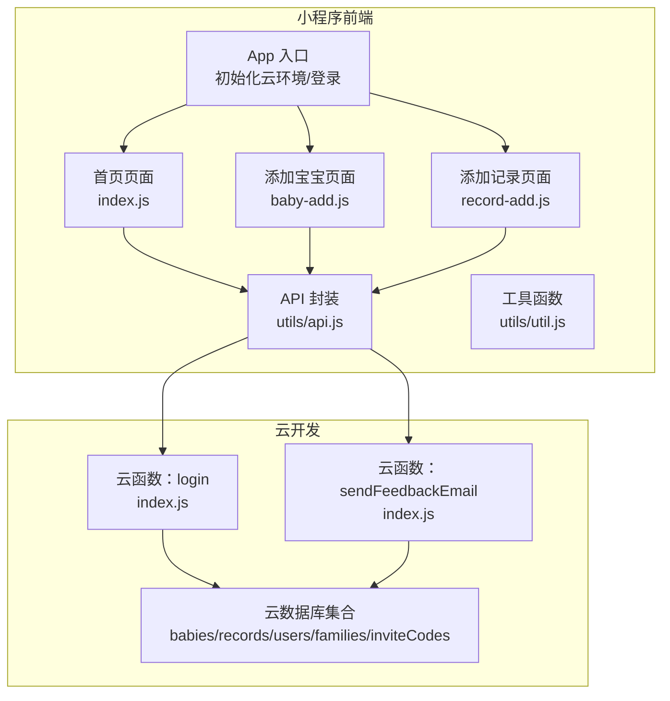
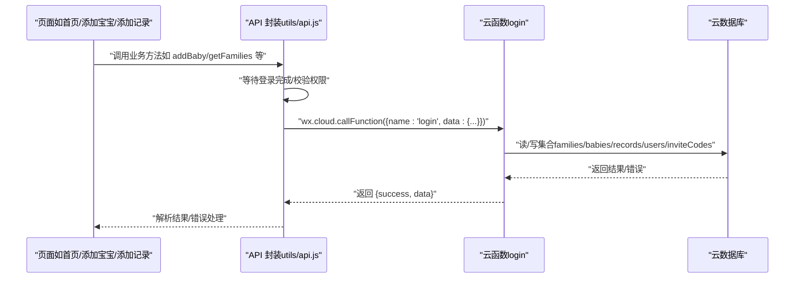
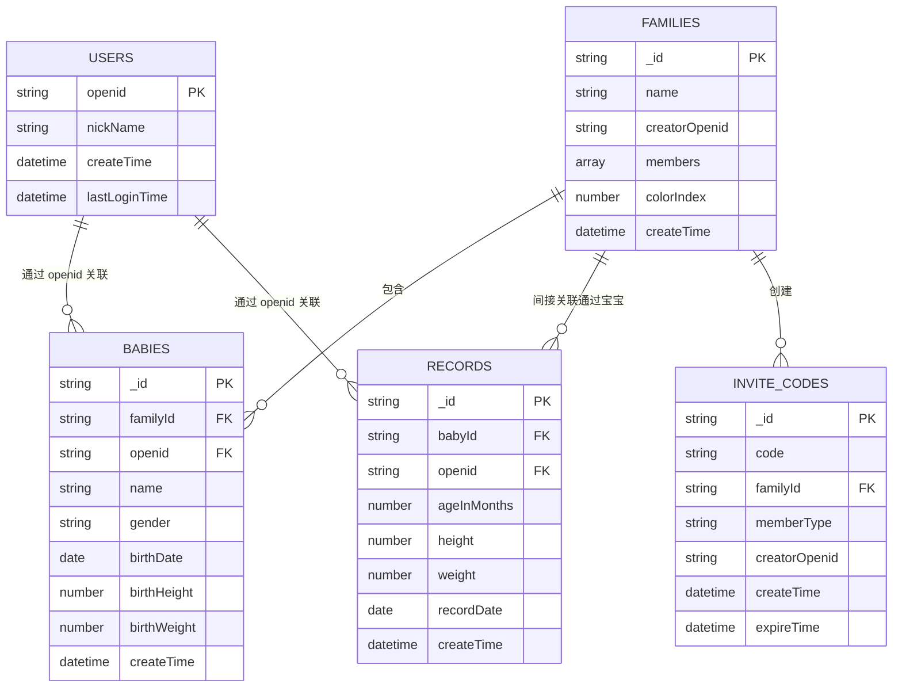
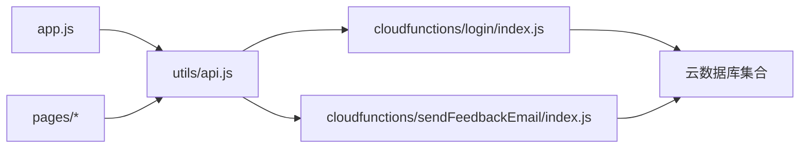

# 集成测试

<cite>
**本文引用的文件**
- [app.js](file://miniprogram/app.js)
- [api.js](file://miniprogram/utils/api.js)
- [util.js](file://miniprogram/utils/util.js)
- [index.js（首页）](file://miniprogram/pages/index/index.js)
- [baby-add.js（添加宝宝）](file://miniprogram/pages/baby-add/baby-add.js)
- [record-add.js（添加记录）](file://miniprogram/pages/record-add/record-add.js)
- [login 云函数](file://cloudfunctions/login/index.js)
- [sendFeedbackEmail 云函数](file://cloudfunctions/sendFeedbackEmail/index.js)
- [envList.js](file://miniprogram/envList.js)
- [test.config.json](file://minitest/test.config.json)
- [package.json（login 云函数）](file://cloudfunctions/login/package.json)
- [package.json（sendFeedbackEmail 云函数）](file://cloudfunctions/sendFeedbackEmail/package.json)
- [README.md](file://README.md)
</cite>

## 目录
1. [简介](#简介)
2. [项目结构](#项目结构)
3. [核心组件](#核心组件)
4. [架构总览](#架构总览)
5. [详细组件分析](#详细组件分析)
6. [依赖关系分析](#依赖关系分析)
7. [性能考量](#性能考量)
8. [故障排查指南](#故障排查指南)
9. [结论](#结论)
10. [附录](#附录)

## 简介
本指南面向“小程序页面与云函数之间的集成测试”，目标是帮助测试团队系统化地验证端到端流程，包括：
- API 调用链路测试（页面 → 云函数）
- 数据库操作测试（集合读写、事务、权限校验）
- 用户流程测试（登录、家庭管理、宝宝与记录 CRUD）
- 端到端测试配置与实施（页面导航、用户交互、数据流转）
- 测试环境搭建（本地调试、测试数据库、云函数模拟）
- 测试数据准备与清理策略（独立性与可重复性）
- 错误处理、网络异常、权限控制的专项测试方案

## 项目结构
该项目采用“小程序前端 + 云开发 + 云函数”的典型架构。前端页面通过 wx.cloud 调用云函数；云函数访问云数据库，实现业务逻辑与权限控制。

图示来源
- [app.js:1-56](file://miniprogram/app.js#L1-L56)
- [api.js:1-879](file://miniprogram/utils/api.js#L1-L879)
- [index.js（首页）:1-144](file://miniprogram/pages/index/index.js#L1-L144)
- [baby-add.js（添加宝宝）:1-120](file://miniprogram/pages/baby-add/baby-add.js#L1-L120)
- [record-add.js（添加记录）:1-118](file://miniprogram/pages/record-add/record-add.js#L1-L118)
- [login 云函数:1-814](file://cloudfunctions/login/index.js#L1-L814)
- [sendFeedbackEmail 云函数:1-21](file://cloudfunctions/sendFeedbackEmail/index.js#L1-L21)

章节来源
- [README.md:77-103](file://README.md#L77-L103)

## 核心组件
- 小程序应用层
  - App 初始化云环境与自动登录，为后续页面调用提供上下文与用户态。
  - 页面负责用户交互与路由跳转，并通过 API 封装发起云函数调用。
- API 封装层
  - 提供统一的 CRUD 与业务方法，内部封装等待登录、权限校验、错误处理与数据格式化。
- 云函数层
  - login：实现登录、家庭管理、宝宝管理、记录管理、权限校验、事务等核心业务。
  - sendFeedbackEmail：接收反馈数据并返回结果（当前为占位实现）。
- 数据层
  - 集合：babies、records、users、families、inviteCodes，承载业务数据与权限标识。

章节来源
- [app.js:22-54](file://miniprogram/app.js#L22-L54)
- [api.js:44-800](file://miniprogram/utils/api.js#L44-L800)
- [login 云函数:22-800](file://cloudfunctions/login/index.js#L22-L800)
- [sendFeedbackEmail 云函数:7-20](file://cloudfunctions/sendFeedbackEmail/index.js#L7-L20)

## 架构总览
下图展示了从页面到云函数再到数据库的调用链路，以及权限与事务控制的关键节点。

图示来源
- [api.js:14-41](file://miniprogram/utils/api.js#L14-L41)
- [api.js:44-75](file://miniprogram/utils/api.js#L44-L75)
- [login 云函数:22-92](file://cloudfunctions/login/index.js#L22-L92)

## 详细组件分析

### 页面与 API 的集成测试要点
- 首页（index）
  - 加载宝宝列表与家庭映射，计算年龄与最新记录，展示与跳转。
  - 集成点：getBabies、getFamilies、getLatestRecord、checkPermission。
- 添加宝宝（baby-add）
  - 表单校验、家庭选择、权限检查（一级助教）、提交调用 addBaby。
  - 集成点：checkPermission、getFamilies、addBaby。
- 添加记录（record-add）
  - 年龄计算、表单校验、权限检查（一级/二级助教）、提交调用 addRecord。
  - 集成点：getBabyById、checkPermission、addRecord。

章节来源
- [index.js（首页）:14-52](file://miniprogram/pages/index/index.js#L14-L52)
- [index.js（首页）:54-92](file://miniprogram/pages/index/index.js#L54-L92)
- [index.js（首页）:101-142](file://miniprogram/pages/index/index.js#L101-L142)
- [baby-add.js（添加宝宝）:20-44](file://miniprogram/pages/baby-add/baby-add.js#L20-L44)
- [baby-add.js（添加宝宝）:74-118](file://miniprogram/pages/baby-add/baby-add.js#L74-L118)
- [record-add.js（添加记录）:18-39](file://miniprogram/pages/record-add/record-add.js#L18-L39)
- [record-add.js（添加记录）:71-116](file://miniprogram/pages/record-add/record-add.js#L71-L116)

### API 封装与权限控制测试
- 登录等待与超时：waitForLogin 提供最大等待时间，避免阻塞。
- 权限校验：checkPermission 通过 getFamilies 与 getBabyById 获取家庭与宝宝信息，再判断成员权限。
- 云函数调用：API 内部统一通过 wx.cloud.callFunction 调用 login，绕过数据库直接权限限制。
- 错误处理：对数据库读写与云函数返回进行 try/catch，保证 UI 层友好提示。

章节来源
- [api.js:14-41](file://miniprogram/utils/api.js#L14-L41)
- [api.js:783-800](file://miniprogram/utils/api.js#L783-L800)

### 云函数业务与事务测试
- 登录：创建/更新用户，返回用户信息。
- 家庭管理：创建、加入、退出、修改名称、成员权限变更、移除成员、邀请码生成与清理。
- 宝宝管理：增删改查、删除时事务保证一致性。
- 记录管理：增删改查、权限校验（一级助教可删任意记录，二级助教仅可删自己录入的记录）。
- 权限规则：严格基于家庭成员与权限字段（guardian/caretaker/viewer）。

章节来源
- [login 云函数:22-800](file://cloudfunctions/login/index.js#L22-L800)

### 数据模型与关系

图示来源
- [login 云函数:94-151](file://cloudfunctions/login/index.js#L94-L151)
- [login 云函数:268-371](file://cloudfunctions/login/index.js#L268-L371)
- [login 云函数:482-510](file://cloudfunctions/login/index.js#L482-L510)
- [login 云函数:579-605](file://cloudfunctions/login/index.js#L579-L605)
- [login 云函数:658-699](file://cloudfunctions/login/index.js#L658-L699)

## 依赖关系分析
- 前端依赖
  - app.js 初始化云环境并触发登录。
  - 页面依赖 utils/api.js 进行业务调用。
  - utils/util.js 提供日期与年龄计算。
- 云函数依赖
  - wx-server-sdk 提供云数据库与上下文能力。
  - login 云函数处理所有业务逻辑与权限校验。
  - sendFeedbackEmail 云函数作为占位，便于端到端覆盖。

图示来源
- [app.js:8-20](file://miniprogram/app.js#L8-L20)
- [api.js:1-20](file://miniprogram/utils/api.js#L1-L20)
- [login 云函数:2-6](file://cloudfunctions/login/index.js#L2-L6)
- [sendFeedbackEmail 云函数:2-4](file://cloudfunctions/sendFeedbackEmail/index.js#L2-L4)

章节来源
- [package.json（login 云函数）:12-14](file://cloudfunctions/login/package.json#L12-L14)
- [package.json（sendFeedbackEmail 云函数）:9-12](file://cloudfunctions/sendFeedbackEmail/package.json#L9-L12)

## 性能考量
- 登录等待超时：waitForLogin 设置最大等待时间，避免长时间阻塞。
- 云函数批量查询：首页加载时先获取宝宝列表，再按需获取最新记录，减少不必要的并发请求。
- 事务保护：删除宝宝时使用事务，确保宝宝与其记录的原子性删除。
- 邀请码清理：异步清理过期邀请码，不阻塞主流程。

章节来源
- [api.js:14-41](file://miniprogram/utils/api.js#L14-L41)
- [index.js（首页）:14-52](file://miniprogram/pages/index/index.js#L14-L52)
- [login 云函数:482-510](file://cloudfunctions/login/index.js#L482-L510)
- [login 云函数:691-696](file://cloudfunctions/login/index.js#L691-L696)

## 故障排查指南
- 登录失败/超时
  - 现象：页面加载时 waitForLogin 超时或云函数返回错误。
  - 排查：检查 app.js 初始化云环境与 wx.login 流程；确认云函数 login 是否正常返回用户信息。
- 权限不足
  - 现象：调用 addBaby/deleteBaby/addRecord 等接口时报无权限。
  - 排查：确认家庭成员权限字段与当前 openid；检查 getFamilies 与 getBabyById 返回值。
- 数据不一致
  - 现象：删除宝宝后仍有记录残留。
  - 排查：确认云函数事务是否完整执行；检查删除顺序与条件。
- 邀请码失效
  - 现象：加入家庭时报邀请码无效或已过期。
  - 排查：确认邀请码过期时间与清理逻辑；检查云函数中邀请码查询条件。

章节来源
- [app.js:28-54](file://miniprogram/app.js#L28-L54)
- [api.js:783-800](file://miniprogram/utils/api.js#L783-L800)
- [login 云函数:482-510](file://cloudfunctions/login/index.js#L482-L510)
- [login 云函数:268-371](file://cloudfunctions/login/index.js#L268-L371)

## 结论
本项目通过“页面 → API 封装 → 云函数 → 数据库”的清晰分层，实现了可测试性强的端到端流程。集成测试应围绕“API 调用链路、数据库操作、用户流程、权限控制”四大维度展开，并结合“登录等待、事务、权限校验、邀请码清理”等关键路径进行专项验证，以确保测试的独立性与可重复性。

## 附录

### 测试环境搭建指南
- 本地调试环境
  - 使用微信开发者工具打开项目，配置云开发环境并复制环境 ID 到 app.js 的 globalData.env。
- 测试数据库配置
  - 在云开发控制台创建集合：babies、records、users、families、inviteCodes。
  - 为每个集合设置合适的安全规则（如仅允许云函数写入），以便在测试中模拟权限场景。
- 云函数部署
  - 在开发者工具中右键 cloudfunctions/login，选择“上传并部署”。
  - sendFeedbackEmail 当前为占位实现，可直接部署用于端到端覆盖。
- 测试配置
  - minitest/test.config.json 为空树形结构，可在其中扩展测试套件配置（如页面导航树）。

章节来源
- [README.md:56-76](file://README.md#L56-L76)
- [README.md:65-72](file://README.md#L65-L72)
- [envList.js:1-7](file://miniprogram/envList.js#L1-L7)
- [test.config.json:1-3](file://minitest/test.config.json#L1-L3)

### 测试数据准备与清理策略
- 准备策略
  - 通过云函数创建测试用户与家庭，预先注入测试数据（如若干宝宝与记录）。
  - 使用 inviteCodes 生成邀请码，模拟加入家庭流程。
- 清理策略
  - 在测试结束后，使用云函数执行批量删除（按 openid/familyId 过滤），或直接清空集合。
  - 对于邀请码，可调用清理过期邀请码任务，或手动删除测试数据。

章节来源
- [login 云函数:94-151](file://cloudfunctions/login/index.js#L94-L151)
- [login 云函数:268-371](file://cloudfunctions/login/index.js#L268-L371)
- [login 云函数:740-760](file://cloudfunctions/login/index.js#L740-L760)

### 错误处理、网络异常、权限控制测试实施方案
- 错误处理测试
  - 场景：云函数返回错误、数据库查询失败、API 解析失败。
  - 方法：断言 UI toast/提示文案；断言返回对象的 success 字段与错误信息。
- 网络异常测试
  - 场景：wx.cloud.callFunction 调用失败、超时。
  - 方法：在 API 层增加 mock 与超时控制，验证 waitForLogin 与错误回退逻辑。
- 权限控制测试
  - 场景：非一级助教尝试删除宝宝、非家庭成员查看记录。
  - 方法：构造不同权限成员，调用对应 API，断言返回错误与 UI 提示。

章节来源
- [api.js:14-41](file://miniprogram/utils/api.js#L14-L41)
- [api.js:783-800](file://miniprogram/utils/api.js#L783-L800)
- [login 云函数:482-510](file://cloudfunctions/login/index.js#L482-L510)
- [login 云函数:579-605](file://cloudfunctions/login/index.js#L579-L605)