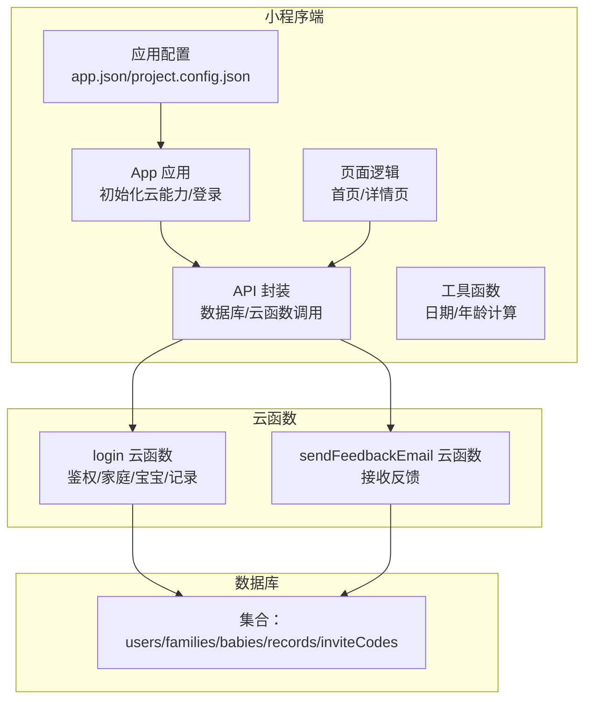
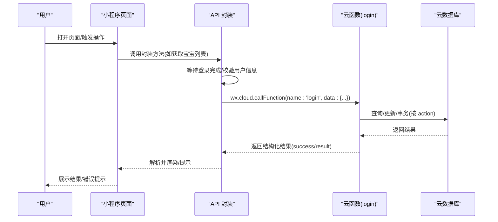
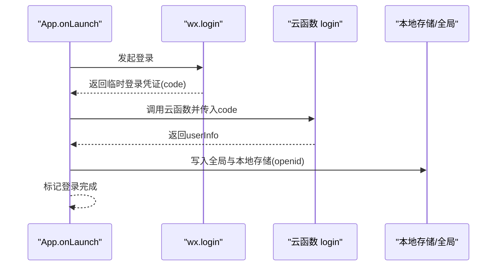
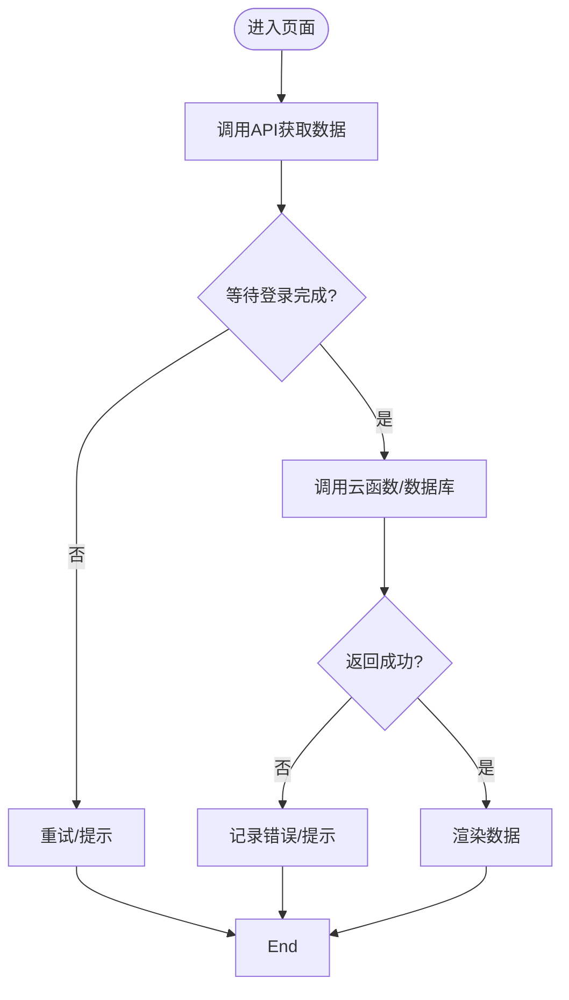
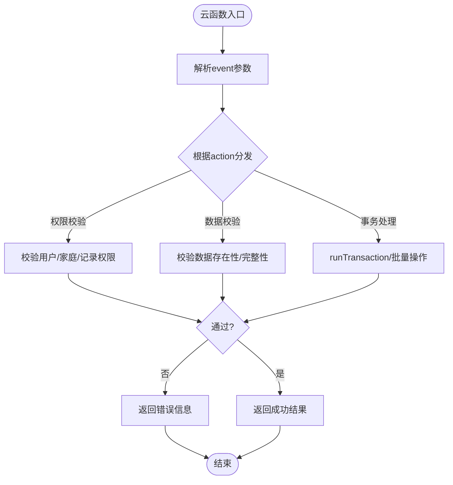
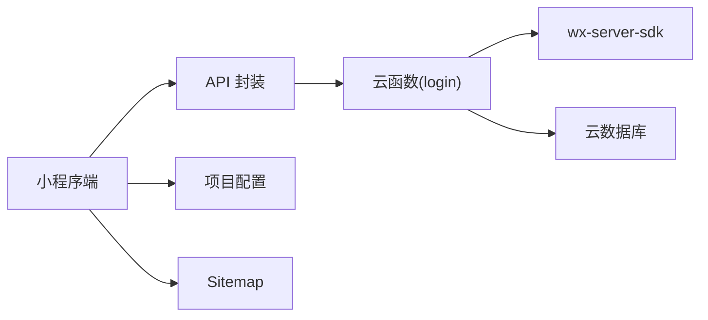

# 故障排查

<cite>
**本文引用的文件**
- [miniprogram/app.js](file://miniprogram/app.js)
- [miniprogram/utils/api.js](file://miniprogram/utils/api.js)
- [miniprogram/utils/util.js](file://miniprogram/utils/util.js)
- [miniprogram/pages/index/index.js](file://miniprogram/pages/index/index.js)
- [miniprogram/pages/baby-detail/baby-detail.js](file://miniprogram/pages/baby-detail/baby-detail.js)
- [cloudfunctions/login/index.js](file://cloudfunctions/login/index.js)
- [cloudfunctions/sendFeedbackEmail/index.js](file://cloudfunctions/sendFeedbackEmail/index.js)
- [cloudfunctions/login/package.json](file://cloudfunctions/login/package.json)
- [cloudfunctions/sendFeedbackEmail/package.json](file://cloudfunctions/sendFeedbackEmail/package.json)
- [miniprogram/envList.js](file://miniprogram/envList.js)
- [miniprogram/app.json](file://miniprogram/app.json)
- [project.config.json](file://project.config.json)
- [miniprogram/sitemap.json](file://miniprogram/sitemap.json)
</cite>

## 目录
1. [简介](#简介)
2. [项目结构](#项目结构)
3. [核心组件](#核心组件)
4. [架构总览](#架构总览)
5. [详细组件分析](#详细组件分析)
6. [依赖关系分析](#依赖关系分析)
7. [性能问题诊断](#性能问题诊断)
8. [日志与观测性](#日志与观测性)
9. [紧急处理与回滚策略](#紧急处理与回滚策略)
10. [故障预防最佳实践](#故障预防最佳实践)
11. [结论](#结论)

## 简介
本指南面向“宝宝助手”小程序的运维与开发人员，聚焦于常见故障的诊断流程与解决方案，覆盖登录失败、数据获取异常、云函数报错等场景；同时提供日志分析方法（微信开发者工具、腾讯云平台）、性能问题定位（接口响应慢、页面加载卡顿、内存泄漏）、紧急预案与回滚策略，以及预防性最佳实践，帮助在问题发生时快速恢复服务。

## 项目结构
- 小程序端（miniprogram）：应用生命周期、页面逻辑、API 封装、工具函数、页面配置与构建配置。
- 云函数（cloudfunctions）：登录鉴权、反馈邮件处理等后端逻辑。
- 工程配置：项目配置、页面路由、Sitemap、环境变量占位等。

图表来源
- [miniprogram/app.js:1-56](file://miniprogram/app.js#L1-L56)
- [miniprogram/utils/api.js:1-879](file://miniprogram/utils/api.js#L1-L879)
- [cloudfunctions/login/index.js:1-814](file://cloudfunctions/login/index.js#L1-L814)
- [cloudfunctions/sendFeedbackEmail/index.js:1-21](file://cloudfunctions/sendFeedbackEmail/index.js#L1-L21)

章节来源
- [miniprogram/app.js:1-56](file://miniprogram/app.js#L1-L56)
- [miniprogram/app.json:1-39](file://miniprogram/app.json#L1-L39)
- [project.config.json:1-85](file://project.config.json#L1-L85)
- [miniprogram/sitemap.json:1-7](file://miniprogram/sitemap.json#L1-L7)

## 核心组件
- 应用启动与登录
  - 初始化云能力、设置全局环境、自动登录、持久化 openid。
- API 层
  - 统一封装数据库与云函数调用，统一等待登录、错误处理与返回格式。
- 页面层
  - 首页：加载宝宝列表、家庭映射、最新记录展示。
  - 详情页：图表渲染、权限校验、增删改查操作。
- 云函数
  - login：用户登录、家庭管理、宝宝/记录管理、权限控制、邀请码等。
  - sendFeedbackEmail：接收反馈数据（当前暂不发送邮件）。

章节来源
- [miniprogram/app.js:1-56](file://miniprogram/app.js#L1-L56)
- [miniprogram/utils/api.js:1-879](file://miniprogram/utils/api.js#L1-L879)
- [miniprogram/pages/index/index.js:1-144](file://miniprogram/pages/index/index.js#L1-L144)
- [miniprogram/pages/baby-detail/baby-detail.js:1-691](file://miniprogram/pages/baby-detail/baby-detail.js#L1-L691)
- [cloudfunctions/login/index.js:1-814](file://cloudfunctions/login/index.js#L1-L814)
- [cloudfunctions/sendFeedbackEmail/index.js:1-21](file://cloudfunctions/sendFeedbackEmail/index.js#L1-L21)

## 架构总览
小程序通过 wx.cloud 调用云函数，云函数访问云数据库，实现用户、家庭、宝宝、记录等数据的全链路闭环。权限控制贯穿 API 与云函数两端，确保数据安全。

图表来源
- [miniprogram/utils/api.js:1-879](file://miniprogram/utils/api.js#L1-L879)
- [cloudfunctions/login/index.js:1-814](file://cloudfunctions/login/index.js#L1-L814)

## 详细组件分析

### 登录失败排查
- 现象
  - 页面无法获取用户信息、后续接口调用失败。
- 诊断步骤
  - 检查 App 初始化云能力与环境配置。
  - 观察登录流程：wx.login -> 云函数 login -> 写入全局与本地存储。
  - 关注等待登录的超时机制与错误分支。
- 关键路径
  - 应用启动与初始化：[miniprogram/app.js:8-26](file://miniprogram/app.js#L8-L26)
  - 登录调用与回调：[miniprogram/app.js:29-54](file://miniprogram/app.js#L29-L54)
  - 等待登录与超时：[miniprogram/utils/api.js:14-41](file://miniprogram/utils/api.js#L14-L41)
- 常见原因
  - 基础库版本过低导致 wx.cloud 不可用。
  - 云函数 login 未正确返回 userInfo。
  - 网络异常或云函数冷启动延迟。
- 解决建议
  - 升级基础库至要求版本以上。
  - 在云函数中增加更详细的错误日志与兜底返回。
  - 增加重试与降级提示。

图表来源
- [miniprogram/app.js:8-54](file://miniprogram/app.js#L8-L54)
- [cloudfunctions/login/index.js:762-800](file://cloudfunctions/login/index.js#L762-L800)

章节来源
- [miniprogram/app.js:8-54](file://miniprogram/app.js#L8-L54)
- [miniprogram/utils/api.js:14-41](file://miniprogram/utils/api.js#L14-L41)
- [cloudfunctions/login/index.js:762-800](file://cloudfunctions/login/index.js#L762-L800)

### 数据获取异常排查
- 现象
  - 宝宝列表为空、详情页空白、图表不显示。
- 诊断步骤
  - 首页加载：获取宝宝列表与家庭映射，再拉取最新记录。
  - 详情页加载：获取宝宝、家庭、记录，并渲染图表。
  - 统一通过 API 封装调用云函数或数据库。
- 关键路径
  - 首页加载与错误提示：[miniprogram/pages/index/index.js:14-52](file://miniprogram/pages/index/index.js#L14-L52)
  - 详情页加载与错误提示：[miniprogram/pages/baby-detail/baby-detail.js:193-245](file://miniprogram/pages/baby-detail/baby-detail.js#L193-L245)
  - API 封装的等待登录与云函数调用：[miniprogram/utils/api.js:44-111](file://miniprogram/utils/api.js#L44-L111)
- 常见原因
  - 云函数返回 success=false 或 result 为空。
  - 权限不足导致查询被拒。
  - 网络波动或数据库读取超时。
- 解决建议
  - 在 API 层对 result 结构进行健壮判断与错误上抛。
  - 对关键接口增加重试与缓存策略。
  - 在页面层区分“空数据”与“失败”，给出明确提示。

图表来源
- [miniprogram/utils/api.js:44-111](file://miniprogram/utils/api.js#L44-L111)
- [miniprogram/pages/index/index.js:14-52](file://miniprogram/pages/index/index.js#L14-L52)
- [miniprogram/pages/baby-detail/baby-detail.js:193-245](file://miniprogram/pages/baby-detail/baby-detail.js#L193-L245)

章节来源
- [miniprogram/pages/index/index.js:14-52](file://miniprogram/pages/index/index.js#L14-L52)
- [miniprogram/pages/baby-detail/baby-detail.js:193-245](file://miniprogram/pages/baby-detail/baby-detail.js#L193-L245)
- [miniprogram/utils/api.js:44-111](file://miniprogram/utils/api.js#L44-L111)

### 云函数报错排查
- 现象
  - 控制台报错、返回 { success: false, error }。
- 诊断步骤
  - 定位 action 分支，核对输入参数与权限校验。
  - 关注事务、权限、外键一致性与过期清理。
- 关键路径
  - 云函数入口与 action 分发：[cloudfunctions/login/index.js:22-800](file://cloudfunctions/login/index.js#L22-L800)
  - 家庭/宝宝/记录删除事务：[cloudfunctions/login/index.js:482-510](file://cloudfunctions/login/index.js#L482-L510)
  - 权限校验与返回：[cloudfunctions/login/index.js:541-554](file://cloudfunctions/login/index.js#L541-L554)
- 常见原因
  - 缺少必要参数或参数类型不符。
  - 权限不足（非家庭成员/非一级助教）。
  - 数据不存在或已被删除。
- 解决建议
  - 在入口处对 event 参数做严格校验与日志打印。
  - 对事务失败与外部依赖失败增加重试或补偿。
  - 对外暴露的错误信息保持一致的结构化返回。

图表来源
- [cloudfunctions/login/index.js:22-800](file://cloudfunctions/login/index.js#L22-L800)

章节来源
- [cloudfunctions/login/index.js:22-800](file://cloudfunctions/login/index.js#L22-L800)

### 权限与数据一致性
- 关键点
  - 家庭成员权限：guardian（一级助教）、caretaker（二级助教）、viewer（仅查看）。
  - 删除/修改操作需满足“家庭成员+权限级别”。
  - 事务保证删除宝宝时同步删除其记录。
- 建议
  - 在 API 层统一提供 checkPermission 方法，页面调用前先校验。
  - 对敏感操作增加二次确认与错误提示。

章节来源
- [miniprogram/utils/api.js:782-800](file://miniprogram/utils/api.js#L782-L800)
- [cloudfunctions/login/index.js:482-510](file://cloudfunctions/login/index.js#L482-L510)

## 依赖关系分析
- 小程序端依赖
  - wx.cloud SDK、本地存储、页面生命周期。
  - 依赖云函数 login 提供的数据与权限判定。
- 云函数依赖
  - wx-server-sdk、云数据库。
- 配置依赖
  - app.json 的页面注册、project.config.json 的编译与上传设置、sitemap.json 的爬虫规则。

图表来源
- [miniprogram/utils/api.js:1-879](file://miniprogram/utils/api.js#L1-L879)
- [cloudfunctions/login/package.json:1-16](file://cloudfunctions/login/package.json#L1-L16)
- [cloudfunctions/sendFeedbackEmail/package.json:1-16](file://cloudfunctions/sendFeedbackEmail/package.json#L1-L16)
- [miniprogram/app.json:1-39](file://miniprogram/app.json#L1-L39)
- [project.config.json:1-85](file://project.config.json#L1-L85)
- [miniprogram/sitemap.json:1-7](file://miniprogram/sitemap.json#L1-L7)

章节来源
- [cloudfunctions/login/package.json:1-16](file://cloudfunctions/login/package.json#L1-L16)
- [cloudfunctions/sendFeedbackEmail/package.json:1-16](file://cloudfunctions/sendFeedbackEmail/package.json#L1-L16)
- [miniprogram/app.json:1-39](file://miniprogram/app.json#L1-L39)
- [project.config.json:1-85](file://project.config.json#L1-L85)
- [miniprogram/sitemap.json:1-7](file://miniprogram/sitemap.json#L1-L7)

## 性能问题诊断
- 接口响应慢
  - 现象：页面长时间 loading、图表渲染卡顿。
  - 排查要点：
    - 云函数冷启动：关注首次调用耗时，必要时预热或减少初始化开销。
    - 数据量大：分页查询、索引优化、避免一次性拉取过多数据。
    - 权限校验链路：减少重复查询与跨集合关联。
- 页面加载卡顿
  - 现象：首屏白屏、切换卡顿。
  - 排查要点：
    - 图表初始化：延迟初始化、懒加载、降低初始渲染复杂度。
    - 数据格式化：避免在 setData 中做大量计算。
- 内存泄漏
  - 现象：长时间使用后内存持续增长。
  - 排查要点：
    - 图表实例释放：页面卸载时销毁图表实例。
    - 事件监听：页面离开时解绑事件。
    - 大对象缓存：避免长期持有大数据对象。
- 建议
  - 使用微信开发者工具的性能面板与网络面板定位瓶颈。
  - 对高频接口增加缓存与节流。
  - 对图表组件采用懒加载与最小化数据集。

章节来源
- [miniprogram/pages/baby-detail/baby-detail.js:323-397](file://miniprogram/pages/baby-detail/baby-detail.js#L323-L397)
- [miniprogram/pages/baby-detail/baby-detail.js:399-473](file://miniprogram/pages/baby-detail/baby-detail.js#L399-L473)

## 日志与观测性
- 微信开发者工具
  - 控制台日志：用于捕获前端错误、等待登录超时、API 调用失败等。
  - 网络面板：观察 wx.cloud.callFunction 请求与返回。
  - 性能面板：监控帧率、内存、JS 执行时间。
- 腾讯云平台
  - 云函数日志：查看云函数入口与各 action 的执行日志，定位参数缺失、权限校验失败、数据库异常。
  - 云数据库日志：查看慢查询与权限拒绝。
- 错误堆栈分析
  - 统一在 API 层打印 error 与 result，便于前后端交叉定位。
  - 云函数中对异常进行结构化返回，携带错误码与可读信息。
- 环境与配置
  - envList 为空数组，注意部署环境与域名配置。
  - app.json 与 project.config.json 的编译与上传设置影响调试与发布。

章节来源
- [miniprogram/utils/api.js:14-41](file://miniprogram/utils/api.js#L14-L41)
- [cloudfunctions/login/index.js:22-800](file://cloudfunctions/login/index.js#L22-L800)
- [miniprogram/envList.js:1-7](file://miniprogram/envList.js#L1-L7)
- [miniprogram/app.json:1-39](file://miniprogram/app.json#L1-L39)
- [project.config.json:1-85](file://project.config.json#L1-L85)

## 紧急处理与回滚策略
- 登录失败
  - 临时方案：清空本地存储的 openid，强制重新登录；检查云函数 login 是否正常。
  - 回滚：若升级云函数后出现异常，回滚至上一版本。
- 数据获取异常
  - 临时方案：前端增加重试与降级提示；后端检查对应 action 的数据库权限与索引。
  - 回滚：回滚云函数或数据库结构变更。
- 云函数报错
  - 临时方案：在云函数入口增加宽松校验与兜底返回；记录错误上下文。
  - 回滚：回滚到稳定版本，修复后再灰度发布。
- 发布回滚
  - 利用小程序后台的版本管理与回滚功能，快速恢复至上一稳定版本。
  - 对云函数采用蓝绿发布或灰度发布，降低风险。

章节来源
- [cloudfunctions/login/index.js:22-800](file://cloudfunctions/login/index.js#L22-L800)
- [miniprogram/utils/api.js:44-111](file://miniprogram/utils/api.js#L44-L111)

## 故障预防最佳实践
- 前端
  - 统一错误处理与提示，避免静默失败。
  - 对关键接口增加重试与缓存。
  - 图表懒加载与轻量化渲染。
- 云函数
  - 参数校验前置、结构化错误返回。
  - 事务边界清晰，失败补偿策略。
  - 日志分级与关键指标埋点。
- 数据库
  - 合理设计索引，避免全表扫描。
  - 权限规则与安全规则结合使用。
- 运维
  - 版本发布前进行冒烟测试与压测。
  - 建立告警与日志聚合，及时发现异常。

## 结论
通过规范化的日志采集、统一的错误处理、严格的权限与事务控制，以及完善的性能与发布策略，“宝宝助手”小程序可在出现故障时快速定位与恢复。建议持续完善可观测性体系与自动化测试，进一步降低故障发生概率与影响范围。