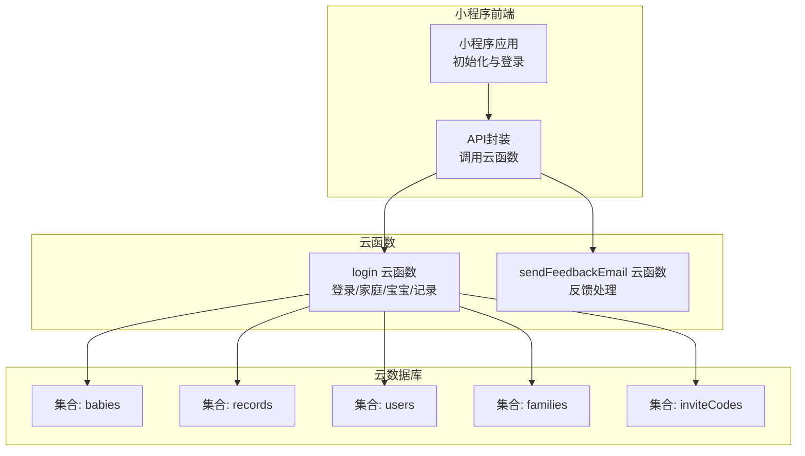
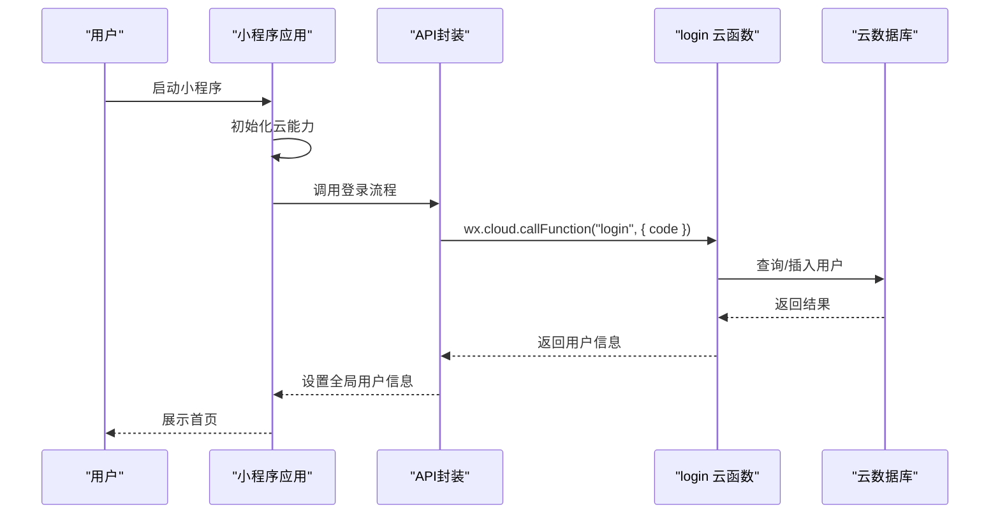
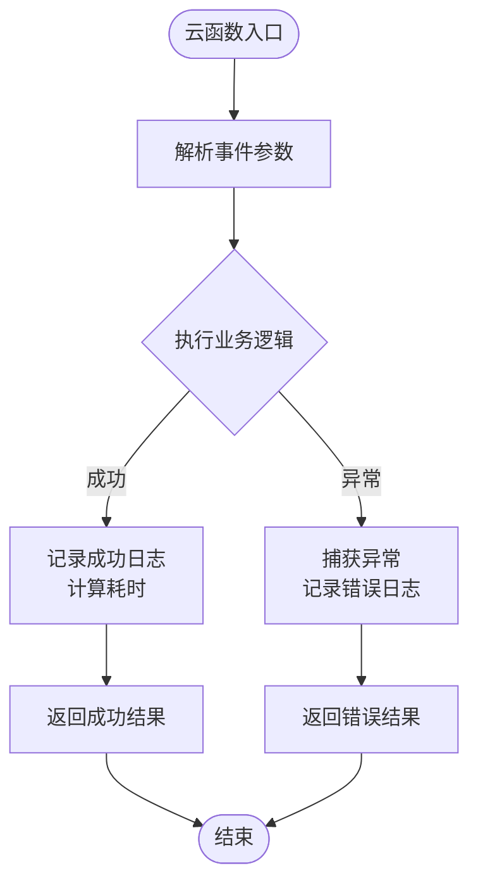
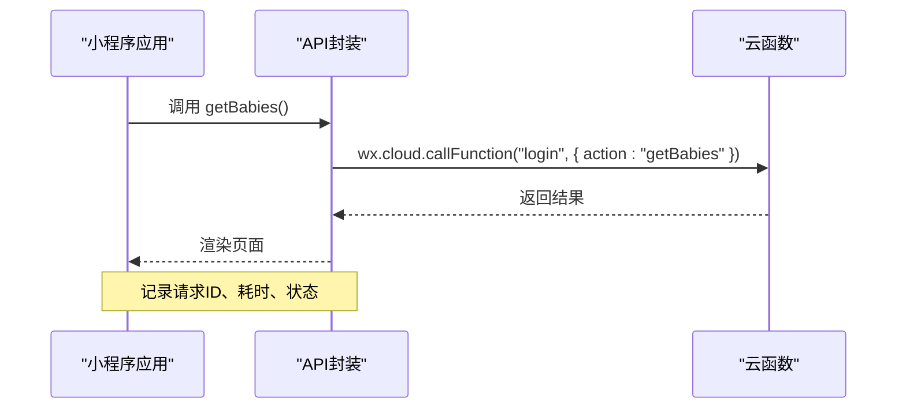
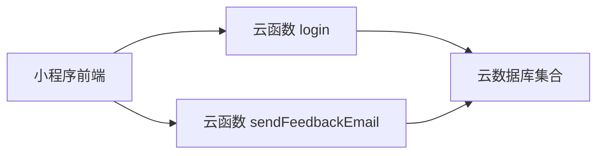

# 监控告警

<cite>
**本文引用的文件**
- [login/index.js](file://cloudfunctions/login/index.js)
- [sendFeedbackEmail/index.js](file://cloudfunctions/sendFeedbackEmail/index.js)
- [app.js](file://miniprogram/app.js)
- [api.js](file://miniprogram/utils/api.js)
- [README.md](file://README.md)
- [server-quickstart.md](file://.agents/skills/cloudbase/references/cloudbase-agent/ts/server-quickstart.md)
- [observability.md](file://.agents/skills/cloudbase/references/cloudbase-agent/py/references/observability.md)
- [recipes.md](file://.agents/skills/cloudbase/references/cloudbase-agent/py/references/recipes.md)
- [cloud-functions SKILL.md](file://.agents/skills/cloudbase/references/cloud-functions/SKILL.md)
</cite>

## 目录
1. [简介](#简介)
2. [项目结构](#项目结构)
3. [核心组件](#核心组件)
4. [架构总览](#架构总览)
5. [详细组件分析](#详细组件分析)
6. [依赖关系分析](#依赖关系分析)
7. [性能考量](#性能考量)
8. [故障排查指南](#故障排查指南)
9. [结论](#结论)
10. [附录](#附录)

## 简介
本指南面向“宝宝助手”小程序的监控与告警体系，聚焦于云函数的性能监控（执行时间、内存使用、错误率等），日志记录最佳实践（结构化日志、错误日志、业务日志的分类与存储），以及腾讯云开发平台监控面板的使用方法（实时监控、历史趋势、告警规则配置）。同时提供用户行为分析的实施思路（页面访问统计、功能使用情况、用户留存分析），并给出告警规则配置与通知机制的建议，确保问题能够被及时发现与处理。

## 项目结构
项目采用“小程序前端 + 云函数后端”的分层架构，核心云函数负责登录、家庭管理、宝宝与记录管理等业务逻辑；小程序前端通过云函数暴露的接口进行数据交互；数据库采用云数据库（NoSQL）。

图示来源
- [README.md: 77-103:77-103](file://README.md#L77-L103)
- [app.js: 8-20:8-20](file://miniprogram/app.js#L8-L20)
- [api.js: 58-63:58-63](file://miniprogram/utils/api.js#L58-L63)

章节来源
- [README.md: 77-103:77-103](file://README.md#L77-L103)
- [app.js: 8-20:8-20](file://miniprogram/app.js#L8-L20)
- [api.js: 58-63:58-63](file://miniprogram/utils/api.js#L58-L63)

## 核心组件
- 云函数 login：负责用户登录、家庭管理、宝宝管理、记录管理等核心业务，包含大量数据库读写与权限校验逻辑。
- 云函数 sendFeedbackEmail：接收反馈数据，当前为占位实现，便于后续接入邮件发送与告警通知。
- 小程序前端：通过 wx.cloud.callFunction 调用云函数，完成用户登录与业务操作。
- 云数据库：babies、records、users、families、inviteCodes 等集合承载业务数据。

章节来源
- [login/index.js: 22-800:22-800](file://cloudfunctions/login/index.js#L22-L800)
- [sendFeedbackEmail/index.js: 6-20:6-20](file://cloudfunctions/sendFeedbackEmail/index.js#L6-L20)
- [api.js: 58-63:58-63](file://miniprogram/utils/api.js#L58-L63)

## 架构总览
云函数作为业务中枢，承担鉴权、权限校验、数据一致性（事务）、复杂查询与聚合等职责；前端通过云函数间接访问数据库，避免直接暴露数据库权限。监控与告警应覆盖云函数的执行链路，包括请求耗时、错误率、数据库查询性能、权限异常等。

图示来源
- [app.js: 28-54:28-54](file://miniprogram/app.js#L28-L54)
- [api.js: 34-48:34-48](file://miniprogram/utils/api.js#L34-L48)
- [login/index.js: 763-799:763-799](file://cloudfunctions/login/index.js#L763-L799)

## 详细组件分析

### 云函数 login 的监控要点
- 执行时间监控
  - 关键路径：登录、获取家庭列表、获取宝宝列表、创建/删除家庭、创建/删除宝宝、增删改记录等。
  - 建议在云函数入口处记录开始时间，在返回前记录结束时间，计算耗时并上报指标。
- 内存使用监控
  - 大查询（如获取宝宝列表、记录列表）可能产生较高内存占用，建议对批量查询设置 limit 并分页。
- 错误率监控
  - 对所有 try/catch 包裹的业务逻辑进行错误计数，区分数据库错误、权限错误、参数错误等类型。
- 日志记录
  - 结构化日志：包含请求ID、用户标识、操作类型、耗时、结果状态、错误码等字段。
  - 分类日志：业务日志（增删改查）、错误日志（异常堆栈与上下文）、审计日志（权限变更、敏感操作）。

图示来源
- [login/index.js: 26-200:26-200](file://cloudfunctions/login/index.js#L26-L200)

章节来源
- [login/index.js: 22-800:22-800](file://cloudfunctions/login/index.js#L22-L800)

### 云函数 sendFeedbackEmail 的监控要点
- 当前实现为占位，建议在此函数中：
  - 记录收到反馈的时间、来源、内容摘要；
  - 若接入邮件服务，记录发送状态与耗时；
  - 对异常进行结构化错误日志记录。
- 可作为告警触发点：当错误率或延迟超过阈值时，触发通知。

章节来源
- [sendFeedbackEmail/index.js: 6-20:6-20](file://cloudfunctions/sendFeedbackEmail/index.js#L6-L20)

### 小程序前端的监控要点
- 登录流程监控：记录 wx.login 成功/失败、调用云函数成功/失败、登录耗时。
- API 调用监控：对每个 wx.cloud.callFunction 调用记录请求ID、参数摘要、耗时、返回状态。
- 权限与错误处理：对权限不足、网络异常、超时等场景进行结构化日志记录。

图示来源
- [api.js: 44-75:44-75](file://miniprogram/utils/api.js#L44-L75)
- [app.js: 28-54:28-54](file://miniprogram/app.js#L28-L54)

章节来源
- [api.js: 44-75:44-75](file://miniprogram/utils/api.js#L44-L75)
- [app.js: 28-54:28-54](file://miniprogram/app.js#L28-L54)

## 依赖关系分析
- 前端依赖云函数提供的统一接口，避免直接访问数据库。
- 云函数依赖云数据库的集合（babies、records、users、families、inviteCodes）。
- 监控与告警依赖腾讯云开发平台的云函数日志、指标与告警能力。

图示来源
- [README.md: 65-71:65-71](file://README.md#L65-L71)
- [api.js: 58-63:58-63](file://miniprogram/utils/api.js#L58-L63)

章节来源
- [README.md: 65-71:65-71](file://README.md#L65-L71)
- [api.js: 58-63:58-63](file://miniprogram/utils/api.js#L58-L63)

## 性能考量
- 云函数执行时间
  - 对复杂查询（如多表关联、排序、分页）进行性能评估，必要时引入索引或拆分查询。
  - 对批量操作（如删除过期邀请码）采用异步清理，避免阻塞主流程。
- 内存使用
  - 控制单次查询返回的数据量，使用 limit 与分页。
  - 避免在内存中构造过大的数组或对象。
- 错误率
  - 对数据库异常、权限异常、参数异常进行分类统计，识别热点问题。
- 日志与追踪
  - 为每次请求生成唯一请求ID，贯穿前端、云函数与数据库日志，便于定位问题。

章节来源
- [login/index.js: 691-696:691-696](file://cloudfunctions/login/index.js#L691-L696)
- [login/index.js: 740-760:740-760](file://cloudfunctions/login/index.js#L740-L760)

## 故障排查指南
- 云函数日志查询
  - 使用云开发平台提供的日志查询能力，按请求ID检索详细日志。
- 常见问题定位
  - 登录失败：检查 wx.login 是否成功、云函数返回的错误信息、数据库连接状态。
  - 权限异常：核对 families 集合中的成员权限字段，确认调用方 openid 与权限匹配。
  - 数据库查询慢：检查 where 条件是否合理、是否需要建立索引、是否使用了不必要的排序或聚合。
- 建议的日志字段
  - 请求ID、用户ID、操作类型、耗时、结果状态、错误码、错误消息、上下文参数摘要。

章节来源
- [cloud-functions SKILL.md: 693-737:693-737](file://.agents/skills/cloudbase/references/cloud-functions/SKILL.md#L693-L737)

## 结论
通过在云函数与小程序前端建立完善的日志与指标体系，并结合腾讯云开发平台的监控与告警能力，可以有效保障“宝宝助手”小程序在高并发与复杂业务场景下的稳定性与可观测性。建议优先实现结构化日志与关键指标采集，再逐步完善告警规则与通知机制，形成闭环的运维体系。

## 附录

### 腾讯云开发平台监控面板使用方法
- 实时监控
  - 在云开发控制台查看云函数的实时请求量、错误率、平均耗时、内存使用等指标。
- 历史趋势
  - 选择时间范围，查看指标的历史变化，识别性能波动与异常峰值。
- 告警规则配置
  - 基于错误率、执行时间、内存使用等指标设置阈值告警，支持邮件、短信或企业微信通知。
- 日志查询
  - 使用日志查询功能，按请求ID、时间范围、关键字检索日志，辅助定位问题。

章节来源
- [cloud-functions SKILL.md: 693-737:693-737](file://.agents/skills/cloudbase/references/cloud-functions/SKILL.md#L693-L737)

### 观测性与告警参考
- 观测性能力
  - 支持结构化日志、指标采集、分布式追踪与健康检查。
- 告警规则示例
  - 错误率高于阈值持续一段时间；
  - 95 分位延迟超过阈值；
  - 内存使用持续升高。
- 仪表盘与最佳实践
  - 使用预置仪表盘或自定义仪表盘展示关键指标；
  - 保持日志字段一致性，便于检索与分析。

章节来源
- [server-quickstart.md: 113-150:113-150](file://.agents/skills/cloudbase/references/cloudbase-agent/ts/server-quickstart.md#L113-L150)
- [observability.md: 1-416:1-416](file://.agents/skills/cloudbase/references/cloudbase-agent/py/references/observability.md#L1-L416)
- [recipes.md: 274-314:274-314](file://.agents/skills/cloudbase/references/cloudbase-agent/py/references/recipes.md#L274-L314)