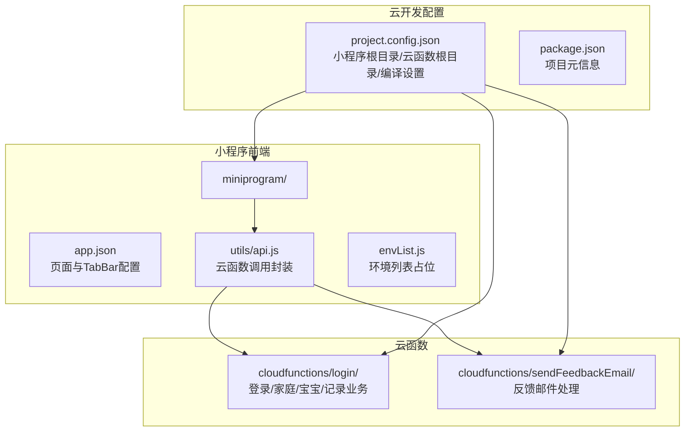
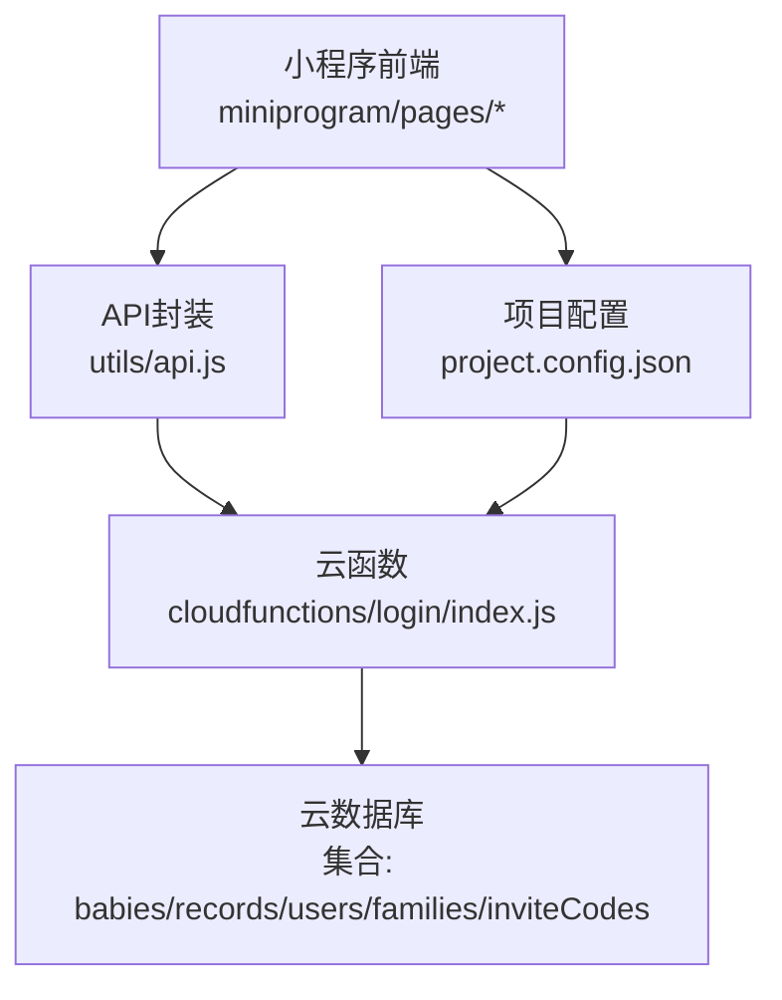
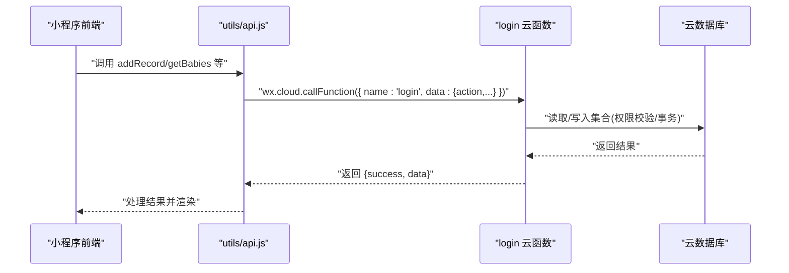
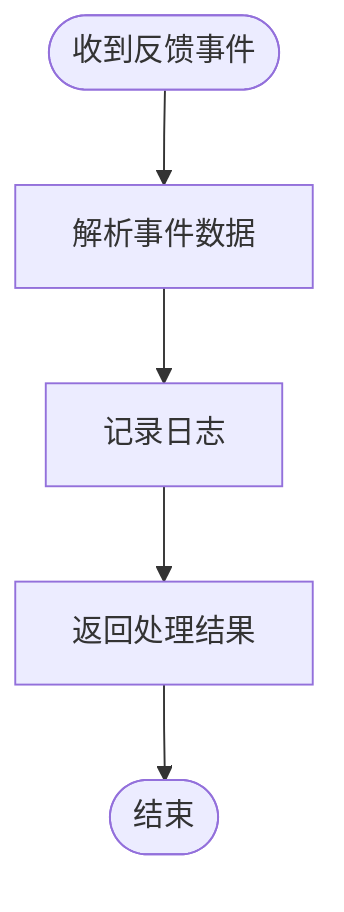
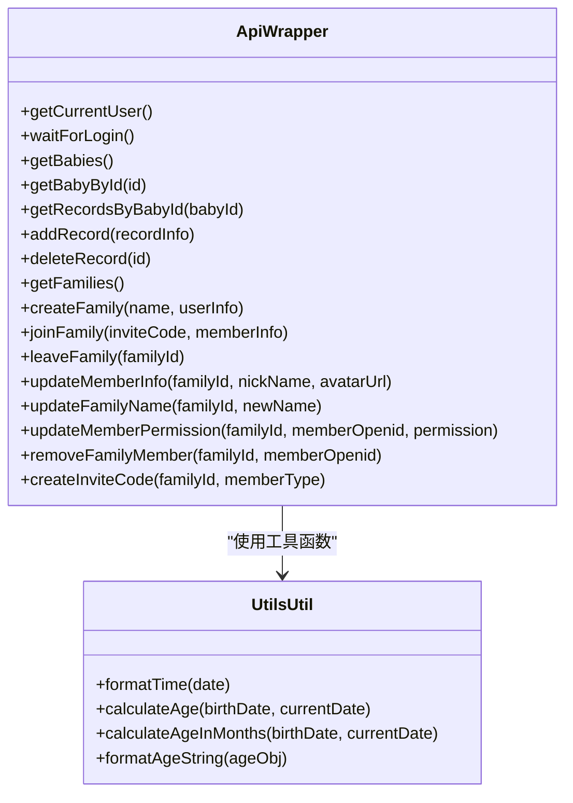
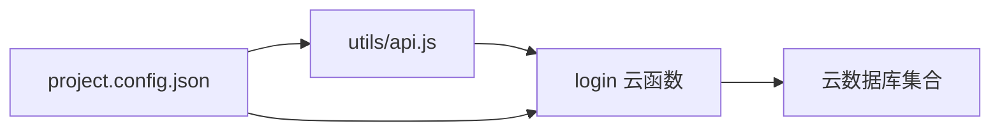

# 部署运维

<cite>
**本文引用的文件**
- [README.md](file://README.md)
- [project.config.json](file://project.config.json)
- [package.json](file://package.json)
- [miniprogram/app.json](file://miniprogram/app.json)
- [miniprogram/envList.js](file://miniprogram/envList.js)
- [miniprogram/utils/api.js](file://miniprogram/utils/api.js)
- [miniprogram/utils/util.js](file://miniprogram/utils/util.js)
- [cloudfunctions/login/package.json](file://cloudfunctions/login/package.json)
- [cloudfunctions/login/index.js](file://cloudfunctions/login/index.js)
- [cloudfunctions/sendFeedbackEmail/package.json](file://cloudfunctions/sendFeedbackEmail/package.json)
- [cloudfunctions/sendFeedbackEmail/index.js](file://cloudfunctions/sendFeedbackEmail/index.js)
- [uploadCloudFunction.sh](file://uploadCloudFunction.sh)
</cite>

## 目录
1. [简介](#简介)
2. [项目结构](#项目结构)
3. [核心组件](#核心组件)
4. [架构总览](#架构总览)
5. [详细组件分析](#详细组件分析)
6. [依赖关系分析](#依赖关系分析)
7. [性能考量](#性能考量)
8. [故障排查指南](#故障排查指南)
9. [结论](#结论)
10. [附录](#附录)

## 简介
本指南面向运维团队，提供“宝宝助手”小程序在腾讯云开发平台上的完整部署与运维方案。内容覆盖开发、测试、生产三类环境的配置与管理；云函数与静态资源的部署策略；数据库集合与权限规则的配置；环境变量管理；自动化部署脚本的使用；监控告警体系的搭建；故障排查流程；版本管理与回滚策略；以及安全加固、性能调优与容量规划等最佳实践。

## 项目结构
项目采用“小程序前端 + 云函数 + 云数据库”的典型云开发架构。前端位于 miniprogram 目录，云函数位于 cloudfunctions 目录，项目配置集中在 project.config.json 与各包管理文件中。

**图示来源**
- [project.config.json:1-85](file://project.config.json#L1-L85)
- [miniprogram/app.json:1-39](file://miniprogram/app.json#L1-L39)
- [miniprogram/utils/api.js:1-879](file://miniprogram/utils/api.js#L1-L879)
- [cloudfunctions/login/package.json:1-16](file://cloudfunctions/login/package.json#L1-L16)
- [cloudfunctions/sendFeedbackEmail/package.json:1-16](file://cloudfunctions/sendFeedbackEmail/package.json#L1-L16)

**章节来源**
- [project.config.json:1-85](file://project.config.json#L1-L85)
- [package.json:1-22](file://package.json#L1-L22)

## 核心组件
- 小程序前端：负责用户界面、交互与云函数调用封装，集中于 utils/api.js。
- 云函数 login：承载登录、家庭管理、宝宝管理、记录管理等核心业务逻辑。
- 云函数 sendFeedbackEmail：反馈邮件处理（当前为占位实现）。
- 项目配置：project.config.json 定义小程序与云函数根目录、编译选项与云开发开关；envList.js 提供环境列表占位。

**章节来源**
- [miniprogram/utils/api.js:1-879](file://miniprogram/utils/api.js#L1-L879)
- [cloudfunctions/login/index.js:1-814](file://cloudfunctions/login/index.js#L1-L814)
- [cloudfunctions/sendFeedbackEmail/index.js:1-21](file://cloudfunctions/sendFeedbackEmail/index.js#L1-L21)
- [project.config.json:1-85](file://project.config.json#L1-L85)
- [miniprogram/envList.js:1-7](file://miniprogram/envList.js#L1-L7)

## 架构总览
小程序通过 wx.cloud 调用云函数，云函数使用 wx-server-sdk 初始化并访问云数据库。数据库集合包括 babies、records、users、families、inviteCodes。前端页面通过 app.json 配置导航与 TabBar。

**图示来源**
- [miniprogram/utils/api.js:1-879](file://miniprogram/utils/api.js#L1-L879)
- [cloudfunctions/login/index.js:1-814](file://cloudfunctions/login/index.js#L1-L814)
- [project.config.json:1-85](file://project.config.json#L1-L85)

## 详细组件分析

### 云函数 login 组件
- 职责：登录态校验、家庭管理、宝宝管理、记录管理、权限校验、事务保证。
- 关键点：
  - 使用 cloud.init(env) 与 cloud.DYNAMIC_CURRENT_ENV 动态环境初始化。
  - 通过 wxContext.OPENID 获取用户标识，结合 families/inviteCodes 等集合进行权限与业务校验。
  - 使用 runTransaction 确保删除等关键操作的原子性。
  - 对外暴露多种 action（如 getBabies、createFamily、deleteBaby、getRecordsByBabyId 等），由前端通过 wx.cloud.callFunction 调用。

**图示来源**
- [miniprogram/utils/api.js:1-879](file://miniprogram/utils/api.js#L1-L879)
- [cloudfunctions/login/index.js:1-814](file://cloudfunctions/login/index.js#L1-L814)

**章节来源**
- [cloudfunctions/login/index.js:1-814](file://cloudfunctions/login/index.js#L1-L814)
- [cloudfunctions/login/package.json:1-16](file://cloudfunctions/login/package.json#L1-L16)

### 云函数 sendFeedbackEmail 组件
- 职责：接收反馈数据并处理（当前为占位实现，返回成功消息）。
- 建议：后续接入邮件服务或消息队列，完善异步处理与重试。

**图示来源**
- [cloudfunctions/sendFeedbackEmail/index.js:1-21](file://cloudfunctions/sendFeedbackEmail/index.js#L1-L21)

**章节来源**
- [cloudfunctions/sendFeedbackEmail/index.js:1-21](file://cloudfunctions/sendFeedbackEmail/index.js#L1-L21)
- [cloudfunctions/sendFeedbackEmail/package.json:1-16](file://cloudfunctions/sendFeedbackEmail/package.json#L1-L16)

### 小程序前端组件
- 页面与导航：app.json 定义 pages、TabBar、导航栏样式与 lazyCodeLoading。
- API 封装：utils/api.js 统一封装数据库与云函数调用，包含等待登录、权限校验、增删改查等。
- 工具函数：utils/util.js 提供时间格式化、年龄计算等通用逻辑。
- 环境配置：envList.js 当前为空数组，用于占位，实际环境需在云开发控制台配置。

**图示来源**
- [miniprogram/utils/api.js:1-879](file://miniprogram/utils/api.js#L1-L879)
- [miniprogram/utils/util.js:1-55](file://miniprogram/utils/util.js#L1-L55)

**章节来源**
- [miniprogram/app.json:1-39](file://miniprogram/app.json#L1-L39)
- [miniprogram/utils/api.js:1-879](file://miniprogram/utils/api.js#L1-L879)
- [miniprogram/utils/util.js:1-55](file://miniprogram/utils/util.js#L1-L55)
- [miniprogram/envList.js:1-7](file://miniprogram/envList.js#L1-L7)

## 依赖关系分析
- 前端对云函数的依赖：通过 wx.cloud.callFunction 调用 login 云函数的不同 action。
- 云函数对数据库的依赖：围绕 families、babies、records、users、inviteCodes 集合进行 CRUD 与事务。
- 项目配置对构建的影响：project.config.json 决定小程序与云函数根目录、编译优化与云开发开关。

**图示来源**
- [miniprogram/utils/api.js:1-879](file://miniprogram/utils/api.js#L1-L879)
- [cloudfunctions/login/index.js:1-814](file://cloudfunctions/login/index.js#L1-L814)
- [project.config.json:1-85](file://project.config.json#L1-L85)

**章节来源**
- [miniprogram/utils/api.js:1-879](file://miniprogram/utils/api.js#L1-L879)
- [cloudfunctions/login/index.js:1-814](file://cloudfunctions/login/index.js#L1-L814)
- [project.config.json:1-85](file://project.config.json#L1-L85)

## 性能考量
- 云函数冷启动与并发：合理设置超时与并发上限，避免长时间阻塞；对高频接口考虑缓存与批量查询。
- 数据库查询优化：使用索引字段（如 openid、familyId、babyId）进行查询；分页与投影减少传输量。
- 前端懒加载：启用 lazyCodeLoading，减少首屏体积；组件按需加载。
- 编译优化：project.config.json 中已开启 minified、minifyWXML/WXSS、minifyWXSS 等优化项。

**章节来源**
- [project.config.json:1-85](file://project.config.json#L1-L85)

## 故障排查指南
- 登录与权限问题
  - 现象：获取宝宝/记录失败、权限不足。
  - 排查：确认 wxContext.OPENID 是否正确；检查 families 集合中成员权限；核对 action 参数与返回值。
- 事务与数据一致性
  - 现象：删除宝宝后记录未清理。
  - 排查：确认 runTransaction 是否完整执行；检查事务内集合操作顺序。
- 云函数部署与环境变量
  - 现象：部署后函数不可用或报错。
  - 排查：使用开发者工具“上传并部署”；若涉及环境变量，遵循“合并更新”原则，避免覆盖现有变量。
- 日志与可观测性
  - 建议：在云函数中增加结构化日志；结合云开发日志面板定位异常；对关键路径打点埋点。

**章节来源**
- [cloudfunctions/login/index.js:1-814](file://cloudfunctions/login/index.js#L1-L814)
- [.agents\skills\cloudbase\references\cloud-functions\SKILL.md:600-653](file://.agents\skills\cloudbase\references\cloud-functions\SKILL.md#L600-L653)

## 结论
本指南提供了从环境准备、部署流程、数据库配置、自动化脚本到监控告警与故障排查的全链路运维方案。建议在生产环境严格执行变更审批与回滚策略，持续优化数据库与云函数性能，并建立完善的日志与告警体系，确保系统稳定与可追溯。

## 附录

### 开发/测试/生产环境配置与管理
- 环境准备
  - 在微信开发者工具中打开项目，启用云开发；创建或选择目标环境并复制环境ID。
  - 在云开发控制台创建集合：babies、records、users、families、inviteCodes。
- 环境变量管理
  - 若未来引入环境变量，务必遵循“合并更新”原则，避免覆盖现有变量。
- 部署策略
  - 云函数：在开发者工具中右键云函数目录，选择“上传并部署”。
  - 静态资源：小程序代码由开发者工具自动上传至云开发静态托管（如启用）。

**章节来源**
- [README.md:48-76](file://README.md#L48-L76)
- [project.config.json:1-85](file://project.config.json#L1-L85)
- [.agents\skills\cloudbase\references\cloud-functions\SKILL.md:600-653](file://.agents\skills\cloudbase\references\cloud-functions\SKILL.md#L600-L653)

### 自动化部署脚本 uploadCloudFunction.sh 使用
- 脚本说明
  - 通过命令行工具执行云函数部署，需预先设置 installPath、envId、projectPath 等变量。
- 使用步骤
  - 设置环境变量：installPath、envId、projectPath。
  - 执行脚本：./uploadCloudFunction.sh。
- 注意事项
  - 确保安装路径指向正确的腾讯云 CLI 工具；envId 与 projectPath 与实际项目匹配。

**章节来源**
- [uploadCloudFunction.sh:1-1](file://uploadCloudFunction.sh#L1-L1)

### 监控告警体系搭建
- 日志与指标
  - 在云函数中输出结构化日志；对关键接口埋点计数器与直方图。
- 错误监控
  - 对异常进行捕获与上报，保留上下文信息（如 openid、familyId、babyId）。
- 用户行为分析
  - 通过埋点统计关键动作（如添加宝宝、记录身高体重、邀请成员等）。
- 可观测性参考
  - 可参考云开发可观测性能力与最佳实践文档。

**章节来源**
- [.agents\skills\cloudbase\references\cloudbase-agent\py\references\observability.md:1-416](file://.agents\skills\cloudbase\references\cloudbase-agent\py\references\observability.md#L1-L416)

### 版本管理与回滚策略
- 版本管理
  - 云函数版本：每次重要变更后创建版本并打标签；灰度发布逐步扩大流量。
- 回滚策略
  - 发生问题时回退至上一个稳定版本；回滚前核对数据库结构与集合权限。
- 变更审批
  - 重大变更需双人复核与评审记录，确保可追溯。

**章节来源**
- [README.md:155-179](file://README.md#L155-L179)

### 运维最佳实践
- 安全加固
  - 数据库安全规则：限制查询条件，避免全表扫描；对敏感字段加密存储。
  - 权限最小化：严格校验 openid 与家庭成员权限；禁止直接暴露数据库操作。
- 性能调优
  - 云函数：拆分职责、减少 IO、使用事务保证一致性。
  - 数据库：为常用查询字段建立索引；分页与投影。
- 容量规划
  - 监控请求量与峰值；评估云函数并发与数据库连接池；预留扩容空间。

**章节来源**
- [cloudfunctions/login/index.js:1-814](file://cloudfunctions/login/index.js#L1-L814)
- [README.md:147-154](file://README.md#L147-L154)