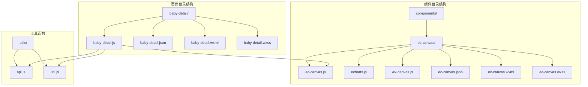
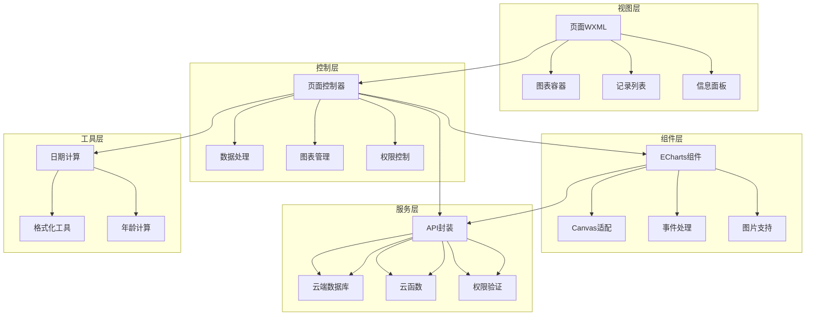
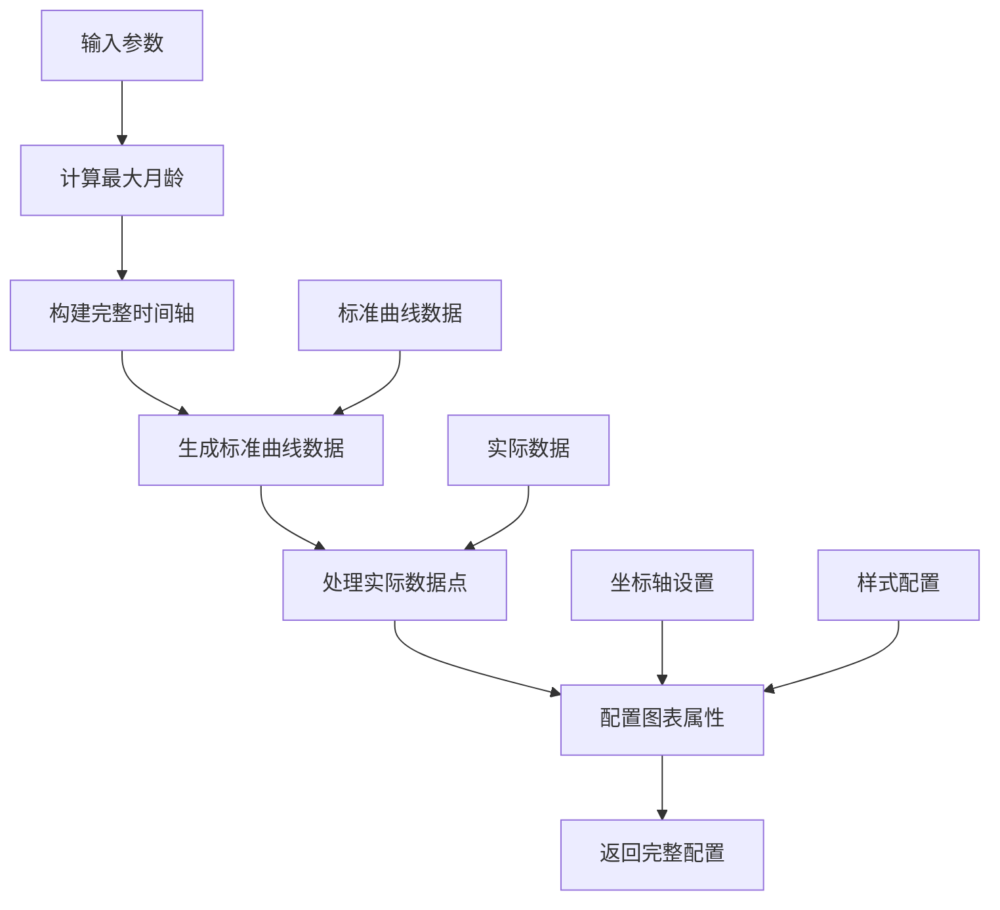
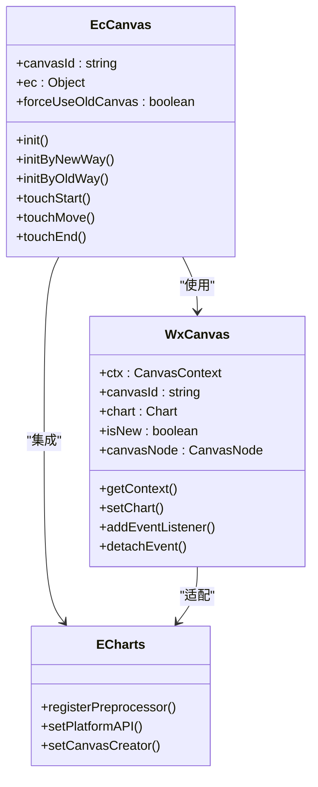
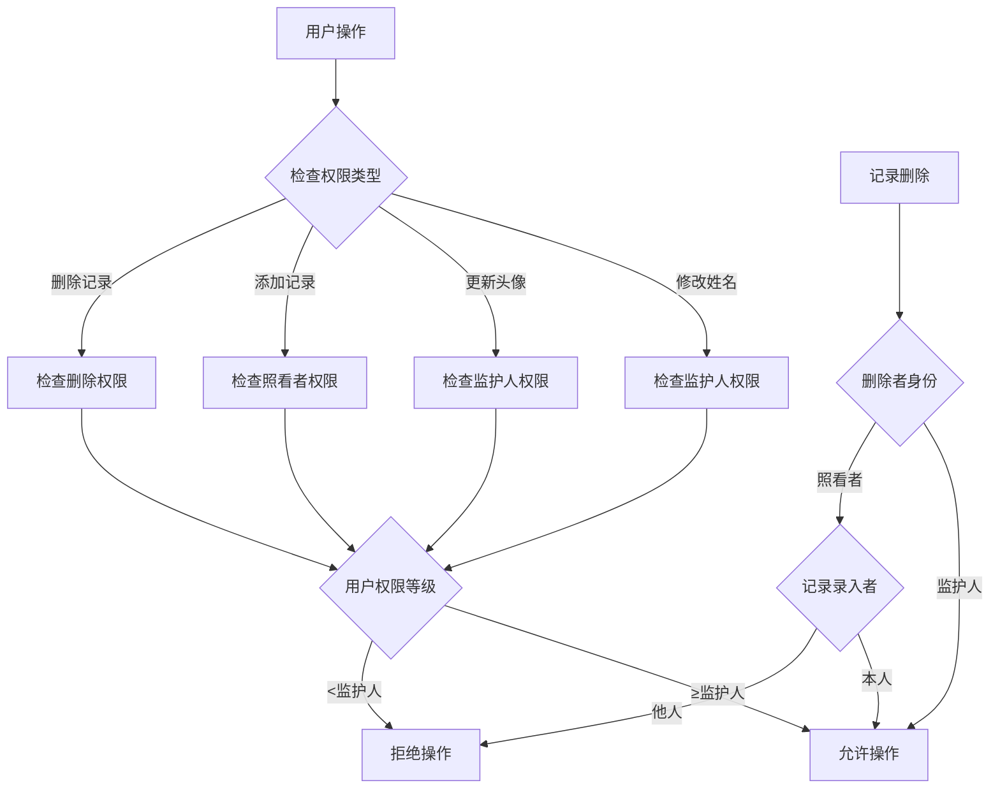
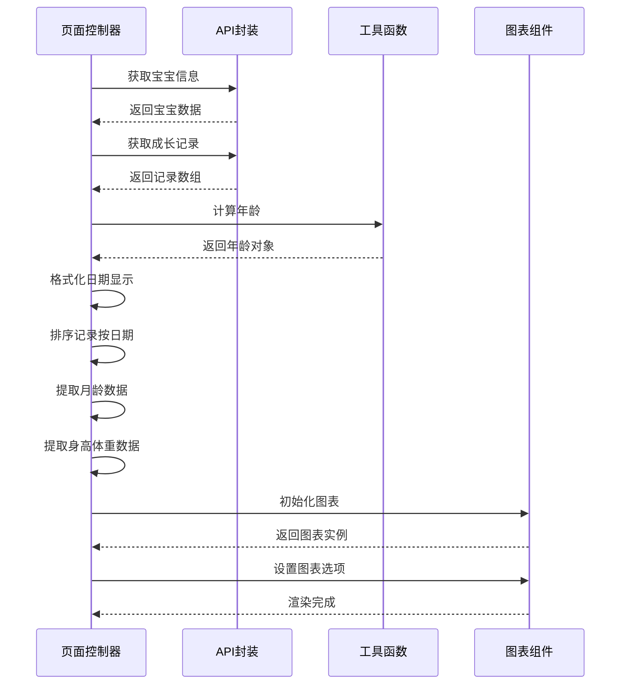
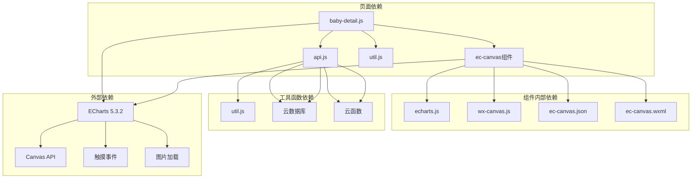
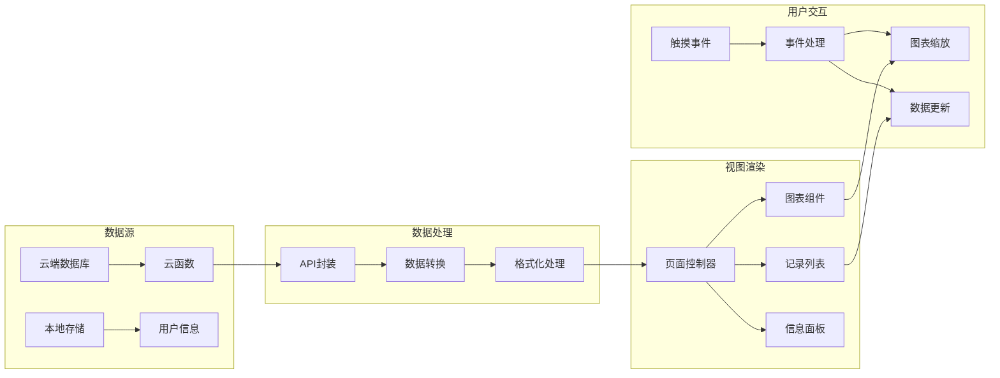
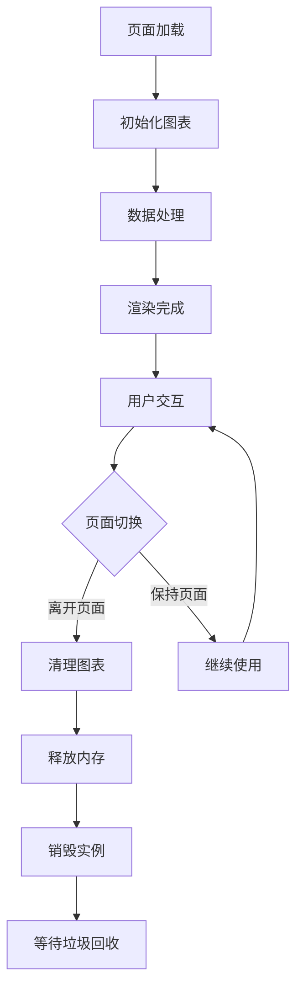

# 宝宝详情页

<cite>
**本文档引用的文件**
- [baby-detail.js](file://miniprogram/pages/baby-detail/baby-detail.js)
- [baby-detail.json](file://miniprogram/pages/baby-detail/baby-detail.json)
- [baby-detail.wxml](file://miniprogram/pages/baby-detail/baby-detail.wxml)
- [ec-canvas.js](file://miniprogram/components/ec-canvas/ec-canvas.js)
- [echarts.js](file://miniprogram/components/ec-canvas/echarts.js)
- [wx-canvas.js](file://miniprogram/components/ec-canvas/wx-canvas.js)
- [api.js](file://miniprogram/utils/api.js)
- [util.js](file://miniprogram/utils/util.js)
</cite>

## 目录
1. [简介](#简介)
2. [项目结构](#项目结构)
3. [核心组件](#核心组件)
4. [架构概览](#架构概览)
5. [详细组件分析](#详细组件分析)
6. [依赖关系分析](#依赖关系分析)
7. [性能考虑](#性能考虑)
8. [故障排除指南](#故障排除指南)
9. [结论](#结论)

## 简介

宝宝详情页是微信小程序"宝宝助手"项目中的核心功能模块，专门用于展示和分析宝宝的成长数据。该页面集成了ECharts图表组件，实现了身高体重曲线的可视化展示，包括标准曲线对比分析、数据点标注、交互式缩放等功能。页面采用响应式设计，支持多种设备尺寸，并提供了完整的权限控制机制。

## 项目结构

宝宝详情页位于小程序项目的 `miniprogram/pages/baby-detail/` 目录下，主要包含以下文件：

**图表来源**
- [baby-detail.js:1-691](file://miniprogram/pages/baby-detail/baby-detail.js#L1-L691)
- [ec-canvas.js:1-285](file://miniprogram/components/ec-canvas/ec-canvas.js#L1-L285)
- [api.js:1-879](file://miniprogram/utils/api.js#L1-L879)

**章节来源**
- [baby-detail.js:1-691](file://miniprogram/pages/baby-detail/baby-detail.js#L1-L691)
- [ec-canvas.js:1-285](file://miniprogram/components/ec-canvas/ec-canvas.js#L1-L285)
- [api.js:1-879](file://miniprogram/utils/api.js#L1-L879)

## 核心组件

### 页面控制器 (baby-detail.js)

页面控制器是整个宝宝详情页的核心，负责数据管理、图表初始化、权限控制和用户交互处理。主要功能包括：

- **数据加载与处理**：从云端数据库获取宝宝信息和成长记录
- **图表初始化**：动态创建ECharts实例，配置图表选项
- **权限验证**：基于家庭成员角色的权限控制系统
- **用户交互**：处理用户点击、滑动等操作事件

### ECharts集成组件 (ec-canvas)

自定义的ECharts集成组件，专门适配微信小程序的Canvas环境：

- **Canvas适配**：支持新旧两种Canvas API版本
- **触摸事件处理**：将微信触摸事件转换为ECharts事件
- **图片加载支持**：通过CanvasNode.createImage()加载图片资源
- **响应式布局**：根据设备像素比自动调整图表清晰度

### 工具函数 (api.js, util.js)

提供系统化的工具函数支持：

- **API封装**：统一的云端数据库操作接口
- **日期计算**：精确的年龄计算和格式化
- **权限管理**：基于角色的访问控制机制

**章节来源**
- [baby-detail.js:156-691](file://miniprogram/pages/baby-detail/baby-detail.js#L156-L691)
- [ec-canvas.js:31-275](file://miniprogram/components/ec-canvas/ec-canvas.js#L31-L275)
- [api.js:1-879](file://miniprogram/utils/api.js#L1-L879)
- [util.js:1-55](file://miniprogram/utils/util.js#L1-L55)

## 架构概览

宝宝详情页采用分层架构设计，各层职责明确，耦合度低：

**图表来源**
- [baby-detail.js:156-691](file://miniprogram/pages/baby-detail/baby-detail.js#L156-L691)
- [ec-canvas.js:31-275](file://miniprogram/components/ec-canvas/ec-canvas.js#L31-L275)
- [api.js:1-879](file://miniprogram/utils/api.js#L1-L879)

## 详细组件分析

### 图表配置系统

图表配置系统是宝宝详情页的核心功能，实现了高度定制化的数据可视化：

#### 图表选项生成器

**图表来源**
- [baby-detail.js:6-154](file://miniprogram/pages/baby-detail/baby-detail.js#L6-L154)

#### 数据标准化处理

系统支持两种数据标准化策略：

1. **月龄标准化**：将任意日期转换为月龄（0-84个月）
2. **百分位数标准化**：基于WHO标准曲线的百分位数计算

**章节来源**
- [baby-detail.js:6-154](file://miniprogram/pages/baby-detail/baby-detail.js#L6-L154)

### ECharts集成架构

#### Canvas适配层

**图表来源**
- [ec-canvas.js:31-275](file://miniprogram/components/ec-canvas/ec-canvas.js#L31-L275)
- [wx-canvas.js:1-112](file://miniprogram/components/ec-canvas/wx-canvas.js#L1-L112)

#### 触摸事件映射

系统实现了完整的触摸事件到ECharts事件的映射：

| 微信事件 | ECharts事件 | 用途 |
|---------|------------|------|
| touchStart | mousedown | 鼠标按下 |
| touchMove | mousemove | 鼠标移动 |
| touchEnd | mouseup | 鼠标抬起 |
| touchEnd | click | 点击事件 |

**章节来源**
- [ec-canvas.js:216-275](file://miniprogram/components/ec-canvas/ec-canvas.js#L216-L275)
- [wx-canvas.js:65-92](file://miniprogram/components/ec-canvas/wx-canvas.js#L65-L92)

### 权限控制系统

系统实现了基于角色的权限控制机制：

**图表来源**
- [baby-detail.js:475-689](file://miniprogram/pages/baby-detail/baby-detail.js#L475-L689)

**章节来源**
- [baby-detail.js:475-689](file://miniprogram/pages/baby-detail/baby-detail.js#L475-L689)
- [api.js:782-852](file://miniprogram/utils/api.js#L782-L852)

### 数据处理流程

#### 成长数据处理

**图表来源**
- [baby-detail.js:193-245](file://miniprogram/pages/baby-detail/baby-detail.js#L193-L245)

**章节来源**
- [baby-detail.js:193-245](file://miniprogram/pages/baby-detail/baby-detail.js#L193-L245)
- [util.js:8-38](file://miniprogram/utils/util.js#L8-L38)

## 依赖关系分析

### 组件依赖图

**图表来源**
- [baby-detail.js:1-6](file://miniprogram/pages/baby-detail/baby-detail.js#L1-L6)
- [ec-canvas.js:1-2](file://miniprogram/components/ec-canvas/ec-canvas.js#L1-L2)
- [api.js:1-3](file://miniprogram/utils/api.js#L1-L3)

### 数据流图

**图表来源**
- [api.js:1-879](file://miniprogram/utils/api.js#L1-L879)
- [baby-detail.js:193-245](file://miniprogram/pages/baby-detail/baby-detail.js#L193-L245)

**章节来源**
- [api.js:1-879](file://miniprogram/utils/api.js#L1-L879)
- [baby-detail.js:1-691](file://miniprogram/pages/baby-detail/baby-detail.js#L1-L691)

## 性能考虑

### 图表性能优化

系统采用了多项性能优化措施：

1. **懒加载机制**：图表仅在需要时初始化，减少内存占用
2. **数据预处理**：在图表初始化前完成数据格式转换
3. **Canvas适配**：根据设备能力选择最优的Canvas实现方式
4. **事件节流**：触摸事件处理采用防抖机制

### 内存管理

**图表来源**
- [baby-detail.js:323-397](file://miniprogram/pages/baby-detail/baby-detail.js#L323-L397)

### 响应式设计

系统支持多种屏幕尺寸和设备类型：

- **自适应布局**：根据屏幕宽度调整图表大小
- **设备像素比**：自动适配高分辨率屏幕
- **触摸优化**：针对移动设备优化触摸体验

**章节来源**
- [ec-canvas.js:80-108](file://miniprogram/components/ec-canvas/ec-canvas.js#L80-L108)
- [baby-detail.js:323-397](file://miniprogram/pages/baby-detail/baby-detail.js#L323-L397)

## 故障排除指南

### 常见问题及解决方案

#### 图表无法显示

**问题症状**：
- 图表区域空白
- 控制台出现错误信息

**可能原因**：
1. Canvas初始化失败
2. 数据格式不正确
3. 权限不足

**解决步骤**：
1. 检查Canvas节点是否正确创建
2. 验证数据数组格式
3. 确认用户权限状态

#### 数据加载失败

**问题症状**：
- 页面显示"加载失败"
- 成长记录为空

**解决步骤**：
1. 检查网络连接状态
2. 验证云端数据库访问权限
3. 确认云函数执行状态

#### 权限控制问题

**问题症状**：
- 无法修改宝宝信息
- 无法添加/删除记录

**解决步骤**：
1. 检查用户在家庭中的角色
2. 验证操作权限级别
3. 确认家庭成员状态

**章节来源**
- [baby-detail.js:193-245](file://miniprogram/pages/baby-detail/baby-detail.js#L193-L245)
- [api.js:782-852](file://miniprogram/utils/api.js#L782-L852)

## 结论

宝宝详情页是一个功能完整、架构清晰的移动端数据可视化应用。通过精心设计的组件架构和完善的权限控制系统，实现了以下核心价值：

### 技术优势

1. **高度可定制**：支持多种图表类型和样式配置
2. **性能优化**：采用懒加载和内存管理策略
3. **用户体验**：提供流畅的触摸交互和响应式设计
4. **安全性**：完善的权限控制和数据验证机制

### 功能特色

1. **标准曲线对比**：基于WHO标准的百分位数分析
2. **历史数据追踪**：完整的成长记录管理和可视化
3. **智能权限控制**：基于角色的精细化访问管理
4. **跨平台兼容**：支持多种微信小程序版本

该页面为家长提供了直观、准确的宝宝成长数据分析工具，是移动健康应用开发的优秀实践案例。