# 家庭管理页

<cite>
**本文档引用的文件**
- [family.js](file://miniprogram/pages/family/family.js)
- [family.json](file://miniprogram/pages/family/family.json)
- [family.wxml](file://miniprogram/pages/family/family.wxml)
- [family.wxss](file://miniprogram/pages/family/family.wxss)
- [api.js](file://miniprogram/utils/api.js)
- [util.js](file://miniprogram/utils/util.js)
- [app.js](file://miniprogram/app.js)
- [login/index.js](file://cloudfunctions/login/index.js)
- [sendFeedbackEmail/index.js](file://cloudfunctions/sendFeedbackEmail/index.js)
</cite>

## 目录
1. [简介](#简介)
2. [项目结构](#项目结构)
3. [核心组件](#核心组件)
4. [架构概览](#架构概览)
5. [详细组件分析](#详细组件分析)
6. [依赖关系分析](#依赖关系分析)
7. [性能考虑](#性能考虑)
8. [故障排除指南](#故障排除指南)
9. [结论](#结论)

## 简介

家庭管理页是BabyAssistant微信小程序中的核心功能模块，负责管理用户的家庭协作系统。该页面实现了完整的家庭生命周期管理，包括家庭创建、成员管理、权限控制、邀请码生成等功能。系统采用前后端分离架构，前端使用微信小程序框架，后端通过云函数实现业务逻辑。

## 项目结构

家庭管理页位于小程序的pages目录下，采用标准的微信小程序页面结构：

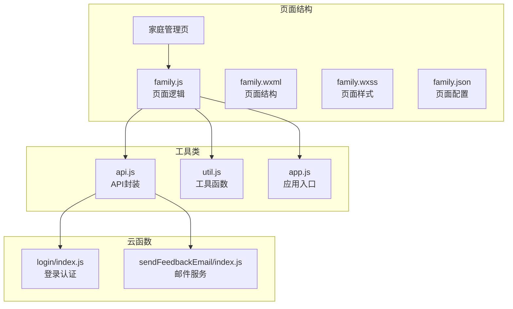

**图表来源**
- [family.js:1-757](file://miniprogram/pages/family/family.js#L1-L757)
- [api.js:1-879](file://miniprogram/utils/api.js#L1-L879)

**章节来源**
- [family.js:1-757](file://miniprogram/pages/family/family.js#L1-L757)
- [family.json:1-5](file://miniprogram/pages/family/family.json#L1-L5)

## 核心组件

### 数据模型

系统采用层次化的数据模型来管理家庭协作：

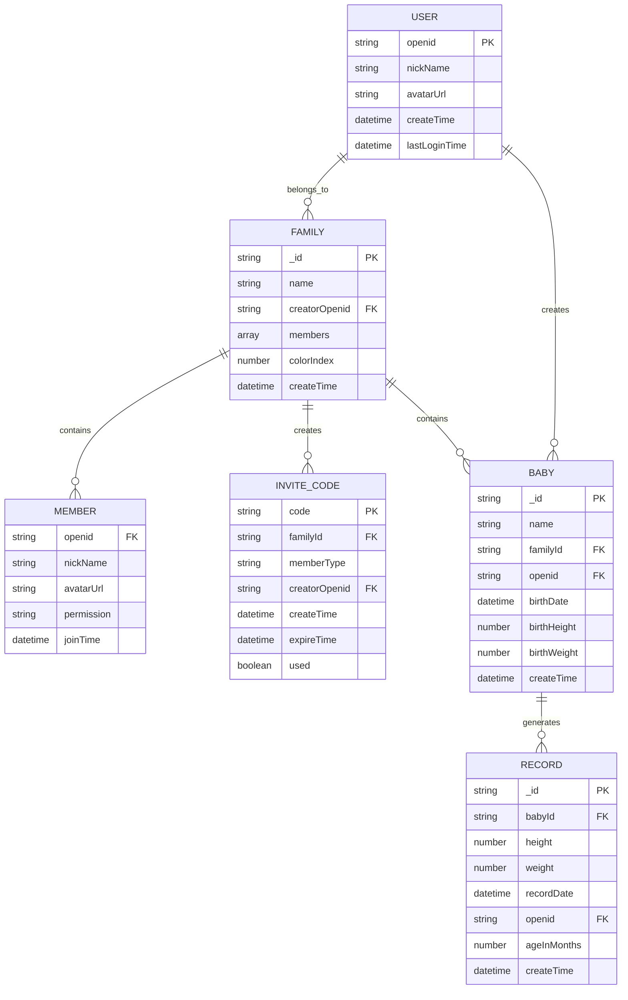

**图表来源**
- [login/index.js:94-151](file://cloudfunctions/login/index.js#L94-L151)
- [login/index.js:268-371](file://cloudfunctions/login/index.js#L268-L371)

### 权限体系

系统实现了三级权限管理体系：

| 权限级别 | 角色名称 | 权限描述 | 操作范围 |
|---------|----------|----------|----------|
| guardian | 一级助教 | 最高权限 | 创建/删除家庭、管理成员、修改家庭信息、删除宝宝 |
| caretaker | 二级助教 | 管理权限 | 添加宝宝身高体重数据、查看数据 |
| viewer | 围观吃瓜 | 只读权限 | 仅能查看宝宝数据 |

**章节来源**
- [family.js:54-61](file://miniprogram/pages/family/family.js#L54-L61)
- [family.wxml:100-115](file://miniprogram/pages/family/family.wxml#L100-L115)

## 架构概览

### 整体架构

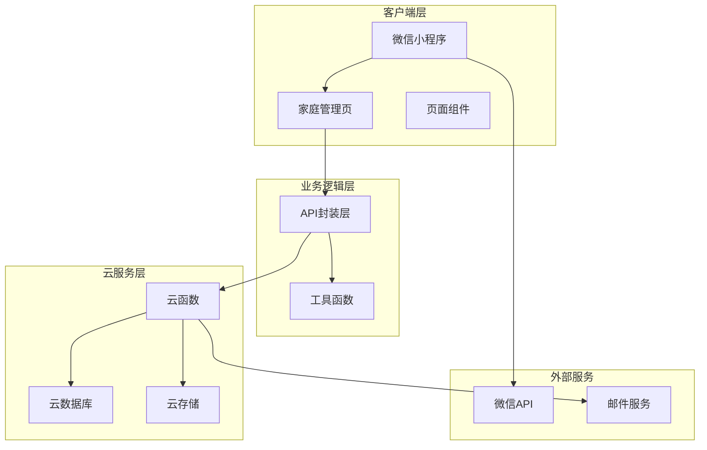

**图表来源**
- [app.js:1-56](file://miniprogram/app.js#L1-L56)
- [api.js:1-879](file://miniprogram/utils/api.js#L1-L879)

### 数据流架构

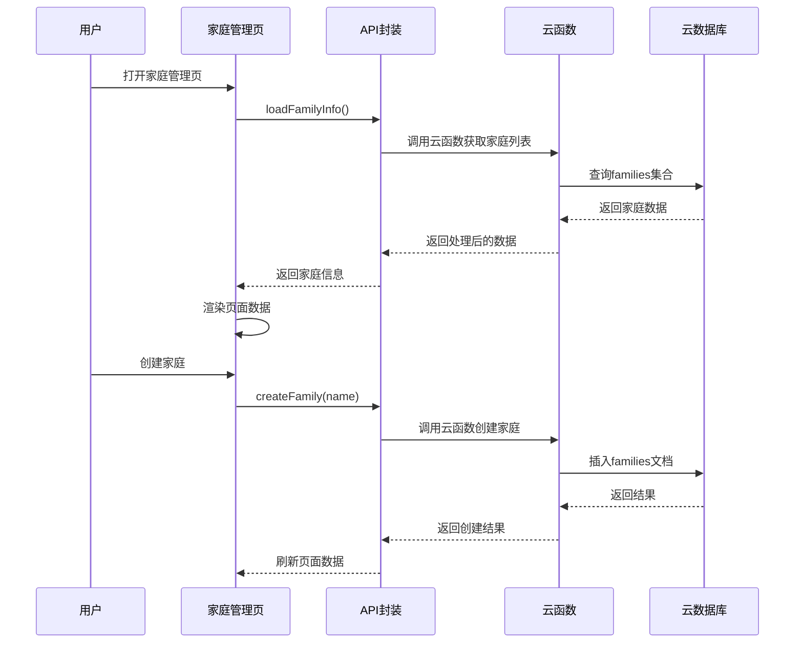

**图表来源**
- [family.js:33-80](file://miniprogram/pages/family/family.js#L33-L80)
- [api.js:498-529](file://miniprogram/utils/api.js#L498-L529)
- [login/index.js:94-151](file://cloudfunctions/login/index.js#L94-L151)

**章节来源**
- [family.js:1-757](file://miniprogram/pages/family/family.js#L1-L757)
- [api.js:1-879](file://miniprogram/utils/api.js#L1-L879)

## 详细组件分析

### 页面渲染组件

#### 头部信息组件

头部组件展示了用户的基本信息和家庭角色：

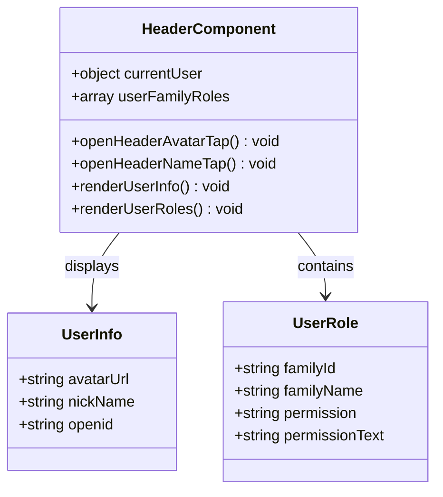

**图表来源**
- [family.wxml:3-29](file://miniprogram/pages/family/family.wxml#L3-L29)
- [family.js:5-27](file://miniprogram/pages/family/family.js#L5-L27)

#### 家庭卡片组件

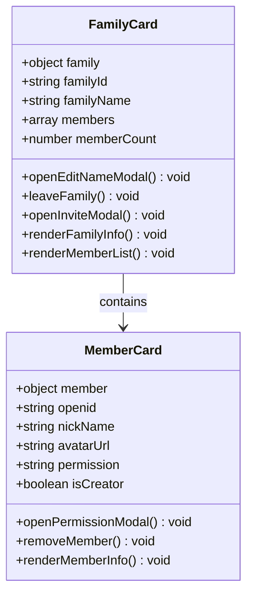

**图表来源**
- [family.wxml:57-95](file://miniprogram/pages/family/family.wxml#L57-L95)
- [family.js:76-93](file://miniprogram/pages/family/family.js#L76-L93)

**章节来源**
- [family.wxml:1-356](file://miniprogram/pages/family/family.wxml#L1-L356)
- [family.js:1-757](file://miniprogram/pages/family/family.js#L1-L757)

### 业务逻辑组件

#### 家庭管理逻辑

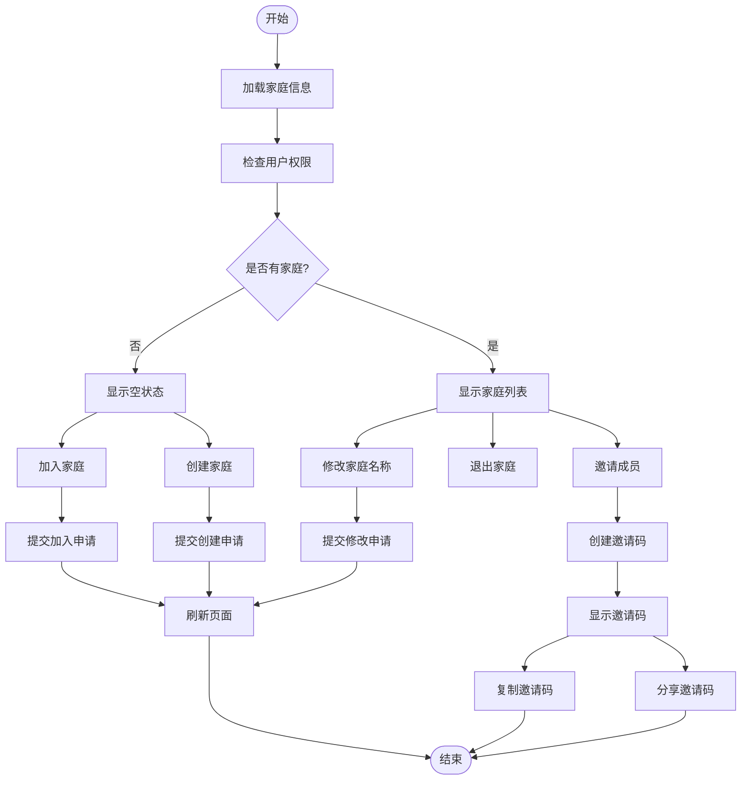

**图表来源**
- [family.js:29-80](file://miniprogram/pages/family/family.js#L29-L80)
- [family.js:580-624](file://miniprogram/pages/family/family.js#L580-L624)

#### 成员权限管理

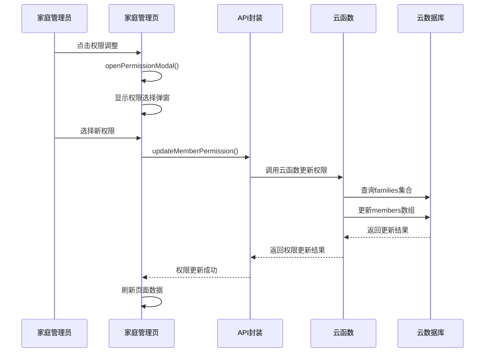

**图表来源**
- [family.js:511-549](file://miniprogram/pages/family/family.js#L511-L549)
- [api.js:717-750](file://miniprogram/utils/api.js#L717-L750)
- [login/index.js:186-226](file://cloudfunctions/login/index.js#L186-L226)

**章节来源**
- [family.js:511-549](file://miniprogram/pages/family/family.js#L511-L549)
- [api.js:717-750](file://miniprogram/utils/api.js#L717-L750)

### 邀请系统组件

#### 邀请码生成流程

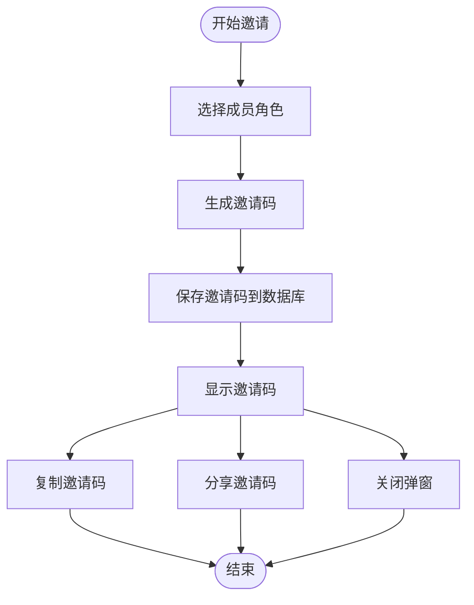

**图表来源**
- [family.js:237-257](file://miniprogram/pages/family/family.js#L237-L257)
- [api.js:531-563](file://miniprogram/utils/api.js#L531-L563)
- [login/index.js:658-699](file://cloudfunctions/login/index.js#L658-L699)

#### 成员加入流程

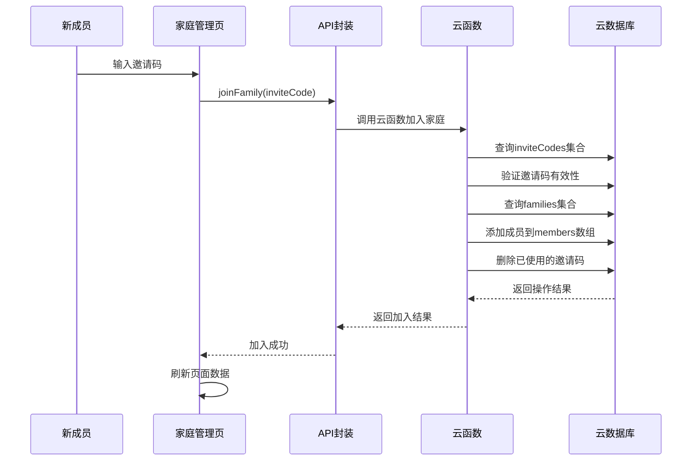

**图表来源**
- [family.js:600-624](file://miniprogram/pages/family/family.js#L600-L624)
- [api.js:565-624](file://miniprogram/utils/api.js#L565-L624)
- [login/index.js:268-371](file://cloudfunctions/login/index.js#L268-L371)

**章节来源**
- [family.js:237-257](file://miniprogram/pages/family/family.js#L237-L257)
- [api.js:531-563](file://miniprogram/utils/api.js#L531-L563)

### 数据验证组件

#### 表单验证机制

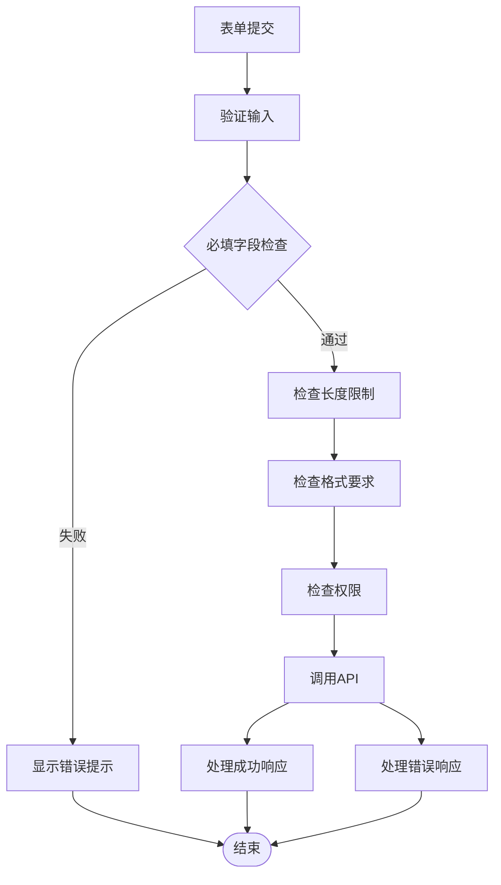

**图表来源**
- [family.js:102-130](file://miniprogram/pages/family/family.js#L102-L130)
- [family.js:200-228](file://miniprogram/pages/family/family.js#L200-L228)
- [family.js:468-509](file://miniprogram/pages/family/family.js#L468-L509)

**章节来源**
- [family.js:102-130](file://miniprogram/pages/family/family.js#L102-L130)
- [family.js:200-228](file://miniprogram/pages/family/family.js#L200-L228)

## 依赖关系分析

### 前端依赖关系

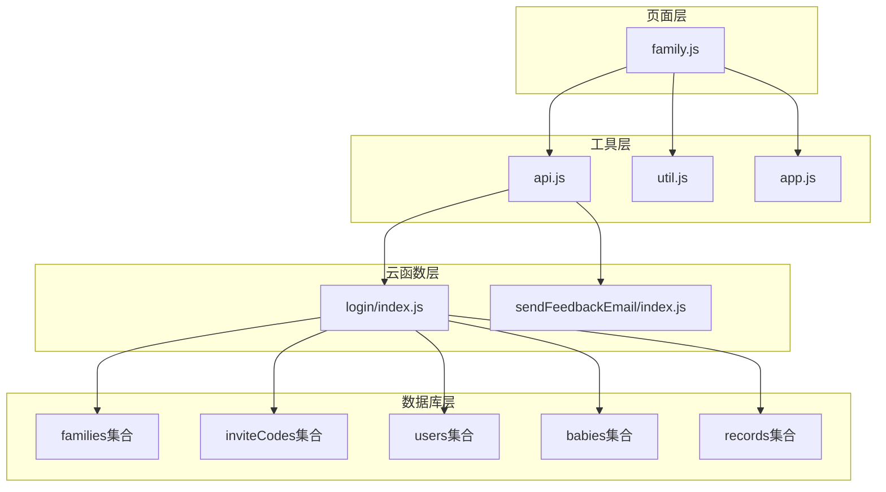

**图表来源**
- [family.js:1-2](file://miniprogram/pages/family/family.js#L1-L2)
- [api.js:1-4](file://miniprogram/utils/api.js#L1-L4)
- [login/index.js:8-9](file://cloudfunctions/login/index.js#L8-L9)

### 权限依赖关系

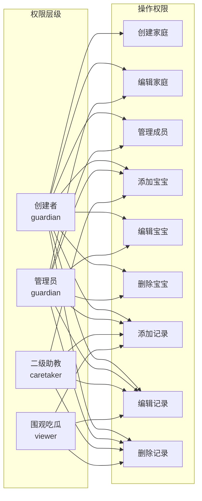

**图表来源**
- [login/index.js:170-225](file://cloudfunctions/login/index.js#L170-L225)
- [login/index.js:482-554](file://cloudfunctions/login/index.js#L482-L554)

**章节来源**
- [login/index.js:170-225](file://cloudfunctions/login/index.js#L170-L225)
- [login/index.js:482-554](file://cloudfunctions/login/index.js#L482-L554)

## 性能考虑

### 数据加载优化

系统采用了多层缓存策略来优化性能：

1. **前端缓存**: 页面数据在内存中缓存，避免重复请求
2. **云函数缓存**: 对常用查询结果进行缓存
3. **数据库索引**: 在关键字段上建立索引提高查询效率

### 并发控制

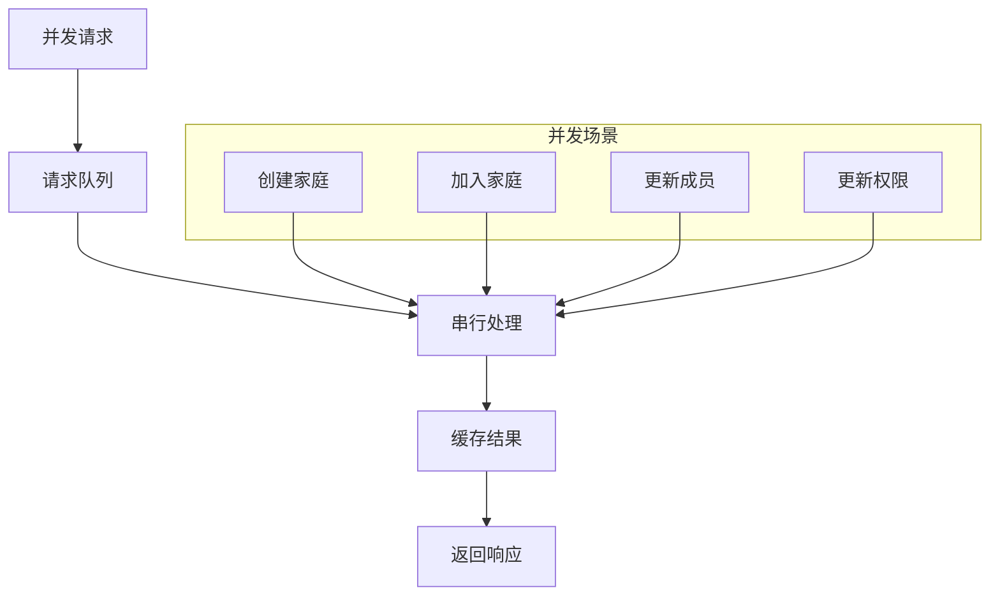

### 错误处理策略

系统实现了多层次的错误处理机制：

1. **前端错误处理**: 用户友好的错误提示
2. **网络错误处理**: 自动重试机制
3. **数据库错误处理**: 事务回滚保证数据一致性
4. **云函数错误处理**: 结构化的错误返回

## 故障排除指南

### 常见问题及解决方案

#### 登录问题

**问题**: 用户无法登录
**原因**: 微信登录失败或云函数调用异常
**解决方案**: 
1. 检查微信登录状态
2. 验证云函数环境配置
3. 查看网络连接状态

#### 权限问题

**问题**: 用户权限不足
**原因**: 当前用户权限级别不够
**解决方案**:
1. 检查用户在家庭中的权限
2. 确认操作需要的最低权限级别
3. 联系家庭管理员提升权限

#### 数据同步问题

**问题**: 页面数据不同步
**原因**: 缓存未及时更新
**解决方案**:
1. 手动刷新页面数据
2. 检查网络请求状态
3. 清除本地缓存重新加载

#### 邀请码问题

**问题**: 邀请码无效
**原因**: 邀请码过期或已被使用
**解决方案**:
1. 重新生成邀请码
2. 检查邀请码有效期
3. 确认邀请码状态

**章节来源**
- [family.js:73-80](file://miniprogram/pages/family/family.js#L73-L80)
- [api.js:13-41](file://miniprogram/utils/api.js#L13-L41)

## 结论

家庭管理页是一个功能完整、架构清晰的家庭协作管理系统。系统通过合理的权限设计、完善的错误处理和良好的用户体验，为用户提供了一个便捷的家庭管理平台。

### 主要优势

1. **权限控制严格**: 三级权限体系确保了数据安全
2. **用户体验友好**: 直观的界面设计和流畅的操作流程
3. **扩展性强**: 模块化设计便于功能扩展
4. **性能稳定**: 多层缓存和优化策略保证了系统性能

### 改进建议

1. **增加操作历史**: 记录重要操作的历史信息
2. **增强通知机制**: 实时推送重要的家庭动态
3. **优化移动端体验**: 针对不同设备优化界面布局
4. **增加数据备份**: 提供数据备份和恢复功能

该系统为家庭协作提供了坚实的技术基础，能够满足用户在家庭管理方面的需求，并为未来的功能扩展奠定了良好的技术基础。