# 记录添加页

<cite>
**本文档引用的文件**
- [record-add.js](file://miniprogram/pages/record-add/record-add.js)
- [record-add.json](file://miniprogram/pages/record-add/record-add.json)
- [record-add.wxml](file://miniprogram/pages/record-add/record-add.wxml)
- [record-add.wxss](file://miniprogram/pages/record-add/record-add.wxss)
- [api.js](file://miniprogram/utils/api.js)
- [util.js](file://miniprogram/utils/util.js)
- [app.js](file://miniprogram/app.js)
- [index.js](file://cloudfunctions/login/index.js)
- [package.json](file://cloudfunctions/login/package.json)
</cite>

## 目录
1. [简介](#简介)
2. [项目结构](#项目结构)
3. [核心组件](#核心组件)
4. [架构概览](#架构概览)
5. [详细组件分析](#详细组件分析)
6. [依赖关系分析](#依赖关系分析)
7. [性能考虑](#性能考虑)
8. [故障排除指南](#故障排除指南)
9. [结论](#结论)

## 简介

记录添加页是宝宝助手小程序中的核心功能模块，用于记录宝宝的身高体重数据。该页面提供了直观的表单界面，支持实时数据验证、智能年龄计算、权限控制和云端数据存储等功能。用户可以通过简单的操作完成宝宝成长记录的录入，系统会自动进行数据验证和权限检查，确保数据的准确性和安全性。

## 项目结构

记录添加页位于小程序的页面目录结构中，采用标准的微信小程序页面组织方式：

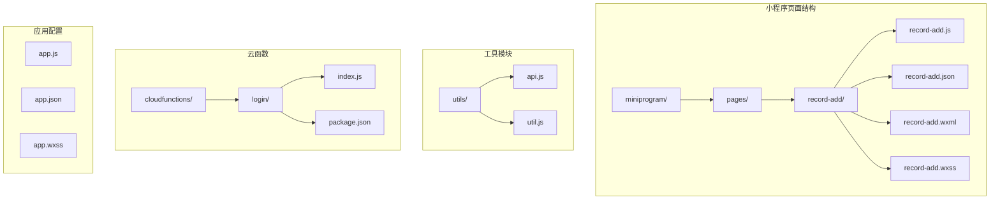

**图表来源**
- [record-add.js:1-118](file://miniprogram/pages/record-add/record-add.js#L1-L118)
- [api.js:1-879](file://miniprogram/utils/api.js#L1-L879)
- [util.js:1-55](file://miniprogram/utils/util.js#L1-L55)

**章节来源**
- [record-add.js:1-118](file://miniprogram/pages/record-add/record-add.js#L1-L118)
- [record-add.json:1-5](file://miniprogram/pages/record-add/record-add.json#L1-L5)
- [record-add.wxml:1-33](file://miniprogram/pages/record-add/record-add.wxml#L1-L33)

## 核心组件

记录添加页由多个核心组件协同工作，形成完整的数据录入和处理流程：

### 页面组件层次结构

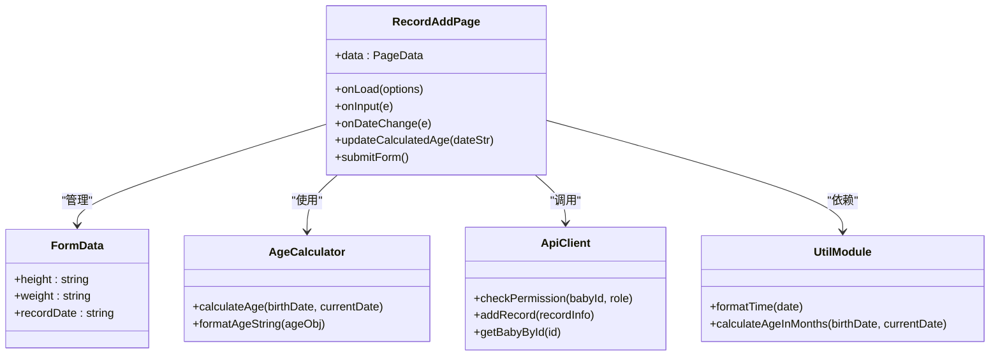

**图表来源**
- [record-add.js:5-118](file://miniprogram/pages/record-add/record-add.js#L5-L118)
- [api.js:299-346](file://miniprogram/utils/api.js#L299-L346)
- [util.js:8-47](file://miniprogram/utils/util.js#L8-L47)

### 数据流架构

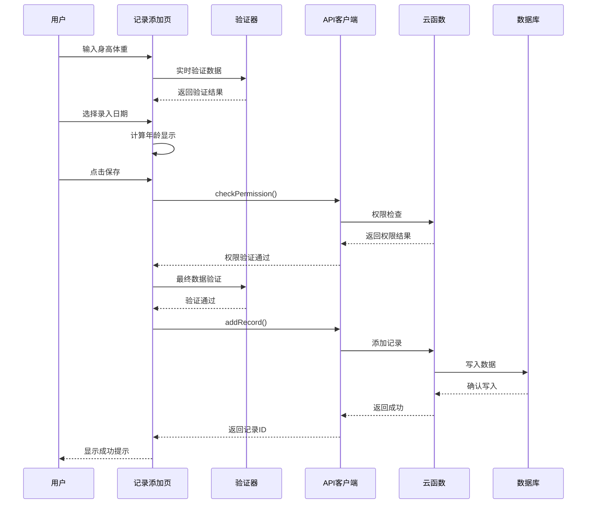

**图表来源**
- [record-add.js:71-116](file://miniprogram/pages/record-add/record-add.js#L71-L116)
- [api.js:299-346](file://miniprogram/utils/api.js#L299-L346)
- [index.js:556-636](file://cloudfunctions/login/index.js#L556-L636)

**章节来源**
- [record-add.js:1-118](file://miniprogram/pages/record-add/record-add.js#L1-L118)
- [api.js:299-346](file://miniprogram/utils/api.js#L299-L346)

## 架构概览

记录添加页采用了分层架构设计，将业务逻辑、数据访问和界面展示分离：

### 整体架构图

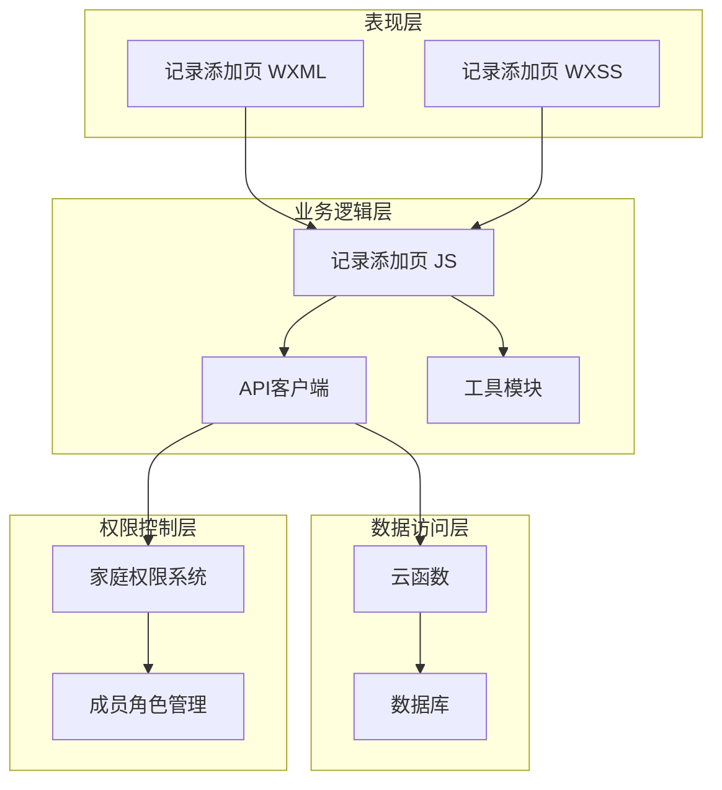

**图表来源**
- [record-add.js:1-118](file://miniprogram/pages/record-add/record-add.js#L1-L118)
- [api.js:782-800](file://miniprogram/utils/api.js#L782-L800)
- [index.js:28-92](file://cloudfunctions/login/index.js#L28-L92)

### 数据模型

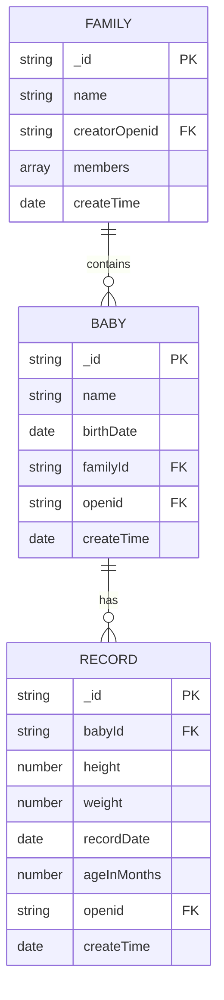

**图表来源**
- [api.js:300-346](file://miniprogram/utils/api.js#L300-L346)
- [index.js:556-636](file://cloudfunctions/login/index.js#L556-L636)

## 详细组件分析

### 表单数据处理组件

记录添加页的核心功能是表单数据处理，包括输入验证、格式转换和错误处理：

#### 表单字段定义

| 字段名 | 类型 | 验证规则 | 描述 |
|--------|------|----------|------|
| height | 数字 | 必填、正数、有效范围 | 宝宝身高，单位：厘米 |
| weight | 数字 | 必填、正数、有效范围 | 宝宝体重，单位：千克 |
| recordDate | 日期 | 必填、不早于出生日期 | 录入记录的日期 |

#### 数据验证流程

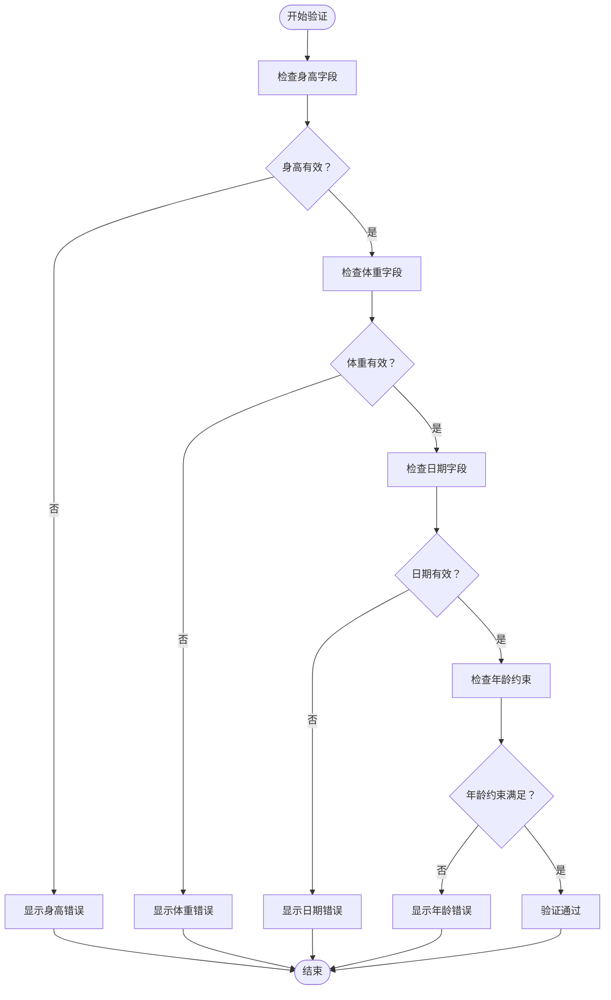

**图表来源**
- [record-add.js:78-92](file://miniprogram/pages/record-add/record-add.js#L78-L92)

#### 数据格式化处理

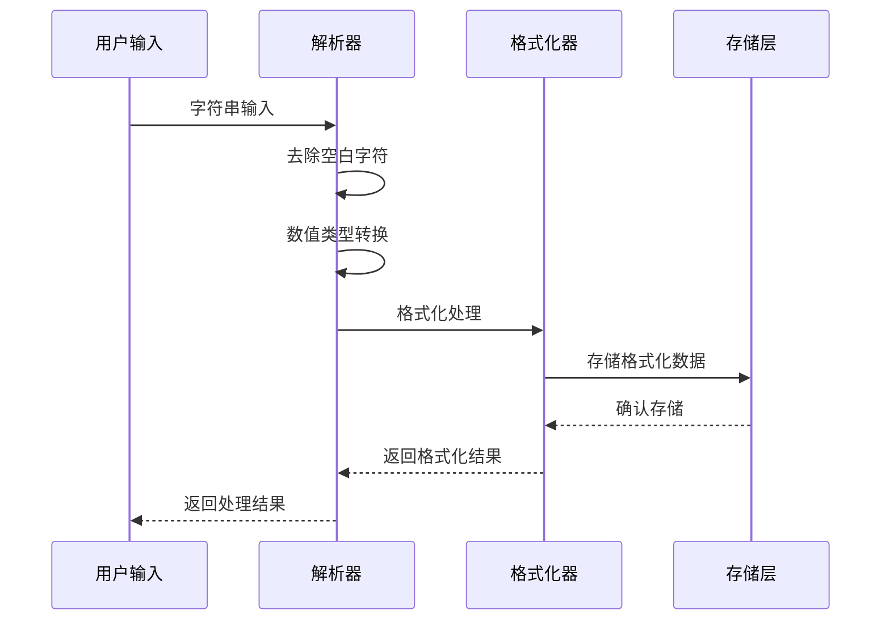

**图表来源**
- [record-add.js:94-99](file://miniprogram/pages/record-add/record-add.js#L94-L99)
- [util.js:1-6](file://miniprogram/utils/util.js#L1-L6)

**章节来源**
- [record-add.js:71-116](file://miniprogram/pages/record-add/record-add.js#L71-L116)
- [util.js:1-55](file://miniprogram/utils/util.js#L1-L55)

### 权限控制系统

系统实现了基于家庭的权限控制机制，确保只有授权用户才能添加记录：

#### 权限层级结构

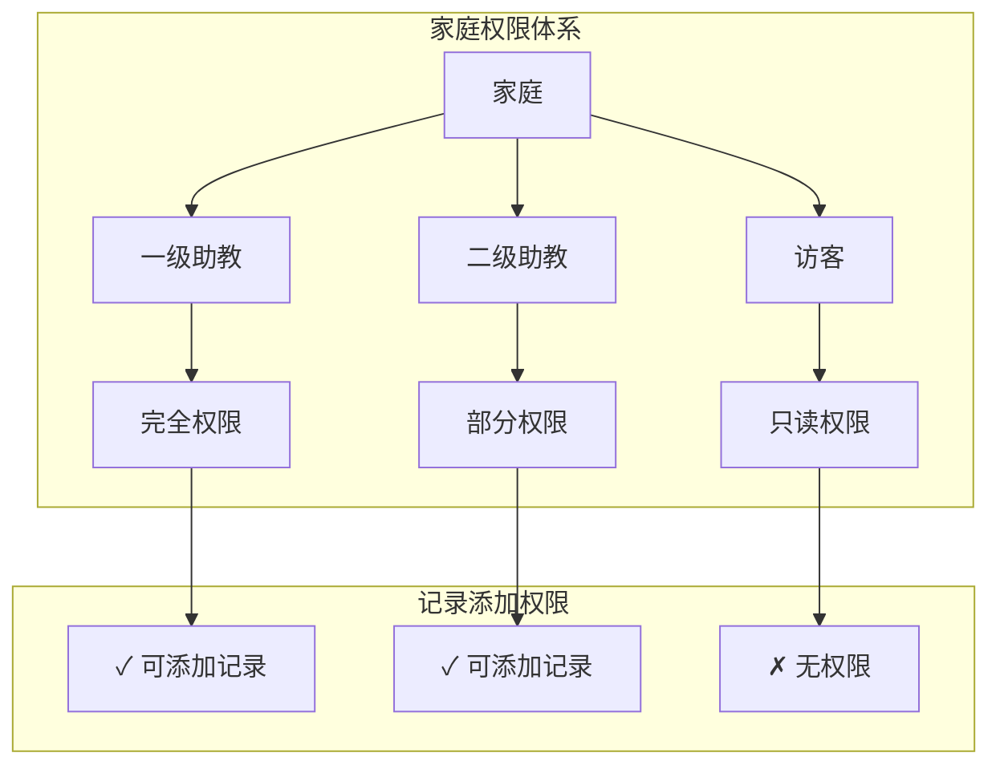

**图表来源**
- [api.js:782-800](file://miniprogram/utils/api.js#L782-L800)
- [index.js:186-225](file://cloudfunctions/login/index.js#L186-L225)

#### 权限检查流程

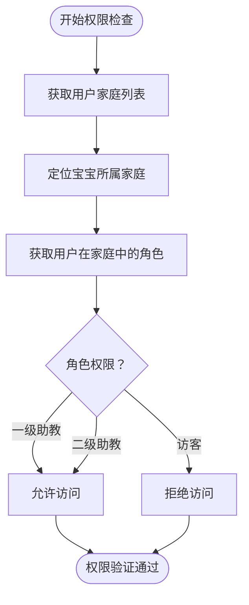

**图表来源**
- [record-add.js:73-76](file://miniprogram/pages/record-add/record-add.js#L73-L76)
- [api.js:782-800](file://miniprogram/utils/api.js#L782-L800)

**章节来源**
- [record-add.js:71-76](file://miniprogram/pages/record-add/record-add.js#L71-L76)
- [api.js:782-800](file://miniprogram/utils/api.js#L782-L800)

### 年龄计算与显示组件

系统提供了智能的年龄计算功能，根据录入日期自动计算宝宝的当前年龄：

#### 年龄计算算法

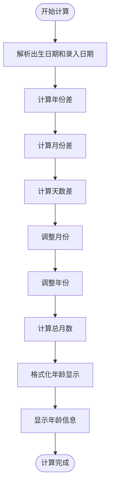

**图表来源**
- [util.js:8-28](file://miniprogram/utils/util.js#L8-L28)
- [util.js:30-38](file://miniprogram/utils/util.js#L30-L38)

#### 年龄显示格式

| 年龄范围 | 显示格式 | 示例 |
|----------|----------|------|
| 刚出生 | 刚出生 | 刚出生 |
| 0-1岁 | X岁X月X天 | 1岁2月5天 |
| 1-10岁 | X岁X月 | 2岁6月 |
| 10岁以上 | X岁 | 15岁 |

**章节来源**
- [util.js:8-47](file://miniprogram/utils/util.js#L8-L47)
- [record-add.js:56-69](file://miniprogram/pages/record-add/record-add.js#L56-L69)

### 数据存储与同步机制

记录添加页的数据存储采用了云端数据库和本地状态管理相结合的方式：

#### 数据存储流程

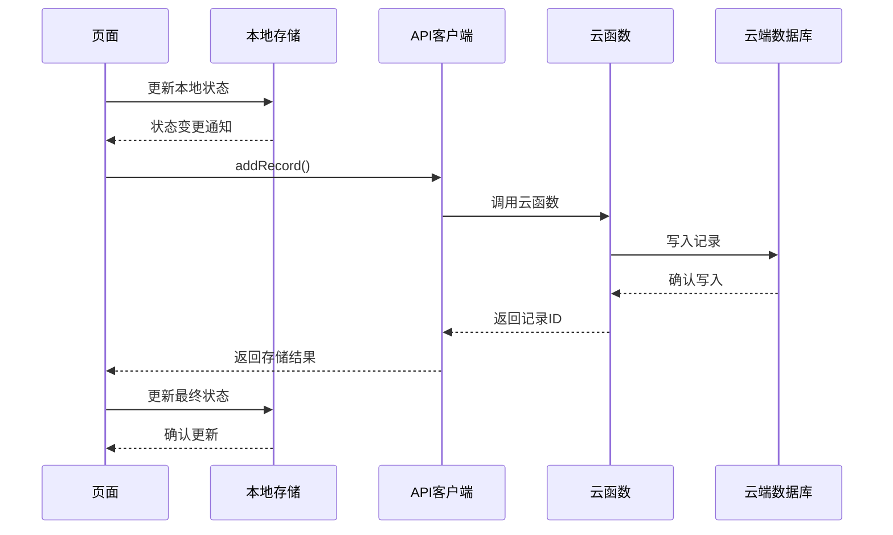

**图表来源**
- [record-add.js:94-109](file://miniprogram/pages/record-add/record-add.js#L94-L109)
- [api.js:299-346](file://miniprogram/utils/api.js#L299-L346)

#### 错误处理策略

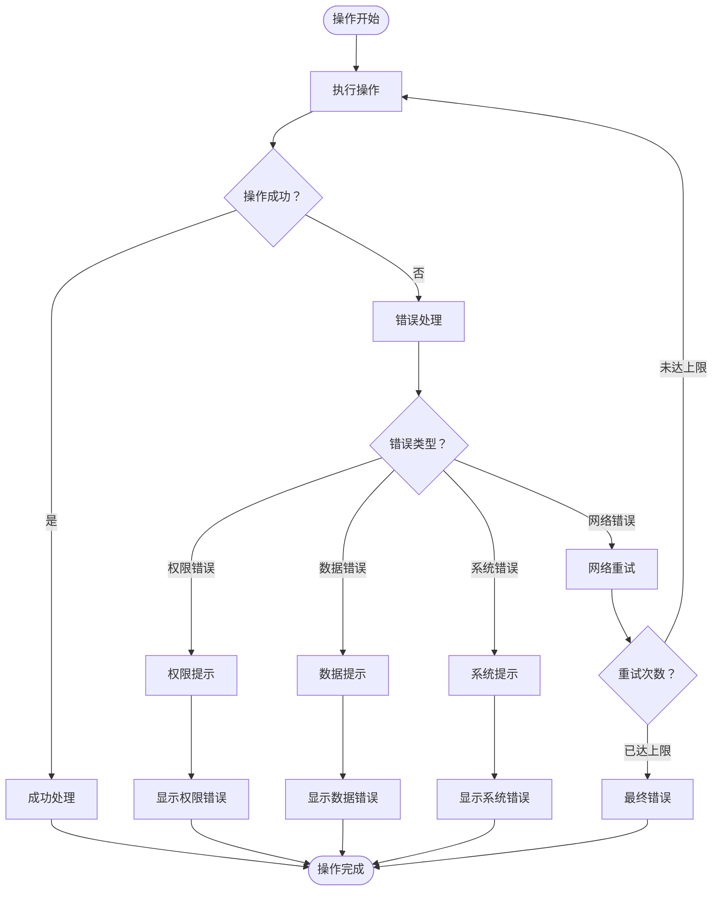

**图表来源**
- [record-add.js:110-116](file://miniprogram/pages/record-add/record-add.js#L110-L116)

**章节来源**
- [record-add.js:94-116](file://miniprogram/pages/record-add/record-add.js#L94-L116)
- [api.js:299-346](file://miniprogram/utils/api.js#L299-L346)

## 依赖关系分析

记录添加页的依赖关系相对简单但功能完整，主要依赖于工具模块和云服务：

### 组件依赖图

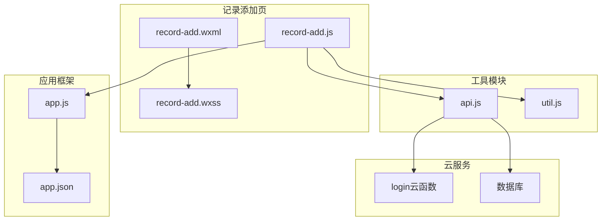

**图表来源**
- [record-add.js:1-3](file://miniprogram/pages/record-add/record-add.js#L1-L3)
- [api.js:1-11](file://miniprogram/utils/api.js#L1-L11)
- [app.js:1-56](file://miniprogram/app.js#L1-L56)

### 外部依赖分析

| 依赖项 | 版本 | 用途 | 安全性 |
|--------|------|------|--------|
| wx-server-sdk | latest | 云函数开发 | 官方SDK |
| 微信小程序API | v2 | 基础功能 | 平台保证 |
| 云端数据库 | 云开发 | 数据存储 | 平台保证 |

**章节来源**
- [package.json:12-14](file://cloudfunctions/login/package.json#L12-L14)
- [app.js:8-16](file://miniprogram/app.js#L8-L16)

## 性能考虑

记录添加页在设计时充分考虑了性能优化，采用多种策略提升用户体验：

### 性能优化策略

1. **懒加载机制**：页面按需加载，减少初始加载时间
2. **缓存策略**：合理使用本地缓存，避免重复请求
3. **异步处理**：所有网络请求采用异步方式，不阻塞UI线程
4. **内存管理**：及时释放不再使用的数据和事件监听器

### 用户体验优化

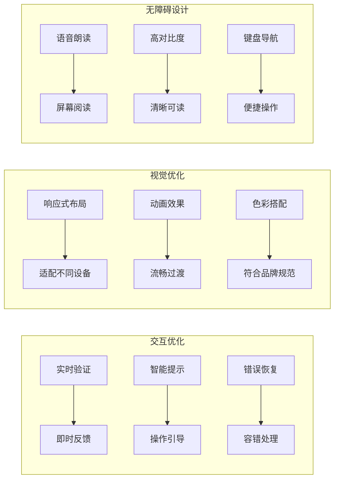

## 故障排除指南

### 常见问题及解决方案

#### 登录相关问题

| 问题描述 | 可能原因 | 解决方案 |
|----------|----------|----------|
| 登录超时 | 网络延迟或服务器繁忙 | 重试登录，检查网络连接 |
| 权限不足 | 用户角色不正确 | 检查家庭成员身份，联系管理员 |
| 会话过期 | 长时间未操作 | 自动重新登录，刷新页面 |

#### 数据录入问题

| 问题描述 | 可能原因 | 解决方案 |
|----------|----------|----------|
| 输入验证失败 | 数据格式不正确 | 检查输入格式，参考提示信息 |
| 日期选择异常 | 系统时间设置错误 | 检查设备时间设置 |
| 提交失败 | 网络连接中断 | 检查网络状态，重试提交 |

#### 权限控制问题

| 问题描述 | 可能原因 | 解决方案 |
|----------|----------|----------|
| 无法添加记录 | 角色权限不足 | 联系一级助教提升权限 |
| 数据不可见 | 无家庭成员权限 | 加入相应家庭或联系管理员 |
| 操作被拒绝 | 家庭规则限制 | 遵守家庭约定的录入规则 |

**章节来源**
- [record-add.js:31-38](file://miniprogram/pages/record-add/record-add.js#L31-L38)
- [record-add.js:110-116](file://miniprogram/pages/record-add/record-add.js#L110-L116)

## 结论

记录添加页作为宝宝助手小程序的核心功能模块，展现了优秀的架构设计和用户体验。通过合理的分层架构、完善的权限控制、智能的数据验证和流畅的交互设计，为用户提供了可靠的宝宝成长记录管理功能。

### 主要优势

1. **架构清晰**：采用分层设计，职责明确，易于维护和扩展
2. **权限安全**：基于家庭的多层级权限控制，确保数据安全
3. **用户体验**：直观的界面设计，智能的验证和提示机制
4. **数据可靠**：完善的错误处理和数据校验，保证数据完整性
5. **性能优化**：合理的异步处理和缓存策略，提升响应速度

### 技术亮点

- **云端集成**：充分利用微信云开发能力，简化后端开发
- **实时验证**：前端实时数据验证，提升用户体验
- **智能计算**：自动年龄计算，减少用户手动输入
- **错误恢复**：完善的错误处理机制，增强系统稳定性

该记录添加页为类似健康管理类应用提供了良好的技术参考，其设计理念和实现方式值得在其他项目中借鉴和应用。