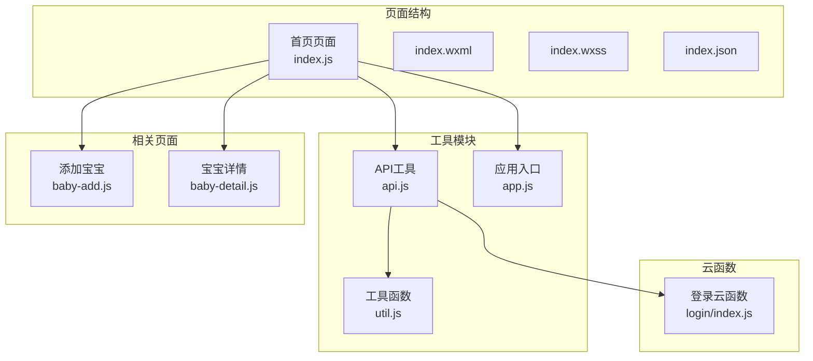
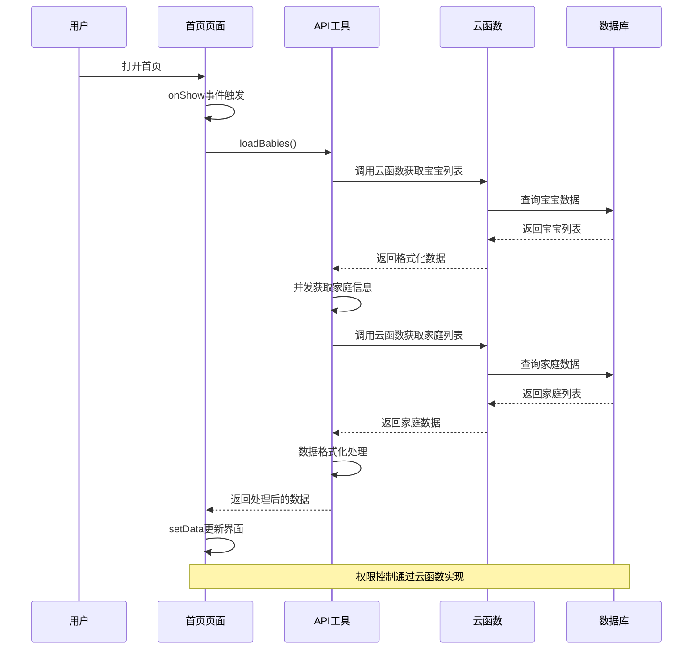
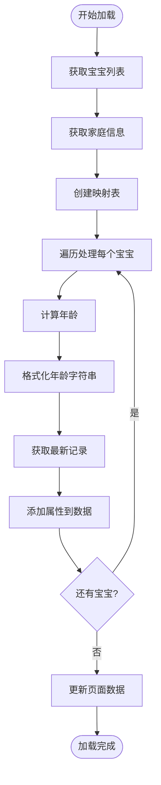
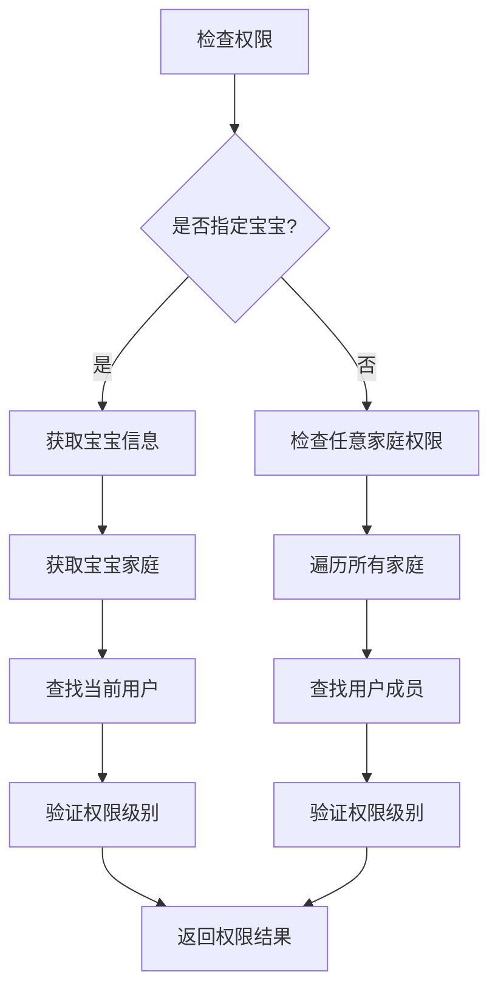
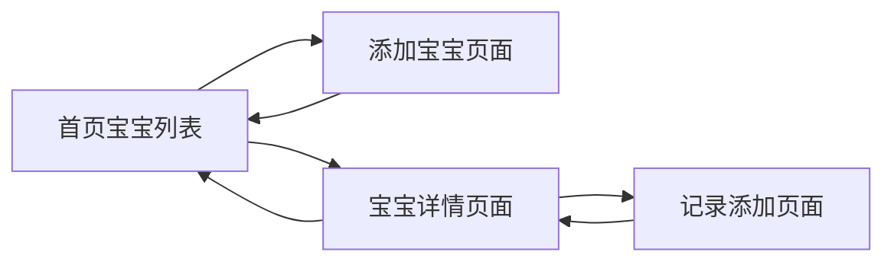
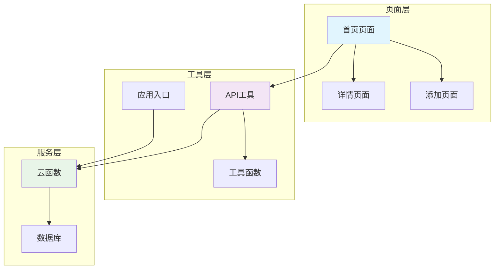

# 首页宝宝列表页

<cite>
**本文档引用的文件**
- [index.js](file://miniprogram/pages/index/index.js)
- [index.json](file://miniprogram/pages/index/index.json)
- [index.wxml](file://miniprogram/pages/index/index.wxml)
- [index.wxss](file://miniprogram/pages/index/index.wxss)
- [api.js](file://miniprogram/utils/api.js)
- [util.js](file://miniprogram/utils/util.js)
- [app.js](file://miniprogram/app.js)
- [login/index.js](file://cloudfunctions/login/index.js)
- [baby-add.js](file://miniprogram/pages/baby-add/baby-add.js)
- [baby-detail.js](file://miniprogram/pages/baby-detail/baby-detail.js)
</cite>

## 目录
1. [简介](#简介)
2. [项目结构](#项目结构)
3. [核心组件](#核心组件)
4. [架构概览](#架构概览)
5. [详细组件分析](#详细组件分析)
6. [依赖关系分析](#依赖关系分析)
7. [性能考虑](#性能考虑)
8. [故障排除指南](#故障排除指南)
9. [结论](#结论)

## 简介

首页宝宝列表页是Baby Assistant小程序的核心界面，负责展示用户家庭中所有宝宝的信息。该页面实现了完整的宝宝数据管理功能，包括数据加载、格式化显示、权限控制、用户交互等核心功能。页面采用响应式设计，支持多种设备屏幕尺寸，并提供了丰富的视觉效果和用户体验优化。

## 项目结构

首页宝宝列表页位于小程序的pages目录下，采用标准的微信小程序页面结构：

**图表来源**
- [index.js:1-144](file://miniprogram/pages/index/index.js#L1-L144)
- [api.js:1-879](file://miniprogram/utils/api.js#L1-L879)
- [util.js:1-55](file://miniprogram/utils/util.js#L1-L55)

**章节来源**
- [index.js:1-144](file://miniprogram/pages/index/index.js#L1-L144)
- [index.json:1-6](file://miniprogram/pages/index/index.json#L1-L6)

## 核心组件

首页宝宝列表页由多个核心组件构成，每个组件都有明确的职责分工：

### 页面生命周期管理
- **onShow事件监听**：页面显示时自动触发数据刷新
- **异步数据加载**：并发获取宝宝列表和家庭信息
- **数据格式化处理**：年龄计算、家庭映射、颜色索引分配

### 数据展示组件
- **宝宝卡片布局**：包含头像、姓名、性别、年龄、家庭标签
- **最新记录显示**：身高、体重等关键指标
- **空状态处理**：无宝宝数据时的引导界面

### 交互控制组件
- **添加宝宝按钮**：权限验证和导航跳转
- **删除功能**：安全确认和权限检查
- **详情导航**：点击进入宝宝详细信息页面

**章节来源**
- [index.js:10-52](file://miniprogram/pages/index/index.js#L10-L52)
- [index.wxml:21-61](file://miniprogram/pages/index/index.wxml#L21-L61)

## 架构概览

首页宝宝列表页采用分层架构设计，实现了清晰的关注点分离：

**图表来源**
- [index.js:14-52](file://miniprogram/pages/index/index.js#L14-L52)
- [api.js:44-75](file://miniprogram/utils/api.js#L44-L75)
- [login/index.js:51-92](file://cloudfunctions/login/index.js#L51-L92)

## 详细组件分析

### 数据加载与格式化组件

#### 宝宝数据加载流程
页面在onShow事件中调用loadBabies方法，该方法实现了完整的数据加载和处理流程：

**图表来源**
- [index.js:14-52](file://miniprogram/pages/index/index.js#L14-L52)

#### 年龄计算与格式化
系统实现了精确的年龄计算算法，支持年、月、日的复合显示：

| 年龄类型 | 计算方式 | 显示格式 |
|---------|---------|---------|
| 刚出生 | 0岁0月0天 | "刚出生" |
| 有年龄 | 年份计算 | "X岁X月X天" |
| 精确计算 | 日期差值 | 自动进位处理 |

**章节来源**
- [index.js:29-30](file://miniprogram/pages/index/index.js#L29-L30)
- [util.js:8-47](file://miniprogram/utils/util.js#L8-L47)

### 权限控制系统

#### 权限级别定义
系统采用三级权限模型，确保数据安全和操作控制：

| 权限级别 | 编号 | 功能权限 | 操作范围 |
|---------|------|---------|---------|
| 观察者 | 1 | 查看 | 仅能查看 |
| 照看者 | 2 | 添加记录 | 可添加记录 |
| 一级助教 | 3 | 完全权限 | 可删除宝宝 |

#### 权限验证流程

**图表来源**
- [api.js:783-851](file://miniprogram/utils/api.js#L783-L851)
- [login/index.js:483-510](file://cloudfunctions/login/index.js#L483-L510)

**章节来源**
- [index.js:66-73](file://miniprogram/pages/index/index.js#L66-L73)
- [index.js:104-111](file://miniprogram/pages/index/index.js#L104-L111)

### 用户交互处理

#### 导航逻辑设计
页面实现了完善的导航体系，支持多层级页面跳转：

#### 交互事件处理
- **点击卡片**：跳转到宝宝详情页面
- **长按删除**：弹出确认对话框
- **添加按钮**：检查权限后跳转
- **空状态**：引导用户添加第一个宝宝

**章节来源**
- [index.js:94-99](file://miniprogram/pages/index/index.js#L94-L99)
- [index.js:101-142](file://miniprogram/pages/index/index.js#L101-L142)

### 错误处理与用户体验

#### 错误处理策略
系统实现了多层次的错误处理机制：

| 错误类型 | 处理方式 | 用户反馈 |
|---------|---------|---------|
| 网络请求失败 | 控制台记录 + Toast提示 | "加载失败，请重试" |
| 权限不足 | 明确权限要求 | "只有一级助教才可以..." |
| 参数验证失败 | 即时阻止操作 | 具体的输入提示 |
| 业务逻辑异常 | 云端事务保证 | 统一的错误消息 |

#### 用户体验优化
- **加载状态**：异步加载避免界面卡顿
- **空状态**：友好的引导界面
- **动画效果**：平滑的过渡动画
- **响应式设计**：适配不同屏幕尺寸

**章节来源**
- [index.js:45-51](file://miniprogram/pages/index/index.js#L45-L51)
- [index.js:56-73](file://miniprogram/pages/index/index.js#L56-L73)

## 依赖关系分析

首页宝宝列表页的依赖关系体现了清晰的模块化设计：

**图表来源**
- [index.js:1-5](file://miniprogram/pages/index/index.js#L1-L5)
- [api.js:1-11](file://miniprogram/utils/api.js#L1-L11)
- [app.js:1-56](file://miniprogram/app.js#L1-L56)

**章节来源**
- [api.js:1-879](file://miniprogram/utils/api.js#L1-L879)
- [login/index.js:1-814](file://cloudfunctions/login/index.js#L1-L814)

## 性能考虑

### 数据加载优化
- **并发请求**：同时获取宝宝列表和家庭信息，减少总等待时间
- **缓存策略**：利用云函数缓存用户信息，避免重复查询
- **懒加载**：详情页面按需加载图表数据

### 内存管理
- **及时释放**：页面卸载时清理定时器和事件监听
- **数据复用**：复用已有的API调用结果
- **图片优化**：统一的头像尺寸和格式

### 网络优化
- **错误重试**：网络失败时自动重试机制
- **超时控制**：合理的请求超时设置
- **离线处理**：网络异常时的降级处理

## 故障排除指南

### 常见问题诊断

#### 登录状态异常
**症状**：页面无法加载数据
**排查步骤**：
1. 检查App.js中的登录初始化
2. 验证云函数调用是否成功
3. 确认用户信息存储状态

#### 权限验证失败
**症状**：添加/删除功能不可用
**排查步骤**：
1. 检查用户在家庭中的权限级别
2. 验证云函数权限判断逻辑
3. 确认家庭成员列表完整性

#### 数据显示异常
**症状**：年龄显示不正确或为空
**排查步骤**：
1. 检查生日字段格式
2. 验证年龄计算函数
3. 确认数据格式化流程

**章节来源**
- [app.js:23-54](file://miniprogram/app.js#L23-L54)
- [api.js:14-41](file://miniprogram/utils/api.js#L14-L41)
- [util.js:8-28](file://miniprogram/utils/util.js#L8-L28)

### 调试技巧

#### 开发者工具使用
- **Network面板**：监控API请求和响应
- **Console面板**：查看错误日志和调试信息
- **Storage面板**：检查本地存储状态

#### 日志记录策略
- **关键路径日志**：记录重要的业务流程
- **错误捕获**：统一的异常处理和记录
- **性能监控**：关键操作的耗时统计

## 结论

首页宝宝列表页是一个功能完整、架构清晰的小程序页面。它成功地实现了以下目标：

### 技术成就
- **完整的权限控制**：基于云函数的三层权限模型
- **优雅的数据处理**：年龄计算、格式化、映射等复杂逻辑
- **良好的用户体验**：响应式设计、流畅动画、友好的错误提示

### 设计亮点
- **模块化架构**：清晰的职责分离和依赖关系
- **安全性保障**：云端事务和权限验证双重保护
- **性能优化**：并发请求、缓存策略、懒加载等技术

### 改进建议
- **国际化支持**：添加多语言切换功能
- **无障碍访问**：提升残障用户的使用体验
- **数据同步**：实现实时数据更新机制

该页面为Baby Assistant小程序奠定了坚实的基础，展现了现代小程序开发的最佳实践。