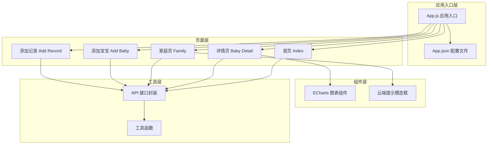
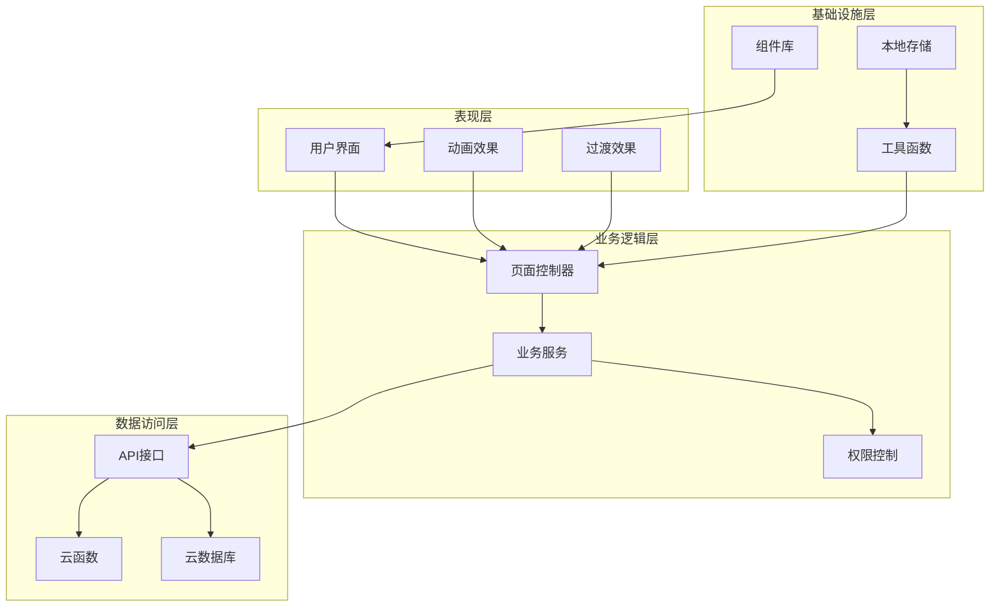
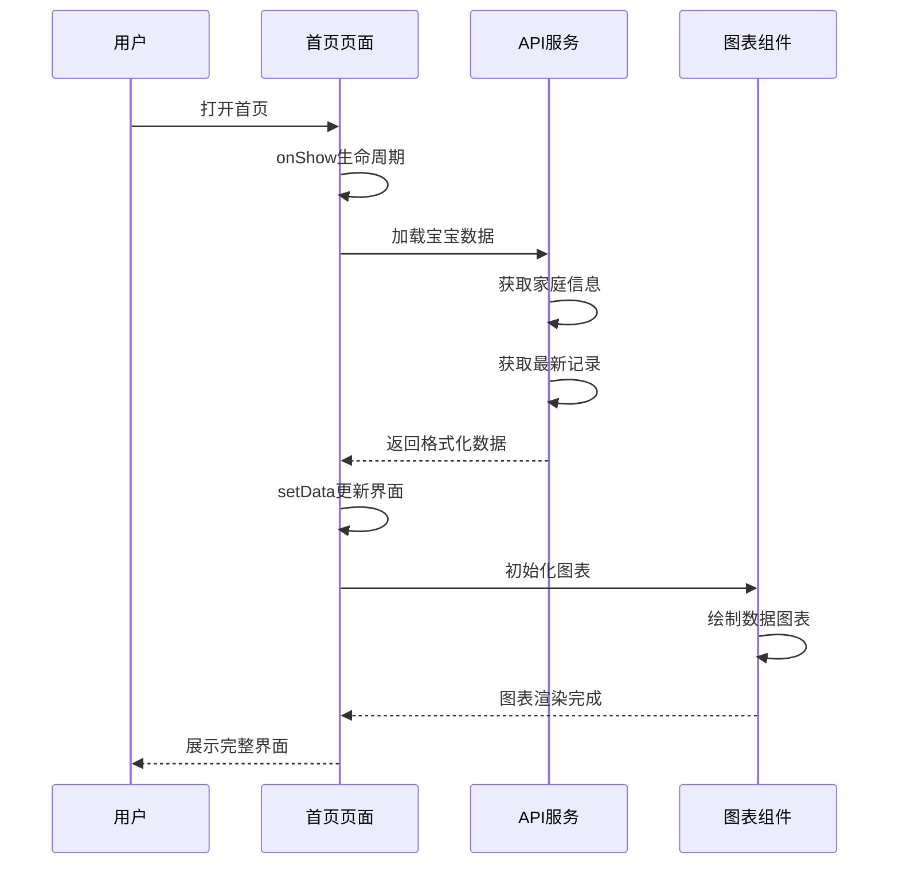
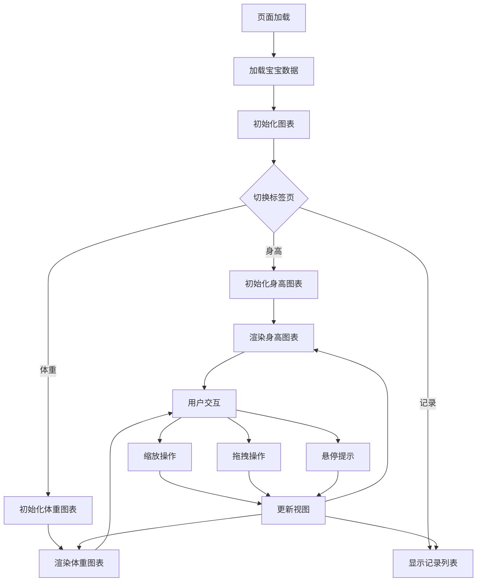
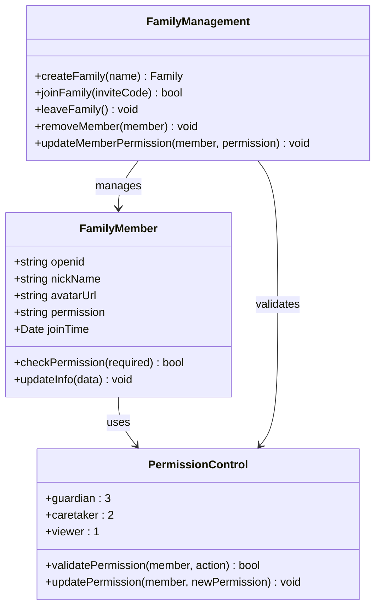
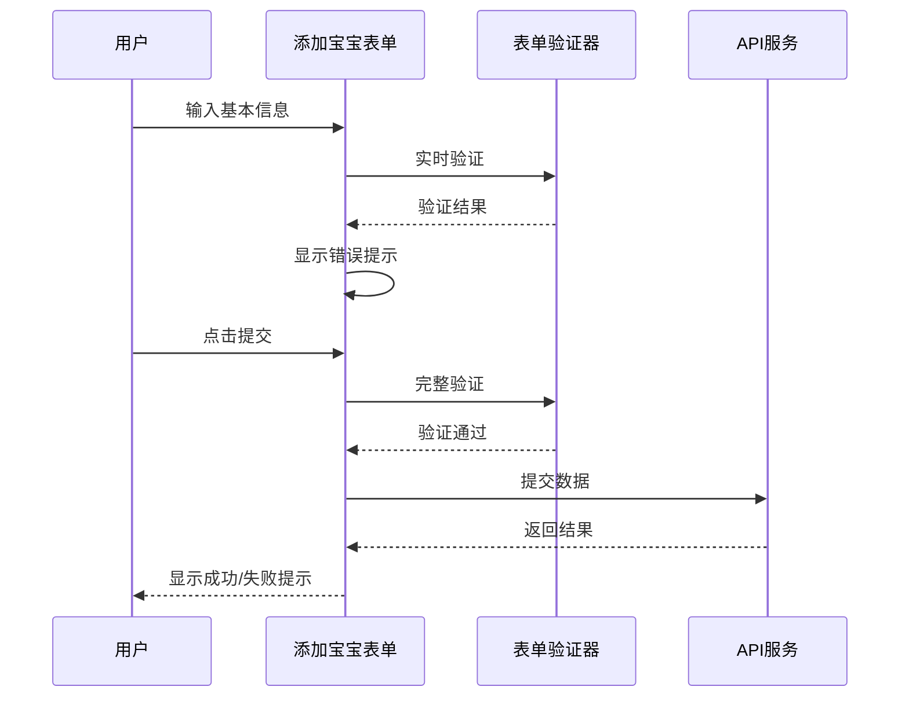
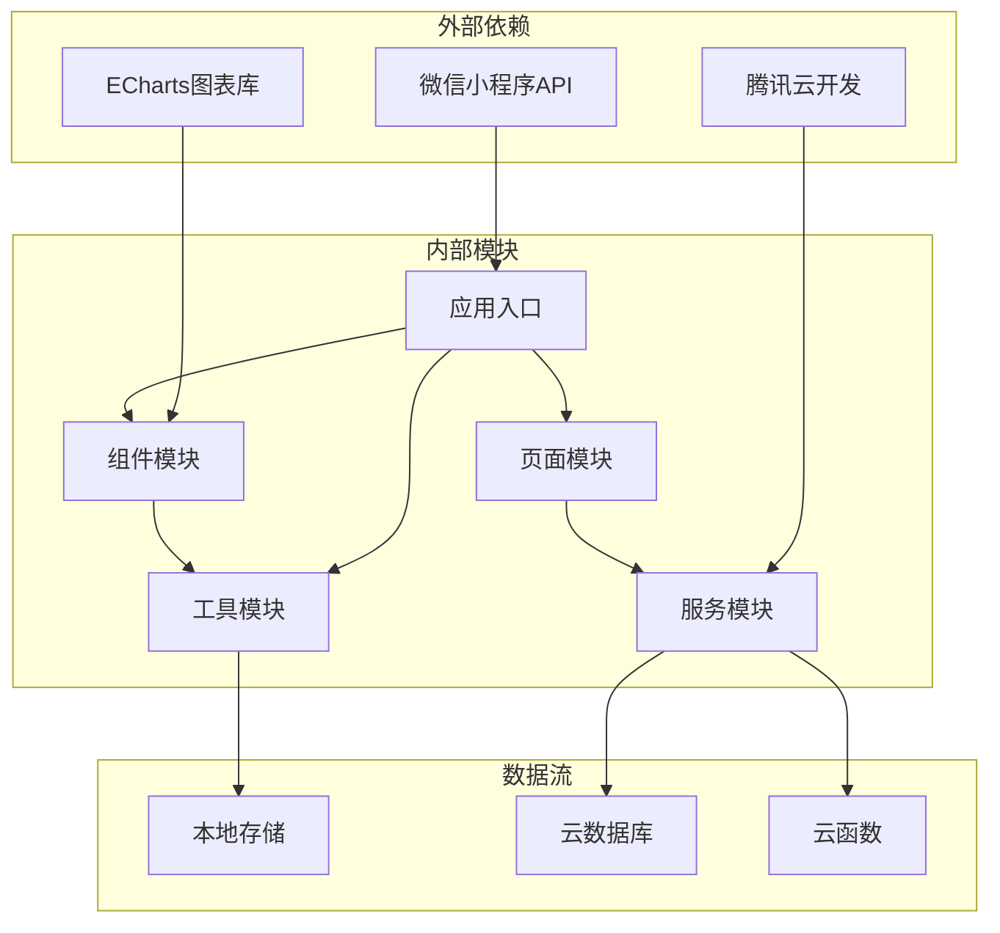
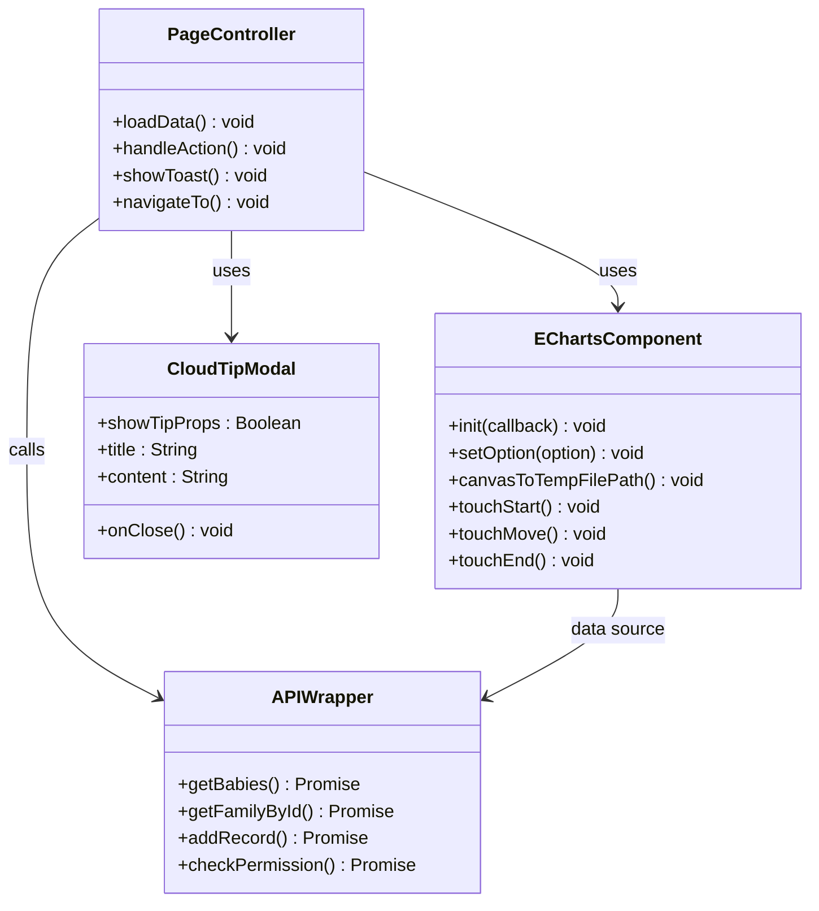
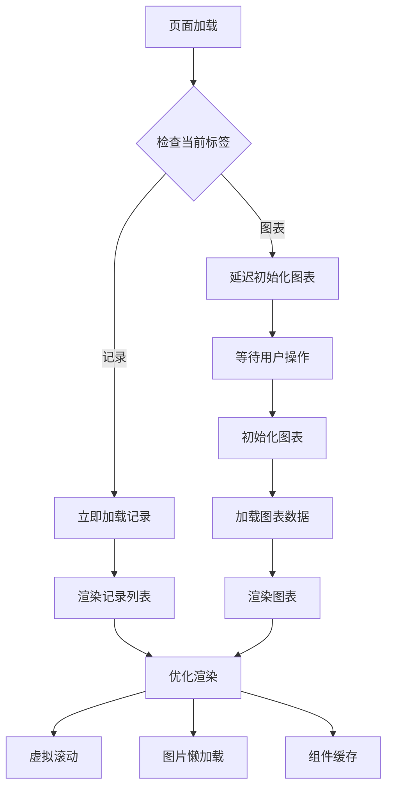
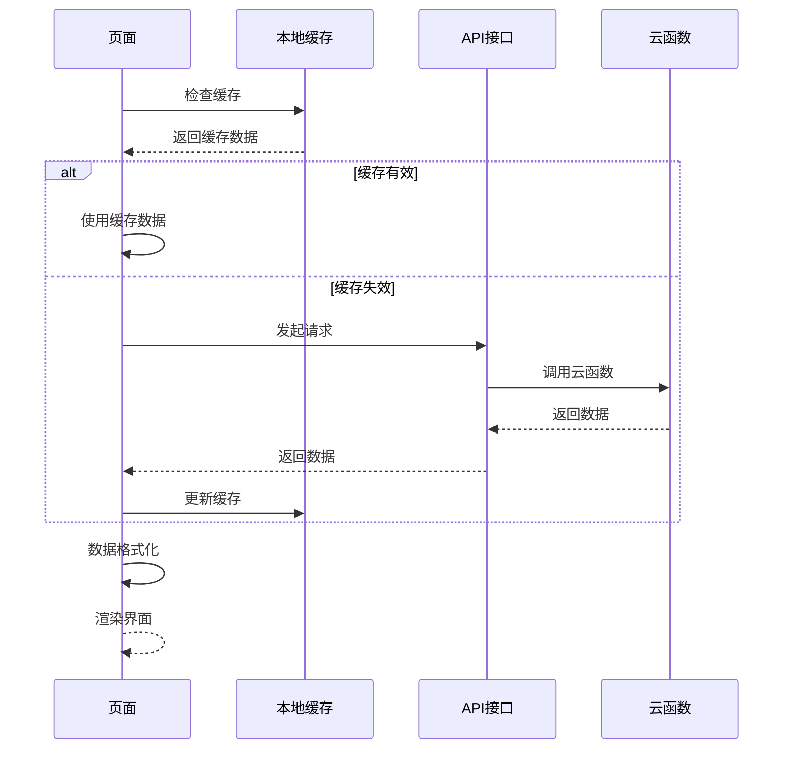

# 界面交互设计

<cite>
**本文档引用的文件**
- [app.js](file://miniprogram/app.js)
- [app.json](file://miniprogram/app.json)
- [app.wxss](file://miniprogram/app.wxss)
- [index.js](file://miniprogram/pages/index/index.js)
- [index.wxss](file://miniprogram/pages/index/index.wxss)
- [baby-detail.js](file://miniprogram/pages/baby-detail/baby-detail.js)
- [baby-detail.wxss](file://miniprogram/pages/baby-detail/baby-detail.wxss)
- [family.js](file://miniprogram/pages/family/family.js)
- [baby-add.js](file://miniprogram/pages/baby-add/baby-add.js)
- [record-add.js](file://miniprogram/pages/record-add/record-add.js)
- [util.js](file://miniprogram/utils/util.js)
- [api.js](file://miniprogram/utils/api.js)
- [ec-canvas.js](file://miniprogram/components/ec-canvas/ec-canvas.js)
- [cloudTipModal/index.js](file://miniprogram/components/cloudTipModal/index.js)
</cite>

## 目录
1. [简介](#简介)
2. [项目结构](#项目结构)
3. [核心组件](#核心组件)
4. [架构概览](#架构概览)
5. [详细组件分析](#详细组件分析)
6. [依赖关系分析](#依赖关系分析)
7. [性能考虑](#性能考虑)
8. [故障排除指南](#故障排除指南)
9. [结论](#结论)

## 简介

本项目是一个基于微信小程序平台的宝宝成长追踪应用，专注于为用户提供直观、流畅的界面交互体验。该应用采用温暖活力的婴儿主题配色，通过精心设计的交互元素和动画效果，为用户提供了完整的宝宝信息管理功能。

应用的核心设计理念包括：
- **直观的导航结构**：清晰的页面层次和功能分区
- **流畅的动画过渡**：平滑的页面切换和状态变化
- **响应式的布局设计**：适配不同屏幕尺寸的设备
- **丰富的交互反馈**：及时的状态提示和用户引导
- **高性能的渲染机制**：优化的数据加载和显示策略

## 项目结构

该项目采用典型的微信小程序项目结构，主要分为以下几个核心模块：



**图表来源**
- [app.js:1-56](file://miniprogram/app.js#L1-L56)
- [app.json:1-39](file://miniprogram/app.json#L1-L39)

**章节来源**
- [app.js:1-56](file://miniprogram/app.js#L1-L56)
- [app.json:1-39](file://miniprogram/app.json#L1-L39)

## 核心组件

### 应用入口组件

应用入口负责初始化全局状态和登录流程，确保用户能够顺利访问各项功能。

### 页面导航组件

系统采用底部标签栏导航，提供两个主要功能区域：
- **宝宝**：展示宝宝列表和基本信息
- **家庭**：管理家庭成员和权限设置

### 数据展示组件

应用使用多种组件来展示不同类型的数据：
- **卡片式布局**：用于展示宝宝信息和记录详情
- **图表组件**：使用ECharts展示宝宝身高体重增长趋势
- **模态框组件**：处理用户交互和确认操作

**章节来源**
- [app.json:16-35](file://miniprogram/app.json#L16-L35)
- [index.wxss:297-334](file://miniprogram/pages/index/index.wxss#L297-L334)

## 架构概览

应用采用分层架构设计，确保各层职责明确，便于维护和扩展：



**图表来源**
- [api.js:1-800](file://miniprogram/utils/api.js#L1-L800)
- [ec-canvas.js:31-77](file://miniprogram/components/ec-canvas/ec-canvas.js#L31-L77)

## 详细组件分析

### 首页交互设计

首页作为应用的主要入口，采用了卡片式布局和渐变色彩设计：

#### 动画交互特性



**图表来源**
- [index.js:14-52](file://miniprogram/pages/index/index.js#L14-L52)
- [index.js:94-99](file://miniprogram/pages/index/index.js#L94-L99)

#### 交互反馈机制

首页实现了多层次的用户反馈：
- **加载状态**：异步数据加载时的进度提示
- **错误处理**：网络异常时的友好错误提示
- **成功确认**：操作完成后的积极反馈

**章节来源**
- [index.js:47-51](file://miniprogram/pages/index/index.js#L47-L51)
- [index.js:55-92](file://miniprogram/pages/index/index.js#L55-L92)

### 宝宝详情页交互设计

详情页提供了丰富的交互元素和数据可视化功能：

#### 图表交互设计



**图表来源**
- [baby-detail.js:184-191](file://miniprogram/pages/baby-detail/baby-detail.js#L184-L191)
- [baby-detail.js:247-261](file://miniprogram/pages/baby-detail/baby-detail.js#L247-L261)

#### 权限控制交互

详情页实现了严格的权限控制系统：

| 功能 | 权限级别 | 交互方式 |
|------|----------|----------|
| 修改宝宝姓名 | 一级助教 | 点击姓名进入编辑模式 |
| 更新头像 | 一级助教 | 点击头像选择图片 |
| 添加记录 | 一级助教/二级助教 | 点击添加按钮 |
| 删除记录 | 一级助教/二级助教 | 长按记录项 |
| 删除宝宝 | 一级助教 | 通过确认对话框 |

**章节来源**
- [baby-detail.js:476-536](file://miniprogram/pages/baby-detail/baby-detail.js#L476-L536)
- [baby-detail.js:592-612](file://miniprogram/pages/baby-detail/baby-detail.js#L592-L612)

### 家庭管理交互设计

家庭页面提供了完整的家庭管理和成员权限控制功能：

#### 成员权限交互



**图表来源**
- [family.js:33-80](file://miniprogram/pages/family/family.js#L33-L80)
- [api.js:782-852](file://miniprogram/utils/api.js#L782-L852)

#### 交互状态管理

家庭页面实现了复杂的状态管理：
- **模态框状态**：多个弹窗的显示/隐藏控制
- **表单验证**：实时输入验证和错误提示
- **权限状态**：根据用户角色动态调整界面元素

**章节来源**
- [family.js:82-130](file://miniprogram/pages/family/family.js#L82-L130)
- [family.js:511-549](file://miniprogram/pages/family/family.js#L511-L549)

### 表单交互设计

应用中的表单交互遵循统一的设计规范：

#### 添加宝宝表单



**图表来源**
- [baby-add.js:74-118](file://miniprogram/pages/baby-add/baby-add.js#L74-L118)
- [record-add.js:71-116](file://miniprogram/pages/record-add/record-add.js#L71-L116)

#### 数据验证策略

表单验证采用多层次策略：
- **前端实时验证**：输入时即时反馈
- **格式验证**：确保数据格式正确
- **业务规则验证**：符合应用业务逻辑
- **后端二次验证**：确保数据安全

**章节来源**
- [baby-add.js:75-92](file://miniprogram/pages/baby-add/baby-add.js#L75-L92)
- [record-add.js:78-92](file://miniprogram/pages/record-add/record-add.js#L78-L92)

## 依赖关系分析

应用的依赖关系体现了清晰的分层架构：



**图表来源**
- [api.js:1-800](file://miniprogram/utils/api.js#L1-L800)
- [ec-canvas.js:1-285](file://miniprogram/components/ec-canvas/ec-canvas.js#L1-L285)

### 组件依赖关系



**图表来源**
- [ec-canvas.js:31-77](file://miniprogram/components/ec-canvas/ec-canvas.js#L31-L77)
- [cloudTipModal/index.js:1-29](file://miniprogram/components/cloudTipModal/index.js#L1-L29)

**章节来源**
- [api.js:854-879](file://miniprogram/utils/api.js#L854-L879)

## 性能考虑

### 渲染性能优化

应用在多个层面实现了性能优化：

#### 懒加载策略



#### 内存管理

应用采用以下内存管理策略：
- **组件卸载清理**：页面离开时清理图表实例
- **数据缓存策略**：合理缓存常用数据
- **事件监听管理**：避免内存泄漏

**章节来源**
- [baby-detail.js:184-191](file://miniprogram/pages/baby-detail/baby-detail.js#L184-L191)
- [ec-canvas.js:74-77](file://miniprogram/components/ec-canvas/ec-canvas.js#L74-L77)

### 网络性能优化

#### 请求优化策略



#### 错误处理机制

应用实现了完善的错误处理机制：
- **网络异常处理**：自动重试和降级策略
- **数据验证**：前端和后端双重验证
- **用户友好的错误提示**：清晰的错误信息和解决方案

**章节来源**
- [api.js:13-41](file://miniprogram/utils/api.js#L13-L41)
- [util.js:1-55](file://miniprogram/utils/util.js#L1-L55)

## 故障排除指南

### 常见问题诊断

#### 登录相关问题

| 问题症状 | 可能原因 | 解决方案 |
|----------|----------|----------|
| 登录失败 | 网络连接异常 | 检查网络状态，重新尝试登录 |
| 用户信息缺失 | 云函数调用失败 | 查看云函数日志，确认权限配置 |
| 登录超时 | 网络延迟 | 增加超时时间，提供重试机制 |

#### 数据加载问题

| 问题症状 | 可能原因 | 解决方案 |
|----------|----------|----------|
| 数据为空 | 权限不足 | 检查用户权限，联系家庭管理员 |
| 加载缓慢 | 网络拥塞 | 实现数据缓存，优化查询条件 |
| 图表不显示 | Canvas初始化失败 | 检查基础库版本，降级处理 |

#### 交互响应问题

| 问题症状 | 可能原因 | 解决方案 |
|----------|----------|----------|
| 按钮无响应 | 事件绑定错误 | 检查wxml中的bind事件绑定 |
| 动画卡顿 | 渲染性能不足 | 优化数据量，减少重绘 |
| 模态框无法关闭 | 状态管理错误 | 检查setData调用时机 |

**章节来源**
- [app.js:23-54](file://miniprogram/app.js#L23-L54)
- [api.js:782-852](file://miniprogram/utils/api.js#L782-L852)

### 调试技巧

#### 开发者工具使用

1. **网络面板**：监控API请求和响应
2. **存储面板**：检查本地缓存和用户信息
3. **控制台**：查看JavaScript错误和警告
4. **性能面板**：分析渲染性能和内存使用

#### 日志记录策略

```javascript
// 建议的日志记录模式
console.log('用户操作:', {action, userId, timestamp});
console.error('错误信息:', {error, action, stackTrace});
console.warn('性能警告:', {duration, threshold, action});
```

## 结论

本项目在界面交互设计方面展现了专业的水准，通过精心设计的交互元素、动画效果和过渡效果，为用户提供了流畅、直观的使用体验。主要特点包括：

### 设计优势

1. **一致的视觉语言**：统一的色彩体系和设计风格
2. **合理的交互层级**：清晰的功能分区和导航结构
3. **丰富的反馈机制**：及时的状态提示和用户引导
4. **优秀的性能表现**：优化的渲染策略和资源管理

### 技术亮点

1. **灵活的权限控制**：基于角色的细粒度权限管理
2. **强大的数据可视化**：集成ECharts实现专业的图表展示
3. **完善的错误处理**：全面的异常捕获和用户提示
4. **高效的性能优化**：多层面的性能优化策略

### 改进建议

1. **增强可访问性**：添加更多的无障碍支持
2. **提升响应速度**：进一步优化数据加载和渲染性能
3. **扩展交互类型**：增加手势操作和更丰富的动画效果
4. **完善离线支持**：实现更好的离线数据同步机制

通过持续的优化和改进，该应用能够为用户提供更加优秀的小程序交互体验，成为移动应用开发的优秀范例。