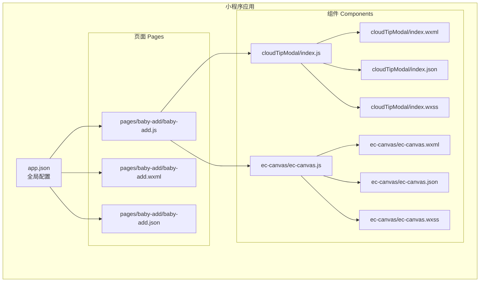
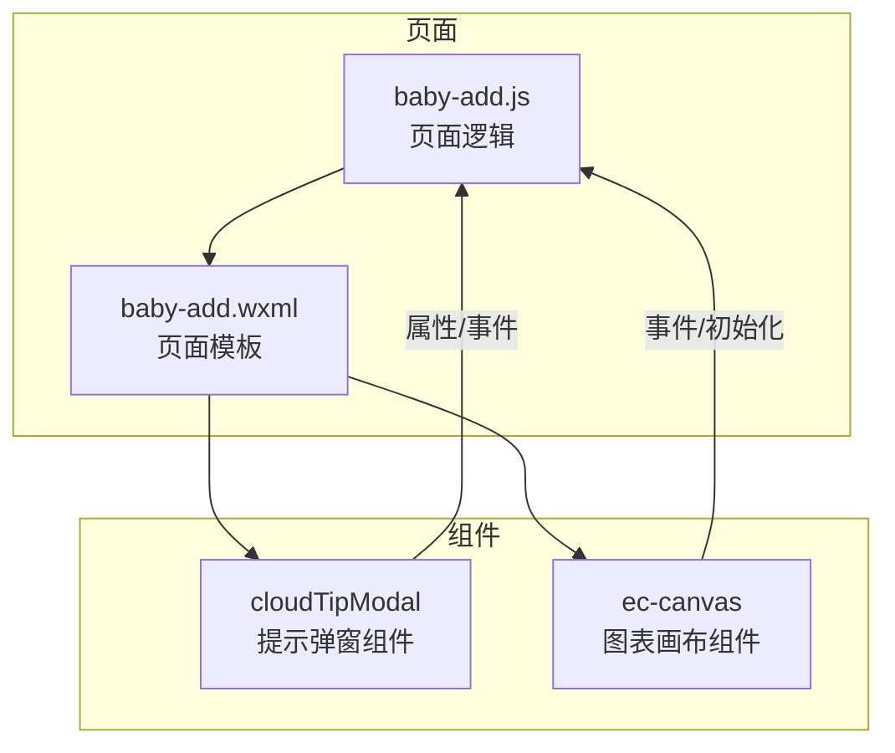
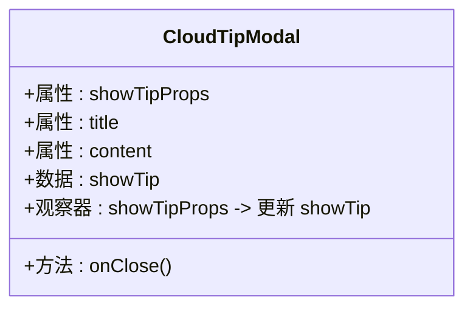
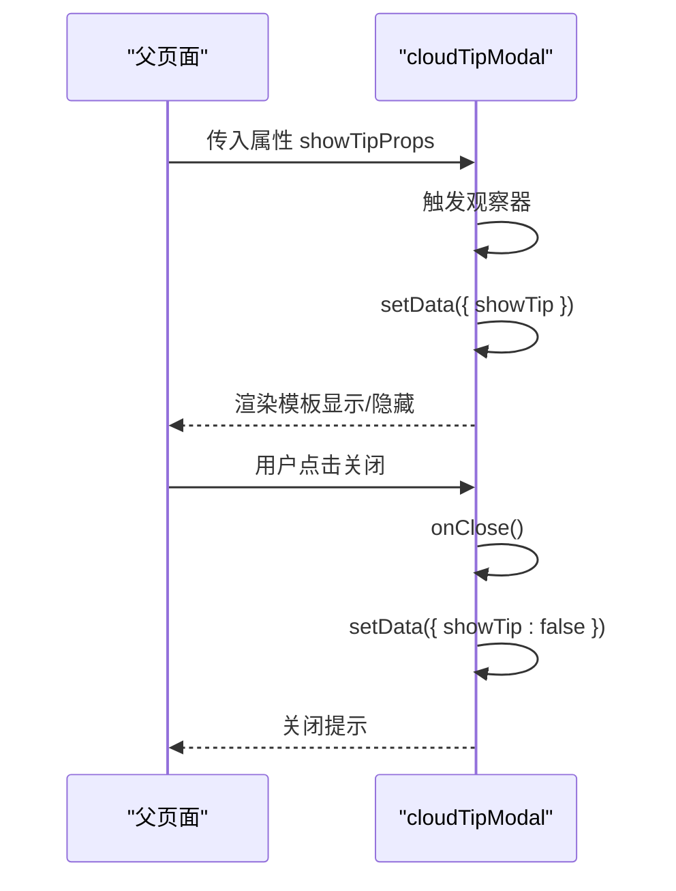
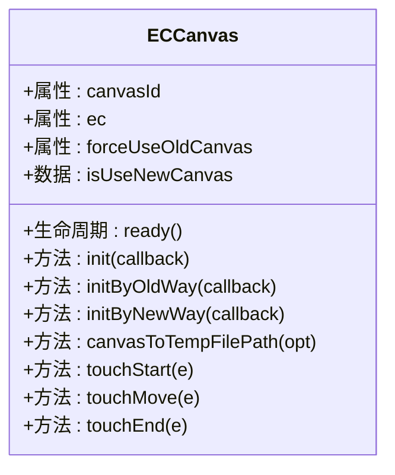
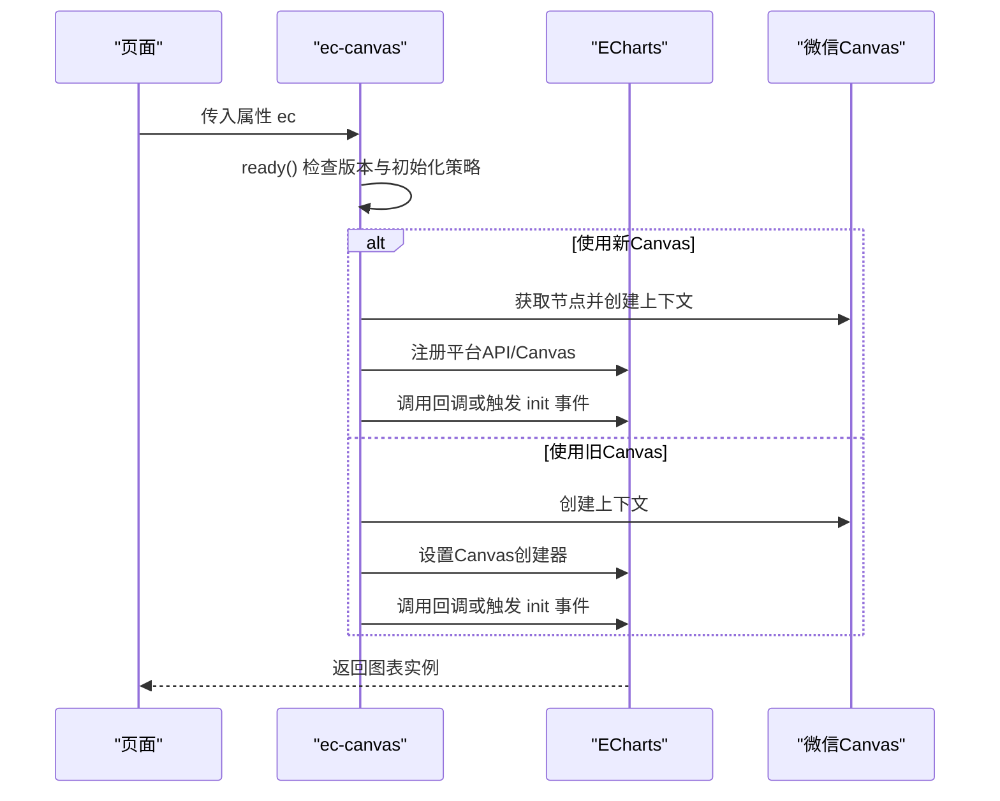
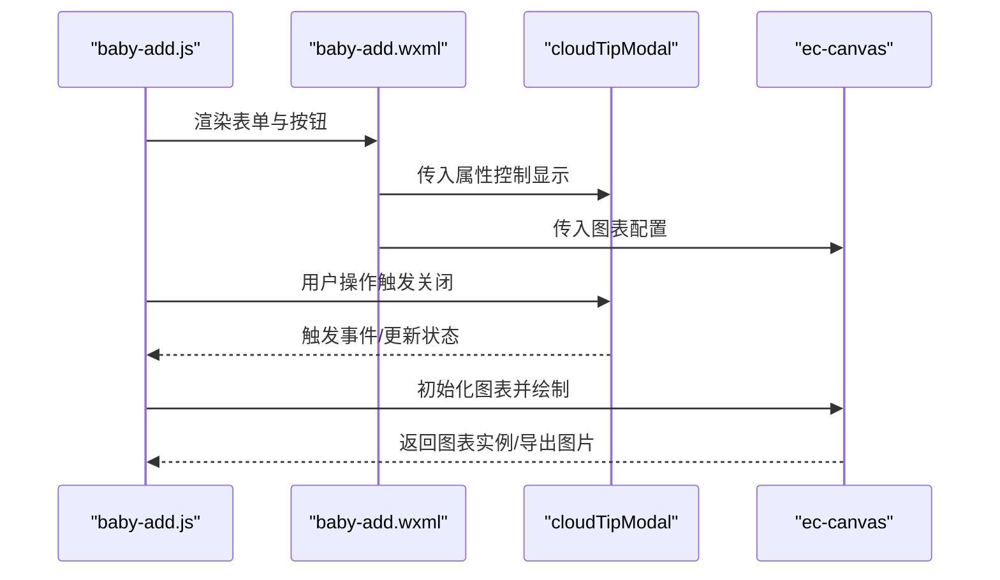
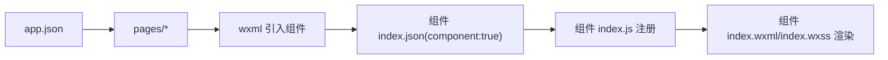

# 组件基础理论

<cite>
**本文引用的文件**
- [miniprogram/components/cloudTipModal/index.js](file://miniprogram/components/cloudTipModal/index.js)
- [miniprogram/components/cloudTipModal/index.json](file://miniprogram/components/cloudTipModal/index.json)
- [miniprogram/components/cloudTipModal/index.wxml](file://miniprogram/components/cloudTipModal/index.wxml)
- [miniprogram/components/cloudTipModal/index.wxss](file://miniprogram/components/cloudTipModal/index.wxss)
- [miniprogram/components/ec-canvas/ec-canvas.js](file://miniprogram/components/ec-canvas/ec-canvas.js)
- [miniprogram/components/ec-canvas/ec-canvas.json](file://miniprogram/components/ec-canvas/ec-canvas.json)
- [miniprogram/components/ec-canvas/ec-canvas.wxml](file://miniprogram/components/ec-canvas/ec-canvas.wxml)
- [miniprogram/components/ec-canvas/ec-canvas.wxss](file://miniprogram/components/ec-canvas/ec-canvas.wxss)
- [miniprogram/app.json](file://miniprogram/app.json)
- [miniprogram/pages/baby-add/baby-add.js](file://miniprogram/pages/baby-add/baby-add.js)
- [miniprogram/pages/baby-add/baby-add.wxml](file://miniprogram/pages/baby-add/baby-add.wxml)
</cite>

## 目录
1. [引言](#引言)
2. [项目结构](#项目结构)
3. [核心组件](#核心组件)
4. [架构总览](#架构总览)
5. [详细组件分析](#详细组件分析)
6. [依赖关系分析](#依赖关系分析)
7. [性能考量](#性能考量)
8. [故障排查指南](#故障排查指南)
9. [结论](#结论)
10. [附录](#附录)

## 引言
本文件系统性阐述微信小程序自定义组件的基础理论与实践要点，结合仓库中的实际组件与页面，讲解组件的定义方式、配置项、模板与样式系统，以及组件间的数据传递（父子通信、事件传递、数据绑定）等核心机制。同时给出组件开发流程、命名规范、文件组织与注释建议，帮助开发者建立扎实的组件设计思想与工程化实践能力。

## 项目结构
该项目采用按功能域分层的目录组织方式：
- app.json 定义全局页面与窗口样式、tabBar 等
- miniprogram/pages 下为页面级资源（.js/.json/.wxml/.wxss）
- miniprogram/components 下为自定义组件资源（每个组件包含 index.js/index.json/index.wxml/index.wxss）

图表来源
- [miniprogram/app.json:1-39](file://miniprogram/app.json#L1-L39)
- [miniprogram/pages/baby-add/baby-add.js:1-120](file://miniprogram/pages/baby-add/baby-add.js#L1-L120)
- [miniprogram/pages/baby-add/baby-add.wxml:1-57](file://miniprogram/pages/baby-add/baby-add.wxml#L1-L57)
- [miniprogram/components/cloudTipModal/index.js:1-29](file://miniprogram/components/cloudTipModal/index.js#L1-L29)
- [miniprogram/components/cloudTipModal/index.wxml:1-11](file://miniprogram/components/cloudTipModal/index.wxml#L1-L11)
- [miniprogram/components/cloudTipModal/index.json:1-5](file://miniprogram/components/cloudTipModal/index.json#L1-L5)
- [miniprogram/components/cloudTipModal/index.wxss:1-60](file://miniprogram/components/cloudTipModal/index.wxss#L1-L60)
- [miniprogram/components/ec-canvas/ec-canvas.js:1-285](file://miniprogram/components/ec-canvas/ec-canvas.js#L1-L285)
- [miniprogram/components/ec-canvas/ec-canvas.wxml:1-5](file://miniprogram/components/ec-canvas/ec-canvas.wxml#L1-L5)
- [miniprogram/components/ec-canvas/ec-canvas.json:1-4](file://miniprogram/components/ec-canvas/ec-canvas.json#L1-L4)
- [miniprogram/components/ec-canvas/ec-canvas.wxss:1-5](file://miniprogram/components/ec-canvas/ec-canvas.wxss#L1-L5)

章节来源
- [miniprogram/app.json:1-39](file://miniprogram/app.json#L1-L39)

## 核心组件
本节从“组件定义、配置、模板、样式”四个维度，结合仓库中的两个组件进行深入解析。

- 组件定义与生命周期
  - 使用 Component 构造器注册组件，内部通过 data、properties、observers、methods 等字段声明组件状态与行为。
  - 生命周期钩子如 ready 在组件实例进入页面节点树时触发，适合执行初始化逻辑。
  - 示例路径：[组件定义与生命周期:31-77](file://miniprogram/components/ec-canvas/ec-canvas.js#L31-L77)

- 属性(properties)
  - 通过 properties 字段声明对外暴露的输入属性，支持类型约束与默认值。
  - 示例路径：[属性定义示例:32-46](file://miniprogram/components/ec-canvas/ec-canvas.js#L32-L46)

- 数据(data)
  - 通过 data 字段声明组件内部状态，可通过 setData 更新。
  - 示例路径：[内部状态与更新:6-8](file://miniprogram/components/cloudTipModal/index.js#L6-L8)

- 观察器(observers)
  - 通过 observers 对属性变化进行监听，实现响应式更新。
  - 示例路径：[观察器用法:14-20](file://miniprogram/components/cloudTipModal/index.js#L14-L20)

- 方法(methods)
  - 通过 methods 定义组件内部方法，供模板或外部调用。
  - 示例路径：[方法定义示例:21-27](file://miniprogram/components/cloudTipModal/index.js#L21-L27)

- 事件(events)
  - 组件可通过 triggerEvent 向父组件派发事件；父组件通过 bind: 事件名绑定处理函数。
  - 示例路径：[事件派发与处理:133-139](file://miniprogram/components/ec-canvas/ec-canvas.js#L133-L139)

- 模板结构与数据绑定
  - wxml 中使用双花括号进行数据绑定，条件渲染与事件绑定语法清晰直观。
  - 示例路径：[模板与事件绑定:3-10](file://miniprogram/components/cloudTipModal/index.wxml#L3-L10)

- 样式系统
  - 组件内样式仅作用于当前组件，避免样式污染；支持 rpx 单位适配不同设备。
  - 示例路径：[组件样式:1-60](file://miniprogram/components/cloudTipModal/index.wxss#L1-L60)

章节来源
- [miniprogram/components/cloudTipModal/index.js:1-29](file://miniprogram/components/cloudTipModal/index.js#L1-L29)
- [miniprogram/components/cloudTipModal/index.wxml:1-11](file://miniprogram/components/cloudTipModal/index.wxml#L1-L11)
- [miniprogram/components/cloudTipModal/index.wxss:1-60](file://miniprogram/components/cloudTipModal/index.wxss#L1-L60)
- [miniprogram/components/ec-canvas/ec-canvas.js:31-77](file://miniprogram/components/ec-canvas/ec-canvas.js#L31-L77)
- [miniprogram/components/ec-canvas/ec-canvas.wxml:1-5](file://miniprogram/components/ec-canvas/ec-canvas.wxml#L1-L5)
- [miniprogram/components/ec-canvas/ec-canvas.json:1-4](file://miniprogram/components/ec-canvas/ec-canvas.json#L1-L4)
- [miniprogram/components/ec-canvas/ec-canvas.wxss:1-5](file://miniprogram/components/ec-canvas/ec-canvas.wxss#L1-L5)

## 架构总览
下图展示了页面与组件之间的关系：页面作为容器承载业务逻辑，组件作为可复用的 UI 单元，二者通过属性与事件进行解耦通信。

图表来源
- [miniprogram/pages/baby-add/baby-add.js:1-120](file://miniprogram/pages/baby-add/baby-add.js#L1-L120)
- [miniprogram/pages/baby-add/baby-add.wxml:1-57](file://miniprogram/pages/baby-add/baby-add.wxml#L1-L57)
- [miniprogram/components/cloudTipModal/index.js:1-29](file://miniprogram/components/cloudTipModal/index.js#L1-L29)
- [miniprogram/components/cloudTipModal/index.wxml:1-11](file://miniprogram/components/cloudTipModal/index.wxml#L1-L11)
- [miniprogram/components/ec-canvas/ec-canvas.js:31-77](file://miniprogram/components/ec-canvas/ec-canvas.js#L31-L77)

## 详细组件分析

### 提示弹窗组件（cloudTipModal）
该组件用于展示提示信息并支持关闭操作，体现组件的属性、数据、观察器与方法的完整用法。

图表来源
- [miniprogram/components/cloudTipModal/index.js:1-29](file://miniprogram/components/cloudTipModal/index.js#L1-L29)

图表来源
- [miniprogram/components/cloudTipModal/index.js:14-27](file://miniprogram/components/cloudTipModal/index.js#L14-L27)
- [miniprogram/components/cloudTipModal/index.wxml:3-10](file://miniprogram/components/cloudTipModal/index.wxml#L3-L10)

章节来源
- [miniprogram/components/cloudTipModal/index.js:1-29](file://miniprogram/components/cloudTipModal/index.js#L1-L29)
- [miniprogram/components/cloudTipModal/index.wxml:1-11](file://miniprogram/components/cloudTipModal/index.wxml#L1-L11)
- [miniprogram/components/cloudTipModal/index.wxss:1-60](file://miniprogram/components/cloudTipModal/index.wxss#L1-L60)

### 图表画布组件（ec-canvas）
该组件封装了 Canvas 初始化、版本兼容、触摸事件映射与截图导出等复杂逻辑，是组件复用与抽象的典型范例。

图表来源
- [miniprogram/components/ec-canvas/ec-canvas.js:31-275](file://miniprogram/components/ec-canvas/ec-canvas.js#L31-L275)
- [miniprogram/components/ec-canvas/ec-canvas.json:1-4](file://miniprogram/components/ec-canvas/ec-canvas.json#L1-L4)
- [miniprogram/components/ec-canvas/ec-canvas.wxml:1-5](file://miniprogram/components/ec-canvas/ec-canvas.wxml#L1-L5)
- [miniprogram/components/ec-canvas/ec-canvas.wxss:1-5](file://miniprogram/components/ec-canvas/ec-canvas.wxss#L1-L5)

图表来源
- [miniprogram/components/ec-canvas/ec-canvas.js:52-192](file://miniprogram/components/ec-canvas/ec-canvas.js#L52-L192)

章节来源
- [miniprogram/components/ec-canvas/ec-canvas.js:1-285](file://miniprogram/components/ec-canvas/ec-canvas.js#L1-L285)
- [miniprogram/components/ec-canvas/ec-canvas.json:1-4](file://miniprogram/components/ec-canvas/ec-canvas.json#L1-L4)
- [miniprogram/components/ec-canvas/ec-canvas.wxml:1-5](file://miniprogram/components/ec-canvas/ec-canvas.wxml#L1-L5)
- [miniprogram/components/ec-canvas/ec-canvas.wxss:1-5](file://miniprogram/components/ec-canvas/ec-canvas.wxss#L1-L5)

### 页面与组件的交互流程（以“添加宝宝”页面为例）
页面负责管理表单数据与业务逻辑，组件负责具体 UI 行为与交互。

图表来源
- [miniprogram/pages/baby-add/baby-add.js:1-120](file://miniprogram/pages/baby-add/baby-add.js#L1-L120)
- [miniprogram/pages/baby-add/baby-add.wxml:1-57](file://miniprogram/pages/baby-add/baby-add.wxml#L1-L57)
- [miniprogram/components/cloudTipModal/index.js:1-29](file://miniprogram/components/cloudTipModal/index.js#L1-L29)
- [miniprogram/components/ec-canvas/ec-canvas.js:31-77](file://miniprogram/components/ec-canvas/ec-canvas.js#L31-L77)

章节来源
- [miniprogram/pages/baby-add/baby-add.js:1-120](file://miniprogram/pages/baby-add/baby-add.js#L1-L120)
- [miniprogram/pages/baby-add/baby-add.wxml:1-57](file://miniprogram/pages/baby-add/baby-add.wxml#L1-L57)

## 依赖关系分析
- 组件注册与启用
  - 组件需在自身 json 中设置 "component": true 才能被识别为自定义组件。
  - 示例路径：[组件启用:3-4](file://miniprogram/components/cloudTipModal/index.json#L3-L4)

- 组件模板与样式
  - wxml/wxss 分别定义结构与样式，遵循组件作用域隔离原则。
  - 示例路径：[模板与样式:1-11](file://miniprogram/components/cloudTipModal/index.wxml#L1-L11), [样式:1-60](file://miniprogram/components/cloudTipModal/index.wxss#L1-L60)

- 页面对组件的使用
  - 页面通过 wxml 中直接引入组件标签并传入属性，即可复用组件能力。
  - 示例路径：[页面模板中使用组件:1-57](file://miniprogram/pages/baby-add/baby-add.wxml#L1-L57)

- 全局配置与懒加载
  - app.json 中开启 lazyCodeLoading 并配置 pages，有助于提升首屏性能与按需加载。
  - 示例路径：[全局配置:1-39](file://miniprogram/app.json#L1-L39)

图表来源
- [miniprogram/app.json:1-39](file://miniprogram/app.json#L1-L39)
- [miniprogram/pages/baby-add/baby-add.wxml:1-57](file://miniprogram/pages/baby-add/baby-add.wxml#L1-L57)
- [miniprogram/components/cloudTipModal/index.json:1-5](file://miniprogram/components/cloudTipModal/index.json#L1-L5)
- [miniprogram/components/cloudTipModal/index.js:1-29](file://miniprogram/components/cloudTipModal/index.js#L1-L29)

章节来源
- [miniprogram/components/cloudTipModal/index.json:1-5](file://miniprogram/components/cloudTipModal/index.json#L1-L5)
- [miniprogram/components/cloudTipModal/index.wxml:1-11](file://miniprogram/components/cloudTipModal/index.wxml#L1-L11)
- [miniprogram/components/cloudTipModal/index.wxss:1-60](file://miniprogram/components/cloudTipModal/index.wxss#L1-L60)
- [miniprogram/pages/baby-add/baby-add.wxml:1-57](file://miniprogram/pages/baby-add/baby-add.wxml#L1-L57)
- [miniprogram/app.json:1-39](file://miniprogram/app.json#L1-L39)

## 性能考量
- Canvas 初始化策略
  - 根据微信基础库版本选择新旧 Canvas 初始化路径，新版本可获得更佳性能与能力。
  - 示例路径：[版本判断与初始化:80-108](file://miniprogram/components/ec-canvas/ec-canvas.js#L80-L108)

- 懒加载与按需初始化
  - 通过属性控制是否延迟加载图表，减少首屏压力。
  - 示例路径：[懒加载判断:74-77](file://miniprogram/components/ec-canvas/ec-canvas.js#L74-L77)

- 事件处理优化
  - 将触摸事件映射到图表内部，避免重复计算与无效渲染。
  - 示例路径：[触摸事件处理:216-273](file://miniprogram/components/ec-canvas/ec-canvas.js#L216-L273)

## 故障排查指南
- 组件未生效
  - 检查组件 json 是否设置 "component": true。
  - 示例路径：[组件启用检查:3-4](file://miniprogram/components/cloudTipModal/index.json#L3-L4)

- Canvas 初始化失败
  - 查看基础库版本是否满足最低要求，必要时降级到旧 Canvas 方案。
  - 示例路径：[版本校验与降级:97-107](file://miniprogram/components/ec-canvas/ec-canvas.js#L97-L107)

- 图片导出异常
  - 确认 Canvas 节点与尺寸查询是否成功，再调用导出接口。
  - 示例路径：[导出流程:193-214](file://miniprogram/components/ec-canvas/ec-canvas.js#L193-L214)

- 事件未触发
  - 确认模板中事件绑定与组件方法名一致，且父组件正确接收事件。
  - 示例路径：[事件派发:133-139](file://miniprogram/components/ec-canvas/ec-canvas.js#L133-L139)

章节来源
- [miniprogram/components/cloudTipModal/index.json:3-4](file://miniprogram/components/cloudTipModal/index.json#L3-L4)
- [miniprogram/components/ec-canvas/ec-canvas.js:97-107](file://miniprogram/components/ec-canvas/ec-canvas.js#L97-L107)
- [miniprogram/components/ec-canvas/ec-canvas.js:193-214](file://miniprogram/components/ec-canvas/ec-canvas.js#L193-L214)
- [miniprogram/components/ec-canvas/ec-canvas.js:133-139](file://miniprogram/components/ec-canvas/ec-canvas.js#L133-L139)

## 结论
通过本仓库中的两个组件，可以系统掌握小程序自定义组件的设计与实现要点：以 Component 构造器为核心，配合 properties、data、observers、methods、events 与生命周期，构建高内聚、低耦合的可复用 UI 单元；在页面中以简洁的模板语法引入组件，实现清晰的数据流与事件流。结合版本兼容、懒加载与性能优化策略，可在保证体验的同时提升开发效率与维护性。

## 附录
- 开发流程建议
  - 文件命名：组件统一使用 index.js/index.json/index.wxml/index.wxss 的标准命名。
  - 文件组织：组件独立目录，避免跨组件共享状态，保持职责单一。
  - 注释规范：为属性、方法与关键逻辑添加清晰注释，便于协作与维护。
  - 样式隔离：优先使用组件内样式，避免全局污染；合理使用 rpx 适配。
  - 事件约定：明确事件命名与参数结构，统一在文档中沉淀。
  - 测试与验证：在不同基础库版本与机型上验证组件表现，关注边界场景。