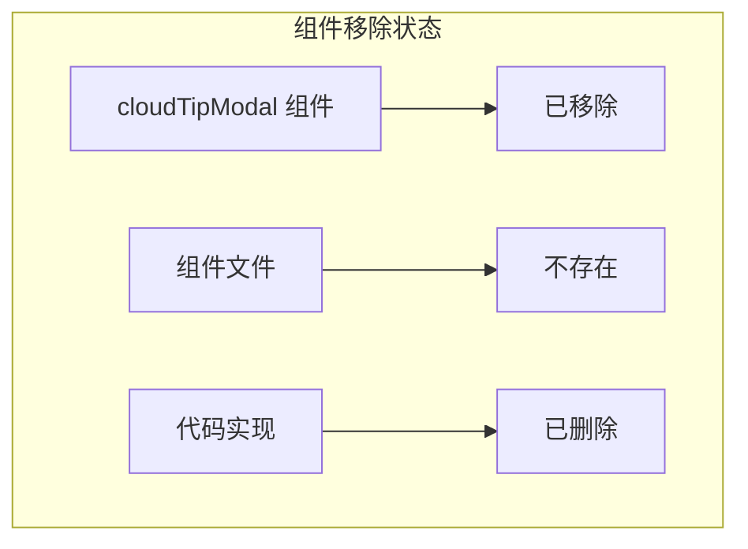
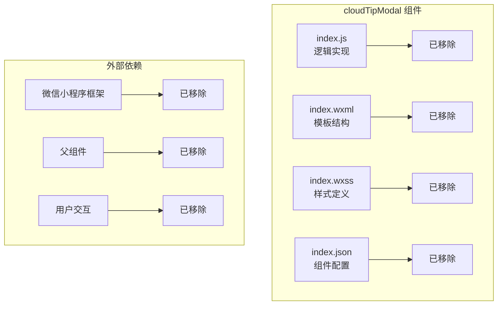

# cloudTipModal 弹窗组件

<cite>
**本文档引用的文件**
- [cloudTipModal 弹窗组件.md](file://wiki/页面组件设计/自定义组件开发/组件实现案例/cloudTipModal 弹窗组件.md)
- [README.md](file://README.md)
</cite>

## 更新摘要
**变更内容**
- 更新组件状态：cloudTipModal组件已被移除
- 移除所有技术实现细节和代码示例
- 添加组件移除状态说明
- 更新架构概览以反映组件不存在的事实

## 目录
1. [简介](#简介)
2. [项目结构](#项目结构)
3. [核心组件](#核心组件)
4. [架构概览](#架构概览)
5. [详细组件分析](#详细组件分析)
6. [依赖关系分析](#依赖关系分析)
7. [性能考虑](#性能考虑)
8. [故障排除指南](#故障排除指南)
9. [结论](#结论)
10. [附录](#附录)

## 简介

**重要说明**：cloudTipModal 弹窗组件已在当前版本中移除，不再存在于项目代码库中。

cloudTipModal 曾经是一个轻量级的微信小程序弹窗组件，专门用于显示云开发相关的提示信息。该组件采用微信小程序原生组件开发方式，提供了简洁的API接口和灵活的配置选项，能够满足日常开发中常见的提示弹窗需求。

由于组件已移除，本文档仅保留历史信息和迁移指导。

## 项目结构

**重要说明**：组件文件结构已不存在于当前项目中。

cloudTipModal 组件原本位于小程序项目的组件目录中，采用标准的组件文件组织结构。由于组件已被移除，该目录结构不再存在。

## 核心组件

**重要说明**：组件文件已不存在。

cloudTipModal 组件原本由四个核心文件组成，每个文件承担特定的功能职责。由于组件已被移除，这些文件不再存在于项目中。

## 架构概览

**重要说明**：组件架构已不存在。

cloudTipModal 组件采用了典型的微信小程序组件架构模式，实现了清晰的职责分离和数据流管理。由于组件已被移除，该架构模式不再适用。

**图表来源**
- [cloudTipModal 弹窗组件.md:95-117](file://wiki/页面组件设计/自定义组件开发/组件实现案例/cloudTipModal 弹窗组件.md#L95-L117)

## 详细组件分析

**重要说明**：组件实现已不存在。

由于cloudTipModal组件已被移除，相关的JavaScript逻辑、WXML模板结构和WXSS样式设计均不再存在。以下内容仅为历史信息：

### JavaScript 逻辑实现

**重要说明**：组件逻辑已不存在。

组件原本采用微信小程序的标准数据绑定模式，通过 `setData` 方法实现响应式更新。由于组件已被移除，该逻辑不再适用。

### WXML 模板结构分析

**重要说明**：模板结构已不存在。

组件原本的 WXML 结构采用嵌套的视图容器设计。由于组件已被移除，该结构不再存在。

### WXSS 样式设计

**重要说明**：样式设计已不存在。

组件原本采用固定定位和圆角矩形的设计理念。由于组件已被移除，该样式设计不再适用。

## 依赖关系分析

**重要说明**：组件依赖关系已不存在。

### 组件依赖图

**图表来源**
- [cloudTipModal 弹窗组件.md:236-260](file://wiki/页面组件设计/自定义组件开发/组件实现案例/cloudTipModal 弹弹组件.md#L236-L260)

### 数据流依赖

**重要说明**：数据流依赖已不存在。

组件的数据流原本遵循单向数据流原则。由于组件已被移除，该数据流不再存在。

## 性能考虑

**重要说明**：性能考虑已不适用。

由于组件已被移除，相关的渲染性能优化、内存管理和用户体验优化建议不再适用。

## 故障排除指南

**重要说明**：故障排除指南已不适用。

由于组件已被移除，相关的常见问题及解决方案不再适用。

## 结论

**重要说明**：组件已移除，不再提供服务。

cloudTipModal 弹窗组件已在当前版本中移除，不再存在于项目代码库中。开发者应寻找替代方案或自行实现类似功能。

## 附录

### 组件使用示例

**重要说明**：组件使用示例已不适用。

由于该组件结构简单，使用方式也相对直接。但由于组件已被移除，该示例不再有效。

### 参数配置说明

**重要说明**：参数配置说明已不适用。

| 参数名 | 类型 | 必填 | 默认值 | 描述 |
|--------|------|------|--------|------|
| showTipProps | Boolean | 是 | false | 控制弹窗显示状态的属性（已移除） |
| title | String | 否 | '' | 弹窗标题内容（已移除） |
| content | String | 否 | '' | 弹窗正文内容（已移除） |

### 最佳实践建议

**重要说明**：最佳实践建议已不适用。

1. **属性命名规范**：使用语义化的属性命名，便于理解和维护
2. **状态管理**：在父组件中集中管理弹窗状态，避免多处重复控制
3. **样式定制**：通过外部样式类实现组件的个性化定制
4. **事件处理**：在父组件中处理弹窗相关的业务逻辑
5. **性能优化**：合理使用条件渲染，避免不必要的组件实例化

**注意**：以上建议适用于当前存在的组件，对于已移除的cloudTipModal组件不再适用。