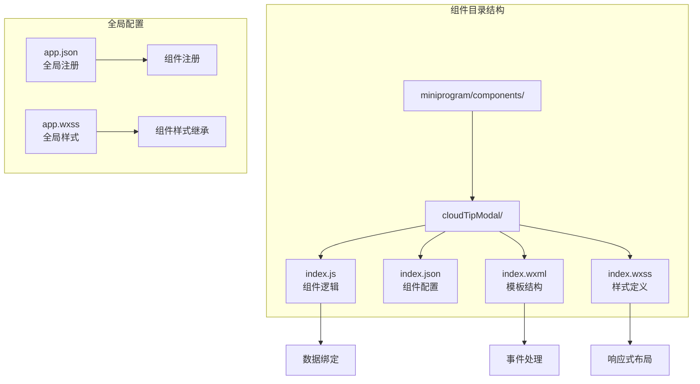
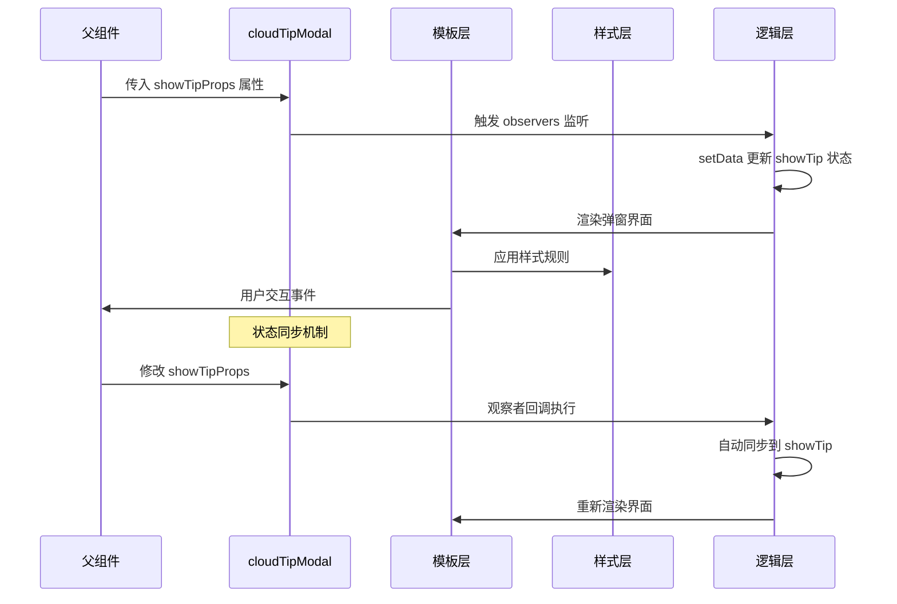
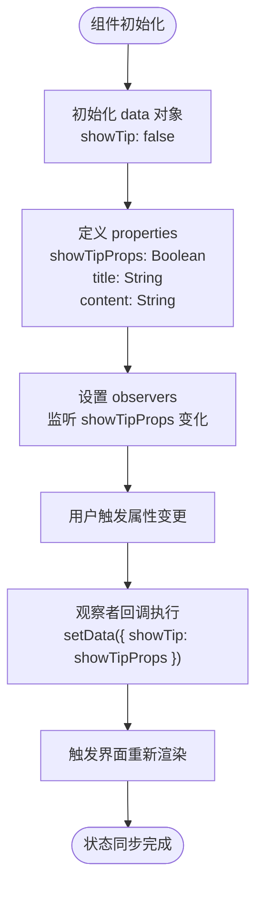
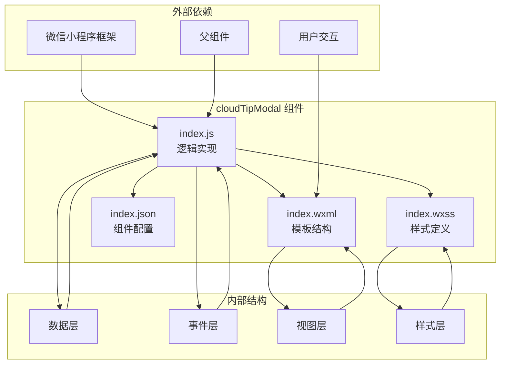

# cloudTipModal 弹窗组件

<cite>
**本文档引用的文件**
- [index.js](file://miniprogram/components/cloudTipModal/index.js)
- [index.json](file://miniprogram/components/cloudTipModal/index.json)
- [index.wxml](file://miniprogram/components/cloudTipModal/index.wxml)
- [index.wxss](file://miniprogram/components/cloudTipModal/index.wxss)
- [README.md](file://README.md)
</cite>

## 目录
1. [简介](#简介)
2. [项目结构](#项目结构)
3. [核心组件](#核心组件)
4. [架构概览](#架构概览)
5. [详细组件分析](#详细组件分析)
6. [依赖关系分析](#依赖关系分析)
7. [性能考虑](#性能考虑)
8. [故障排除指南](#故障排除指南)
9. [结论](#结论)
10. [附录](#附录)

## 简介

cloudTipModal 是一个轻量级的微信小程序弹窗组件，专门用于显示云开发相关的提示信息。该组件采用微信小程序原生组件开发方式，提供了简洁的API接口和灵活的配置选项，能够满足日常开发中常见的提示弹窗需求。

该组件的核心特性包括：
- 响应式设计，适配不同屏幕尺寸
- 支持双向数据绑定和状态同步
- 内置观察者模式实现属性变更监听
- 简洁的样式设计和良好的用户体验
- 易于集成和扩展的组件架构

## 项目结构

cloudTipModal 组件位于小程序项目的组件目录中，采用标准的组件文件组织结构：



**图表来源**
- [index.js:1-29](file://miniprogram/components/cloudTipModal/index.js#L1-L29)
- [index.json:1-5](file://miniprogram/components/cloudTipModal/index.json#L1-L5)

**章节来源**
- [README.md:85-87](file://README.md#L85-L87)

## 核心组件

cloudTipModal 组件由四个核心文件组成，每个文件承担特定的功能职责：

### 组件配置文件 (index.json)
组件配置文件定义了组件的基本属性和依赖关系：
- `"component": true` - 标识这是一个小程序组件
- `"usingComponents": {}` - 当前无内部依赖的子组件

### 组件逻辑文件 (index.js)
组件逻辑文件包含了完整的业务逻辑实现，主要包含以下关键部分：

**数据初始化**
- `data: { showTip: false }` - 控制弹窗显示状态的本地数据
- 通过 `showTip` 属性控制弹窗的显示和隐藏

**属性定义**
- `showTipProps: Boolean` - 外部传入的显示控制属性
- `title: String` - 弹窗标题内容
- `content: String` - 弹窗正文内容

**观察者机制**
- `observers: { showTipProps: function(showTipProps) { ... } }` - 监听外部属性变化
- 实现父子组件间的状态同步

**事件处理**
- `onClose() { ... }` - 关闭弹窗的事件处理方法

**章节来源**
- [index.js:1-29](file://miniprogram/components/cloudTipModal/index.js#L1-L29)

## 架构概览

cloudTipModal 组件采用了典型的微信小程序组件架构模式，实现了清晰的职责分离和数据流管理：



**图表来源**
- [index.js:14-20](file://miniprogram/components/cloudTipModal/index.js#L14-L20)
- [index.wxml:3-10](file://miniprogram/components/cloudTipModal/index.wxml#L3-L10)

## 详细组件分析

### JavaScript 逻辑实现

#### 数据绑定机制
组件采用微信小程序的标准数据绑定模式，通过 `setData` 方法实现响应式更新：



**图表来源**
- [index.js:6-20](file://miniprogram/components/cloudTipModal/index.js#L6-L20)

#### 观察者模式详解
观察者模式是该组件实现状态同步的核心机制：

**观察者配置**
- 监听目标：`showTipProps` 属性变化
- 触发条件：当父组件修改此属性值时
- 执行逻辑：自动将新值同步到本地 `showTip` 状态

**状态同步流程**
1. 父组件通过属性传递控制值
2. 组件检测到属性变化
3. 观察者回调自动执行
4. 通过 `setData` 更新本地状态
5. 触发视图层重新渲染

**章节来源**
- [index.js:14-20](file://miniprogram/components/cloudTipModal/index.js#L14-L20)

#### 事件处理方法
`onClose` 方法实现了弹窗的交互控制逻辑：

```mermaid
flowchart TD
Click[用户点击关闭按钮] --> GetState["获取当前 showTip 状态"]
GetState --> ToggleState["执行状态切换<br/>!showTip"]
ToggleState --> UpdateData["调用 setData 更新状态"]
UpdateData --> TriggerRender["触发界面重新渲染"]
TriggerRender --> HidePopup["弹窗隐藏"]
Note over Click,HidePopup: 状态切换机制
Click --> GetState
GetState --> ToggleState
```

**图表来源**
- [index.js:22-26](file://miniprogram/components/cloudTipModal/index.js#L22-L26)

**章节来源**
- [index.js:21-27](file://miniprogram/components/cloudTipModal/index.js#L21-L27)

### WXML 模板结构分析

#### 模板层次结构
组件的 WXML 结构采用嵌套的视图容器设计：

```mermaid
graph TB
RootView[根视图容器<br/>class: install_tip] --> BackLayer[背景遮罩层<br/>class: install_tip_back]
RootView --> DetailContainer[详情容器<br/>class: install_tip_detail]
DetailContainer --> CloseButton[关闭按钮<br/>bind:tap="onClose"]
DetailContainer --> TitleText[标题文本<br/>{{title}}]
DetailContainer --> ContentText[内容文本<br/>{{content}}]
Note over RootView: 条件渲染
RootView --> Conditional["wx:if=\"{{showTip}}\""]
```

**图表来源**
- [index.wxml:2-10](file://miniprogram/components/cloudTipModal/index.wxml#L2-L10)

#### 条件渲染机制
组件使用微信小程序的条件渲染指令实现弹窗的显示控制：
- `wx:if="{{showTip}}"` - 基于本地状态控制弹窗显示
- 当 `showTip` 为 `true` 时渲染整个弹窗结构
- 当 `showTip` 为 `false` 时完全不渲染

**章节来源**
- [index.wxml:1-11](file://miniprogram/components/cloudTipModal/index.wxml#L1-L11)

### WXSS 样式设计

#### 布局设计原则
组件采用固定定位和圆角矩形的设计理念：

**背景遮罩层样式**
- 固定定位覆盖全屏
- 半透明黑色背景 (`rgba(0,0,0,0.4)`)
- 较高的 z-index 确保层级关系

**弹窗主体样式**
- 固定定位底部居中
- 白色背景和圆角设计 (`40rpx` 圆角)
- 内边距统一 (`50rpx`) 提供舒适的阅读空间

**响应式处理**
- 使用 rpx 单位确保在不同设备上的适配
- 弹性布局支持不同屏幕尺寸
- 字体大小采用相对单位 (`40rpx`, `25rpx`)

**章节来源**
- [index.wxss:1-60](file://miniprogram/components/cloudTipModal/index.wxss#L1-L60)

## 依赖关系分析

### 组件依赖图



**图表来源**
- [index.js:1-29](file://miniprogram/components/cloudTipModal/index.js#L1-L29)
- [index.json:1-5](file://miniprogram/components/cloudTipModal/index.json#L1-L5)

### 数据流依赖

组件的数据流遵循单向数据流原则：

```mermaid
flowchart LR
Parent[父组件] --> |属性传递| Component[cloudTipModal]
Component --> |观察者监听| Data[本地数据]
Data --> |条件渲染| View[弹窗视图]
View --> |事件触发| Component
Component --> |状态更新| Data
Data --> |重新渲染| View
Note over Parent,View: 双向数据绑定机制
Parent -.->|外部控制| Component
Component -.->|内部状态| Data
```

**图表来源**
- [index.js:6-20](file://miniprogram/components/cloudTipModal/index.js#L6-L20)
- [index.wxml:3-10](file://miniprogram/components/cloudTipModal/index.wxml#L3-L10)

**章节来源**
- [index.js:1-29](file://miniprogram/components/cloudTipModal/index.js#L1-L29)

## 性能考虑

### 渲染性能优化
- **条件渲染**：使用 `wx:if` 指令避免不必要的 DOM 创建
- **局部更新**：通过 `setData` 实现最小化界面更新
- **样式复用**：统一的样式类减少重复定义

### 内存管理
- **生命周期**：组件销毁时自动清理事件监听
- **状态管理**：单一状态源避免内存泄漏
- **事件解绑**：避免循环引用导致的内存问题

### 用户体验优化
- **平滑过渡**：固定定位确保弹窗显示的流畅性
- **触摸反馈**：合适的点击区域提供良好的交互体验
- **无障碍设计**：清晰的视觉层次和对比度

## 故障排除指南

### 常见问题及解决方案

**问题1：弹窗无法显示**
- 检查父组件是否正确传递 `showTipProps` 属性
- 确认 `showTipProps` 的值为 `true`
- 验证组件是否正确注册到页面配置中

**问题2：状态不同步**
- 确认观察者配置是否正确设置
- 检查 `showTipProps` 属性类型定义
- 验证 `setData` 调用时机

**问题3：样式显示异常**
- 检查 rpx 单位换算是否正确
- 确认 z-index 层级关系
- 验证条件渲染表达式

**章节来源**
- [index.js:14-20](file://miniprogram/components/cloudTipModal/index.js#L14-L20)
- [index.wxml:3-10](file://miniprogram/components/cloudTipModal/index.wxml#L3-L10)

## 结论

cloudTipModal 弹窗组件是一个设计精良、实现简洁的微信小程序组件。它成功地实现了以下目标：

**技术优势**
- 采用标准的微信小程序组件开发模式
- 实现了高效的观察者模式状态同步机制
- 提供了清晰的 API 接口和灵活的配置选项
- 具备良好的性能表现和用户体验

**架构特点**
- 单一职责原则：专注于弹窗显示功能
- 开闭原则：易于扩展和定制
- 依赖倒置：通过属性注入实现松耦合
- 组合优于继承：通过组合实现功能扩展

**适用场景**
- 云开发相关的提示信息展示
- 用户引导和帮助信息
- 系统通知和消息提醒
- 交互确认和二次确认

该组件为微信小程序开发提供了一个可靠的弹窗解决方案，具有良好的可维护性和扩展性。

## 附录

### 组件使用示例

由于该组件结构简单，使用方式也相对直接。通常在父组件中通过属性传递来控制弹窗显示：

```javascript
// 父组件中使用
<cloud-tip-modal 
  showTipProps="{{showTip}}"
  title="{{tipTitle}}"
  content="{{tipContent}}"
/>
```

### 参数配置说明

| 参数名 | 类型 | 必填 | 默认值 | 描述 |
|--------|------|------|--------|------|
| showTipProps | Boolean | 是 | false | 控制弹窗显示状态的属性 |
| title | String | 否 | '' | 弹窗标题内容 |
| content | String | 否 | '' | 弹窗正文内容 |

### 最佳实践建议

1. **属性命名规范**：使用语义化的属性命名，便于理解和维护
2. **状态管理**：在父组件中集中管理弹窗状态，避免多处重复控制
3. **样式定制**：通过外部样式类实现组件的个性化定制
4. **事件处理**：在父组件中处理弹窗相关的业务逻辑
5. **性能优化**：合理使用条件渲染，避免不必要的组件实例化