# ec-canvas 图表组件

<cite>
**本文档引用的文件**
- [ec-canvas.js](file://miniprogram/components/ec-canvas/ec-canvas.js)
- [wx-canvas.js](file://miniprogram/components/ec-canvas/wx-canvas.js)
- [echarts.js](file://miniprogram/components/ec-canvas/echarts.js)
- [ec-canvas.json](file://miniprogram/components/ec-canvas/ec-canvas.json)
- [ec-canvas.wxml](file://miniprogram/components/ec-canvas/ec-canvas.wxml)
- [ec-canvas.wxss](file://miniprogram/components/ec-canvas/ec-canvas.wxss)
- [baby-detail.js](file://miniprogram/pages/baby-detail/baby-detail.js)
- [baby-detail.wxml](file://miniprogram/pages/baby-detail/baby-detail.wxml)
- [baby-detail.wxss](file://miniprogram/pages/baby-detail/baby-detail.wxss)
</cite>

## 目录
1. [项目概述](#项目概述)
2. [组件架构设计](#组件架构设计)
3. [核心组件分析](#核心组件分析)
4. [ECharts集成方案](#echarts集成方案)
5. [JavaScript逻辑实现](#javascript逻辑实现)
6. [WXML模板结构](#wxml模板结构)
7. [WXSS样式设计](#wxss样式设计)
8. [图表渲染流程](#图表渲染流程)
9. [性能优化策略](#性能优化策略)
10. [数据绑定与动态更新](#数据绑定与动态更新)
11. [使用示例与最佳实践](#使用示例与最佳实践)
12. [故障排除指南](#故障排除指南)
13. [总结](#总结)

## 项目概述

ec-canvas是一个专为微信小程序设计的ECharts图表组件，提供了在小程序中集成高性能图表功能的完整解决方案。该组件通过封装原生canvas API，实现了ECharts在小程序环境中的无缝运行，支持多种图表类型、交互操作和响应式布局。

组件主要特点：
- 支持新旧两种canvas模式（2.9.0及以上版本使用type="2d"）
- 自动适配设备像素比（DPR）
- 提供触摸事件支持和手势识别
- 支持懒加载和延迟初始化
- 完整的生命周期管理和内存优化

## 组件架构设计

ec-canvas组件采用模块化设计，主要由三个核心部分组成：

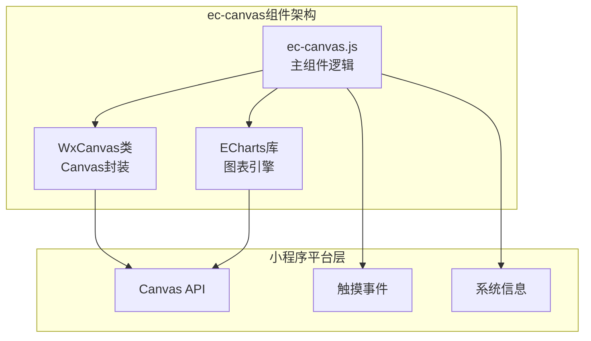

**图表来源**
- [ec-canvas.js:31-275](file://miniprogram/components/ec-canvas/ec-canvas.js#L31-L275)
- [wx-canvas.js:1-112](file://miniprogram/components/ec-canvas/wx-canvas.js#L1-L112)

**章节来源**
- [ec-canvas.js:1-285](file://miniprogram/components/ec-canvas/ec-canvas.js#L1-L285)
- [wx-canvas.js:1-112](file://miniprogram/components/ec-canvas/wx-canvas.js#L1-L112)

## 核心组件分析

### 主组件类结构

ec-canvas.js定义了完整的组件类，包含属性、方法和生命周期管理：

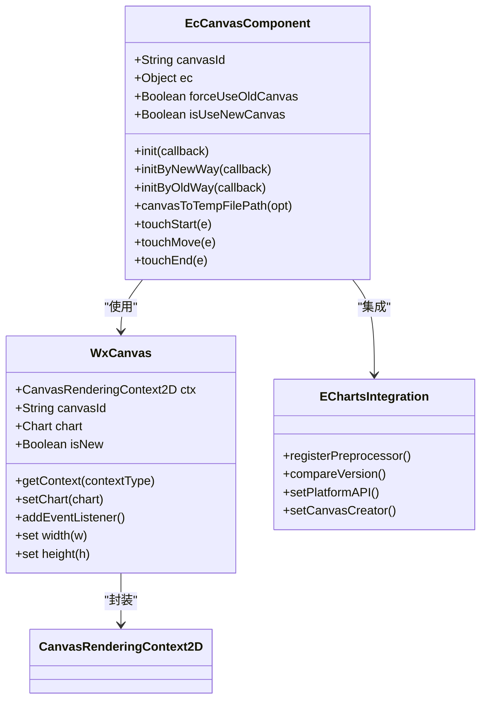

**图表来源**
- [ec-canvas.js:31-275](file://miniprogram/components/ec-canvas/ec-canvas.js#L31-L275)
- [wx-canvas.js:1-112](file://miniprogram/components/ec-canvas/wx-canvas.js#L1-L112)

### 版本兼容性处理

组件通过版本比较函数实现向后兼容：

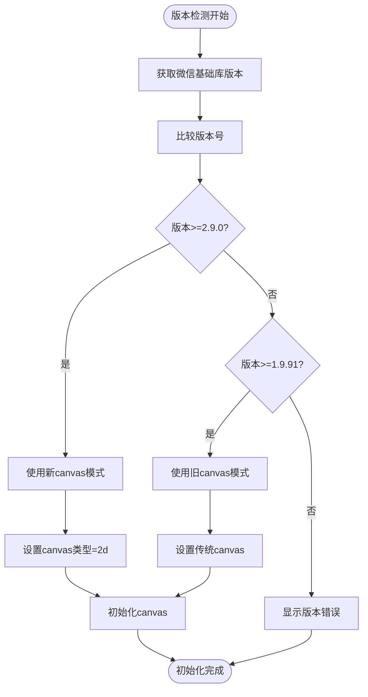

**图表来源**
- [ec-canvas.js:6-29](file://miniprogram/components/ec-canvas/ec-canvas.js#L6-L29)
- [ec-canvas.js:80-108](file://miniprogram/components/ec-canvas/ec-canvas.js#L80-L108)

**章节来源**
- [ec-canvas.js:6-29](file://miniprogram/components/ec-canvas/ec-canvas.js#L6-L29)
- [ec-canvas.js:80-108](file://miniprogram/components/ec-canvas/ec-canvas.js#L80-L108)

## ECharts集成方案

### Canvas平台适配

组件通过自定义Canvas适配器实现ECharts与小程序canvas的桥接：

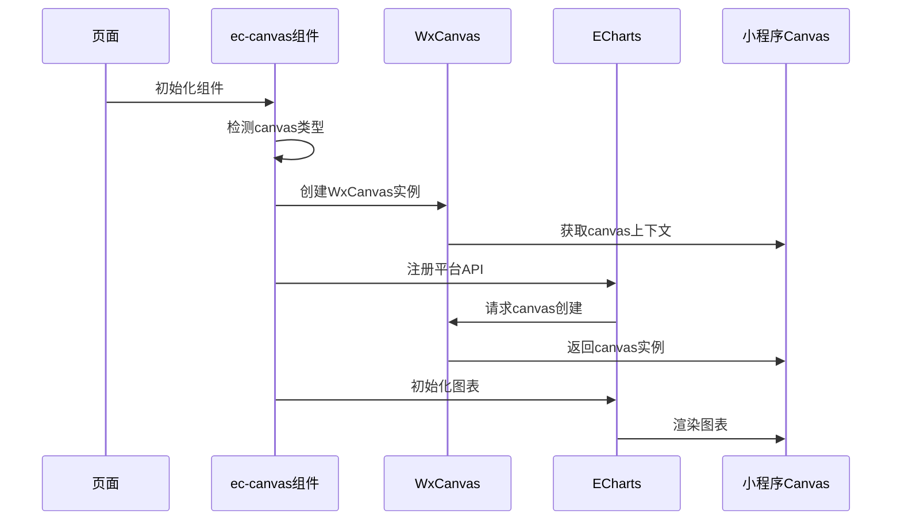

**图表来源**
- [ec-canvas.js:110-141](file://miniprogram/components/ec-canvas/ec-canvas.js#L110-L141)
- [ec-canvas.js:143-192](file://miniprogram/components/ec-canvas/ec-canvas.js#L143-L192)

### 图片加载适配

新版本canvas模式支持更完善的图片加载机制：

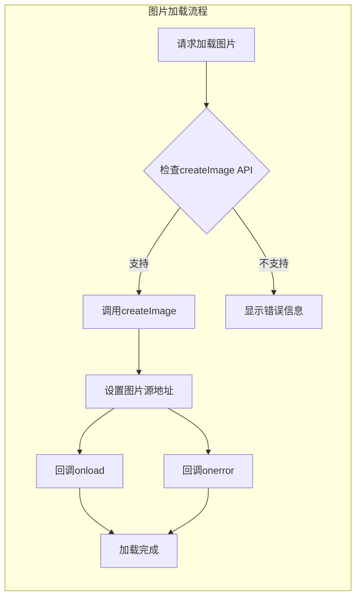

**图表来源**
- [ec-canvas.js:163-174](file://miniprogram/components/ec-canvas/ec-canvas.js#L163-L174)

**章节来源**
- [ec-canvas.js:110-192](file://miniprogram/components/ec-canvas/ec-canvas.js#L110-L192)

## JavaScript逻辑实现

### 初始化流程

组件的初始化过程包含多个关键步骤：

1. **版本检测**：检查微信基础库版本，决定使用新旧canvas模式
2. **Canvas创建**：根据模式创建对应的canvas实例
3. **平台适配**：注册ECharts所需的平台API
4. **图表初始化**：调用用户提供的初始化回调函数

### 触摸事件处理

组件实现了完整的触摸事件映射机制：

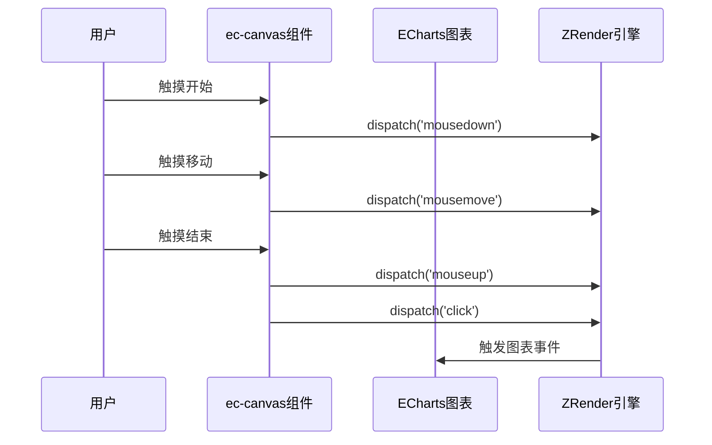

**图表来源**
- [ec-canvas.js:216-273](file://miniprogram/components/ec-canvas/ec-canvas.js#L216-L273)

**章节来源**
- [ec-canvas.js:216-273](file://miniprogram/components/ec-canvas/ec-canvas.js#L216-L273)

## WXML模板结构

### 模板设计原理

ec-canvas组件采用条件渲染的方式，根据canvas类型动态选择不同的模板：

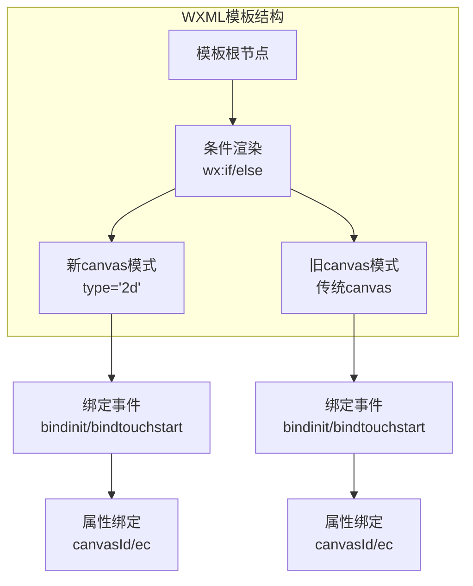

**图表来源**
- [ec-canvas.wxml:1-5](file://miniprogram/components/ec-canvas/ec-canvas.wxml#L1-L5)

### 属性绑定机制

模板中的属性绑定确保了组件与页面数据的双向通信：

- `canvasId`: 指定canvas元素的唯一标识符
- `ec`: 绑定图表配置对象
- `bindinit`: 初始化事件监听
- `bindtouchstart/bindtouchmove/bindtouchend`: 触摸事件处理

**章节来源**
- [ec-canvas.wxml:1-5](file://miniprogram/components/ec-canvas/ec-canvas.wxml#L1-L5)

## WXSS样式设计

### 响应式布局

组件采用绝对定位和全尺寸覆盖的设计：

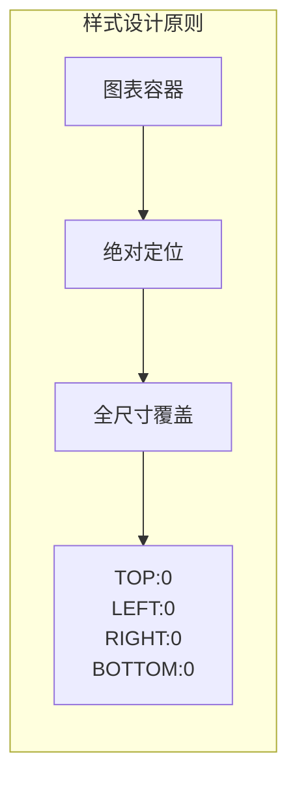

**图表来源**
- [ec-canvas.wxss:1-5](file://miniprogram/components/ec-canvas/ec-canvas.wxss#L1-L5)

### 页面集成样式

在页面中，图表容器采用了更加丰富的视觉设计：

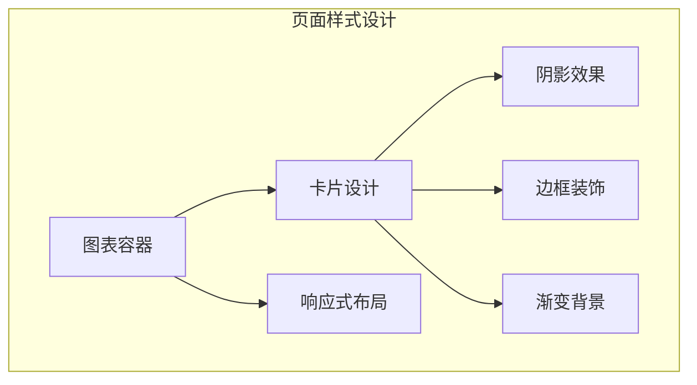

**图表来源**
- [baby-detail.wxss:424-479](file://miniprogram/pages/baby-detail/baby-detail.wxss#L424-L479)

**章节来源**
- [ec-canvas.wxss:1-5](file://miniprogram/components/ec-canvas/ec-canvas.wxss#L1-L5)
- [baby-detail.wxss:424-479](file://miniprogram/pages/baby-detail/baby-detail.wxss#L424-L479)

## 图表渲染流程

### 数据准备阶段

在实际应用中，图表数据通常需要经过预处理：

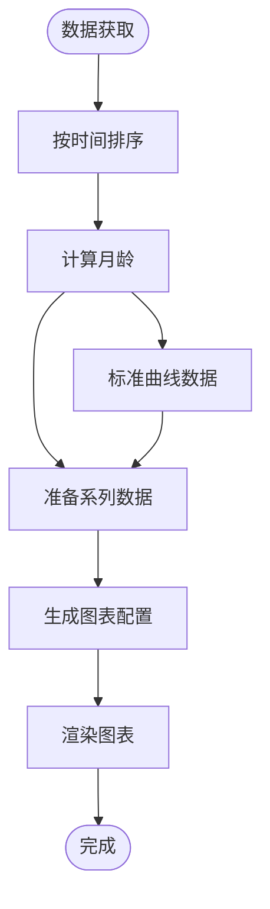

### 图表配置生成

页面中的图表配置包含了丰富的定制选项：

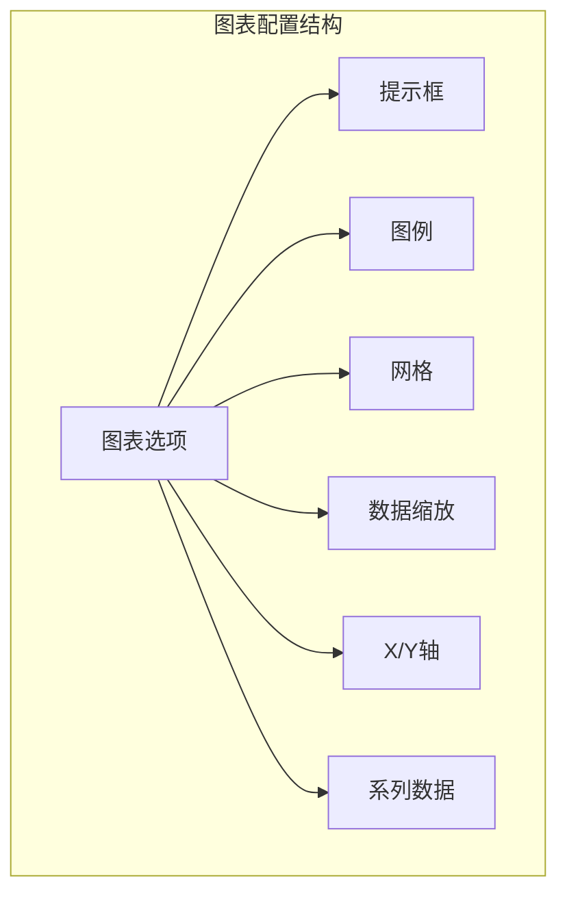

**图表来源**
- [baby-detail.js:6-154](file://miniprogram/pages/baby-detail/baby-detail.js#L6-L154)

**章节来源**
- [baby-detail.js:6-154](file://miniprogram/pages/baby-detail/baby-detail.js#L6-L154)

## 性能优化策略

### 内存管理

组件实现了多项内存优化措施：

1. **延迟初始化**：通过`lazyLoad`属性支持图表的延迟加载
2. **版本适配**：自动选择最优的canvas实现方式
3. **事件清理**：在组件销毁时清理相关资源

### 渲染优化

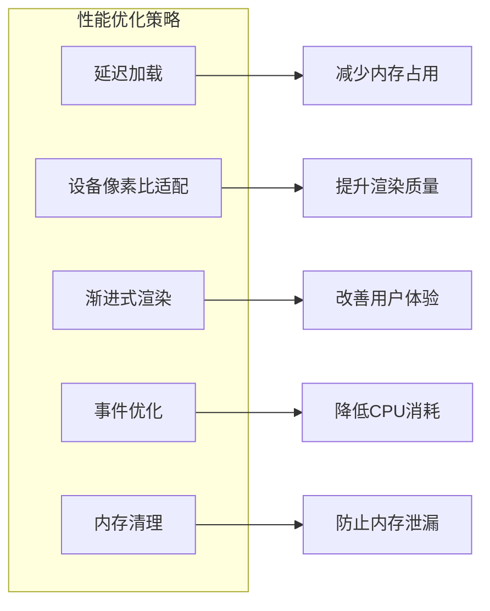

### 最佳实践

- 使用`lazyLoad: true`实现图表的按需加载
- 合理设置`devicePixelRatio`避免过度渲染
- 在图表切换时及时清理不需要的图表实例
- 使用`canvasToTempFilePath`导出图表时注意异步处理

## 数据绑定与动态更新

### 双向数据绑定

组件支持完整的数据绑定机制：

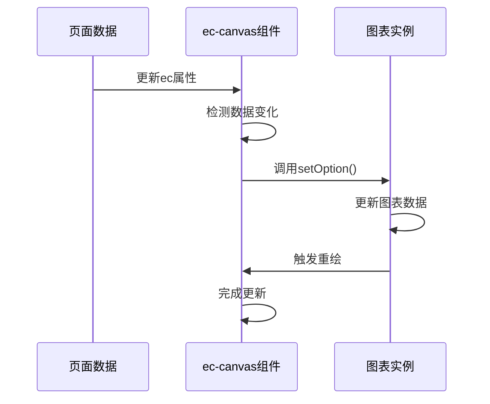

### 动态更新策略

对于频繁更新的数据，建议采用以下策略：

1. **增量更新**：只更新变化的部分数据
2. **节流处理**：限制更新频率
3. **批量处理**：合并多次更新操作

**章节来源**
- [ec-canvas.js:193-214](file://miniprogram/components/ec-canvas/ec-canvas.js#L193-L214)

## 使用示例与最佳实践

### 基础使用方法

在页面中使用ec-canvas组件的基本步骤：

1. **WXML中声明组件**
2. **JS中配置图表数据**
3. **初始化图表实例**
4. **处理用户交互**

### 实际应用场景

在婴儿成长记录应用中，ec-canvas被用于展示身高和体重曲线：

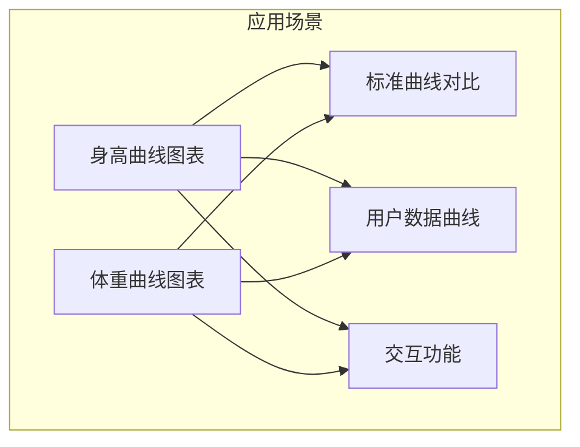

**图表来源**
- [baby-detail.js:323-397](file://miniprogram/pages/baby-detail/baby-detail.js#L323-L397)
- [baby-detail.js:399-473](file://miniprogram/pages/baby-detail/baby-detail.js#L399-L473)

### 配置选项说明

| 选项 | 类型 | 默认值 | 描述 |
|------|------|--------|------|
| canvasId | String | 'ec-canvas' | canvas元素的唯一标识符 |
| ec | Object | {} | 图表配置对象 |
| forceUseOldCanvas | Boolean | false | 强制使用旧版canvas模式 |
| lazyLoad | Boolean | false | 是否启用延迟加载 |

**章节来源**
- [ec-canvas.js:32-46](file://miniprogram/components/ec-canvas/ec-canvas.js#L32-L46)
- [baby-detail.js:162-168](file://miniprogram/pages/baby-detail/baby-detail.js#L162-L168)

## 故障排除指南

### 常见问题及解决方案

1. **版本兼容性问题**
   - 症状：图表无法正常显示
   - 解决：检查微信基础库版本，确保≥1.9.91

2. **触摸事件失效**
   - 症状：图表无法响应用户交互
   - 解决：检查`disableTouch`属性设置

3. **内存泄漏**
   - 症状：页面切换时出现内存占用持续增长
   - 解决：确保及时清理图表实例和事件监听器

4. **渲染性能问题**
   - 症状：图表渲染缓慢或卡顿
   - 解决：启用延迟加载，优化数据量

### 调试技巧

- 使用微信开发者工具的调试功能
- 监控内存使用情况
- 检查控制台错误信息
- 验证canvas尺寸和DPR设置

**章节来源**
- [ec-canvas.js:98-107](file://miniprogram/components/ec-canvas/ec-canvas.js#L98-L107)
- [ec-canvas.js:216-273](file://miniprogram/components/ec-canvas/ec-canvas.js#L216-L273)

## 总结

ec-canvas图表组件为微信小程序提供了一个完整、高效的图表解决方案。通过精心设计的架构和实现，该组件成功解决了小程序环境下ECharts集成的各种技术挑战。

### 核心优势

1. **完全兼容**：支持新旧两种canvas模式，确保广泛的设备兼容性
2. **性能优异**：通过版本检测和优化策略，提供最佳的渲染性能
3. **易于使用**：简洁的API设计和完整的文档支持
4. **功能丰富**：支持各种图表类型和交互功能

### 技术亮点

- 智能版本检测和适配机制
- 完善的触摸事件处理系统
- 高效的内存管理和性能优化
- 灵活的配置选项和扩展能力

该组件不仅满足了当前项目的需求，也为类似的应用场景提供了可靠的参考实现。通过合理使用和优化，可以为用户提供流畅、美观的图表体验。