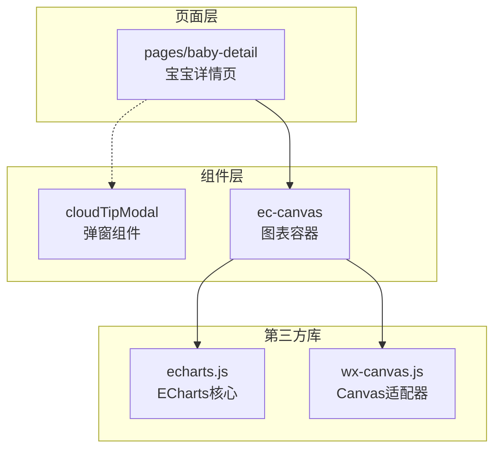
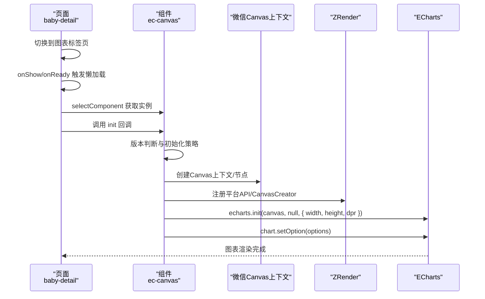
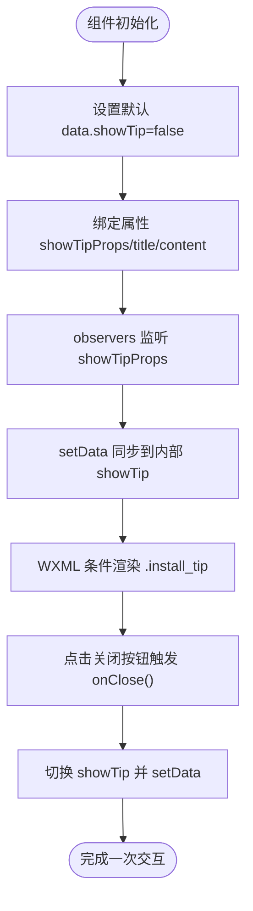
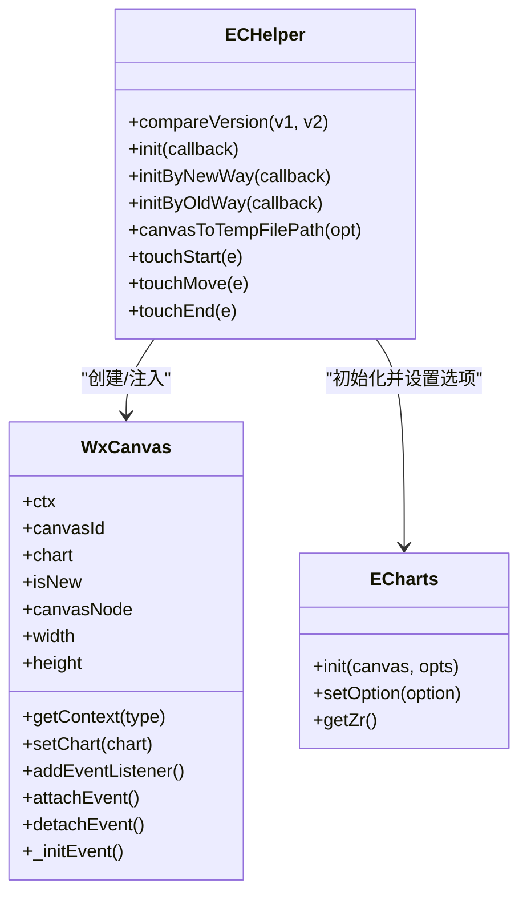
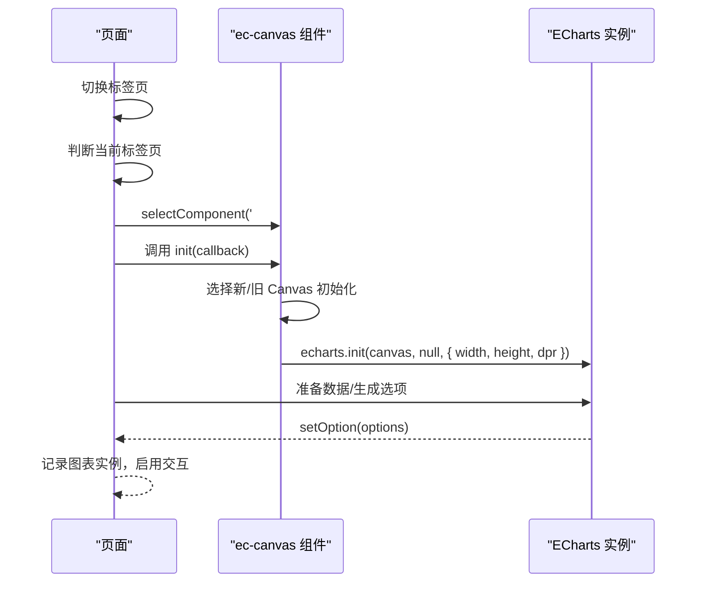
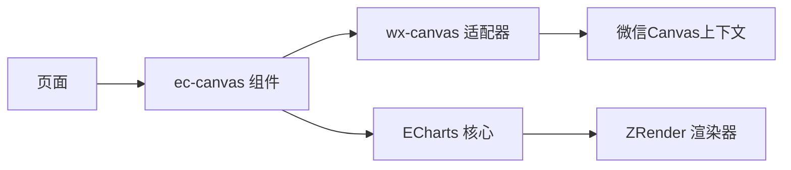

# 组件实现案例

<cite>
**本文档引用的文件**
- [cloudTipModal/index.js](file://miniprogram/components/cloudTipModal/index.js)
- [cloudTipModal/index.json](file://miniprogram/components/cloudTipModal/index.json)
- [cloudTipModal/index.wxml](file://miniprogram/components/cloudTipModal/index.wxml)
- [cloudTipModal/index.wxss](file://miniprogram/components/cloudTipModal/index.wxss)
- [ec-canvas/ec-canvas.js](file://miniprogram/components/ec-canvas/ec-canvas.js)
- [ec-canvas/ec-canvas.json](file://miniprogram/components/ec-canvas/ec-canvas.json)
- [ec-canvas/ec-canvas.wxml](file://miniprogram/components/ec-canvas/ec-canvas.wxml)
- [ec-canvas/ec-canvas.wxss](file://miniprogram/components/ec-canvas/ec-canvas.wxss)
- [ec-canvas/wx-canvas.js](file://miniprogram/components/ec-canvas/wx-canvas.js)
- [ec-canvas/echarts.js](file://miniprogram/components/ec-canvas/echarts.js)
- [pages/baby-detail/baby-detail.js](file://miniprogram/pages/baby-detail/baby-detail.js)
- [pages/baby-detail/baby-detail.wxml](file://miniprogram/pages/baby-detail/baby-detail.wxml)
</cite>

## 目录
1. [简介](#简介)
2. [项目结构](#项目结构)
3. [核心组件](#核心组件)
4. [架构总览](#架构总览)
5. [详细组件分析](#详细组件分析)
6. [依赖分析](#依赖分析)
7. [性能考虑](#性能考虑)
8. [故障排查指南](#故障排查指南)
9. [结论](#结论)
10. [附录](#附录)

## 简介
本文件聚焦于项目中的两个关键自定义组件：cloudTipModal 弹窗组件与 ec-canvas 图表组件。前者用于展示提示信息与交互按钮；后者用于在微信小程序中集成 ECharts，实现图表渲染、手势交互与性能优化。本文将从架构设计、数据流、事件处理、状态管理、性能优化等维度，系统性解析这两个组件的实现，并给出使用方法、扩展建议与调试技巧。

## 项目结构
- 组件目录位于 miniprogram/components 下，分别包含 cloudTipModal 与 ec-canvas 两个子目录。
- 页面 pages/baby-detail 展示了 ec-canvas 的典型用法：在“身高曲线”和“体重曲线”标签页中按需懒加载图表。
- 组件由 JS（逻辑）、WXML（模板）、WXSS（样式）、JSON（配置）四部分组成，遵循微信小程序组件规范。

**图表来源**
- [ec-canvas/ec-canvas.js:1-285](file://miniprogram/components/ec-canvas/ec-canvas.js#L1-L285)
- [ec-canvas/echarts.js:1-46](file://miniprogram/components/ec-canvas/echarts.js#L1-L46)
- [ec-canvas/wx-canvas.js:1-112](file://miniprogram/components/ec-canvas/wx-canvas.js#L1-L112)
- [pages/baby-detail/baby-detail.wxml:88-100](file://miniprogram/pages/baby-detail/baby-detail.wxml#L88-L100)

**章节来源**
- [ec-canvas/ec-canvas.js:1-285](file://miniprogram/components/ec-canvas/ec-canvas.js#L1-L285)
- [pages/baby-detail/baby-detail.wxml:88-100](file://miniprogram/pages/baby-detail/baby-detail.wxml#L88-L100)

## 核心组件
- cloudTipModal：轻量弹窗组件，通过属性驱动显示/隐藏，支持标题与内容展示，提供关闭回调。
- ec-canvas：图表容器组件，负责根据微信基础库版本选择新旧 Canvas 初始化路径，桥接 ECharts 渲染与手势事件，支持懒加载与截图导出。

**章节来源**
- [cloudTipModal/index.js:1-29](file://miniprogram/components/cloudTipModal/index.js#L1-L29)
- [ec-canvas/ec-canvas.js:31-77](file://miniprogram/components/ec-canvas/ec-canvas.js#L31-L77)

## 架构总览
下图展示了页面与组件之间的调用关系以及图表初始化的关键流程：

**图表来源**
- [pages/baby-detail/baby-detail.js:184-191](file://miniprogram/pages/baby-detail/baby-detail.js#L184-L191)
- [pages/baby-detail/baby-detail.js:323-397](file://miniprogram/pages/baby-detail/baby-detail.js#L323-L397)
- [pages/baby-detail/baby-detail.js:399-473](file://miniprogram/pages/baby-detail/baby-detail.js#L399-L473)
- [ec-canvas/ec-canvas.js:79-192](file://miniprogram/components/ec-canvas/ec-canvas.js#L79-L192)
- [ec-canvas/wx-canvas.js:1-112](file://miniprogram/components/ec-canvas/wx-canvas.js#L1-L112)

## 详细组件分析

### cloudTipModal 弹窗组件
- 属性定义
  - showTipProps: Boolean，外部控制显示/隐藏
  - title: String，标题文本
  - content: String，提示内容
- 数据绑定
  - 内部 data.showTip 与外部属性联动，通过 observers 将外部属性变更同步到内部显示状态
- 事件处理
  - onClose：点击关闭按钮时切换内部显示状态
- 状态管理
  - 采用单向数据流：外部通过属性驱动内部状态，内部通过事件回传用户操作结果（如关闭）

**图表来源**
- [cloudTipModal/index.js:6-20](file://miniprogram/components/cloudTipModal/index.js#L6-L20)
- [cloudTipModal/index.wxml:3-10](file://miniprogram/components/cloudTipModal/index.wxml#L3-L10)

**章节来源**
- [cloudTipModal/index.js:1-29](file://miniprogram/components/cloudTipModal/index.js#L1-L29)
- [cloudTipModal/index.wxml:1-11](file://miniprogram/components/cloudTipModal/index.wxml#L1-L11)
- [cloudTipModal/index.wxss:1-60](file://miniprogram/components/cloudTipModal/index.wxss#L1-L60)
- [cloudTipModal/index.json:1-5](file://miniprogram/components/cloudTipModal/index.json#L1-L5)

### ec-canvas 图表组件
- 属性与数据
  - properties: canvasId(String, 默认值), ec(Object), forceUseOldCanvas(Boolean, 默认值)
  - data: isUseNewCanvas(Boolean)，标识当前使用的 Canvas 类型
- 生命周期与初始化
  - ready：注册 ECharts 预处理器（禁用渐进绘制），校验 ec 绑定，若非懒加载则立即 init
  - init：根据微信基础库版本选择新旧 Canvas 初始化路径
    - 新路径（≥2.9.0）：使用 type="2d" 的 canvas 节点，创建 2D 上下文，注入 createImage 支持
    - 旧路径（1.9.91–2.9.0）：使用 wx.createCanvasContext，注入 createCanvas 回调
- 手势与事件桥接
  - touchStart/touchMove/touchEnd：将触摸事件映射为 ECharts/ZRender 事件，支持缩放与拖拽
- 截图导出
  - canvasToTempFilePath：兼容新旧路径，调用 wx.canvasToTempFilePath 导出图片
- 使用方式
  - 在页面中声明 <ec-canvas>，绑定 ec 对象（含 lazyLoad 等配置），在页面生命周期中调用组件实例的 init 方法传入回调，回调内完成 ECharts 初始化与 setOption

**图表来源**
- [ec-canvas/ec-canvas.js:31-275](file://miniprogram/components/ec-canvas/ec-canvas.js#L31-L275)
- [ec-canvas/wx-canvas.js:1-112](file://miniprogram/components/ec-canvas/wx-canvas.js#L1-L112)
- [ec-canvas/echarts.js:1-46](file://miniprogram/components/ec-canvas/echarts.js#L1-L46)

**章节来源**
- [ec-canvas/ec-canvas.js:1-285](file://miniprogram/components/ec-canvas/ec-canvas.js#L1-L285)
- [ec-canvas/ec-canvas.wxml:1-5](file://miniprogram/components/ec-canvas/ec-canvas.wxml#L1-L5)
- [ec-canvas/ec-canvas.wxss:1-5](file://miniprogram/components/ec-canvas/ec-canvas.wxss#L1-L5)
- [ec-canvas/ec-canvas.json:1-4](file://miniprogram/components/ec-canvas/ec-canvas.json#L1-L4)
- [ec-canvas/wx-canvas.js:1-112](file://miniprogram/components/ec-canvas/wx-canvas.js#L1-L112)
- [ec-canvas/echarts.js:1-46](file://miniprogram/components/ec-canvas/echarts.js#L1-L46)

### 页面集成与使用示例（pages/baby-detail）
- 模板中通过 <ec-canvas> 绑定 ec 对象，实现懒加载
- 页面在 onShow/onReady 中根据当前标签页选择性初始化身高或体重图表
- 初始化回调中创建 ECharts 实例、准备数据、生成选项并 setOption
- 支持 dataZoom 内置滑块与最近数据窗口的动态计算

**图表来源**
- [pages/baby-detail/baby-detail.wxml:88-100](file://miniprogram/pages/baby-detail/baby-detail.wxml#L88-L100)
- [pages/baby-detail/baby-detail.js:184-191](file://miniprogram/pages/baby-detail/baby-detail.js#L184-L191)
- [pages/baby-detail/baby-detail.js:323-397](file://miniprogram/pages/baby-detail/baby-detail.js#L323-L397)
- [pages/baby-detail/baby-detail.js:399-473](file://miniprogram/pages/baby-detail/baby-detail.js#L399-L473)

**章节来源**
- [pages/baby-detail/baby-detail.wxml:1-103](file://miniprogram/pages/baby-detail/baby-detail.wxml#L1-L103)
- [pages/baby-detail/baby-detail.js:1-691](file://miniprogram/pages/baby-detail/baby-detail.js#L1-L691)

## 依赖分析
- 组件耦合
  - ec-canvas 依赖 wx-canvas 作为 Canvas 适配器，依赖 echarts.js 提供渲染引擎
  - 页面对 ec-canvas 的依赖通过组件化封装降低耦合度
- 外部依赖
  - 微信基础库版本差异导致的 Canvas 初始化策略分支
  - ECharts 的设备像素比（dpr）与尺寸计算
- 潜在风险
  - 旧 Canvas 路径缺少某些能力（如渐进绘制），需在预处理阶段禁用
  - 手势事件映射依赖 ECharts/ZRender 的事件模型

**图表来源**
- [ec-canvas/ec-canvas.js:1-285](file://miniprogram/components/ec-canvas/ec-canvas.js#L1-L285)
- [ec-canvas/wx-canvas.js:1-112](file://miniprogram/components/ec-canvas/wx-canvas.js#L1-L112)
- [ec-canvas/echarts.js:1-46](file://miniprogram/components/ec-canvas/echarts.js#L1-L46)

**章节来源**
- [ec-canvas/ec-canvas.js:52-66](file://miniprogram/components/ec-canvas/ec-canvas.js#L52-L66)
- [ec-canvas/ec-canvas.js:80-108](file://miniprogram/components/ec-canvas/ec-canvas.js#L80-L108)

## 性能考虑
- 懒加载策略
  - 页面仅在进入图表标签页时初始化图表，避免不必要的资源占用
- 渐进绘制禁用
  - 预处理阶段禁用 series.progressive，规避微信 Canvas drawImage 不支持 DOM 参数的问题
- 设备像素比与尺寸
  - 通过 echarts.init 的 dpr 与 width/height 参数确保高分屏清晰度
- 事件处理
  - 新 Canvas 路径支持 createImage，减少图片加载阻塞
- 交互优化
  - dataZoom 内置滑块与鼠标滚轮事件，结合最近数据窗口限制提升可用性

**章节来源**
- [pages/baby-detail/baby-detail.js:162-167](file://miniprogram/pages/baby-detail/baby-detail.js#L162-L167)
- [pages/baby-detail/baby-detail.js:370-387](file://miniprogram/pages/baby-detail/baby-detail.js#L370-L387)
- [ec-canvas/ec-canvas.js:55-66](file://miniprogram/components/ec-canvas/ec-canvas.js#L55-L66)
- [ec-canvas/ec-canvas.js:153-177](file://miniprogram/components/ec-canvas/ec-canvas.js#L153-L177)

## 故障排查指南
- 组件未绑定 ec
  - 现象：控制台警告“组件需绑定 ec 变量”
  - 排查：确认页面中为 <ec-canvas> 绑定了 ec 对象（如 { lazyLoad: true }）
  - 参考：[ec-canvas/ec-canvas.js:68-72](file://miniprogram/components/ec-canvas/ec-canvas.js#L68-L72)
- 微信基础库版本过低
  - 现象：控制台报错“微信基础库版本过低，需大于等于 1.9.91”
  - 排查：升级微信基础库至 ≥2.9.0 以获得更佳性能与能力
  - 参考：[ec-canvas/ec-canvas.js:99-102](file://miniprogram/components/ec-canvas/ec-canvas.js#L99-L102)
- 无法找到组件实例
  - 现象：selectComponent 返回空
  - 排查：确认 WXML 中 id 与选择器一致，且页面生命周期中已渲染
  - 参考：[pages/baby-detail/baby-detail.js:323-328](file://miniprogram/pages/baby-detail/baby-detail.js#L323-L328)
- 图表不显示或空白
  - 现象：初始化后无渲染
  - 排查：确认 init 回调中已调用 chart.setOption；检查宽高与 dpr 设置
  - 参考：[pages/baby-detail/baby-detail.js:330-336](file://miniprogram/pages/baby-detail/baby-detail.js#L330-L336)
- 手势无效
  - 现象：点击/拖拽/缩放无响应
  - 排查：确认未禁用触摸事件（ec.disableTouch），检查 touchStart/touchMove/touchEnd 绑定
  - 参考：[ec-canvas/ec-canvas.wxml:2-4](file://miniprogram/components/ec-canvas/ec-canvas.wxml#L2-L4)
- 截图导出失败
  - 现象：canvasToTempFilePath 报错
  - 排查：新路径需传入 canvas 节点；旧路径需在 ctx.draw(true, ...) 后再导出
  - 参考：[ec-canvas/ec-canvas.js:193-214](file://miniprogram/components/ec-canvas/ec-canvas.js#L193-L214)

**章节来源**
- [ec-canvas/ec-canvas.js:68-72](file://miniprogram/components/ec-canvas/ec-canvas.js#L68-L72)
- [ec-canvas/ec-canvas.js:99-102](file://miniprogram/components/ec-canvas/ec-canvas.js#L99-L102)
- [pages/baby-detail/baby-detail.js:323-328](file://miniprogram/pages/baby-detail/baby-detail.js#L323-L328)
- [pages/baby-detail/baby-detail.js:330-336](file://miniprogram/pages/baby-detail/baby-detail.js#L330-L336)
- [ec-canvas/ec-canvas.wxml:2-4](file://miniprogram/components/ec-canvas/ec-canvas.wxml#L2-L4)
- [ec-canvas/ec-canvas.js:193-214](file://miniprogram/components/ec-canvas/ec-canvas.js#L193-L214)

## 结论
cloudTipModal 与 ec-canvas 两个组件分别解决了“提示交互”和“图表渲染”的核心需求。前者通过属性驱动与简单事件实现轻量弹窗；后者通过版本感知与 Canvas 适配，将 ECharts 无缝集成到小程序环境中，并提供懒加载、手势交互与截图导出等实用能力。整体实现遵循微信小程序组件规范，具备良好的可维护性与扩展性。

## 附录
- 使用建议
  - 弹窗组件：通过外部属性统一控制显示状态，内部仅负责 UI 与交互反馈
  - 图表组件：优先使用新 Canvas 路径；在页面中按需懒加载；合理设置 dataZoom 与最近窗口以提升体验
- 扩展方向
  - cloudTipModal：增加多按钮、自定义插槽、动画过渡
  - ec-canvas：支持更多 ECharts 主题与插件、导出 PDF、跨端兼容