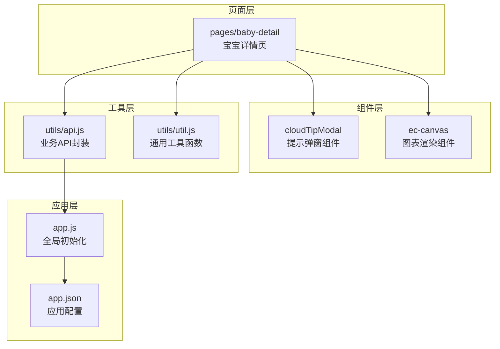
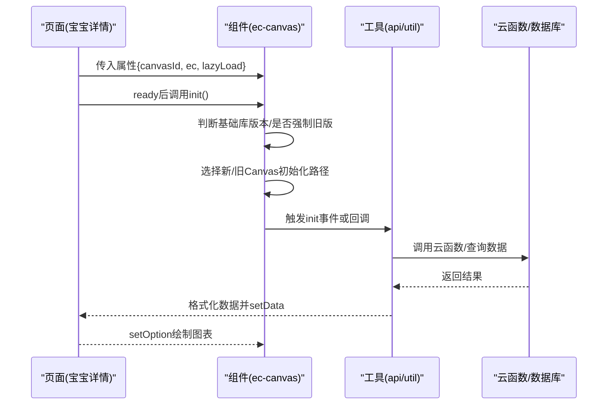
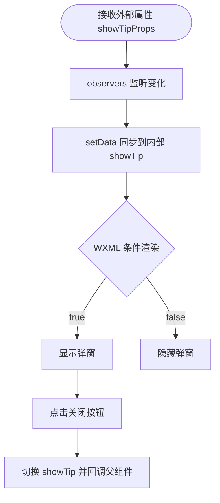
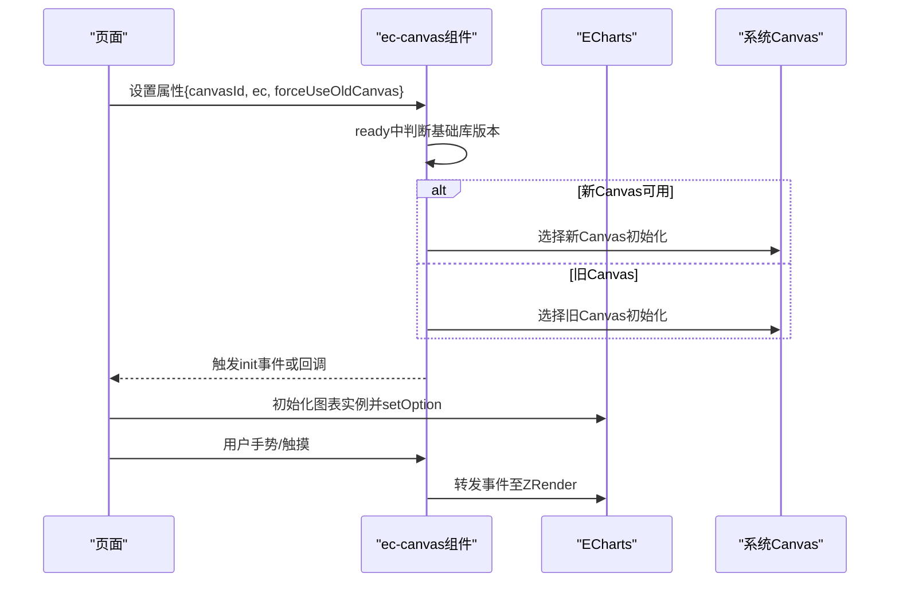
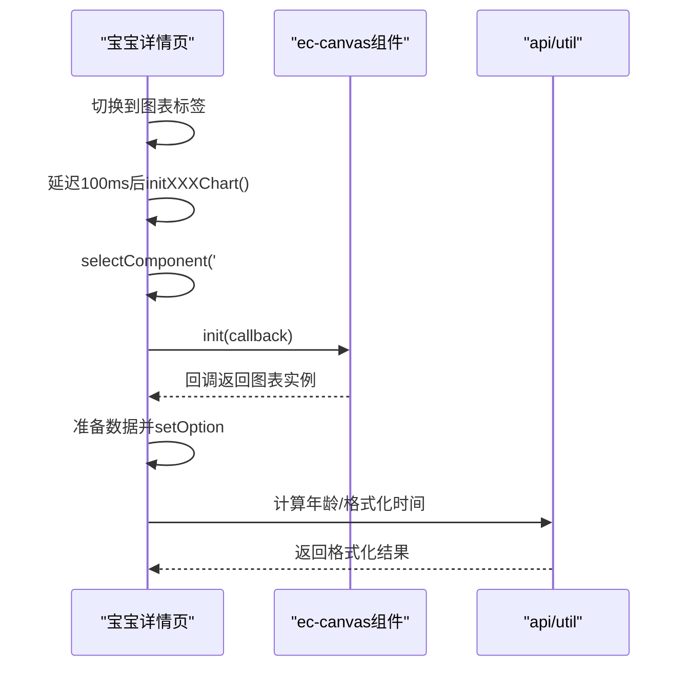
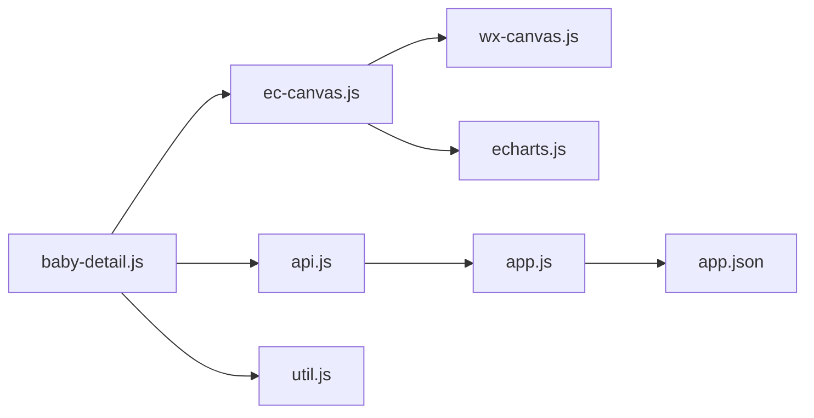
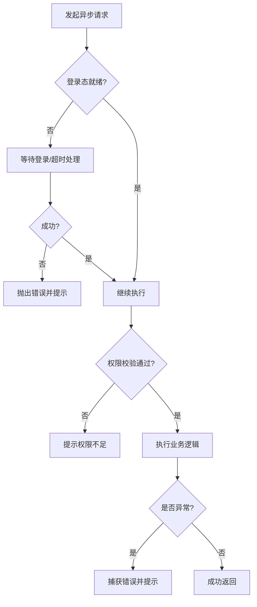

# 组件开发最佳实践

<cite>
**本文引用的文件**   
- [miniprogram/components/cloudTipModal/index.js](file://miniprogram/components/cloudTipModal/index.js)
- [miniprogram/components/cloudTipModal/index.json](file://miniprogram/components/cloudTipModal/index.json)
- [miniprogram/components/cloudTipModal/index.wxml](file://miniprogram/components/cloudTipModal/index.wxml)
- [miniprogram/components/ec-canvas/ec-canvas.js](file://miniprogram/components/ec-canvas/ec-canvas.js)
- [miniprogram/components/ec-canvas/ec-canvas.json](file://miniprogram/components/ec-canvas/ec-canvas.json)
- [miniprogram/components/ec-canvas/ec-canvas.wxml](file://miniprogram/components/ec-canvas/ec-canvas.wxml)
- [miniprogram/pages/baby-detail/baby-detail.js](file://miniprogram/pages/baby-detail/baby-detail.js)
- [miniprogram/utils/api.js](file://miniprogram/utils/api.js)
- [miniprogram/utils/util.js](file://miniprogram/utils/util.js)
- [miniprogram/app.js](file://miniprogram/app.js)
- [miniprogram/app.json](file://miniprogram/app.json)
- [project.config.json](file://project.config.json)
- [package.json](file://package.json)
</cite>

## 目录
1. [简介](#简介)
2. [项目结构](#项目结构)
3. [核心组件](#核心组件)
4. [架构总览](#架构总览)
5. [详细组件分析](#详细组件分析)
6. [依赖关系分析](#依赖关系分析)
7. [性能考量](#性能考量)
8. [故障排查指南](#故障排查指南)
9. [结论](#结论)
10. [附录](#附录)

## 简介
本文件面向微信小程序组件开发，基于仓库现有组件与页面实现，总结可复用组件的设计原则、代码组织结构、接口标准化、错误处理机制、性能优化策略、测试与调试方法、版本与兼容性管理、升级策略，以及常见陷阱与团队协作规范，帮助开发者产出高质量、可维护、可扩展的小程序组件。

## 项目结构
- 组件位于 miniprogram/components 下，采用“目录即组件”的组织方式，每个组件包含 JS、JSON、WXML、WXSS 文件。
- 页面位于 miniprogram/pages 下，页面脚本通过 require 引用工具模块与组件。
- 工具模块位于 miniprogram/utils，封装通用业务与工具函数。
- 应用入口与全局配置位于 app.js、app.json；工程配置位于 project.config.json；包信息位于 package.json。

**图示来源**
- [miniprogram/components/cloudTipModal/index.js:1-29](file://miniprogram/components/cloudTipModal/index.js#L1-L29)
- [miniprogram/components/ec-canvas/ec-canvas.js:1-285](file://miniprogram/components/ec-canvas/ec-canvas.js#L1-L285)
- [miniprogram/pages/baby-detail/baby-detail.js:1-691](file://miniprogram/pages/baby-detail/baby-detail.js#L1-L691)
- [miniprogram/utils/api.js:1-879](file://miniprogram/utils/api.js#L1-L879)
- [miniprogram/utils/util.js:1-55](file://miniprogram/utils/util.js#L1-L55)
- [miniprogram/app.js:1-56](file://miniprogram/app.js#L1-L56)
- [miniprogram/app.json:1-39](file://miniprogram/app.json#L1-L39)

**章节来源**
- [miniprogram/app.json:1-39](file://miniprogram/app.json#L1-L39)
- [project.config.json:1-85](file://project.config.json#L1-L85)

## 核心组件
- 提示弹窗组件 cloudTipModal：提供受控显示/隐藏、标题与内容透传、关闭回调等能力，适合跨页面复用。
- 图表渲染组件 ec-canvas：封装 ECharts 初始化、Canvas 版本兼容、触摸事件桥接、截图导出等，适合作为通用图表容器。

**章节来源**
- [miniprogram/components/cloudTipModal/index.js:1-29](file://miniprogram/components/cloudTipModal/index.js#L1-L29)
- [miniprogram/components/cloudTipModal/index.json:1-5](file://miniprogram/components/cloudTipModal/index.json#L1-L5)
- [miniprogram/components/cloudTipModal/index.wxml:1-11](file://miniprogram/components/cloudTipModal/index.wxml#L1-L11)
- [miniprogram/components/ec-canvas/ec-canvas.js:1-285](file://miniprogram/components/ec-canvas/ec-canvas.js#L1-L285)
- [miniprogram/components/ec-canvas/ec-canvas.json:1-4](file://miniprogram/components/ec-canvas/ec-canvas.json#L1-L4)
- [miniprogram/components/ec-canvas/ec-canvas.wxml:1-5](file://miniprogram/components/ec-canvas/ec-canvas.wxml#L1-L5)

## 架构总览
- 页面通过 selectComponent 获取组件实例，向组件传递属性与回调，组件通过 setData/triggerEvent 与页面通信。
- 业务 API 封装在 utils/api.js 中，统一处理登录态、权限校验、调用云函数与数据库。
- 应用在 app.js 中初始化云能力与登录流程，供各页面与组件共享。

**图示来源**
- [miniprogram/pages/baby-detail/baby-detail.js:323-397](file://miniprogram/pages/baby-detail/baby-detail.js#L323-L397)
- [miniprogram/components/ec-canvas/ec-canvas.js:79-192](file://miniprogram/components/ec-canvas/ec-canvas.js#L79-L192)
- [miniprogram/utils/api.js:1-879](file://miniprogram/utils/api.js#L1-L879)

## 详细组件分析

### 提示弹窗组件 cloudTipModal
- 设计要点
  - 受控展示：通过外部传入布尔属性控制显示，内部仅同步到 data，避免自管理状态。
  - 接口简洁：提供标题、内容、关闭回调，职责单一。
  - 结构清晰：WXML 条件渲染，样式独立，便于主题定制。
- 数据流
  - 外部设置 showTipProps → 组件 observers 同步到 showTip → WXML 条件渲染。
  - 关闭按钮触发 onClose → 内部切换 showTip 并回传给父组件。

**图示来源**
- [miniprogram/components/cloudTipModal/index.js:14-26](file://miniprogram/components/cloudTipModal/index.js#L14-L26)
- [miniprogram/components/cloudTipModal/index.wxml:3-10](file://miniprogram/components/cloudTipModal/index.wxml#L3-L10)

**章节来源**
- [miniprogram/components/cloudTipModal/index.js:1-29](file://miniprogram/components/cloudTipModal/index.js#L1-L29)
- [miniprogram/components/cloudTipModal/index.json:1-5](file://miniprogram/components/cloudTipModal/index.json#L1-L5)
- [miniprogram/components/cloudTipModal/index.wxml:1-11](file://miniprogram/components/cloudTipModal/index.wxml#L1-L11)

### 图表渲染组件 ec-canvas
- 设计要点
  - 版本兼容：根据基础库版本选择新旧 Canvas 初始化路径，支持强制回退。
  - 事件桥接：将触摸事件映射到 ECharts ZRender，支持缩放与手势。
  - 懒加载：支持延迟初始化，减少首屏开销。
  - 导出能力：提供截图导出接口，兼容新旧 Canvas。
- 关键流程
  - ready 阶段注册预处理器、校验 ec 绑定、决定初始化路径。
  - 初始化完成后触发 init 事件或回调，页面注入图表配置。
  - 交互阶段转发触摸事件至 ECharts，实现缩放与平移。

**图示来源**
- [miniprogram/components/ec-canvas/ec-canvas.js:52-108](file://miniprogram/components/ec-canvas/ec-canvas.js#L52-L108)
- [miniprogram/components/ec-canvas/ec-canvas.js:143-192](file://miniprogram/components/ec-canvas/ec-canvas.js#L143-L192)
- [miniprogram/components/ec-canvas/ec-canvas.wxml:2-4](file://miniprogram/components/ec-canvas/ec-canvas.wxml#L2-L4)

**章节来源**
- [miniprogram/components/ec-canvas/ec-canvas.js:1-285](file://miniprogram/components/ec-canvas/ec-canvas.js#L1-L285)
- [miniprogram/components/ec-canvas/ec-canvas.json:1-4](file://miniprogram/components/ec-canvas/ec-canvas.json#L1-L4)
- [miniprogram/components/ec-canvas/ec-canvas.wxml:1-5](file://miniprogram/components/ec-canvas/ec-canvas.wxml#L1-L5)

### 页面对组件的使用示例（宝宝详情页）
- 页面通过 selectComponent 获取组件实例，传入懒加载配置与初始化回调，完成图表绘制。
- 页面在切换标签时按需初始化图表，避免不必要的初始化开销。

**图示来源**
- [miniprogram/pages/baby-detail/baby-detail.js:323-397](file://miniprogram/pages/baby-detail/baby-detail.js#L323-L397)
- [miniprogram/utils/util.js:1-55](file://miniprogram/utils/util.js#L1-L55)
- [miniprogram/utils/api.js:1-879](file://miniprogram/utils/api.js#L1-L879)

**章节来源**
- [miniprogram/pages/baby-detail/baby-detail.js:1-691](file://miniprogram/pages/baby-detail/baby-detail.js#L1-L691)
- [miniprogram/utils/util.js:1-55](file://miniprogram/utils/util.js#L1-L55)
- [miniprogram/utils/api.js:1-879](file://miniprogram/utils/api.js#L1-L879)

## 依赖关系分析
- 组件依赖
  - ec-canvas 依赖 WxCanvas 与 ECharts，负责 Canvas 初始化与事件桥接。
  - cloudTipModal 依赖外部传入属性与 observers，不直接依赖业务层。
- 页面依赖
  - 宝宝详情页依赖 ec-canvas、api、util，完成数据加载、权限校验与图表渲染。
- 工具依赖
  - api 封装登录态等待、权限检查、云函数调用与数据库访问。
  - util 提供日期计算与格式化等通用能力。
- 应用依赖
  - app.js 初始化云环境与登录流程，供全局使用。

**图示来源**
- [miniprogram/components/ec-canvas/ec-canvas.js:1-2](file://miniprogram/components/ec-canvas/ec-canvas.js#L1-L2)
- [miniprogram/pages/baby-detail/baby-detail.js:1-6](file://miniprogram/pages/baby-detail/baby-detail.js#L1-L6)
- [miniprogram/utils/api.js:1-1](file://miniprogram/utils/api.js#L1-L1)
- [miniprogram/app.js:1-1](file://miniprogram/app.js#L1-L1)
- [miniprogram/app.json:1-1](file://miniprogram/app.json#L1-L1)

**章节来源**
- [miniprogram/components/ec-canvas/ec-canvas.js:1-285](file://miniprogram/components/ec-canvas/ec-canvas.js#L1-L285)
- [miniprogram/pages/baby-detail/baby-detail.js:1-691](file://miniprogram/pages/baby-detail/baby-detail.js#L1-L691)
- [miniprogram/utils/api.js:1-879](file://miniprogram/utils/api.js#L1-L879)
- [miniprogram/app.js:1-56](file://miniprogram/app.js#L1-L56)

## 性能考量
- 懒加载与按需初始化
  - ec-canvas 支持 lazyLoad，页面在进入图表标签后再初始化，降低首屏压力。
  - 页面在 onReady 中延迟短时间再初始化，避免布局未完成导致尺寸异常。
- Canvas 版本选择
  - 自动检测基础库版本，优先使用新 Canvas；在满足条件时才回退旧方案，兼顾性能与稳定性。
- 数据处理与渲染
  - 页面侧先聚合数据、计算年龄与格式化字符串，再传入组件，减少组件内重复计算。
- 事件与交互
  - 通过事件桥接将触摸事件映射到 ECharts，避免直接操作 DOM，提升兼容性与性能。

**章节来源**
- [miniprogram/components/ec-canvas/ec-canvas.js:74-77](file://miniprogram/components/ec-canvas/ec-canvas.js#L74-L77)
- [miniprogram/pages/baby-detail/baby-detail.js:184-191](file://miniprogram/pages/baby-detail/baby-detail.js#L184-L191)

## 故障排查指南
- 登录态与权限问题
  - 使用 waitForLogin 等待登录完成，超时则抛出错误；权限不足时提示用户。
  - 页面在关键操作前调用 checkPermission 进行权限校验。
- Canvas 初始化失败
  - 当未绑定 ec 或基础库过低时，组件会输出警告/错误日志；建议升级基础库版本。
- 图表无数据或渲染异常
  - 确认页面传入的 records 是否为空，必要时提供默认值；检查坐标轴区间与数据点是否为整数。
- 错误处理与提示
  - 页面在异步操作失败时统一使用 toast 提示，避免静默失败。

**图示来源**
- [miniprogram/utils/api.js:14-41](file://miniprogram/utils/api.js#L14-L41)
- [miniprogram/pages/baby-detail/baby-detail.js:54-92](file://miniprogram/pages/baby-detail/baby-detail.js#L54-L92)

**章节来源**
- [miniprogram/utils/api.js:1-879](file://miniprogram/utils/api.js#L1-L879)
- [miniprogram/pages/baby-detail/baby-detail.js:1-691](file://miniprogram/pages/baby-detail/baby-detail.js#L1-L691)

## 结论
本项目组件遵循“单一职责、受控状态、接口清晰、兼容性优先”的设计原则，结合懒加载与版本检测策略，在保证功能完整性的同时兼顾性能与可维护性。建议在后续迭代中进一步完善单元测试、文档与规范约束，持续提升组件复用度与团队协作效率。

## 附录

### 组件设计原则与规范
- 可复用性
  - 属性驱动：通过 properties 与 events 对外暴露能力，避免内部状态耦合。
  - 模块化：将通用逻辑抽离为工具函数或独立模块，降低页面与组件复杂度。
- 接口标准化
  - 统一命名：属性、事件、回调命名保持一致风格，便于识别与维护。
  - 文档化：为每个组件提供简要说明、属性清单、事件说明与使用示例。
- 错误处理机制
  - 明确边界：在组件内对非法输入进行校验与提示，避免向上传递脏数据。
  - 日志与回退：在关键分支输出日志，并提供安全回退路径。
- 性能优化策略
  - 懒加载：对重型组件或资源密集型操作采用延迟初始化。
  - 版本兼容：自动检测运行环境，选择最优实现路径。
  - 渲染优化：减少 setData 次数与数据体积，避免不必要的重绘。

### 测试方法与调试技巧
- 单元测试
  - 对工具函数与纯函数（如日期计算）编写测试用例，覆盖边界场景。
- 集成测试
  - 在页面中模拟组件行为，验证属性传递、事件回调与渲染结果。
- 调试技巧
  - 使用微信开发者工具断点与日志定位问题；利用基础库版本差异进行回归测试。
  - 对网络请求与权限校验增加重试与降级策略，提升鲁棒性。

### 版本管理、兼容性与升级策略
- 版本管理
  - 使用 package.json 管理项目版本，组件版本建议与业务版本解耦，必要时单独发布。
- 兼容性处理
  - 通过基础库版本检测与特性开关，保证在不同版本下稳定运行。
- 升级策略
  - 逐步迁移：先在非关键路径验证新实现，再推广到全量。
  - 回滚预案：保留旧实现与降级开关，确保升级失败可快速回退。

### 常见陷阱与避免方法
- 陷阱：在组件内自行管理复杂状态
  - 避免：组件内部维护过多内部状态，导致难以复用。
  - 建议：将状态上移至页面或更高层，组件仅负责渲染与事件转发。
- 陷阱：忽略基础库差异
  - 避免：直接使用新 API 导致旧版本崩溃。
  - 建议：在初始化阶段做版本检测与降级处理。
- 陷阱：未处理空数据与异常
  - 避免：空数据导致图表渲染异常或页面崩溃。
  - 建议：在组件与页面两端均做好兜底与提示。

### 团队协作规范
- 代码规范
  - 统一命名与注释风格，组件与页面文件命名清晰、目录结构一致。
- 文档规范
  - 组件 README 包含用途、属性、事件、示例与注意事项。
- 提交规范
  - 每次变更附带测试用例与变更说明，确保可追溯与可验证。

**章节来源**
- [package.json:1-22](file://package.json#L1-L22)
- [project.config.json:1-85](file://project.config.json#L1-L85)
- [miniprogram/app.js:1-56](file://miniprogram/app.js#L1-L56)