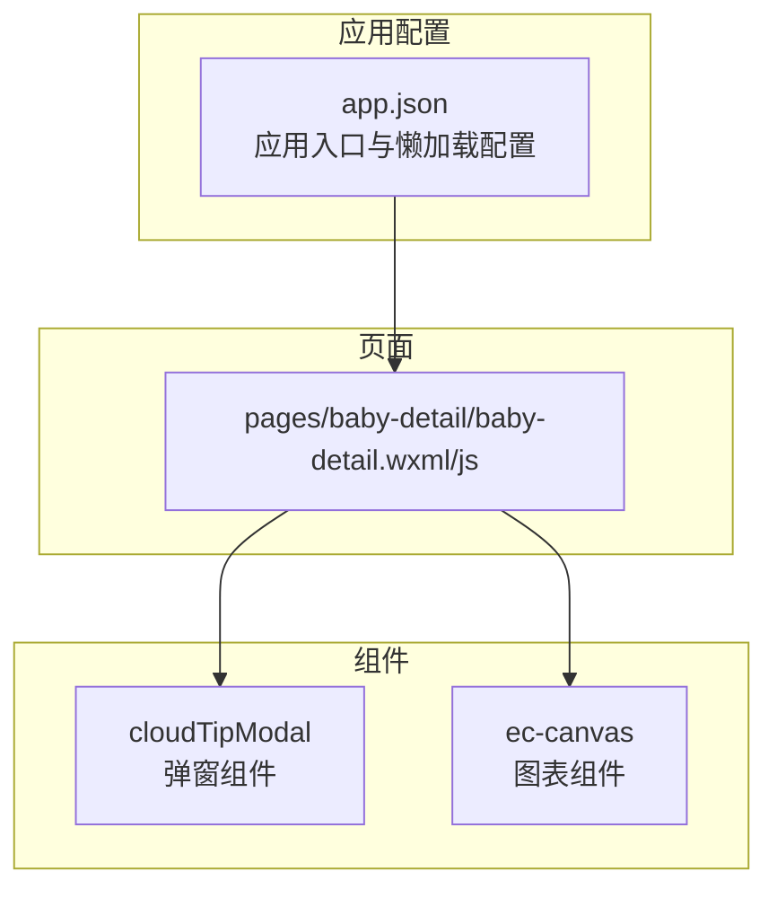
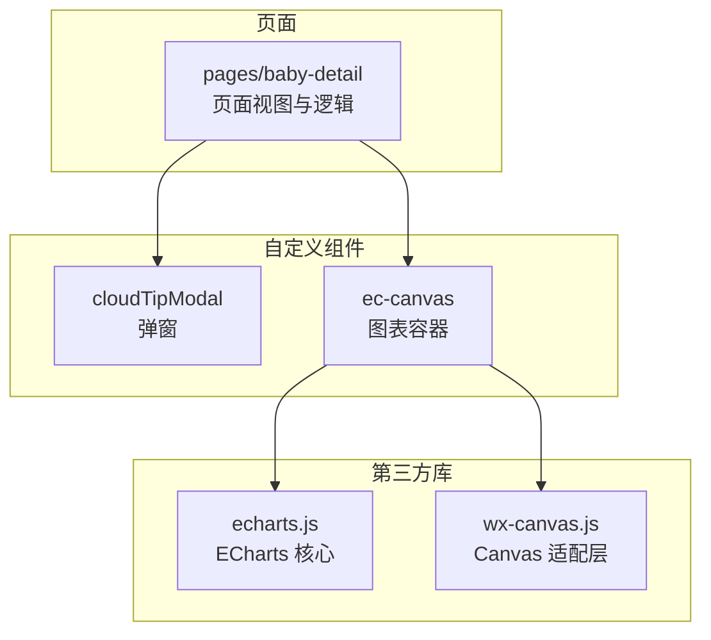
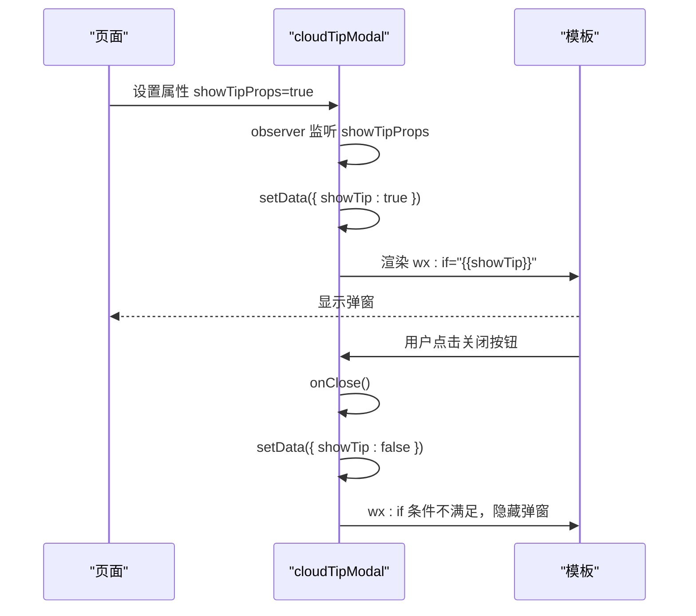
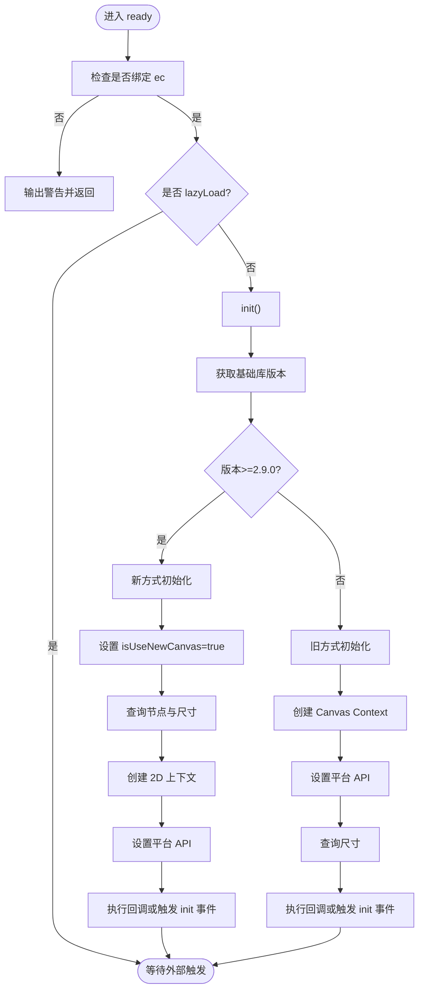
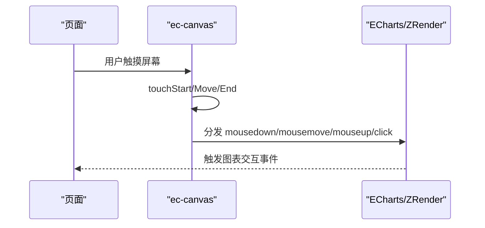
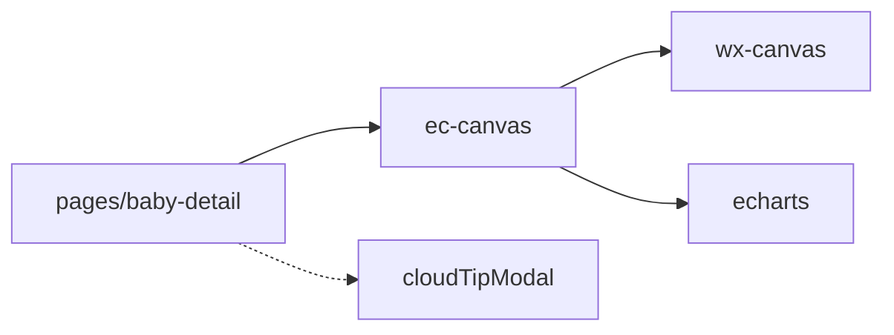

# 自定义组件开发

<cite>
**本文档引用的文件**
- [cloudTipModal/index.js](file://miniprogram/components/cloudTipModal/index.js)
- [cloudTipModal/index.json](file://miniprogram/components/cloudTipModal/index.json)
- [cloudTipModal/index.wxml](file://miniprogram/components/cloudTipModal/index.wxml)
- [cloudTipModal/index.wxss](file://miniprogram/components/cloudTipModal/index.wxss)
- [ec-canvas/ec-canvas.js](file://miniprogram/components/ec-canvas/ec-canvas.js)
- [ec-canvas/ec-canvas.json](file://miniprogram/components/ec-canvas/ec-canvas.json)
- [ec-canvas/ec-canvas.wxml](file://miniprogram/components/ec-canvas/ec-canvas.wxml)
- [ec-canvas/ec-canvas.wxss](file://miniprogram/components/ec-canvas/ec-canvas.wxss)
- [ec-canvas/wx-canvas.js](file://miniprogram/components/ec-canvas/wx-canvas.js)
- [ec-canvas/echarts.js](file://miniprogram/components/ec-canvas/echarts.js)
- [pages/baby-detail/baby-detail.wxml](file://miniprogram/pages/baby-detail/baby-detail.wxml)
- [pages/baby-detail/baby-detail.js](file://miniprogram/pages/baby-detail/baby-detail.js)
- [app.json](file://miniprogram/app.json)
</cite>

## 目录
1. [简介](#简介)
2. [项目结构](#项目结构)
3. [核心组件](#核心组件)
4. [架构总览](#架构总览)
5. [详细组件分析](#详细组件分析)
6. [依赖关系分析](#依赖关系分析)
7. [性能考量](#性能考量)
8. [故障排查指南](#故障排查指南)
9. [结论](#结论)
10. [附录](#附录)

## 简介
本文件面向微信小程序自定义组件开发，系统讲解组件设计与实现方法，涵盖生命周期、属性定义、事件处理、样式隔离等核心概念，并结合项目中的两个典型组件进行深入分析：cloudTipModal 弹窗组件与 ec-canvas 图表组件。文档同时提供组件复用策略、扩展方法、最佳实践（解耦、可测试性、文档编写）以及性能优化建议，帮助开发者独立开发与维护高质量的小程序组件。

## 项目结构
项目采用按功能模块组织的目录结构，自定义组件位于 miniprogram/components 下，页面位于 miniprogram/pages 下，应用级配置位于 app.json。组件以“文件夹 + 多文件”的形式组织，便于封装与复用。

**图表来源**
- [app.json:1-39](file://miniprogram/app.json#L1-L39)
- [pages/baby-detail/baby-detail.wxml:90-97](file://miniprogram/pages/baby-detail/baby-detail.wxml#L90-L97)

**章节来源**
- [app.json:1-39](file://miniprogram/app.json#L1-L39)

## 核心组件
本节概述项目中的两个核心自定义组件及其职责与交互方式。

- cloudTipModal 弹窗组件
  - 职责：提供可配置标题与内容的弹窗展示，支持通过属性控制显示状态，内部通过观察者同步显示状态，提供关闭事件。
  - 关键点：属性 showTipProps 控制显示；observer 将属性变化映射到内部 data；模板中通过 wx:if 条件渲染；样式采用绝对定位与圆角设计。

- ec-canvas 图表组件
  - 职责：封装 ECharts 在小程序中的渲染与交互，自动适配新旧 Canvas API，提供初始化、触控事件转发、截图导出等能力。
  - 关键点：属性 canvasId、ec、forceUseOldCanvas；ready 生命周期注册预处理器；根据基础库版本选择新旧初始化路径；提供 canvasToTempFilePath 截图；转发触摸事件到 ECharts ZRender。

**章节来源**
- [cloudTipModal/index.js:1-29](file://miniprogram/components/cloudTipModal/index.js#L1-L29)
- [cloudTipModal/index.wxml:1-11](file://miniprogram/components/cloudTipModal/index.wxml#L1-L11)
- [cloudTipModal/index.wxss:1-60](file://miniprogram/components/cloudTipModal/index.wxss#L1-L60)
- [ec-canvas/ec-canvas.js:31-275](file://miniprogram/components/ec-canvas/ec-canvas.js#L31-L275)

## 架构总览
下图展示了页面与两个自定义组件之间的关系，以及 ec-canvas 组件内部对 ECharts 的集成方式。

**图表来源**
- [pages/baby-detail/baby-detail.wxml:90-97](file://miniprogram/pages/baby-detail/baby-detail.wxml#L90-L97)
- [ec-canvas/ec-canvas.js:1-285](file://miniprogram/components/ec-canvas/ec-canvas.js#L1-L285)
- [ec-canvas/echarts.js:1-46](file://miniprogram/components/ec-canvas/echarts.js#L1-L46)
- [ec-canvas/wx-canvas.js:1-112](file://miniprogram/components/ec-canvas/wx-canvas.js#L1-L112)

## 详细组件分析

### cloudTipModal 弹窗组件
- 设计要点
  - 属性定义：showTipProps(Boolean)、title(String)、content(String)，用于控制显示与展示内容。
  - 观察者：showTipProps 变化时同步更新内部 showTip，实现单向数据流。
  - 模板渲染：通过 wx:if="{{showTip}}" 条件渲染，避免不必要的节点创建。
  - 事件处理：模板中绑定关闭 tap 事件，触发组件方法 onClose 切换显示状态。
  - 样式隔离：采用类名与定位实现弹窗背景与内容区域，圆角与内边距提升视觉体验。

- 使用流程（序列图）

**图表来源**
- [cloudTipModal/index.js:14-26](file://miniprogram/components/cloudTipModal/index.js#L14-L26)
- [cloudTipModal/index.wxml:3-6](file://miniprogram/components/cloudTipModal/index.wxml#L3-L6)

- 开发模式与最佳实践
  - 单向数据流：通过属性驱动内部状态，避免直接修改外部传入值。
  - 事件回调：对外暴露简单事件（如关闭），由父页面决定后续行为。
  - 样式隔离：组件内部样式不污染外部，通过类名与定位实现布局。
  - 可复用性：属性化配置，减少页面重复代码。

**章节来源**
- [cloudTipModal/index.js:1-29](file://miniprogram/components/cloudTipModal/index.js#L1-L29)
- [cloudTipModal/index.json:1-5](file://miniprogram/components/cloudTipModal/index.json#L1-L5)
- [cloudTipModal/index.wxml:1-11](file://miniprogram/components/cloudTipModal/index.wxml#L1-L11)
- [cloudTipModal/index.wxss:1-60](file://miniprogram/components/cloudTipModal/index.wxss#L1-L60)

### ec-canvas 图表组件
- 设计要点
  - 属性配置：canvasId(String)、ec(Object)、forceUseOldCanvas(Boolean)，用于标识画布、注入图表配置与强制使用旧版 Canvas。
  - 生命周期：ready 中注册 ECharts 预处理器，禁用渐进渲染；若未绑定 ec，则输出警告；若未开启延迟加载则立即初始化。
  - 版本适配：比较基础库版本，优先使用新 Canvas(type="2d")，否则回退到旧 Canvas API；当强制使用旧 Canvas 且可用新版本时给出警告。
  - 初始化策略：
    - 新方式：通过 selectorQuery 获取节点与尺寸，创建 2D 上下文，设置平台 API，调用回调或触发 init 事件返回上下文与尺寸。
    - 旧方式：使用 wx.createCanvasContext 创建上下文，设置平台 API，查询尺寸后调用回调或触发 init 事件。
  - 触控事件：将触摸事件转换为 ZRender 事件，支持拖拽、缩放手势。
  - 截图导出：根据当前 Canvas 类型选择不同导出路径，兼容新旧 API。
  - 内部适配：wx-canvas.js 提供统一的 Canvas 接口，屏蔽新旧差异；echarts.js 为打包后的 ECharts 核心。

- 初始化流程（流程图）

**图表来源**
- [ec-canvas/ec-canvas.js:52-108](file://miniprogram/components/ec-canvas/ec-canvas.js#L52-L108)
- [ec-canvas/ec-canvas.js:110-192](file://miniprogram/components/ec-canvas/ec-canvas.js#L110-L192)
- [ec-canvas/ec-canvas.js:193-214](file://miniprogram/components/ec-canvas/ec-canvas.js#L193-L214)

- 触控事件转发（序列图）

**图表来源**
- [ec-canvas/ec-canvas.js:216-273](file://miniprogram/components/ec-canvas/ec-canvas.js#L216-L273)
- [ec-canvas/wx-canvas.js:65-92](file://miniprogram/components/ec-canvas/wx-canvas.js#L65-L92)

- 页面使用示例
  - 页面中通过自定义标签引入 ec-canvas，并绑定 ec 配置对象与 canvasId。
  - 页面逻辑中引入 ECharts 并在回调中初始化图表实例。

**章节来源**
- [ec-canvas/ec-canvas.js:31-275](file://miniprogram/components/ec-canvas/ec-canvas.js#L31-L275)
- [ec-canvas/ec-canvas.json:1-4](file://miniprogram/components/ec-canvas/ec-canvas.json#L1-L4)
- [ec-canvas/ec-canvas.wxml:1-5](file://miniprogram/components/ec-canvas/ec-canvas.wxml#L1-L5)
- [ec-canvas/ec-canvas.wxss:1-5](file://miniprogram/components/ec-canvas/ec-canvas.wxss#L1-L5)
- [ec-canvas/wx-canvas.js:1-112](file://miniprogram/components/ec-canvas/wx-canvas.js#L1-L112)
- [ec-canvas/echarts.js:1-46](file://miniprogram/components/ec-canvas/echarts.js#L1-L46)
- [pages/baby-detail/baby-detail.wxml:90-97](file://miniprogram/pages/baby-detail/baby-detail.wxml#L90-L97)
- [pages/baby-detail/baby-detail.js:3](file://miniprogram/pages/baby-detail/baby-detail.js#L3)

## 依赖关系分析
- 组件与页面
  - 页面 pages/baby-detail 通过自定义标签使用 ec-canvas 组件，传入 canvasId 与 ec 配置。
  - 页面未直接使用 cloudTipModal，但该组件作为通用弹窗可被其他页面复用。
- 组件内部依赖
  - ec-canvas 依赖 wx-canvas 适配层与 echarts 核心库，实现跨版本 Canvas 兼容与图表渲染。
- 应用级配置
  - app.json 启用懒加载 requiredComponents，有利于按需加载自定义组件，降低首屏体积。

**图表来源**
- [pages/baby-detail/baby-detail.wxml:90-97](file://miniprogram/pages/baby-detail/baby-detail.wxml#L90-L97)
- [ec-canvas/ec-canvas.js:1-285](file://miniprogram/components/ec-canvas/ec-canvas.js#L1-L285)
- [ec-canvas/wx-canvas.js:1-112](file://miniprogram/components/ec-canvas/wx-canvas.js#L1-L112)
- [ec-canvas/echarts.js:1-46](file://miniprogram/components/ec-canvas/echarts.js#L1-L46)
- [app.json:38](file://miniprogram/app.json#L38)

**章节来源**
- [app.json:38](file://miniprogram/app.json#L38)

## 性能考量
- 懒加载与按需引入
  - 应用启用 requiredComponents 懒加载，仅在页面实际使用时加载自定义组件，减少首屏资源占用。
- Canvas 版本选择
  - 优先使用新 Canvas(type="2d")，具备更好的性能与能力；在基础库较低时回退旧 Canvas，同时给出升级建议。
- 渐进渲染禁用
  - 在组件初始化前禁用 ECharts 渐进渲染，避免 drawImage 不支持 DOM 导致的问题。
- 触控事件优化
  - 将触摸事件转换为 ZRender 事件，减少重复计算，提高交互响应速度。
- 截图导出
  - 根据当前 Canvas 类型选择最优导出路径，避免额外的上下文切换开销。

**章节来源**
- [app.json:38](file://miniprogram/app.json#L38)
- [ec-canvas/ec-canvas.js:55-66](file://miniprogram/components/ec-canvas/ec-canvas.js#L55-L66)
- [ec-canvas/ec-canvas.js:88-107](file://miniprogram/components/ec-canvas/ec-canvas.js#L88-L107)

## 故障排查指南
- 组件未显示或无响应
  - 检查是否正确传入 ec 配置对象；若未绑定 ec，组件会在控制台输出警告并终止初始化。
  - 确认 canvasId 与页面中绑定一致，避免上下文不匹配。
- 触控无响应
  - 检查 ec.disableTouch 是否为 true；当为真时会禁用触摸事件转发。
  - 确认基础库版本满足最低要求，旧版本可能无法使用新 Canvas 能力。
- 截图导出失败
  - 确认已正确调用 canvasToTempFilePath，并传入必要的参数；新旧 Canvas 路径不同，需按当前类型处理。
- 弹窗不显示
  - 确认父页面传入的 showTipProps 为 true；组件内部通过 observer 将其映射到内部 showTip。

**章节来源**
- [ec-canvas/ec-canvas.js:68-76](file://miniprogram/components/ec-canvas/ec-canvas.js#L68-L76)
- [ec-canvas/ec-canvas.js:216-273](file://miniprogram/components/ec-canvas/ec-canvas.js#L216-L273)
- [cloudTipModal/index.js:14-20](file://miniprogram/components/cloudTipModal/index.js#L14-L20)

## 结论
通过对 cloudTipModal 与 ec-canvas 两个组件的深入分析，可以看出项目在组件化方面具备良好的封装性与可扩展性。cloudTipModal 通过属性与观察者实现简洁的状态管理；ec-canvas 通过版本检测与适配层实现了跨基础库的稳定运行。配合应用级懒加载策略与性能优化措施，整体组件体系具备较高的可维护性与复用价值。建议在后续开发中继续遵循属性化配置、事件回调分离、样式隔离与文档规范，持续提升组件质量与团队协作效率。

## 附录
- 组件开发最佳实践清单
  - 解耦：属性驱动状态，事件向上抛出，避免直接操作父组件。
  - 可测试性：将复杂逻辑拆分为纯函数，便于单元测试；组件方法尽量无副作用。
  - 文档编写：为每个组件提供使用说明、属性列表、事件说明与示例。
  - 性能优化：合理使用懒加载、避免频繁 setData、减少不必要的节点渲染。
  - 扩展方法：预留配置项与回调钩子，支持主题与行为定制。