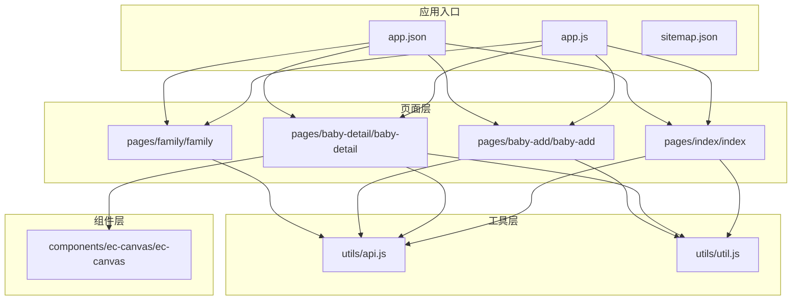
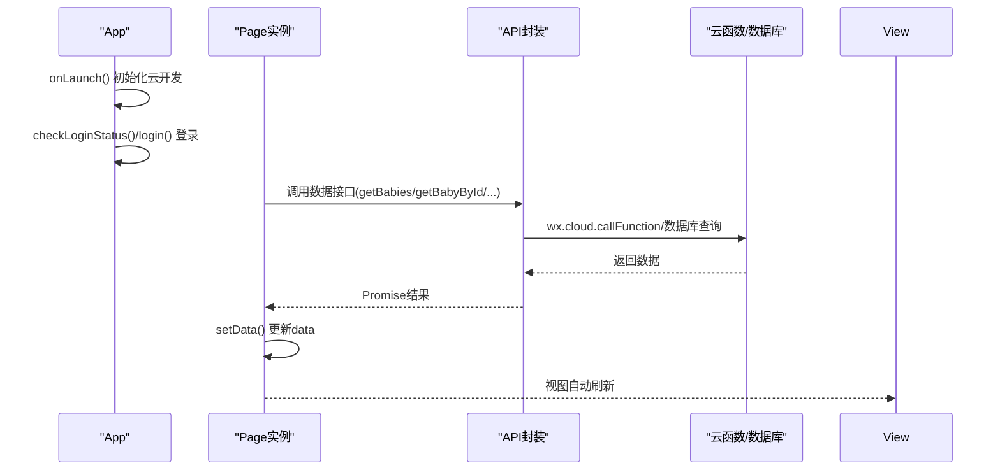
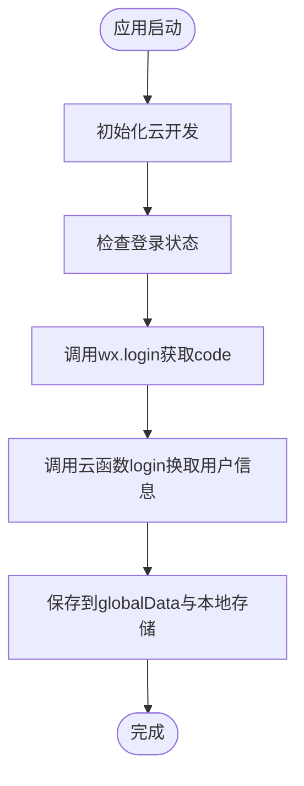
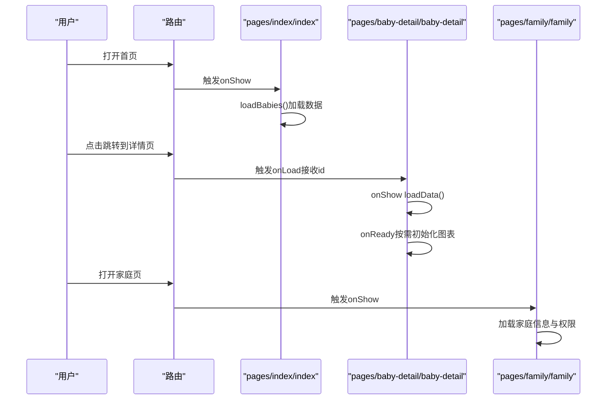
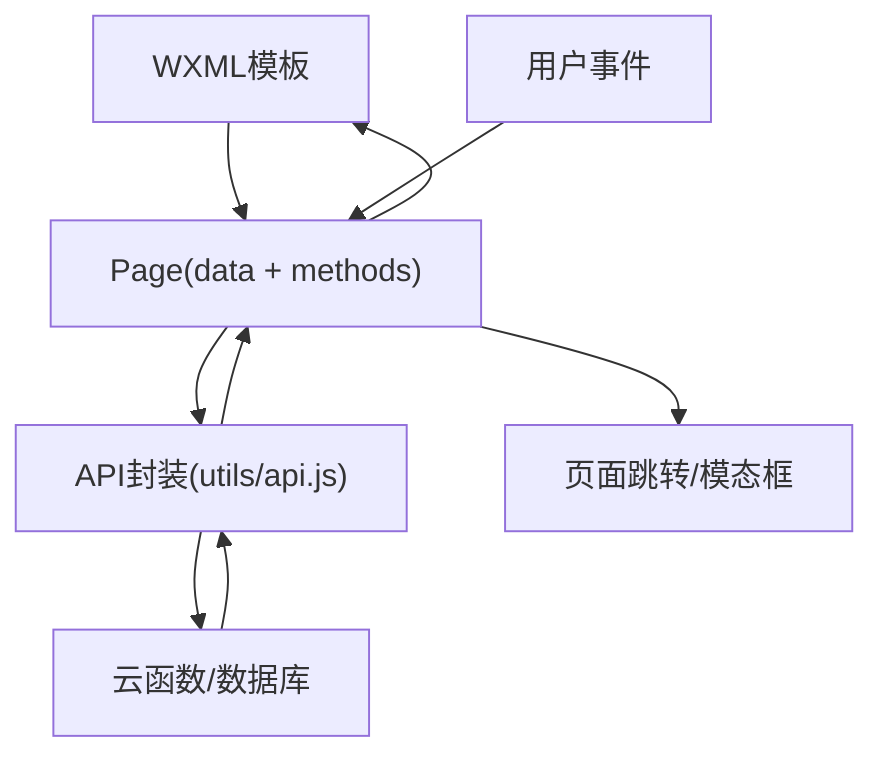
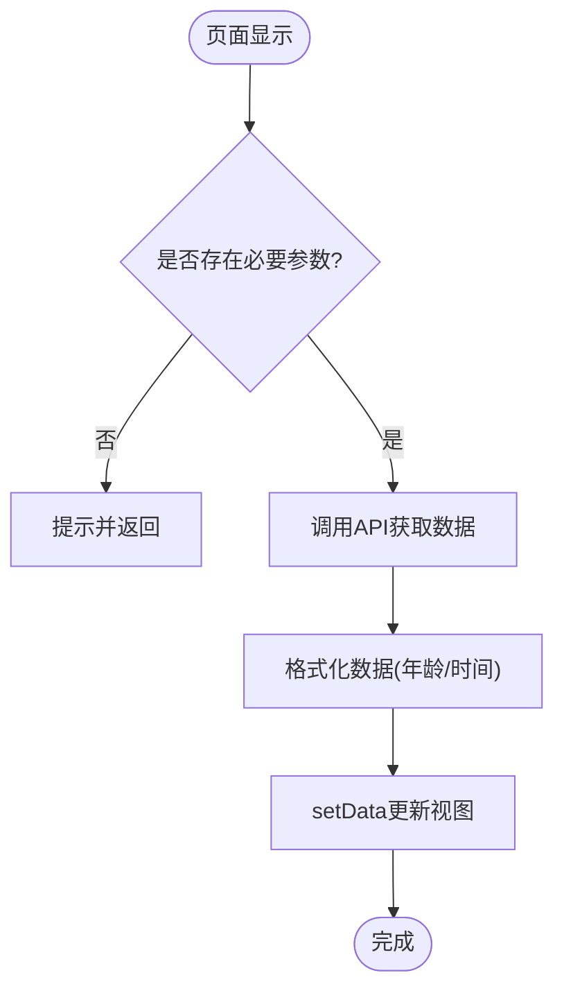
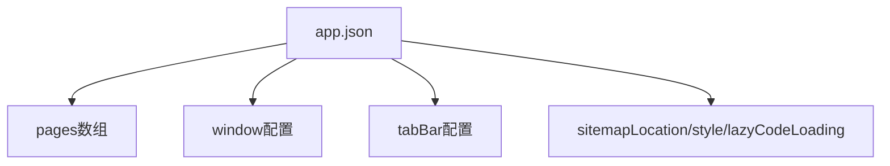
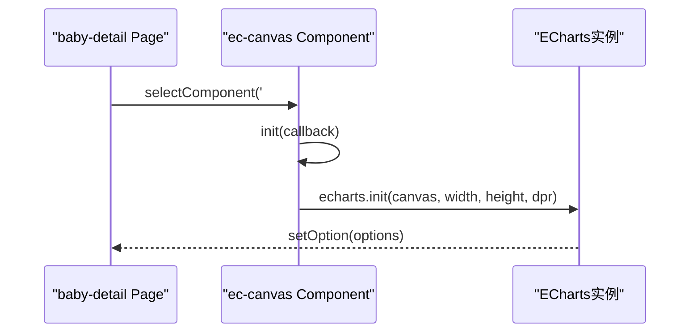
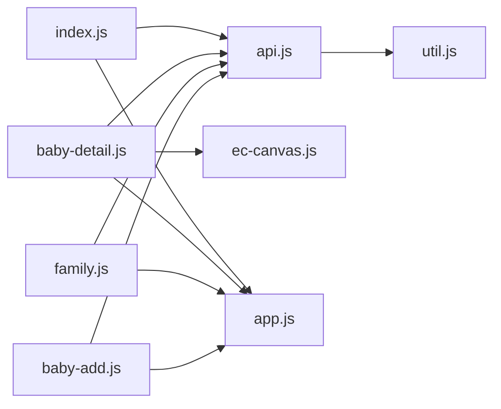

# 页面架构设计

<cite>
**本文档引用的文件**
- [app.js](file://miniprogram/app.js)
- [app.json](file://miniprogram/app.json)
- [index.js](file://miniprogram/pages/index/index.js)
- [baby-detail.js](file://miniprogram/pages/baby-detail/baby-detail.js)
- [api.js](file://miniprogram/utils/api.js)
- [util.js](file://miniprogram/utils/util.js)
- [ec-canvas.js](file://miniprogram/components/ec-canvas/ec-canvas.js)
- [family.js](file://miniprogram/pages/family/family.js)
- [baby-add.js](file://miniprogram/pages/baby-add/baby-add.js)
- [baby-add.json](file://miniprogram/pages/baby-add/baby-add.json)
- [baby-detail.json](file://miniprogram/pages/baby-detail/baby-detail.json)
- [family.json](file://miniprogram/pages/family/family.json)
- [sitemap.json](file://miniprogram/sitemap.json)
</cite>

## 目录
1. [简介](#简介)
2. [项目结构](#项目结构)
3. [核心组件](#核心组件)
4. [架构总览](#架构总览)
5. [详细组件分析](#详细组件分析)
6. [依赖关系分析](#依赖关系分析)
7. [性能考虑](#性能考虑)
8. [故障排查指南](#故障排查指南)
9. [结论](#结论)
10. [附录](#附录)

## 简介
本文件系统化梳理微信小程序页面架构设计与实现，围绕 App 入口配置、页面路由与生命周期、MVVM 数据绑定与事件处理、页面间通信、初始化流程与数据加载策略、状态管理方案、页面配置文件（app.json）作用与配置项、以及最佳实践（性能优化、内存管理、用户体验优化）展开，帮助开发者全面理解并高效开发小程序页面。

## 项目结构
该项目采用“按页面功能组织”的目录结构，核心模块包括：
- 应用入口与全局配置：app.js、app.json
- 页面层：首页、宝宝详情页、添加宝宝页、家庭页等
- 工具层：API 封装、通用工具函数
- 组件层：图表组件 ec-canvas
- 其他：sitemap.json、页面配置 json 文件

**图表来源**
- [app.js:1-56](file://miniprogram/app.js#L1-L56)
- [app.json:1-39](file://miniprogram/app.json#L1-L39)
- [index.js:1-144](file://miniprogram/pages/index/index.js#L1-L144)
- [baby-detail.js:1-691](file://miniprogram/pages/baby-detail/baby-detail.js#L1-L691)
- [api.js:1-800](file://miniprogram/utils/api.js#L1-L800)
- [util.js:1-55](file://miniprogram/utils/util.js#L1-L55)
- [ec-canvas.js:1-285](file://miniprogram/components/ec-canvas/ec-canvas.js#L1-L285)
- [family.js:1-757](file://miniprogram/pages/family/family.js#L1-L757)
- [baby-add.js:1-120](file://miniprogram/pages/baby-add/baby-add.js#L1-L120)

**章节来源**
- [app.js:1-56](file://miniprogram/app.js#L1-L56)
- [app.json:1-39](file://miniprogram/app.json#L1-L39)

## 核心组件
- App 入口与全局状态
  - 初始化云开发环境、全局用户信息、登录态检查与持久化
  - 生命周期：onLaunch 在应用启动时执行，负责初始化与登录
- 页面控制器（Page）
  - 数据模型 data：承载视图所需的数据
  - 生命周期：onLoad/onShow/onReady 等，控制页面初始化、显示与就绪
  - 事件处理：通过 wxml 事件绑定调用 Page 方法
- 业务 API 层
  - 统一封装数据库访问与云函数调用，统一错误处理与权限校验
  - 提供等待登录完成的异步工具方法
- 工具函数层
  - 时间格式化、年龄计算与展示格式化
- 图表组件
  - 封装 ECharts 初始化、渲染与手势交互，支持新旧 Canvas 版本适配

**章节来源**
- [app.js:8-54](file://miniprogram/app.js#L8-L54)
- [index.js:5-144](file://miniprogram/pages/index/index.js#L5-L144)
- [api.js:13-41](file://miniprogram/utils/api.js#L13-L41)
- [util.js:1-55](file://miniprogram/utils/util.js#L1-L55)
- [ec-canvas.js:31-275](file://miniprogram/components/ec-canvas/ec-canvas.js#L31-L275)

## 架构总览
小程序 MVVM 架构在本项目中的体现：
- Model：云数据库与云函数封装（utils/api.js），提供数据获取与写入
- View：wxml + wxss，页面模板与样式
- ViewModel：Page 实例，负责数据绑定与事件处理
- 控制流：生命周期钩子驱动数据加载；事件回调触发状态变更；setData 触发视图更新

**图表来源**
- [app.js:8-54](file://miniprogram/app.js#L8-L54)
- [index.js:14-52](file://miniprogram/pages/index/index.js#L14-L52)
- [api.js:44-111](file://miniprogram/utils/api.js#L44-L111)

## 详细组件分析

### App 入口与全局配置
- 初始化与登录
  - onLaunch 中初始化云开发，若基础库不满足则提示
  - 自动执行登录，调用云函数获取用户信息并缓存到全局与本地存储
- 全局状态
  - globalData.userInfo 存储用户信息
  - env 指定云环境标识

**图表来源**
- [app.js:8-54](file://miniprogram/app.js#L8-L54)

**章节来源**
- [app.js:1-56](file://miniprogram/app.js#L1-L56)

### 页面路由与生命周期管理
- 页面注册与路由
  - app.json 的 pages 数组声明页面路径，决定小程序的页面栈与默认首页
  - tabBar 配置定义底部导航与图标
- 生命周期
  - index 页面：onShow 加载数据；loadBabies 异步获取并格式化数据
  - baby-detail 页面：onLoad 接收参数；onShow 加载数据；onReady 按需初始化图表
  - family 页面：onShow 加载家庭信息；提供创建/加入/退出/权限管理等操作
  - baby-add 页面：onLoad 权限校验；表单收集与提交

**图表来源**
- [app.json:2-8](file://miniprogram/app.json#L2-L8)
- [index.js:10-12](file://miniprogram/pages/index/index.js#L10-L12)
- [baby-detail.js:170-191](file://miniprogram/pages/baby-detail/baby-detail.js#L170-L191)
- [family.js:29-31](file://miniprogram/pages/family/family.js#L29-L31)

**章节来源**
- [app.json:1-39](file://miniprogram/app.json#L1-L39)
- [index.js:1-144](file://miniprogram/pages/index/index.js#L1-L144)
- [baby-detail.js:1-691](file://miniprogram/pages/baby-detail/baby-detail.js#L1-L691)
- [family.js:1-757](file://miniprogram/pages/family/family.js#L1-L757)

### MVVM 架构在页面中的实现
- 数据绑定机制
  - Page 实例 data 作为数据源，通过 setData 触发视图更新
  - 页面模板中使用数据表达式与事件绑定
- 事件处理流程
  - wxml 事件绑定到 Page 方法，如 goToDetail/deleteBaby/goToAddBaby 等
  - 方法内部进行权限校验、数据加载与页面跳转
- 页面间通信方式
  - 通过路由参数传递（如 baby-detail 接收 id）
  - 通过全局 App.globalData 与本地存储共享用户信息
  - 通过云函数与数据库实现跨页面数据一致性

**图表来源**
- [index.js:94-99](file://miniprogram/pages/index/index.js#L94-L99)
- [api.js:783-800](file://miniprogram/utils/api.js#L783-L800)

**章节来源**
- [index.js:1-144](file://miniprogram/pages/index/index.js#L1-L144)
- [api.js:1-800](file://miniprogram/utils/api.js#L1-L800)

### 页面初始化流程与数据加载策略
- 初始化流程
  - App.onLaunch 完成云开发初始化与登录
  - 页面 onShow 触发数据加载，避免重复请求
- 数据加载策略
  - 并行/串行：首页同时拉取宝宝与家庭数据，再进行格式化
  - 条件加载：详情页仅在存在 id 时加载；图表按需初始化
  - 缓存与本地存储：用户 openid 存储于本地，避免每次登录
- 错误处理
  - 统一 toast 提示与日志输出
  - 权限不足时及时提示并回退

**图表来源**
- [index.js:14-52](file://miniprogram/pages/index/index.js#L14-L52)
- [baby-detail.js:193-245](file://miniprogram/pages/baby-detail/baby-detail.js#L193-L245)

**章节来源**
- [index.js:14-52](file://miniprogram/pages/index/index.js#L14-L52)
- [baby-detail.js:193-245](file://miniprogram/pages/baby-detail/baby-detail.js#L193-L245)

### 状态管理方案
- 全局状态
  - App.globalData.userInfo：用户信息与 openid
  - 本地存储：wx.setStorageSync('openid', ...)
- 页面局部状态
  - Page.data：承载视图所需数据与交互状态（如 currentTab、show*Modal）
- 权限状态
  - 通过 api.checkPermission 判断用户在家庭/宝宝维度的权限级别（guardian/caretaker/viewer）

**章节来源**
- [app.js:3-43](file://miniprogram/app.js#L3-L43)
- [family.js:33-80](file://miniprogram/pages/family/family.js#L33-L80)
- [api.js:783-800](file://miniprogram/utils/api.js#L783-L800)

### 页面配置文件（app.json）的作用与配置项
- pages：声明页面路径，决定页面栈与默认首页
- window：全局窗口配置（背景色、导航栏样式）
- tabBar：底部导航配置（pagePath、text、图标、选中态样式）
- sitemapLocation：搜索引擎收录规则
- style：框架样式风格
- lazyCodeLoading：延迟加载策略（requiredComponents）

**图表来源**
- [app.json:1-39](file://miniprogram/app.json#L1-L39)

**章节来源**
- [app.json:1-39](file://miniprogram/app.json#L1-L39)
- [sitemap.json:1-7](file://miniprogram/sitemap.json#L1-L7)

### 页面间通信与导航
- 参数传递
  - 详情页通过路由参数接收 id：/pages/baby-detail/baby-detail?id=${id}
- 页面跳转
  - navigateTo/navigateBack/redirectTo：用于页面间跳转与返回
- 页面配置
  - 各页面 json 可设置导航栏标题与引入自定义组件（如图表组件）

**章节来源**
- [index.js:96-98](file://miniprogram/pages/index/index.js#L96-L98)
- [baby-detail.json:1-8](file://miniprogram/pages/baby-detail/baby-detail.json#L1-L8)

### 组件与图表集成
- ec-canvas 组件
  - 支持新旧 Canvas 版本初始化，自动选择渲染路径
  - 提供 init 回调、手势事件桥接、截图导出等能力
- 图表初始化
  - 详情页在 onReady 或切换标签时按需初始化图表，避免首屏阻塞

**图表来源**
- [ec-canvas.js:80-192](file://miniprogram/components/ec-canvas/ec-canvas.js#L80-L192)
- [baby-detail.js:323-397](file://miniprogram/pages/baby-detail/baby-detail.js#L323-L397)

**章节来源**
- [ec-canvas.js:1-285](file://miniprogram/components/ec-canvas/ec-canvas.js#L1-L285)
- [baby-detail.js:323-397](file://miniprogram/pages/baby-detail/baby-detail.js#L323-L397)

## 依赖关系分析
- 页面对 API 的依赖
  - index/baby-detail/family/baby-add 均依赖 utils/api.js 进行数据访问与权限校验
- API 对工具函数的依赖
  - api.js 依赖 util.js 进行时间与年龄计算
- 页面对组件的依赖
  - baby-detail 依赖 ec-canvas 组件进行图表渲染
- 全局对页面的依赖
  - 页面通过 getApp() 访问 App 全局状态与用户信息

**图表来源**
- [index.js:1-4](file://miniprogram/pages/index/index.js#L1-L4)
- [baby-detail.js:1-4](file://miniprogram/pages/baby-detail/baby-detail.js#L1-L4)
- [api.js:1-2](file://miniprogram/utils/api.js#L1-L2)
- [util.js:1-55](file://miniprogram/utils/util.js#L1-L55)
- [ec-canvas.js:1-2](file://miniprogram/components/ec-canvas/ec-canvas.js#L1-L2)
- [app.js:1-56](file://miniprogram/app.js#L1-L56)

**章节来源**
- [index.js:1-4](file://miniprogram/pages/index/index.js#L1-L4)
- [baby-detail.js:1-4](file://miniprogram/pages/baby-detail/baby-detail.js#L1-L4)
- [api.js:1-2](file://miniprogram/utils/api.js#L1-L2)
- [util.js:1-55](file://miniprogram/utils/util.js#L1-L55)
- [ec-canvas.js:1-2](file://miniprogram/components/ec-canvas/ec-canvas.js#L1-L2)
- [app.js:1-56](file://miniprogram/app.js#L1-L56)

## 性能考虑
- 首屏优化
  - 使用懒加载：图表组件支持 lazyLoad，在需要时才初始化
  - 页面 onReady 内延时初始化图表，减少首屏渲染压力
- 数据加载策略
  - onShow 中按需加载，避免重复请求；并发获取多个数据源
  - 对于复杂计算（如年龄格式化），尽量在服务端或云函数侧处理
- 渲染优化
  - 合理使用 setData，避免频繁触发大量更新
  - 使用条件渲染与虚拟列表（如适用）减少节点数量
- 云资源利用
  - 优先使用云函数进行数据聚合与权限校验，降低前端逻辑复杂度
- 版本兼容
  - 组件自动检测基础库版本，选择最优 Canvas 初始化路径

[本节为通用指导，无需特定文件引用]

## 故障排查指南
- 登录与权限问题
  - 若出现“登录超时”或“权限不足”，检查 App 登录流程与 api.waitForLogin 的实现
  - 使用 api.checkPermission 校验用户在家庭/宝宝维度的权限
- 数据加载失败
  - 统一错误处理：页面捕获异常并提示用户重试
  - 检查云函数返回值与数据库权限配置
- 图表初始化失败
  - 确认 ec-canvas 组件是否正确引入与初始化
  - 检查基础库版本与 Canvas 类型选择
- 页面跳转与参数
  - 确保详情页 onLoad 正确接收参数并在 onShow 中加载数据
  - 导航栏标题与样式可通过页面 json 配置覆盖

**章节来源**
- [api.js:13-41](file://miniprogram/utils/api.js#L13-L41)
- [api.js:783-800](file://miniprogram/utils/api.js#L783-L800)
- [ec-canvas.js:80-108](file://miniprogram/components/ec-canvas/ec-canvas.js#L80-L108)
- [baby-detail.js:170-191](file://miniprogram/pages/baby-detail/baby-detail.js#L170-L191)

## 结论
本项目遵循微信小程序 MVVM 架构，通过清晰的页面生命周期、统一的 API 封装与权限校验、合理的数据加载策略与组件化图表渲染，实现了良好的可维护性与用户体验。建议在后续迭代中进一步完善错误边界与埋点监控，持续优化首屏性能与交互流畅度。

[本节为总结性内容，无需特定文件引用]

## 附录
- 页面配置文件示例
  - [pages/baby-add/baby-add.json:1-5](file://miniprogram/pages/baby-add/baby-add.json#L1-L5)
  - [pages/baby-detail/baby-detail.json:1-8](file://miniprogram/pages/baby-detail/baby-detail.json#L1-L8)
  - [pages/family/family.json:1-5](file://miniprogram/pages/family/family.json#L1-L5)
- 搜索引擎收录配置
  - [sitemap.json:1-7](file://miniprogram/sitemap.json#L1-L7)

[本节为补充说明，无需特定文件引用]