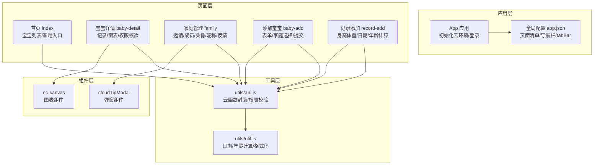
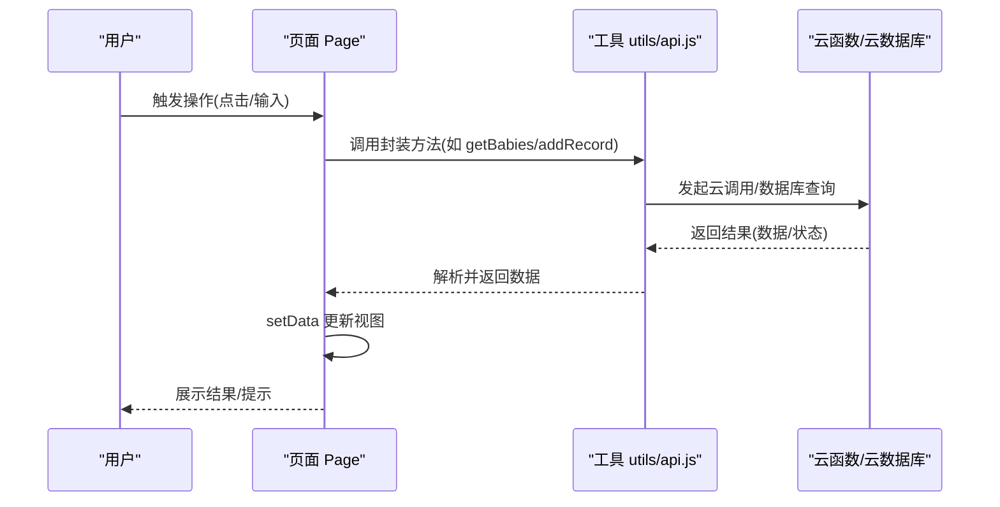
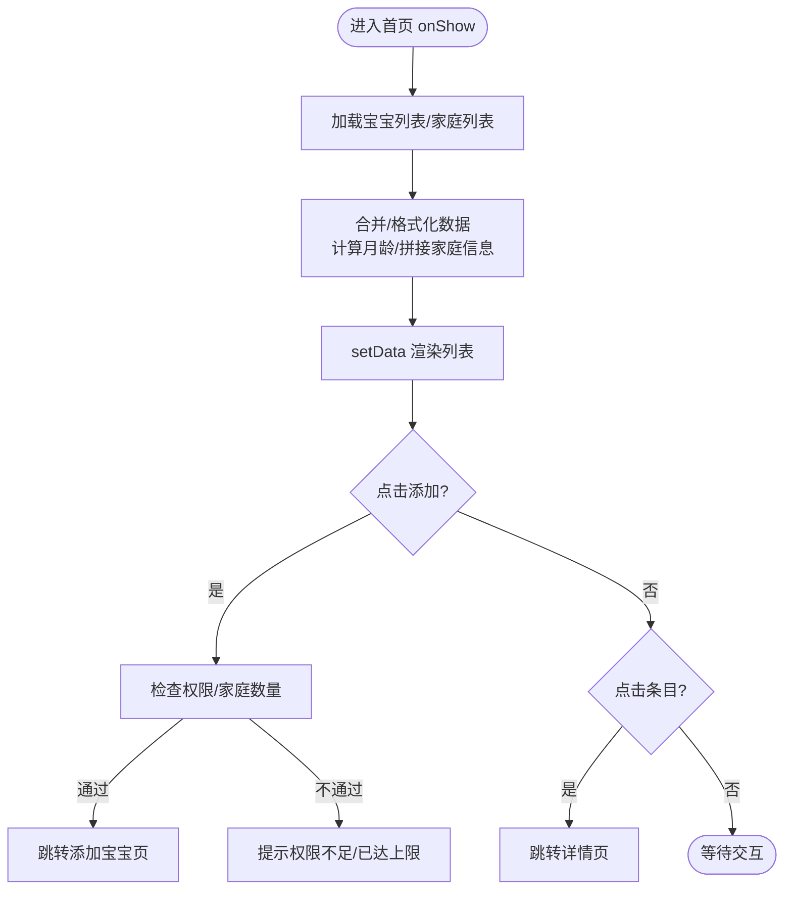
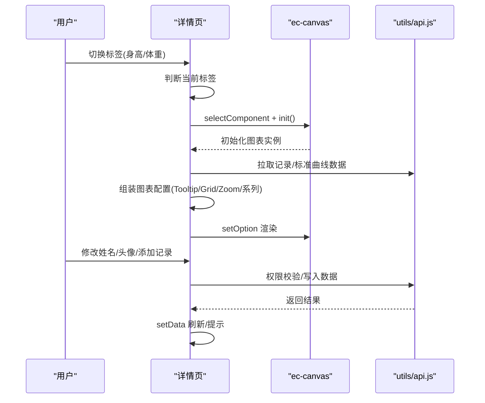
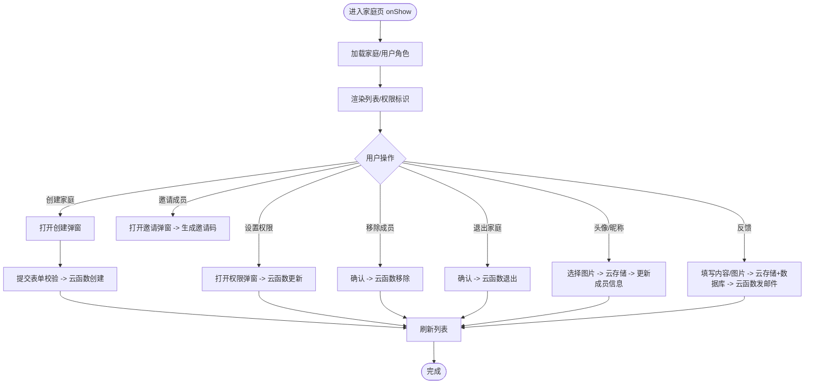
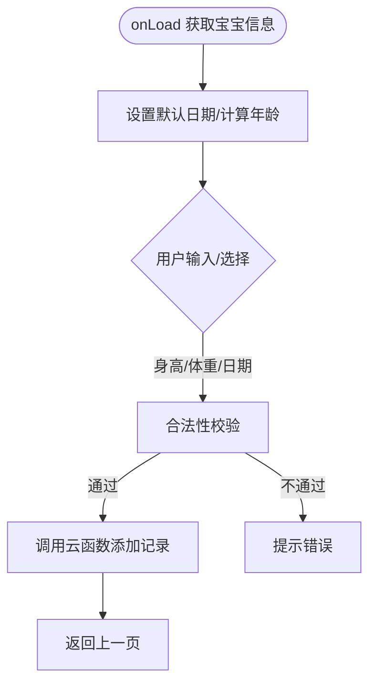
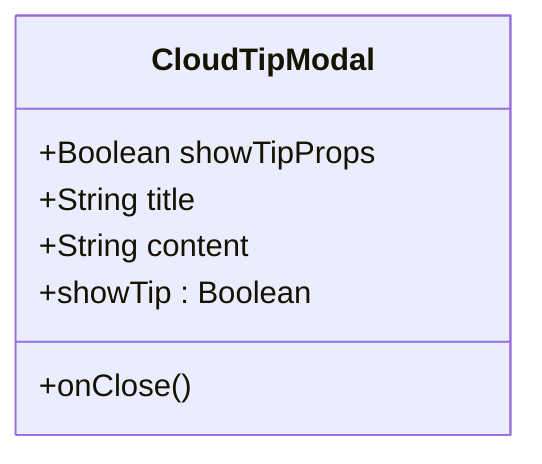
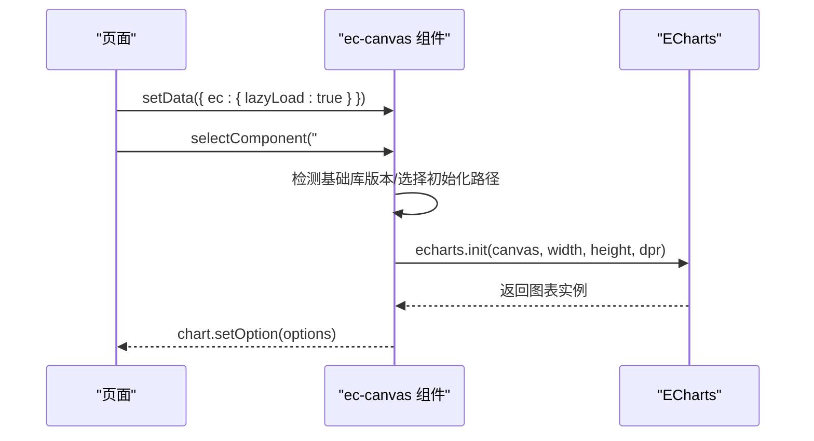
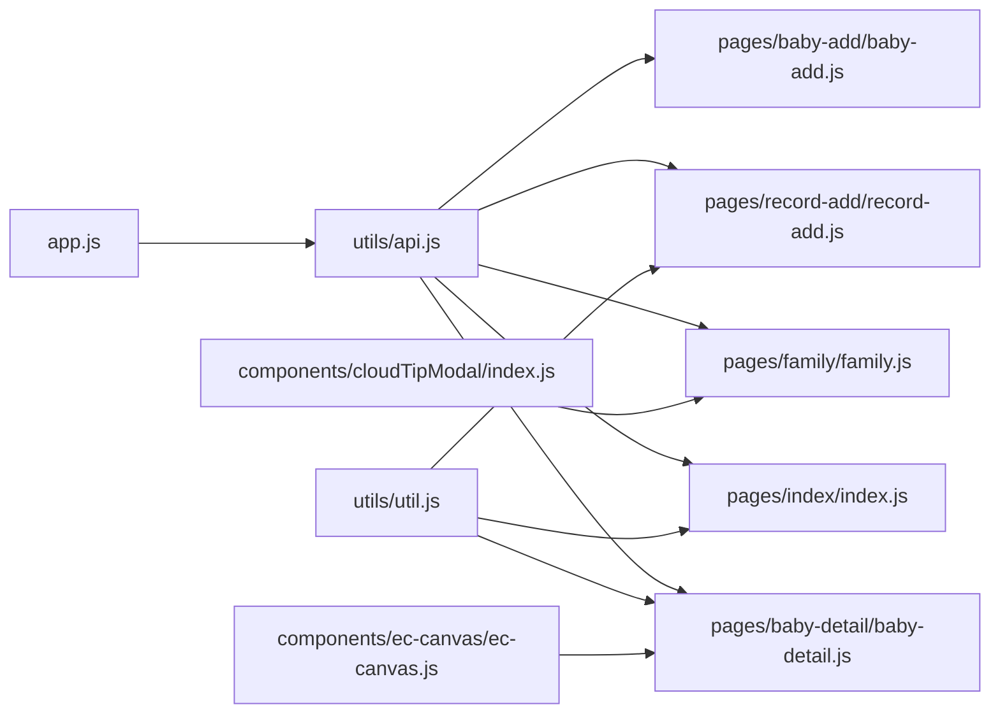

# 页面组件设计

<cite>
**本文引用的文件**
- [miniprogram/app.js](file://miniprogram/app.js)
- [miniprogram/app.json](file://miniprogram/app.json)
- [miniprogram/pages/index/index.js](file://miniprogram/pages/index/index.js)
- [miniprogram/pages/baby-detail/baby-detail.js](file://miniprogram/pages/baby-detail/baby-detail.js)
- [miniprogram/pages/family/family.js](file://miniprogram/pages/family/family.js)
- [miniprogram/pages/baby-add/baby-add.js](file://miniprogram/pages/baby-add/baby-add.js)
- [miniprogram/pages/record-add/record-add.js](file://miniprogram/pages/record-add/record-add.js)
- [miniprogram/components/cloudTipModal/index.js](file://miniprogram/components/cloudTipModal/index.js)
- [miniprogram/components/ec-canvas/ec-canvas.js](file://miniprogram/components/ec-canvas/ec-canvas.js)
- [miniprogram/utils/api.js](file://miniprogram/utils/api.js)
- [miniprogram/utils/util.js](file://miniprogram/utils/util.js)
- [miniprogram/pages/baby-add/baby-add.json](file://miniprogram/pages/baby-add/baby-add.json)
- [miniprogram/pages/baby-detail/baby-detail.json](file://miniprogram/pages/baby-detail/baby-detail.json)
- [miniprogram/pages/family/family.json](file://miniprogram/pages/family/family.json)
- [miniprogram/pages/record-add/record-add.json](file://miniprogram/pages/record-add/record-add.json)
</cite>

## 目录
1. [简介](#简介)
2. [项目结构](#项目结构)
3. [核心组件](#核心组件)
4. [架构总览](#架构总览)
5. [详细组件分析](#详细组件分析)
6. [依赖关系分析](#依赖关系分析)
7. [性能考虑](#性能考虑)
8. [故障排查指南](#故障排查指南)
9. [结论](#结论)
10. [附录](#附录)

## 简介
本文件面向前端开发者，系统化梳理“宝宝助手”小程序的页面与组件设计，覆盖页面生命周期、路由管理、数据绑定机制；详解首页宝宝列表、宝宝详情页、家庭管理页、记录添加页等核心页面；说明自定义组件（cloudTipModal 弹窗、ec-canvas 图表）的开发与扩展方式；给出属性配置、事件处理、样式定制指南；总结页面间导航逻辑、数据传递与状态管理策略；并提供响应式设计与性能优化建议。

## 项目结构
小程序采用分层组织：页面 pages、组件 components、工具 utils、应用入口 app.js 与全局配置 app.json。页面通过云函数与云数据库交互，实现权限控制与数据安全；页面间通过 wx.navigateTo/navigateBack 等路由 API 进行跳转；自定义组件通过 usingComponents 注册并在页面中复用。

**图表来源**
- [miniprogram/app.js:1-56](file://miniprogram/app.js#L1-L56)
- [miniprogram/app.json:1-39](file://miniprogram/app.json#L1-L39)
- [miniprogram/pages/index/index.js:1-144](file://miniprogram/pages/index/index.js#L1-L144)
- [miniprogram/pages/baby-detail/baby-detail.js:1-691](file://miniprogram/pages/baby-detail/baby-detail.js#L1-L691)
- [miniprogram/pages/family/family.js:1-757](file://miniprogram/pages/family/family.js#L1-L757)
- [miniprogram/pages/baby-add/baby-add.js:1-120](file://miniprogram/pages/baby-add/baby-add.js#L1-L120)
- [miniprogram/pages/record-add/record-add.js:1-118](file://miniprogram/pages/record-add/record-add.js#L1-L118)
- [miniprogram/components/cloudTipModal/index.js:1-29](file://miniprogram/components/cloudTipModal/index.js#L1-L29)
- [miniprogram/components/ec-canvas/ec-canvas.js:1-285](file://miniprogram/components/ec-canvas/ec-canvas.js#L1-L285)
- [miniprogram/utils/api.js:1-879](file://miniprogram/utils/api.js#L1-L879)
- [miniprogram/utils/util.js:1-55](file://miniprogram/utils/util.js#L1-L55)

**章节来源**
- [miniprogram/app.js:1-56](file://miniprogram/app.js#L1-L56)
- [miniprogram/app.json:1-39](file://miniprogram/app.json#L1-L39)

## 核心组件
- 页面生命周期：各页面统一使用 Page({ data, onLoad/onShow/onReady, 事件处理 }) 模式，异步加载数据并通过 setData 更新视图。
- 路由管理：通过 wx.navigateTo/navigateBack/redirectTo 等 API 实现页面跳转与返回；首页与家庭页作为 tabBar 页面常驻。
- 数据绑定：WXML 中通过双花括号绑定 data 字段；事件绑定通过 bind/tap 等触发对应 JS 方法。
- 权限校验：通过 utils/api.js 的 checkPermission 统一校验用户在家庭/宝宝维度的权限等级（监护人/照看者/围观者）。

**章节来源**
- [miniprogram/pages/index/index.js:1-144](file://miniprogram/pages/index/index.js#L1-L144)
- [miniprogram/pages/baby-detail/baby-detail.js:1-691](file://miniprogram/pages/baby-detail/baby-detail.js#L1-L691)
- [miniprogram/pages/family/family.js:1-757](file://miniprogram/pages/family/family.js#L1-L757)
- [miniprogram/pages/baby-add/baby-add.js:1-120](file://miniprogram/pages/baby-add/baby-add.js#L1-L120)
- [miniprogram/pages/record-add/record-add.js:1-118](file://miniprogram/pages/record-add/record-add.js#L1-L118)
- [miniprogram/utils/api.js:782-800](file://miniprogram/utils/api.js#L782-L800)

## 架构总览
整体采用“页面-组件-工具-云服务”的分层架构。页面负责业务编排与交互；组件负责可复用 UI 与功能；工具模块封装 API 与通用算法；云函数与云数据库提供权限与数据访问控制。

**图表来源**
- [miniprogram/utils/api.js:43-75](file://miniprogram/utils/api.js#L43-L75)
- [miniprogram/utils/api.js:299-346](file://miniprogram/utils/api.js#L299-L346)
- [miniprogram/pages/index/index.js:14-52](file://miniprogram/pages/index/index.js#L14-L52)
- [miniprogram/pages/baby-detail/baby-detail.js:193-245](file://miniprogram/pages/baby-detail/baby-detail.js#L193-L245)

## 详细组件分析

### 首页宝宝列表（pages/index/index）
- 生命周期与数据加载：onShow 中拉取宝宝与家庭数据，合并格式化后渲染；支持“添加宝宝”入口与“删除宝宝”权限校验。
- 导航与交互：点击条目进入详情页；新增入口前置权限与数量限制检查。
- 数据处理：计算月龄、拼接家庭名与颜色索引、获取最新记录用于展示。

**图表来源**
- [miniprogram/pages/index/index.js:10-52](file://miniprogram/pages/index/index.js#L10-L52)
- [miniprogram/pages/index/index.js:54-92](file://miniprogram/pages/index/index.js#L54-L92)
- [miniprogram/pages/index/index.js:94-99](file://miniprogram/pages/index/index.js#L94-L99)
- [miniprogram/pages/index/index.js:101-142](file://miniprogram/pages/index/index.js#L101-L142)

**章节来源**
- [miniprogram/pages/index/index.js:1-144](file://miniprogram/pages/index/index.js#L1-L144)

### 宝宝详情页（pages/baby-detail）
- 页面结构：标签页切换“记录/身高/体重”，图表懒加载；支持修改姓名、头像与添加记录。
- 图表组件：使用 ec-canvas 组件，按性别选择标准曲线，动态生成折线图配置；内置 dataZoom 支持缩放与滑块。
- 权限控制：不同操作对权限级别要求不同（修改姓名/头像需监护人，添加记录需照看者及以上）。
- 数据联动：根据出生日期与记录日期计算月龄字符串；支持删除记录并刷新数据。

**图表来源**
- [miniprogram/pages/baby-detail/baby-detail.js:170-191](file://miniprogram/pages/baby-detail/baby-detail.js#L170-L191)
- [miniprogram/pages/baby-detail/baby-detail.js:247-261](file://miniprogram/pages/baby-detail/baby-detail.js#L247-L261)
- [miniprogram/pages/baby-detail/baby-detail.js:323-397](file://miniprogram/pages/baby-detail/baby-detail.js#L323-L397)
- [miniprogram/pages/baby-detail/baby-detail.js:399-473](file://miniprogram/pages/baby-detail/baby-detail.js#L399-L473)
- [miniprogram/pages/baby-detail/baby-detail.js:475-536](file://miniprogram/pages/baby-detail/baby-detail.js#L475-L536)
- [miniprogram/pages/baby-detail/baby-detail.js:592-612](file://miniprogram/pages/baby-detail/baby-detail.js#L592-L612)
- [miniprogram/pages/baby-detail/baby-detail.js:614-689](file://miniprogram/pages/baby-detail/baby-detail.js#L614-L689)

**章节来源**
- [miniprogram/pages/baby-detail/baby-detail.js:1-691](file://miniprogram/pages/baby-detail/baby-detail.js#L1-L691)
- [miniprogram/pages/baby-detail/baby-detail.json:1-8](file://miniprogram/pages/baby-detail/baby-detail.json#L1-L8)

### 家庭管理页（pages/family）
- 功能概览：创建/编辑家庭、邀请成员、设置权限、移除成员、退出家庭；支持头像/昵称批量更新；提供反馈收集并调用云函数发送邮件。
- 权限模型：用户在各家庭中具有独立权限（监护人/照看者/围观者），影响可执行的操作。
- 交互流程：弹窗驱动（创建/编辑/邀请/反馈），表单校验与云存储上传，最终刷新数据。

**图表来源**
- [miniprogram/pages/family/family.js:29-80](file://miniprogram/pages/family/family.js#L29-L80)
- [miniprogram/pages/family/family.js:82-130](file://miniprogram/pages/family/family.js#L82-L130)
- [miniprogram/pages/family/family.js:237-277](file://miniprogram/pages/family/family.js#L237-L277)
- [miniprogram/pages/family/family.js:511-549](file://miniprogram/pages/family/family.js#L511-L549)
- [miniprogram/pages/family/family.js:551-578](file://miniprogram/pages/family/family.js#L551-L578)
- [miniprogram/pages/family/family.js:580-624](file://miniprogram/pages/family/family.js#L580-L624)
- [miniprogram/pages/family/family.js:302-354](file://miniprogram/pages/family/family.js#L302-L354)
- [miniprogram/pages/family/family.js:357-426](file://miniprogram/pages/family/family.js#L357-L426)
- [miniprogram/pages/family/family.js:627-755](file://miniprogram/pages/family/family.js#L627-L755)

**章节来源**
- [miniprogram/pages/family/family.js:1-757](file://miniprogram/pages/family/family.js#L1-L757)
- [miniprogram/pages/family/family.json:1-5](file://miniprogram/pages/family/family.json#L1-L5)

### 记录添加页（pages/record-add）
- 表单字段：身高、体重、记录日期；日期变更时实时计算月龄字符串。
- 权限与校验：仅照看者及以上可添加；数值合法性校验；禁止早于出生日期。
- 数据提交：调用云函数添加记录并返回，成功后返回上一页。

**图表来源**
- [miniprogram/pages/record-add/record-add.js:18-39](file://miniprogram/pages/record-add/record-add.js#L18-L39)
- [miniprogram/pages/record-add/record-add.js:41-69](file://miniprogram/pages/record-add/record-add.js#L41-L69)
- [miniprogram/pages/record-add/record-add.js:71-116](file://miniprogram/pages/record-add/record-add.js#L71-L116)

**章节来源**
- [miniprogram/pages/record-add/record-add.js:1-118](file://miniprogram/pages/record-add/record-add.js#L1-L118)
- [miniprogram/pages/record-add/record-add.json:1-5](file://miniprogram/pages/record-add/record-add.json#L1-L5)

### 添加宝宝页（pages/baby-add）
- 表单与联动：家庭下拉选择、性别选择、出生日期选择；提交前权限校验与必填项校验。
- 数据提交：调用云函数创建宝宝并创建出生记录，成功后返回首页。

**章节来源**
- [miniprogram/pages/baby-add/baby-add.js:1-120](file://miniprogram/pages/baby-add/baby-add.js#L1-L120)
- [miniprogram/pages/baby-add/baby-add.json:1-5](file://miniprogram/pages/baby-add/baby-add.json#L1-L5)

### 自定义组件

#### cloudTipModal 弹窗组件
- 设计要点：通过 properties 接收 showTipProps/title/content；observer 监听外部变化自动同步内部 showTip；提供 onClose 方法关闭弹窗。
- 使用建议：在页面中通过 is 或 v-if 控制显示隐藏，避免频繁创建销毁；结合 wxs/事件回调实现更复杂的交互。

**图表来源**
- [miniprogram/components/cloudTipModal/index.js:1-29](file://miniprogram/components/cloudTipModal/index.js#L1-L29)

**章节来源**
- [miniprogram/components/cloudTipModal/index.js:1-29](file://miniprogram/components/cloudTipModal/index.js#L1-L29)

#### ec-canvas 图表组件
- 能力特性：兼容新旧 Canvas 版本，自动选择初始化路径；支持触摸事件映射；提供 canvasToTempFilePath 导出图片。
- 使用方式：在页面 JSON 中 usingComponents 注册；在页面 JS 中通过 selectComponent 获取实例并 init 回调中创建 ECharts 实例；setData 设置 ec.lazyLoad 时可延迟初始化。
- 性能注意：禁用渐进式绘制以适配小程序画布限制；合理设置 dataZoom 初始范围，避免大数据量首次渲染卡顿。

**图表来源**
- [miniprogram/components/ec-canvas/ec-canvas.js:79-192](file://miniprogram/components/ec-canvas/ec-canvas.js#L79-L192)
- [miniprogram/pages/baby-detail/baby-detail.js:323-397](file://miniprogram/pages/baby-detail/baby-detail.js#L323-L397)
- [miniprogram/pages/baby-detail/baby-detail.js:399-473](file://miniprogram/pages/baby-detail/baby-detail.js#L399-L473)

**章节来源**
- [miniprogram/components/ec-canvas/ec-canvas.js:1-285](file://miniprogram/components/ec-canvas/ec-canvas.js#L1-L285)
- [miniprogram/pages/baby-detail/baby-detail.json:5-7](file://miniprogram/pages/baby-detail/baby-detail.json#L5-L7)

## 依赖关系分析
- 页面依赖 utils/api.js 进行数据与权限操作；部分页面依赖 utils/util.js 进行日期/年龄计算。
- 宝宝详情页依赖 ec-canvas 组件；家庭页可选依赖 cloudTipModal 弹窗。
- app.js 负责应用初始化与登录态维护，为各页面提供全局用户信息。

**图表来源**
- [miniprogram/utils/api.js:1-879](file://miniprogram/utils/api.js#L1-L879)
- [miniprogram/utils/util.js:1-55](file://miniprogram/utils/util.js#L1-L55)
- [miniprogram/components/ec-canvas/ec-canvas.js:1-285](file://miniprogram/components/ec-canvas/ec-canvas.js#L1-L285)
- [miniprogram/components/cloudTipModal/index.js:1-29](file://miniprogram/components/cloudTipModal/index.js#L1-L29)
- [miniprogram/pages/index/index.js:1-144](file://miniprogram/pages/index/index.js#L1-L144)
- [miniprogram/pages/baby-detail/baby-detail.js:1-691](file://miniprogram/pages/baby-detail/baby-detail.js#L1-L691)
- [miniprogram/pages/family/family.js:1-757](file://miniprogram/pages/family/family.js#L1-L757)
- [miniprogram/pages/baby-add/baby-add.js:1-120](file://miniprogram/pages/baby-add/baby-add.js#L1-L120)
- [miniprogram/pages/record-add/record-add.js:1-118](file://miniprogram/pages/record-add/record-add.js#L1-L118)
- [miniprogram/app.js:1-56](file://miniprogram/app.js#L1-L56)

**章节来源**
- [miniprogram/utils/api.js:1-879](file://miniprogram/utils/api.js#L1-L879)
- [miniprogram/utils/util.js:1-55](file://miniprogram/utils/util.js#L1-L55)
- [miniprogram/app.js:1-56](file://miniprogram/app.js#L1-L56)

## 性能考虑
- 图表懒加载：详情页图表按需初始化，减少首屏渲染压力；合理设置 dataZoom 初始范围，避免一次性渲染过多点位。
- 数据缓存：首页与详情页在 onShow 中按需刷新，避免重复请求；对常用数据（如家庭列表）可在页面 data 中缓存。
- 组件复用：将通用弹窗、提示封装为自定义组件，减少重复逻辑与渲染节点。
- 云函数封装：将数据库读写与权限校验集中在云函数，降低客户端复杂度与网络往返。
- 基础库兼容：ec-canvas 已处理新旧 Canvas 兼容，建议尽量使用较新基础库以获得更好性能。

[本节为通用指导，无需特定文件引用]

## 故障排查指南
- 登录态问题：若全局用户信息缺失，waitForLogin 会等待或触发登录；检查 app.js 初始化与云函数返回。
- 权限不足：checkPermission 返回 false 时需提示用户角色限制；确认家庭成员权限与操作类型。
- 数据为空：getBabies/getRecordsByBabyId 等接口可能因权限或网络异常返回空数组/null；页面应友好提示并允许重试。
- 图表初始化失败：确认 ec-canvas 组件注册、canvasId 正确、init 回调中正确 setOption；检查 dataZoom 范围与数据长度。

**章节来源**
- [miniprogram/utils/api.js:13-41](file://miniprogram/utils/api.js#L13-L41)
- [miniprogram/utils/api.js:782-800](file://miniprogram/utils/api.js#L782-L800)
- [miniprogram/components/ec-canvas/ec-canvas.js:79-108](file://miniprogram/components/ec-canvas/ec-canvas.js#L79-L108)

## 结论
本项目通过清晰的页面分层与自定义组件复用，实现了权限驱动的数据访问与可视化呈现。首页与详情页承担主要业务入口，家庭页提供组织与协作能力，记录页聚焦数据采集。图表组件与弹窗组件提升了交互体验与代码复用率。建议后续在权限模型、图表性能与跨设备适配上持续优化，以提升用户体验与可维护性。

[本节为总结，无需特定文件引用]

## 附录

### 页面间导航与数据传递
- 首页 -> 添加宝宝：携带权限检查与家庭数量限制；成功后返回首页。
- 首页 -> 宝宝详情：通过 query 参数传递 babyId；详情页按需加载数据。
- 详情页 -> 添加记录：通过 query 传递 babyId；记录页默认日期为当天。
- 家庭页 -> 邀请分享：通过 onShareAppMessage 生成带邀请码的分享链接。

**章节来源**
- [miniprogram/pages/index/index.js:82-92](file://miniprogram/pages/index/index.js#L82-L92)
- [miniprogram/pages/index/index.js:94-99](file://miniprogram/pages/index/index.js#L94-L99)
- [miniprogram/pages/baby-detail/baby-detail.js:170-176](file://miniprogram/pages/baby-detail/baby-detail.js#L170-L176)
- [miniprogram/pages/record-add/record-add.js:18-39](file://miniprogram/pages/record-add/record-add.js#L18-L39)
- [miniprogram/pages/family/family.js:279-294](file://miniprogram/pages/family/family.js#L279-L294)

### 状态管理策略
- 页面内状态：通过 Page 的 data 管理视图所需字段（如 tabs、弹窗开关、表单数据）。
- 全局状态：App 的 globalData 存储用户信息与环境变量；页面通过 getApp() 获取。
- 云状态：家庭/宝宝/记录等实体状态由云数据库与云函数维护，页面通过 API 层读写。

**章节来源**
- [miniprogram/app.js:3-6](file://miniprogram/app.js#L3-L6)
- [miniprogram/pages/family/family.js:36-72](file://miniprogram/pages/family/family.js#L36-L72)

### 响应式设计与跨设备兼容
- 尺寸适配：使用 rpx 单位；图表容器通过选择器查询宽高，按 dpr 初始化。
- 触摸交互：ec-canvas 组件映射触摸事件至 ECharts ZRender，支持缩放与拖拽。
- 字体与间距：遵循小程序规范，避免固定 px；在不同屏幕尺寸下保持比例一致。

**章节来源**
- [miniprogram/components/ec-canvas/ec-canvas.js:143-192](file://miniprogram/components/ec-canvas/ec-canvas.js#L143-L192)