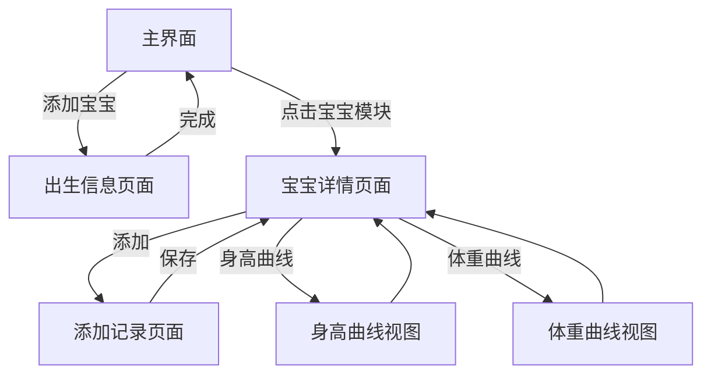

## 1. 产品概述
宝宝助手是一款专为家长设计的微信小程序，用于记录和管理宝宝的成长数据，包括身高、体重等关键指标，并提供可视化生长曲线对比功能。

帮助家长科学追踪宝宝生长发育情况，及时发现成长异常，为育儿决策提供数据支持。

## 2. 核心功能

### 2.1 功能模块
我们的宝宝助手小程序包含以下主要页面：
1. **主界面**：显示已添加宝宝列表，支持添加新宝宝
2. **出生信息页面**：录入宝宝基本信息
3. **宝宝详情页面**：展示宝宝成长记录和生长曲线

### 2.2 页面详情

| 页面名称 | 模块名称 | 功能描述 |
|---------|---------|---------|
| 主界面 | 宝宝列表 | 动态显示已录入宝宝信息模块（最多3个），每个模块显示姓名、年龄、最新身高体重 |
| 主界面 | 添加宝宝 | 右上角固定按钮，点击进入出生信息页面 |
| 主界面 | 删除功能 | 每个宝宝模块支持删除操作 |
| 出生信息页面 | 信息录入 | 必填字段：姓名、性别、出生日期、出生身高、出生体重 |
| 出生信息页面 | 完成按钮 | 保存信息并返回主界面 |
| 宝宝详情页面 | 顶部导航 | 添加记录、身高曲线、体重曲线三个功能按钮 |
| 宝宝详情页面 | 记录添加 | 录入最新身高、体重、时间，自动计算年龄 |
| 宝宝详情页面 | 历史记录 | 按时间倒序显示所有记录，支持删除 |
| 宝宝详情页面 | 身高曲线 | 显示标准曲线和宝宝实际曲线，支持缩放平移 |
| 宝宝详情页面 | 体重曲线 | 显示标准曲线和宝宝实际曲线，支持缩放平移 |

## 3. 核心流程

### 用户操作流程
1. **首次使用**：主界面 → 点击"添加宝宝" → 填写出生信息 → 返回主界面
2. **查看详情**：主界面 → 点击宝宝模块 → 进入宝宝详情页
3. **添加记录**：宝宝详情页 → 点击"添加" → 录入最新数据 → 返回详情页
4. **查看曲线**：宝宝详情页 → 点击"身高曲线"/"体重曲线" → 查看可视化图表

## 4. 用户界面设计

### 4.1 设计风格
- **主色调**：温暖柔和的粉色系（#FFB6C1）和浅蓝色系（#87CEEB）
- **辅助色**：白色背景，深灰色文字（#333333）
- **按钮样式**：圆角矩形，柔和阴影
- **字体**：微信小程序默认字体，标题18px，正文14px
- **图标风格**：简洁线性图标，符合育儿主题

### 4.2 页面设计

| 页面名称 | 模块名称 | UI元素 |
|---------|---------|---------|
| 主界面 | 宝宝列表 | 卡片式布局，每张卡片圆角边框，阴影效果，姓名大号字体，其他信息小号字体 |
| 主界面 | 添加按钮 | 右上角圆形按钮，粉色背景，白色加号图标 |
| 出生信息页面 | 表单区域 | 白色背景，输入框圆角设计，单选按钮横向排列，日期选择器原生组件 |
| 出生信息页面 | 完成按钮 | 底部固定，粉色背景，白色文字，圆角设计 |
| 宝宝详情页面 | 顶部导航 | 三个等宽按钮，浅蓝色背景，当前选中高亮显示 |
| 宝宝详情页面 | 记录列表 | 卡片式布局，绿色数字突出显示，时间信息灰色小字体 |
| 宝宝详情页面 | 曲线图表 | 白底，蓝色标准曲线，绿色宝宝曲线，支持手势操作 |

### 4.3 响应式设计
- **适配原则**：以iPhone 12（390x844）为基准设计
- **组件适配**：使用rpx单位确保在不同屏幕尺寸下正常显示
- **交互优化**：触摸区域不小于44x44px，符合移动端操作习惯

### 4.4 数据可视化规范
- **图表样式**：平滑曲线，数据点圆形标记
- **颜色规范**：标准曲线蓝色（#4169E1），宝宝曲线绿色（#32CD32）
- **坐标轴**：清晰刻度，适当网格线，支持缩放和平移
- **数据标签**：关键数据点显示具体数值