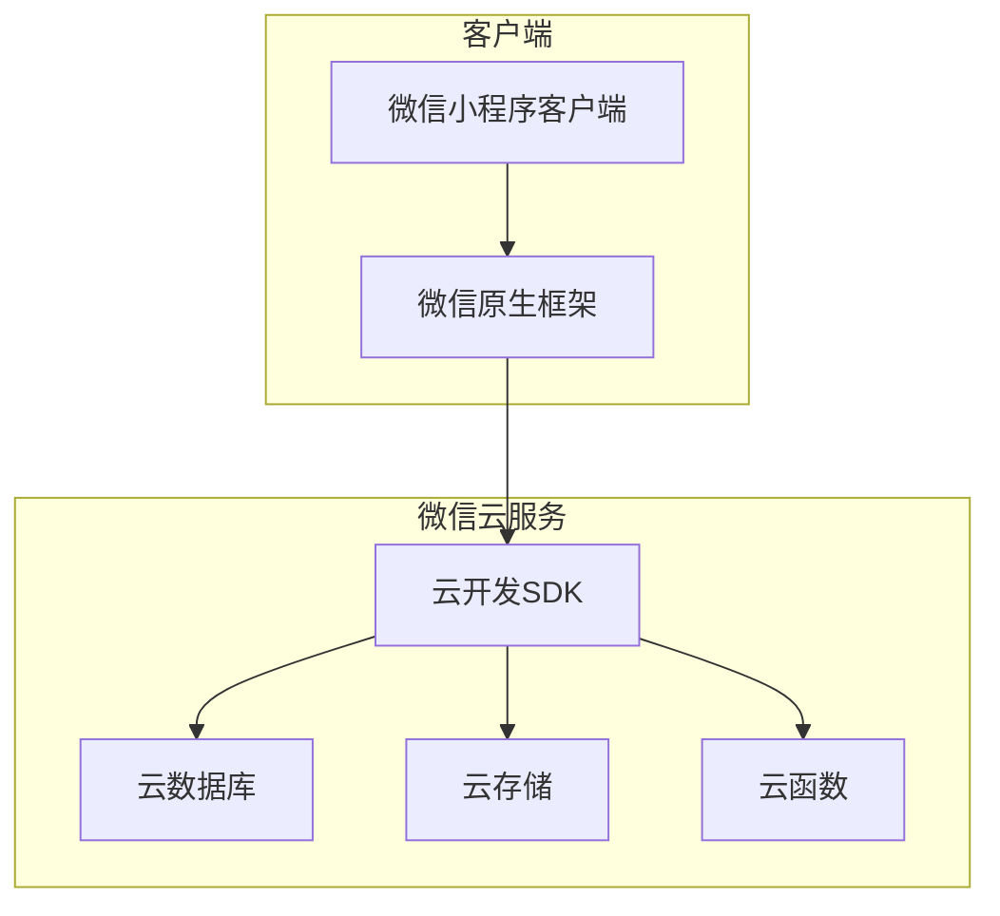
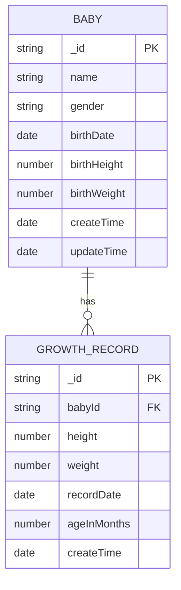

## 1. 架构设计



## 2. 技术描述

* **前端框架**：微信小程序原生框架 + WXML + WXSS + JS + JSON

* **初始化工具**：微信开发者工具

* **后端服务**：微信云开发（CloudBase）

* **数据库**：云开发数据库（类MongoDB）

* **文件存储**：云开发存储

* **图表库**：微信小程序图表库（如F2、ECharts小程序版）

## 3. 页面路由定义

| 页面路径                           | 页面名称   | 功能描述          |
| ------------------------------ | ------ | ------------- |
| /pages/index/index             | 主界面    | 显示宝宝列表，支持添加宝宝 |
| /pages/baby-add/baby-add       | 出生信息页面 | 录入宝宝基本信息      |
| /pages/baby-detail/baby-detail | 宝宝详情页面 | 显示宝宝成长记录和曲线   |
| /pages/record-add/record-add   | 添加记录页面 | 录入宝宝最新成长数据    |

## 4. 数据模型设计

### 4.1 数据模型定义



### 4.2 数据结构设计

**宝宝信息表（babies）**

```json
{
  "_id": "自动生成的唯一ID",
  "name": "宝宝姓名",
  "gender": "male/female",
  "birthDate": "2024-01-01T00:00:00.000Z",
  "birthHeight": 50,
  "birthWeight": 3.2,
  "createTime": "2024-01-01T00:00:00.000Z",
  "updateTime": "2024-01-01T00:00:00.000Z"
}
```

**成长记录表（growth\_records）**

```json
{
  "_id": "自动生成的唯一ID",
  "babyId": "关联的宝宝ID",
  "height": 75,
  "weight": 9.5,
  "recordDate": "2024-06-01T00:00:00.000Z",
  "ageInMonths": 5,
  "createTime": "2024-06-01T00:00:00.000Z"
}
```

## 5. 云函数设计

### 5.1 云函数列表

| 函数名称               | 功能描述        |
| ------------------ | ----------- |
| getBabies          | 获取所有宝宝列表    |
| addBaby            | 添加新宝宝       |
| deleteBaby         | 删除宝宝        |
| getGrowthRecords   | 获取指定宝宝的成长记录 |
| addGrowthRecord    | 添加成长记录      |
| deleteGrowthRecord | 删除成长记录      |
| getStandardCurves  | 获取标准生长曲线数据  |

### 5.2 标准曲线数据

**身高标准数据（height\_standards）**

```json
{
  "gender": "male/female",
  "ageMonths": 0,
  "p3": 47.3,
  "p10": 48.9,
  "p25": 50.4,
  "p50": 52.0,
  "p75": 53.6,
  "p90": 55.1,
  "p97": 56.7
}
```

**体重标准数据（weight\_standards）**

```json
{
  "gender": "male/female",
  "ageMonths": 0,
  "p3": 2.5,
  "p10": 2.9,
  "p25": 3.2,
  "p50": 3.6,
  "p75": 4.0,
  "p90": 4.4,
  "p97": 4.8
}
```

## 6. 图表配置

### 6.1 身高曲线配置

```javascript
{
  data: [标准曲线数据, 宝宝实际数据],
  scales: {
    x: { field: 'ageMonths', range: [0, 240], visibleRange: 自动计算 },
    y: { field: 'height', range: [0, 200], visibleRange: 自动计算 }
  },
  series: [
    { field: 'standard', color: '#4169E1', smooth: true },
    { field: 'actual', color: '#32CD32', smooth: true }
  ],
  interactions: ['pan', 'zoom']
}
```

### 6.2 体重曲线配置

```javascript
{
  data: [标准曲线数据, 宝宝实际数据],
  scales: {
    x: { field: 'ageMonths', range: [0, 240], visibleRange: 自动计算 },
    y: { field: 'weight', range: [0, 200], visibleRange: 自动计算 }
  },
  series: [
    { field: 'standard', color: '#4169E1', smooth: true },
    { field: 'actual', color: '#32CD32', smooth: true }
  ],
  interactions: ['pan', 'zoom']
}
```

