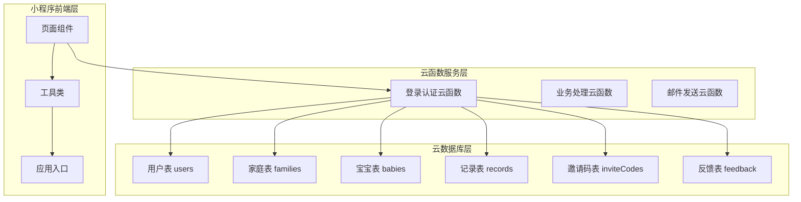
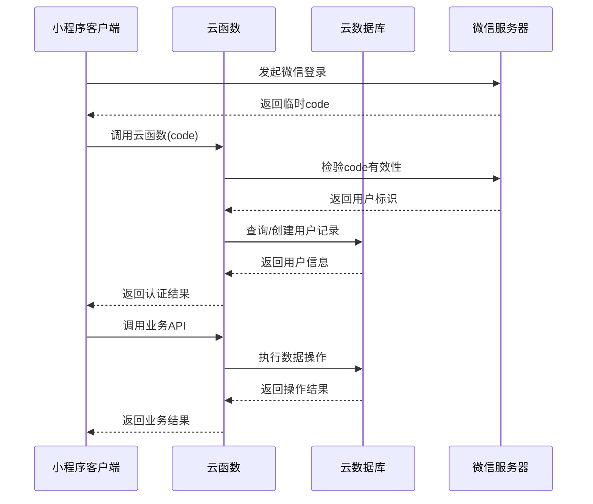
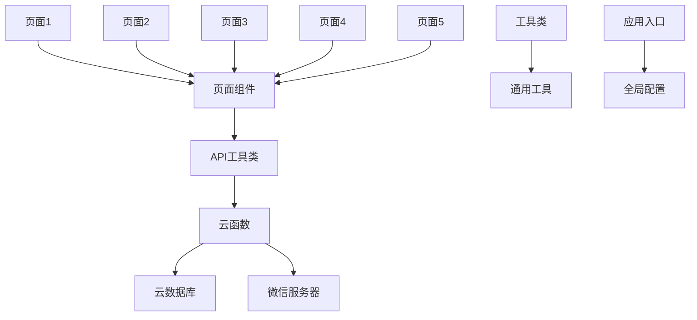

# API接口文档

<cite>
**本文档引用的文件**
- [api.js](file://miniprogram/utils/api.js)
- [util.js](file://miniprogram/utils/util.js)
- [app.js](file://miniprogram/app.js)
- [index.js](file://cloudfunctions/login/index.js)
- [index.js](file://cloudfunctions/sendFeedbackEmail/index.js)
- [app.json](file://miniprogram/app.json)
- [sitemap.json](file://miniprogram/sitemap.json)
- [baby-add.js](file://miniprogram/pages/baby-add/baby-add.js)
- [baby-detail.js](file://miniprogram/pages/baby-detail/baby-detail.js)
- [family.js](file://miniprogram/pages/family/family.js)
- [record-add.js](file://miniprogram/pages/record-add/record-add.js)
- [package.json](file://package.json)
</cite>

## 目录
1. [简介](#简介)
2. [项目结构](#项目结构)
3. [核心组件](#核心组件)
4. [架构概览](#架构概览)
5. [详细组件分析](#详细组件分析)
6. [依赖关系分析](#依赖关系分析)
7. [性能考虑](#性能考虑)
8. [故障排除指南](#故障排除指南)
9. [结论](#结论)
10. [附录](#附录)

## 简介

宝宝助手小程序是一个专为父母设计的宝宝成长记录工具，基于微信小程序平台开发，使用腾讯云开发能力实现数据存储和业务逻辑处理。该系统提供了完整的家庭管理、宝宝信息管理、成长记录跟踪等功能，支持多用户协作和权限控制。

## 项目结构

项目采用典型的微信小程序三层架构设计：



**图表来源**
- [app.js:1-56](file://miniprogram/app.js#L1-L56)
- [api.js:1-873](file://miniprogram/utils/api.js#L1-L873)
- [index.js:1-786](file://cloudfunctions/login/index.js#L1-L786)

**章节来源**
- [app.json:1-39](file://miniprogram/app.json#L1-L39)
- [sitemap.json:1-7](file://miniprogram/sitemap.json#L1-L7)

## 核心组件

### 认证与会话管理

系统采用微信小程序登录机制，通过云函数实现用户认证和会话管理：

- **登录流程**: 小程序启动时自动调用微信登录，获取临时code并调用云函数换取用户信息
- **会话存储**: 用户信息存储在全局变量和本地存储中，支持跨页面访问
- **权限验证**: 基于用户openID进行权限验证和数据隔离

### 数据访问层

封装了完整的CRUD操作，提供统一的数据访问接口：

- **宝宝管理**: 添加、删除、更新宝宝信息
- **记录管理**: 成长数据的增删改查
- **家庭管理**: 家庭创建、成员管理、权限控制
- **用户管理**: 基础用户信息维护

**章节来源**
- [api.js:1-873](file://miniprogram/utils/api.js#L1-L873)
- [app.js:28-54](file://miniprogram/app.js#L28-L54)

## 架构概览

系统采用前后端分离架构，通过云函数作为中间层处理业务逻辑：



**图表来源**
- [app.js:28-54](file://miniprogram/app.js#L28-L54)
- [index.js:735-785](file://cloudfunctions/login/index.js#L735-L785)

## 详细组件分析

### 用户认证API

#### 登录接口
- **HTTP方法**: GET/POST
- **URL模式**: `/login`
- **请求参数**: 
  - `code`: 微信登录临时code
- **响应格式**: 
  ```json
  {
    "success": true,
    "userInfo": {
      "openid": "string",
      "createTime": "datetime",
      "lastLoginTime": "datetime"
    }
  }
  ```
- **错误码**: 
  - 400: 缺少必要参数
  - 500: 登录失败

#### 权限检查接口
- **HTTP方法**: POST
- **URL模式**: `/checkPermission`
- **请求参数**: 
  - `babyId`: 宝宝ID
  - `requiredPermission`: 所需权限级别
- **响应格式**: 
  ```json
  {
    "success": true,
    "hasPermission": true
  }
  ```

**章节来源**
- [api.js:776-809](file://miniprogram/utils/api.js#L776-L809)
- [index.js:735-785](file://cloudfunctions/login/index.js#L735-L785)

### 宝宝管理API

#### 获取宝宝列表
- **HTTP方法**: GET
- **URL模式**: `/getBabies`
- **请求参数**: 无
- **响应格式**: 
  ```json
  {
    "success": true,
    "babies": [
      {
        "_id": "string",
        "name": "string",
        "gender": "male|female",
        "birthDate": "date",
        "avatarUrl": "string",
        "familyId": "string",
        "openid": "string",
        "createTime": "datetime"
      }
    ]
  }
  ```

#### 添加宝宝
- **HTTP方法**: POST
- **URL模式**: `/addBaby`
- **请求参数**: 
  - `familyId`: 家庭ID
  - `name`: 宝宝姓名
  - `gender`: 性别
  - `birthDate`: 出生日期
  - `birthHeight`: 出生身高
  - `birthWeight`: 出生体重
- **响应格式**: 
  ```json
  {
    "success": true,
    "baby": {
      "_id": "string",
      "name": "string",
      "gender": "male|female",
      "birthDate": "date",
      "avatarUrl": "string",
      "familyId": "string",
      "openid": "string",
      "createTime": "datetime"
    }
  }
  ```

#### 删除宝宝
- **HTTP方法**: DELETE
- **URL模式**: `/deleteBaby/{id}`
- **请求参数**: `id`: 宝宝ID
- **响应格式**: `{ "success": true }`

**章节来源**
- [api.js:43-234](file://miniprogram/utils/api.js#L43-L234)
- [index.js:40-82](file://cloudfunctions/login/index.js#L40-L82)

### 成长记录API

#### 获取记录列表
- **HTTP方法**: GET
- **URL模式**: `/getRecords`
- **请求参数**: 无
- **响应格式**: 
  ```json
  {
    "success": true,
    "records": [
      {
        "_id": "string",
        "babyId": "string",
        "height": "number",
        "weight": "number",
        "recordDate": "date",
        "ageInMonths": "number",
        "openid": "string",
        "createTime": "datetime"
      }
    ]
  }
  ```

#### 添加记录
- **HTTP方法**: POST
- **URL模式**: `/addRecord`
- **请求参数**: 
  - `babyId`: 宝宝ID
  - `height`: 身高(cm)
  - `weight`: 体重(kg)
  - `recordDate`: 记录日期
- **响应格式**: 
  ```json
  {
    "success": true,
    "record": {
      "_id": "string",
      "babyId": "string",
      "height": "number",
      "weight": "number",
      "recordDate": "date",
      "ageInMonths": "number",
      "openid": "string",
      "createTime": "datetime"
    }
  }
  ```

#### 删除记录
- **HTTP方法**: DELETE
- **URL模式**: `/deleteRecord/{id}`
- **请求参数**: `id`: 记录ID
- **响应格式**: `{ "success": true }`

**章节来源**
- [api.js:236-368](file://miniprogram/utils/api.js#L236-L368)
- [index.js:492-534](file://cloudfunctions/login/index.js#L492-L534)

### 家庭管理API

#### 获取家庭列表
- **HTTP方法**: GET
- **URL模式**: `/getFamilies`
- **请求参数**: 无
- **响应格式**: 
  ```json
  {
    "success": true,
    "families": [
      {
        "_id": "string",
        "name": "string",
        "creatorOpenid": "string",
        "members": [
          {
            "openid": "string",
            "nickName": "string",
            "avatarUrl": "string",
            "permission": "guardian|caretaker|viewer",
            "joinTime": "datetime"
          }
        ],
        "colorIndex": "number",
        "createTime": "datetime"
      }
    ]
  }
  ```

#### 创建家庭
- **HTTP方法**: POST
- **URL模式**: `/createFamily`
- **请求参数**: 
  - `familyName`: 家庭名称
  - `userInfo`: 用户信息
- **响应格式**: 
  ```json
  {
    "success": true,
    "family": {
      "_id": "string",
      "name": "string",
      "creatorOpenid": "string",
      "members": [],
      "colorIndex": "number",
      "createTime": "datetime"
    }
  }
  ```

#### 加入家庭
- **HTTP方法**: POST
- **URL模式**: `/joinFamily`
- **请求参数**: `inviteCode`: 邀请码
- **响应格式**: `{ "success": true }`

#### 创建邀请码
- **HTTP方法**: POST
- **URL模式**: `/createInviteCode`
- **请求参数**: 
  - `familyId`: 家庭ID
  - `memberType`: 成员类型
- **响应格式**: 
  ```json
  {
    "success": true,
    "inviteCode": "string"
  }
  ```

**章节来源**
- [api.js:429-557](file://miniprogram/utils/api.js#L429-L557)
- [index.js:84-136](file://cloudfunctions/login/index.js#L84-L136)

### 权限控制API

#### 更新成员权限
- **HTTP方法**: POST
- **URL模式**: `/updateMemberPermission`
- **请求参数**: 
  - `familyId`: 家庭ID
  - `memberOpenid`: 成员openID
  - `permission`: 新权限级别
- **响应格式**: `{ "success": true }`

#### 移除家庭成员
- **HTTP方法**: POST
- **URL模式**: `/removeFamilyMember`
- **请求参数**: 
  - `familyId`: 家庭ID
  - `memberOpenid`: 成员openID
- **响应格式**: `{ "success": true }`

#### 更新家庭名称
- **HTTP方法**: POST
- **URL模式**: `/updateFamilyName`
- **请求参数**: 
  - `familyId`: 家庭ID
  - `newName`: 新名称
- **响应格式**: `{ "success": true }`

**章节来源**
- [api.js:711-774](file://miniprogram/utils/api.js#L711-L774)
- [index.js:166-246](file://cloudfunctions/login/index.js#L166-L246)

### 反馈系统API

#### 提交反馈（云函数，非 HTTP 路径）

小程序通过 `wx.cloud.callFunction` 调用 **`login`**，**不是** REST `/submitFeedback`。

- **云函数**: `login`
- **参数**: `action: 'submitFeedback'`，`content`（字符串），`imageFileIds`（已上传的 `cloud://` fileID 数组，≤3，路径须含 `feedback/`）
- **成功时 `result` 常见字段**: `success`, `feedbackId`, `emailOk`, `emailMessage`
- **说明**: 写库与触发邮件在 `login` 内完成；`sendFeedbackEmail` 由 `login` 服务端调用，前端无需直接调用。

**章节来源**
- [family.js](file://miniprogram/pages/family/family.js)（`submitFeedback`）
- [api.js](file://miniprogram/utils/api.js)（`submitFeedback`）
- [login/index.js](file://cloudfunctions/login/index.js)（`submitFeedback` 分支）
- [sendFeedbackEmail/index.js](file://cloudfunctions/sendFeedbackEmail/index.js)（SMTP 实现）

## 依赖关系分析

系统采用模块化设计，各组件间依赖关系清晰：



**图表来源**
- [app.js:1-56](file://miniprogram/app.js#L1-L56)
- [api.js:1-10](file://miniprogram/utils/api.js#L1-L10)

**章节来源**
- [app.json:2-8](file://miniprogram/app.json#L2-L8)

## 性能考虑

### 数据缓存策略
- **用户信息缓存**: 登录成功后存储在全局变量和本地存储中
- **页面数据缓存**: 页面切换时保持数据状态，减少重复请求
- **图表数据优化**: 使用ECharts进行高效渲染，支持数据缩放和平移

### 网络优化
- **批量请求**: 家庭信息获取时一次性获取所有相关数据
- **延迟加载**: 图表组件采用懒加载方式，提升首屏性能
- **请求去重**: 对重复的API请求进行去重处理

### 数据验证
- **前端验证**: 表单输入进行实时验证，提升用户体验
- **后端验证**: 云函数对所有输入参数进行严格验证
- **权限验证**: 每次操作前进行权限检查

## 故障排除指南

### 常见问题及解决方案

#### 登录失败
- **症状**: 用户无法登录，显示登录失败
- **原因**: 微信服务器连接异常或code过期
- **解决**: 重新触发登录流程，检查网络连接

#### 权限不足
- **症状**: 操作被拒绝，提示无权限
- **原因**: 当前用户权限级别不够
- **解决**: 检查家庭成员权限设置，联系一级助教提升权限

#### 数据同步问题
- **症状**: 页面显示数据不一致
- **原因**: 缓存数据未及时更新
- **解决**: 刷新页面或手动触发数据刷新

#### 图表显示异常
- **症状**: 图表无法正常显示或显示错误
- **原因**: 数据格式不正确或ECharts初始化失败
- **解决**: 检查数据源格式，重新初始化图表组件

**章节来源**
- [api.js:14-41](file://miniprogram/utils/api.js#L14-L41)
- [baby-detail.js:323-397](file://miniprogram/pages/baby-detail/baby-detail.js#L323-L397)

## 结论

宝宝助手小程序通过合理的架构设计和完善的API接口，为用户提供了完整的宝宝成长记录解决方案。系统具有以下特点：

1. **安全性**: 基于微信登录机制和云函数权限控制，确保数据安全
2. **易用性**: 界面简洁直观，操作流程清晰
3. **可扩展性**: 模块化设计便于功能扩展和维护
4. **性能优化**: 多层次缓存和优化策略保证良好用户体验

## 附录

### 接口版本管理

**当前小程序产品版本**：v3.0.0（与仓库 `README.md` / `wiki/项目概述.md` 一致）。

系统采用语义化版本控制：
- **版本格式**: 主版本号.次版本号.修订号
- **版本演进**: 
  - 主版本号变更：重大架构调整
  - 次版本号变更：新增功能但保持向后兼容
  - 修订号变更：bug修复和小功能调整

### 错误码规范

| 错误码 | 错误类型 | 描述 |
|--------|----------|------|
| 400 | 参数错误 | 请求参数缺失或格式不正确 |
| 401 | 未授权 | 用户未登录或会话失效 |
| 403 | 权限不足 | 当前用户权限不足以执行操作 |
| 404 | 资源不存在 | 请求的资源不存在 |
| 500 | 服务器错误 | 服务器内部错误 |

### 最佳实践

1. **前端开发**:
   - 使用Promise处理异步操作
   - 实现完善的错误处理机制
   - 优化用户体验，提供加载状态提示

2. **后端开发**:
   - 严格的数据验证和权限检查
   - 使用事务保证数据一致性
   - 实现日志记录便于问题排查

3. **性能优化**:
   - 合理使用缓存机制
   - 优化数据库查询性能
   - 实现分页加载大数据集

**章节来源**
- [package.json:1-22](file://package.json#L1-L22)