# 家庭管理API

<cite>
**本文档引用的文件**
- [family.js](file://miniprogram/pages/family/family.js)
- [api.js](file://miniprogram/utils/api.js)
- [index.js](file://cloudfunctions/login/index.js)
- [family.wxml](file://miniprogram/pages/family/family.wxml)
- [family.wxss](file://miniprogram/pages/family/family.wxss)
- [index.js](file://cloudfunctions/sendFeedbackEmail/index.js)
</cite>

## 目录
1. [简介](#简介)
2. [项目结构](#项目结构)
3. [核心组件](#核心组件)
4. [架构概览](#架构概览)
5. [详细组件分析](#详细组件分析)
6. [依赖关系分析](#依赖关系分析)
7. [性能考虑](#性能考虑)
8. [故障排除指南](#故障排除指南)
9. [结论](#结论)

## 简介

家庭管理API是BabyAssistant微信小程序的核心功能模块，负责管理用户家庭协作场景下的各种操作。该系统提供了完整的家庭生命周期管理，包括家庭创建、成员管理、权限控制、邀请码管理等功能。

系统采用前后端分离架构，前端通过云函数调用实现数据库操作，确保权限控制的安全性和一致性。后端云函数负责执行具体的业务逻辑和数据验证。

## 项目结构

项目采用微信小程序标准目录结构，家庭管理功能主要分布在以下目录：

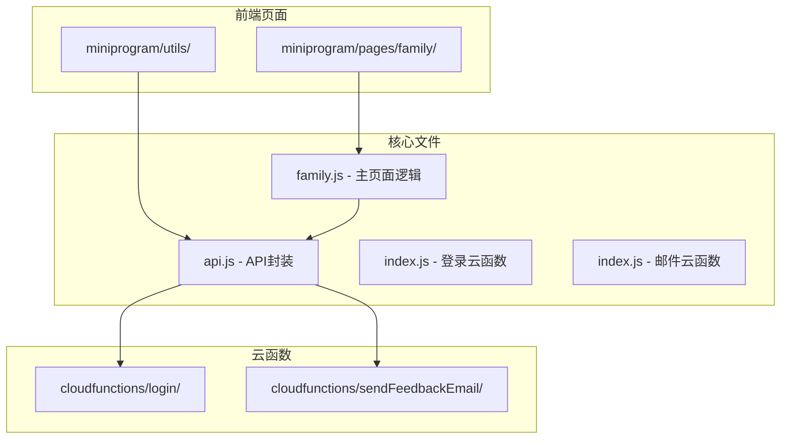

**图表来源**
- [family.js:1-757](file://miniprogram/pages/family/family.js#L1-L757)
- [api.js:1-879](file://miniprogram/utils/api.js#L1-L879)
- [index.js:1-814](file://cloudfunctions/login/index.js#L1-L814)

**章节来源**
- [family.js:1-757](file://miniprogram/pages/family/family.js#L1-L757)
- [api.js:1-879](file://miniprogram/utils/api.js#L1-L879)

## 核心组件

### 家庭管理组件

系统的核心组件包括：

1. **家庭信息管理** - 创建、查询、更新家庭信息
2. **成员管理** - 成员邀请、加入、退出、权限管理
3. **权限控制系统** - 基于角色的权限验证
4. **邀请码系统** - 邀请码生成、验证、过期管理
5. **数据同步** - 跨家庭数据一致性保证

### 数据模型

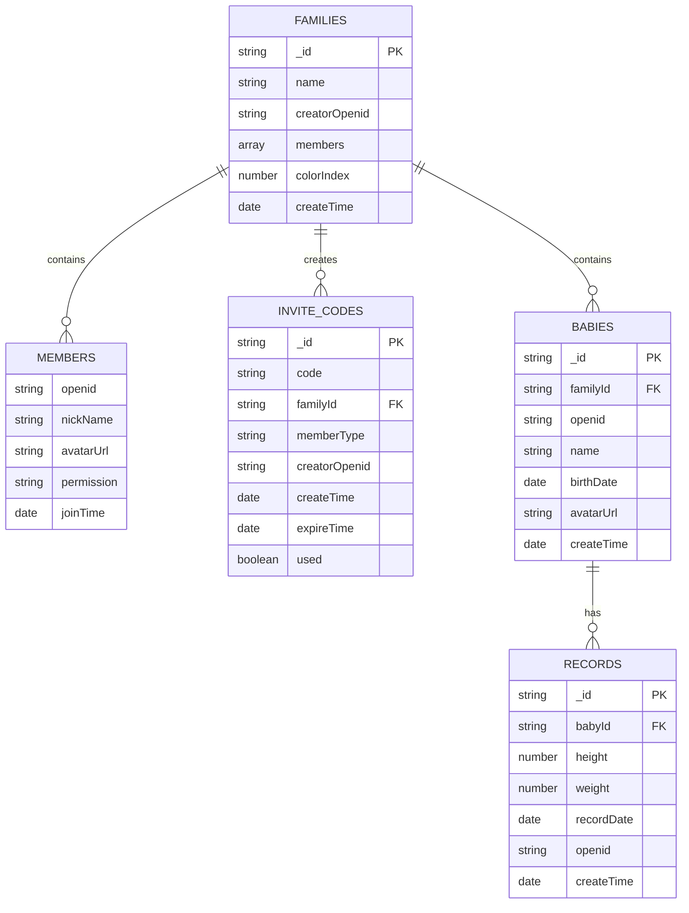

**图表来源**
- [index.js:95-151](file://cloudfunctions/login/index.js#L95-L151)
- [index.js:659-699](file://cloudfunctions/login/index.js#L659-L699)

**章节来源**
- [index.js:95-151](file://cloudfunctions/login/index.js#L95-L151)
- [index.js:659-699](file://cloudfunctions/login/index.js#L659-L699)

## 架构概览

系统采用三层架构设计：

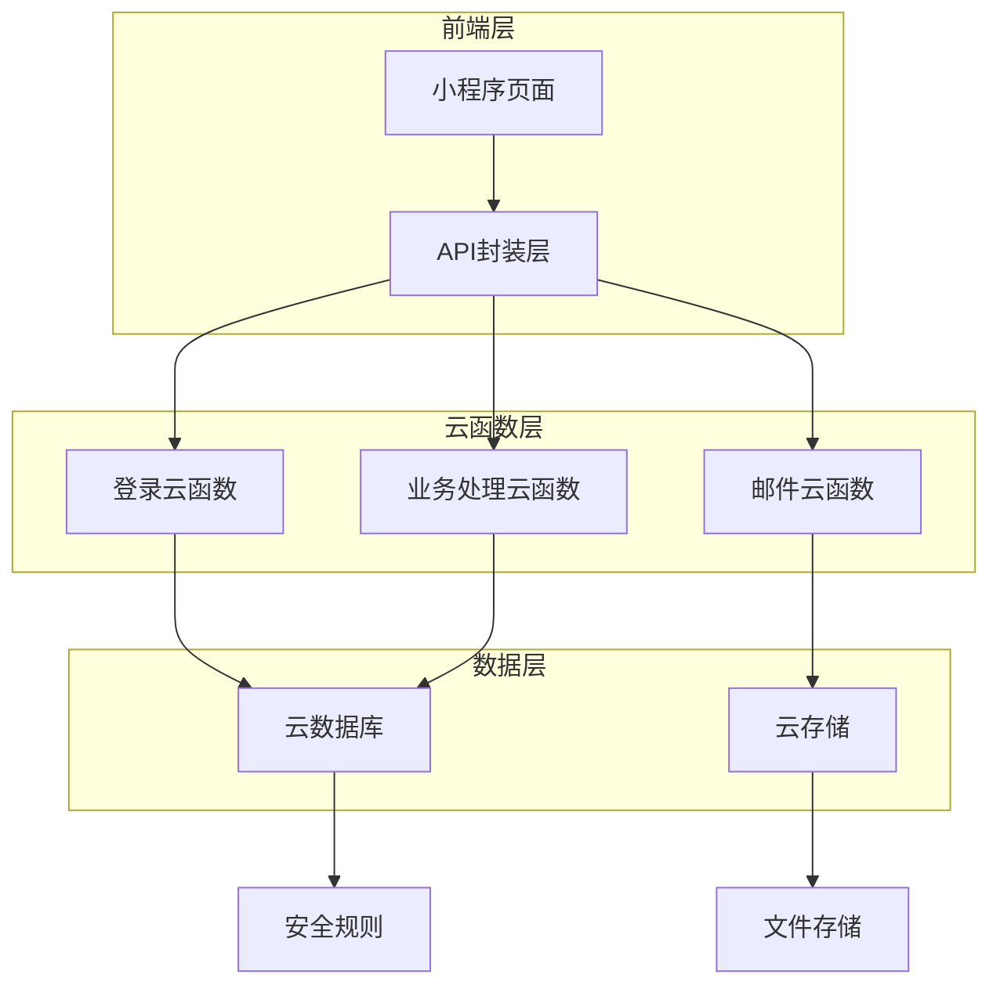

**图表来源**
- [family.js:2-3](file://miniprogram/pages/family/family.js#L2-L3)
- [api.js:58-63](file://miniprogram/utils/api.js#L58-L63)
- [index.js:22-24](file://cloudfunctions/login/index.js#L22-L24)

### 权限控制机制

系统实现了基于角色的权限控制（RBAC）：

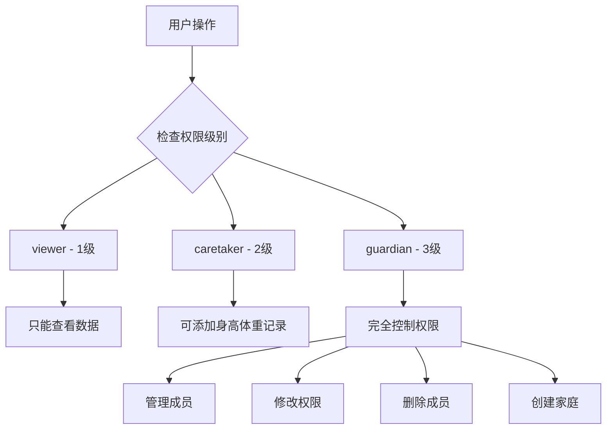

**图表来源**
- [api.js:814-824](file://miniprogram/utils/api.js#L814-L824)
- [family.wxml:102-114](file://miniprogram/pages/family/family.wxml#L102-L114)

**章节来源**
- [api.js:814-824](file://miniprogram/utils/api.js#L814-L824)
- [family.wxml:102-114](file://miniprogram/pages/family/family.wxml#L102-L114)

## 详细组件分析

### 家庭创建流程

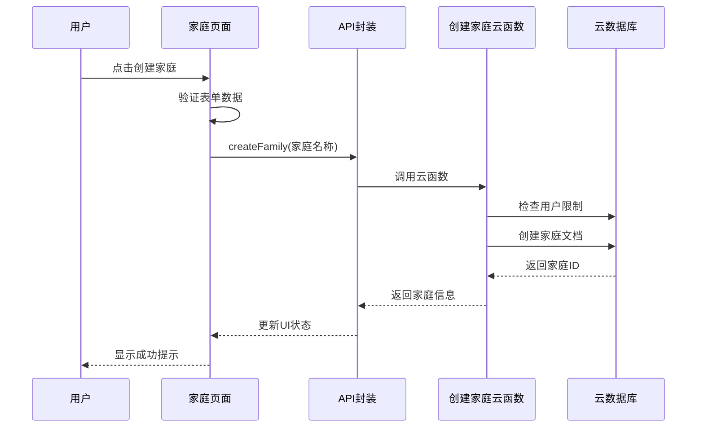

**图表来源**
- [family.js:102-130](file://miniprogram/pages/family/family.js#L102-L130)
- [api.js:498-529](file://miniprogram/utils/api.js#L498-L529)
- [index.js:95-151](file://cloudfunctions/login/index.js#L95-L151)

### 成员邀请流程

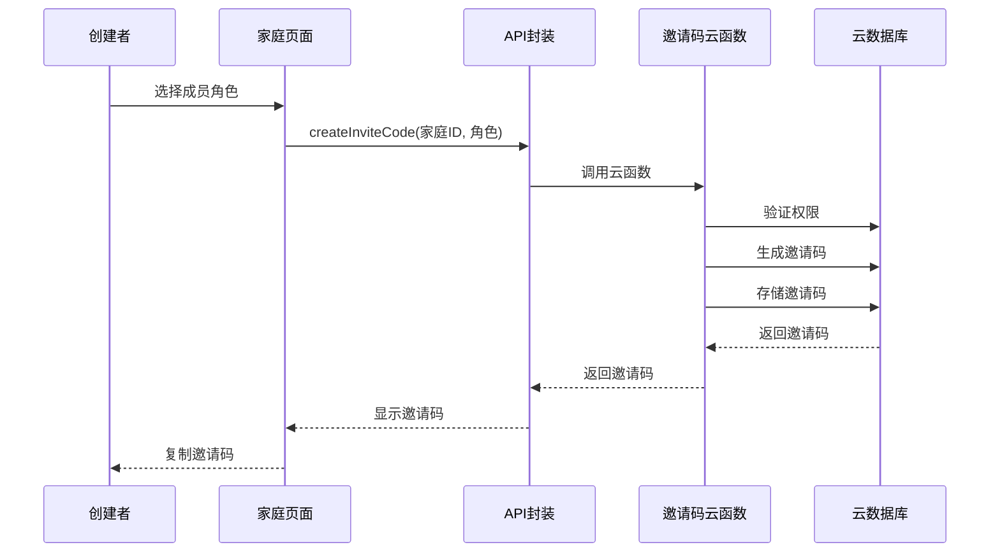

**图表来源**
- [family.js:237-257](file://miniprogram/pages/family/family.js#L237-L257)
- [api.js:531-563](file://miniprogram/utils/api.js#L531-L563)
- [index.js:659-699](file://cloudfunctions/login/index.js#L659-L699)

### 成员加入流程

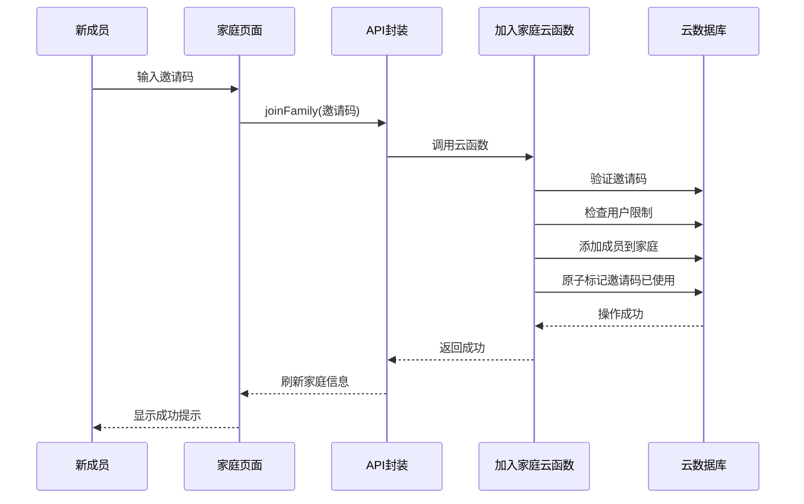

**图表来源**
- [family.js:600-624](file://miniprogram/pages/family/family.js#L600-L624)
- [api.js:565-624](file://miniprogram/utils/api.js#L565-L624)
- [index.js:268-371](file://cloudfunctions/login/index.js#L268-L371)

### 权限管理系统

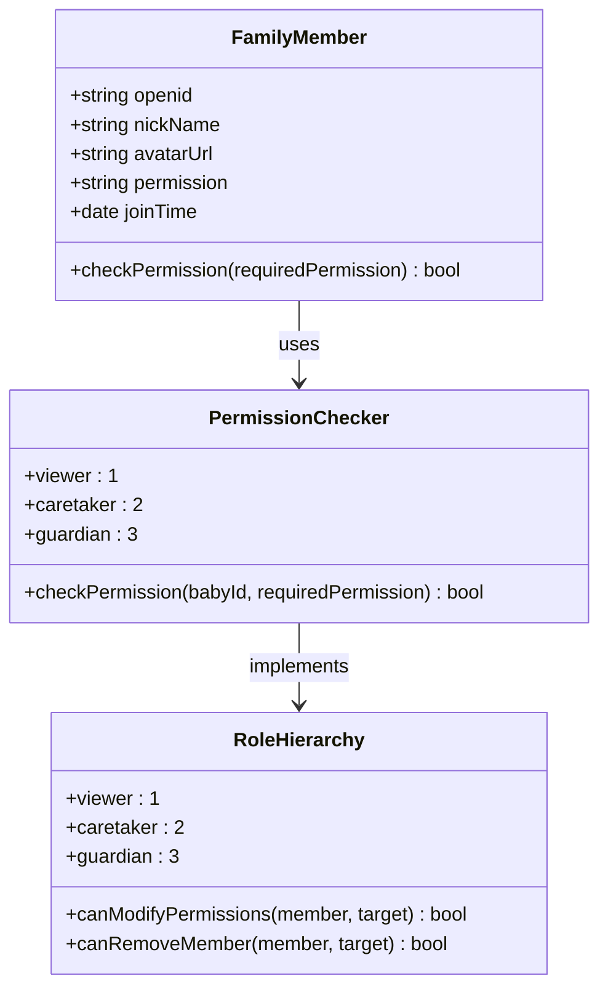

**图表来源**
- [api.js:814-824](file://miniprogram/utils/api.js#L814-L824)
- [index.js:186-225](file://cloudfunctions/login/index.js#L186-L225)

**章节来源**
- [api.js:814-824](file://miniprogram/utils/api.js#L814-L824)
- [index.js:186-225](file://cloudfunctions/login/index.js#L186-L225)

## 依赖关系分析

### 组件依赖图

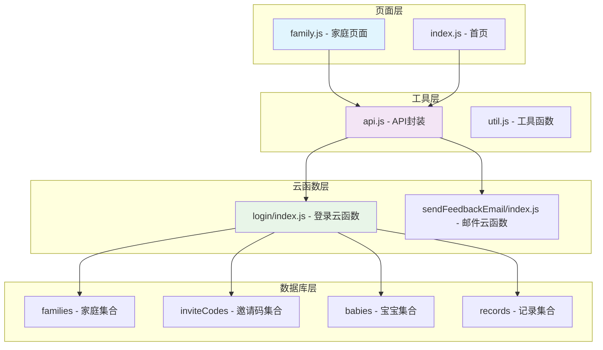

**图表来源**
- [family.js:1-3](file://miniprogram/pages/family/family.js#L1-L3)
- [api.js:1-11](file://miniprogram/utils/api.js#L1-L11)
- [index.js:1-9](file://cloudfunctions/login/index.js#L1-L9)

### 数据流分析

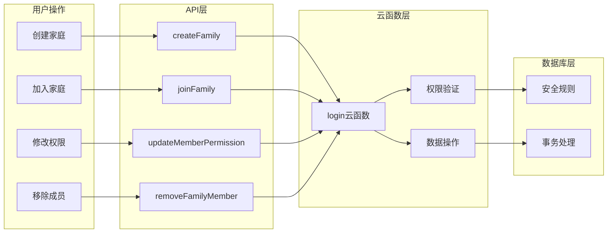

**图表来源**
- [api.js:498-780](file://miniprogram/utils/api.js#L498-L780)
- [index.js:22-800](file://cloudfunctions/login/index.js#L22-L800)

**章节来源**
- [api.js:498-780](file://miniprogram/utils/api.js#L498-L780)
- [index.js:22-800](file://cloudfunctions/login/index.js#L22-L800)

## 性能考虑

### 缓存策略

系统采用了多层缓存机制：

1. **前端缓存** - 页面数据缓存，减少重复请求
2. **云函数缓存** - 频繁访问的数据进行缓存
3. **数据库索引** - 优化查询性能

### 并发控制

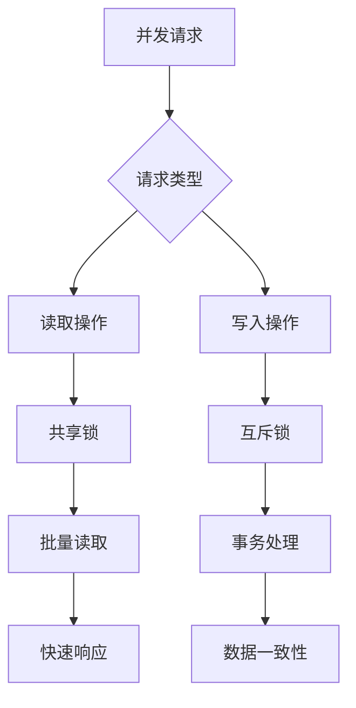

### 错误处理

系统实现了完善的错误处理机制：

- **网络异常** - 自动重试和降级处理
- **权限错误** - 清晰的错误提示和引导
- **数据异常** - 完善的边界检查和异常捕获

## 故障排除指南

### 常见问题及解决方案

| 问题类型 | 症状 | 可能原因 | 解决方案 |
|---------|------|----------|----------|
| 家庭创建失败 | 显示"创建失败" | 用户已创建家庭 | 检查用户创建限制 |
| 邀请码无效 | 显示"邀请码无效" | 邀请码过期或不存在 | 重新生成邀请码 |
| 权限不足 | 操作被拒绝 | 当前权限级别不够 | 提升权限或联系管理员 |
| 成员加入失败 | 无法加入家庭 | 用户已加入过多家庭 | 退出其他家庭 |

### 调试技巧

1. **日志分析** - 查看云函数日志了解具体错误
2. **数据验证** - 检查数据库中的数据完整性
3. **权限检查** - 验证用户在家庭中的权限级别

**章节来源**
- [index.js:200-213](file://cloudfunctions/login/index.js#L200-L213)
- [index.js:241-254](file://cloudfunctions/login/index.js#L241-L254)

## 结论

家庭管理API系统提供了完整、安全、易用的家庭协作功能。通过云函数实现的权限控制确保了数据安全，通过清晰的角色定义实现了灵活的权限管理。

系统的主要优势包括：
- **安全性** - 基于云函数的权限验证
- **易用性** - 直观的界面和操作流程
- **扩展性** - 模块化的架构设计
- **可靠性** - 完善的错误处理和数据一致性保证

未来可以考虑的功能增强：
- 家庭合并功能
- 更细粒度的权限控制
- 家庭历史记录追踪
- 多设备同步支持