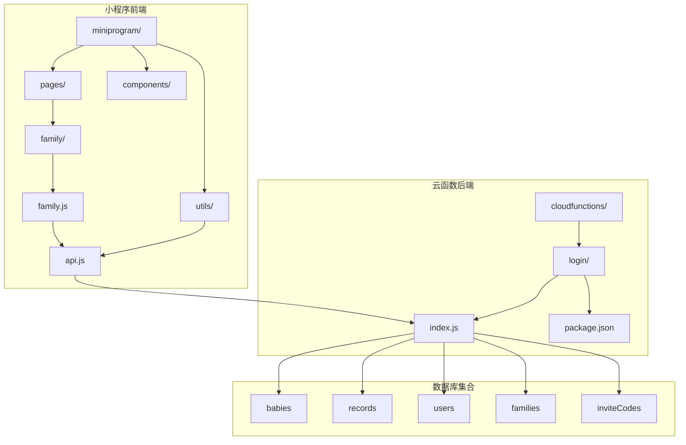
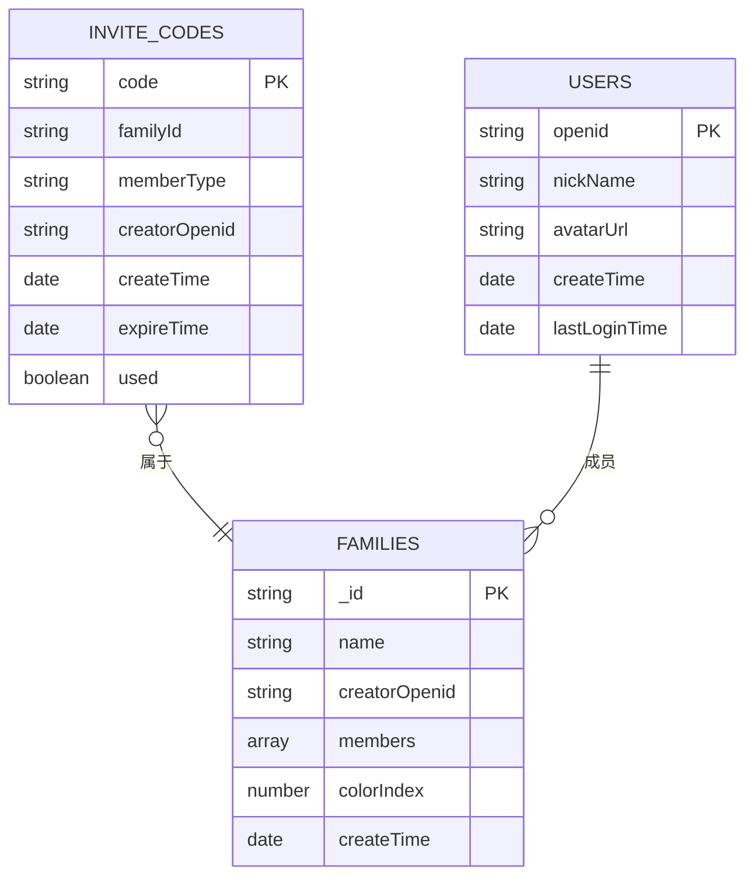
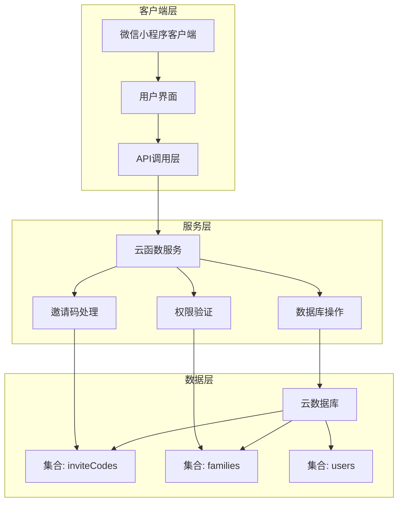
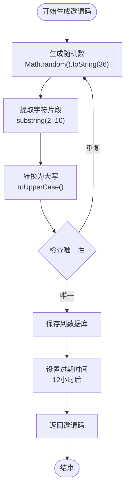
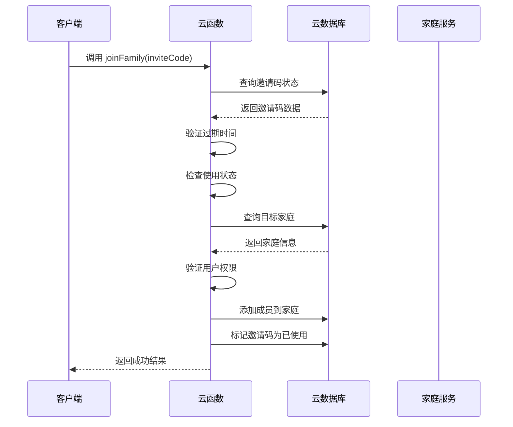
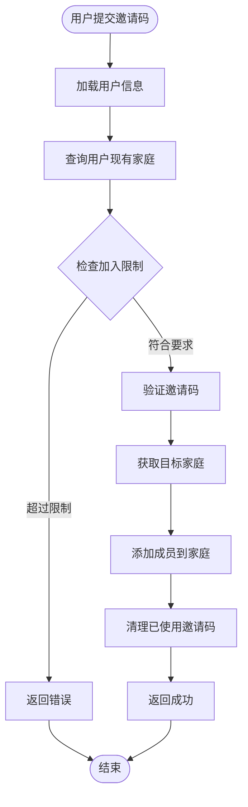
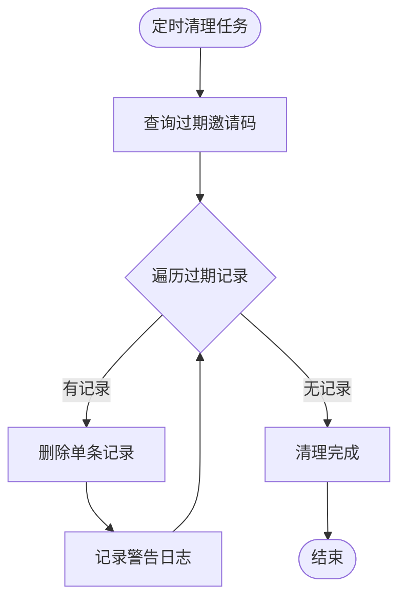
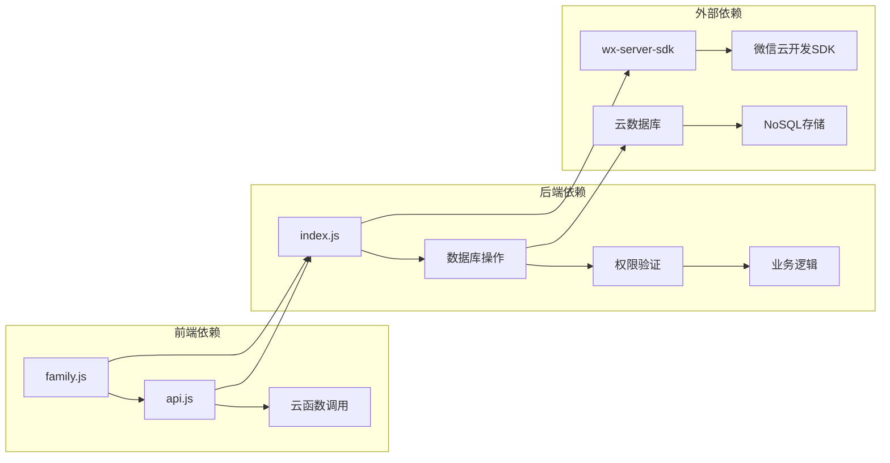

# 邀请码系统

<cite>
**本文档引用的文件**
- [cloudfunctions/login/index.js](file://cloudfunctions/login/index.js)
- [cloudfunctions/login/package.json](file://cloudfunctions/login/package.json)
- [miniprogram/pages/family/family.js](file://miniprogram/pages/family/family.js)
- [miniprogram/utils/api.js](file://miniprogram/utils/api.js)
- [README.md](file://README.md)
</cite>

## 目录
1. [简介](#简介)
2. [项目结构](#项目结构)
3. [核心组件](#核心组件)
4. [架构概览](#架构概览)
5. [详细组件分析](#详细组件分析)
6. [依赖关系分析](#依赖关系分析)
7. [性能考虑](#性能考虑)
8. [故障排除指南](#故障排除指南)
9. [结论](#结论)
10. [附录](#附录)

## 简介

邀请码系统是"萌芽季"微信小程序的重要功能模块，基于腾讯云开发平台构建。该系统实现了家庭成员邀请、权限管理、安全验证等核心功能，为多用户协作提供了完整的解决方案。

系统采用云函数架构，通过邀请码实现家庭成员的邀请和加入，支持多种权限级别（一级助教、二级助教、围观吃瓜），并具备完善的安全机制和生命周期管理。

## 项目结构

该项目采用前后端分离的架构设计，主要包含以下核心组件：

**图表来源**
- [cloudfunctions/login/index.js:1-814](file://cloudfunctions/login/index.js#L1-L814)
- [miniprogram/pages/family/family.js:1-757](file://miniprogram/pages/family/family.js#L1-L757)
- [miniprogram/utils/api.js:1-879](file://miniprogram/utils/api.js#L1-L879)

**章节来源**
- [README.md:77-103](file://README.md#L77-L103)

## 核心组件

### 云函数核心功能

云函数作为系统的核心处理单元，实现了以下关键功能：

1. **邀请码生成** - 基于随机数生成算法创建唯一邀请码
2. **邀请码验证** - 检查邀请码的有效性、过期时间和使用状态
3. **成员邀请** - 处理用户通过邀请码加入家庭的流程
4. **权限管理** - 控制不同权限级别的成员邀请能力
5. **生命周期管理** - 自动清理过期的邀请码

### 数据模型设计

系统采用简洁高效的数据模型设计：

**图表来源**
- [cloudfunctions/login/index.js:676-689](file://cloudfunctions/login/index.js#L676-L689)

**章节来源**
- [cloudfunctions/login/index.js:658-760](file://cloudfunctions/login/index.js#L658-L760)

## 架构概览

系统采用三层架构设计，确保了良好的可维护性和扩展性：

**图表来源**
- [cloudfunctions/login/index.js:22-814](file://cloudfunctions/login/index.js#L22-L814)
- [miniprogram/utils/api.js:531-624](file://miniprogram/utils/api.js#L531-L624)

## 详细组件分析

### 邀请码生成组件

邀请码生成采用了简洁高效的算法设计：

**图表来源**
- [cloudfunctions/login/index.js:676-689](file://cloudfunctions/login/index.js#L676-L689)

#### 安全生成算法

系统采用以下安全措施确保邀请码的安全性：

1. **随机性保证** - 使用浏览器内置的随机数生成器
2. **字符集限制** - 仅使用字母数字字符，避免歧义字符
3. **长度控制** - 8位字符长度，平衡易用性和安全性
4. **唯一性检查** - 生成后进行数据库唯一性验证

**章节来源**
- [cloudfunctions/login/index.js:676-689](file://cloudfunctions/login/index.js#L676-L689)

### 邀请码验证组件

邀请码验证流程确保了系统的安全性和可靠性：

**图表来源**
- [cloudfunctions/login/index.js:268-371](file://cloudfunctions/login/index.js#L268-L371)

#### 验证流程详解

验证过程包含多个安全检查步骤：

1. **格式验证** - 确保邀请码格式正确
2. **时效检查** - 验证邀请码是否在有效期内
3. **状态检查** - 确认邀请码未被使用
4. **权限验证** - 验证邀请码创建者的权限
5. **重复检查** - 防止用户重复加入同一家庭

**章节来源**
- [cloudfunctions/login/index.js:272-298](file://cloudfunctions/login/index.js#L272-L298)

### 邀请码使用组件

邀请码使用流程实现了完整的成员加入机制：

**图表来源**
- [cloudfunctions/login/index.js:565-624](file://cloudfunctions/login/index.js#L565-L624)

#### 使用状态管理

系统通过以下机制管理邀请码的使用状态：

1. **原子性操作** - 使用数据库事务确保操作完整性
2. **异步清理** - 使用异步方式清理已使用邀请码
3. **状态标记** - 在数据库层面标记邀请码使用状态
4. **错误恢复** - 处理清理失败的情况但不影响主流程

**章节来源**
- [cloudfunctions/login/index.js:356-368](file://cloudfunctions/login/index.js#L356-L368)

### 过期清理组件

系统实现了自动化的过期清理机制：

**图表来源**
- [cloudfunctions/login/index.js:740-760](file://cloudfunctions/login/index.js#L740-L760)

#### 清理策略设计

清理机制采用了以下设计原则：

1. **异步处理** - 不阻塞主业务流程
2. **容错处理** - 单条记录删除失败不影响整体
3. **日志记录** - 记录清理过程中的异常情况
4. **定期执行** - 通过定时任务确保及时清理

**章节来源**
- [cloudfunctions/login/index.js:691-696](file://cloudfunctions/login/index.js#L691-L696)

## 依赖关系分析

系统各组件之间的依赖关系清晰明确：

**图表来源**
- [cloudfunctions/login/package.json:12-14](file://cloudfunctions/login/package.json#L12-L14)

**章节来源**
- [cloudfunctions/login/package.json:12-14](file://cloudfunctions/login/package.json#L12-L14)

## 性能考虑

### 数据库查询优化

系统在数据库查询方面采用了多项优化策略：

1. **索引设计** - 对常用查询字段建立适当索引
2. **查询条件优化** - 使用精确的查询条件减少扫描范围
3. **批量操作** - 支持批量删除过期邀请码
4. **异步处理** - 将非关键操作异步化处理

### 缓存策略

虽然系统主要依赖实时数据库查询，但可以通过以下方式优化：

1. **结果缓存** - 对频繁访问的用户信息进行短期缓存
2. **查询结果缓存** - 缓存最近查询的家庭和用户信息
3. **网络优化** - 减少不必要的网络往返

### 并发控制

系统通过以下机制处理并发访问：

1. **数据库事务** - 确保关键操作的原子性
2. **乐观锁** - 使用版本控制防止并发冲突
3. **重试机制** - 对临时性错误进行自动重试

## 故障排除指南

### 常见问题及解决方案

#### 邀请码无效问题

**问题描述**：用户收到"邀请码无效或已过期"错误

**可能原因**：
1. 邀请码已过期（12小时有效期）
2. 邀请码已被使用
3. 邀请码格式不正确
4. 数据库连接异常

**解决步骤**：
1. 检查邀请码是否在有效期内
2. 确认邀请码未被其他用户使用
3. 验证邀请码格式（8位字符）
4. 重新生成新的邀请码

#### 权限不足问题

**问题描述**：用户无法创建邀请码

**可能原因**：
1. 当前用户权限不足
2. 用户不是家庭成员
3. 家庭权限配置错误

**解决步骤**：
1. 确认用户具有一级助教或二级助教权限
2. 验证用户确实在目标家庭中
3. 检查家庭权限设置

#### 数据库连接问题

**问题描述**：云函数调用失败

**可能原因**：
1. 云开发环境配置错误
2. 数据库权限不足
3. 网络连接异常

**解决步骤**：
1. 检查云开发环境ID配置
2. 验证数据库访问权限
3. 确认网络连接正常

**章节来源**
- [cloudfunctions/login/index.js:279-280](file://cloudfunctions/login/index.js#L279-L280)
- [cloudfunctions/login/index.js:672-673](file://cloudfunctions/login/index.js#L672-L673)

## 结论

邀请码系统通过精心设计的架构和完善的机制，为多用户协作提供了安全可靠的解决方案。系统的主要优势包括：

1. **安全性** - 采用多重验证机制确保邀请过程安全
2. **易用性** - 简洁的8位邀请码设计便于用户记忆和分享
3. **可靠性** - 自动化的过期清理和错误处理机制
4. **扩展性** - 模块化的架构设计便于功能扩展

系统在设计上充分考虑了微信小程序的技术特点和用户使用习惯，为用户提供流畅的邀请体验。通过合理的权限控制和安全机制，确保了家庭数据的安全性和隐私保护。

## 附录

### API参数说明

#### 创建邀请码接口
- **参数**：familyId, memberType
- **返回**：inviteCode
- **权限**：一级助教、二级助教

#### 加入家庭接口
- **参数**：inviteCode, memberInfo
- **返回**：success
- **权限**：无

#### 清理过期邀请码接口
- **参数**：无
- **返回**：deletedCount
- **权限**：系统自动执行

### 安全策略

1. **邀请码有效期**：12小时自动过期
2. **使用状态控制**：邀请码使用后立即失效
3. **权限验证**：严格检查邀请码创建者权限
4. **重复加入防护**：防止用户重复加入同一家庭
5. **异步清理机制**：后台自动清理过期数据

### 最佳实践

1. **邀请码管理**：建议定期清理过期邀请码
2. **权限分配**：合理分配不同权限级别的成员
3. **监控告警**：建立系统监控和异常告警机制
4. **备份策略**：定期备份重要数据
5. **性能优化**：根据使用量调整数据库配置