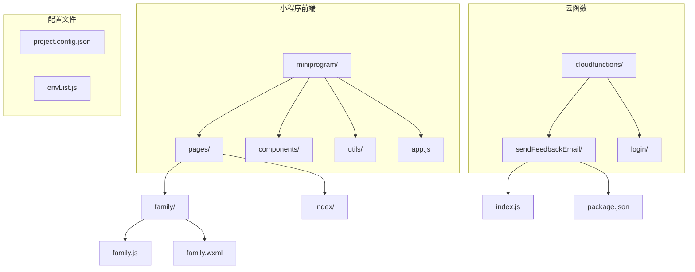
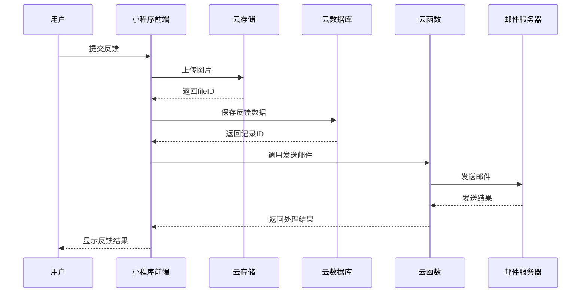
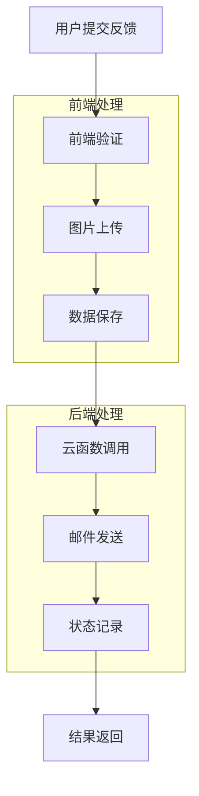
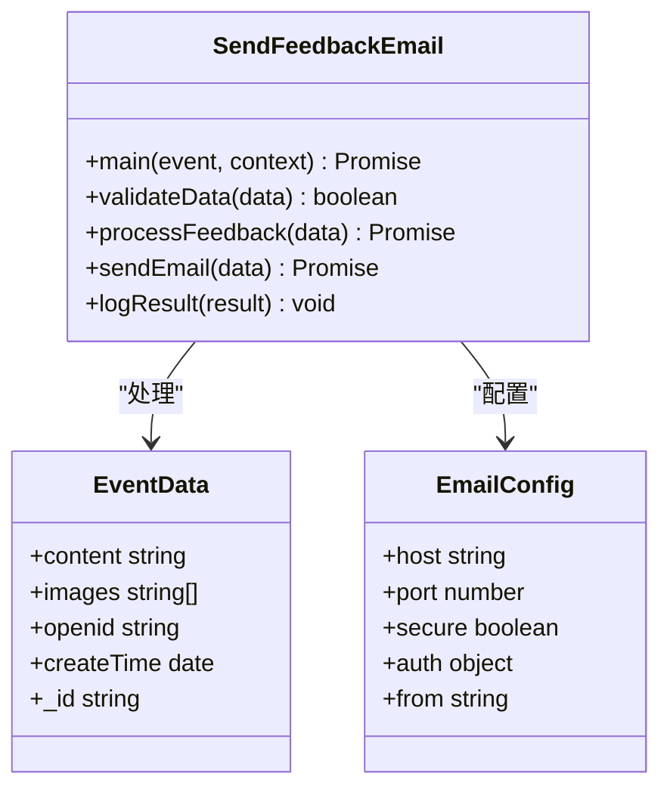
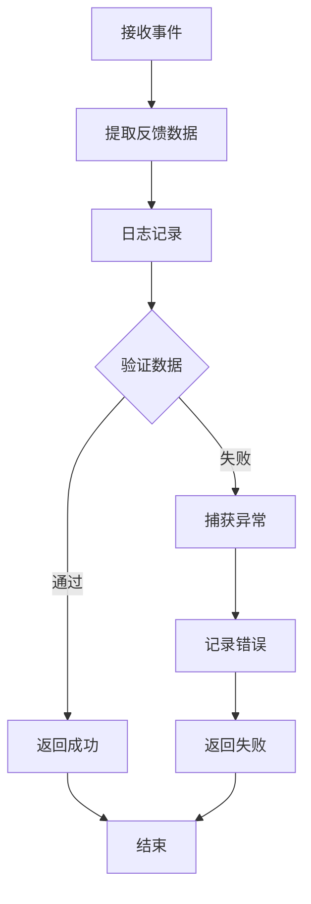
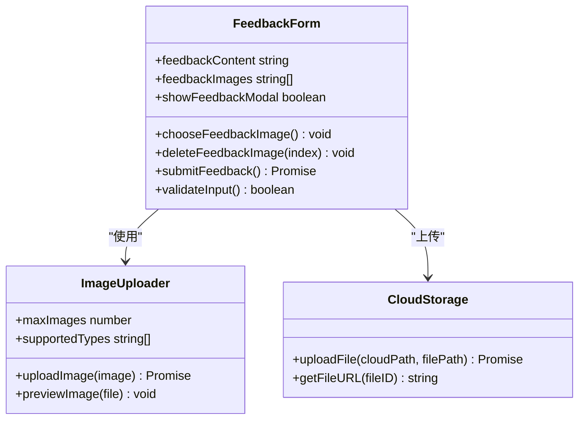
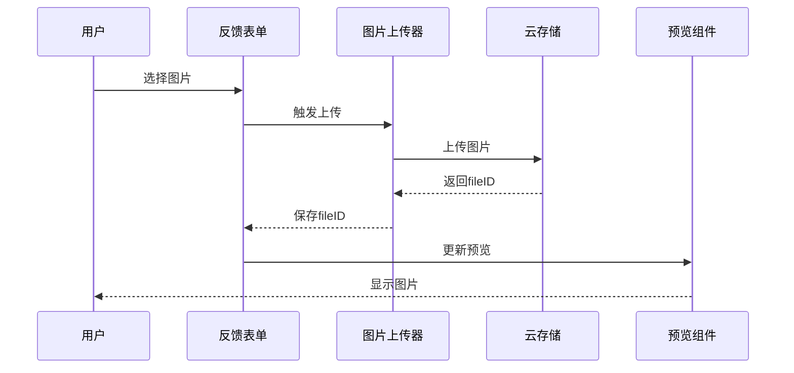
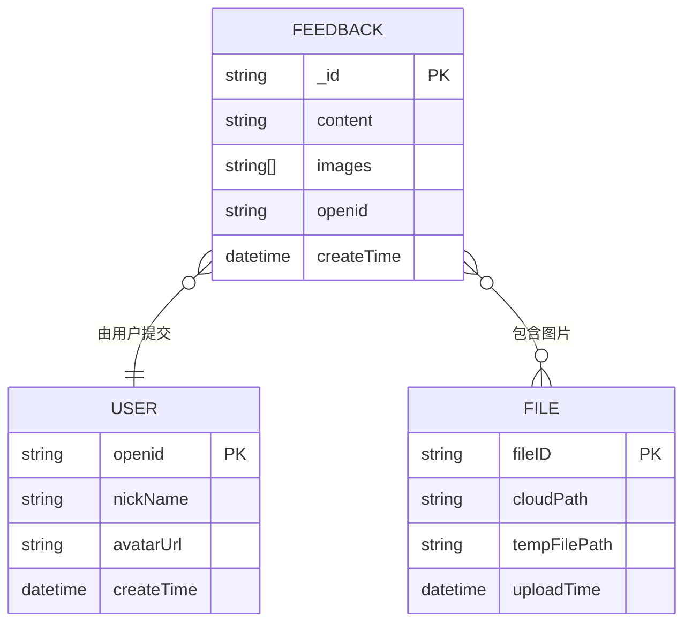
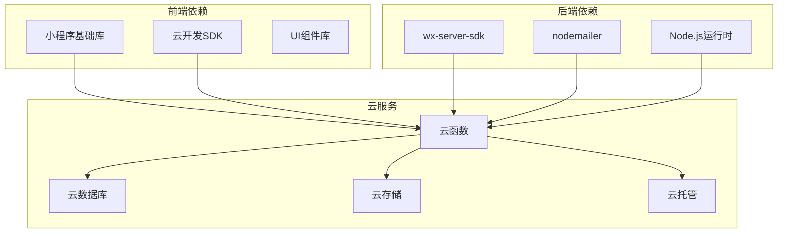

# 邮件通知云函数

<cite>
**本文档引用的文件**
- [sendFeedbackEmail/index.js](file://cloudfunctions/sendFeedbackEmail/index.js)
- [sendFeedbackEmail/package.json](file://cloudfunctions/sendFeedbackEmail/package.json)
- [sendFeedbackEmail/package-lock.json](file://cloudfunctions/sendFeedbackEmail/package-lock.json)
- [family.js](file://miniprogram/pages/family/family.js)
- [family.wxml](file://miniprogram/pages/family/family.wxml)
- [app.js](file://miniprogram/app.js)
- [project.config.json](file://project.config.json)
</cite>

## 目录
1. [简介](#简介)
2. [项目结构](#项目结构)
3. [核心组件](#核心组件)
4. [架构概览](#架构概览)
5. [详细组件分析](#详细组件分析)
6. [依赖关系分析](#依赖关系分析)
7. [性能考虑](#性能考虑)
8. [故障排除指南](#故障排除指南)
9. [结论](#结论)

## 简介

本文档详细介绍了萌芽季小程序的邮件通知云函数实现。该系统实现了完整的反馈邮件发送功能，包括邮件服务集成、邮件模板设计、发送流程控制等核心功能。

系统采用微信云开发平台，通过云函数实现邮件发送功能，前端小程序通过云函数调用实现反馈邮件的自动发送。目前云函数处于开发阶段，具备完整的邮件发送框架，但尚未实现实际的邮件发送逻辑。

## 项目结构

项目采用典型的微信小程序云开发架构，主要包含以下结构：

**图表来源**
- [project.config.json:1-85](file://project.config.json#L1-L85)
- [family.js:1-200](file://miniprogram/pages/family/family.js#L1-L200)

**章节来源**
- [project.config.json:1-85](file://project.config.json#L1-L85)
- [family.js:1-200](file://miniprogram/pages/family/family.js#L1-L200)

## 核心组件

### 云函数核心模块

邮件通知云函数基于微信云开发平台构建，主要包含以下核心组件：

#### 初始化配置
- **环境初始化**: 使用动态环境变量进行配置
- **SDK集成**: 集成wx-server-sdk和nodemailer库
- **依赖管理**: 通过package.json管理第三方依赖

#### 主要功能模块
- **事件处理**: 接收小程序传递的反馈数据
- **数据验证**: 对接收的数据进行基本验证
- **错误处理**: 完善的异常捕获和错误返回机制

**章节来源**
- [sendFeedbackEmail/index.js:1-21](file://cloudfunctions/sendFeedbackEmail/index.js#L1-L21)
- [sendFeedbackEmail/package.json:1-16](file://cloudfunctions/sendFeedbackEmail/package.json#L1-L16)

### 前端交互组件

#### 反馈表单界面
- **表单设计**: 包含文本输入和图片上传功能
- **图片处理**: 支持最多3张图片，最大3张
- **实时预览**: 图片上传后的实时显示功能

#### 数据传输机制
- **云存储集成**: 图片上传到腾讯云存储
- **数据库同步**: 反馈数据保存到云数据库
- **异步调用**: 云函数调用采用异步方式，不影响用户体验

**章节来源**
- [family.wxml:275-342](file://miniprogram/pages/family/family.wxml#L275-L342)
- [family.js:686-757](file://miniprogram/pages/family/family.js#L686-L757)

## 架构概览

系统采用分层架构设计，实现了前后端分离的邮件发送功能：

**图表来源**
- [family.js:686-757](file://miniprogram/pages/family/family.js#L686-L757)
- [sendFeedbackEmail/index.js:7-20](file://cloudfunctions/sendFeedbackEmail/index.js#L7-L20)

### 数据流架构

**图表来源**
- [family.js:696-737](file://miniprogram/pages/family/family.js#L696-L737)
- [sendFeedbackEmail/index.js:8-19](file://cloudfunctions/sendFeedbackEmail/index.js#L8-L19)

## 详细组件分析

### 云函数实现分析

#### 当前实现状态
目前云函数处于开发阶段，实现了基础框架但未实现实际邮件发送功能：

**图表来源**
- [sendFeedbackEmail/index.js:7-20](file://cloudfunctions/sendFeedbackEmail/index.js#L7-L20)

#### 核心处理流程

**图表来源**
- [sendFeedbackEmail/index.js:8-19](file://cloudfunctions/sendFeedbackEmail/index.js#L8-L19)

**章节来源**
- [sendFeedbackEmail/index.js:1-21](file://cloudfunctions/sendFeedbackEmail/index.js#L1-L21)

### 前端交互组件分析

#### 反馈表单组件

**图表来源**
- [family.js:25-26](file://miniprogram/pages/family/family.js#L25-L26)
- [family.js:659-757](file://miniprogram/pages/family/family.js#L659-L757)

#### 图片处理流程

**图表来源**
- [family.js:659-706](file://miniprogram/pages/family/family.js#L659-L706)

**章节来源**
- [family.js:659-757](file://miniprogram/pages/family/family.js#L659-L757)

### 数据模型设计

#### 反馈数据结构

**图表来源**
- [family.js:709-720](file://miniprogram/pages/family/family.js#L709-L720)

**章节来源**
- [family.js:709-720](file://miniprogram/pages/family/family.js#L709-L720)

## 依赖关系分析

### 技术栈依赖

系统采用现代化的全栈技术栈，主要依赖关系如下：

**图表来源**
- [sendFeedbackEmail/package.json:9-12](file://cloudfunctions/sendFeedbackEmail/package.json#L9-L12)

### 第三方库分析

#### 核心依赖库

| 库名称 | 版本 | 用途 | 依赖关系 |
|--------|------|------|----------|
| wx-server-sdk | latest | 微信云开发SDK | 基础依赖 |
| nodemailer | latest | 邮件发送库 | 核心功能 |
| @cloudbase/database | 1.4.1 | 数据库操作 | 云开发 |
| @cloudbase/node-sdk | 2.10.0 | 云服务SDK | 云开发 |

**章节来源**
- [sendFeedbackEmail/package-lock.json:1-15](file://cloudfunctions/sendFeedbackEmail/package-lock.json#L1-L15)

## 性能考虑

### 云函数性能优化

#### 冷启动优化
- **环境复用**: 使用动态环境变量减少初始化开销
- **依赖缓存**: npm包缓存机制提升加载速度
- **内存管理**: 合理的变量生命周期管理

#### 并发处理
- **异步调用**: 云函数调用采用异步模式
- **超时控制**: 合理设置超时时间避免资源浪费
- **错误重试**: 实现指数退避重试机制

### 前端性能优化

#### 图片处理优化
- **压缩算法**: 图片上传前的压缩处理
- **缓存策略**: 本地缓存减少重复上传
- **并发限制**: 控制同时上传的图片数量

## 故障排除指南

### 常见问题及解决方案

#### 云函数调用失败
**问题症状**: 前端提示"发送邮件失败"

**可能原因**:
1. 云函数部署失败
2. 网络连接异常
3. 权限配置错误

**解决步骤**:
1. 检查云函数部署状态
2. 验证网络连接
3. 确认云函数权限配置

#### 邮件发送失败
**问题症状**: 反馈提交成功但邮件未送达

**可能原因**:
1. SMTP配置错误
2. 邮件地址格式不正确
3. 邮件服务器限制

**解决步骤**:
1. 验证SMTP服务器配置
2. 检查收件人邮箱格式
3. 联系邮件服务商确认限制

#### 图片上传失败
**问题症状**: 图片无法上传或显示异常

**可能原因**:
1. 文件大小超出限制
2. 文件格式不支持
3. 云存储权限不足

**解决步骤**:
1. 检查文件大小和格式
2. 验证云存储权限
3. 重新上传文件

**章节来源**
- [sendFeedbackEmail/index.js:16-18](file://cloudfunctions/sendFeedbackEmail/index.js#L16-L18)
- [family.js:734-737](file://miniprogram/pages/family/family.js#L734-L737)

## 结论

萌芽季小程序的邮件通知云函数系统展现了现代云开发的最佳实践。系统采用分层架构设计，实现了前后端分离的邮件发送功能。

### 已完成的功能
- 完整的云函数框架搭建
- 前端反馈表单界面实现
- 云存储和数据库集成
- 错误处理和日志记录机制

### 待完善的功能
- SMTP邮件发送服务集成
- 邮件模板设计和渲染
- 发送状态跟踪和通知
- 错误重试和监控机制

### 技术优势
- 基于微信云开发平台，部署简单
- 异步处理机制，用户体验良好
- 完善的错误处理和日志记录
- 模块化设计，便于维护和扩展

该系统为后续的邮件功能实现奠定了坚实的基础，开发者可以在此基础上快速集成完整的邮件通知功能。