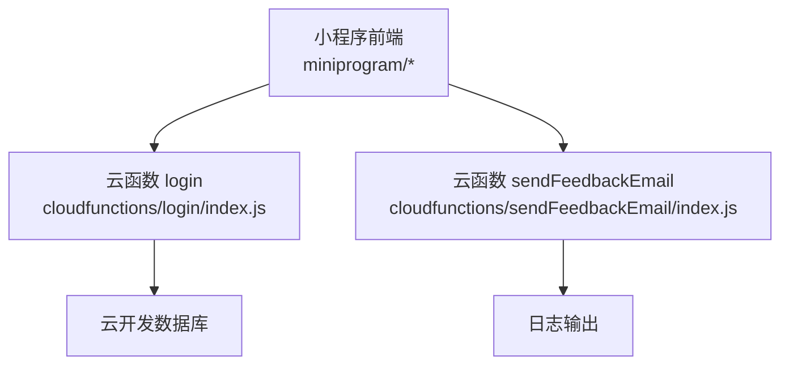
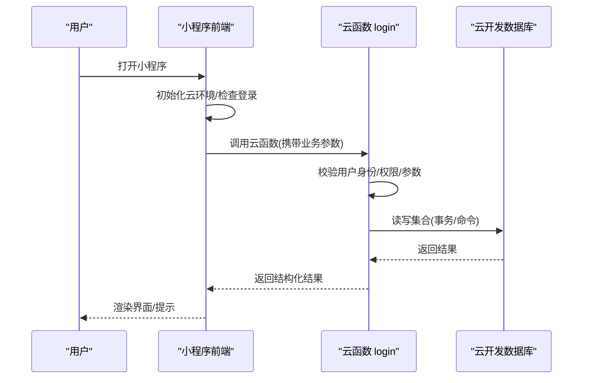
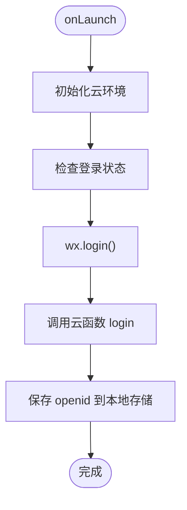
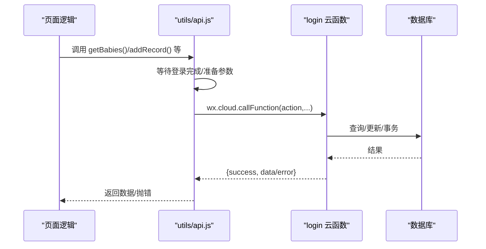
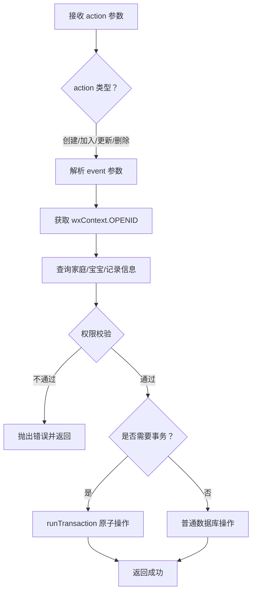
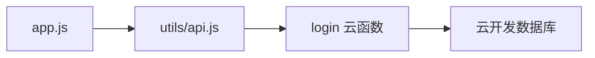

# 安全考虑

<cite>
**本文引用的文件**
- [miniprogram/app.js](file://miniprogram/app.js)
- [miniprogram/utils/api.js](file://miniprogram/utils/api.js)
- [miniprogram/utils/util.js](file://miniprogram/utils/util.js)
- [cloudfunctions/login/index.js](file://cloudfunctions/login/index.js)
- [cloudfunctions/sendFeedbackEmail/index.js](file://cloudfunctions/sendFeedbackEmail/index.js)
- [.agents/skills/cloudbase/references/auth-tool/checklist.md](file://.agents/skills/cloudbase/references/auth-tool/checklist.md)
- [.agents/skills/cloudbase/references/cloud-functions/checklist.md](file://.agents/skills/cloudbase/references/cloud-functions/checklist.md)
- [.agents/skills/cloudbase/references/http-api/checklist.md](file://.agents/skills/cloudbase/references/http-api/checklist.md)
</cite>

## 目录
1. [简介](#简介)
2. [项目结构](#项目结构)
3. [核心组件](#核心组件)
4. [架构总览](#架构总览)
5. [详细组件分析](#详细组件分析)
6. [依赖关系分析](#依赖关系分析)
7. [性能与安全特性](#性能与安全特性)
8. [故障排查指南](#故障排查指南)
9. [结论](#结论)
10. [附录：安全检查清单与最佳实践](#附录安全检查清单与最佳实践)

## 简介
本指南面向“萌芽季”小程序的开发者，系统梳理小程序端与云函数端的安全设计与实现，覆盖用户身份认证、权限控制、数据传输与客户端数据保护、云函数安全防护、API安全设计原则、敏感数据处理规范、常见安全风险与防护措施，以及可落地的安全检查清单与最佳实践建议。文档基于仓库现有实现进行分析，并提出改进建议，帮助构建更安全可靠的应用。

## 项目结构
项目采用“小程序前端 + 云开发云函数”的典型架构：
- 小程序前端负责用户交互、调用云函数、本地缓存与状态管理。
- 云函数负责业务逻辑、权限校验、数据库事务与数据一致性保障。
- 工具与参考文档提供平台侧安全与实施检查要点。

图表来源
- [miniprogram/app.js:1-56](file://miniprogram/app.js#L1-L56)
- [cloudfunctions/login/index.js:1-814](file://cloudfunctions/login/index.js#L1-L814)
- [cloudfunctions/sendFeedbackEmail/index.js:1-21](file://cloudfunctions/sendFeedbackEmail/index.js#L1-L21)

章节来源
- [miniprogram/app.js:1-56](file://miniprogram/app.js#L1-L56)
- [cloudfunctions/login/index.js:1-814](file://cloudfunctions/login/index.js#L1-L814)
- [cloudfunctions/sendFeedbackEmail/index.js:1-21](file://cloudfunctions/sendFeedbackEmail/index.js#L1-L21)

## 核心组件
- 小程序应用生命周期与登录流程：初始化云环境、自动登录、持久化 openid。
- 业务 API 封装：统一调用云函数，集中处理权限与错误。
- 云函数 login：实现家庭/宝宝/记录等核心业务的权限校验与事务处理。
- 云函数 sendFeedbackEmail：示例型云函数，当前未实现外部发送，仅记录日志。

章节来源
- [miniprogram/app.js:1-56](file://miniprogram/app.js#L1-L56)
- [miniprogram/utils/api.js:1-879](file://miniprogram/utils/api.js#L1-L879)
- [cloudfunctions/login/index.js:1-814](file://cloudfunctions/login/index.js#L1-L814)
- [cloudfunctions/sendFeedbackEmail/index.js:1-21](file://cloudfunctions/sendFeedbackEmail/index.js#L1-L21)

## 架构总览
小程序通过 wx.cloud.callFunction 调用云函数；云函数通过 wx-server-sdk 获取用户上下文与数据库句柄，执行业务逻辑与权限校验。数据库层面采用集合与字段级权限策略，云函数内对敏感操作进行严格校验与事务封装。

图表来源
- [miniprogram/app.js:28-54](file://miniprogram/app.js#L28-L54)
- [miniprogram/utils/api.js:43-75](file://miniprogram/utils/api.js#L43-L75)
- [cloudfunctions/login/index.js:22-800](file://cloudfunctions/login/index.js#L22-L800)

## 详细组件分析

### 组件A：小程序登录与全局状态
- 自动登录：启动时直接发起 wx.login 并调用云函数 login，成功后将 openid 写入本地存储。
- 登录态等待：waitForLogin 提供最大等待时间与轮询机制，避免 UI 卡顿。
- 全局用户信息：globalData 与本地存储结合，保证跨页面可用。

图表来源
- [miniprogram/app.js:8-26](file://miniprogram/app.js#L8-L26)
- [miniprogram/app.js:29-54](file://miniprogram/app.js#L29-L54)

章节来源
- [miniprogram/app.js:1-56](file://miniprogram/app.js#L1-L56)

### 组件B：业务 API 封装与权限前置
- 统一入口：所有业务请求通过 wx.cloud.callFunction 调用云函数 login，绕过直接数据库访问。
- 权限前置：在云函数内进行用户身份、家庭成员、权限等级校验，避免前端越权。
- 错误收敛：统一捕获与返回，便于前端展示与重试。

图表来源
- [miniprogram/utils/api.js:43-75](file://miniprogram/utils/api.js#L43-L75)
- [miniprogram/utils/api.js:299-346](file://miniprogram/utils/api.js#L299-L346)
- [cloudfunctions/login/index.js:22-800](file://cloudfunctions/login/index.js#L22-L800)

章节来源
- [miniprogram/utils/api.js:1-879](file://miniprogram/utils/api.js#L1-L879)
- [cloudfunctions/login/index.js:1-814](file://cloudfunctions/login/index.js#L1-L814)

### 组件C：云函数 login 的权限与事务控制
- 身份校验：通过 wxContext.OPENID 获取用户标识，所有操作以此为准。
- 权限模型：
  - 家庭成员角色：viewer（观察者）、caretaker（二级助教）、guardian（一级助教）。
  - 关键操作仅允许 guardian 执行，如修改家庭名、修改成员权限、删除宝宝等。
- 事务保障：删除宝宝使用事务，确保“删除宝宝 + 删除关联记录”原子性。
- 输入校验：对家庭名、宝宝名长度、邀请码有效性等进行严格校验。
- 家庭边界：所有读取均需验证用户是否为家庭成员，防止越权。

图表来源
- [cloudfunctions/login/index.js:22-800](file://cloudfunctions/login/index.js#L22-L800)

章节来源
- [cloudfunctions/login/index.js:1-814](file://cloudfunctions/login/index.js#L1-L814)

### 组件D：云函数 sendFeedbackEmail 的安全现状
- 当前实现：仅记录日志并返回成功，未实现邮件发送。
- 安全建议：若后续接入外部服务，应增加参数校验、速率限制、审计日志与异常告警。

章节来源
- [cloudfunctions/sendFeedbackEmail/index.js:1-21](file://cloudfunctions/sendFeedbackEmail/index.js#L1-L21)

## 依赖关系分析
- 小程序端依赖 wx.cloud 与本地存储；通过云函数 login 间接访问数据库。
- 云函数 login 依赖 wx-server-sdk 与数据库命令（如 $in/$gt/$neq）。
- 权限控制与事务处理集中在云函数，降低前端越权风险。

图表来源
- [miniprogram/utils/api.js:1-879](file://miniprogram/utils/api.js#L1-L879)
- [miniprogram/app.js:1-56](file://miniprogram/app.js#L1-L56)
- [cloudfunctions/login/index.js:1-814](file://cloudfunctions/login/index.js#L1-L814)

章节来源
- [miniprogram/utils/api.js:1-879](file://miniprogram/utils/api.js#L1-L879)
- [miniprogram/app.js:1-56](file://miniprogram/app.js#L1-L56)
- [cloudfunctions/login/index.js:1-814](file://cloudfunctions/login/index.js#L1-L814)

## 性能与安全特性
- 性能
  - 云函数内使用事务减少多次往返，提升一致性与吞吐。
  - 通过集合查询与排序减少前端重复计算。
- 安全
  - 所有敏感操作均在云函数内校验权限，避免前端伪造。
  - 对关键字符串长度进行限制，降低异常输入风险。
  - 使用数据库命令（如 $in/$gt/$neq）进行安全查询，避免拼接式查询。

章节来源
- [cloudfunctions/login/index.js:484-507](file://cloudfunctions/login/index.js#L484-L507)
- [cloudfunctions/login/index.js:272-281](file://cloudfunctions/login/index.js#L272-L281)
- [cloudfunctions/login/index.js:100-102](file://cloudfunctions/login/index.js#L100-L102)

## 故障排查指南
- 登录失败
  - 检查 wx.login 是否成功获取 code，确认云函数 login 是否返回 userInfo。
  - 若本地存储缺失 openid，确认 setStorageSync 是否执行。
- 权限错误
  - 确认家庭成员角色是否正确，仅 guardian 可执行高权限操作。
  - 检查家庭成员列表是否包含当前用户 openid。
- 数据越权
  - 确保所有读取均通过云函数 login，不直接访问数据库。
  - 核对 getFamilyById/getBabyById/getRecordsByBabyId 等方法是否传入正确 id。
- 事务失败
  - 删除宝宝时检查关联记录是否被清理，确认 runTransaction 是否抛错。

章节来源
- [miniprogram/app.js:34-48](file://miniprogram/app.js#L34-L48)
- [miniprogram/utils/api.js:43-75](file://miniprogram/utils/api.js#L43-L75)
- [cloudfunctions/login/index.js:512-554](file://cloudfunctions/login/index.js#L512-L554)

## 结论
本项目在安全方面已具备良好基础：通过云函数集中权限校验与事务处理，有效降低了前端越权与数据不一致的风险。建议在后续迭代中进一步完善云函数的输入校验、速率限制、审计日志与异常监控，同时在小程序端增强错误提示与重试策略，持续提升整体安全性与用户体验。

## 附录：安全检查清单与最佳实践

### 云函数安全检查清单
- 输入校验
  - 对所有外部输入进行长度、类型、范围校验；对必填字段进行存在性检查。
  - 示例：家庭名、宝宝名长度限制，邀请码有效期与唯一性校验。
- 权限验证
  - 严格区分 viewer/caretaker/guardian 角色，关键操作仅允许 guardian。
  - 每次操作前验证用户是否为家庭成员，避免越权。
- 事务与一致性
  - 对涉及多表/多文档的删除与更新使用事务，确保原子性。
- 错误处理
  - 明确错误分类与返回格式，避免泄露内部细节。
  - 记录关键错误日志，便于追踪与审计。
- 日志与监控
  - 记录敏感操作（创建/删除/修改）与异常事件。
  - 设置告警阈值，及时发现异常行为。

章节来源
- [cloudfunctions/login/index.js:94-151](file://cloudfunctions/login/index.js#L94-L151)
- [cloudfunctions/login/index.js:484-507](file://cloudfunctions/login/index.js#L484-L507)
- [cloudfunctions/login/index.js:268-371](file://cloudfunctions/login/index.js#L268-L371)

### API 安全设计原则
- 参数校验
  - 必填参数、类型与范围校验，拒绝空值与异常值。
- 访问控制
  - 所有业务接口通过云函数执行，禁止前端直连数据库。
- 频率限制
  - 对高频接口设置限流策略，防刷与滥用。
- 日志记录
  - 记录请求摘要、用户标识与操作结果，保留审计证据。

章节来源
- [.agents/skills/cloudbase/references/http-api/checklist.md:1-24](file://.agents/skills/cloudbase/references/http-api/checklist.md#L1-L24)
- [.agents/skills/cloudbase/references/cloud-functions/checklist.md:1-27](file://.agents/skills/cloudbase/references/cloud-functions/checklist.md#L1-L27)

### 敏感数据处理规范
- 用户隐私保护
  - 仅存储必要的 openid 与最小化用户信息；避免采集非必要字段。
- 数据脱敏
  - 在日志与错误信息中避免输出完整敏感字段。
- 存储安全
  - 使用云开发提供的集合权限与规则，限制匿名访问。
- 传输安全
  - 使用 HTTPS 通道，避免明文传输。

章节来源
- [.agents/skills/cloudbase/references/auth-tool/checklist.md:1-33](file://.agents/skills/cloudbase/references/auth-tool/checklist.md#L1-L33)

### 常见安全漏洞与防护措施
- XSS 攻击
  - 前端渲染时避免 innerHTML 直接拼接用户输入；对显示内容进行转义。
- CSRF 防护
  - 云函数侧以 wxContext.OPENID 作为可信身份，避免依赖 Cookie。
- 会话劫持
  - 仅依赖小程序端的登录态与云函数身份上下文，不暴露会话令牌给前端。
- SQL 注入
  - 本项目使用云开发数据库命令，避免原生 SQL；如需自定义查询，请使用参数化与白名单校验。

章节来源
- [cloudfunctions/login/index.js:22-26](file://cloudfunctions/login/index.js#L22-L26)