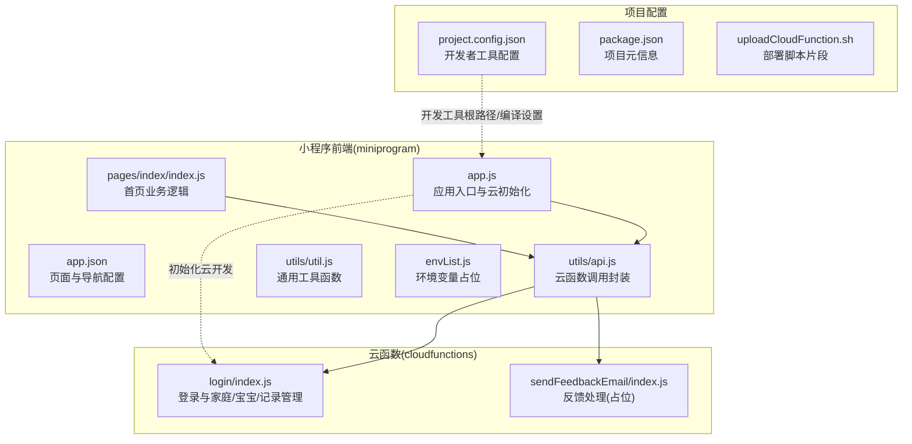
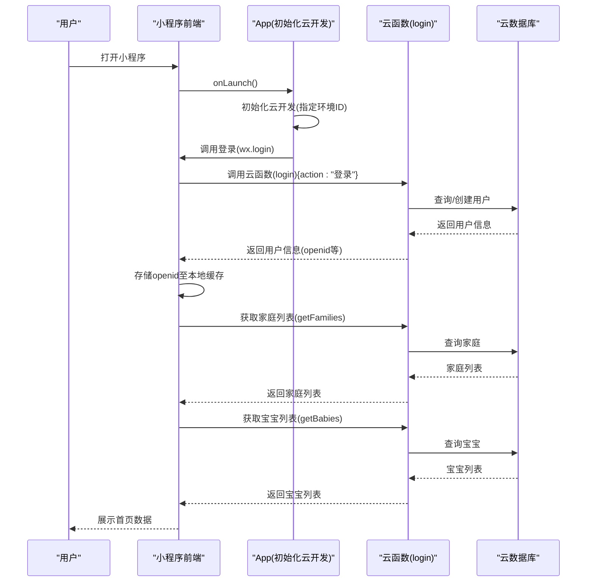
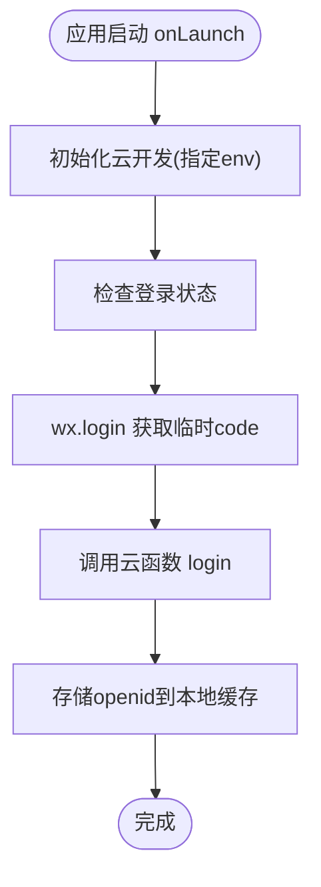
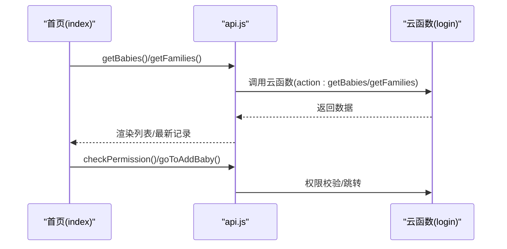
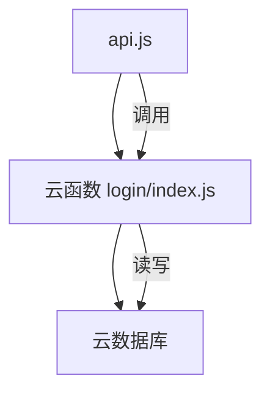
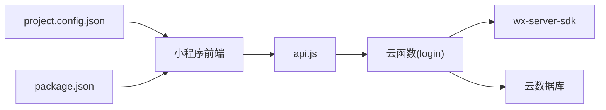

# 快速开始

<cite>
**本文引用的文件**
- [envList.js](file://miniprogram/envList.js)
- [project.config.json](file://project.config.json)
- [package.json](file://package.json)
- [app.js](file://miniprogram/app.js)
- [app.json](file://miniprogram/app.json)
- [index.js](file://cloudfunctions/login/index.js)
- [index.js](file://cloudfunctions/sendFeedbackEmail/index.js)
- [api.js](file://miniprogram/utils/api.js)
- [util.js](file://miniprogram/utils/util.js)
- [index.js](file://miniprogram/pages/index/index.js)
</cite>

## 目录
1. [简介](#简介)
2. [项目结构](#项目结构)
3. [核心组件](#核心组件)
4. [架构总览](#架构总览)
5. [详细组件分析](#详细组件分析)
6. [依赖关系分析](#依赖关系分析)
7. [性能考虑](#性能考虑)
8. [故障排查指南](#故障排查指南)
9. [结论](#结论)
10. [附录](#附录)

## 简介
本指南面向首次接触“萌芽季”小程序的新开发者，目标是在最短时间内完成开发环境准备、项目初始化与本地调试运行。文档覆盖以下关键点：
- 开发工具与环境准备：微信开发者工具、Node.js 环境要求
- 项目克隆与依赖安装
- 关键配置文件说明与修改要点：envList.js、project.config.json
- 云开发初始化与本地调试流程
- 常见初始化问题与解决方案
- 首次运行预期效果与验证方法

生长曲线所依据的 **WS/T 423—2022** 数据与图表实现说明，见 `wiki/核心功能模块/数据可视化模块.md` 与仓库根目录 `README.md`（当前版本 **v3.1.0**）。

## 项目结构
该项目采用“小程序前端 + 云函数”的典型分层结构：
- 小程序前端位于 miniprogram 目录，包含页面、组件、工具函数与全局配置
- 云函数位于 cloudfunctions 目录，提供后端逻辑与数据库访问
- 根目录包含项目级配置与脚本

图表来源
- [app.js:1-56](file://miniprogram/app.js#L1-L56)
- [app.json:1-39](file://miniprogram/app.json#L1-L39)
- [index.js:1-144](file://miniprogram/pages/index/index.js#L1-L144)
- [api.js:1-873](file://miniprogram/utils/api.js#L1-L873)
- [util.js:1-55](file://miniprogram/utils/util.js#L1-L55)
- [index.js:1-786](file://cloudfunctions/login/index.js#L1-L786)
- [index.js:1-21](file://cloudfunctions/sendFeedbackEmail/index.js#L1-L21)
- [project.config.json:1-85](file://project.config.json#L1-L85)
- [package.json:1-22](file://package.json#L1-L22)
- [uploadCloudFunction.sh:1-1](file://uploadCloudFunction.sh#L1-L1)

章节来源
- [project.config.json:1-85](file://project.config.json#L1-L85)
- [package.json:1-22](file://package.json#L1-L22)

## 核心组件
- 应用入口与云初始化：在应用启动时初始化云开发，拉起登录流程并调用云函数获取用户信息
- 页面与业务逻辑：首页负责加载宝宝列表、家庭信息、计算年龄与最新记录
- 云函数封装：统一通过云函数访问数据库，规避前端直连权限限制
- 工具函数：提供日期计算、年龄格式化等通用能力

章节来源
- [app.js:1-56](file://miniprogram/app.js#L1-L56)
- [index.js:1-144](file://miniprogram/pages/index/index.js#L1-L144)
- [api.js:1-873](file://miniprogram/utils/api.js#L1-L873)
- [util.js:1-55](file://miniprogram/utils/util.js#L1-L55)

## 架构总览
小程序前端通过云函数访问云数据库，实现用户登录、家庭管理、宝宝与记录管理等核心功能。

图表来源
- [app.js:1-56](file://miniprogram/app.js#L1-L56)
- [index.js:1-786](file://cloudfunctions/login/index.js#L1-L786)
- [api.js:1-873](file://miniprogram/utils/api.js#L1-L873)

## 详细组件分析

### 组件A：应用入口与云初始化
- 职责：初始化云开发、检查登录状态、调用云函数完成登录
- 关键点：通过全局对象设置云环境ID；调用云函数 login 完成用户信息获取与持久化

图表来源
- [app.js:1-56](file://miniprogram/app.js#L1-L56)

章节来源
- [app.js:1-56](file://miniprogram/app.js#L1-L56)

### 组件B：首页业务逻辑
- 职责：加载宝宝列表、家庭信息、计算年龄与最新记录；提供添加/删除宝宝入口与跳转
- 关键点：调用 api.js 中的 getBabies/getFamilies 等方法；权限校验由云函数完成

图表来源
- [index.js:1-144](file://miniprogram/pages/index/index.js#L1-L144)
- [api.js:1-873](file://miniprogram/utils/api.js#L1-L873)

章节来源
- [index.js:1-144](file://miniprogram/pages/index/index.js#L1-L144)
- [api.js:1-873](file://miniprogram/utils/api.js#L1-L873)

### 组件C：云函数封装与权限控制
- 职责：统一封装对云数据库的访问；通过云函数执行需要权限控制的操作
- 关键点：使用 wx-server-sdk 初始化；通过云函数 login 实现家庭/宝宝/记录的增删改查与权限校验

图表来源
- [api.js:1-873](file://miniprogram/utils/api.js#L1-L873)
- [index.js:1-786](file://cloudfunctions/login/index.js#L1-L786)

章节来源
- [api.js:1-873](file://miniprogram/utils/api.js#L1-L873)
- [index.js:1-786](file://cloudfunctions/login/index.js#L1-L786)

### 组件D：工具函数与通用逻辑
- 职责：提供日期计算、年龄格式化等通用能力，供页面与 API 使用
- 关键点：独立模块化，便于复用

章节来源
- [util.js:1-55](file://miniprogram/utils/util.js#L1-L55)

## 依赖关系分析
- 小程序前端依赖云函数进行数据库访问，避免前端直连权限限制
- 云函数依赖 wx-server-sdk 进行数据库操作
- 项目配置文件决定开发者工具的根目录、编译选项与模板行为

图表来源
- [api.js:1-873](file://miniprogram/utils/api.js#L1-L873)
- [index.js:1-786](file://cloudfunctions/login/index.js#L1-L786)
- [project.config.json:1-85](file://project.config.json#L1-L85)
- [package.json:1-22](file://package.json#L1-L22)

章节来源
- [project.config.json:1-85](file://project.config.json#L1-L85)
- [package.json:1-22](file://package.json#L1-L22)

## 性能考虑
- 首屏加载优化：首页在 onShow 时才加载数据，减少不必要的请求
- 数据聚合：在云函数中进行多表关联与排序，降低前端复杂度
- 缓存策略：本地缓存 openid，避免重复登录流程
- 请求合并：批量获取家庭与宝宝列表，减少网络往返

## 故障排查指南
- 云开发环境配置错误
  - 症状：初始化云开发报错或无法连接数据库
  - 排查：确认 app.js 中的环境 ID 是否正确；确认 project.config.json 的 miniprogramRoot/cloudfunctionRoot 是否指向正确目录
  - 参考
    - [app.js:1-56](file://miniprogram/app.js#L1-L56)
    - [project.config.json:1-85](file://project.config.json#L1-L85)
- 依赖包安装失败
  - 症状：npm install 报错或云函数依赖缺失
  - 排查：确保 Node.js 版本满足要求；在 cloudfunctions/login 与 cloudfunctions/sendFeedbackEmail 目录下分别执行依赖安装；检查 package.json 中的依赖声明
  - 参考
    - [package.json:1-22](file://package.json#L1-L22)
    - [index.js:1-16](file://cloudfunctions/login/package.json#L1-L16)
    - [index.js:1-16](file://cloudfunctions/sendFeedbackEmail/package.json#L1-L16)
- 云函数部署问题
  - 症状：本地调试正常但线上报错
  - 排查：使用 uploadCloudFunction.sh 提供的命令进行部署；确认脚本中的环境 ID 与项目路径正确
  - 参考
    - [uploadCloudFunction.sh:1-1](file://uploadCloudFunction.sh#L1-L1)
- 登录与权限异常
  - 症状：无法获取用户信息或权限不足
  - 排查：确认 app.js 的登录流程是否成功；检查云函数 login 的权限校验逻辑；确认用户已在数据库中存在
  - 参考
    - [app.js:1-56](file://miniprogram/app.js#L1-L56)
    - [index.js:1-786](file://cloudfunctions/login/index.js#L1-L786)
    - [api.js:1-873](file://miniprogram/utils/api.js#L1-L873)

章节来源
- [app.js:1-56](file://miniprogram/app.js#L1-L56)
- [index.js:1-786](file://cloudfunctions/login/index.js#L1-L786)
- [api.js:1-873](file://miniprogram/utils/api.js#L1-L873)
- [uploadCloudFunction.sh:1-1](file://uploadCloudFunction.sh#L1-L1)

## 结论
按照本指南完成环境准备、配置修改与依赖安装后，即可在微信开发者工具中成功运行“萌芽季”小程序。建议优先验证登录流程与首页数据加载，再逐步探索家庭/宝宝/记录管理功能。

## 附录

### 快速开始清单
- 安装微信开发者工具并打开项目
- 在根目录与云函数目录分别安装依赖
- 修改 app.js 中的云环境 ID 与 project.config.json 的根目录
- 上传云函数并启动本地调试
- 首次运行预期效果：自动登录、展示家庭与宝宝列表、可跳转到添加页

### 配置文件说明与修改方法
- envList.js
  - 作用：预留环境变量与平台标识，当前为空数组与布尔值占位
  - 修改建议：根据团队规范在此处定义环境常量，供构建脚本或条件编译使用
  - 参考
    - [envList.js:1-7](file://miniprogram/envList.js#L1-L7)
- project.config.json
  - 作用：开发者工具的项目配置，包括小程序根目录、云函数根目录、编译设置、appid 等
  - 修改建议：确保 miniprogramRoot/cloudfunctionRoot 指向 miniprogram 与 cloudfunctions；根据团队规范调整编译选项
  - 参考
    - [project.config.json:1-85](file://project.config.json#L1-L85)

### 云函数与数据库约定
- 云函数 login：集中处理用户登录、家庭/宝宝/记录的增删改查与权限校验
- 云函数 sendFeedbackEmail：反馈处理占位，当前返回成功提示
- 数据库：通过 wx-server-sdk 访问，权限控制由云函数实现

章节来源
- [index.js:1-786](file://cloudfunctions/login/index.js#L1-L786)
- [index.js:1-21](file://cloudfunctions/sendFeedbackEmail/index.js#L1-L21)