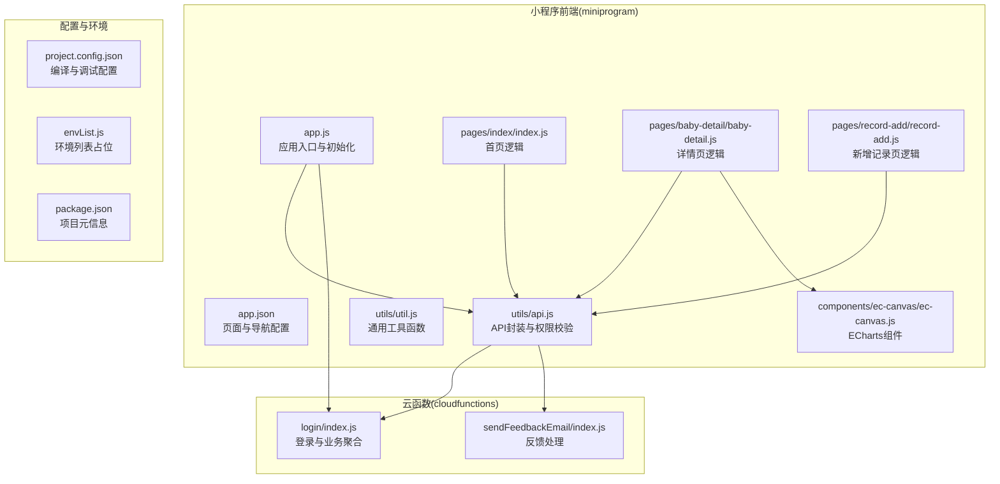
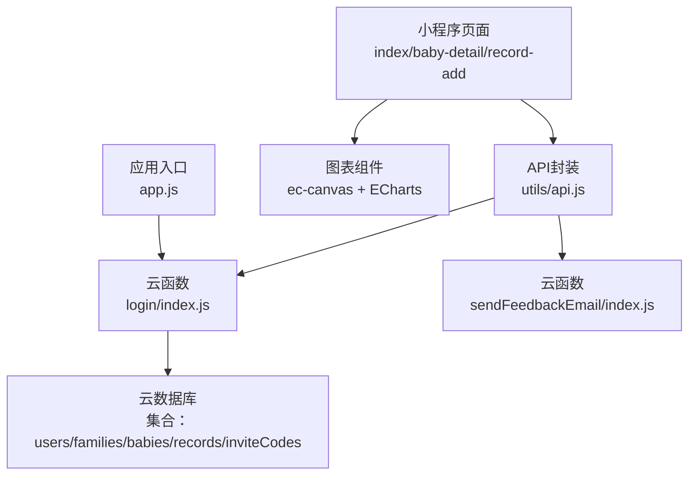
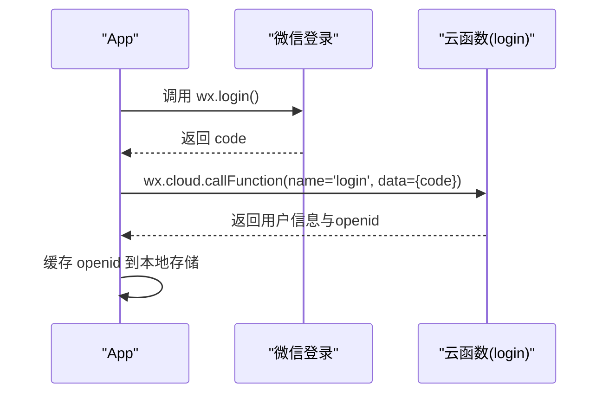
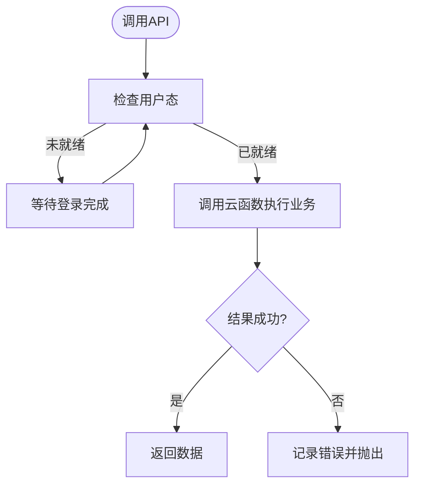
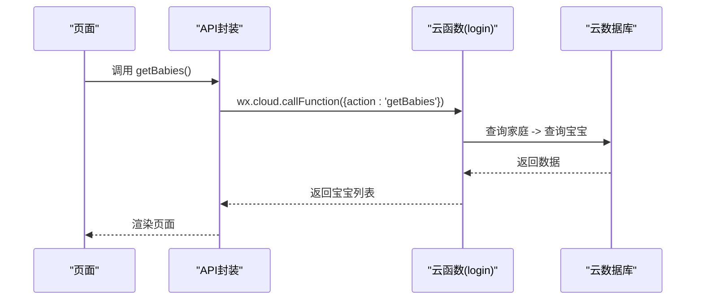
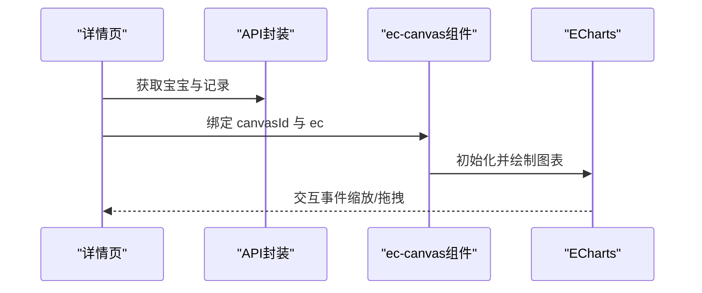
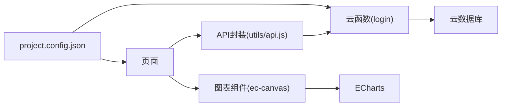
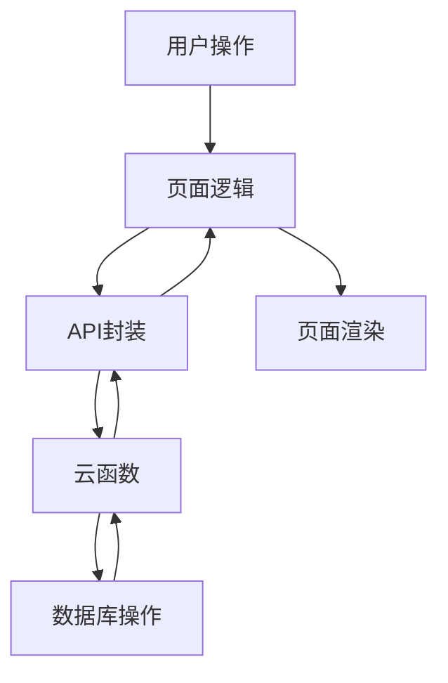

# 技术架构

<cite>
**本文引用的文件**
- [miniprogram/app.js](file://miniprogram/app.js)
- [miniprogram/app.json](file://miniprogram/app.json)
- [cloudfunctions/login/index.js](file://cloudfunctions/login/index.js)
- [cloudfunctions/sendFeedbackEmail/index.js](file://cloudfunctions/sendFeedbackEmail/index.js)
- [miniprogram/utils/api.js](file://miniprogram/utils/api.js)
- [miniprogram/pages/index/index.js](file://miniprogram/pages/index/index.js)
- [miniprogram/pages/baby-detail/baby-detail.js](file://miniprogram/pages/baby-detail/baby-detail.js)
- [miniprogram/pages/record-add/record-add.js](file://miniprogram/pages/record-add/record-add.js)
- [miniprogram/components/ec-canvas/ec-canvas.js](file://miniprogram/components/ec-canvas/ec-canvas.js)
- [miniprogram/utils/util.js](file://miniprogram/utils/util.js)
- [project.config.json](file://project.config.json)
- [miniprogram/envList.js](file://miniprogram/envList.js)
- [package.json](file://package.json)
</cite>

## 目录
1. [简介](#简介)
2. [项目结构](#项目结构)
3. [核心组件](#核心组件)
4. [架构总览](#架构总览)
5. [详细组件分析](#详细组件分析)
6. [依赖关系分析](#依赖关系分析)
7. [性能考量](#性能考量)
8. [故障排查指南](#故障排查指南)
9. [结论](#结论)
10. [附录](#附录)

## 简介
本项目为“萌芽季”微信小程序，采用前后端分离架构，前端基于微信小程序原生框架与组件化开发，后端采用腾讯云开发（CloudBase）提供的云函数与云数据库。系统围绕“家庭-宝宝-记录”的数据模型，提供宝宝成长记录、图表可视化、家庭管理与权限控制等功能。本文档从架构设计、数据流、技术选型、可扩展性、性能优化与安全等方面进行全面阐述，并给出架构图与组件关系图，帮助开发者理解系统设计并指导后续扩展与维护。

## 项目结构
项目采用典型的微信小程序目录组织方式：
- miniprogram：小程序前端源码，包含页面、组件、工具类与资源。
- cloudfunctions：云函数目录，包含业务逻辑封装与数据库操作。
- 顶层配置文件：项目配置、环境变量与包管理配置。

**图表来源**
- [miniprogram/app.js:1-56](file://miniprogram/app.js#L1-L56)
- [miniprogram/app.json:1-39](file://miniprogram/app.json#L1-L39)
- [cloudfunctions/login/index.js:1-786](file://cloudfunctions/login/index.js#L1-L786)
- [cloudfunctions/sendFeedbackEmail/index.js:1-21](file://cloudfunctions/sendFeedbackEmail/index.js#L1-L21)
- [miniprogram/utils/api.js:1-873](file://miniprogram/utils/api.js#L1-L873)
- [miniprogram/pages/index/index.js:1-144](file://miniprogram/pages/index/index.js#L1-L144)
- [miniprogram/pages/baby-detail/baby-detail.js:1-691](file://miniprogram/pages/baby-detail/baby-detail.js#L1-L691)
- [miniprogram/pages/record-add/record-add.js:1-118](file://miniprogram/pages/record-add/record-add.js#L1-L118)
- [miniprogram/components/ec-canvas/ec-canvas.js:1-285](file://miniprogram/components/ec-canvas/ec-canvas.js#L1-L285)
- [project.config.json:1-85](file://project.config.json#L1-L85)
- [miniprogram/envList.js:1-7](file://miniprogram/envList.js#L1-L7)
- [package.json:1-22](file://package.json#L1-L22)

**章节来源**
- [miniprogram/app.js:1-56](file://miniprogram/app.js#L1-L56)
- [miniprogram/app.json:1-39](file://miniprogram/app.json#L1-L39)
- [project.config.json:1-85](file://project.config.json#L1-L85)

## 核心组件
- 应用入口与初始化：负责小程序启动、云开发初始化、自动登录与全局用户态维护。
- API封装层：统一调用云函数与云数据库，集中处理权限校验、错误处理与登录等待。
- 页面逻辑层：按功能拆分页面，负责UI交互、数据展示与调用API封装层。
- 云函数层：集中实现业务逻辑、数据库读写、事务与权限校验。
- 图表组件：基于ECharts的跨版本适配组件，支持新旧Canvas能力。

**章节来源**
- [miniprogram/app.js:1-56](file://miniprogram/app.js#L1-L56)
- [miniprogram/utils/api.js:1-873](file://miniprogram/utils/api.js#L1-L873)
- [cloudfunctions/login/index.js:1-786](file://cloudfunctions/login/index.js#L1-L786)
- [miniprogram/components/ec-canvas/ec-canvas.js:1-285](file://miniprogram/components/ec-canvas/ec-canvas.js#L1-L285)

## 架构总览
系统采用“前端页面 + API封装 + 云函数 + 数据库”的分层架构，遵循以下原则：
- 前后端分离：页面与云函数通过云函数调用解耦。
- 权限前置：API封装层统一校验用户权限，避免直接访问数据库。
- 云函数聚合：登录与业务逻辑集中在云函数，保证事务一致性与权限控制。
- 组件化开发：页面与组件职责清晰，便于复用与维护。
- 可视化增强：通过ECharts组件提供图表能力，支持缩放与交互。

**图表来源**
- [miniprogram/utils/api.js:1-873](file://miniprogram/utils/api.js#L1-L873)
- [cloudfunctions/login/index.js:1-786](file://cloudfunctions/login/index.js#L1-L786)
- [cloudfunctions/sendFeedbackEmail/index.js:1-21](file://cloudfunctions/sendFeedbackEmail/index.js#L1-L21)
- [miniprogram/components/ec-canvas/ec-canvas.js:1-285](file://miniprogram/components/ec-canvas/ec-canvas.js#L1-L285)
- [miniprogram/app.js:1-56](file://miniprogram/app.js#L1-L56)

## 详细组件分析

### 应用入口与初始化（app.js）
- 初始化云开发，设置环境ID。
- 自动登录流程：调用微信登录获取code，再调用云函数换取用户信息并缓存。
- 提供全局用户态，供页面与API封装层使用。

**图表来源**
- [miniprogram/app.js:28-54](file://miniprogram/app.js#L28-L54)
- [cloudfunctions/login/index.js:735-772](file://cloudfunctions/login/index.js#L735-L772)

**章节来源**
- [miniprogram/app.js:1-56](file://miniprogram/app.js#L1-L56)

### API封装层（utils/api.js）
- 登录等待与用户态：提供等待登录完成的Promise机制，避免并发问题。
- 家庭与宝宝：通过云函数获取家庭列表、宝宝列表与详情，绕过数据库权限限制。
- 记录管理：新增、删除记录，计算月龄，获取最新记录。
- 权限校验：根据用户在家庭中的角色（viewer/caretaker/guardian）判断操作权限。
- 邀请码与家庭管理：创建邀请码、加入/退出家庭、更新成员信息与权限。

**图表来源**
- [miniprogram/utils/api.js:13-41](file://miniprogram/utils/api.js#L13-L41)
- [miniprogram/utils/api.js:43-75](file://miniprogram/utils/api.js#L43-L75)

**章节来源**
- [miniprogram/utils/api.js:1-873](file://miniprogram/utils/api.js#L1-L873)

### 云函数（login/index.js）
- 聚合业务：登录、家庭管理、宝宝管理、记录管理、权限校验、邀请码等。
- 事务与一致性：删除宝宝使用事务，确保宝宝与其记录一致删除。
- 权限控制：严格校验用户在家庭中的权限，防止越权操作。
- 数据校验：对输入参数进行长度、格式与范围校验。

**图表来源**
- [miniprogram/utils/api.js:43-75](file://miniprogram/utils/api.js#L43-L75)
- [cloudfunctions/login/index.js:40-82](file://cloudfunctions/login/index.js#L40-L82)

**章节来源**
- [cloudfunctions/login/index.js:1-786](file://cloudfunctions/login/index.js#L1-L786)

### 页面逻辑（pages/index/index.js）
- 展示宝宝列表，计算年龄与最新记录。
- 权限校验：添加/删除宝宝需要一级助教权限。
- 导航至新增宝宝与详情页。

**章节来源**
- [miniprogram/pages/index/index.js:1-144](file://miniprogram/pages/index/index.js#L1-L144)

### 详情页与图表（pages/baby-detail/baby-detail.js）
- 展示宝宝详情与记录列表。
- 图表选项构建：身高/体重标准曲线与实际数据对比。
- ECharts初始化：根据Canvas能力选择新旧渲染路径，支持缩放与滑块。
- 权限校验：修改姓名/头像、添加/删除记录的权限控制。

**图表来源**
- [miniprogram/pages/baby-detail/baby-detail.js:323-397](file://miniprogram/pages/baby-detail/baby-detail.js#L323-L397)
- [miniprogram/components/ec-canvas/ec-canvas.js:80-192](file://miniprogram/components/ec-canvas/ec-canvas.js#L80-L192)

**章节来源**
- [miniprogram/pages/baby-detail/baby-detail.js:1-691](file://miniprogram/pages/baby-detail/baby-detail.js#L1-L691)
- [miniprogram/components/ec-canvas/ec-canvas.js:1-285](file://miniprogram/components/ec-canvas/ec-canvas.js#L1-L285)

### 新增记录页（pages/record-add/record-add.js）
- 表单校验：身高/体重正数、日期合法性、月龄计算。
- 权限校验：仅一级/二级助教可添加记录。
- 调用API封装层提交记录并返回上一页。

**章节来源**
- [miniprogram/pages/record-add/record-add.js:1-118](file://miniprogram/pages/record-add/record-add.js#L1-L118)

### 工具函数（utils/util.js）
- 时间格式化、年龄计算、月龄近似计算与年龄字符串格式化。

**章节来源**
- [miniprogram/utils/util.js:1-55](file://miniprogram/utils/util.js#L1-L55)

### 图表组件（components/ec-canvas/ec-canvas.js）
- Canvas能力检测：根据基础库版本选择新旧Canvas路径。
- ECharts集成：注册预处理器、事件桥接、图片加载适配。
- 导出图片：支持将图表导出为临时文件路径。

**章节来源**
- [miniprogram/components/ec-canvas/ec-canvas.js:1-285](file://miniprogram/components/ec-canvas/ec-canvas.js#L1-L285)

## 依赖关系分析
- 页面依赖API封装层，API封装层依赖云函数与云数据库。
- 云函数依赖数据库SDK与命令（如_.in、_.gt等）。
- 图表组件依赖ECharts与Canvas上下文。
- 项目配置影响编译与调试行为，云函数根目录由配置指定。

**图表来源**
- [miniprogram/utils/api.js:1-873](file://miniprogram/utils/api.js#L1-L873)
- [cloudfunctions/login/index.js:1-786](file://cloudfunctions/login/index.js#L1-L786)
- [miniprogram/components/ec-canvas/ec-canvas.js:1-285](file://miniprogram/components/ec-canvas/ec-canvas.js#L1-L285)
- [project.config.json:1-85](file://project.config.json#L1-L85)

**章节来源**
- [project.config.json:1-85](file://project.config.json#L1-L85)

## 性能考量
- 登录等待机制：避免频繁请求导致的并发问题，提升用户体验。
- 云函数聚合：减少页面直连数据库的次数，降低网络开销。
- 图表懒加载：详情页图表按需初始化，减少首屏压力。
- Canvas能力适配：根据基础库版本选择最优渲染路径，兼顾性能与兼容性。
- 数据查询优化：使用云函数进行权限过滤与聚合查询，避免客户端复杂筛选。

[本节为通用性能建议，无需特定文件引用]

## 故障排查指南
- 登录失败：检查云函数返回的错误信息，确认code有效性与数据库连接。
- 权限不足：检查API封装层的权限校验逻辑，确认用户在家庭中的角色。
- 图表异常：检查Canvas版本与组件初始化流程，确认设备基础库版本满足要求。
- 数据不一致：关注云函数事务（删除宝宝），确保事务内操作原子性。

**章节来源**
- [miniprogram/utils/api.js:776-846](file://miniprogram/utils/api.js#L776-L846)
- [cloudfunctions/login/index.js:464-490](file://cloudfunctions/login/index.js#L464-L490)
- [miniprogram/components/ec-canvas/ec-canvas.js:80-108](file://miniprogram/components/ec-canvas/ec-canvas.js#L80-L108)

## 结论
本项目通过“页面-封装-云函数-数据库”的分层架构，结合权限前置与云函数聚合，实现了稳定、可维护且具备良好扩展性的宝宝成长记录系统。前端采用组件化与图表增强，后端依托云开发提供高可用的Serverless能力。未来可在权限模型细化、数据埋点与监控、云函数异步任务与缓存策略等方面持续演进。

[本节为总结性内容，无需特定文件引用]

## 附录

### 数据流全链路示意

[本图为概念性示意，无需图表来源]

### 技术选型与权衡
- 微信小程序原生框架：生态完善、调试便捷、与云开发无缝集成。
- 腾讯云开发：Serverless免运维、云函数与云数据库一体化、权限与安全内置。
- ECharts：图表能力成熟、支持多平台、组件化封装适配不同Canvas能力。

[本节为通用说明，无需特定文件引用]

### 架构演进与未来规划
- 当前阶段：功能完备、权限与事务控制到位、图表可视化增强。
- 近期规划：引入数据埋点与日志上报、优化图表渲染性能、完善邀请码与家庭管理体验。
- 中长期规划：引入云函数定时任务（如清理过期邀请码）、缓存策略与CDN加速、多端扩展（H5/公众号）。

[本节为未来规划说明，无需特定文件引用]