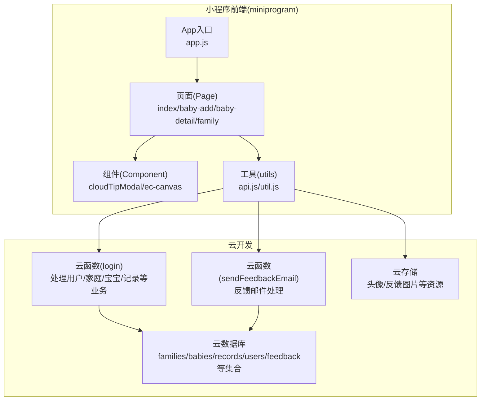
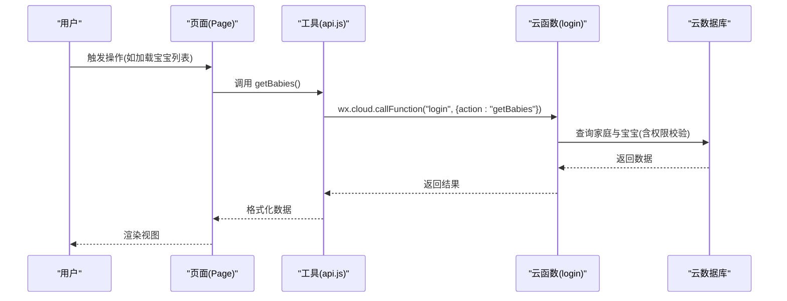
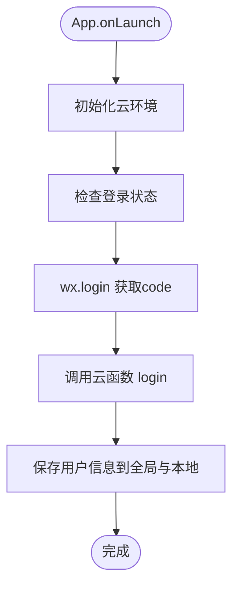
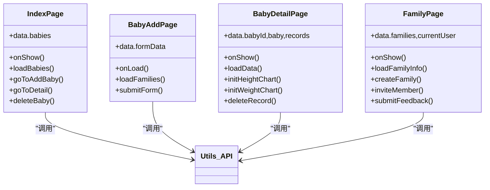
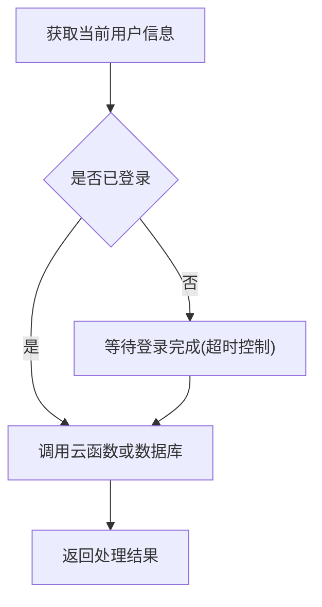
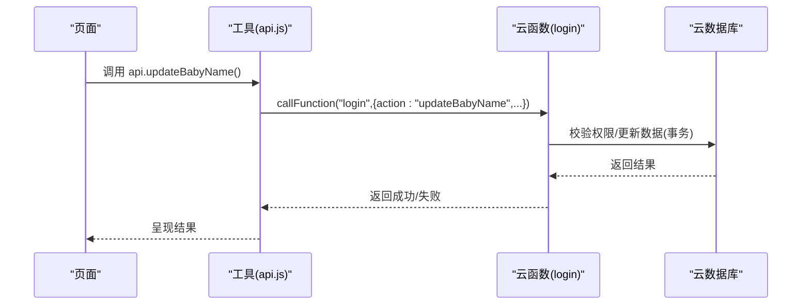
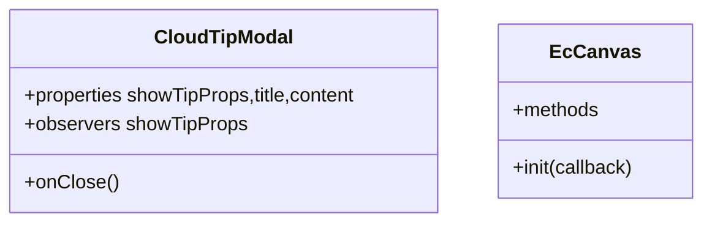
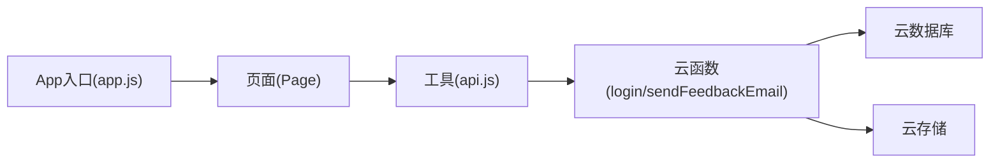

# 整体架构设计

<cite>
**本文档引用的文件**
- [miniprogram/app.js](file://miniprogram/app.js)
- [miniprogram/app.json](file://miniprogram/app.json)
- [miniprogram/utils/api.js](file://miniprogram/utils/api.js)
- [miniprogram/utils/util.js](file://miniprogram/utils/util.js)
- [miniprogram/pages/index/index.js](file://miniprogram/pages/index/index.js)
- [miniprogram/pages/baby-add/baby-add.js](file://miniprogram/pages/baby-add/baby-add.js)
- [miniprogram/pages/baby-detail/baby-detail.js](file://miniprogram/pages/baby-detail/baby-detail.js)
- [miniprogram/pages/family/family.js](file://miniprogram/pages/family/family.js)
- [miniprogram/components/cloudTipModal/index.js](file://miniprogram/components/cloudTipModal/index.js)
- [miniprogram/components/ec-canvas/ec-canvas.js](file://miniprogram/components/ec-canvas/ec-canvas.js)
- [cloudfunctions/login/index.js](file://cloudfunctions/login/index.js)
- [cloudfunctions/sendFeedbackEmail/index.js](file://cloudfunctions/sendFeedbackEmail/index.js)
- [cloudfunctions/login/package.json](file://cloudfunctions/login/package.json)
- [project.config.json](file://project.config.json)
- [package.json](file://package.json)
</cite>

## 目录
1. [简介](#简介)
2. [项目结构](#项目结构)
3. [核心组件](#核心组件)
4. [架构总览](#架构总览)
5. [详细组件分析](#详细组件分析)
6. [依赖关系分析](#依赖关系分析)
7. [性能考虑](#性能考虑)
8. [故障排查指南](#故障排查指南)
9. [结论](#结论)

## 简介
本项目为“萌芽季”微信小程序，采用微信小程序原生框架与云开发能力，构建基于 MVVM 的前后端分离架构。前端通过云开发 SDK 调用云函数，云函数作为中间层处理业务逻辑并访问云数据库，实现弹性扩展、按需付费、无需服务器维护的 Serverless 架构。系统支持多家庭、多宝宝管理，提供成长记录图表可视化与权限控制，具备良好的可扩展性与可维护性。

## 项目结构
项目采用“小程序前端 + 云函数”的分层组织方式：
- 小程序前端（miniprogram）：包含页面、组件、工具类与应用入口
- 云函数（cloudfunctions）：封装业务逻辑与数据库操作
- 工程配置：项目配置文件与包管理配置

**图表来源**
- [miniprogram/app.js:1-56](file://miniprogram/app.js#L1-L56)
- [miniprogram/app.json:1-39](file://miniprogram/app.json#L1-L39)
- [miniprogram/utils/api.js:1-879](file://miniprogram/utils/api.js#L1-L879)
- [cloudfunctions/login/index.js:1-814](file://cloudfunctions/login/index.js#L1-L814)
- [cloudfunctions/sendFeedbackEmail/index.js:1-21](file://cloudfunctions/sendFeedbackEmail/index.js#L1-L21)

**章节来源**
- [project.config.json:1-85](file://project.config.json#L1-L85)
- [package.json:1-22](file://package.json#L1-L22)

## 核心组件
- App 应用入口：初始化云环境、检查登录状态、统一登录流程
- 页面(Page)：承载视图与交互逻辑，调用工具层 API 完成业务操作
- 组件(Component)：复用 UI 与交互，如提示模态框、图表容器
- 工具(utils)：封装 API 调用、权限校验、数据格式化等通用逻辑
- 云函数：集中处理业务规则、权限校验、跨集合事务与数据一致性

**章节来源**
- [miniprogram/app.js:1-56](file://miniprogram/app.js#L1-L56)
- [miniprogram/utils/api.js:1-879](file://miniprogram/utils/api.js#L1-L879)
- [miniprogram/components/cloudTipModal/index.js:1-29](file://miniprogram/components/cloudTipModal/index.js#L1-L29)
- [miniprogram/components/ec-canvas/ec-canvas.js:68-90](file://miniprogram/components/ec-canvas/ec-canvas.js#L68-L90)

## 架构总览
系统采用 MVVM 架构与前后端分离设计：
- 视图层（Model-View）：页面与组件负责渲染与用户交互
- 控制器（ViewModel）：页面逻辑与工具方法协调数据流
- 服务层（Model）：云函数承担业务模型与数据持久化
- 数据层：云数据库与云存储提供数据与资源服务

**图表来源**
- [miniprogram/pages/index/index.js:1-144](file://miniprogram/pages/index/index.js#L1-L144)
- [miniprogram/utils/api.js:43-75](file://miniprogram/utils/api.js#L43-L75)
- [cloudfunctions/login/index.js:22-92](file://cloudfunctions/login/index.js#L22-L92)

**章节来源**
- [miniprogram/app.js:8-26](file://miniprogram/app.js#L8-L26)
- [miniprogram/app.json:1-39](file://miniprogram/app.json#L1-L39)

## 详细组件分析

### App 入口与生命周期
- 初始化云环境与全局配置
- 自动登录流程：调用微信登录获取 code，再通过云函数换取用户信息
- 登录成功后写入全局状态与本地缓存

**图表来源**
- [miniprogram/app.js:8-54](file://miniprogram/app.js#L8-L54)

**章节来源**
- [miniprogram/app.js:1-56](file://miniprogram/app.js#L1-L56)

### 页面(Page)与 MVVM 层
- index 页面：展示宝宝列表、家庭信息、最新记录；权限校验与跳转
- baby-add 页面：表单收集与校验、调用工具层添加宝宝
- baby-detail 页面：宝宝详情、图表绘制、记录管理、权限控制
- family 页面：家庭管理、邀请码、成员权限、反馈提交

**图表来源**
- [miniprogram/pages/index/index.js:1-144](file://miniprogram/pages/index/index.js#L1-L144)
- [miniprogram/pages/baby-add/baby-add.js:1-120](file://miniprogram/pages/baby-add/baby-add.js#L1-L120)
- [miniprogram/pages/baby-detail/baby-detail.js:1-691](file://miniprogram/pages/baby-detail/baby-detail.js#L1-L691)
- [miniprogram/pages/family/family.js:1-757](file://miniprogram/pages/family/family.js#L1-L757)

**章节来源**
- [miniprogram/pages/index/index.js:1-144](file://miniprogram/pages/index/index.js#L1-L144)
- [miniprogram/pages/baby-add/baby-add.js:1-120](file://miniprogram/pages/baby-add/baby-add.js#L1-L120)
- [miniprogram/pages/baby-detail/baby-detail.js:1-691](file://miniprogram/pages/baby-detail/baby-detail.js#L1-L691)
- [miniprogram/pages/family/family.js:1-757](file://miniprogram/pages/family/family.js#L1-L757)

### 工具层(utils)与 API 抽象
- 统一登录等待与用户信息获取
- 对外暴露 getBabies/getBabyById/addBaby/deleteBaby 等业务 API
- 权限校验与家庭/宝宝/记录的增删改查
- 图表所需的数据格式化与年龄计算

**图表来源**
- [miniprogram/utils/api.js:5-41](file://miniprogram/utils/api.js#L5-L41)
- [miniprogram/utils/util.js:1-55](file://miniprogram/utils/util.js#L1-L55)

**章节来源**
- [miniprogram/utils/api.js:1-879](file://miniprogram/utils/api.js#L1-L879)
- [miniprogram/utils/util.js:1-55](file://miniprogram/utils/util.js#L1-L55)

### 云函数与业务编排
- login 云函数：统一处理用户登录、家庭/宝宝/记录查询、权限校验、事务操作、邀请码等
- sendFeedbackEmail 云函数：接收反馈数据，预留邮件发送能力

**图表来源**
- [cloudfunctions/login/index.js:701-738](file://cloudfunctions/login/index.js#L701-L738)
- [miniprogram/utils/api.js:403-433](file://miniprogram/utils/api.js#L403-L433)

**章节来源**
- [cloudfunctions/login/index.js:1-814](file://cloudfunctions/login/index.js#L1-L814)
- [cloudfunctions/sendFeedbackEmail/index.js:1-21](file://cloudfunctions/sendFeedbackEmail/index.js#L1-L21)

### 组件(Component)与复用
- cloudTipModal：通用提示模态框，支持属性驱动显示
- ec-canvas：图表组件，封装 ECharts 初始化与懒加载

**图表来源**
- [miniprogram/components/cloudTipModal/index.js:1-29](file://miniprogram/components/cloudTipModal/index.js#L1-L29)
- [miniprogram/components/ec-canvas/ec-canvas.js:68-90](file://miniprogram/components/ec-canvas/ec-canvas.js#L68-L90)

**章节来源**
- [miniprogram/components/cloudTipModal/index.js:1-29](file://miniprogram/components/cloudTipModal/index.js#L1-L29)
- [miniprogram/components/ec-canvas/ec-canvas.js:68-90](file://miniprogram/components/ec-canvas/ec-canvas.js#L68-L90)

## 依赖关系分析
- 页面依赖工具层 API，工具层通过云函数与数据库交互
- 云函数依赖云数据库 SDK 与云存储 SDK
- 项目配置明确小程序根目录与云函数根目录，便于构建与部署

**图表来源**
- [project.config.json:1-85](file://project.config.json#L1-L85)
- [miniprogram/utils/api.js:1-879](file://miniprogram/utils/api.js#L1-L879)
- [cloudfunctions/login/package.json:1-16](file://cloudfunctions/login/package.json#L1-L16)

**章节来源**
- [project.config.json:1-85](file://project.config.json#L1-L85)
- [cloudfunctions/login/package.json:1-16](file://cloudfunctions/login/package.json#L1-L16)

## 性能考虑
- 云函数冷启动优化：合并相近业务接口，减少函数数量与重复初始化
- 数据查询优化：使用云函数聚合查询，避免客户端多次请求
- 图表懒加载：按需初始化 ECharts，降低首屏内存占用
- 权限前置：在云函数内完成权限校验与数据过滤，减少无效请求
- 缓存策略：利用云函数与本地缓存结合，减少重复查询

## 故障排查指南
- 登录失败：检查 App 初始化云环境与 wx.login 流程，确认云函数返回的用户信息
- 权限不足：核对云函数内的权限判断逻辑，确保家庭成员权限正确
- 数据异常：检查云函数事务与跨集合操作，确保原子性与一致性
- 图表不显示：确认 ec-canvas 组件初始化回调与数据准备逻辑

**章节来源**
- [miniprogram/app.js:28-54](file://miniprogram/app.js#L28-L54)
- [cloudfunctions/login/index.js:482-510](file://cloudfunctions/login/index.js#L482-L510)
- [miniprogram/pages/baby-detail/baby-detail.js:323-397](file://miniprogram/pages/baby-detail/baby-detail.js#L323-L397)

## 结论
本项目通过 MVVM 架构与 Serverless 设计，实现了前后端职责清晰、可扩展性强的小程序解决方案。前端专注于视图与交互，后端通过云函数集中处理业务与数据，配合云数据库与云存储，满足多家庭、多宝宝场景下的成长记录管理需求。未来可在权限模型、图表算法、通知机制等方面持续演进，进一步提升用户体验与系统稳定性。