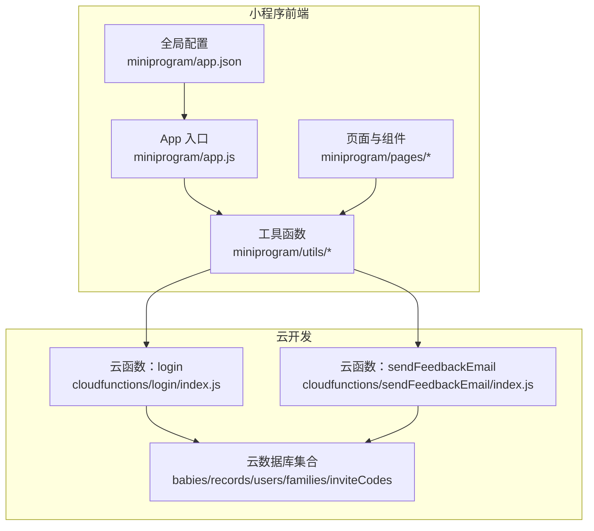
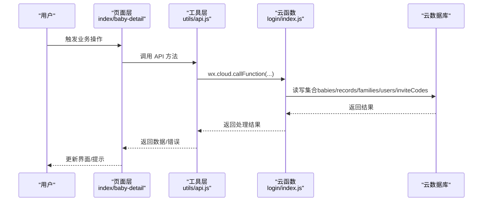
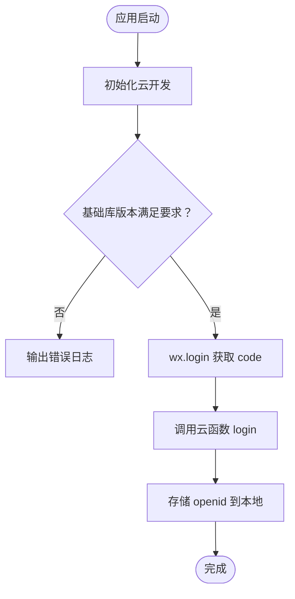
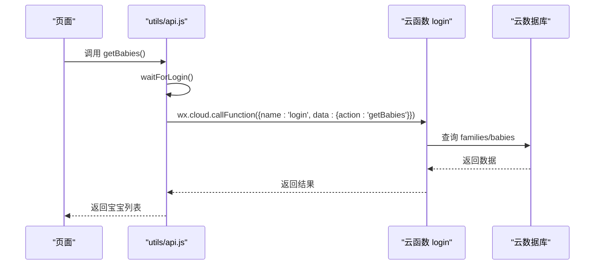
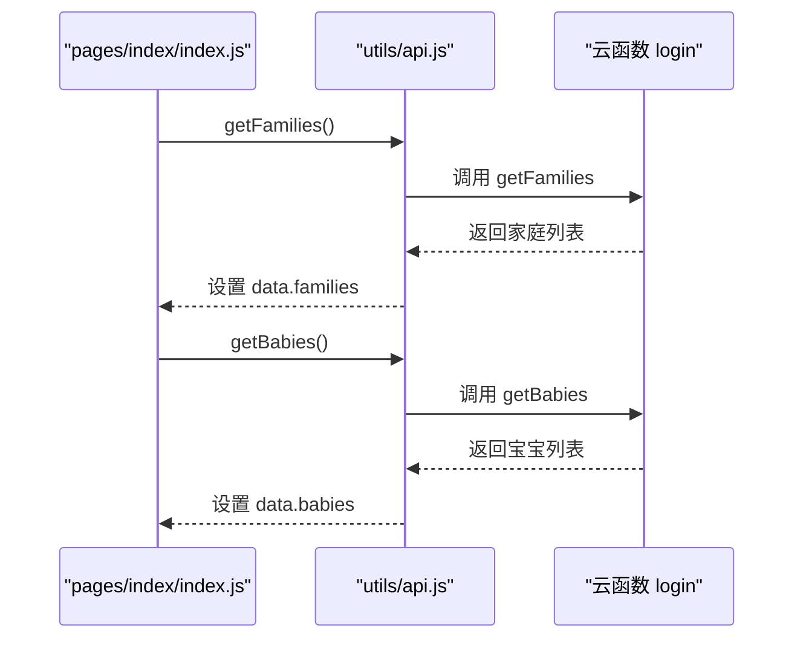
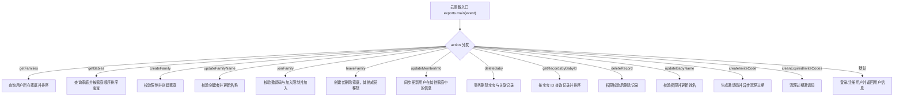
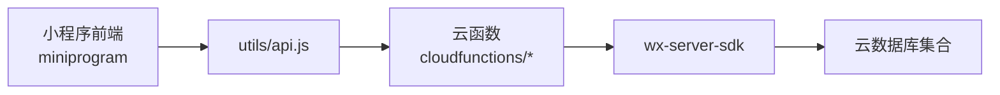

# 故障排除指南

<cite>
**本文引用的文件**
- [app.js](file://miniprogram/app.js)
- [app.json](file://miniprogram/app.json)
- [api.js](file://miniprogram/utils/api.js)
- [index.js](file://miniprogram/pages/index/index.js)
- [baby-detail.js](file://miniprogram/pages/baby-detail/baby-detail.js)
- [login/index.js](file://cloudfunctions/login/index.js)
- [sendFeedbackEmail/index.js](file://cloudfunctions/sendFeedbackEmail/index.js)
- [project.config.json](file://project.config.json)
- [envList.js](file://miniprogram/envList.js)
- [README.md](file://README.md)
</cite>

## 目录
1. [简介](#简介)
2. [项目结构](#项目结构)
3. [核心组件](#核心组件)
4. [架构总览](#架构总览)
5. [详细组件分析](#详细组件分析)
6. [依赖关系分析](#依赖关系分析)
7. [性能考虑](#性能考虑)
8. [故障排除指南](#故障排除指南)
9. [结论](#结论)
10. [附录](#附录)

## 简介
本指南面向萌芽季小程序的开发者与运维人员，系统化梳理开发与运行过程中的常见问题及解决方案，覆盖开发环境问题、运行时问题、云函数相关问题、用户反馈处理流程、调试工具使用以及紧急问题处置预案。内容基于项目源码与配置文件进行分析，确保可操作性强、定位准确。

## 项目结构
项目采用“小程序前端 + 云开发 + 云函数”的典型架构：
- 小程序前端位于 miniprogram 目录，包含页面、组件、工具函数与全局配置。
- 云函数位于 cloudfunctions 目录，提供登录、家庭管理、宝宝与记录管理等后端逻辑。
- 项目配置位于 project.config.json，包含编译设置、云开发根目录、小程序 AppID 等。
- 环境变量与环境列表位于 miniprogram/envList.js。

**图示来源**
- [app.js:1-56](file://miniprogram/app.js#L1-L56)
- [app.json:1-39](file://miniprogram/app.json#L1-L39)
- [api.js:1-800](file://miniprogram/utils/api.js#L1-L800)
- [login/index.js:1-814](file://cloudfunctions/login/index.js#L1-L814)
- [sendFeedbackEmail/index.js:1-21](file://cloudfunctions/sendFeedbackEmail/index.js#L1-L21)

**章节来源**
- [project.config.json:1-85](file://project.config.json#L1-L85)
- [README.md:77-103](file://README.md#L77-L103)

## 核心组件
- 应用入口与初始化：负责云开发初始化、基础库版本校验、登录态检查与持久化。
- API 层：封装数据库与云函数调用，统一处理权限校验、登录等待与错误处理。
- 页面层：首页与宝宝详情页承载主要业务流程，包含图表渲染、权限控制与交互。
- 云函数：login 提供登录、家庭与宝宝管理、记录管理等完整后端逻辑；sendFeedbackEmail 作为反馈处理入口。

**章节来源**
- [app.js:1-56](file://miniprogram/app.js#L1-L56)
- [api.js:1-800](file://miniprogram/utils/api.js#L1-L800)
- [index.js:1-144](file://miniprogram/pages/index/index.js#L1-L144)
- [baby-detail.js:1-691](file://miniprogram/pages/baby-detail/baby-detail.js#L1-L691)
- [login/index.js:1-814](file://cloudfunctions/login/index.js#L1-L814)
- [sendFeedbackEmail/index.js:1-21](file://cloudfunctions/sendFeedbackEmail/index.js#L1-L21)

## 架构总览
小程序前端通过 wx.cloud 调用云函数与云数据库；云函数通过 wx-server-sdk 访问云数据库，执行业务逻辑与权限校验；页面层负责 UI 渲染与用户交互。

**图示来源**
- [api.js:1-800](file://miniprogram/utils/api.js#L1-L800)
- [login/index.js:1-814](file://cloudfunctions/login/index.js#L1-L814)

## 详细组件分析

### 应用入口与初始化（app.js）
- 初始化云开发：校验基础库版本，初始化云开发环境。
- 登录流程：调用微信登录接口，再调用云函数 login 获取用户信息并持久化 openid。
- 登录态检查：启动时检查登录状态，避免重复登录。

**图示来源**
- [app.js:8-54](file://miniprogram/app.js#L8-L54)

**章节来源**
- [app.js:1-56](file://miniprogram/app.js#L1-L56)

### API 层（utils/api.js）
- 登录等待机制：waitForLogin 支持最大等待时间，避免阻塞。
- 权限校验：checkPermission 统一检查用户在家庭中的权限等级。
- 数据访问：封装 getBabies、getBabyById、getRecordsByBabyId、addRecord、deleteRecord、updateBabyName、updateBabyAvatar 等方法，统一走云函数或数据库访问。
- 错误处理：对网络与业务异常进行捕获与降级返回空数组/空值。

**图示来源**
- [api.js:43-75](file://miniprogram/utils/api.js#L43-L75)
- [login/index.js:21-92](file://cloudfunctions/login/index.js#L21-L92)

**章节来源**
- [api.js:1-800](file://miniprogram/utils/api.js#L1-L800)

### 首页与宝宝详情页（pages/index/index.js, pages/baby-detail/baby-detail.js）
- 首页：加载宝宝列表、家庭映射、最新记录，支持添加宝宝、删除宝宝（权限校验）。
- 宝宝详情：加载宝宝信息、家庭名称、记录列表，支持图表渲染（ECharts），支持修改姓名、更新头像、添加/删除记录（权限校验）。

**图示来源**
- [index.js:14-52](file://miniprogram/pages/index/index.js#L14-L52)
- [api.js:435-461](file://miniprogram/utils/api.js#L435-L461)
- [login/index.js:21-92](file://cloudfunctions/login/index.js#L21-L92)

**章节来源**
- [index.js:1-144](file://miniprogram/pages/index/index.js#L1-L144)
- [baby-detail.js:1-691](file://miniprogram/pages/baby-detail/baby-detail.js#L1-L691)

### 云函数（cloudfunctions/login/index.js）
- 登录与用户管理：登录、获取用户信息、更新最后登录时间。
- 家庭管理：创建/修改家庭名称、加入/退出家庭、更新成员权限、移除成员、清理过期邀请码。
- 宝宝管理：获取宝宝列表、按 ID 获取宝宝、删除宝宝（事务保障）、更新宝宝姓名。
- 记录管理：按宝宝 ID 获取记录、按 ID 获取记录、删除记录（权限校验）。
- 邀请码：生成邀请码（12 小时过期）、清理过期邀请码。

**图示来源**
- [login/index.js:21-814](file://cloudfunctions/login/index.js#L21-L814)

**章节来源**
- [login/index.js:1-814](file://cloudfunctions/login/index.js#L1-L814)

### 反馈云函数（cloudfunctions/sendFeedbackEmail/index.js）
- 当前实现：接收事件数据并记录日志，返回成功消息（暂未实现邮件发送）。
- 建议：扩展 nodemailer 配置与邮件模板，完善错误处理与重试机制。

**章节来源**
- [sendFeedbackEmail/index.js:1-21](file://cloudfunctions/sendFeedbackEmail/index.js#L1-L21)

## 依赖关系分析
- 小程序前端依赖云开发 SDK（wx.cloud）与云函数；API 层封装调用细节。
- 云函数依赖 wx-server-sdk 与云数据库；通过集合（babies、records、users、families、inviteCodes）实现业务数据模型。
- 项目配置（project.config.json）定义了云函数根目录、编译选项与 AppID，影响部署与调试行为。

**图示来源**
- [project.config.json:1-85](file://project.config.json#L1-L85)
- [login/index.js:1-6](file://cloudfunctions/login/index.js#L1-L6)

**章节来源**
- [project.config.json:1-85](file://project.config.json#L1-L85)

## 性能考虑
- 登录等待：waitForLogin 设定最大等待时间，避免长时间阻塞。
- 数据查询：优先通过云函数聚合查询，减少客户端直连数据库的复杂度与权限限制。
- 图表渲染：ECharts 组件按需懒加载，减少首屏开销。
- 事务操作：删除宝宝使用事务，保证数据一致性与原子性。

**章节来源**
- [api.js:13-41](file://miniprogram/utils/api.js#L13-L41)
- [baby-detail.js:184-191](file://miniprogram/pages/baby-detail/baby-detail.js#L184-L191)
- [login/index.js:484-510](file://cloudfunctions/login/index.js#L484-L510)

## 故障排除指南

### 开发环境问题排查
- 基础库版本不足
  - 现象：应用启动时报错，提示需要更高版本基础库。
  - 排查：检查 app.js 中 wx.cloud.init 的调用与 project.config.json 的 libVersion。
  - 解决：升级微信开发者工具基础库版本至要求以上。
  - 参考路径：
    - [app.js:9-16](file://miniprogram/app.js#L9-L16)
    - [project.config.json](file://project.config.json#L49)

- 云开发环境未配置或环境 ID 错误
  - 现象：初始化云开发失败或调用云函数报错。
  - 排查：确认 app.js 中 globalData.env 是否正确，项目配置中云开发根目录是否指向 cloudfunctions。
  - 解决：在微信开发者工具中创建/选择云开发环境，复制环境 ID 到 app.js。
  - 参考路径：
    - [app.js](file://miniprogram/app.js#L5)
    - [project.config.json:2-4](file://project.config.json#L2-L4)

- 云函数部署失败
  - 现象：上传并部署云函数时报错或函数未生效。
  - 排查：检查云函数目录结构、package.json 依赖、云函数根目录配置。
  - 解决：确保依赖安装完整，重新上传并部署；核对云开发控制台日志。
  - 参考路径：
    - [project.config.json](file://project.config.json#L3)
    - [login/package.json:1-16](file://cloudfunctions/login/package.json#L1-L16)

- 数据库集合缺失
  - 现象：云函数或前端调用数据库时报集合不存在。
  - 排查：检查云开发控制台集合是否存在。
  - 解决：在云开发控制台创建集合：babies、records、users、families、inviteCodes。
  - 参考路径：
    - [README.md:65-71](file://README.md#L65-L71)

**章节来源**
- [app.js:9-16](file://miniprogram/app.js#L9-L16)
- [project.config.json:2-4](file://project.config.json#L2-L4)
- [login/package.json:1-16](file://cloudfunctions/login/package.json#L1-L16)
- [README.md:65-71](file://README.md#L65-L71)

### 运行时问题诊断
- 登录失败或登录态异常
  - 现象：页面加载时无法获取用户信息，或频繁掉线。
  - 排查：检查 app.js 中 wx.login 与 wx.cloud.callFunction 的调用链路，确认云函数 login 是否正常返回。
  - 解决：在 app.js 的 fail 回调中打印错误；在云函数中增加日志与异常捕获。
  - 参考路径：
    - [app.js:29-54](file://miniprogram/app.js#L29-L54)
    - [login/index.js:762-800](file://cloudfunctions/login/index.js#L762-L800)

- 宝宝列表/记录加载失败
  - 现象：首页或详情页数据为空或加载失败。
  - 排查：确认云函数 getBabies/getRecordsByBabyId 的返回值与权限校验；检查前端 API 层的错误处理。
  - 解决：在 API 层捕获异常并返回空数组；在页面层提示用户重试。
  - 参考路径：
    - [api.js:43-75](file://miniprogram/utils/api.js#L43-L75)
    - [api.js:264-286](file://miniprogram/utils/api.js#L264-L286)
    - [login/index.js:21-92](file://cloudfunctions/login/index.js#L21-L92)
    - [login/index.js:578-605](file://cloudfunctions/login/index.js#L578-L605)

- 权限不足导致操作失败
  - 现象：添加/删除宝宝、修改记录、更新头像等操作被拒绝。
  - 排查：检查 checkPermission 与云函数中的权限判断逻辑。
  - 解决：在页面层提前校验权限并提示；在云函数中明确返回错误信息。
  - 参考路径：
    - [api.js:782-800](file://miniprogram/utils/api.js#L782-L800)
    - [login/index.js:482-510](file://cloudfunctions/login/index.js#L482-L510)
    - [login/index.js:512-554](file://cloudfunctions/login/index.js#L512-L554)

- 图表渲染异常
  - 现象：宝宝详情页图表不显示或空白。
  - 排查：确认 ec-canvas 组件初始化、数据排序与 ECharts 配置；检查 dataZoom 默认窗口。
  - 解决：在 onReady 中延迟初始化；确保数据非空后再 setOption。
  - 参考路径：
    - [baby-detail.js:323-397](file://miniprogram/pages/baby-detail/baby-detail.js#L323-L397)
    - [baby-detail.js:399-473](file://miniprogram/pages/baby-detail/baby-detail.js#L399-L473)

**章节来源**
- [app.js:29-54](file://miniprogram/app.js#L29-L54)
- [api.js:43-75](file://miniprogram/utils/api.js#L43-L75)
- [api.js:264-286](file://miniprogram/utils/api.js#L264-L286)
- [api.js:782-800](file://miniprogram/utils/api.js#L782-L800)
- [login/index.js:482-510](file://cloudfunctions/login/index.js#L482-L510)
- [login/index.js:512-554](file://cloudfunctions/login/index.js#L512-L554)
- [baby-detail.js:323-397](file://miniprogram/pages/baby-detail/baby-detail.js#L323-L397)
- [baby-detail.js:399-473](file://miniprogram/pages/baby-detail/baby-detail.js#L399-L473)

### 云函数相关问题
- 部署失败
  - 现象：上传后控制台显示部署失败或冷启动超时。
  - 排查：检查 package.json 依赖版本、云函数根目录、网络环境。
  - 解决：使用稳定网络重试部署；确保依赖安装在本地；查看云开发控制台日志。
  - 参考路径：
    - [project.config.json](file://project.config.json#L3)
    - [login/package.json:1-16](file://cloudfunctions/login/package.json#L1-L16)

- 运行时错误
  - 现象：云函数报错或返回空结果。
  - 排查：在云函数中增加 try/catch 与 console.log；检查集合权限与索引。
  - 解决：补充日志定位具体分支；修复数据库查询条件与权限判断。
  - 参考路径：
    - [login/index.js:26-800](file://cloudfunctions/login/index.js#L26-L800)

- 性能问题
  - 现象：查询慢、并发高时响应延迟。
  - 排查：分析查询条件、排序字段与索引；检查事务与批量删除逻辑。
  - 解决：为常用查询字段建立索引；拆分批量操作；缓存热点数据。
  - 参考路径：
    - [login/index.js:31-48](file://cloudfunctions/login/index.js#L31-L48)
    - [login/index.js:484-510](file://cloudfunctions/login/index.js#L484-L510)

**章节来源**
- [project.config.json](file://project.config.json#L3)
- [login/package.json:1-16](file://cloudfunctions/login/package.json#L1-L16)
- [login/index.js:26-800](file://cloudfunctions/login/index.js#L26-L800)
- [login/index.js:484-510](file://cloudfunctions/login/index.js#L484-L510)

### 用户反馈问题处理
- 反馈入口与处理
  - 现象：用户提交反馈后无响应或失败。
  - 排查：检查 sendFeedbackEmail 云函数是否部署；查看控制台日志。
  - 解决：完善错误返回与日志记录；后续接入邮件服务（nodemailer）。
  - 参考路径：
    - [sendFeedbackEmail/index.js:1-21](file://cloudfunctions/sendFeedbackEmail/index.js#L1-L21)

**章节来源**
- [sendFeedbackEmail/index.js:1-21](file://cloudfunctions/sendFeedbackEmail/index.js#L1-L21)

### 调试工具使用
- 微信开发者工具
  - 断点调试：在页面与云函数中设置断点，观察变量与调用链。
  - 网络面板：查看 wx.cloud.callFunction 请求与响应。
  - 控制台：查看 console 输出与错误堆栈。
  - 真机调试：使用手机扫码连接，复现真机问题。
- 云开发控制台
  - 日志：查看云函数运行日志与错误。
  - 数据库：验证集合与索引，检查数据一致性。
  - 云函数：查看部署状态与触发次数。

**章节来源**
- [project.config.json:1-85](file://project.config.json#L1-L85)

### 紧急问题处置预案
- 登录环失败
  - 步骤：回滚最近一次云函数变更；检查 wx.login 与云函数返回；临时关闭权限校验以验证链路。
- 数据异常
  - 步骤：备份数据库；在云开发控制台回滚集合；检查事务与索引。
- 云函数冷启动慢
  - 步骤：预热关键云函数；优化查询与依赖；启用更合适的运行环境规格。
- 用户反馈激增
  - 步骤：扩容云函数并发；优化日志与告警；准备邮件服务备用方案。

[本节为通用指导，无需特定文件引用]

## 结论
本指南基于项目源码与配置，提供了从开发环境到运行时、从前端到云函数的系统化故障排除方法。建议团队在日常开发中：
- 严格遵循权限校验与错误处理规范；
- 在关键路径增加日志与监控；
- 定期检查数据库索引与查询性能；
- 完善云函数部署与回滚策略；
- 建立用户反馈闭环与紧急响应机制。

## 附录
- 关键文件清单
  - 小程序入口与配置：[app.js:1-56](file://miniprogram/app.js#L1-L56)、[app.json:1-39](file://miniprogram/app.json#L1-L39)
  - 工具函数与页面：[api.js:1-800](file://miniprogram/utils/api.js#L1-L800)、[index.js:1-144](file://miniprogram/pages/index/index.js#L1-L144)、[baby-detail.js:1-691](file://miniprogram/pages/baby-detail/baby-detail.js#L1-L691)
  - 云函数：[login/index.js:1-814](file://cloudfunctions/login/index.js#L1-L814)、[sendFeedbackEmail/index.js:1-21](file://cloudfunctions/sendFeedbackEmail/index.js#L1-L21)
  - 项目配置：[project.config.json:1-85](file://project.config.json#L1-L85)、[envList.js:1-7](file://miniprogram/envList.js#L1-L7)
  - 项目说明：[README.md:1-194](file://README.md#L1-L194)