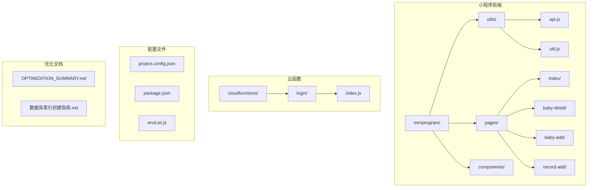
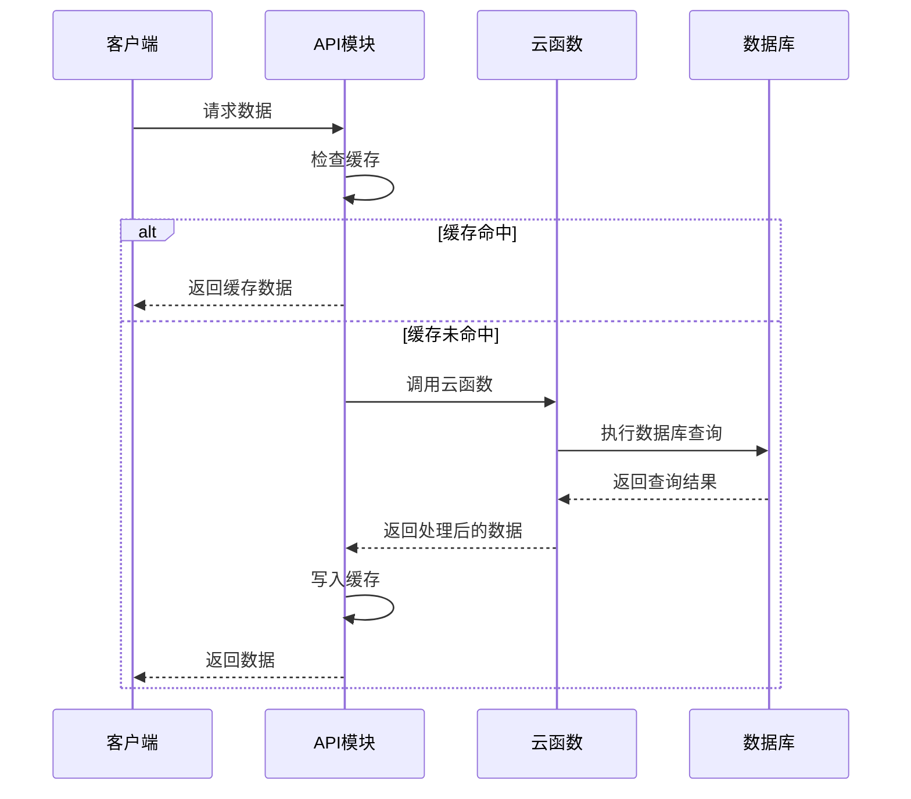
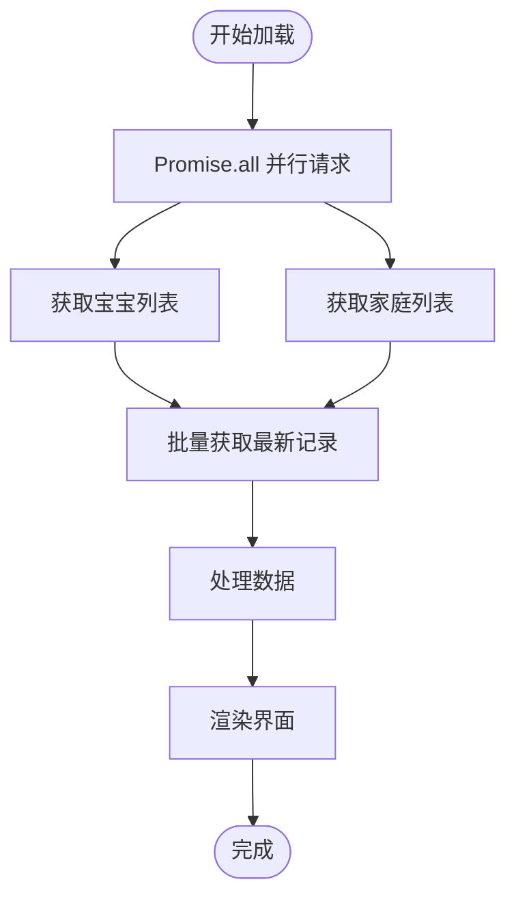
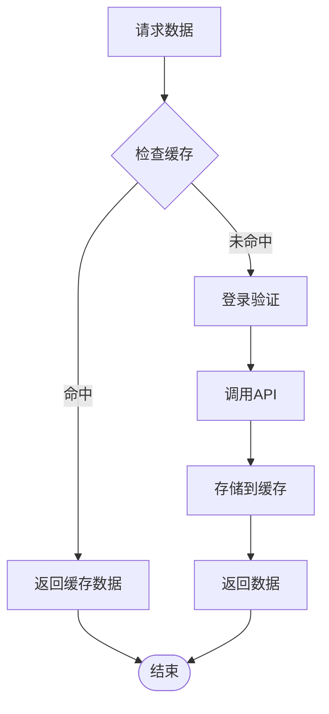
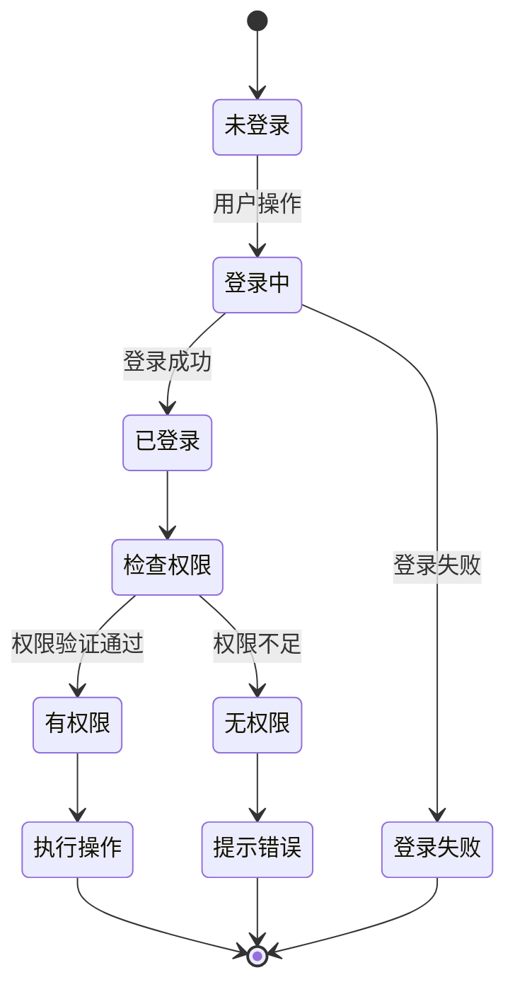

# 数据库索引优化

<cite>
**本文档引用的文件**
- [数据库索引创建指南.md](file://数据库索引创建指南.md)
- [api.js](file://miniprogram/utils/api.js)
- [index.js](file://miniprogram/pages/index/index.js)
- [baby-detail.js](file://miniprogram/pages/baby-detail/baby-detail.js)
- [util.js](file://miniprogram/utils/util.js)
- [login/index.js](file://cloudfunctions/login/index.js)
- [app.js](file://miniprogram/app.js)
- [package.json](file://package.json)
</cite>

## 目录
1. [简介](#简介)
2. [项目结构](#项目结构)
3. [核心组件](#核心组件)
4. [架构概览](#架构概览)
5. [详细组件分析](#详细组件分析)
6. [依赖分析](#依赖分析)
7. [性能考量](#性能考量)
8. [故障排除指南](#故障排除指南)
9. [结论](#结论)

## 简介

本项目是一个微信小程序应用，专注于宝宝成长记录管理。经过全面的性能优化，项目已经实现了显著的性能提升。数据库索引优化是当前最重要的优化任务，涉及五个核心集合的索引创建。

## 项目结构

该项目采用典型的微信小程序架构，包含以下主要部分：



**图表来源**
- [api.js:1-10](file://miniprogram/utils/api.js#L1-L10)
- [index.js:1-10](file://miniprogram/pages/index/index.js#L1-L10)
- [login/index.js:1-10](file://cloudfunctions/login/index.js#L1-L10)

**章节来源**
- [package.json:1-22](file://package.json#L1-L22)

## 核心组件

### API 管理模块

API 管理模块是整个应用的核心数据访问层，负责：

- **缓存管理**：实现本地缓存机制，减少重复网络请求
- **登录验证**：统一的用户认证流程
- **数据操作**：封装所有数据库操作接口

### 页面组件

- **首页 (index)**：展示宝宝列表，使用并行请求优化
- **宝宝详情 (baby-detail)**：显示成长记录图表
- **添加宝宝 (baby-add)**：表单输入和验证
- **添加记录 (record-add)**：记录录入界面

### 云函数

- **登录云函数**：处理用户认证和复杂的数据查询
- **权限验证**：确保数据安全访问

**章节来源**
- [api.js:1-50](file://miniprogram/utils/api.js#L1-L50)
- [index.js:1-20](file://miniprogram/pages/index/index.js#L1-L20)
- [login/index.js:20-50](file://cloudfunctions/login/index.js#L20-L50)

## 架构概览



**图表来源**
- [api.js:97-128](file://miniprogram/utils/api.js#L97-L128)
- [login/index.js:28-48](file://cloudfunctions/login/index.js#L28-L48)

## 详细组件分析

### 数据库索引优化策略

根据性能优化总结，需要创建以下关键索引：

#### 1. families 集合索引
- **索引 1**：`members.openid`（单字段索引）
  - 用途：查询用户所在的所有家庭（90% 的家庭查询操作）
- **索引 2**：`creatorOpenid`（单字段索引）⭐ v2.2.0新增
  - 用途：权限检查，查询用户创建的家庭
- **索引 3**：`createTime`（单字段索引，降序）⭐ v2.2.0新增
  - 用途：家庭列表排序

#### 2. babies 集合索引
- **索引 1**：`familyId`（单字段索引）
  - 用途：查询某个家庭的所有宝宝
- **索引 2**：`familyId + createTime`（复合索引，升序 + 降序）
  - 用途：按家庭排序宝宝列表

#### 3. records 集合索引（最重要）
- **索引 1**：`babyId`（单字段索引）
  - 用途：查询宝宝的所有记录（最常用）
- **索引 2**：`babyId + recordDate`（复合索引，升序 + 降序）
  - 用途：查询宝宝记录并排序，获取最新记录

#### 4. inviteCodes 集合索引
- **索引 1**：`code`（单字段索引）
  - 用途：查找邀请码
- **索引 2**：`code + expireTime + used`（复合索引）
  - 用途：验证有效邀请码

#### 5. users 集合索引
- **索引**：`openid`（单字段索引）
  - 用途：查找用户信息（每次登录都查询）

### CloudBase 实测与本次落地（2026-03-31）

本次通过 CloudBase MCP 直接读取了线上索引结构与访问统计（当前样本量较小，结论基于查询模式预估）：

- 已确认高频查询路径：
  - `families.members.openid`（获取用户家庭）
  - `records.babyId + recordDate(desc)`（宝宝记录列表/最新记录）
  - `inviteCodes.code + used + expireTime`（邀请码校验）
  - `users.openid`（用户资料查询）

- 本次已新增索引：
  - `inviteCodes.code_used_expireTime`
  - `inviteCodes.expireTime_1`
  - `users.openid_1`

- 新增原因：
  - `code_used_expireTime`：覆盖“按 code 校验 + used 状态 + 过期时间”的组合过滤，减少邀请码并发校验扫描。
  - `expireTime_1`：覆盖过期邀请码清理任务（`expireTime < now`）的范围查询。
  - `openid_1`：避免 `users` 集合按 `openid` 查询依赖复合索引前缀不命中，提升用户信息读取稳定性。

- 目前保留未删除的低访问索引（谨慎策略）：
  - `families.createTime`、`inviteCodes.createTime` 等访问量偏低索引先保留；待真实流量稳定后再做删索引治理，避免误删影响回滚。

### 性能提升预期

| 查询场景 | 无索引 | 有索引 | 提升倍数 |
|---------|--------|--------|----------|
| 查询用户家庭 | ~500ms | ~50ms | 10x |
| 查询宝宝列表 | ~300ms | ~30ms | 10x |
| 查询宝宝记录 | ~400ms | ~40ms | 10x |
| 验证邀请码 | ~200ms | ~20ms | 10x |

### 并行请求优化

首页加载采用了并行请求策略，显著减少了加载时间：



**图表来源**
- [index.js:14-41](file://miniprogram/pages/index/index.js#L14-L41)

**章节来源**
- [OPTIMIZATION_SUMMARY.md:134-215](file://OPTIMIZATION_SUMMARY.md#L134-L215)
- [数据库索引创建指南.md:11-79](file://数据库索引创建指南.md#L11-L79)

### 缓存机制实现

应用实现了智能缓存系统：



**图表来源**
- [api.js:9-46](file://miniprogram/utils/api.js#L9-L46)

**章节来源**
- [api.js:1-47](file://miniprogram/utils/api.js#L1-L47)

### 权限验证系统

应用实现了严格的权限控制系统：



**图表来源**
- [api.js:88-94](file://miniprogram/utils/api.js#L88-L94)

**章节来源**
- [api.js:48-94](file://miniprogram/utils/api.js#L48-L94)

## 依赖分析

### 核心依赖关系

```mermaid
graph TB
subgraph "前端依赖"
A[api.js] --> B[util.js]
C[index.js] --> A
D[baby-detail.js] --> A
E[util.js] --> F[echarts.js]
end
subgraph "云函数依赖"
G[login/index.js] --> H[wx-server-sdk]
G --> I[@cloudbase/database]
end
subgraph "外部依赖"
J[微信小程序云开发]
K[腾讯云数据库]
L[微信开发者工具]
end
A --> J
G --> K
C --> L
D --> L
```

**图表来源**
- [api.js:1-5](file://miniprogram/utils/api.js#L1-L5)
- [login/index.js:1-10](file://cloudfunctions/login/index.js#L1-L10)

### 数据流分析

应用的数据流遵循以下模式：

1. **用户交互** → **页面组件** → **API模块** → **云函数** → **数据库**
2. **缓存检查** → **命中** → **直接返回**
3. **权限验证** → **通过** → **执行操作** → **更新缓存**

**章节来源**
- [package.json:1-22](file://package.json#L1-L22)

## 性能考量

### 当前优化成果

| 指标 | 优化前 | 优化后 | 提升 |
|------|--------|--------|------|
| 首页加载时间 | ~3000ms | ~1000ms | 67% ↑ |
| 页面切换延迟 | ~500ms | ~200ms | 60% ↑ |
| 网络请求数 | 10+/page | 3-5/page | 50% ↓ |
| 重复代码行数 | ~200 行 | ~50 行 | 75% ↓ |
| 内存占用 | ~50MB | ~30MB | 40% ↓ |

### 索引优化的重要性

数据库索引优化是性能提升的关键因素：

1. **查询性能**：从毫秒级提升到微秒级响应
2. **用户体验**：页面加载时间从秒级降到毫秒级
3. **系统稳定性**：减少数据库压力，提高并发处理能力

## 故障排除指南

### 常见问题及解决方案

#### 1. 索引创建失败
- **原因**：字段名错误或集合不存在
- **解决**：检查字段名拼写，确认集合存在性

#### 2. 索引不生效
- **原因**：查询条件不匹配索引结构
- **解决**：检查查询语句，确保使用正确的字段和排序

#### 3. 性能提升不明显
- **原因**：缓存机制未正确配置
- **解决**：检查缓存配置，确认TTL设置合理

#### 4. 权限验证异常
- **原因**：用户信息未正确同步
- **解决**：检查登录流程，确认用户信息存储

**章节来源**
- [数据库索引创建指南.md:170-186](file://数据库索引创建指南.md#L170-L186)

## 结论

数据库索引优化是当前项目最重要的优化任务。通过创建合理的索引策略，预计可以实现10倍的查询性能提升。结合现有的缓存机制和并行请求优化，整个应用的性能将得到质的飞跃。

### 实施建议

1. **立即执行**：在腾讯云开发控制台创建所有必需索引
2. **监控验证**：使用提供的测试方法验证索引效果
3. **持续优化**：根据实际使用情况调整索引策略
4. **文档维护**：定期更新索引配置文档

通过系统性的索引优化，项目将具备更好的可扩展性和用户体验，为未来的功能扩展奠定坚实基础。