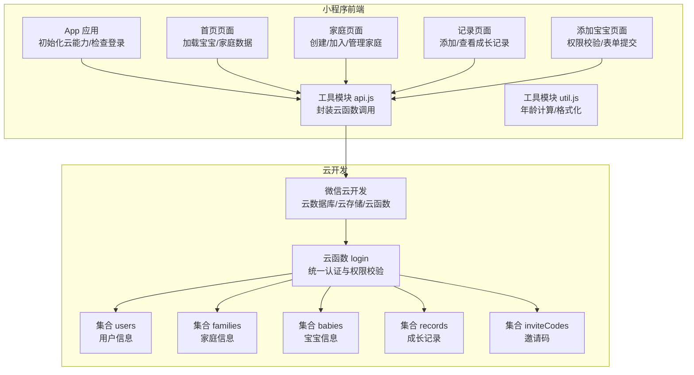
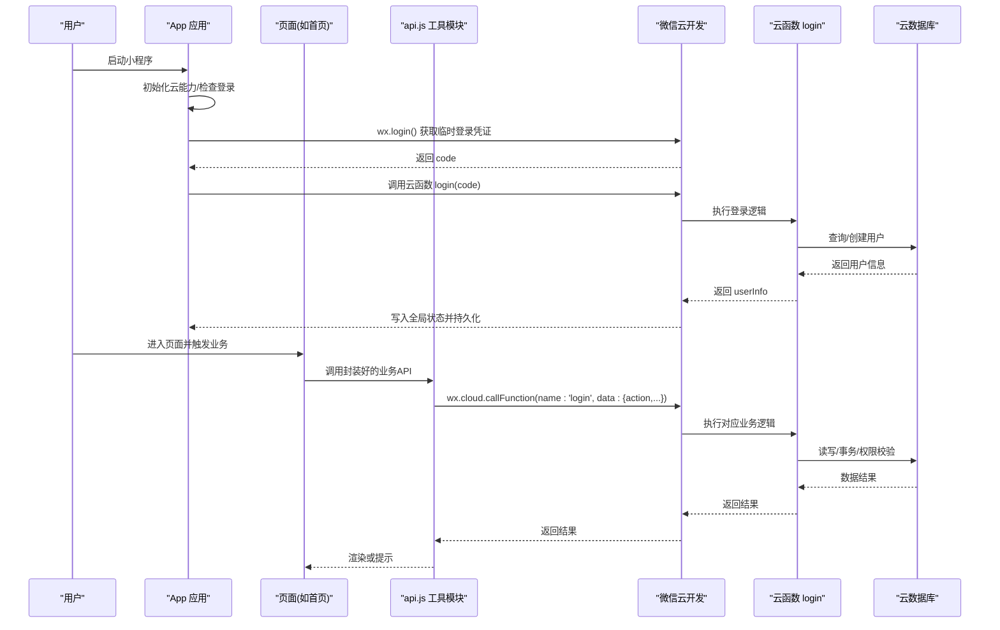
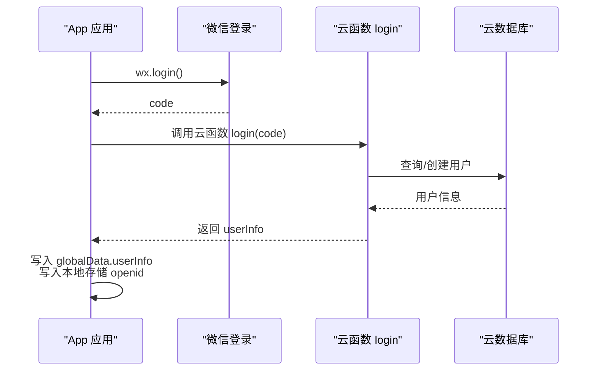
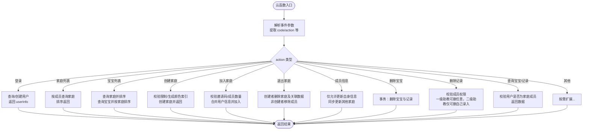
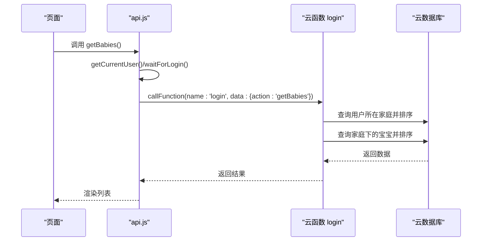
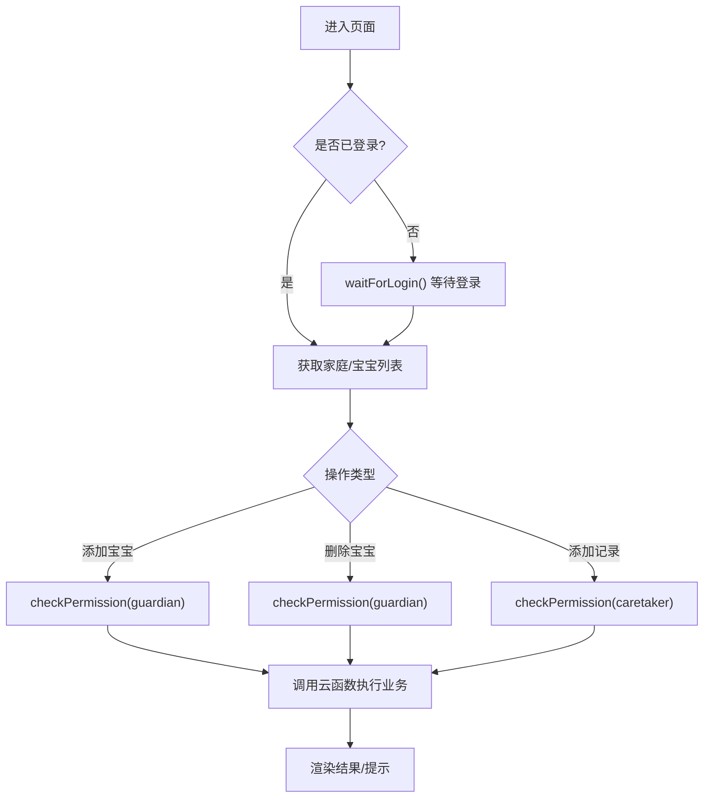
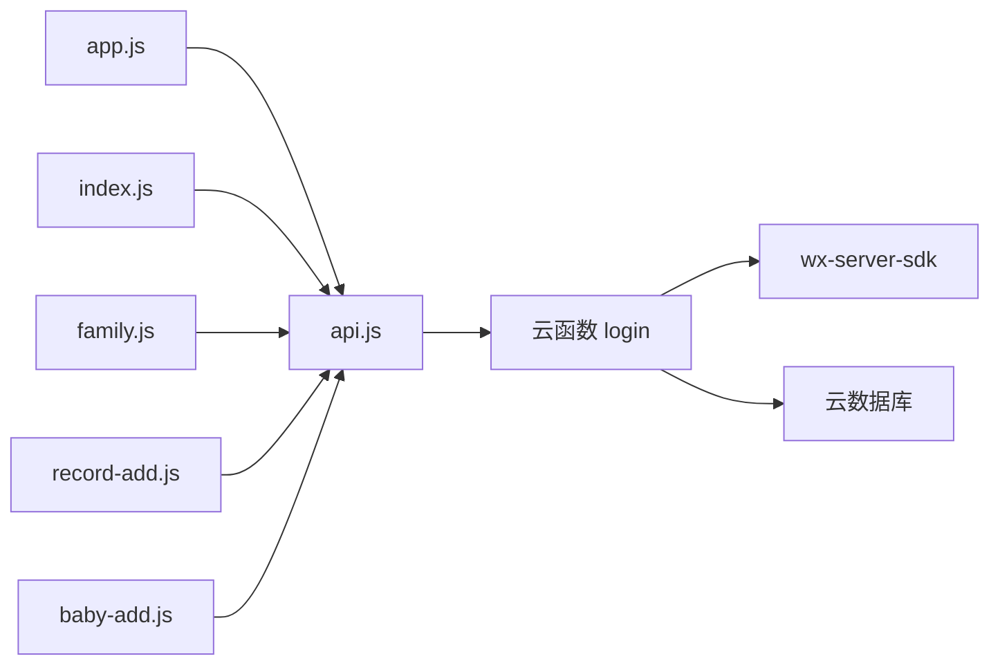

# 用户认证系统

<cite>
**本文引用的文件**
- [cloudfunctions/login/index.js](file://cloudfunctions/login/index.js)
- [cloudfunctions/login/package.json](file://cloudfunctions/login/package.json)
- [miniprogram/utils/api.js](file://miniprogram/utils/api.js)
- [miniprogram/app.js](file://miniprogram/app.js)
- [miniprogram/utils/util.js](file://miniprogram/utils/util.js)
- [miniprogram/pages/index/index.js](file://miniprogram/pages/index/index.js)
- [miniprogram/pages/baby-add/baby-add.js](file://miniprogram/pages/baby-add/baby-add.js)
- [miniprogram/pages/family/family.js](file://miniprogram/pages/family/family.js)
- [miniprogram/pages/record-add/record-add.js](file://miniprogram/pages/record-add/record-add.js)
- [miniprogram/app.json](file://miniprogram/app.json)
- [miniprogram/envList.js](file://miniprogram/envList.js)
</cite>

## 目录
1. [简介](#简介)
2. [项目结构](#项目结构)
3. [核心组件](#核心组件)
4. [架构总览](#架构总览)
5. [详细组件分析](#详细组件分析)
6. [依赖关系分析](#依赖关系分析)
7. [性能考量](#性能考量)
8. [故障排查指南](#故障排查指南)
9. [结论](#结论)
10. [附录](#附录)

## 简介
本项目为微信小程序“萌芽季”的用户认证与权限控制系统，围绕以下目标展开：
- 解释微信小程序登录授权机制与云函数认证逻辑
- 展示用户登录流程、token管理、会话保持策略
- 说明如何通过云函数绕过客户端数据库权限限制，统一进行安全校验
- 提供用户信息获取、登录状态检查、自动重试机制、错误处理策略
- 给出登录API调用示例，重点解析 waitForLogin() 的工作原理
- 阐述用户权限验证机制，确保数据访问安全
- 提供常见问题（登录超时、网络异常等）的解决方案

## 项目结构
项目采用“小程序前端 + 云开发 + 云函数”的分层架构：
- 小程序前端：负责UI交互、调用云函数、本地状态管理
- 云开发：提供云数据库、云存储、云函数运行环境
- 云函数：集中处理用户认证、权限校验、复杂业务逻辑

图表来源
- [miniprogram/app.js:1-56](file://miniprogram/app.js#L1-L56)
- [miniprogram/utils/api.js:1-879](file://miniprogram/utils/api.js#L1-L879)
- [cloudfunctions/login/index.js:1-814](file://cloudfunctions/login/index.js#L1-L814)

章节来源
- [miniprogram/app.js:1-56](file://miniprogram/app.js#L1-L56)
- [miniprogram/app.json:1-39](file://miniprogram/app.json#L1-L39)
- [miniprogram/envList.js:1-7](file://miniprogram/envList.js#L1-L7)

## 核心组件
- 登录与会话管理
  - 小程序应用启动时自动检查登录状态并发起登录
  - 登录成功后将用户信息写入全局状态，并持久化到本地存储
- 云函数认证中心
  - 统一处理用户登录、家庭/宝宝/记录等业务操作
  - 在服务端完成权限校验与数据一致性保障（事务、命令组合）
- 权限控制与数据访问
  - 基于家庭成员角色（围观/二级助教/一级助教）进行细粒度权限控制
  - 通过云函数统一校验，避免客户端直接访问数据库带来的越权风险

章节来源
- [miniprogram/app.js:18-54](file://miniprogram/app.js#L18-L54)
- [cloudfunctions/login/index.js:22-800](file://cloudfunctions/login/index.js#L22-L800)
- [miniprogram/utils/api.js:435-852](file://miniprogram/utils/api.js#L435-L852)

## 架构总览
下图展示了从用户进入小程序到完成一次典型业务操作（如添加宝宝）的端到端流程。

图表来源
- [miniprogram/app.js:28-54](file://miniprogram/app.js#L28-L54)
- [miniprogram/utils/api.js:43-111](file://miniprogram/utils/api.js#L43-L111)
- [cloudfunctions/login/index.js:762-800](file://cloudfunctions/login/index.js#L762-L800)

## 详细组件分析

### 组件A：登录与会话保持（App 与 api.js）
- 登录流程
  - App 启动时调用 wx.login 获取临时登录凭证 code
  - 调用云函数 login 并传入 code
  - 云函数根据 code 获取用户标识，查询或创建用户记录
  - 返回 userInfo，App 写入全局状态并持久化 openid
- 会话保持策略
  - 通过全局状态 globalData.userInfo 和本地存储 openid 实现会话缓存
  - waitForLogin() 提供登录态等待与超时控制，避免异步竞态
- 自动重试机制
  - waitForLogin() 内置轮询检测登录完成状态，最大等待时间可配置
  - 若超时则拒绝 Promise，上层可根据错误类型进行重试或引导用户重新登录

图表来源
- [miniprogram/app.js:28-54](file://miniprogram/app.js#L28-L54)
- [cloudfunctions/login/index.js:762-800](file://cloudfunctions/login/index.js#L762-L800)

章节来源
- [miniprogram/app.js:18-54](file://miniprogram/app.js#L18-L54)
- [miniprogram/utils/api.js:13-41](file://miniprogram/utils/api.js#L13-L41)

### 组件B：云函数认证逻辑（login 云函数）
- 设计思路
  - 将所有涉及用户态与权限的关键操作迁移到云函数执行
  - 服务端通过 wxContext 获取用户标识，结合数据库查询完成权限校验
  - 对需要强一致性的操作使用事务（如删除宝宝），保证跨集合数据一致性
- 关键能力
  - 用户登录与信息维护
  - 家庭管理：创建、加入、退出、成员权限变更、名称修改
  - 宝宝管理：增删改查、记录关联、姓名修改
  - 记录管理：增删查、权限校验（一级助教可删任意记录；二级助教仅可删本人录入）
  - 邀请码：生成、使用、过期清理
- 安全要点
  - 所有对数据库的读写均在服务端完成，避免客户端直连导致的越权
  - 权限校验前置，失败即抛错，不返回敏感数据
  - 事务保证跨集合操作的原子性

图表来源
- [cloudfunctions/login/index.js:22-814](file://cloudfunctions/login/index.js#L22-L814)

章节来源
- [cloudfunctions/login/index.js:22-814](file://cloudfunctions/login/index.js#L22-L814)
- [cloudfunctions/login/package.json:1-16](file://cloudfunctions/login/package.json#L1-L16)

### 组件C：API 封装与权限校验（api.js）
- 用户信息获取
  - getCurrentUser() 优先从全局状态获取，否则从本地存储读取
- 登录等待与重试
  - waitForLogin() 提供最大等待时间与轮询检测，超时抛错
- 云函数调用
  - 所有业务 API（如 getBabies、getBabyById、addBaby、deleteBaby、getRecordsByBabyId、checkPermission 等）均通过 wx.cloud.callFunction 调用云函数 login
  - 通过 action 参数区分不同业务分支，减少客户端对数据库的直接依赖
- 权限校验
  - checkPermission() 先获取用户家庭列表，再定位到具体家庭或全局，比较用户权限等级与所需等级
  - 权限等级映射：围观=1、二级助教=2、一级助教=3

图表来源
- [miniprogram/utils/api.js:43-75](file://miniprogram/utils/api.js#L43-L75)
- [cloudfunctions/login/index.js:28-92](file://cloudfunctions/login/index.js#L28-L92)

章节来源
- [miniprogram/utils/api.js:5-11](file://miniprogram/utils/api.js#L5-L11)
- [miniprogram/utils/api.js:13-41](file://miniprogram/utils/api.js#L13-L41)
- [miniprogram/utils/api.js:782-852](file://miniprogram/utils/api.js#L782-L852)

### 组件D：页面级权限控制与业务流程
- 首页（宝宝列表）
  - 加载宝宝列表与家庭列表，渲染年龄与最新记录
  - 添加宝宝入口受一级助教权限限制
  - 删除宝宝前调用 checkPermission() 校验权限
- 添加宝宝
  - 进入页面即校验一级助教权限
  - 表单校验通过后调用 addBaby()，内部会进行家庭数量与宝宝数量限制检查
- 家庭管理
  - 创建家庭、修改家庭名称、生成邀请码、加入/退出家庭、成员权限变更、移除成员等
  - 所有操作均通过云函数执行，确保权限与一致性
- 记录管理
  - 添加记录前校验二级助教或以上权限
  - 日期校验防止早于出生日期

图表来源
- [miniprogram/pages/index/index.js:14-142](file://miniprogram/pages/index/index.js#L14-L142)
- [miniprogram/pages/baby-add/baby-add.js:20-118](file://miniprogram/pages/baby-add/baby-add.js#L20-L118)
- [miniprogram/pages/record-add/record-add.js:71-116](file://miniprogram/pages/record-add/record-add.js#L71-L116)
- [miniprogram/pages/family/family.js:102-130](file://miniprogram/pages/family/family.js#L102-L130)

章节来源
- [miniprogram/pages/index/index.js:14-142](file://miniprogram/pages/index/index.js#L14-L142)
- [miniprogram/pages/baby-add/baby-add.js:20-118](file://miniprogram/pages/baby-add/baby-add.js#L20-L118)
- [miniprogram/pages/family/family.js:132-166](file://miniprogram/pages/family/family.js#L132-L166)
- [miniprogram/pages/record-add/record-add.js:71-116](file://miniprogram/pages/record-add/record-add.js#L71-L116)

## 依赖关系分析
- 小程序前端依赖
  - 微信云开发 SDK：初始化云能力、调用云函数、云存储上传
  - 本地存储：持久化 openid 与用户信息片段
- 云函数依赖
  - 微信云函数 SDK：获取 wxContext、操作云数据库
  - 云数据库：users、families、babies、records、inviteCodes 等集合
- 模块间耦合
  - api.js 作为统一入口，向上层页面暴露稳定接口
  - 云函数 login 作为后端唯一可信边界，避免页面直接访问数据库

图表来源
- [miniprogram/utils/api.js:1-879](file://miniprogram/utils/api.js#L1-L879)
- [cloudfunctions/login/package.json:12-14](file://cloudfunctions/login/package.json#L12-L14)
- [cloudfunctions/login/index.js:2-6](file://cloudfunctions/login/index.js#L2-L6)

章节来源
- [miniprogram/utils/api.js:1-879](file://miniprogram/utils/api.js#L1-L879)
- [cloudfunctions/login/package.json:1-16](file://cloudfunctions/login/package.json#L1-L16)

## 性能考量
- 云函数冷启动
  - 首次调用可能有延迟，建议在 App 启动阶段提前触发一次登录，降低首屏等待
- 数据查询优化
  - 通过复合条件查询与排序，减少客户端二次处理
  - 对频繁查询的集合建立合适索引（如按 openid 查询）
- 事务与批量操作
  - 删除宝宝时使用事务，避免部分删除导致的数据不一致
- 本地缓存
  - 利用全局状态与本地存储减少重复登录与重复查询

## 故障排查指南
- 登录超时
  - 现象：waitForLogin() 超时返回错误
  - 处理：检查网络状态与 App 登录流程，适当延长等待时间或引导用户重试
- 网络异常
  - 现象：云函数调用失败或返回空数据
  - 处理：捕获错误并提示用户重试；对关键操作增加重试机制
- 权限不足
  - 现象：checkPermission() 返回 false 或云函数抛出权限错误
  - 处理：提示用户升级权限或联系家庭管理员
- 数据不一致
  - 现象：删除宝宝后记录未同步删除
  - 处理：确认使用云函数执行删除（内部已使用事务），检查云函数日志
- 邀请码失效
  - 现象：加入家庭时报邀请码无效或已过期
  - 处理：重新生成邀请码，注意过期时间与使用次数限制

章节来源
- [miniprogram/utils/api.js:13-41](file://miniprogram/utils/api.js#L13-L41)
- [cloudfunctions/login/index.js:484-510](file://cloudfunctions/login/index.js#L484-L510)
- [miniprogram/pages/family/family.js:600-624](file://miniprogram/pages/family/family.js#L600-L624)

## 结论
本项目通过“小程序前端 + 云函数 + 云数据库”的架构，实现了安全、可控的用户认证与权限体系：
- 登录与会话：小程序自动登录，云函数统一认证，前端通过 waitForLogin() 保证登录态可用
- 权限控制：基于家庭成员角色的细粒度权限，全部在云函数侧校验
- 数据安全：所有数据库读写由云函数执行，避免客户端越权
- 业务一致性：对关键操作使用事务，确保跨集合数据一致性
- 可维护性：API 封装清晰，页面职责单一，便于扩展与迭代

## 附录
- 登录 API 调用示例（路径参考）
  - 登录：[miniprogram/app.js:28-54](file://miniprogram/app.js#L28-L54)
  - 等待登录：[miniprogram/utils/api.js:13-41](file://miniprogram/utils/api.js#L13-L41)
  - 获取宝宝列表：[miniprogram/utils/api.js:43-75](file://miniprogram/utils/api.js#L43-L75)
  - 获取宝宝详情：[miniprogram/utils/api.js:77-111](file://miniprogram/utils/api.js#L77-L111)
  - 删除宝宝（事务）：[miniprogram/utils/api.js:212-240](file://miniprogram/utils/api.js#L212-L240)
  - 获取记录（按宝宝）：[miniprogram/utils/api.js:264-286](file://miniprogram/utils/api.js#L264-L286)
  - 添加记录（权限校验）：[miniprogram/utils/api.js:299-346](file://miniprogram/utils/api.js#L299-L346)
  - 删除记录（权限校验）：[miniprogram/utils/api.js:348-374](file://miniprogram/utils/api.js#L348-L374)
  - 获取家庭列表：[miniprogram/utils/api.js:435-461](file://miniprogram/utils/api.js#L435-L461)
  - 获取家庭详情：[miniprogram/utils/api.js:463-484](file://miniprogram/utils/api.js#L463-L484)
  - 创建家庭：[miniprogram/utils/api.js:497-529](file://miniprogram/utils/api.js#L497-L529)
  - 创建邀请码：[miniprogram/utils/api.js:531-563](file://miniprogram/utils/api.js#L531-L563)
  - 加入家庭：[miniprogram/utils/api.js:565-624](file://miniprogram/utils/api.js#L565-L624)
  - 退出家庭：[miniprogram/utils/api.js:626-653](file://miniprogram/utils/api.js#L626-L653)
  - 更新成员信息：[miniprogram/utils/api.js:655-684](file://miniprogram/utils/api.js#L655-L684)
  - 更新家庭名称：[miniprogram/utils/api.js:686-715](file://miniprogram/utils/api.js#L686-L715)
  - 更新成员权限：[miniprogram/utils/api.js:717-749](file://miniprogram/utils/api.js#L717-L749)
  - 移除成员：[miniprogram/utils/api.js:751-780](file://miniprogram/utils/api.js#L751-L780)
  - 权限检查：[miniprogram/utils/api.js:782-852](file://miniprogram/utils/api.js#L782-L852)
- 云函数入口与业务分支
  - 云函数入口与登录：[cloudfunctions/login/index.js:22-800](file://cloudfunctions/login/index.js#L22-L800)
  - 家庭/宝宝/记录相关分支：[cloudfunctions/login/index.js:28-760](file://cloudfunctions/login/index.js#L28-L760)
- 页面使用示例（路径参考）
  - 首页：[miniprogram/pages/index/index.js:14-142](file://miniprogram/pages/index/index.js#L14-L142)
  - 添加宝宝：[miniprogram/pages/baby-add/baby-add.js:20-118](file://miniprogram/pages/baby-add/baby-add.js#L20-L118)
  - 家庭管理：[miniprogram/pages/family/family.js:102-166](file://miniprogram/pages/family/family.js#L102-L166)
  - 记录添加：[miniprogram/pages/record-add/record-add.js:71-116](file://miniprogram/pages/record-add/record-add.js#L71-L116)