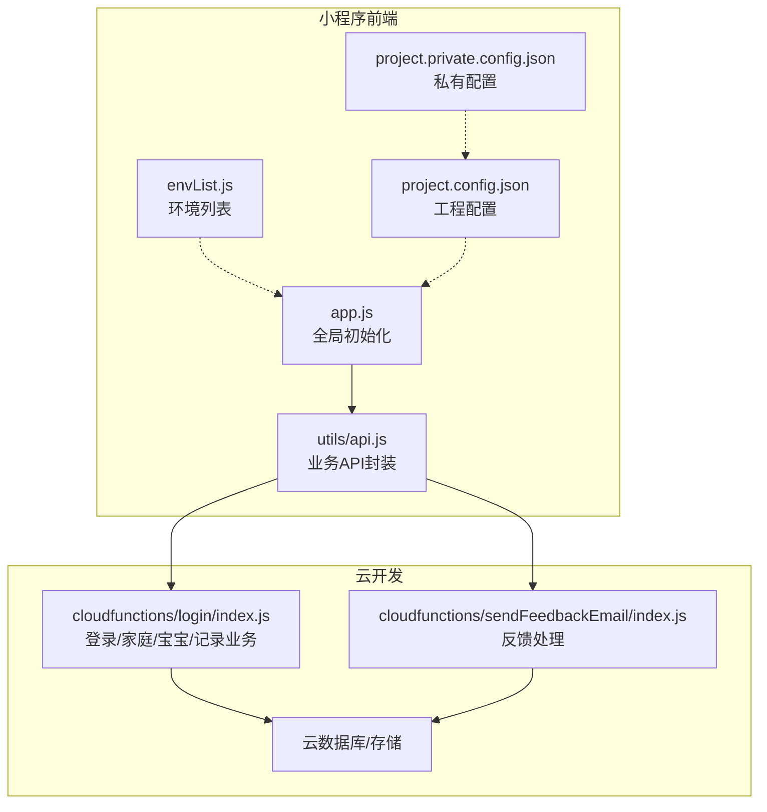
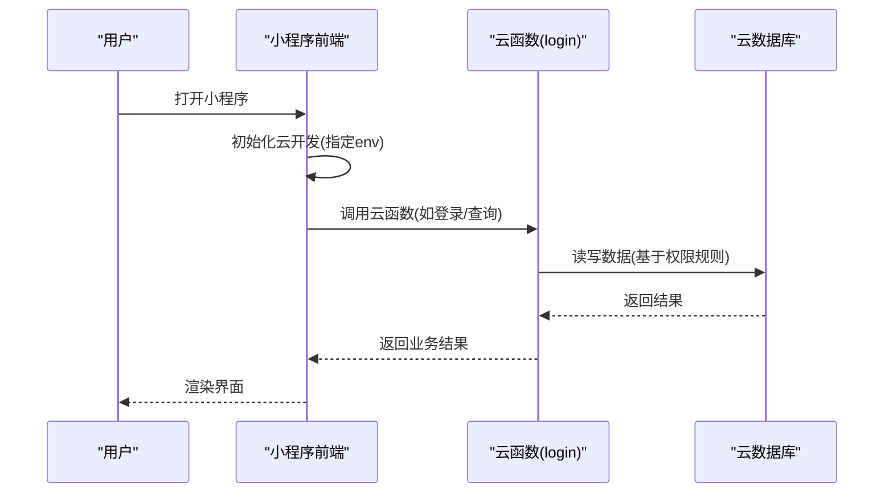
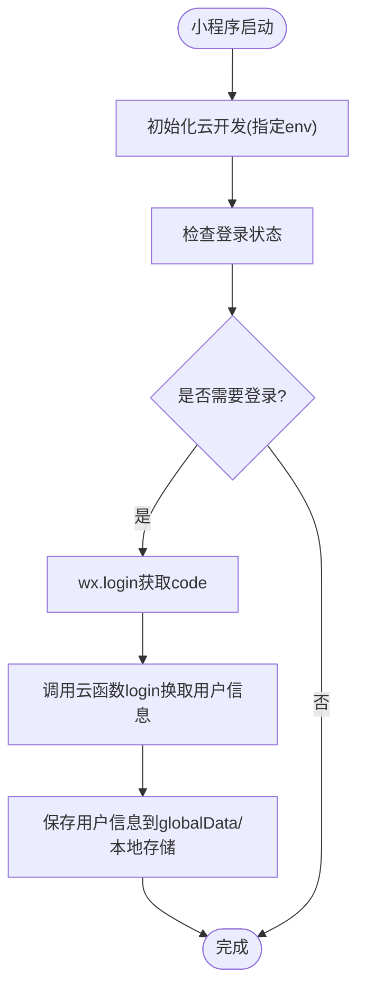
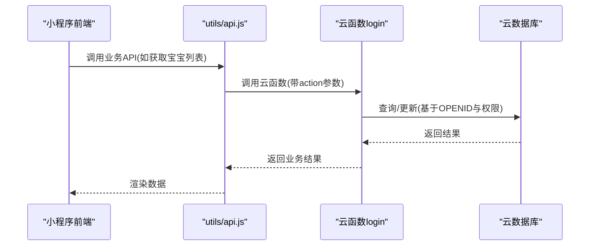
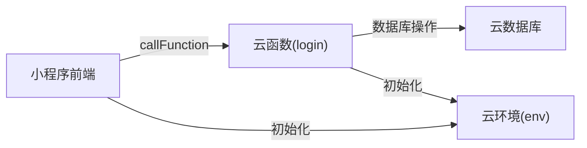

# 环境配置

<cite>
**本文引用的文件**
- [project.config.json](file://project.config.json)
- [project.private.config.json](file://project.private.config.json)
- [envList.js](file://miniprogram/envList.js)
- [app.js](file://miniprogram/app.js)
- [api.js](file://miniprogram/utils/api.js)
- [login/index.js](file://cloudfunctions/login/index.js)
- [sendFeedbackEmail/index.js](file://cloudfunctions/sendFeedbackEmail/index.js)
- [app.json](file://miniprogram/app.json)
- [index.json](file://miniprogram/pages/index/index.json)
- [package.json](file://package.json)
- [uploadCloudFunction.sh](file://uploadCloudFunction.sh)
</cite>

## 目录
1. [简介](#简介)
2. [项目结构](#项目结构)
3. [核心组件](#核心组件)
4. [架构总览](#架构总览)
5. [详细组件分析](#详细组件分析)
6. [依赖关系分析](#依赖关系分析)
7. [性能考虑](#性能考虑)
8. [故障排查指南](#故障排查指南)
9. [结论](#结论)
10. [附录](#附录)

## 简介
本指南面向“萌芽季”小程序的开发者与运维人员，系统化说明开发、测试、生产三类环境的配置方法与差异；详解项目配置文件 project.config.json 的关键参数；解释 envList.js 的作用与扩展方式；说明云开发环境变量与云函数部署流程；并提供 project.private.config.json 的私有配置管理策略与环境隔离最佳实践。

## 项目结构
该项目采用“小程序前端 + 云开发 + 云函数”的典型架构：
- 小程序前端位于 miniprogram 目录，包含页面、组件、工具函数与全局配置。
- 云函数位于 cloudfunctions 目录，提供后端逻辑与数据库访问。
- 工程级配置通过 project.config.json 与 project.private.config.json 控制编译、调试与云开发行为。
- 环境变量与环境选择通过 envList.js 与云函数初始化配置实现动态环境绑定。

图表来源
- [app.js:1-56](file://miniprogram/app.js#L1-L56)
- [api.js:1-800](file://miniprogram/utils/api.js#L1-L800)
- [envList.js:1-7](file://miniprogram/envList.js#L1-L7)
- [project.config.json:1-85](file://project.config.json#L1-L85)
- [project.private.config.json:1-25](file://project.private.config.json#L1-L25)
- [login/index.js:1-814](file://cloudfunctions/login/index.js#L1-L814)
- [sendFeedbackEmail/index.js:1-21](file://cloudfunctions/sendFeedbackEmail/index.js#L1-L21)

章节来源
- [project.config.json:1-85](file://project.config.json#L1-L85)
- [project.private.config.json:1-25](file://project.private.config.json#L1-L25)
- [app.js:1-56](file://miniprogram/app.js#L1-L56)
- [api.js:1-800](file://miniprogram/utils/api.js#L1-L800)
- [envList.js:1-7](file://miniprogram/envList.js#L1-L7)

## 核心组件
- 工程配置文件
  - project.config.json：定义小程序根目录、云函数根目录、编译选项、调试开关、打包策略、编辑器设置等。
  - project.private.config.json：私有配置覆盖层，用于本地开发调试优化与敏感项隔离。
- 环境变量与环境选择
  - envList.js：预留环境列表与平台标识，便于后续扩展多环境常量。
  - app.js：小程序启动时初始化云开发，指定云环境 ID。
- 云函数
  - login/index.js：使用动态环境初始化，承载登录、家庭、宝宝、记录等核心业务。
  - sendFeedbackEmail/index.js：使用动态环境初始化，处理反馈数据。
- 页面与全局配置
  - app.json：页面路由、导航栏、tabBar、样式等。
  - index.json：页面级配置示例。

章节来源
- [project.config.json:1-85](file://project.config.json#L1-L85)
- [project.private.config.json:1-25](file://project.private.config.json#L1-L25)
- [envList.js:1-7](file://miniprogram/envList.js#L1-L7)
- [app.js:1-56](file://miniprogram/app.js#L1-L56)
- [login/index.js:1-814](file://cloudfunctions/login/index.js#L1-L814)
- [sendFeedbackEmail/index.js:1-21](file://cloudfunctions/sendFeedbackEmail/index.js#L1-L21)
- [app.json:1-39](file://miniprogram/app.json#L1-L39)
- [index.json:1-6](file://miniprogram/pages/index/index.json#L1-L6)

## 架构总览
小程序前端通过 wx.cloud 调用云函数；云函数通过 wx-server-sdk 初始化并访问云数据库/存储。环境变量通过 DYNAMIC_CURRENT_ENV 实现按环境运行，避免硬编码。

图表来源
- [app.js:8-20](file://miniprogram/app.js#L8-L20)
- [login/index.js:4-6](file://cloudfunctions/login/index.js#L4-L6)
- [api.js:58-63](file://miniprogram/utils/api.js#L58-L63)

## 详细组件分析

### 工程配置文件 project.config.json 参数解析
- 基本路径与类型
  - miniprogramRoot/cloudfunctionRoot：小程序与云函数源码根目录。
  - compileType：编译类型为 miniprogram。
- 编译与压缩
  - es6/postcss/minified/minifyWXSS/minifyWXML：启用各类压缩与转换，提升包体效率。
  - nodeModules：关闭以减少依赖体积。
- 调试与热更新
  - urlCheck：线上校验域名。
  - compileHotReLoad：开发期可开启热重载（由私有配置控制）。
- 多帧与API
  - useMultiFrameRuntime/useApiHook/useApiHostProcess：增强运行时与API行为一致性。
- 条件启动与模板
  - condition：条件启动项（如数据库引导页）。
  - cloudfunctionTemplateRoot：云函数模板根目录。
- 打包与编辑器
  - packOptions：忽略/包含策略。
  - editorSetting：缩进与Tab大小。

章节来源
- [project.config.json:1-85](file://project.config.json#L1-L85)

### 私有配置 project.private.config.json 管理
- 覆盖优先级
  - 私有配置会覆盖同名字段，建议将本地开发偏好写入此处，避免污染公共配置。
- 开发体验优化
  - compileHotReLoad/urlCheck/coverView/skylineRenderEnable 等可按需调整，加速开发迭代。
- 安全与隔离
  - 通过私有配置隐藏本地调试相关敏感项，避免误提交。

章节来源
- [project.private.config.json:1-25](file://project.private.config.json#L1-L25)

### 环境变量与环境选择 envList.js
- 当前状态
  - envList 为空数组，isMac 为布尔值，导出供模块使用。
- 扩展建议
  - 在 envList 中按环境填充对象，包含 envId、名称、描述等字段。
  - 在 app.js 中根据 envList 与运行平台选择具体 envId，实现“开发/测试/生产”三环境自动切换。
  - 云函数侧统一使用 DYNAMIC_CURRENT_ENV，确保与小程序运行环境一致。

章节来源
- [envList.js:1-7](file://miniprogram/envList.js#L1-L7)
- [app.js:5-6](file://miniprogram/app.js#L5-L6)

### 小程序启动与云开发初始化
- 初始化流程
  - onLaunch 中检测基础库版本，初始化 wx.cloud 并指定 env。
  - 登录流程：调用 wx.login 获取临时凭证，再通过 wx.cloud.callFunction 调用云函数换取用户信息并持久化。
- 权限与安全
  - 云函数内部通过 wxContext.OPENID 识别用户身份，结合数据库权限规则进行细粒度控制。

图表来源
- [app.js:8-26](file://miniprogram/app.js#L8-L26)
- [app.js:29-54](file://miniprogram/app.js#L29-L54)

章节来源
- [app.js:1-56](file://miniprogram/app.js#L1-L56)

### 云函数与数据库访问
- 动态环境绑定
  - 云函数初始化时使用 DYNAMIC_CURRENT_ENV，确保与小程序运行环境一致。
- 业务职责
  - login/index.js：登录、家庭管理、宝宝管理、记录管理、权限控制、邀请码等。
  - sendFeedbackEmail/index.js：接收反馈数据并返回处理结果。
- 数据访问模式
  - 前端直接访问数据库受限时，通过云函数封装调用，统一鉴权与事务控制。

图表来源
- [api.js:58-63](file://miniprogram/utils/api.js#L58-L63)
- [login/index.js:22-48](file://cloudfunctions/login/index.js#L22-L48)

章节来源
- [login/index.js:1-814](file://cloudfunctions/login/index.js#L1-L814)
- [sendFeedbackEmail/index.js:1-21](file://cloudfunctions/sendFeedbackEmail/index.js#L1-L21)
- [api.js:1-800](file://miniprogram/utils/api.js#L1-L800)

### 页面与全局配置
- app.json：定义页面路由、导航栏与 tabBar 样式，以及 sitemap 位置。
- index.json：页面级配置示例，展示 usingComponents 与导航栏标题等。

章节来源
- [app.json:1-39](file://miniprogram/app.json#L1-L39)
- [index.json:1-6](file://miniprogram/pages/index/index.json#L1-L6)

### 云函数部署脚本
- uploadCloudFunction.sh：提供云函数部署命令模板，支持指定环境 ID 与项目路径。
- 建议
  - 在 CI/CD 中注入环境 ID 与项目路径，实现自动化部署。
  - 结合云函数环境变量管理，确保不同环境的配置隔离。

章节来源
- [uploadCloudFunction.sh:1-1](file://uploadCloudFunction.sh#L1-L1)

## 依赖关系分析
- 小程序前端对云函数的依赖：通过 wx.cloud.callFunction 发起请求，云函数负责业务与数据访问。
- 云函数对数据库的依赖：通过 wx-server-sdk 初始化，使用数据库命令与事务。
- 环境耦合点：小程序与云函数均通过 env/DYNAMIC_CURRENT_ENV 绑定同一云环境，保证数据与权限一致。

图表来源
- [app.js:12-16](file://miniprogram/app.js#L12-L16)
- [login/index.js:4-6](file://cloudfunctions/login/index.js#L4-L6)

章节来源
- [app.js:1-56](file://miniprogram/app.js#L1-L56)
- [login/index.js:1-814](file://cloudfunctions/login/index.js#L1-L814)

## 性能考虑
- 包体优化
  - 启用 minified/minifyWXSS/minifyWXML，减少传输与解析开销。
  - 关闭 nodeModules，避免引入不必要的依赖。
- 运行时优化
  - useMultiFrameRuntime/useApiHook/useApiHostProcess 提升稳定性与兼容性。
- 云函数性能
  - 使用事务与批量操作减少往返次数。
  - 对高频接口进行缓存与分页，降低数据库压力。

## 故障排查指南
- 云开发初始化失败
  - 检查 app.js 中 env 是否正确，确认云开发环境 ID 有效。
  - 确认基础库版本满足 wx.cloud 要求。
- 云函数调用异常
  - 检查云函数初始化是否使用 DYNAMIC_CURRENT_ENV。
  - 核对权限规则与 OPENID 校验逻辑。
- 私有配置冲突
  - 确认 project.private.config.json 仅覆盖必要字段，避免与公共配置产生歧义。
- 环境切换问题
  - 若使用 envList.js，请确保在 app.js 中正确选择 envId，并与云函数环境保持一致。

章节来源
- [app.js:8-20](file://miniprogram/app.js#L8-L20)
- [login/index.js:4-6](file://cloudfunctions/login/index.js#L4-L6)
- [project.private.config.json:1-25](file://project.private.config.json#L1-L25)

## 结论
通过 project.config.json 与 project.private.config.json 的合理配置、envList.js 的环境抽象、以及云函数的动态环境绑定，可以实现开发、测试、生产三环境的清晰隔离与高效协作。建议在团队内固化环境变量管理流程与部署脚本，持续完善权限规则与日志监控，保障系统稳定与安全。

## 附录

### 开发/测试/生产环境配置清单
- 开发环境
  - project.private.config.json：开启 compileHotReLoad，关闭 urlCheck，便于本地联调。
  - envList.js：填充开发环境 envId，app.js 中按平台选择。
  - 云函数：使用开发环境 ID，开启详细日志。
- 测试环境
  - project.config.json：启用压缩与站点地图校验。
  - envList.js：填充测试环境 envId。
  - 云函数：使用测试环境 ID，开启必要的安全规则。
- 生产环境
  - project.config.json：严格开启 urlCheck、minified、minifyWXSS/WXML。
  - envList.js：填充生产环境 envId。
  - 云函数：使用生产环境 ID，严格限制权限与超时。

### 环境切换最佳实践
- 统一管理
  - 将 envList.js 作为唯一环境来源，app.js 与云函数均从该列表读取。
- 自动化
  - 在 CI/CD 中注入环境 ID，避免手工修改配置。
- 安全
  - 私有配置与环境变量分离，敏感信息仅保留在私有配置与云函数环境变量中。
- 验收
  - 每次发布前核对环境 ID 与权限规则，确保数据隔离与访问控制生效。