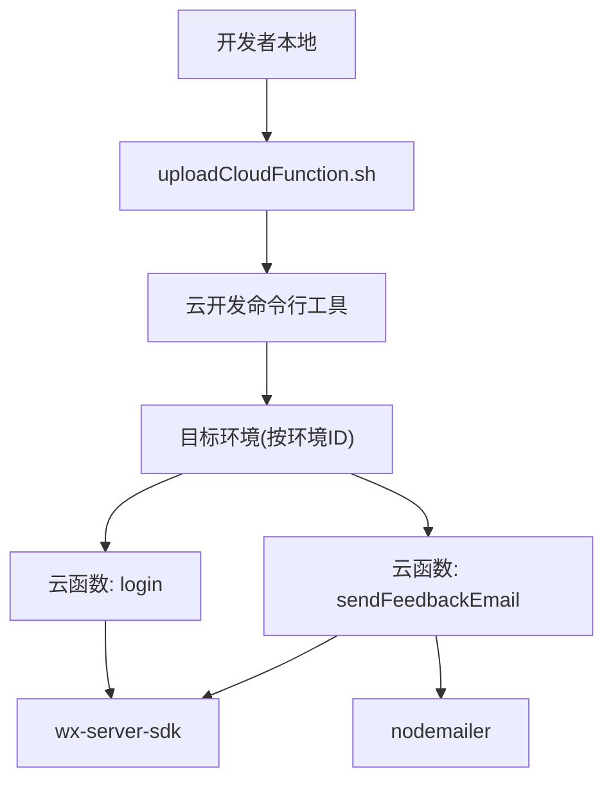
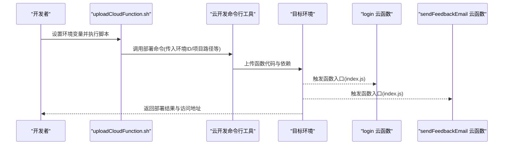
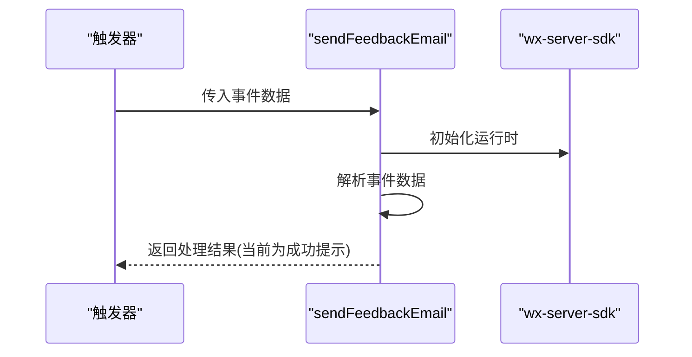
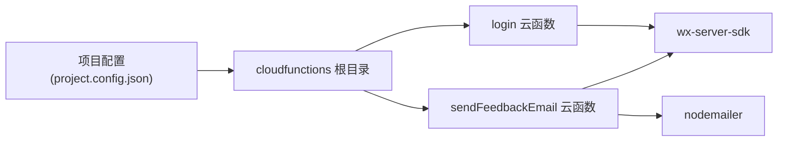

# 自动化部署

<cite>
**本文引用的文件**
- [uploadCloudFunction.sh](file://uploadCloudFunction.sh)
- [login/package.json](file://cloudfunctions/login/package.json)
- [login/index.js](file://cloudfunctions/login/index.js)
- [sendFeedbackEmail/package.json](file://cloudfunctions/sendFeedbackEmail/package.json)
- [sendFeedbackEmail/index.js](file://cloudfunctions/sendFeedbackEmail/index.js)
- [项目配置.json](file://project.config.json)
- [小程序环境配置.js](file://miniprogram/envList.js)
- [根级 package.json](file://package.json)
</cite>

## 目录
1. [简介](#简介)
2. [项目结构](#项目结构)
3. [核心组件](#核心组件)
4. [架构总览](#架构总览)
5. [详细组件分析](#详细组件分析)
6. [依赖关系分析](#依赖关系分析)
7. [性能考虑](#性能考虑)
8. [故障排查指南](#故障排查指南)
9. [结论](#结论)
10. [附录](#附录)

## 简介
本指南面向“萌芽季”小程序的云函数自动化部署场景，聚焦于 uploadCloudFunction.sh 脚本的使用与参数说明、云函数打包与上传流程（以 login 与 sendFeedbackEmail 为例）、依赖管理策略、部署前检查清单以及常见失败原因与解决方案。文档同时给出增量更新与全量部署的差异说明，帮助团队在不同阶段选择合适的部署策略。

## 项目结构
- 云函数位于 cloudfunctions 目录下，每个函数独立目录包含入口文件与依赖描述文件。
- 小程序前端位于 miniprogram 目录，项目配置通过 project.config.json 指定云函数根目录。
- 顶层脚本 uploadCloudFunction.sh 提供一键部署入口，需结合环境变量完成实际部署。

图表来源
- [uploadCloudFunction.sh:1-1](file://uploadCloudFunction.sh#L1-L1)
- [login/package.json:1-16](file://cloudfunctions/login/package.json#L1-L16)
- [sendFeedbackEmail/package.json:1-16](file://cloudfunctions/sendFeedbackEmail/package.json#L1-L16)

章节来源
- [uploadCloudFunction.sh:1-1](file://uploadCloudFunction.sh#L1-L1)
- [项目配置.json:1-85](file://project.config.json#L1-L85)

## 核心组件
- uploadCloudFunction.sh：封装云函数部署命令，通过环境变量注入目标环境、项目路径等参数。
- login 云函数：实现微信登录态校验、家庭与宝宝数据查询、成员权限管理、邀请码创建与清理等业务逻辑。
- sendFeedbackEmail 云函数：接收反馈事件，当前返回成功提示，后续可接入邮件发送。
- 依赖管理：各云函数目录内包含 package.json，声明运行时依赖；根级 package.json 描述项目元信息。

章节来源
- [uploadCloudFunction.sh:1-1](file://uploadCloudFunction.sh#L1-L1)
- [login/package.json:1-16](file://cloudfunctions/login/package.json#L1-L16)
- [sendFeedbackEmail/package.json:1-16](file://cloudfunctions/sendFeedbackEmail/package.json#L1-L16)
- [根级 package.json:1-22](file://package.json#L1-L22)

## 架构总览
云函数部署采用“脚本驱动 + 命令行工具”的方式，将本地函数代码与依赖打包后上传至指定环境。login 与 sendFeedbackEmail 分别对应不同的业务域，前者侧重用户与家庭数据，后者用于反馈处理。

图表来源
- [uploadCloudFunction.sh:1-1](file://uploadCloudFunction.sh#L1-L1)
- [login/index.js:1-814](file://cloudfunctions/login/index.js#L1-L814)
- [sendFeedbackEmail/index.js:1-21](file://cloudfunctions/sendFeedbackEmail/index.js#L1-L21)

## 详细组件分析

### uploadCloudFunction.sh 使用指南
- 命令行参数
  - --e 或 -e：目标环境ID（envId），用于定位部署目标环境。
  - --n 或 -n：函数集合名称（quickstartFunctions），用于标识本次批量部署的函数组。
  - --r 或 -r：递归模式（recursive），表示对函数根目录下的所有子目录进行扫描与部署。
  - --project 或 -p：项目路径（projectPath），指向小程序工程根目录。
- 执行流程
  - 脚本调用云开发命令行工具，按上述参数解析并执行部署。
  - 该脚本本身不包含安装路径变量，需在调用前确保命令行工具可用或通过安装路径变量显式指定。
- 增量 vs 全量
  - 增量更新：仅上传变更内容，适合日常迭代与热修复。
  - 全量部署：重新上传全部函数与依赖，适合初始化或大规模重构。
  - 本脚本未显式区分两者，具体行为由命令行工具根据函数根路径与递归开关决定。

章节来源
- [uploadCloudFunction.sh:1-1](file://uploadCloudFunction.sh#L1-L1)

### login 云函数
- 功能概览
  - 微信登录态校验与用户信息维护。
  - 家庭与宝宝数据查询、排序与过滤。
  - 成员权限管理（创建者、一级助教、二级助教）。
  - 邀请码创建、使用与过期清理。
  - 事务性删除宝宝及其关联记录。
- 依赖
  - wx-server-sdk：微信云开发SDK，提供数据库、云函数上下文等能力。
- 数据流
  - 读取微信上下文，解析事件参数，调用数据库接口，返回结构化结果。

```mermaid
flowchart TD
Start(["函数入口"]) --> GetCtx["获取微信上下文"]
GetCtx --> ParseEvt["解析事件参数"]
ParseEvt --> Action{"动作类型"}
Action --> |登录| Login["校验/创建用户并更新登录时间"]
Action --> |查询家庭| QueryFamilies["查询用户所在家庭并排序"]
Action --> |查询宝宝| QueryBabies["查询宝宝并按家庭顺序排序"]
Action --> |创建家庭| CreateFamily["校验限制并创建家庭"]
Action --> |更新家庭名称| UpdateFamilyName["权限校验后更新名称"]
Action --> |更新成员权限| UpdateMemberPerm["权限校验后更新成员权限"]
Action --> |移除成员| RemoveMember["权限校验后移除成员"]
Action --> |加入家庭| JoinFamily["校验邀请码并加入家庭"]
Action --> |退出/解散家庭| LeaveOrDeleteFamily["根据是否创建者执行退出或删除"]
Action --> |更新成员信息| UpdateMemberInfo["更新当前成员信息并同步到其他家庭"]
Action --> |删除宝宝| DeleteBaby["事务性删除宝宝及关联记录"]
Action --> |删除记录| DeleteRecord["权限校验后删除记录"]
Action --> |查询宝宝详情| GetBabyById["校验权限后返回宝宝信息"]
Action --> |查询记录| GetRecordsByBabyId["校验权限后返回记录列表"]
Action --> |查询单条记录| GetRecordById["校验权限后返回记录详情"]
Action --> |查询家庭详情| GetFamilyById["校验成员身份后返回家庭信息"]
Action --> |创建邀请码| CreateInviteCode["生成并存储邀请码"]
Action --> |更新宝宝姓名| UpdateBabyName["权限校验后更新姓名"]
Action --> |清理过期邀请码| CleanExpiredInviteCodes["异步清理过期邀请码"]
Login --> End(["返回结果"])
QueryFamilies --> End
QueryBabies --> End
CreateFamily --> End
UpdateFamilyName --> End
UpdateMemberPerm --> End
RemoveMember --> End
JoinFamily --> End
LeaveOrDeleteFamily --> End
UpdateMemberInfo --> End
DeleteBaby --> End
DeleteRecord --> End
GetBabyById --> End
GetRecordsByBabyId --> End
GetRecordById --> End
GetFamilyById --> End
CreateInviteCode --> End
UpdateBabyName --> End
CleanExpiredInviteCodes --> End
```

图表来源
- [login/index.js:1-814](file://cloudfunctions/login/index.js#L1-L814)

章节来源
- [login/index.js:1-814](file://cloudfunctions/login/index.js#L1-L814)
- [login/package.json:1-16](file://cloudfunctions/login/package.json#L1-L16)

### sendFeedbackEmail 云函数
- 功能概览
  - 接收触发器事件中的反馈数据，当前返回成功提示，便于后续扩展邮件发送功能。
- 依赖
  - wx-server-sdk：云函数运行时SDK。
  - nodemailer：邮件发送依赖（当前未启用，保留以便后续集成）。

图表来源
- [sendFeedbackEmail/index.js:1-21](file://cloudfunctions/sendFeedbackEmail/index.js#L1-L21)
- [sendFeedbackEmail/package.json:1-16](file://cloudfunctions/sendFeedbackEmail/package.json#L1-L16)

章节来源
- [sendFeedbackEmail/index.js:1-21](file://cloudfunctions/sendFeedbackEmail/index.js#L1-L21)
- [sendFeedbackEmail/package.json:1-16](file://cloudfunctions/sendFeedbackEmail/package.json#L1-L16)

## 依赖关系分析
- 云函数与SDK
  - login 与 sendFeedbackEmail 均依赖 wx-server-sdk，用于数据库操作与云函数上下文。
  - sendFeedbackEmail 还声明了 nodemailer，便于未来邮件发送。
- 项目配置
  - project.config.json 指定云函数根目录为 cloudfunctions，确保IDE与命令行工具正确识别函数位置。
- 顶层依赖
  - 根级 package.json 描述项目元信息，不影响云函数依赖安装，但建议保持一致的模块系统与运行时配置。

图表来源
- [login/package.json:1-16](file://cloudfunctions/login/package.json#L1-L16)
- [sendFeedbackEmail/package.json:1-16](file://cloudfunctions/sendFeedbackEmail/package.json#L1-L16)
- [项目配置.json:1-85](file://project.config.json#L1-L85)

章节来源
- [login/package.json:1-16](file://cloudfunctions/login/package.json#L1-L16)
- [sendFeedbackEmail/package.json:1-16](file://cloudfunctions/sendFeedbackEmail/package.json#L1-L16)
- [项目配置.json:1-85](file://project.config.json#L1-L85)
- [根级 package.json:1-22](file://package.json#L1-L22)

## 性能考虑
- 代码体积与冷启动
  - 控制依赖数量与体积，避免一次性引入过多第三方包，减少冷启动时间。
- 数据库查询优化
  - 对高频查询添加索引与条件过滤，降低查询耗时。
- 事务与幂等
  - 关键写操作采用事务保证一致性，确保幂等性以支持重试。
- 并发与限流
  - 在高并发场景下，合理设置函数超时与并发上限，避免资源争用。

## 故障排查指南
- 常见失败原因
  - 环境变量缺失：未正确设置环境ID或项目路径，导致命令行工具无法定位目标。
  - 依赖安装失败：网络问题或依赖版本不兼容导致安装中断。
  - 权限不足：函数运行时缺少数据库或存储权限。
  - 代码错误：入口函数签名不匹配或异常未捕获。
- 解决方案
  - 校验脚本参数与环境变量，确保命令行工具可用。
  - 清理缓存并重装依赖，优先使用稳定版本。
  - 检查数据库与云开发权限配置，确保函数具备必要访问权。
  - 在入口函数中增加异常捕获与日志输出，便于定位问题。
  - 对于 sendFeedbackEmail，确认 nodemailer 的配置项已在环境中正确设置后再启用发送逻辑。

章节来源
- [uploadCloudFunction.sh:1-1](file://uploadCloudFunction.sh#L1-L1)
- [sendFeedbackEmail/package.json:1-16](file://cloudfunctions/sendFeedbackEmail/package.json#L1-L16)

## 结论
通过 uploadCloudFunction.sh 统一入口与清晰的依赖管理，可以高效完成云函数的打包与上传。结合 login 与 sendFeedbackEmail 的实际案例，团队可在不同阶段灵活选择增量或全量部署策略，并依据本文提供的检查清单与故障排查建议，保障部署过程的稳定性与可追溯性。

## 附录

### 部署命令示例与参数说明
- 基本命令格式
  - 示例：设置环境变量后执行脚本
  - 参数说明
    - --e/--envId：目标环境ID
    - --n/--name：函数集合名称
    - --r/--recursive：递归扫描函数根目录
    - --project/--projectPath：项目根目录路径
- 增量更新与全量部署
  - 增量更新：仅上传变更文件，适合日常迭代。
  - 全量部署：重新上传全部函数与依赖，适合初始化或重构。

章节来源
- [uploadCloudFunction.sh:1-1](file://uploadCloudFunction.sh#L1-L1)

### 依赖管理最佳实践
- 云函数依赖
  - 在各自函数目录的 package.json 中声明依赖，避免跨函数污染。
  - 使用稳定版本或 latest，统一管理第三方包。
- 顶层依赖
  - 根级 package.json 主要用于项目元信息，不直接参与云函数依赖安装。
- 云开发配置
  - project.config.json 指定 cloudfunctionRoot 为 cloudfunctions，确保工具链正确识别函数位置。

章节来源
- [login/package.json:1-16](file://cloudfunctions/login/package.json#L1-L16)
- [sendFeedbackEmail/package.json:1-16](file://cloudfunctions/sendFeedbackEmail/package.json#L1-L16)
- [项目配置.json:1-85](file://project.config.json#L1-L85)
- [根级 package.json:1-22](file://package.json#L1-L22)

### 部署前检查清单
- 环境准备
  - 已安装并配置云开发命令行工具。
  - 已设置环境ID与项目路径等必要参数。
- 代码与依赖
  - 各云函数目录包含正确的入口文件与依赖描述文件。
  - 依赖安装成功，无版本冲突或网络异常。
- 权限与配置
  - 云开发数据库与存储权限已授权给函数运行角色。
  - 项目配置文件正确指向云函数根目录。
- 测试验证
  - 在本地或测试环境验证函数入口与关键流程。
  - 对 sendFeedbackEmail 进行功能与日志验证。

章节来源
- [项目配置.json:1-85](file://project.config.json#L1-L85)
- [小程序环境配置.js:1-7](file://miniprogram/envList.js#L1-L7)