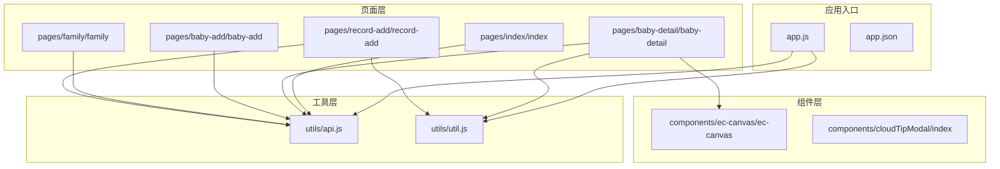
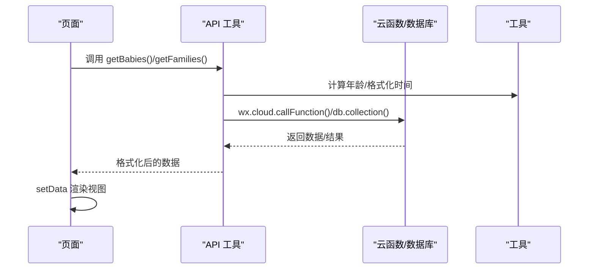
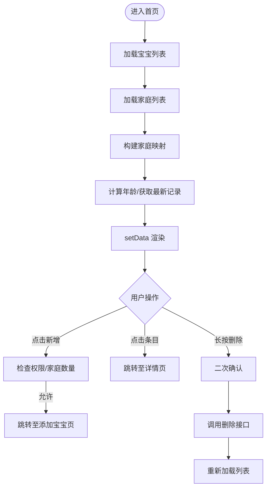
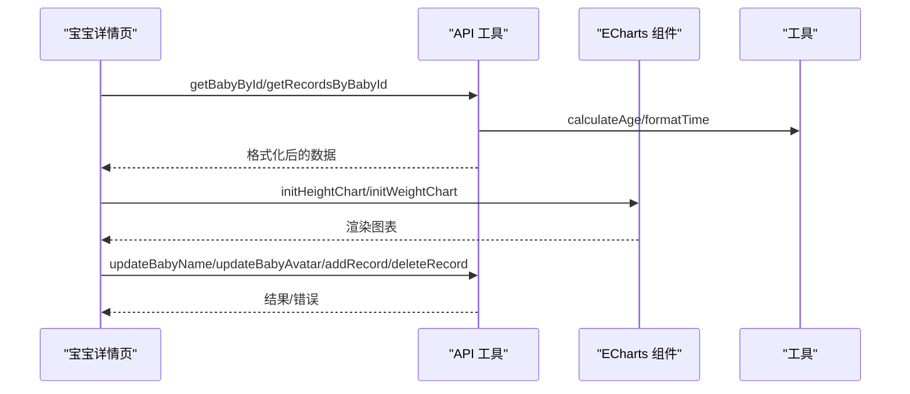
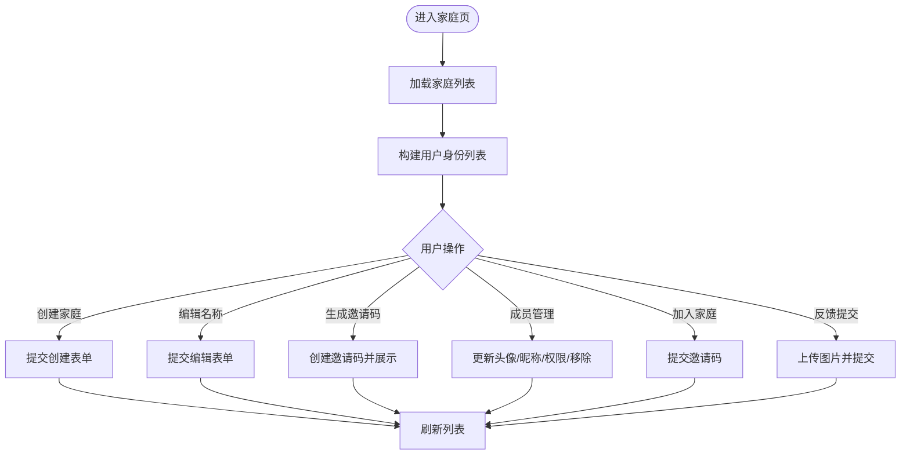
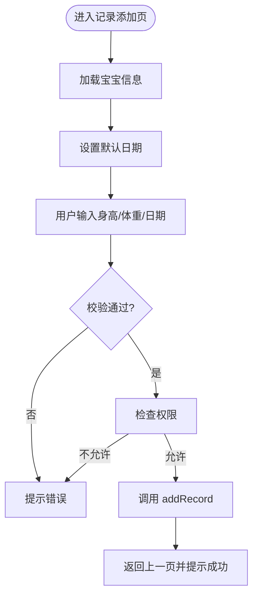
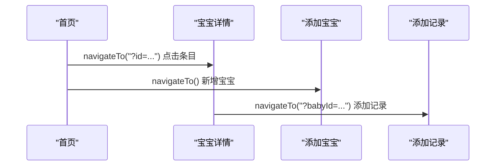
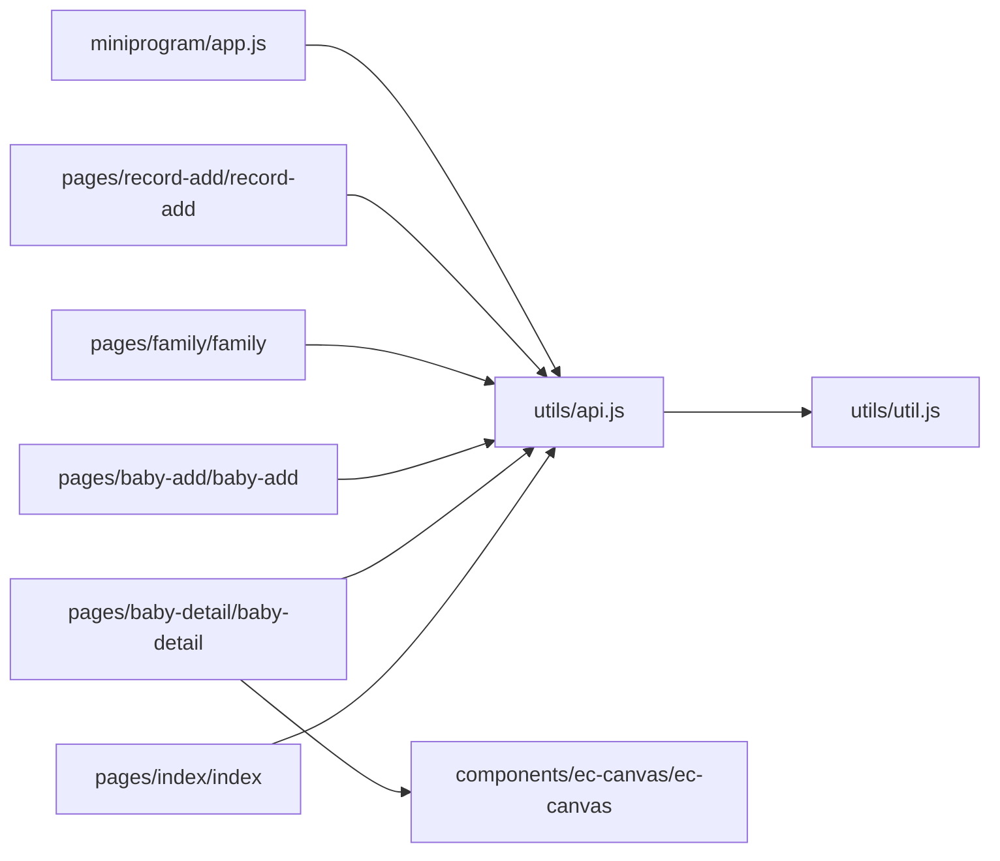

# 核心页面组件

<cite>
**本文档引用的文件**
- [app.js](file://miniprogram/app.js)
- [app.json](file://miniprogram/app.json)
- [api.js](file://miniprogram/utils/api.js)
- [util.js](file://miniprogram/utils/util.js)
- [index.js](file://miniprogram/pages/index/index.js)
- [index.json](file://miniprogram/pages/index/index.json)
- [baby-detail.js](file://miniprogram/pages/baby-detail/baby-detail.js)
- [baby-detail.json](file://miniprogram/pages/baby-detail/baby-detail.json)
- [baby-add.js](file://miniprogram/pages/baby-add/baby-add.js)
- [family.js](file://miniprogram/pages/family/family.js)
- [family.json](file://miniprogram/pages/family/family.json)
- [record-add.js](file://miniprogram/pages/record-add/record-add.js)
- [cloudTipModal/index.js](file://miniprogram/components/cloudTipModal/index.js)
- [ec-canvas.js](file://miniprogram/components/ec-canvas/ec-canvas.js)
</cite>

## 目录
1. [简介](#简介)
2. [项目结构](#项目结构)
3. [核心组件](#核心组件)
4. [架构总览](#架构总览)
5. [详细组件分析](#详细组件分析)
6. [依赖关系分析](#依赖关系分析)
7. [性能考虑](#性能考虑)
8. [故障排除指南](#故障排除指南)
9. [结论](#结论)

## 简介
本文件聚焦于微信小程序“萌芽季”的核心页面组件，系统性解析首页宝宝列表页、宝宝详情页、家庭管理页、记录添加页等主要页面的设计与实现，涵盖数据获取与处理流程、API 调用、数据格式化、状态管理、页面间导航与参数传递、权限验证、交互设计与错误处理、以及可复用策略与性能优化建议。目标是帮助开发者快速理解并高效维护这些页面。

## 项目结构
小程序采用典型的分层组织：页面层（pages）、工具层（utils）、组件层（components）、应用入口（app.js/app.json）。页面通过统一的 API 层访问云数据库与云函数，util 提供通用的时间与年龄计算工具，组件层提供图表与提示等可复用 UI。

**图表来源**
- [app.js:1-56](file://miniprogram/app.js#L1-L56)
- [app.json:1-39](file://miniprogram/app.json#L1-L39)
- [api.js:1-879](file://miniprogram/utils/api.js#L1-L879)
- [util.js:1-55](file://miniprogram/utils/util.js#L1-L55)
- [index.js:1-144](file://miniprogram/pages/index/index.js#L1-L144)
- [baby-detail.js:1-691](file://miniprogram/pages/baby-detail/baby-detail.js#L1-L691)
- [baby-add.js:1-120](file://miniprogram/pages/baby-add/baby-add.js#L1-L120)
- [family.js:1-757](file://miniprogram/pages/family/family.js#L1-L757)
- [record-add.js:1-118](file://miniprogram/pages/record-add/record-add.js#L1-L118)
- [ec-canvas.js:1-285](file://miniprogram/components/ec-canvas/ec-canvas.js#L1-L285)
- [cloudTipModal/index.js:1-29](file://miniprogram/components/cloudTipModal/index.js#L1-L29)

**章节来源**
- [app.js:1-56](file://miniprogram/app.js#L1-L56)
- [app.json:1-39](file://miniprogram/app.json#L1-L39)

## 核心组件
本节概述四个核心页面组件的职责与协作关系：
- 首页宝宝列表页：展示宝宝列表、家庭信息映射、最新记录、权限控制与批量操作入口。
- 宝宝详情页：展示宝宝基本信息、记录列表、身高/体重趋势图、头像与姓名修改、记录增删改权限校验。
- 家庭管理页：家庭创建/编辑、成员管理、邀请码生成与分享、头像/昵称批量更新、反馈提交。
- 记录添加页：基于宝宝信息计算月龄、表单校验、权限校验与记录提交。

**章节来源**
- [index.js:1-144](file://miniprogram/pages/index/index.js#L1-L144)
- [baby-detail.js:1-691](file://miniprogram/pages/baby-detail/baby-detail.js#L1-L691)
- [family.js:1-757](file://miniprogram/pages/family/family.js#L1-L757)
- [record-add.js:1-118](file://miniprogram/pages/record-add/record-add.js#L1-L118)

## 架构总览
整体采用“页面 → API 工具 → 云数据库/云函数”的分层架构。页面通过 API 工具封装对云服务的访问，统一处理登录态、权限校验与错误提示；工具层提供通用的日期与年龄计算；组件层提供图表与提示等可复用 UI。

**图表来源**
- [api.js:1-879](file://miniprogram/utils/api.js#L1-L879)
- [util.js:1-55](file://miniprogram/utils/util.js#L1-L55)
- [index.js:1-144](file://miniprogram/pages/index/index.js#L1-L144)
- [baby-detail.js:1-691](file://miniprogram/pages/baby-detail/baby-detail.js#L1-L691)

## 详细组件分析

### 首页宝宝列表页（pages/index/index）
- 数据获取与处理
  - 在页面显示时拉取宝宝列表与家庭列表，构建家庭名称与颜色索引映射。
  - 对每个宝宝计算年龄字符串与最新记录，合并到展示数据中。
- 权限与导航
  - 新增宝宝前检查用户是否为一级助教、所在家庭数量限制。
  - 点击条目跳转至详情页，长按删除时二次确认并调用删除接口。
- 错误处理
  - 异常时统一提示“加载失败，请重试”。

**图表来源**
- [index.js:1-144](file://miniprogram/pages/index/index.js#L1-L144)
- [api.js:1-879](file://miniprogram/utils/api.js#L1-L879)

**章节来源**
- [index.js:1-144](file://miniprogram/pages/index/index.js#L1-L144)
- [index.json:1-6](file://miniprogram/pages/index/index.json#L1-L6)

### 宝宝详情页（pages/baby-detail/baby-detail）
- 数据获取与处理
  - 通过路由参数获取宝宝 ID，拉取宝宝信息、家庭名称、记录列表并格式化日期与年龄。
  - 支持切换“记录/身高/体重”标签页，懒加载图表组件。
- 图表实现
  - 使用自定义组件 ec-canvas 初始化 ECharts，按宝宝性别选择身高/体重标准曲线，动态计算缩放窗口。
- 权限与交互
  - 修改姓名/头像仅允许一级助教；添加记录允许一级/二级助教；删除记录根据角色与记录归属判定。
- 错误处理
  - 未找到宝宝时提示并回退；异常统一提示“加载失败，请重试”。

**图表来源**
- [baby-detail.js:1-691](file://miniprogram/pages/baby-detail/baby-detail.js#L1-L691)
- [api.js:1-879](file://miniprogram/utils/api.js#L1-L879)
- [util.js:1-55](file://miniprogram/utils/util.js#L1-L55)
- [ec-canvas.js:1-285](file://miniprogram/components/ec-canvas/ec-canvas.js#L1-L285)

**章节来源**
- [baby-detail.js:1-691](file://miniprogram/pages/baby-detail/baby-detail.js#L1-L691)
- [baby-detail.json:1-8](file://miniprogram/pages/baby-detail/baby-detail.json#L1-L8)

### 家庭管理页（pages/family/family）
- 功能概览
  - 创建家庭、编辑家庭名称、退出家庭、生成邀请码并支持分享、成员头像/昵称批量更新、成员权限变更与移除、加入家庭、反馈提交（含图片上传与邮件通知）。
- 权限与身份
  - 根据用户在各家庭中的成员身份（一级助教/二级助教/围观）展示不同操作按钮与能力。
- 错误处理
  - 统一提示“加载失败，请重试”等。

**图表来源**
- [family.js:1-757](file://miniprogram/pages/family/family.js#L1-L757)
- [api.js:1-879](file://miniprogram/utils/api.js#L1-L879)

**章节来源**
- [family.js:1-757](file://miniprogram/pages/family/family.js#L1-L757)
- [family.json:1-5](file://miniprogram/pages/family/family.json#L1-L5)

### 记录添加页（pages/record-add/record-add）
- 表单与校验
  - 自动填充当前日期，根据出生日期与录入日期计算月龄，禁止早于出生日期。
  - 校验身高/体重数值有效性与必填项。
- 权限与提交
  - 仅一级/二级助教可添加记录；提交后返回上一页并提示成功。

**图表来源**
- [record-add.js:1-118](file://miniprogram/pages/record-add/record-add.js#L1-L118)
- [api.js:1-879](file://miniprogram/utils/api.js#L1-L879)
- [util.js:1-55](file://miniprogram/utils/util.js#L1-L55)

**章节来源**
- [record-add.js:1-118](file://miniprogram/pages/record-add/record-add.js#L1-L118)

### 页面间导航与参数传递
- 首页 → 宝宝详情：通过 navigateTo 传递 id 参数。
- 首页 → 添加宝宝：根据权限与家庭数量判断后跳转。
- 宝宝详情 → 添加记录：通过 navigateTo 传递 babyId 参数。
- 家庭页 → 分享邀请码：通过 onShareAppMessage 返回带 inviteCode 的路径。

**图表来源**
- [index.js:1-144](file://miniprogram/pages/index/index.js#L1-L144)
- [baby-detail.js:1-691](file://miniprogram/pages/baby-detail/baby-detail.js#L1-L691)
- [record-add.js:1-118](file://miniprogram/pages/record-add/record-add.js#L1-L118)

## 依赖关系分析
- 页面依赖 API 工具：所有页面均通过 utils/api.js 进行数据访问与业务操作。
- API 工具依赖工具层：使用 utils/util.js 进行日期与年龄计算。
- 宝宝详情页依赖图表组件：通过 components/ec-canvas/ec-canvas.js 初始化 ECharts。
- 应用层负责登录态与环境初始化：miniprogram/app.js 负责 wx.cloud 初始化与登录流程。

**图表来源**
- [index.js:1-144](file://miniprogram/pages/index/index.js#L1-L144)
- [baby-detail.js:1-691](file://miniprogram/pages/baby-detail/baby-detail.js#L1-L691)
- [baby-add.js:1-120](file://miniprogram/pages/baby-add/baby-add.js#L1-L120)
- [family.js:1-757](file://miniprogram/pages/family/family.js#L1-L757)
- [record-add.js:1-118](file://miniprogram/pages/record-add/record-add.js#L1-L118)
- [api.js:1-879](file://miniprogram/utils/api.js#L1-L879)
- [util.js:1-55](file://miniprogram/utils/util.js#L1-L55)
- [ec-canvas.js:1-285](file://miniprogram/components/ec-canvas/ec-canvas.js#L1-L285)
- [app.js:1-56](file://miniprogram/app.js#L1-L56)

**章节来源**
- [api.js:1-879](file://miniprogram/utils/api.js#L1-L879)
- [util.js:1-55](file://miniprogram/utils/util.js#L1-L55)
- [ec-canvas.js:1-285](file://miniprogram/components/ec-canvas/ec-canvas.js#L1-L285)
- [app.js:1-56](file://miniprogram/app.js#L1-L56)

## 性能考虑
- 图表懒加载：宝宝详情页在切换到“身高/体重”标签后再初始化图表，减少首屏渲染压力。
- 数据预处理：首页一次性拉取家庭列表并建立映射，避免多次查询。
- 登录态等待：API 工具提供 waitForLogin，避免并发场景下的空 openid 导致的重复请求。
- 云函数封装：敏感操作（如删除、更新）通过云函数执行，减少前端直接访问数据库的风险与复杂度。

[本节为通用性能建议，无需特定文件引用]

## 故障排除指南
- 登录失败/超时
  - 现象：waitForLogin 超时或回调失败。
  - 排查：确认 wx.cloud 初始化与网络状态；检查云函数 login 是否正常返回。
- 权限不足
  - 现象：提示“只有一级助教/二级助教”或“没有删除权限”。
  - 排查：确认用户在家庭中的成员身份；检查 checkPermission 的调用与返回值。
- 数据为空/未找到
  - 现象：提示“加载失败，请重试”或“未找到宝宝信息”。
  - 排查：确认数据库中是否存在对应记录；检查云函数返回值。
- 图表不显示
  - 现象：切换到图表页无数据。
  - 排查：确认 ec-canvas 组件初始化回调是否执行；检查 records 数据是否按时间排序。

**章节来源**
- [api.js:1-879](file://miniprogram/utils/api.js#L1-L879)
- [baby-detail.js:1-691](file://miniprogram/pages/baby-detail/baby-detail.js#L1-L691)

## 结论
本项目通过清晰的分层架构与统一的 API 工具，实现了首页、详情页、家庭页与记录页的高内聚低耦合设计。权限体系与云函数封装保障了数据安全与一致性，图表组件提升了可视化体验。建议后续在以下方面持续优化：进一步抽取公共逻辑（如权限校验、加载状态）、增强错误边界与重试机制、引入缓存策略以提升离线/弱网体验。