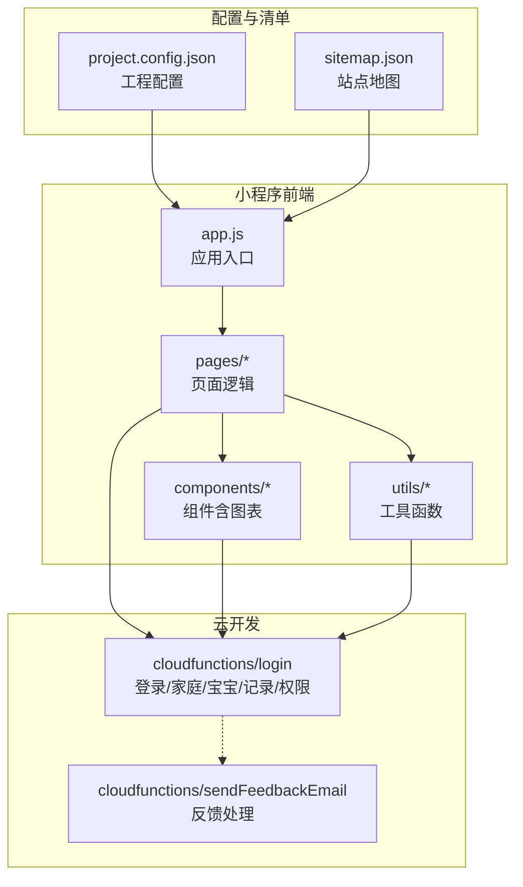
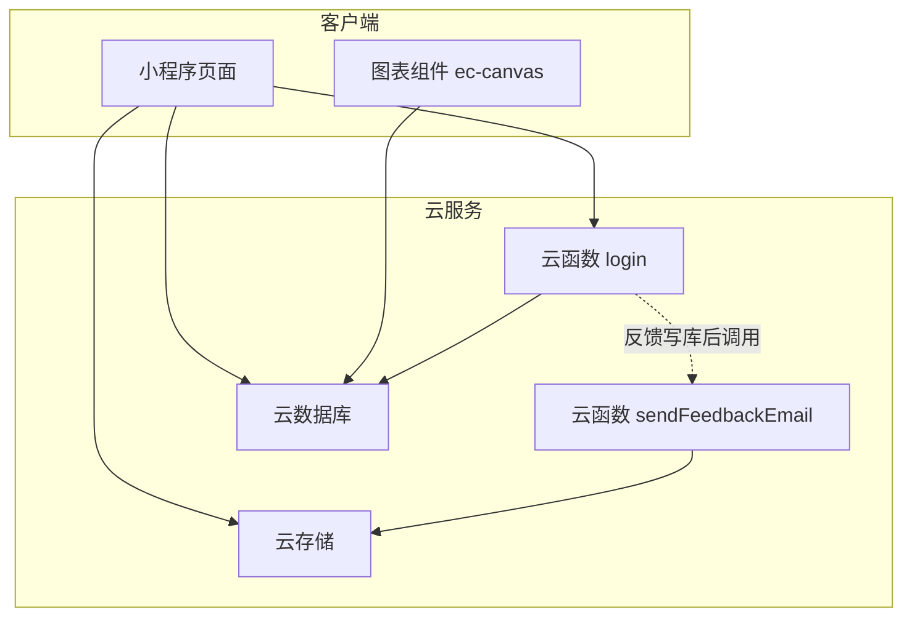
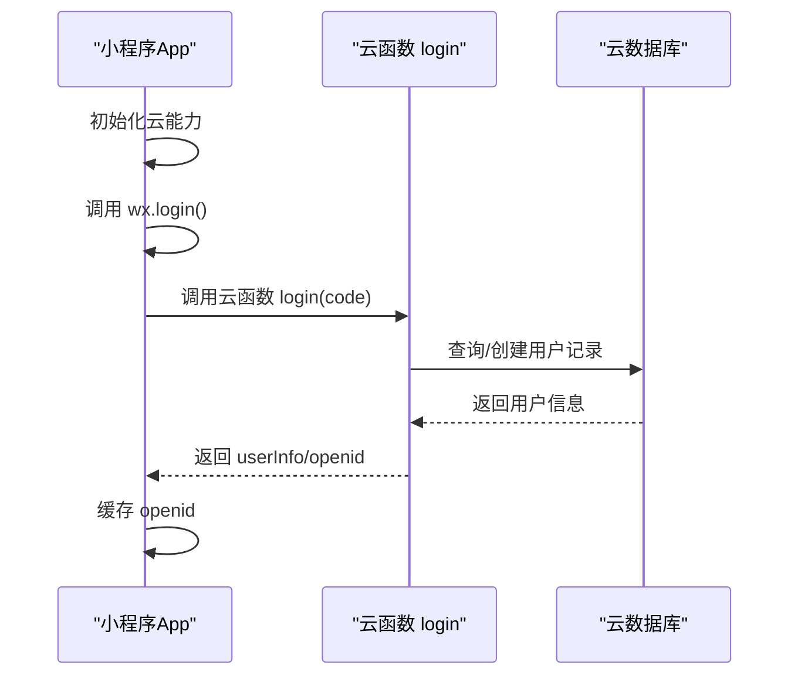
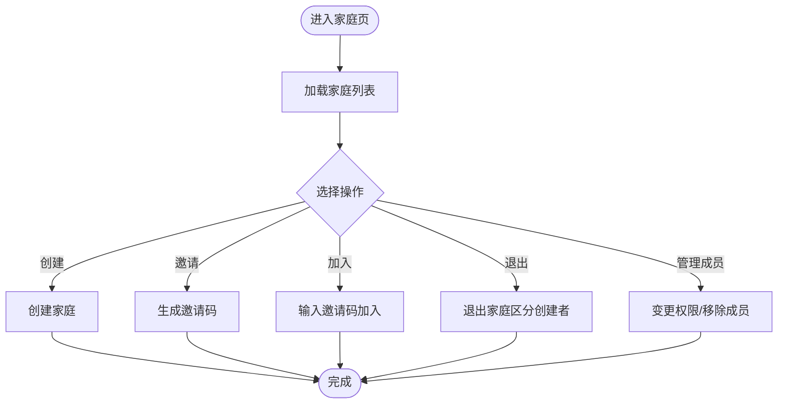
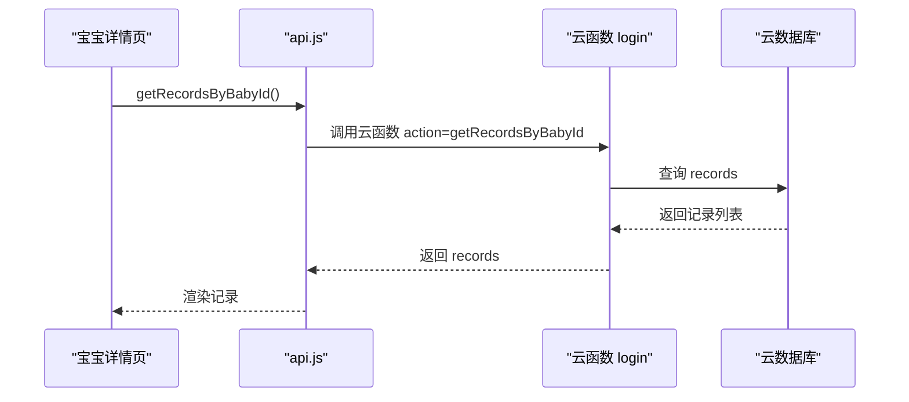
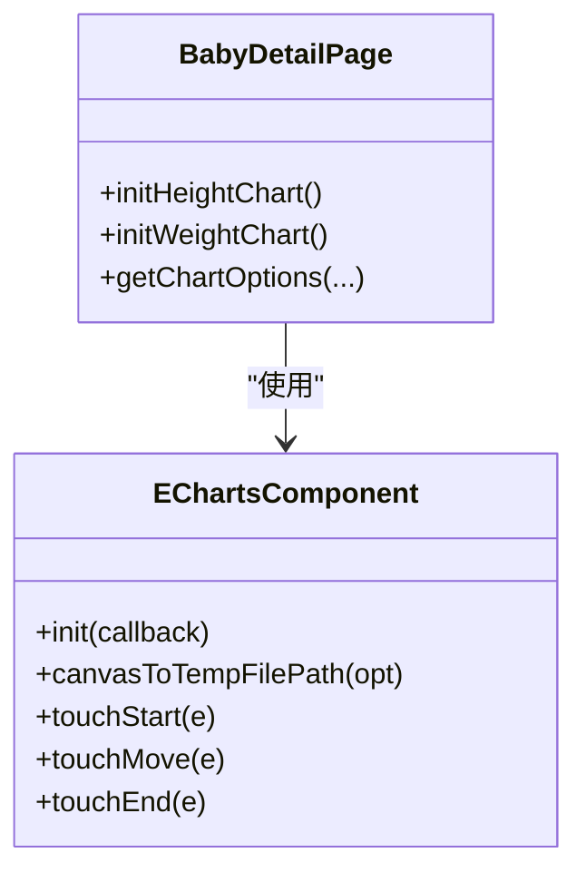
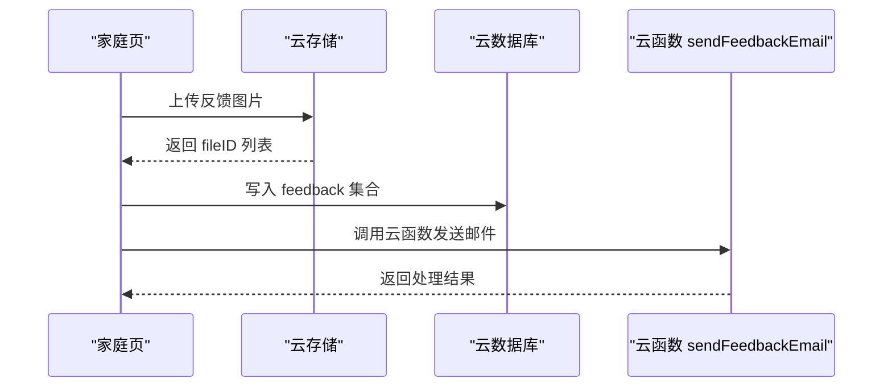
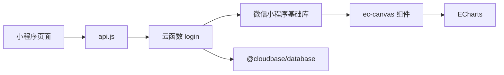

# 项目概述

<cite>
**本文档引用的文件**
- [miniprogram/app.js](file://miniprogram/app.js)
- [miniprogram/app.json](file://miniprogram/app.json)
- [cloudfunctions/login/index.js](file://cloudfunctions/login/index.js)
- [cloudfunctions/sendFeedbackEmail/index.js](file://cloudfunctions/sendFeedbackEmail/index.js)
- [miniprogram/utils/api.js](file://miniprogram/utils/api.js)
- [miniprogram/utils/util.js](file://miniprogram/utils/util.js)
- [miniprogram/pages/index/index.js](file://miniprogram/pages/index/index.js)
- [miniprogram/pages/baby-detail/baby-detail.js](file://miniprogram/pages/baby-detail/baby-detail.js)
- [miniprogram/components/ec-canvas/ec-canvas.js](file://miniprogram/components/ec-canvas/ec-canvas.js)
- [miniprogram/pages/baby-add/baby-add.js](file://miniprogram/pages/baby-add/baby-add.js)
- [miniprogram/pages/record-add/record-add.js](file://miniprogram/pages/record-add/record-add.js)
- [miniprogram/pages/family/family.js](file://miniprogram/pages/family/family.js)
- [project.config.json](file://project.config.json)
- [package.json](file://package.json)
- [miniprogram/sitemap.json](file://miniprogram/sitemap.json)
</cite>

## 目录
1. [简介](#简介)
2. [项目结构](#项目结构)
3. [核心组件](#核心组件)
4. [架构总览](#架构总览)
5. [详细组件分析](#详细组件分析)
6. [依赖关系分析](#依赖关系分析)
7. [性能考虑](#性能考虑)
8. [故障排查指南](#故障排查指南)
9. [结论](#结论)
10. [附录](#附录)

## 简介
“宝宝助手”是一款专为父母设计的微信小程序，帮助记录与追踪宝宝的身高、体重等成长指标，并通过科学的生长曲线进行对比分析。项目围绕“家庭协作”的理念设计，支持多家庭、多成员的协同管理；通过云端数据库与云函数实现数据安全与权限控制；前端采用 ECharts 图表库实现直观的可视化展示。

- 核心价值主张
  - 成长数据闭环：从出生记录到日常测量，形成连续的时间序列数据。
  - 科学对比：内置国家卫健委标准曲线（P3/P50/P97），支持按月龄对比分析。
  - 家庭协作：邀请码机制、角色权限（一级助教/二级助教/围观者），保障数据共享与隐私平衡。
  - 便捷操作：极简交互、权限校验、错误提示，降低使用门槛。

- 目标用户
  - 有多个宝宝的年轻父母或祖辈照护者
  - 需要长期跟踪宝宝身高体重变化的家长
  - 希望多人协作记录与查看宝宝数据的家庭成员

- 技术架构特点
  - 前端：微信小程序原生框架 + 自研组件化图表（基于 ECharts）
  - 后端：云函数 + 云数据库 + 云存储，关键业务写操作统一通过云函数鉴权
  - 数据模型：用户、家庭、宝宝、记录、邀请码、反馈等

## 版本更新

### v3.0.0 (2026-04-04)
- **心情日历功能**：全新心情评价模块，支持日历视图、心情评分、备注记录；集成 **微信同声传译（WechatSI）** 支持语音输入备注
- **自定义 TabBar**：点击切换动效，选中图标放大、文字高亮
- **性能优化**：
  - 心情页并行获取家庭和宝宝列表（Promise.all）
  - 移除不必要的缓存清除，优化页面加载速度
  - 成长记录列表支持分页
  - `ec-canvas` 图表按需初始化与最小刷新；`app.json` 配置 `lazyCodeLoading`
- **安全加固**：
  - 反馈功能收口云函数，前端不再直接写库
  - 图片上传增加大小限制（2MB）
  - 新增 safeLog 工具，生产环境安全日志
- **UI 统一**：
  - "心情日历"标题颜色与"萌芽季"保持一致
  - 掌门人图标改为绿色，权限描述字体优化
- **代码优化**：
  - 批量关注宝宝改为限并发并行调用
  - `login` 云函数新增 `action: 'submitFeedback'`（校验、限流、写 `feedback` 集合并调用 `sendFeedbackEmail`），非独立云函数
- **文档**：仓库 `wiki/` 与 [GitHub Wiki](https://github.com/zhangxin19911211-creator/Project_BabyAssistant/wiki) 保持同步，便于在线阅读

### v2.2.0 (2025-03-31)
- **UI全面升级**：宝宝卡片统一复杂背景色设计，多层渐变叠加
- **字体优化**：宝宝姓名使用站酷庆科黄油体，深珊瑚色渐变文字
- **性能优化**：移除冗余颜色计算逻辑，前端动态计算替代数据库存储
- **代码清理**：删除未使用组件(cloudTipModal)和冗余文件
- **数据库优化**：添加高频查询字段索引(creatorOpenid, createTime)

### v2.1.0 (之前版本)
- 家庭页面UI优化：丰富的header背景效果
- 多家庭身份显示：在header中展示用户在各家庭的身份
- 统一用户信息管理：在header中修改头像和用户名，同步到所有家庭
- 反馈功能：支持用户提交问题和建议

## 项目结构
项目采用“小程序端 + 云函数 + 配置”的清晰分层：
- miniprogram：小程序前端源码，包含页面、组件、工具函数与样式
- cloudfunctions：后端云函数，封装业务逻辑与数据库操作
- 项目配置：工程配置、应用清单、站点地图等

**图表来源**
- [miniprogram/app.js:1-56](file://miniprogram/app.js#L1-L56)
- [miniprogram/pages/index/index.js:1-144](file://miniprogram/pages/index/index.js#L1-L144)
- [miniprogram/components/ec-canvas/ec-canvas.js:1-285](file://miniprogram/components/ec-canvas/ec-canvas.js#L1-L285)
- [cloudfunctions/login/index.js:1-786](file://cloudfunctions/login/index.js#L1-L786)
- [cloudfunctions/sendFeedbackEmail/index.js:1-21](file://cloudfunctions/sendFeedbackEmail/index.js#L1-L21)
- [project.config.json:1-85](file://project.config.json#L1-L85)
- [miniprogram/sitemap.json:1-7](file://miniprogram/sitemap.json#L1-L7)

**章节来源**
- [project.config.json:1-85](file://project.config.json#L1-L85)
- [miniprogram/app.json:1-39](file://miniprogram/app.json#L1-L39)

## 核心组件
- 应用入口与登录
  - 初始化云能力、自动登录、持久化用户标识
- 页面模块
  - 宝宝列表页：展示家庭内宝宝、年龄与最新记录
  - 宝宝详情页：身高/体重曲线对比、增删改查记录
  - 添加宝宝/记录页：表单校验、权限控制
  - 心情页：心情日历、评分记录、备注管理、活动日志
  - 家庭页：创建/邀请/加入/退出、成员管理、反馈系统
- 组件模块
  - ec-canvas：适配微信基础库版本差异的 ECharts 渲染组件
  - custom-tab-bar：自定义底部导航栏，支持切换动效
- 工具模块
  - api.js：封装云函数调用与权限校验
  - util.js：年龄计算、格式化工具
  - safeLog.js：生产环境安全日志工具

**章节来源**
- [miniprogram/app.js:1-56](file://miniprogram/app.js#L1-L56)
- [miniprogram/utils/api.js:1-873](file://miniprogram/utils/api.js#L1-L873)
- [miniprogram/utils/util.js:1-55](file://miniprogram/utils/util.js#L1-L55)
- [miniprogram/components/ec-canvas/ec-canvas.js:1-285](file://miniprogram/components/ec-canvas/ec-canvas.js#L1-L285)

## 架构总览
整体采用“前端页面 + 云函数 + 云数据库/存储”的三层架构。前端负责交互与展示，云函数负责业务编排与权限校验，云数据库提供结构化数据存储，云存储用于图片等资源。

说明：反馈内容写库仅由 `login`（`submitFeedback`）完成；前端可直连云存储上传 `feedback/` 图片后再把 `fileID` 传给 `submitFeedback`。其它业务库表仍以 `login` 各 `action` 为主。

**图表来源**
- [cloudfunctions/login/index.js:1-786](file://cloudfunctions/login/index.js#L1-L786)
- [cloudfunctions/sendFeedbackEmail/index.js:1-21](file://cloudfunctions/sendFeedbackEmail/index.js#L1-L21)
- [miniprogram/pages/baby-detail/baby-detail.js:1-691](file://miniprogram/pages/baby-detail/baby-detail.js#L1-L691)
- [miniprogram/pages/family/family.js:1-747](file://miniprogram/pages/family/family.js#L1-L747)

## 详细组件分析

### 用户认证与会话
- 登录流程
  - 小程序启动时初始化云能力并自动登录
  - 调用云函数 login，换取用户信息并缓存 openid
- 权限策略
  - 通过云函数统一校验用户在家庭内的角色与操作权限
  - 页面层在关键操作前调用权限校验函数

**图表来源**
- [miniprogram/app.js:28-54](file://miniprogram/app.js#L28-L54)
- [cloudfunctions/login/index.js:735-784](file://cloudfunctions/login/index.js#L735-L784)

**章节来源**
- [miniprogram/app.js:1-56](file://miniprogram/app.js#L1-L56)
- [cloudfunctions/login/index.js:1-786](file://cloudfunctions/login/index.js#L1-L786)

### 家庭与成员管理
- 功能点
  - 创建家庭、设置名称、颜色索引
  - 邀请码生成与加入、退出家庭
  - 成员权限变更、移除成员
  - 头像与昵称同步更新至所有家庭
- 设计要点
  - 一级助教拥有最高权限（如修改家庭名、成员权限）
  - 加入/退出逻辑区分创建者与普通成员
  - 邀请码带过期时间与一次性使用约束

**图表来源**
- [miniprogram/pages/family/family.js:1-747](file://miniprogram/pages/family/family.js#L1-L747)
- [cloudfunctions/login/index.js:84-402](file://cloudfunctions/login/index.js#L84-L402)

**章节来源**
- [miniprogram/pages/family/family.js:1-747](file://miniprogram/pages/family/family.js#L1-L747)
- [cloudfunctions/login/index.js:1-786](file://cloudfunctions/login/index.js#L1-L786)

### 宝宝管理与记录
- 宝宝管理
  - 添加宝宝：校验家庭数量、默认归属首个家庭、创建出生记录
  - 修改姓名/头像：受权限控制
  - 删除宝宝：事务保证一致性（删除宝宝及其全部记录）
- 记录管理
  - 添加记录：校验身高/体重/日期、计算月龄、写入数据库
  - 查看记录：按时间倒序展示
  - 删除记录：一级助教可删任意记录，二级助教仅可删本人录入

**图表来源**
- [miniprogram/pages/baby-detail/baby-detail.js:223-245](file://miniprogram/pages/baby-detail/baby-detail.js#L223-L245)
- [miniprogram/utils/api.js:258-280](file://miniprogram/utils/api.js#L258-L280)
- [cloudfunctions/login/index.js:559-585](file://cloudfunctions/login/index.js#L559-L585)

**章节来源**
- [miniprogram/pages/baby-add/baby-add.js:1-113](file://miniprogram/pages/baby-add/baby-add.js#L1-L113)
- [miniprogram/pages/record-add/record-add.js:1-118](file://miniprogram/pages/record-add/record-add.js#L1-L118)
- [miniprogram/utils/api.js:149-368](file://miniprogram/utils/api.js#L149-L368)
- [cloudfunctions/login/index.js:462-534](file://cloudfunctions/login/index.js#L462-L534)

### 数据可视化与曲线对比
- 图表组件
  - ec-canvas 组件自动适配不同微信基础库版本，提供 Canvas 初始化与手势交互
- 曲线生成
  - 内置国家卫健委标准曲线（P3/P50/P97），按性别选择对应数据
  - 实际数据按月龄聚合，自动缩放与滑动查看最近多次测量
- 交互优化
  - 支持双轴缩放、图例、提示框、滑块式缩放条

**图表来源**
- [miniprogram/components/ec-canvas/ec-canvas.js:1-285](file://miniprogram/components/ec-canvas/ec-canvas.js#L1-L285)
- [miniprogram/pages/baby-detail/baby-detail.js:323-473](file://miniprogram/pages/baby-detail/baby-detail.js#L323-L473)

**章节来源**
- [miniprogram/components/ec-canvas/ec-canvas.js:1-285](file://miniprogram/components/ec-canvas/ec-canvas.js#L1-L285)
- [miniprogram/pages/baby-detail/baby-detail.js:1-691](file://miniprogram/pages/baby-detail/baby-detail.js#L1-L691)

### 反馈系统
- 功能
  - 支持文本与图片反馈，最多三张
  - 上传至云存储，记录到数据库，异步调用云函数发送邮件（暂为占位）
- 流程
  - 选择图片 → 上传云存储 → 写入 feedback 集合 → 触发云函数

**图表来源**
- [miniprogram/pages/family/family.js:676-745](file://miniprogram/pages/family/family.js#L676-L745)
- [cloudfunctions/sendFeedbackEmail/index.js:1-21](file://cloudfunctions/sendFeedbackEmail/index.js#L1-L21)

**章节来源**
- [miniprogram/pages/family/family.js:616-747](file://miniprogram/pages/family/family.js#L616-L747)
- [cloudfunctions/sendFeedbackEmail/index.js:1-21](file://cloudfunctions/sendFeedbackEmail/index.js#L1-L21)

## 依赖关系分析
- 前端依赖
  - 小程序基础库版本要求：组件内部对 1.9.91 与 2.9.0 版本进行兼容判断
  - ECharts 依赖：通过 ec-canvas 组件桥接 Canvas API
- 云函数依赖
  - wx-server-sdk：云函数运行时 SDK
  - @cloudbase/database：云开发数据库 SDK（由云函数依赖管理）
- 工程配置
  - project.config.json 控制编译选项、打包策略、条件编译等

**图表来源**
- [miniprogram/components/ec-canvas/ec-canvas.js:80-192](file://miniprogram/components/ec-canvas/ec-canvas.js#L80-L192)
- [miniprogram/utils/api.js:1-873](file://miniprogram/utils/api.js#L1-L873)
- [cloudfunctions/login/index.js:1-10](file://cloudfunctions/login/index.js#L1-L10)
- [project.config.json:1-85](file://project.config.json#L1-L85)

**章节来源**
- [miniprogram/components/ec-canvas/ec-canvas.js:1-285](file://miniprogram/components/ec-canvas/ec-canvas.js#L1-L285)
- [project.config.json:1-85](file://project.config.json#L1-L85)

## 性能考虑
- 图表渲染
  - 采用懒加载策略，仅在切换到图表标签时初始化
  - 禁用 ECharts 的 progressive 以适配小程序 Canvas 限制
- 网络与权限
  - 大多数读取操作通过云函数执行，绕过客户端数据库权限限制，减少鉴权复杂度
  - 首页“宝宝最新记录”使用批量云函数接口获取，避免逐宝宝请求带来的 N+1 开销
- 数据访问
  - 使用分页/排序/聚合查询时注意索引与字段覆盖，避免全表扫描

[本节为通用指导，无需列出具体文件来源]

## 故障排查指南
- 登录失败
  - 检查基础库版本是否满足组件最低要求
  - 确认云函数 login 是否正常返回用户信息
- 权限不足
  - 在关键操作前调用权限校验函数，确保当前用户角色满足要求
- 图表不显示
  - 确认 ec-canvas 组件初始化回调正确传入 canvas、宽高与 dpr
  - 检查数据是否按时间升序排列，避免空数据导致渲染异常
- 反馈提交
  - 若邮件发送失败，不影响反馈入库；可在云函数日志中查看错误

**章节来源**
- [miniprogram/components/ec-canvas/ec-canvas.js:80-192](file://miniprogram/components/ec-canvas/ec-canvas.js#L80-L192)
- [miniprogram/utils/api.js:776-800](file://miniprogram/utils/api.js#L776-L800)
- [cloudfunctions/sendFeedbackEmail/index.js:1-21](file://cloudfunctions/sendFeedbackEmail/index.js#L1-L21)

## 结论
“宝宝助手”以简洁的交互与完善的权限体系为核心，结合科学的标准曲线与可视化图表，为家庭提供了可靠的宝宝成长数据管理方案。项目采用微信小程序 + 云开发的成熟技术栈，具备良好的扩展性与维护性，适合进一步引入 AI 辅助分析、多端同步与更丰富的健康档案功能。

[本节为总结性内容，无需列出具体文件来源]

## 附录

### 快速入门指南
- 开发环境准备
  - 安装微信开发者工具，启用云开发环境
  - 在项目根目录创建并配置云函数与数据库集合
- 项目结构概览
  - 小程序前端：pages、components、utils、images
  - 云函数：login、sendFeedbackEmail
  - 工程配置：project.config.json、sitemap.json
- 核心概念
  - 用户：通过微信登录获取 openid，作为唯一标识
  - 家庭：多成员协作的组织单元，支持邀请码加入
  - 宝宝：隶属于家庭，记录身高体重等成长数据
  - 权限：一级助教（最高权限）、二级助教（部分操作）、围观者（只读）

**章节来源**
- [project.config.json:1-85](file://project.config.json#L1-L85)
- [miniprogram/sitemap.json:1-7](file://miniprogram/sitemap.json#L1-L7)
- [package.json:1-22](file://package.json#L1-L22)